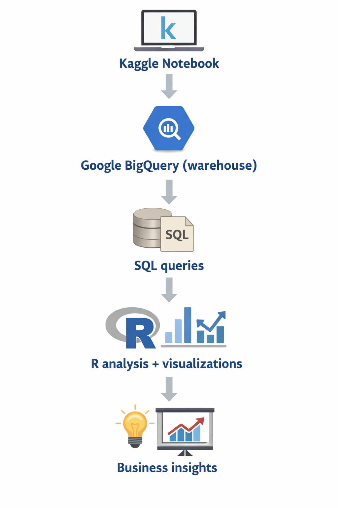

# Olist Marketplace Analysis
### Retention, Logistics Performance & Operational Risk

Data-driven analysis of the **Olist Brazilian e-commerce marketplace (2016–2018)** using SQL queries executed in **Google BigQuery** and analyzed in a **Kaggle R notebook**.

The goal of this project is to identify operational bottlenecks and growth opportunities by analyzing:

- marketplace growth (GMV trends)
- logistics performance (delivery delays & route bottlenecks)
- seller risk concentration
- customer retention patterns

---

# Project Snapshot

Dataset: Olist Brazilian E-Commerce Marketplace  
Time Period: 2016–2018  

Orders analyzed: ~100,000  
Customers: ~96,000  
Sellers: ~3,000  

Warehouse: Google BigQuery  
Analysis: Kaggle R Notebook (SQL, R)

---

# Key Findings

- **Delivery delays are the primary driver of dissatisfaction**  
  Crossing the 3-day delay threshold increases negative reviews by ~265%.

- **Operational risk is highly concentrated**  
  Only ~2% of sellers account for ~22% of revenue exposed to delay risk.

- **Logistics bottlenecks are route-specific**  
  14 delivery corridors represent ~28% of platform volume.

- **Retention is extremely low**  
  ~94% of GMV comes from one-time buyers.

These insights translate into targeted operational and growth strategies documented in the **Executive Summary**.

---

# Start Here

| Section | Description |
|------|------|
| `docs/executive_summary.md` | Strategic findings and recommendations |
| `questions/` | 18 business questions with SQL queries and visualizations |
| `sql/` | Standalone BigQuery SQL queries |
| `notebooks/` | Kaggle R notebook used for the analysis |
| `reproducibility/` | Instructions and BigQuery connection setup |

---

## Dataset Schema (ERD)

The analytical warehouse is built on the Olist marketplace dataset,
linking orders, customers, sellers, products, payments and reviews.

---
# Repository Structure

---

# Data Source

Dataset: **Olist Brazilian E-Commerce Public Dataset**

- ~100k orders
- ~90k customers
- ~3k sellers
- time span: **2016–2018**

The dataset contains information about:

- orders
- payments
- products
- sellers
- delivery logistics
- customer reviews

---

# Tools Used

**Data Warehouse**

- Google BigQuery

**Analysis Environment**

- R (Kaggle Notebook)

**Core Libraries**

- bigrquery
- DBI
- dplyr
- ggplot2
- lubridate

---

# Reproducibility

Instructions to reproduce the analysis:

`reproducibility/run_instructions.md`

BigQuery connection documentation:

`reproducibility/bigquery_connection.md`

Helper utilities used in the notebook:

`docs/helper_functions.md`

## Project Architecture

