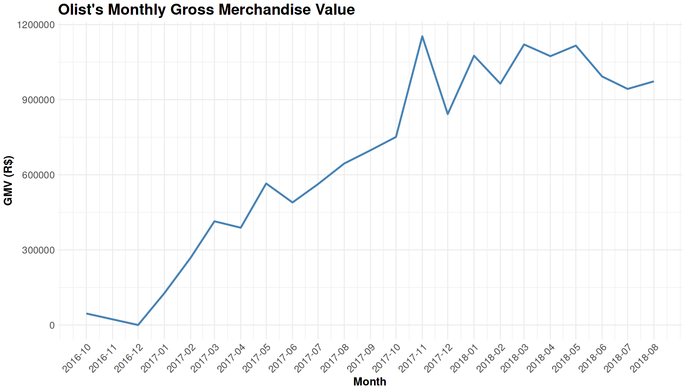

**Marketplace Growth → q01 GMV Trends**

# Business Question 1 — Marketplace GMV & Revenue Trends

## Question

**What is Olist's total Gross Merchandise Value (GMV) for delivered orders, and how has monthly revenue evolved between 2016 and 2018?**

---

## Why This Matters

* Gross Merchandise Value (GMV) provides a high-level indicator of marketplace scale and demand.  
* Analyzing GMV trends over time provides insight into the platform’s growth trajectory and helps assess whether Olist experienced early-stage adoption, rapid expansion, or operational stabilization.

---

## Analytical Approach

The objective of this analysis was to quantify the total GMV generated by completed transactions and examine how revenue evolved over time.

**Metric definition:** GMV was calculated as the **sum of valid payment values for orders with a final status of `delivered`**.

**Data integrity filters:** To ensure reliable results:

- Only orders with valid chronological timelines were included (`timeline_is_valid = 1` [`order_purchase_timestamp` =< `order_approved_at` =< `order_delivered_carrier_date` =< `order_delivered_customer_date`])
- Orders classified as **"hanging"** (still within a normal delivery window) were excluded to avoid misclassifying in-progress transactions

**Financial noise reduction:** Payments below **1 BRL** and zero-value payments were removed because they typically represent vouchers or technical artifacts rather than genuine purchases.

---

## Analysis Implementation

All aggregation and visualization were performed in **R within the Kaggle notebook** after the cleaned datasets were prepared in **Google BigQuery**.

Revenue was aggregated **monthly** using `order_purchase_timestamp` to identify distinct growth phases.

This time series was used to analyze revenue trends and identify phases of marketplace growth.

---

## Visualisations

*Figure 1.1 — Olist’s Monthly Gross Merchandise Value (2016–2018), showing the transition from early marketplace growth to operational stabilization.*

---

## Key Findings

* **Marketplace scale:** Olist generated approximately **15.5M BRL in GMV** between October 2016 and August 2018.  

* **2017 acceleration:** The platform moved from an early adoption phase in late 2016 into rapid expansion during 2017, with monthly GMV increasing to roughly **700K BRL**.  

* **2018 maturation:** By 2018 the marketplace reached a stable high-volume phase, with monthly revenue consistently ranging between **900K and 1.1M BRL**.  
 
* **Data robustness:** Validation confirmed that aggregating payment values at the **individual payment level** and **order level** produced identical results, ensuring the structural integrity of the financial data (Additionally, this robustness is supported by the **Payment-Item Integrity Check** performed during the "Prepare and Process" phase, which confirmed near-perfect consistency (99.9% coverage) between the total amount paid by customers and the combined price and freight of items for delivered orders).

---

## Insight

➜ The GMV trajectory indicates a classic marketplace growth pattern: early adoption in 2016, rapid expansion throughout 2017, and operational stabilization by 2018.  
 

This pattern suggests that **Olist successfully scaled transaction volume while maintaining consistent fulfillment performance**, laying the foundation for further marketplace development.

---

## Next Question

➡️ Next: If GMV increased significantly during this period, the next step is to understand how **order volume evolved over time** and whether revenue growth was driven primarily by more transactions. 
[q02 - Order Volume Trends](../q02_order_volume_trends/q02_README.md)
