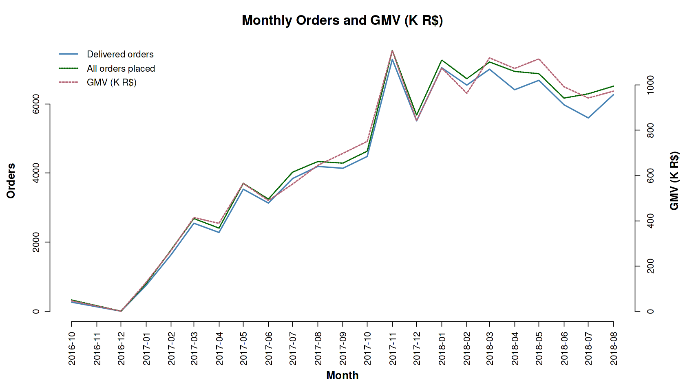

**Marketplace Growth → Q02 Order Volume Trends**

# Business Question 2 — Order Volume & GMV Relationship

## Question

**How many orders were placed on Olist over time, and how does monthly order volume relate to the GMV trend?**

---

## Why This Matters

Understanding the relationship between order volume and Gross Merchandise Value (GMV) helps determine whether marketplace growth is driven by **more transactions** or **changes in transaction value**.

Comparing **all orders** with **delivered orders** also provides a high-level view of operational reliability and fulfillment performance as the marketplace scales.

---

## Analytical Approach

This analysis compares the evolution of total orders placed on the platform with successfully delivered orders and their associated revenue.

**Main datasets**

- `orders`
- `order_payments`

**Key filters**

Two order series were analyzed:

- **All orders:** no status filter applied to capture the full order funnel.
- **Delivered orders:** filtered for  
  > * `order_status = 'delivered'`  
  > * `timeline_is_valid = 1`  
  > * `is_hanging = 0`  

This ensures that only **completed and operationally valid transactions** are included in fulfillment and GMV calculations.

**Derived metrics**:

- `total_orders_n` — total orders placed
- `delivered_orders_n` — successfully fulfilled orders
- `GMV` — sum of payment values (expressed in thousand BRL)  

**Granularity**: All metrics were aggregated **monthly** using `order_purchase_timestamp`.  

---

## Analysis Implementation

Aggregation and visualization were performed in **R within the Kaggle notebook** after the cleaned datasets were prepared in **Google BigQuery**.

Monthly order counts and GMV were calculated and visualized to compare:

- total order volume
- delivered order volume
- revenue (GMV)

---

## Visualization

*Figure 2.1 — Monthly comparison of all orders, delivered orders, and GMV (thousand BRL), illustrating the relationship between transaction volume and revenue.*

---

## Key Findings

**Volume–value correlation**: Order volume and GMV increased rapidly from late 2016 through mid-2017 before stabilizing at a high activity level throughout 2018.  

**Fulfillment stability**: The series representing **all orders** consistently sits slightly above the **delivered orders** series with a small and stable gap.  

**Delivery rate**: This gap corresponds to an approximate **97% delivery success rate**, indicating that only a small proportion of orders fail to complete.  

**Seasonal demand**: A clear spike in activity occurs in **late 2017**, likely reflecting strong seasonal demand associated with Black Friday and Christmas.  

---

## Insight

➜ The marketplace demonstrates a healthy maturation pattern.  
Operational capacity scaled effectively alongside the rapid demand growth observed in 2017, without introducing meaningful increases in non-delivery risk.

➜ The close alignment between **delivered orders and GMV** suggests that revenue growth is primarily driven by increasing transaction volume rather than changes in average order value.

---

## Next Question

If the delivery rate is consistently high, the next step is to examine **how delivery performance varies over time** and whether certain periods show higher risk of non-delivery.

➡️ See: [q03 Delivery Reliability Trends](../q03_delivery_reliability_trends/q03_README.md)