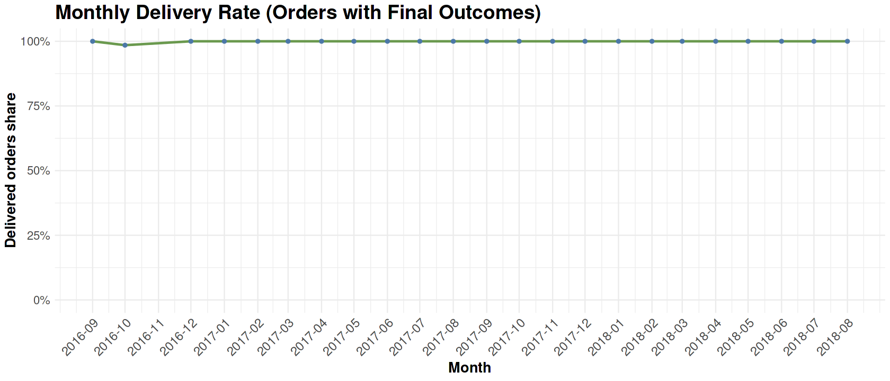

**Marketplace Growth → Q03 Delivery Reliability Trends**

# Business Question 3 — Delivery Reliability Over Time

## Question

**How does delivery performance vary over time, and are there months where customers are more likely to experience non-delivery?**

---

## Why This Matters

Tracking monthly delivery rates provides a high-level view of operational reliability and helps identify potential logistics bottlenecks. If fulfillment performance deteriorates during peak seasons or rapid growth phases, it may signal capacity constraints or weaknesses in the delivery network.

Understanding these patterns allows Olist to better manage customer expectations and maintain service quality as the marketplace scales.

---

## Analytical Approach

To accurately measure fulfillment performance, the analysis distinguished between genuine delivery failures and orders that were still within a normal delivery window.

**Main dataset**

- `orders`

**Key filters**

To ensure reliable results:

- Orders flagged as **“hanging”** (`is_hanging = 0`) were excluded. These are orders that have not yet exceeded the maximum observed delivery duration for their category and may still complete successfully.
- Only orders with valid chronological timelines were included (`timeline_is_valid = 1`).

**Derived metrics**

- `delivery_rate` — delivered orders divided by total orders with final outcomes
- `non_delivery_rate` — proportion of orders that ultimately failed to complete

**Granularity**

All metrics were aggregated **monthly** using `order_purchase_timestamp`.

---

## Analysis Implementation

Aggregation and visualization were performed in **R within the Kaggle notebook** after the cleaned datasets were prepared in **Google BigQuery**.

Monthly delivery performance metrics were calculated to evaluate:
> - delivery success rates
> - non-delivery rates
> - stability of fulfillment performance over time

---

## Visualisations

*Figure 3.1 — Monthly delivery rate (orders with final outcomes), showing rapid improvement after launch and consistently near-perfect fulfillment performance.*

*Figure 3.2 — Monthly non-delivery rate highlighting a minor spike during the early platform launch period followed by effectively near-zero failure.*

---

## Key Findings

**High operational stability**

After the initial ramp-up phase in late 2016, the monthly delivery rate remained consistently close to **100%** throughout the rest of the 2016–2018 period.

**Adjusted performance**

While the raw average delivery rate across all orders was **87.9%**, restricting the analysis to orders that reached a final outcome (filtering out `is_hanging = 1` orders) increases the success rate to **99.9%**.

**Launch-phase anomaly**

A small spike in non-delivery (approximately **1.5%**) occurred in **October 2016**, likely reflecting early operational immaturity or low initial order volumes during the marketplace launch.

**No seasonal degradation**

Beyond the launch period, there is **no evidence of seasonal performance deterioration**, indicating that Olist’s logistics network handled demand spikes effectively.

---

## Insight

Olist demonstrates extremely strong fulfillment reliability. As the marketplace scaled rapidly during 2017, delivery completion rates remained consistently high, indicating that the logistics infrastructure expanded successfully alongside marketplace demand.

This suggests that the platform’s operational challenges are likely related to **delivery speed and delays**, rather than the completion of orders themselves.

---

➡️ **Next:** [q04 Seller Product Concentration](../q04_seller_product_concentration/q04_README.md)
