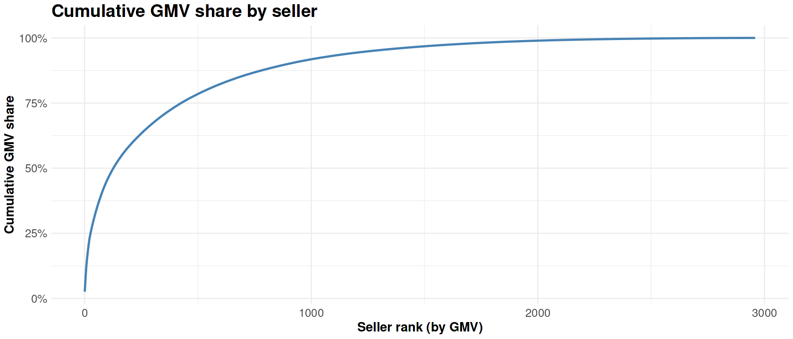

**Marketplace Growth → q04 Seller GMV Concentration**

# Business Question 4 — Marketplace Concentration

## Question

**How concentrated is Olist’s GMV and order volume across sellers and products?**

---

## Why This Matters

Understanding marketplace concentration helps determine whether platform performance depends on a small set of dominant participants or is supported by a broad base of sellers and products.

If a large share of GMV is generated by only a few sellers, the marketplace may face **systemic risk** if those key contributors leave the platform. Conversely, a diversified seller base indicates a more resilient marketplace structure.

---

## Analytical Approach

To evaluate marketplace concentration, the analysis applied formal economic metrics to the distribution of seller-level GMV.

**Main datasets**

- `orders`
- `order_items`
- `order_payments`

**Key filters**

To ensure the analysis reflects genuine completed transactions:

- `order_status = 'delivered'`
- `timeline_is_valid = 1`
- `is_hanging = 0`

Payments below **1 BRL** and zero-value payments were excluded to remove technical artifacts and voucher adjustments.

**Metrics used**

Two complementary metrics were used to measure concentration:

- **Gini Coefficient** — measures inequality in the distribution of GMV across sellers.
- **Herfindahl–Hirschman Index (HHI)** — measures overall market concentration by summing squared market shares, giving greater weight to dominant players.

**Granularity**

Seller-level contributions were calculated and ranked to evaluate cumulative GMV share across the marketplace.

---

## Analysis Implementation

Seller-level GMV contributions were calculated in **R within the Kaggle notebook** using the cleaned BigQuery tables.

The resulting ranked seller distribution was used to compute:
> - cumulative GMV share
> - Gini coefficient
> - Herfindahl–Hirschman Index (HHI)

These metrics provide complementary perspectives on marketplace inequality and concentration risk.

---

## Visualisations

*Figure 4.1 — Cumulative GMV share by seller. The steep initial slope followed by a gradual flattening illustrates a right-skewed long-tail distribution.*

---

## Key Findings

* **Leading seller contribution:**
> - The top **10 sellers (out of ~3,000)** account for **14.32% of total GMV**.    
> - The top **50 sellers contribute 33.36%**, and the top **100 sellers capture approximately 45.47%**.  

* **High inequality:** The **Gini coefficient of 0.787** indicates a highly unequal distribution of revenue, where a relatively small fraction of sellers generates a large share of marketplace GMV.

* **Low structural concentration:** Despite this inequality, the **HHI value of 0.0039** remains far below the 0.01 threshold for a concentrated market. This indicates that no single seller or small group of sellers dominates the marketplace.

* **Diversified marketplace base:** A significant portion of GMV is generated by a broad base of mid-tier and smaller sellers, forming a substantial economic "long tail".

---

## Insight

➜ Olist exhibits the typical structure of a **healthy long-tail marketplace**. While top sellers contribute disproportionately to GMV, the platform is not structurally dependent on any single participant.

➜ This combination of **high inequality but low concentration risk** indicates that the marketplace is resilient: losing a small number of top sellers would affect revenue but would not threaten overall platform stability.

---

## Next Question

➡️ **Next:** Having confirmed that the seller base is diversified despite high inequality, the next step is to examine demand concentration at the category level: "Which product categories drive most of Olist’s GMV and orders, and how stable is this mix over time?" [q05 Category GMV Mix](../q05_category_gmv_mix/q05_README.md)
