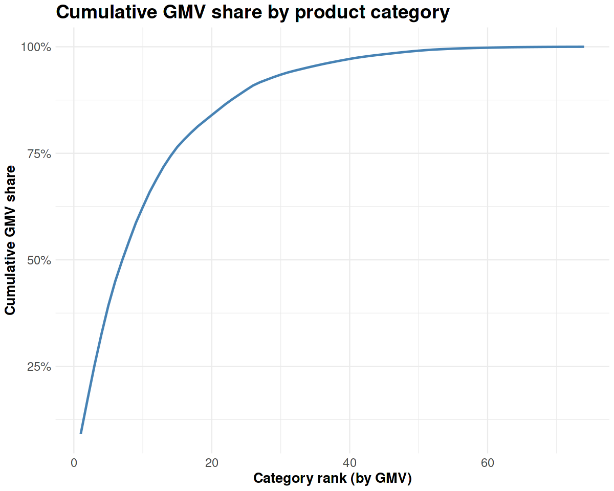
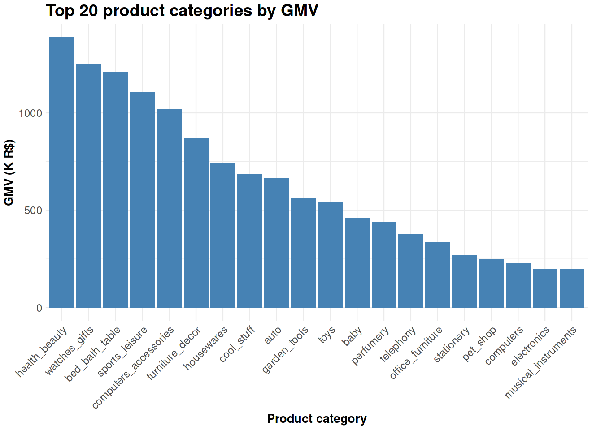

**Marketplace Growth → Q05 Category GMV Mix**

# Business Question 5 — Product Category Revenue Drivers

## Question

**Which product categories drive most of Olist’s GMV and orders, and how stable is this mix over time?**

---

## Why This Matters

Understanding where demand is concentrated at the product-category level helps identify the marketplace’s primary revenue engines.  

This analysis distinguishes between high-performing **"cash cow" categories** that drive a large share of GMV and therefore represent the categories with the greatest direct influence on marketplace growth and revenue sensitivity. These insights inform assortment strategy, marketing focus, and help evaluate how concentrated marketplace demand truly is.

---

## Analytical Approach

To identify the categories driving marketplace value, the analysis first reconstructed GMV at order level from payment data, then allocated that GMV to order items proportionally before aggregating to product category level.  

**Key filters**

To ensure only completed and operationally valid transactions were included:

- `order_status = 'delivered'`
- `timeline_is_valid = 1`
- `is_hanging = 0`

Payment rows flagged as `micro-payments` or `zero-value payments` were excluded before reconstructing order-level GMV, to reduce the influence of technical placeholders and voucher-related artifacts.  

**Derived metrics**

- **Allocated item-level GMV** — calculated by allocating reconstructed order-level GMV to individual items proportionally based on each item’s share of `price + freight_value` within the order.
- **Cumulative GMV share** — running percentage of total GMV when categories are ranked from highest to lowest revenue contribution.

**Granularity**

GMV was reconstructed at order grain, allocated at order-item grain, and then aggregated to product category level. Monthly time buckets were derived from purchase date for category-mix trend analysis.   

---

## Analysis Implementation

Category-level GMV contributions were calculated in **R within the Kaggle notebook** using cleaned datasets prepared in **Google BigQuery**.  

* The workflow was:  

1. filter valid delivered orders from orders  
2. collapse payment records to order-level GMV  
3. compute item weights within each order using price + freight_value  
4. allocate order-level GMV to order items proportionally  
5. map items to product categories  
6. aggregate allocated GMV and category-attributed distinct order counts by category

* Categories were ranked by GMV to evaluate:

- revenue concentration across the product catalogue
- cumulative contribution of top categories
- the presence of a long-tail marketplace structure.

---

## Visualisations

*Figure 5.1 — Cumulative GMV share by product category. The steep rise among the first categories followed by gradual flattening indicates a strong long-tail distribution.*

*Figure 5.2 — Top 20 product categories ranked by GMV, highlighting the dominant contribution of health_beauty, watches_gifts, and bed_bath_table.*

---

## Key Findings

* **Meaningful category concentration:** Olist’s marketplace is strongly anchored in a core group of lifestyle and consumer goods categories, that act as primary revenue drivers, while the remaining **40+ categories contribute marginal shares individually.**

* **Revenue leaders:** The highest-performing categories are:
> * **health_beauty** (~1.39M BRL)
> * **watches_gifts** (~1.25M BRL)
> * **bed_bath_table** (~1.21M BRL)

* **Platform impact:** The **top three categories alone generate approximately 25% of total GMV**, indicating strong demand concentration and highlighting the importance of a small number of major revenue drivers.  

* **Long-tail structure:** The **top 20 categories account for nearly 84% of total GMV**, while the remaining categories form a broad lower-revenue tail.  

---

## Insight

➜ Olist’s marketplace is structurally dependent on a core group of **lifestyle and consumer goods categories** that serve as primary revenue engines.

➜ While the platform benefits from offering a wide assortment, overall marketplace growth and stability are disproportionately influenced by the performance of these leading categories. Strategic initiatives, such as seller recruitment, promotion campaigns, and inventory optimization, - are therefore likely to deliver the greatest impact when focused on these high-volume segments.

---

## Next Question

➡️ **Next:** With the revenue-driving categories identified, the next step is to understand the customer base behind these transactions: "How many customers are one-time buyers vs repeat buyers, and how much GMV comes from repeat customers?" [q06 Repeat Customer Share](../../02_customer_behavior/q06_repeat_customer_share/q06_README.md)
