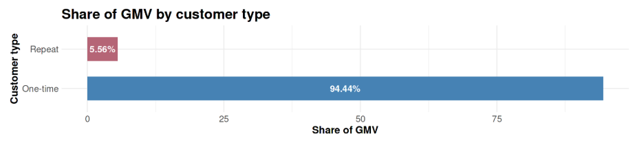

**Customer Behavior → Q06 Repeat Customer Share**

# Business Question 6 — One-Time vs Repeat Customers

## Question

**How many customers are one-time buyers vs repeat buyers, and how much GMV comes from repeat customers?**

---

## Why This Matters

Understanding the balance between **new customer acquisition** and **customer retention** is critical for evaluating the long-term sustainability of a marketplace.

Repeat buyers typically generate **higher Lifetime Value (LTV)** and require lower acquisition costs compared to new customers. Measuring how much revenue is driven by repeat customers helps determine whether the platform relies primarily on continuous acquisition or benefits from a strong returning user base.

---

## Analytical Approach

To distinguish between acquisition-driven and retention-driven revenue, the analysis mapped transactions to unique customer identities and classified their purchase behavior.

**Main datasets**

- `orders`
- `customers`
- `order_payments`

**Data linkage**: Orders were joined to customers using `customer_id`, allowing each transaction to be mapped to a **customer_unique_id**, which represents the true individual customer.

**Customer segmentation**: Customers were grouped by their total number of successfully delivered orders:

- **One-time buyers** — exactly **1 delivered order**
- **Repeat buyers** — **2 or more delivered orders**

**Aggregation**: For each segment the analysis calculated:  

- share of total customers  
- total GMV contribution  
- average GMV per customer  

---

## Analysis Implementation

Customer-level aggregation was performed in **R within the Kaggle notebook** using cleaned datasets prepared in **Google BigQuery**.

Customer purchase counts were calculated to identify repeat behavior, after which revenue metrics were aggregated at the **customer segment level**.

---

## Visualisations

*Figure 6.1 — Share of total GMV generated by one-time versus repeat buyers.*

---

## Key Findings

* **Acquisition dominance:** The overwhelming majority of marketplace revenue — **94.44% of total GMV** — is generated by **one-time buyers**.  

* **Retention gap:** Repeat buyers represent only about **3% of the total customer base**, indicating very limited repeat purchasing behavior.  

* **Financial contribution:** Despite their small numbers, repeat customers contribute **5.56% of total GMV**, demonstrating meaningful economic impact relative to their size.  

* **Higher individual value:** Repeat buyers generate approximately **92% more GMV per customer** compared to one-time buyers over their relationship with the platform.

---

## Insight

➜ Olist currently behaves largely as a **"one-shot" marketplace**, where most customers make a single purchase and do not return.

➜  However, the analysis reveals a strong opportunity: repeat buyers already demonstrate **significantly higher economic value per customer**. Even modest improvements in repeat purchase rates could meaningfully increase GMV while reducing reliance on constant new customer acquisition.

---

## Next Question

➡️ **Next:** Having confirmed that repeat buyers are disproportionately valuable, the next step is to examine the specific economics of their transactions: "How do the unit economics (average order value) differ between one‑time and repeat customers, and what does this imply for where the business should invest?"
[q07 Repeat Customer Unit Economics](../q07_repeat_customer_unit_economics/q07_README.md)
