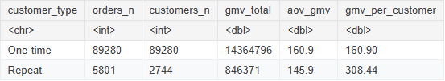

**Customer Behavior → Q07 Repeat Customer Unit Economics**

# Business Question 7 — Unit Economics by Customer Type

## Question

**How do the unit economics (average order value, margin per order, and acquisition/retention costs) differ between one-time and repeat customers, and what does this imply for where the business should invest to maximize long-term profit?**

---

## Why This Matters

Understanding the unit economics of different customer segments helps determine where the marketplace should focus its investment.

If repeat customers generate significantly higher **Lifetime Value (LTV)** than one-time buyers, Olist could shift its strategy away from expensive customer acquisition and toward **retention-focused initiatives**, such as loyalty programs, targeted promotions, and remarketing campaigns.

---

## Analytical Approach

To evaluate the economic differences between customer segments, the analysis mapped financial transactions to individual customer identities and compared key revenue metrics.

**Main datasets**

- `orders`
- `customers`
- `order_payments`

**Data linkage**: Orders were joined with customer records using `customer_id`, allowing transactions to be mapped to the unique customer identifier `customer_unique_id`.  

**Customer segmentation**: Customers were categorized based on their number of completed purchases:

> * **One-time buyers** — exactly **1 delivered order**  
> * **Repeat buyers** — **2 or more delivered orders**  

**Key metrics**

The following metrics were calculated for each segment:

- **Average Order Value (AOV)** — total GMV divided by total orders
- **GMV per Customer** — total GMV divided by total unique customers

**Comparison**: A gap analysis compared transaction-level value (AOV) against the overall customer relationship value (GMV per customer).  

---

## Analysis Implementation

Customer-level revenue metrics were calculated in **R within the Kaggle notebook** using cleaned datasets prepared in **Google BigQuery**.

Aggregations were performed to measure order-level value and customer-level lifetime revenue across the two customer segments.

---

## Visualisations

*Figure 7.1 — Unit economics comparison between one-time and repeat customers.*

---

## Key Findings

**Higher transaction value for one-time buyers**: One-time buyers exhibit slightly higher **Average Order Value (AOV)**, suggesting that their individual purchases tend to involve marginally larger baskets.  

**Higher lifetime value for repeat customers**: Despite slightly smaller individual orders, repeat customers generate significantly greater **total GMV per customer** due to multiple purchases over time.  

**Substantial economic advantage**: On a per-customer basis, repeat buyers are nearly **twice as valuable** as one-time buyers over their lifetime on the platform.  

---

## Insight

➜ The analysis highlights a clear economic advantage in cultivating repeat customers. While acquiring new buyers remains important for marketplace growth, the long-term profitability of the platform depends heavily on its ability to convert first-time buyers into repeat customers.

➜ Even modest improvements in retention rates could substantially increase overall GMV and reduce reliance on expensive customer acquisition strategies.

---

➡️ **Next:** [q08 Customer Order Distribution](../q08_customer_order_distribution/q08_README.md)