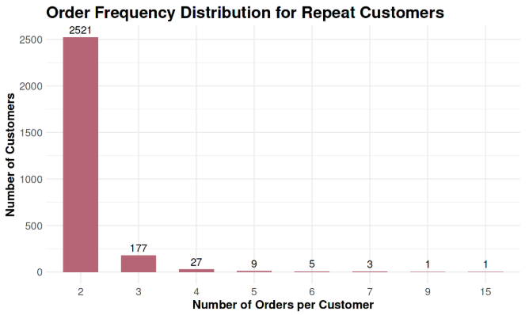

**Customer Behavior → q08 Customer Order Distribution**

# Business Question 8 — Customer Order Frequency

## Question

**How many orders does the average one-time vs repeat customer place, and how skewed is ordering behavior within each group?**

---

## Why This Matters

Understanding how frequently customers purchase helps reveal whether repeat behavior reflects **habitual engagement** or merely occasional follow-up purchases.

By examining the distribution of orders per customer, Olist can determine whether growth opportunities lie in nurturing a small group of highly loyal customers or in moving a large number of one-time buyers toward a second purchase.

---

## Analytical Approach

The analysis examined the distribution of completed purchases per unique customer identity.

**Main dataset**

- `customer_summary` (derived from `orders` and `customers`)

**Key filters**: Only **delivered orders** were included to ensure that the analysis reflects completed transactions.  

**Derived metrics**: To evaluate the distribution of order frequency, the following statistics were calculated:  

> *  **Mean orders per customer**
> *  **Median orders per customer**
> *  **90th percentile (P90)**
> *  **Maximum observed orders**

**Segmentation**: Customers were segmented into two groups:  

- **One-time buyers** — exactly 1 completed order
- **Repeat buyers** — 2 or more completed orders

---

## Analysis Implementation

Customer purchase counts were calculated in **R within the Kaggle notebook** using the cleaned datasets prepared in **Google BigQuery**.

A summary dataset was generated at the **customer level**, enabling statistical analysis of purchase frequency within each segment.

---

## Visualisations

*Figure 8.1 — Distribution of order frequency among repeat customers, highlighting the strong right-skew in purchasing behavior.*

---

## Key Findings

* **One-time buyer dominance:** Approximately **97% of customers place exactly one order**, showing limited natural repeat purchasing behavior during the observed period.  

* **Low repeat frequency:** Among repeat buyers, the **average purchase frequency is approximately 2.1 orders per customer**.  

* **Highly skewed distribution:** Ordering behavior among repeat buyers is strongly **right-skewed**, with both the **median and the 90th percentile equal to 2 orders**.  

* **Small "elite" segment:** A very small fraction of customers demonstrates strong loyalty, with the **maximum observed purchase frequency reaching 15 orders**.  

---

## Insight

➜ Repeat purchasing on Olist appears **episodic rather than habitual**. Even among repeat buyers, most customers make only one additional purchase.

➜ This suggests that the greatest growth opportunity lies not in cultivating a small group of power users but in **converting one-time buyers into second-time buyers**, where the majority of potential customer value remains unrealized.

---

## Next Question

➡️ **Next:** Having defined the frequency segments, the next step is to understand the profile of these users: "How do customer demographics and purchase characteristics differ between one‑time, light‑repeat (2 orders), and heavy‑repeat (3+ orders) customers?
[q09 Repeat Customer Demographics](../q09_repeat_customer_demographics)

