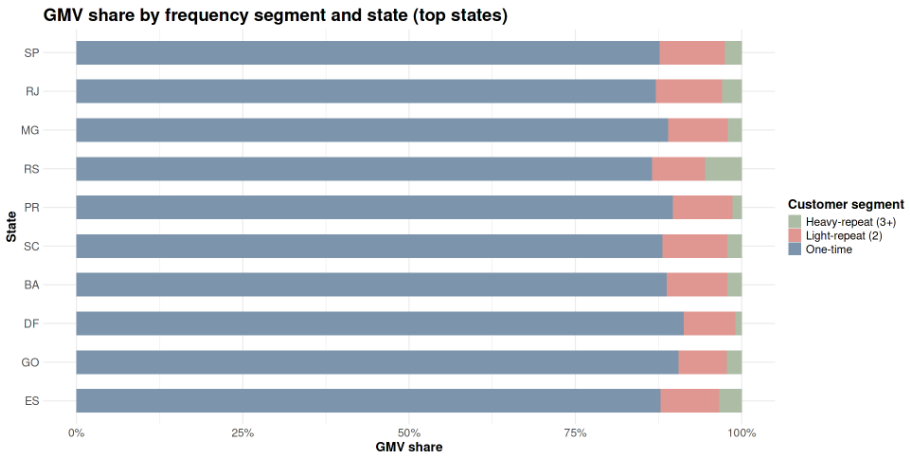

**Customer Behavior → Q09 Repeat Customer Demographics**

# Business Question 9 — Profile of Repeat Buyers

## Question

**How do customer demographics and purchase characteristics differ between one-time, light-repeat (2 orders), and heavy-repeat (3+ orders) customers?**

---

## Why This Matters

Understanding the demographic and behavioral profile of high-value customers allows Olist to target retention strategies more effectively.

By identifying which **regions, payment methods, and purchasing patterns** are associated with repeat behavior, the platform can design targeted incentives that encourage one-time buyers to transition into higher-value repeat segments.

---

## Analytical Approach

To profile customer segments, the analysis combined behavioral transaction data with geographic and payment information.

**Main datasets**

- `customer_summary` (behavioral purchase history)
- `customers` (geographic attributes)
- `order_payments` (payment behavior)

**Key filters**

The analysis was restricted to **successfully delivered orders** to ensure only completed transactions were considered.

**Customer segmentation**

Customers were categorized using a derived variable `freq_segment`:

- **One-time buyers** — 1 order
- **Light-repeat buyers** — 2 orders
- **Heavy-repeat buyers** — 3 or more orders

**Aggregation**

Segment-level analysis examined how GMV and transaction behavior differed across:

- Brazilian states
- payment methods

---

## Analysis Implementation

Segment-level aggregations were calculated in **R within the Kaggle notebook** using datasets cleaned and prepared in **Google BigQuery**.

Customer-level transaction data was grouped to identify how geographic location and payment behavior correlate with repeat purchasing patterns.

---

## Visualisations

*Figure 9.1 — GMV share by customer frequency segment and state (top states), highlighting the geographic concentration of repeat buyers in Brazil’s major economic regions.*

---

## Key Findings

**Credit card dominance**: Credit card payments account for the majority of GMV across all customer segments and are particularly associated with repeat purchasing behavior.  

**Heavy-repeat economics**: Among heavy-repeat customers (3+ orders), credit card users generate the majority of value.    
Approximately **179 credit-card customers generate ~85K BRL in GMV**, compared to roughly **25K BRL from Boleto users**.  

**Boleto propensity among one-time buyers**: One-time buyers exhibit a significantly higher share of transactions via **Boleto**, contributing approximately **2.56M BRL in GMV** through this payment method.  

**Geographic concentration**: Repeat purchasing behavior is strongly concentrated in Brazil’s largest economic regions:  

> * São Paulo (SP)
> * Rio de Janeiro (RJ)
> * Minas Gerais (MG)
> * Paraná (PR)

---

## Insight

➜ Customer loyalty on the Olist platform is strongly associated with **credit card usage and geographic concentration in Brazil’s South and Southeast regions**.

➜ While one-time buyers use a wider range of payment methods, repeat purchasers tend to prefer the convenience of card payments. This suggests that the most effective retention strategy may involve **targeting credit card users in high-volume states** and encouraging them to complete a second purchase.

➜ At the same time, targeted incentives for **Boleto users** could help reduce friction and encourage repeat engagement among customers who may face payment barriers.

---

➡️ **Next:** [q10 Category Mix by Repeat Segment](../q10_category_mix_by_repeat_segment/q10_README.md)