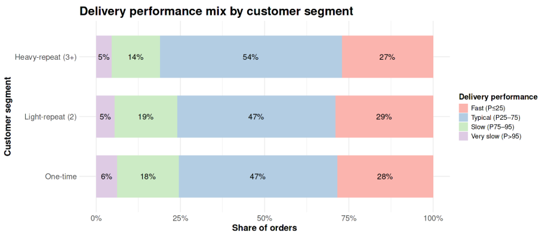
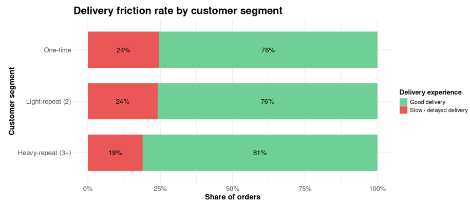

**Operations & Logistics → q11 Delivery Speed vs Repeat Rate/Customer Loyalty**

# Business Question 11 — Delivery Speed and Customer Loyalty

## Question

**How do delivery times and delays differ between one-time, light-repeat, and heavy-repeat customers, and is faster, more reliable delivery associated with higher repeat purchase behaviour?**

---

## Why This Matters

This analysis evaluates whether **logistics performance acts as a catalyst for customer loyalty**.
Delivery speed is often assumed to be a key driver of customer loyalty in e-commerce. If faster delivery significantly increases the likelihood of repeat purchases, Olist could justify aggressive investments in high-speed logistics infrastructure.

However, if delivery performance is similar across all customer segments, it suggests that other factors—such as product variety, pricing, or category preference—may play a larger role in encouraging repeat purchases.

Understanding the role of logistics in retention helps determine whether operational investments in delivery speed would meaningfully improve customer lifetime value.

---

## Analytical Approach

To investigate the relationship between logistics performance and customer loyalty, the analysis compared delivery outcomes across different customer frequency segments.

**Main datasets**

- `delivered_orders`
- `order_items`

**Key filters**

The analysis was restricted to **delivered orders with valid chronological timelines** to ensure that delivery performance metrics reflect completed and internally consistent transactions.

**Derived metrics:**

**delivery_performance** — a four-tier classification based on category-specific benchmarks:  
  > - **1 = Fast**  
  > - **2 = Typical**  
  > - **3 = Slow**  
  > - **4 = Very Slow**

**Customer frequency segments:** Customers were classified based on their order history:
> - **One-time buyers** — 1 order  
> - **Light-repeat buyers** — 2 orders  
> - **Heavy-repeat buyers** — 3 or more orders

**Delivery performance metric:** Delivery speed was categorized using **category-specific percentile benchmarks**:

| Performance Tier | Definition |
|---|---|
| Fast | ≤ P25 delivery time |
| Typical | P25–P75 |
| Slow | P75–P95 |
| Very Slow | > P95 |

This normalization ensures fair comparisons across product categories with different logistical characteristics.

**Aggregation level:** The analysis measures the **share of orders within each delivery performance tier for every customer segment**.

**Granularity:** Delivery performance was evaluated using:  
> - **Average delivery days per segment**
> - **Share of orders across performance tiers**

---

## Analysis Implementation

Delivery performance metrics were calculated in **R within the Kaggle notebook** using datasets cleaned and prepared in **Google BigQuery**.

Orders were classified into delivery performance tiers and compared across customer segments to determine whether faster shipping correlates with repeat purchasing behaviour.

---

## Visualisations

*Figure 11.1 — Delivery performance mix by customer segment, showing that the distribution of delivery speeds (Fast, Typical, Slow, Very Slow) remains highly consistent across different customer loyalty levels.*

*Figure 11.2 — Delivery friction rate by customer segment, comparing the share of “Good” delivery experiences (Fast + Typical) versus delayed experiences (Slow + Very Slow).*

---

## Key Findings

* **Consistent Core Experience:** Delivery performance is highly uniform across customer segments. For all groups:  
> - roughly **47–54% of orders fall into the "Typical" range**  
> - approximately **27–29% are classified as "Fast"**  

This indicates a stable logistics experience regardless of customer loyalty.  

* **No Speed Advantage for Loyal Customers:** Heavy-repeat buyers do **not receive systematically faster deliveries** than one-time buyers. The delivery performance distribution remains nearly identical across all segments.  

* **Tolerance for Logistics Friction:** Even among heavy-repeat customers approximately **19% of orders are classified as Slow or Very Slow**. 
This demonstrates that loyal customers continue purchasing despite occasional delivery delays.  

* **Marginal Differences:** One-time buyers experience a slightly higher proportion of **Very Slow deliveries (6.2%)** compared to heavy-repeat buyers (**4.6%**). However, the gap is too small to meaningfully explain differences in repeat behaviour.  

---

## Insight

➜ Delivery speed does **not appear to be the primary driver of customer loyalty on the Olist platform**.

➜ Because repeat buyers experience delivery performance similar to one-time buyers, their decision to return is likely influenced by other factors such as:

- product assortment
- category affinity
- pricing competitiveness

➜ While reducing slow deliveries remains important for maintaining overall customer satisfaction, the most effective strategy for increasing repeat purchases likely lies in **merchandising, product recommendations, and targeted retention initiatives** rather than purely logistical improvements.

---

## Next Question

➡️ **Next:** If delivery speed isn't the primary differentiator for loyalty, the next step is to examine subjective satisfaction: "How do customer review scores differ between one‑time, light‑repeat, and heavy‑repeat customers, and are higher review scores associated with higher repeat‑purchase behaviour?"
[q12 Reviews vs Repeat Rate](../../04_profitability_and_risk/q12_reviews_vs_repeat_rate/q12_README.md)

