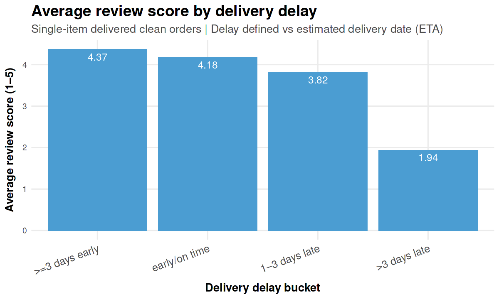
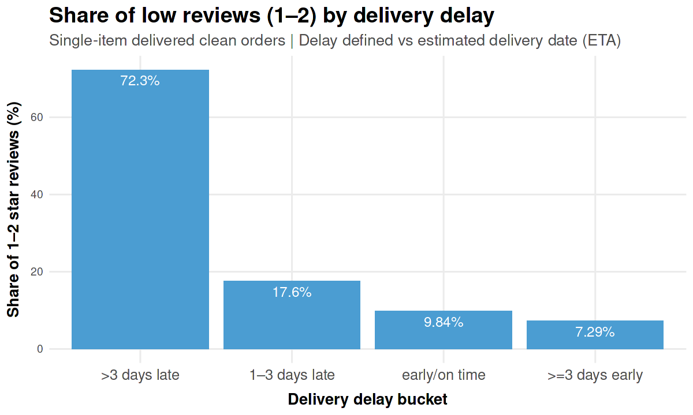
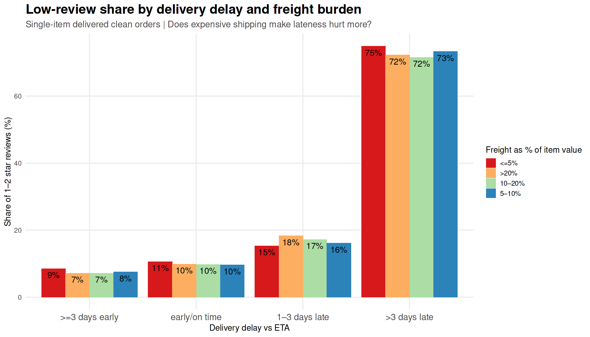
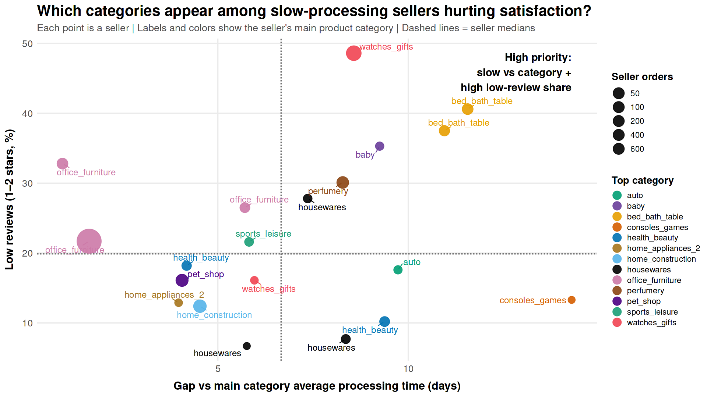
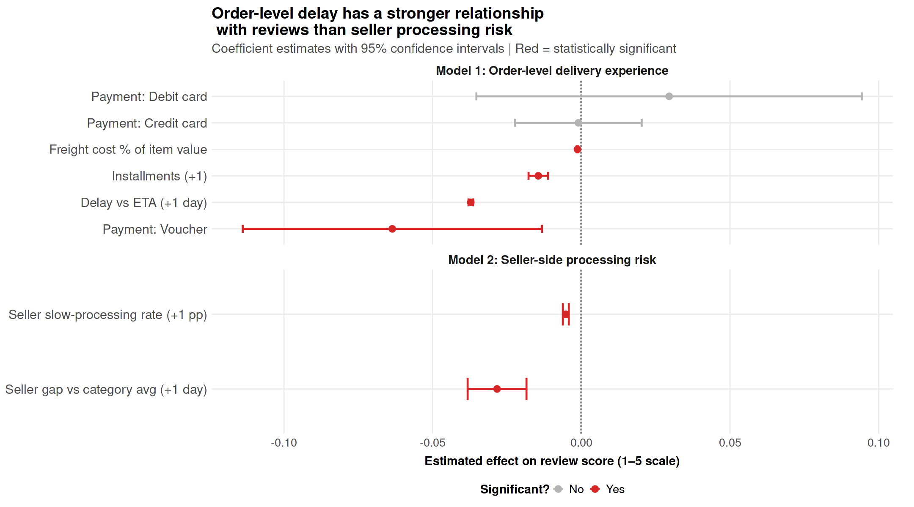

# Business Question 15 — Operational Drivers of Customer Satisfaction

## Question

**Which operational factors (delivery delays, freight cost, and seller processing performance) have the strongest impact on customer satisfaction, and where should Olist focus operational improvements?**

---

## Why This Matters

This analysis isolates the **real drivers of customer dissatisfaction** on the Olist platform.

Instead of optimizing everything (freight, payments, logistics, sellers), the goal is to identify:

- what actually hurts customer experience
- what does NOT matter as much as expected
- where targeted interventions will have the biggest impact

This allows Olist to:
- prioritize **delivery reliability over cost reductions**
- identify **high-risk sellers before issues reach customers**
- avoid wasting effort on low-impact levers (e.g. payment structure)

---

## Analytical Approach

The analysis combines:

### 1. Order-level behavioral analysis

Customer satisfaction was evaluated against:

- delivery delay vs ETA  
- freight cost as % of order value  
- payment structure  

This isolates how customers react to **their own order experience**.

---

### 2. Seller processing analysis

Instead of using final delivery delay as a seller metric, the analysis focuses on:

- **approval-to-carrier time** (seller-controlled stage)
- **slow-processing rate** (share of orders above platform P90 threshold)
- **category-adjusted processing gap** (seller vs category baseline)

This ensures sellers are evaluated fairly within their operational context.

---

### 3. Regression modeling

Two models were used:

#### Model 1 — Order-level experience

Measures how the **actual delivery experience** affects review scores.

#### Model 2 — Seller processing risk

Measures whether sellers with **slower-than-category processing patterns** tend to receive worse reviews.

---

## Visualisations

*Figure 15.1 — Average review score by delivery delay, showing how satisfaction changes as orders move from early/on-time to late.*

*Figure 15.2 — Share of low reviews by delivery delay, showing the sharp increase in 1–2 star reviews for severely late orders.*

*Figure 15.3 — Low-review share by delivery delay and freight burden, testing whether freight cost changes customer tolerance for lateness.*

*Figure 15.4 — Category view of slow-processing seller risk, showing which product categories appear among sellers that are both slow and associated with weak satisfaction.*

*Figure 15.5 — Seller-level processing risk, identifying exact sellers that are slower than their category baseline and linked to higher low-review shares.*

*Figure 15.6 — Regression coefficient comparison, showing how order-level delay and seller-side processing risk relate to review scores.*

---

## Key Findings

### Delivery delay dominates everything

Delivery delay is the strongest and most consistent driver of dissatisfaction.

- each additional day late reduces review score (~ -0.037)
- severe delays lead to **massive spikes in low reviews (~70%+)**

Customers clearly react to **what happened to their order**, not averages or expectations.

---

### Freight cost does NOT soften delay impact

The initial hypothesis was wrong.

- expensive shipping does NOT make customers less tolerant
- cheap shipping does NOT “save” a late delivery

Once an order is late, the outcome is almost the same regardless of freight cost.

---

### Seller processing matters — but less than direct experience

Seller-side processing risk is real:

- slower-than-category sellers get worse reviews
- high slow-processing rates correlate with dissatisfaction

But:

- effect size is smaller
- model explains <1% of variation

Meaning:

> seller performance is a **risk signal**, not the main driver of satisfaction

---

### Category context is critical

Some categories are naturally slower.

So the correct comparison is:

> seller vs category baseline, not seller vs platform average

This prevents misclassifying sellers in inherently slower categories (e.g. furniture).

---

### Satisfaction is driven by the individual experience

The strongest pattern across all analysis:

> customers judge the platform based on their own order, not seller reputation

---

## Insight

➜ The biggest operational lever is **reducing delivery delays**, not optimizing pricing or payment structure.

➜ Seller processing metrics are valuable as an **early-warning system**, helping identify sellers likely to create future delivery problems.

➜ Category-adjusted benchmarks are essential for fair performance evaluation.

---

## Executive Summary

**Core finding:**

> Customer satisfaction is driven primarily by whether the order arrives on time.

Everything else is secondary.

- Delivery delay has the strongest and most visible impact  
- Freight cost and payment structure have minimal influence  
- Seller processing performance matters, but mainly as a predictive signal  

**What this means for Olist:**

1. **Fix delays first** — especially severe delays  
2. **Monitor seller processing early** — before delays reach customers  
3. **Compare sellers within category context**, not globally  
4. **Stop over-optimizing freight and payment mechanics** — they do not move satisfaction  

In simple terms:

> Customers do not care how the system works —  
> they care whether their order arrives when expected.

---

## Next Question

➡️ **Next:** Do delays become more damaging during peak periods?

[q16 Holiday Delay Impact](../q16_holiday_delay_impact/q16_README.md)