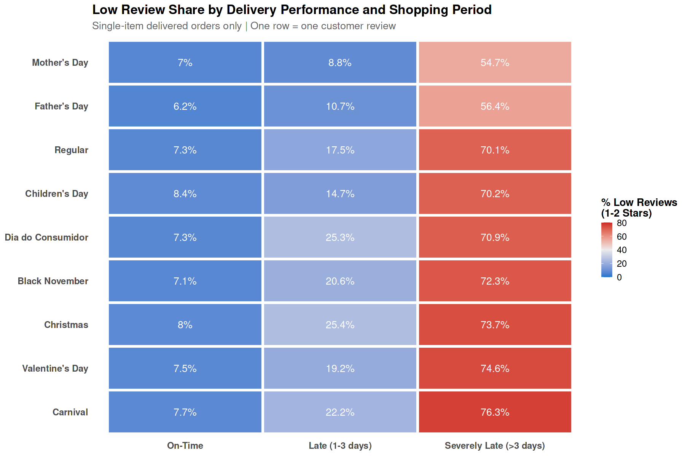
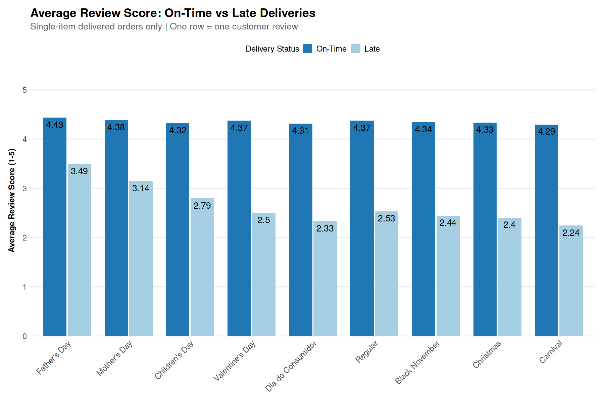
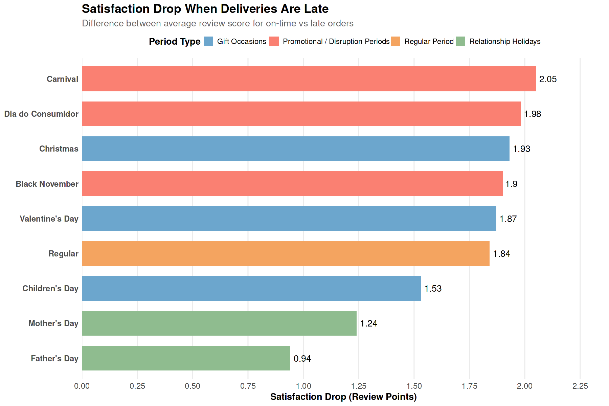
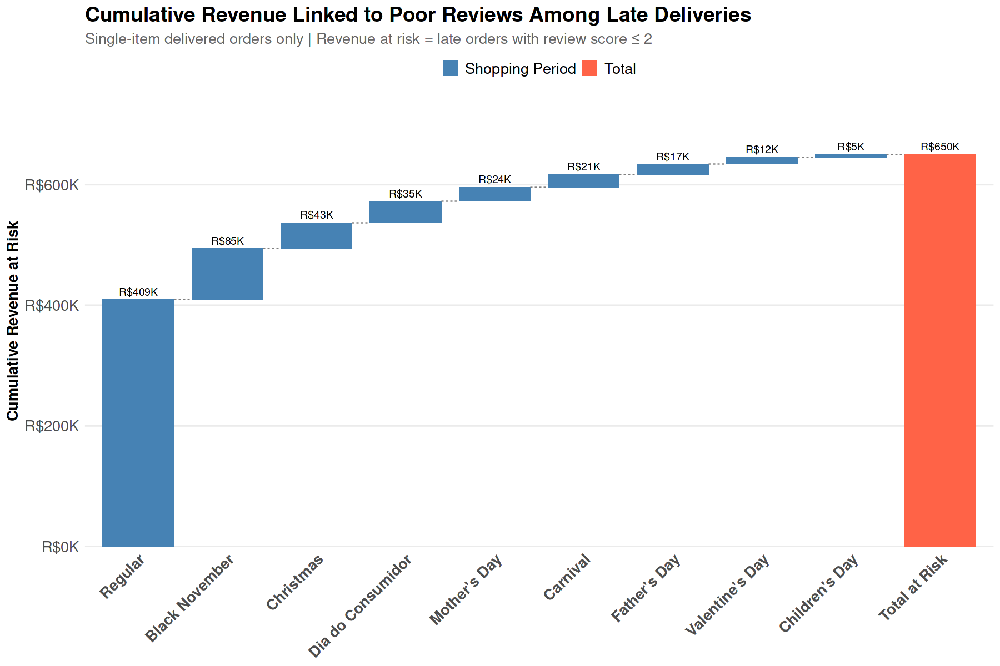

# Business Question 16 — Do Delays Hurt More During Holidays?

## Question

**Do delivery delays lead to a larger drop in customer satisfaction during holiday and peak shopping periods compared to regular periods?**

---

## Why This Matters

Peak shopping periods place additional strain on logistics systems while also increasing customer expectations.

Events such as **Christmas, promotional campaigns, and seasonal peaks** combine high order volumes with operational pressure. When delays occur during these periods, the impact on customer satisfaction and revenue can be amplified.

Understanding whether delays are more damaging during these periods allows Olist to:

- adjust delivery expectations during high-risk windows  
- prioritize operational capacity where it matters most  
- protect customer satisfaction during peak demand  

---

## Analytical Approach

The analysis combines **temporal segmentation, interaction modeling, and financial exposure analysis**.

---

### Holiday Segmentation

Shopping periods were grouped into:

**High-Expectation Events:**
> - Christmas  
> - Mother’s Day  
> - Father’s Day  
> - Valentine’s Day  
> - Children’s Day  

**High-Volume / Disruption Periods:**
> - Black November  
> - Carnival  
> - Dia do Consumidor  

---

### Temporal Windows

Each event was analyzed using custom time windows capturing:

- **pre-event logistics pressure**
- **post-event customer feedback**

Example:  
`Christmas window: -21 to +5 days`

---

### Interaction Regression Model

A linear model was used to test whether delays are more damaging during holidays:

`review_score_num ~ delay_vs_eta * is_holiday_period`

Key interpretation:

- Delay impact (baseline): **-0.0359 per day (p < 0.001)**
- Holiday baseline effect: **-0.036 (p < 0.01)**
- Interaction effect: **-0.0034 (p < 0.001)**

This shows:

> Delays are slightly more damaging during holidays, but the effect size is small.

---

### Financial Impact Mapping

Revenue at risk is defined as:

> **Revenue from late deliveries with poor reviews (≤ 2 stars)**

This isolates the portion of revenue directly associated with negative customer experiences.

---

## Visualisations

*Figure 16.1 — Share of Low Reviews by Delivery Performance and Shopping Period: Severely late (>3 days) orders consistently generate very high dissatisfaction (~70–80%) across all periods, with the worst outcomes during Carnival and Christmas.*    

*Figure 16.2 — Customer Satisfaction: On-time vs. Late Deliveries: Late deliveries significantly reduce review scores across all periods. Differences between periods are primarily driven by delay severity rather than customer tolerance.*

*Figure 16.3 — Satisfaction Drop When Late (Ranked): All periods show substantial drops (~1.8–2.0 points). Variation across periods is secondary compared to the overall effect of delay.*

*Figure 16.4 — Revenue Risk vs. Customer Satisfaction Impact: Dia do Consumidor, Christmas, and Carnival combine high dissatisfaction with high financial exposure.*

*Figure 16.5 — Cumulative Revenue at Risk from Late Deliveries: Regular periods dominate total revenue at risk (~63%) due to volume, despite some holidays having higher per-order risk.*
 

---

## Analytical Tables

### Table 16.1 — Satisfaction Impact of Late Deliveries

| Shopping Period | Avg Score (Late) | Avg Score (On Time) | Satisfaction Drop | % Drop |
|---|---|---|---|---|
| Carnival | 2.24 | 4.29 | 2.05 | 47.8% |
| Dia do Consumidor | 2.33 | 4.31 | 1.98 | 45.9% |
| Christmas | 2.40 | 4.33 | 1.93 | 44.6% |
| Black November | 2.44 | 4.34 | 1.90 | 43.8% |
| Regular | 2.53 | 4.37 | 1.84 | 42.1% |
| Mother's Day | 3.14 | 4.38 | 1.24 | 28.3% |
| Father's Day | 3.49 | 4.43 | 0.94 | 21.2% |

---

### Table 16.2 — Revenue at Risk by Shopping Period

| Shopping Period | Revenue at Risk (BRL) | % Revenue at Risk |
|---|---|---|
| Dia do Consumidor | 35,338 | 68.3% |
| Christmas | 42,570 | 64.0% |
| Carnival | 20,886 | 62.6% |
| Regular | 409,234 | 58.1% |
| Black November | 84,978 | 57.9% |
| Valentine's Day | 11,781 | 57.5% |
| Children's Day | 4,589 | 44.2% |
| Mother's Day | 23,727 | 41.6% |
| Father's Day | 17,044 | 29.8% |

---

## Key Findings

* **Delays are consistently damaging across all periods**  
Late deliveries reduce satisfaction by ~1.8–2.0 review points regardless of timing.

* **Holiday amplification exists, but is small**  
The interaction model shows delays are slightly more damaging during holidays, but the effect size is minimal compared to the baseline delay impact.

* **Delay severity drives outcomes, not holiday type**  
Periods with larger delays (Carnival, Black November, Dia do Consumidor) show worse outcomes (period-level differences in satisfaction are largely explained by differences in delay magnitude (e.g. ~10–11 days vs ~4–6 days)). 
Lower-impact periods (Mother’s/Father’s Day) simply have shorter delays.

* **Operational disruption periods are highest risk**  
Carnival and Dia do Consumidor behave as logistics stress events, not just holidays.

* **Regular periods dominate total business risk**  
Despite moderate per-order impact, regular periods account for the majority of total revenue at risk due to scale.

* **Christmas is the most strategically critical period**  
Combines high volume, high expectations, and high revenue exposure.

---

## Insight

➜ The impact of delays is driven primarily by **delay severity and operational pressure, with holiday effects playing a secondary role**.

➜ Holiday periods slightly amplify dissatisfaction, but the dominant factor remains **how late the order is**.

➜ The most critical risk periods are those combining:
- high delay severity  
- high operational pressure  
- high revenue exposure  

---

## Next Question

➡️ **Next:** After evaluating how seasonal demand influences delivery performance, the next step is to investigate **geographic logistics constraints across Brazil**.  
[q17 Geographic Delivery Performance](../q17_geographic_delivery_performance/q17_README.md)