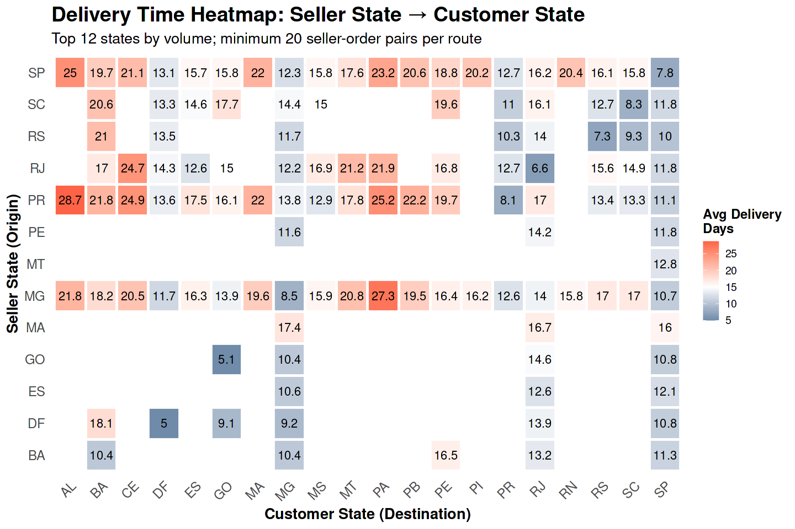
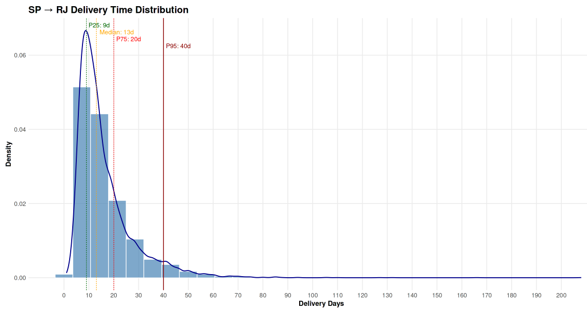

**Operations & Logistics → q17 Geographic Delivery Performance**

# Business Question 17 — Geographic Drivers of Delivery Delays

## Question

**Which Brazilian states and cities experience the worst delivery performance, and is poor logistics performance driven by seller location, customer location, or specific shipping routes?**

---

## Why This Matters

While previous analysis established that **delivery delays are the primary driver of customer dissatisfaction**, identifying *where* those delays occur enables Olist’s operations teams to move from generic oversight to targeted geographic intervention.

By determining whether failures originate from **seller-side inefficiencies (late shipment)** or **destination-side infrastructure constraints (distance, last-mile logistics)**, Olist can:

> - prioritize logistics partnerships in high-delay regions    
> - set **location-specific delivery expectations (ETA adjustments)**    
> - identify optimal locations for **new fulfillment centers**  

This analysis therefore shifts the focus from **operational symptoms (late deliveries)** to **structural causes within Brazil’s logistics network**.

---

## Analytical Approach

To isolate the geographic source of delays, the analysis moved from order-level observations to **seller × order level logistics pairs**.

### Main datasets used

- `delivered_order_items`
- `customers`
- `sellers`

### Methodology

Because **orders may contain items from multiple sellers (~1.3% of orders)**, each **seller–customer–order combination** was treated as a separate logistics observation. This ensures both **origin bottlenecks and destination constraints** are captured accurately.

### Derived Metrics

**seller_delay** - Average delay vs ETA for orders originating **from a seller state** (outbound performance).  

**customer_delay** - Average delay vs ETA for orders delivered **to a customer state** (inbound performance).  

**delay_difference** - `delay_difference = seller_delay − customer_delay`    

Interpretation:

- **Positive values → seller-side inefficiency**
- **Negative values → destination infrastructure constraints**

### Reliability Thresholds

To ensure statistical robustness:

- routes with **≥30 seller-order observations** were analyzed  
- **n ≥ 100 orders** was required to classify **high-volume priority routes**

---

## Visualisations

*Figure 17.1 — Delivery time heatmap (Seller State → Customer State). The visualization highlights the strong distance penalty when shipping from the Southeast (SP) to Northern and Northeastern states.*

 

*Figure 17.2 — Delivery time distribution for the critical SP → RJ route. The high late-delivery rate is driven by a long right-tail of extreme delays rather than uniform slowness.*

---

## Analytical Tables

### Table 17.1 — Dataset: `geo_delays`

Master dataset linking geographic origins, destinations, and delivery timing metrics.

| order_id | seller_state | customer_state | route | delay_vs_eta | order_to_delivery_days |
|----------|--------------|----------------|-------|--------------|------------------------|
| ... | SP | RJ | SP → RJ | -10.2 | 16.2 |
| ... | SP | BA | SP → BA | -10.2 | 19.7 |

---

### Table 17.2 — Destination Performance (North / Northeast)

States with the **longest delivery times and highest late-delivery rates**.

| customer_state | unique_orders | avg_delivery_days | late_rate (%) | severe_late_rate (%) |
|----------------|---------------|------------------|---------------|----------------------|
| RR | 41 | 29.3 | 12.2 | 12.2 |
| AP | 67 | 27.2 | 4.5 | 1.5 |
| AM | 145 | 26.4 | 4.1 | 2.1 |
| AL | 397 | 24.5 | 23.8 | 19.3 |

---

### Table 17.3 — Critical Logistics Routes

High-volume routes responsible for a disproportionate share of logistics failures.

| route | route_type | unique_orders | late_rate (%) | avg_delivery_days | weighted_impact |
|------|------------|---------------|---------------|------------------|----------------|
| SP → RJ | Intra-Region | 8,110 | 15.5 | 16.2 | 131,382 |
| SP → BA | Inter-Region | 2,295 | 14.8 | 19.7 | 45,212 |
| SP → ES | Intra-Region | 1,459 | 14.1 | 15.7 | 22,906 |

---

## Key Findings

* **Geography dominates logistics performance:** Delivery problems are primarily driven by **destination infrastructure and distance**, not seller inefficiency. Across **16 of Brazil’s 27 states**, inbound logistics capacity is the main bottleneck.  

* **Extreme regional stratification:** Average delivery times vary **3.4× across Brazil**, ranging from roughly **9 days in the Southeast to nearly 29 days in Northern states**.  

* **The São Paulo bottleneck:** São Paulo functions as Olist’s **primary logistics hub**. Sellers in SP ship efficiently (often **~10 days ahead of ETA**), but long-distance routes from SP to Northern and Northeastern states significantly degrade delivery performance.  

* **Rio de Janeiro last-mile failure:**  Despite geographic proximity to São Paulo, **RJ exhibits a late-delivery rate nearly three times higher than SP**, driven primarily by **urban last-mile constraints in the metropolitan region**.  

* **Concentrated operational risk:**  Only **14 major routes (~11%) account for nearly 28% of platform orders**, yet represent the majority of logistics failures. Fixing these routes would significantly improve platform reliability.  

---

## Insight

➜ Olist’s logistics problems are **route-specific infrastructure failures rather than systemic platform inefficiency**.

➜ The **SP → RJ corridor** is the single highest-impact failure point, responsible for **over half of critical-tier logistics volume**.

➜ A more resilient logistics network would require **geographic diversification of fulfillment capacity**. Recruiting sellers or establishing fulfillment infrastructure in **Southern and Northeastern regions** would reduce reliance on São Paulo.

> For example, establishing a fulfillment hub in **Bahia (BA)** could serve multiple critical Northeast routes, potentially reducing delivery times in that region by **up to 50%**.

---

## Next Question

➡️ **Next:** Having established that geography drives delays, the final step is to determine whether **product characteristics themselves contribute to logistics friction**.
[q18 Product Size vs Logistics](../q18_product_size_vs_logistics/q18_README.md)
