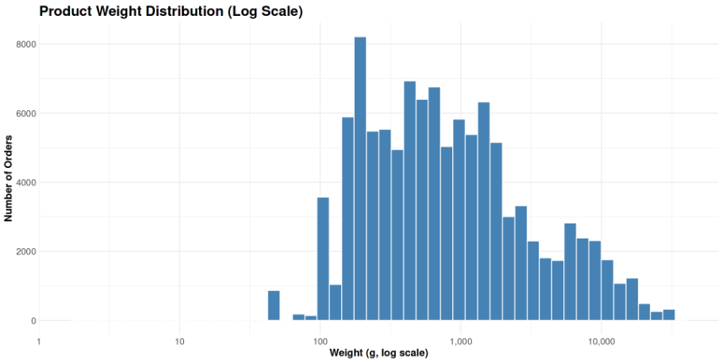
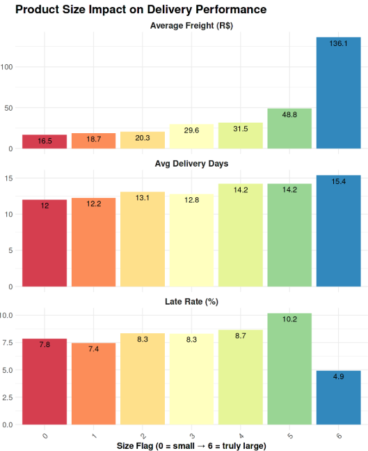
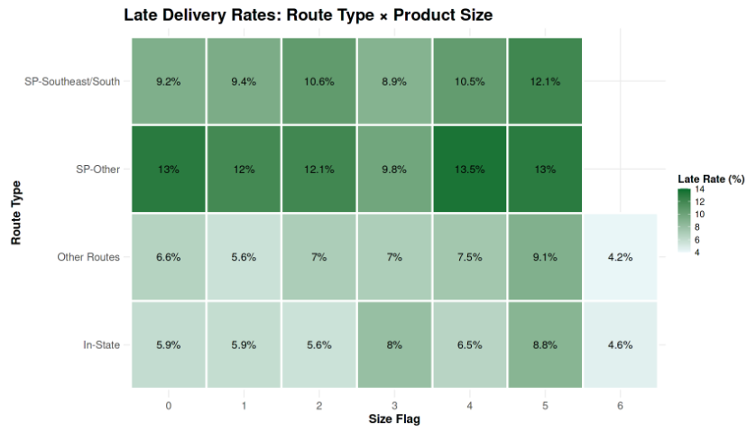

**Operations & Logistics → q18 Product Size vs Logistics**

# Business Question 18 — Product Size, Weight, and Logistics Performance

## Question

**How do product dimensions and weight impact delivery performance and freight costs across Brazilian regions?**

---

## Why This Matters

This analysis evaluates whether **physical product attributes—such as size and weight—create systemic logistics challenges or cost inefficiencies**.

If oversized products significantly degrade delivery reliability, Olist may need to invest in **specialized handling and logistics infrastructure** for bulky items.  
However, if geography and shipping routes drive most delays, the marketplace should instead prioritize **route optimization and regional logistics partnerships**, particularly in historically slow regions such as the **North and Northeast of Brazil**.

Understanding this distinction helps determine whether operational investment should focus on **product-specific logistics capabilities** or **general transportation infrastructure improvements**.

---

## Analytical Approach

The analysis combines **item-level product attributes with realized delivery performance metrics** to evaluate how physical product characteristics influence logistics outcomes.

### Main datasets used

- `delivered_order_items`
- `products`
- `customers`
- `sellers`

### Key metrics

**size_flag**: A 7-tier scale representing product size based on dimension percentiles:

```
0 = smallest products  
6 = extremely large products
```

This classification incorporates **product dimensions and weight** to capture bulkiness.

Additional performance metrics analyzed:

- `order_to_delivery_days`
- `late_rate_pct`
- `freight_value`

### Filters

Analysis was restricted to orders with **valid chronological timelines**: `timeline_is_valid == TRUE`


### Analytical logic

To isolate whether size effects vary by geography, the analysis evaluated **interactions between product size and shipping route type**, including:

- **In-State routes**
- **Regional routes**
- **Long-haul routes originating from São Paulo (SP → Other regions)**

This allows comparison between **distance-driven delays and size-driven delays**.

---

## Visualisations

<p align="center">

</p>

*Figure 18.1 — Product weight distribution (log scale). Most products fall between 200–500g, with a long tail extending beyond 10kg.*

<br>

<p align="center">

</p>

*Figure 18.2 — Impact of product size on delivery performance. Freight cost increases dramatically with size, while delivery time grows only modestly.*

<br>

<p align="center">

</p>

*Figure 18.3 — Late delivery rates by route type and product size. Long-haul routes remain slow regardless of item dimensions.*

---

## Analytical Tables

### Table 18.1 — Dataset: `size_flag_performance`

Performance summary by product size tier.

| size_flag | n_orders | avg_weight_g | avg_volume_cm3 | avg_delivery_days | avg_freight_value (BRL) | late_rate_pct |
|-----------|----------|--------------|---------------|------------------|-------------------------|---------------|
| 0 (Small) | 58,962 | 662 | 3,817 | 12.0 | 16.5 | 7.8 |
| 3 (Medium) | 2,661 | 6,860 | 52,184 | 12.8 | 29.6 | 8.3 |
| 6 (Truly Large) | 61 | 26,580 | 246,569 | 15.4 | 136.1 | 4.9 |

---

### Table 18.2 — Route Size Interaction (`route_size_analysis`)

Comparison of delivery performance across route types and product sizes.

| route_type | size_flag | n_orders | avg_delivery_days | late_rate_pct |
|------------|-----------|----------|------------------|---------------|
| In-State | 0 | 21,355 | 7.3 | 5.9 |
| In-State | 5 | 1,015 | 10.0 | 8.8 |
| SP → Other | 0 | 7,997 | 18.1 | 13.0 |
| SP → Other | 5 | 316 | 20.6 | 13.0 |

---

## Key Findings

* **Freight cost is the primary size penalty:** Shipping costs increase dramatically with product size. Average freight rises from roughly **16 BRL for small items to over 130 BRL for very large products**, representing an **eight-fold increase driven by dimensional pricing**.  

* **Delivery time impact is modest:** Product size increases delivery times only slightly. Average delivery duration rises from approximately **12 days for small items to 15 days for very large items**, a relatively small effect compared to geographic variation.  

* **Size does not predict lateness:** The statistical relationship between product dimensions and delivery delays is negligible (**correlation ≈ 0.02**). Large products are **not inherently more likely to be late**.  

* **Geography dominates logistics performance:** Distance and infrastructure have a far stronger influence on delivery reliability than product size. A **small item shipped across long distances** shows a higher late rate than **large items shipped locally**.  

* **Unexpected category patterns:** Some lightweight product categories, such as **audio equipment and fashion items**, have higher late-delivery rates than bulky categories like **office furniture**, indicating that delays are primarily driven by route infrastructure rather than package characteristics.  

---

## Insight

➜ For Olist, **where a product ships matters far more than what is being shipped**.

➜ Product dimensions primarily affect **profitability through freight costs**, not operational reliability. This means the marketplace does **not need specialized size-specific logistics solutions**.

➜ Instead, improving logistics performance should focus on:

> - optimizing **long-distance shipping routes**
> - strengthening **carrier partnerships in Northern and Northeastern regions**
> - reducing dependence on **São Paulo as a central logistics hub**

Geographic infrastructure —not product size! — is the primary constraint on delivery performance.

---

## Final Conclusion

This analysis concludes the investigation across **18 business questions examining Olist’s marketplace performance, customer behavior, operational logistics, and profitability drivers**.

Overall, the platform demonstrates a **healthy and diversified marketplace structure**. The most significant strategic opportunities lie in:

- **increasing repeat customer behavior**, which drives the largest gains in lifetime value  
- **targeting a small number of high-volume logistics routes responsible for a disproportionate share of delivery delays**

By focusing on these high-impact areas, Olist can significantly improve both **customer satisfaction and long-term marketplace growth**.
