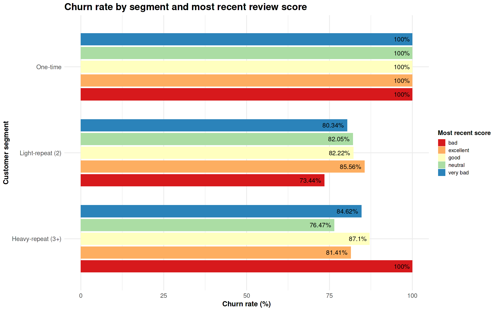

**Customer Value & Risk → q14 Churn Risk by Review Score & Customer Segment**

# Business Question 14 — Churn Risk Across Customer Satisfaction Levels

## Question

**Among customers with different review scores, which groups are most likely to churn (not place another order), and how does this vary between one-time, light-repeat, and heavy-repeat segments?**

---

## Why This Matters

* Understanding whether customer dissatisfaction drives churn is critical for designing effective retention strategies.

* If churn is primarily driven by poor customer experiences, Olist should prioritise service recovery, seller performance improvements, and operational reliability.

* However, if even highly satisfied customers fail to return, the challenge becomes structural engagement rather than service quality, requiring mechanisms that encourage habitual purchasing.

---

## Analytical Approach

To identify churn patterns, the analysis established a **behavior-based definition for lost customers** derived from observed purchase intervals rather than an arbitrary inactivity window.

**Main datasets:**

- `orders`
- `customers`
- `order_reviews`

**Customer segmentation:** Customers were grouped according to their purchase frequency:

> - **One-time** → 1 order  
> - **Light-repeat** → 2 orders  
> - **Heavy-repeat** → 3+ orders

**Churn definition:** A customer was considered **churned** if they did not place another order within a defined inactivity window after their most recent purchase.

Two windows were used to ensure robustness:

1. **Primary window (P75)** → 121 days  
  Derived from the 75th percentile of observed time gaps between repeat purchases.

2. **Validation window (MAX)** → 583 days  
  Derived from the maximum observed gap between repeat purchases.

Testing both thresholds ensures that conclusions are **not sensitive to the strictness of the churn definition**.

**Sentiment proxy:** Customer sentiment was approximated using the variable: `most_recent_review_score` - this represents the **customer’s final recorded sentiment toward the platform before potential churn**.

**Granularity:** Churn rates were calculated separately for each combination of:

- customer frequency segment
- most recent review score

---

## Analysis Implementation

Customer purchase timelines and review scores were processed in **Google BigQuery**, while churn classification and segment-level churn metrics were calculated in **R within the Kaggle notebook**.

Customer frequency segments were combined with review score groupings to evaluate whether satisfaction levels meaningfully influence retention.

---

## Visualisations

*Figure 14.1 — Churn rate by customer frequency segment and most recent review score (121-day window). The chart illustrates that churn remains consistently high across all satisfaction levels.*

---

## Analytical Tables

**Table 14.1 — Repeat purchase interval dataset used to estimate behavioral churn thresholds**

| Column Name | Description |
|---|---|
| customer_unique_id | Identifier used to track individuals across multiple transactions |
| freq_segment | Customer classification based on lifetime order count |
| days_to_next | Time elapsed between two sequential purchases |

---

**Table 14.2 — Churn summary by customer segment and review score (121-day window)**

| freq_segment | most_recent_score | customers_n | churn_rate_pct |
|---|---|---|---|
| Heavy-repeat (3+) | bad | 2 | 100.00 |
| Heavy-repeat (3+) | good | 31 | 87.10 |
| Heavy-repeat (3+) | very bad | 13 | 84.62 |
| Heavy-repeat (3+) | excellent | 156 | 81.41 |
| Heavy-repeat (3+) | neutral | 17 | 76.47 |
| Light-repeat (2) | excellent | 1337 | 85.56 |
| One-time | (all scores) | 85,000+ | 100.00 |

---

## Key Findings

* **Structural churn:** Retention risk is structurally high across the platform. Even among customers leaving **excellent reviews**, churn rates remain between **76% and 87%** within the observed windows.

* **One-time customer endpoint:** One-time customers represent a structural endpoint in the dataset. Because they place only a single order, their review score has **no predictive power for retention**.

* **Weak sentiment–retention relationship:** Lower review scores correlate with slightly higher churn rates, but the differences are modest. For heavy-repeat customers, churn varies by only **around 10 percentage points across the entire 1–5 star spectrum**.

**Robustness across churn windows:** Testing a significantly longer **583-day churn window** did not materially change retention outcomes, confirming that churn represents **permanent disengagement rather than delayed purchasing**.

---

## Insight

➜ Churn on the Olist marketplace appears to be a **structural and temporal phenomenon rather than a satisfaction problem**.

➜ The platform is used **episodically rather than habitually**, meaning even highly satisfied customers often do not return.

➜ Because of this, improving service quality alone is unlikely to meaningfully improve retention. Instead, Olist’s largest growth lever lies in **engineering repeat purchasing behavior**, for example through:

- loyalty incentives
- category-specific re-engagement campaigns
- lifecycle triggers designed to drive second and third purchases.

---

## Next Question

➡️ **Next:** Having confirmed that churn is structural and largely independent of satisfaction levels, the final step is to identify the operational drivers that influence those satisfaction scores in the first place.
[q15 - Operational Drivers of Satisfaction & Revenue](../../03_operations_and_logistics/q15_operational_drivers_of_reviews/q15_README.md)