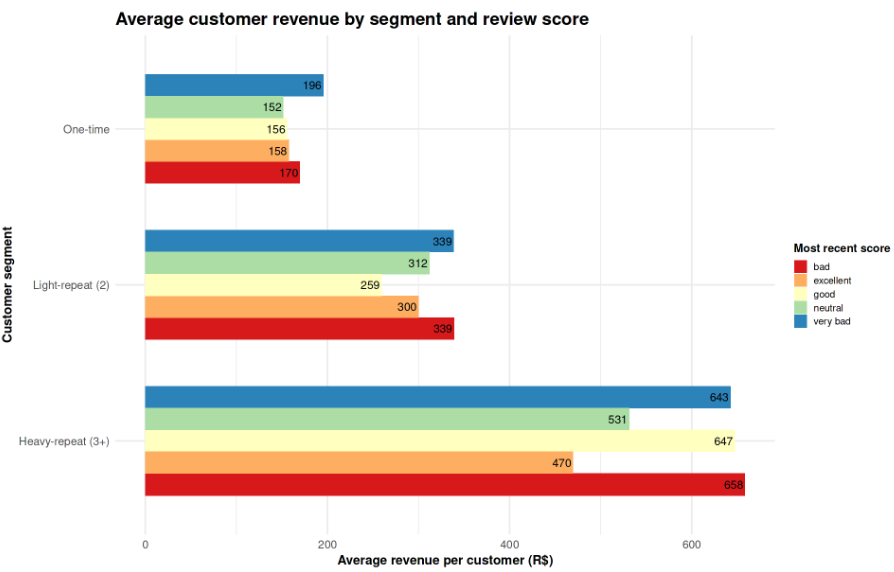

**Profitability & Risk → q13 Customer Lifetime Value by Loyalty Segment**

# Business Question 13 — Revenue and Profit Contribution of Customer Segments

## Question

**How much revenue and profit do one-time, light-repeat, and heavy-repeat customers generate, and does higher satisfaction (review score) translate into higher customer lifetime value?**

---

## Why This Matters

This analysis quantifies the **financial impact of customer loyalty and satisfaction** on the Olist marketplace.

If highly satisfied customers generate significantly more revenue over time, Olist could prioritize investments in improving customer experience and review outcomes. Conversely, if value is driven primarily by purchase frequency rather than satisfaction, the platform’s retention strategy should focus on **converting first-time buyers into repeat customers** rather than attempting to improve sentiment alone.

Understanding whether **Customer Lifetime Value (CLV)** is primarily driven by satisfaction or by structural purchasing behaviour helps identify where retention efforts will generate the highest return.

---

## Analytical Approach

To estimate customer lifetime value across behavioral segments, the analysis combined historical revenue data with each customer’s most recent review score.

### Main datasets used

- `order_items`
- `orders_enriched`
- `order_reviews`
- `customer_segments`

### Customer frequency segments

Customers were grouped according to their purchase history:

- **One-time** → 1 order  
- **Light-repeat** → 2 orders  
- **Heavy-repeat** → 3+ orders  

### Key metrics

**Total Revenue**

Customer lifetime revenue was calculated as:

```
total_revenue = price + freight
```

summed across all orders placed by each `customer_unique_id`.

**Most Recent Review Score**

To represent current customer sentiment, the analysis extracted the **review score from each customer's most recent order**.

This serves as a proxy for their latest experience with the platform.

**Customer-Level Aggregation**

All orders belonging to the same `customer_unique_id` were aggregated to create a single record per customer containing:

- total lifetime revenue
- total orders
- frequency segment
- most recent review score

---

## Visualisations

<p align="center">

</p>

*Figure 13.1 — Average customer revenue by loyalty segment and review score, illustrating that purchase frequency drives far larger revenue differences than satisfaction alone.*

---

## Analytical Tables

### Table 13.1 — Intermediate Dataset: `cust_value_reviews`

This dataset consolidates lifetime spending and satisfaction signals for each unique customer.

| Column | Description |
|------|-------------|
| customer_unique_id | Unique identifier across all customer orders |
| total_revenue | Lifetime GMV generated by the customer |
| orders_n | Total number of completed orders |
| freq_segment | Behavioral segment based on orders_n |
| most_recent_score | Review score from the most recent order |

---

### Table 13.2 — Final Summary: `segment_review_value`

This table summarizes revenue statistics across loyalty segments and satisfaction levels.

| Segment | Review Score | Customers | Avg Orders | Avg Revenue (BRL) | Median Revenue |
|-------|-------------|----------|-----------|------------------|---------------|
| Heavy-repeat | bad | 2 | 4.00 | 658.37 | 658.37 |
| Heavy-repeat | good | 31 | 3.35 | 647.20 | 519.24 |
| Heavy-repeat | very bad | 13 | 3.15 | 642.54 | 532.44 |
| Heavy-repeat | excellent | 156 | 3.44 | 469.56 | 379.49 |
| Light-repeat | very bad | 178 | 2.01 | 338.62 | 273.63 |
| One-time | excellent | 52,234 | 1.00 | 157.62 | 103.73 |

*Selected rows shown for brevity.*

---

## Key Findings

**Frequency Dominates Value**

Customer lifetime value is driven primarily by **purchase frequency**, not satisfaction alone. One-time buyers show a low revenue ceiling of roughly **150–200 BRL**, regardless of review score.

**The Step-Up Effect**

Moving a customer from **one-time to light-repeat behaviour nearly doubles their average revenue**, increasing lifetime value from approximately **160 BRL to ~300 BRL**.

**Heavy Repeaters Generate the Highest Value**

Heavy-repeat customers generate the highest lifetime revenue (approximately **600 BRL per customer**), but represent only a **very small portion of the total customer base**.

**Sentiment and Revenue Are Partially Decoupled**

Among heavy-repeat buyers, the highest lifetime revenue sometimes appears in cases where the **most recent review score is negative**. This suggests that loyal customers may continue purchasing even after a problematic order.

---

## Insight

Customer lifetime value on the Olist platform is driven primarily by **repeat purchasing behaviour rather than satisfaction alone**.

Improving the experience of a one-time buyer does not significantly increase their financial contribution unless it **converts them into a repeat buyer**.

From a strategic perspective, Olist should focus on:

- converting first-time buyers into second purchases
- proactively recovering high-value repeat customers after negative experiences

Because heavy-repeat customers generate disproportionate revenue, retaining even a small fraction of this group has a **large impact on total marketplace GMV**.

---

## Next Question

➡️ **Next:** Having quantified the revenue contribution of each customer segment, the next step is to analyze **which customers are most likely to churn and how satisfaction levels influence churn risk**. [q14 Churn by Review Score](../q14_churn_by_review_score/q14_README.md)
