```R
library(dplyr)
library(tidyr)
library(ggplot2)
library(scales)
library(lubridate)
library(skimr)
library(knitr)
library(DT)
library(gridExtra)
library(lattice)
library(caret)
library(kableExtra)
install.packages("modeest")
library(modeest)
library(glue)
library(ggrepel)
```

    
    Attaching package: ‘dplyr’
    
    
    The following objects are masked from ‘package:stats’:
    
        filter, lag
    
    
    The following objects are masked from ‘package:base’:
    
        intersect, setdiff, setequal, union
    
    
    
    Attaching package: ‘lubridate’
    
    
    The following objects are masked from ‘package:base’:
    
        date, intersect, setdiff, union
    
    
    
    Attaching package: ‘gridExtra’
    
    
    The following object is masked from ‘package:dplyr’:
    
        combine
    
    
    
    Attaching package: ‘caret’
    
    
    The following object is masked from ‘package:httr’:
    
        progress
    
    
    
    Attaching package: ‘kableExtra’
    
    
    The following object is masked from ‘package:dplyr’:
    
        group_rows
    
    
    Installing package into ‘/usr/local/lib/R/site-library’
    (as ‘lib’ is unspecified)
    
    Registered S3 method overwritten by 'rmutil':
      method         from
      print.response httr
    
    


```R
sessionInfo()
```


    R version 4.4.0 (2024-04-24)
    Platform: x86_64-pc-linux-gnu
    Running under: Ubuntu 22.04.4 LTS
    
    Matrix products: default
    BLAS:   /usr/lib/x86_64-linux-gnu/openblas-pthread/libblas.so.3 
    LAPACK: /usr/lib/x86_64-linux-gnu/openblas-pthread/libopenblasp-r0.3.20.so;  LAPACK version 3.10.0
    
    locale:
     [1] LC_CTYPE=en_US.UTF-8       LC_NUMERIC=C              
     [3] LC_TIME=en_US.UTF-8        LC_COLLATE=en_US.UTF-8    
     [5] LC_MONETARY=en_US.UTF-8    LC_MESSAGES=en_US.UTF-8   
     [7] LC_PAPER=en_US.UTF-8       LC_NAME=C                 
     [9] LC_ADDRESS=C               LC_TELEPHONE=C            
    [11] LC_MEASUREMENT=en_US.UTF-8 LC_IDENTIFICATION=C       
    
    time zone: Etc/UTC
    tzcode source: system (glibc)
    
    attached base packages:
    [1] stats     graphics  grDevices utils     datasets  methods   base     
    
    other attached packages:
     [1] glue_1.7.0       modeest_2.4.0    kableExtra_1.4.0 caret_6.0-94    
     [5] lattice_0.22-6   gridExtra_2.3    DT_0.33          knitr_1.47      
     [9] skimr_2.1.5      lubridate_1.9.3  scales_1.3.0     ggplot2_3.5.1   
    [13] tidyr_1.3.1      dplyr_1.1.4      bigrquery_1.6.1  httr_1.4.7      
    
    loaded via a namespace (and not attached):
     [1] DBI_1.2.3            pROC_1.18.5          rlang_1.1.4         
     [4] magrittr_2.0.3       clue_0.3-65          compiler_4.4.0      
     [7] systemfonts_1.1.0    vctrs_0.6.5          reshape2_1.4.4      
    [10] rmutil_1.1.10        stringr_1.5.1        pkgconfig_2.0.3     
    [13] crayon_1.5.3         fastmap_1.2.0        utf8_1.2.4          
    [16] rmarkdown_2.27       prodlim_2024.06.25   purrr_1.0.2         
    [19] bit_4.0.5            xfun_0.45            jsonlite_1.8.8      
    [22] recipes_1.0.10       uuid_1.2-0           cluster_2.1.6       
    [25] parallel_4.4.0       R6_2.5.1             stringi_1.8.4       
    [28] parallelly_1.37.1    rpart_4.1.23         Rcpp_1.0.12         
    [31] IRkernel_1.3.2.9000  iterators_1.0.14     future.apply_1.11.2 
    [34] base64enc_0.1-3      Matrix_1.7-0         splines_4.4.0       
    [37] nnet_7.3-19          timechange_0.3.0     tidyselect_1.2.1    
    [40] rstudioapi_0.16.0    timeDate_4032.109    codetools_0.2-20    
    [43] listenv_0.9.1        tibble_3.2.1         plyr_1.8.9          
    [46] withr_3.0.0          evaluate_0.24.0      stable_1.1.7        
    [49] future_1.33.2        survival_3.7-0       xml2_1.3.6          
    [52] pillar_1.9.0         foreach_1.5.2        stats4_4.4.0        
    [55] generics_0.1.3       IRdisplay_1.1.0.9000 munsell_0.5.1       
    [58] timeSeries_4032.109  globals_0.16.3       class_7.3-22        
    [61] statip_0.2.3         tools_4.4.0          data.table_1.15.4   
    [64] spatial_7.3-17       ModelMetrics_1.2.2.2 gower_1.0.1         
    [67] fBasics_4032.96      pbdZMQ_0.3-11        fs_1.6.4            
    [70] grid_4.4.0           ipred_0.9-14         colorspace_2.1-0    
    [73] nlme_3.1-165         repr_1.1.7           cli_3.6.3           
    [76] fansi_1.0.6          gargle_1.5.2         viridisLite_0.4.2   
    [79] svglite_2.1.3        lava_1.8.0           gtable_0.3.5        
    [82] stabledist_0.7-1     digest_0.6.36        htmlwidgets_1.6.4   
    [85] htmltools_0.5.8.1    lifecycle_1.0.4      hardhat_1.4.0       
    [88] bit64_4.0.5          MASS_7.3-61         


# Google Data Analytics Capstone Project 
### by Yulia Carvalho


This `project` marks the culmination of my journey towards earning the **[Google Data Analytics Professional Certificate](https://www.coursera.org/professional-certificates/google-data-analytics)**.  
Over recent months, I have developed and sharpened my skills in data cleaning, analysis, visualization and storytelling - and this capstone project on analyzing real-world e-commerce scenario brings them all together. 

In this case study, I will analyze Brazil’s dynamic e-commerce landscape using the public Olist dataset [Olist dataset](https://www.kaggle.com/datasets/olistbr/brazilian-ecommerce), which contains records from thousands of sales, customer behavior, product categories and seller operations. The goal is to uncover patterns and insights that can support strategic decision-making for online marketplaces, with a particular emphasis on operational efficiency and consumer trends. I will work through each step of the data analysis workflow — from defining questions and preparing data, to executing exploratory data analysis (EDA), hypothesis testing and sharing results. 
Key frameworks, such as ***Ask ➡︎ Prepare ➡︎ Process ➡︎ Analyze ➡︎ Share ➡︎ Act***, will guide my approach.

---

## Project Repository (Executive Report)

This notebook presents the **complete analytical workflow** for the project, documenting each step of the data analysis process — including data cleaning, transformations, exploratory analysis, methodological decisions, and intermediate reasoning.

In parallel, a structured **executive-style version of the analysis** is available in the project repository:

**GitHub Repository:** [LINK](https://github.com/YuliyaCarvalho/olist-marketplace-analysis)

While this notebook provides a continuous and detailed analytical narrative, the repository organizes the findings into a series of **individual business questions**, each summarized in a dedicated report.

This structure allows readers to either:

- follow the **full end-to-end analytical process** within this notebook, or  
- review the **condensed executive summaries** of the key findings and insights in the repository.

---

 
**<span style="text-decoration: underline; color:red;">Disclaimer:</span>**
*<span style="color:red;">This analysis relies on historical e-commerce data (2016–2018) and is intended solely as an educational project. Outcomes are illustrative and not to be used for current business decisions in 2025.</span>*  


##### <span style="color:darkblue;">In addition, this notebook is not intended to present a perfectly optimized or production-ready analytics pipeline. Instead, it serves as a transparent and complete documentation of my analytical thinking, showcasing each step I took to clean, transform and explore the dataset. My goal is to demonstrate the full data analysis process — including decisions, iterations and challenges — rather than to deliver a minimal or overly-polished code-only solution.</span> 

# 1. PROJECT INTRODUCTION

## 1.1 About the company

**[Olist](https://olist.com/)**, is a leading technology company founded in 2015 in Curitiba, Brazil, specializing in connecting small and medium-sized businesses (SMBs) to the country’s top online marketplaces. By providing a centralized platform, integrated logistics and financial solutions, Olist enables merchants to list products, manage inventory and efficiently fulfill orders across multiple channels. The company’s mission is to simplify digital commerce for SMBs, drive growth and expand market reach in a rapidly evolving online retail landscape. 

## 1.2 Scenario

I am a Junior Data Analyst, engaged by **<span style="color:mediumblue;">Olist</span>** - a rapidly expanding Brazilian e-commerce integrator, seeking to optimize marketplace performance for SMBs. My role is to identify opportunities and challenges across sales, customer experience, delivery performance and category dynamics, using company's historical data (2016–2018).

# 2. ASK 

Positioned to accelerate growth in Brazil’s e-commerce sector, **<span style="color:mediumblue;">Olist</span>** aggregates data from thousands of merchants, enabling analysis of customer behavior, fulfillment performance, and product dynamics.

As part of a strategic initiative, Olist aims to leverage marketplace transaction data to identify actionable trends in online shopping and logistics. The objective is to uncover patterns that can inform enhancements in operational processes, marketing outreach, and seller acquisition strategies. Insights from this analysis will guide Olist’s efforts to optimize marketplace efficiency, elevate customer satisfaction, and expand its presence in the competitive e-commerce landscape.

## 2.1 Questions 

 1. What are key trends in Brazilian e-commerce based on Olist’s dataset?

 2. How do customer behaviors and purchasing patterns vary across product categories and regions?

 3. What operational challenges and opportunities are revealed by fulfillment and logistics data?

 4. How can these findings support Olist’s business strategy and marketplace growth?


## 2.2 Business Task 

Analyze the Olist dataset to:

* **uncover growth opportunities for Olist and its merchant partners**
* **provide recommendations to enhance operational efficiency and marketplace strategy**


## 2.3 My Role 

* Analyze extensive historical transaction records from Olist’s digital platforms
* Apply Excel, SQL and R for robust data cleaning, transformation and exploratory analysis
* Uncover consumer trends, logistics bottlenecks and seller performance patterns.
* Translate findings into actionable recommendations for improving marketplace efficiency, boosting customer satisfaction and informing strategic decisions

# 3. PREPARE AND PROCESS

In the **Prepare** phase, my focus is on understanding the structure, quality and completeness of the dataset before any analysis. This includes examining schema consistency across tables, verifying data collection date ranges, identifying overlapping or duplicated entries, and ensuring that each order has the necessary associated information (customer, seller, product, delivery and review data). I also combine data from multiple sources by joining related tables, parse and standardize date fields, check for missing or inconsistent values and verify, that key identifiers such as **order_id** and **customer_id** link correctly across datasets.

In the **Process** phase, I build on this foundation by cleaning, transforming and restructuring the data to prepare it for **Analyze** phase. This involves handling missing values, resolving duplicates, fixing inconsistent formats, filtering relevant observations, creating derived/calculated fields and aggregating or reshaping the data where needed.

Because these steps are closely connected and iterative, I will be combining the **Prepare** and **Process** phases into a single integrated section, covering all data validation, cleaning, transformation and structuring tasks before moving into the **Analyze** phase.

---

## 3.1 About the Dataset

* **Licensing:** Data is under [Attribution-NonCommercial-ShareAlike 4.0 International](https://creativecommons.org/licenses/by-nc-sa/4.0/) license, that allows others to share, copy, distribute, adapt, and build upon the work for non-commercial purposes only, provided they give appropriate credit to the original creator, provide a link to the license, and indicate if changes were made. Any adaptations or derivative works must be distributed under the same license terms, and no additional legal or technological restrictions can be applied beyond the license.

* **Data available:**  [Brazilian E-Commerce Public Dataset by Olist](https://www.kaggle.com/datasets/olistbr/brazilian-ecommerce)
       
* **Official data description:** The dataset has information of 100k orders from 2016 to 2018 made at multiple marketplaces in Brazil. Its features allow viewing an order from multiple dimensions: from order status, price, payment and freight performance to customer location, product attributes and finally reviews written by customers. We also released a geolocation dataset that relates Brazilian zip codes to lat/lng coordinates.
This is real commercial data, it has been anonymised, and references to the companies and partners in the review text have been replaced with the names of Game of Thrones great houses. 

---

## 3.2 Data Organization 

The Olist dataset consists of 9 interrelated CSV files, each representing a distinct dimension of the e-commerce platform’s operations. Together, they provide a comprehensive view of order processing, customer behavior, product details, payment transactions and delivery logistics

**`Tables ➡︎`**

| Table Name                        | Description                                                                                   |
|-----------------------------------|-----------------------------------------------------------------------------------------------|
| olist_orders_dataset              | Contains details of each order, including timestamps, status, and delivery dates           |
| olist_order_items_dataset         | Details of each item within an order, linking products, sellers, and prices                |
| olist_order_payments_dataset      | Records of payment transactions, including type, installments, and total value          |
| olist_order_reviews_dataset       | Customer reviews, ratings, comments, and review timestamps                              |
| olist_products_dataset            | Information about each product, including category, dimensions, and weight          |
| olist_sellers_dataset             | Seller information such as location, ZIP code, and city                             |
| olist_customers_dataset           | Customer details including location and unique IDs                                       |
| olist_geolocation_dataset         | Geospatial data mapping ZIP codes to geographic coordinates                            |
| product_category_name_translation | Translations of product category names from Portuguese to English                      |


<br>

This modular organization allows multi-dimensional analysis across sales, logistics and customer experience, making it ideal for exploratory data analysis and predictive modeling within this Brazilian e-commerce context

---

## 3.3 Data Description

* Olist Brazilian e-commerce public dataset covers transactions from 2016 to 2018. It contains data on approximately 100,000 orders placed with Olist Store and other marketplaces in Brazil, specifically spanning the period from September 2016 to mid-October 2018.

* There is an available data schema for the tables:

  


**`Tables and their respective columns ➡︎`**

| Table Name                   | Column Names|
|------------------------------|-------------------------------------------------------------------------------------------------------------------|
| olist_orders_dataset          | order_id, customer_id, order_status, order_purchase_timestamp, order_approved_at, order_delivered_carrier_date,    |
|                              | order_delivered_customer_date, order_estimated_delivery_date                                                       |
| olist_order_items_dataset     | order_id, order_item_id, product_id, seller_id, shipping_limit_date, price, freight_value                          |
| olist_order_payments_dataset  | order_id, payment_sequential, payment_type, payment_installments, payment_value                                   |
| olist_order_reviews_dataset   | review_id, order_id, review_score, review_comment_title, review_comment_message, review_creation_date,              |
|                              | review_answer_timestamp                                                                                            |
| olist_products_dataset        | product_id, product_category_name, product_name_length, product_description_length, product_photos_qty,             |
|                              | product_weight_g, product_length_cm, product_height_cm, product_width_cm                                           |
| olist_sellers_dataset         | seller_id, seller_zip_code_prefix, seller_city, seller_state                                                      |
| olist_customers_dataset       | customer_id, customer_unique_id, customer_zip_code_prefix, customer_city, customer_state                           |
| olist_geolocation_dataset     | geolocation_zip_code_prefix, geolocation_lat, geolocation_lng, geolocation_city, geolocation_state                |
| product_category_name_translation | product_category_name, product_category_name_english                                                            |

---

## 3.4 Data Understanding, Structural EDA & Processing

In this section, I perform an integrated workflow, that combines **structural exploratory data analysis** with the **full processing and cleaning steps** needed to produce an *analysis-ready dataset*. I begin by systematically examining all nine Olist tables to understand their structure, completeness and data quality. This includes reviewing schema definitions and record counts, validating primary keys, checking for duplicates or missing values, assessing date coverage and confirming, that key identifiers link correctly across tables.

Building on these diagnostics, I then clean, standardize and transform the data to prepare it for downstream analysis. This involves resolving inconsistencies, parsing and normalizing date fields, filtering invalid entries, joining related tables and creating relevant derived variables. The output of this combined workflow is a **fully cleaned and consolidated final table**, that is ready for the **Analyze** phase.

* **Renaming**: To streamline referencing and improve readability, I have shortened the original Olist dataset table names by removing the `"olist_"` prefix and the `"_dataset"` suffix. This naming convention preserves clarity while reducing verbosity in queries and documentation, while aligning with best practices that favor simple, descriptive and consistent table names:


| Original Name | Renamed |
|-|-|
| [olist_orders_dataset] | orders |
| [olist_order_items_dataset] | order_items| 
| [olist_order_payments_dataset] | payments |
| [olist_order_reviews_dataset] | reviews |
| [olist_products_dataset] | products |
| [olist_sellers_dataset] | sellers |
| [olist_customers_dataset] | customers |
| [olist_geolocation_dataset] | geolocation |


*<span style="color:red;">*product_category_name_translation* remained unchanged as it lacked the prefix/suffix</span>*

* I will be using SQL (Google BigQuery) for cleaning and initial EDA.
* I have initially uploaded all renamed datasets to a dedicated folder in Google Drive  and subsequently uploaded to newly-created BigQuery project designated for this analysis ➜ later it has been decided to export the Drive files as CSVs, then upload/import directly into BigQuery as native tables (not Drive-externals), after encountering various Drive credential issues here in Kaggle notebook environment. This eliminates  and improves stability and speed.
* Curated/aggregated data subsets will be later brought into R data frames suitable for visualization and modeling.


**`PREPARE & PROCESSING OUTPUT:`**

1. `Table Overview`:
    * Number of rows and columns
    * Column names and data types
    * Summary of missing/null values per column
      
<br>

2. `Data Quality Checks`:
    * Detection of anomalies or outliers (negative prices, impossible timestamps)
    * Duplicate record checks and validation of unique keys
      
<br>

3. `Descriptive Statistics`:
    * Numeric/date columns ➡︎ summary statistics (min, max, mean, median, standard deviation)
    * Categorical columns ➡︎ category counts and proportions
      
<br>

4. `Data Distribution Visualizations`:
    * Histograms or density plots for continuous variables 
    * Bar charts for categorical variables
      
<br>

5. `Time-Based Diagnostics` (*applicable for **orders** table*):
    * Plot counts or aggregates over time
    * Check for seasonal/temporal anomalies, irregularities and trends
      
<br>

Through this combined structural examination and descriptive assessment of each table, I will obtain a clear understanding of data characteristics, integrity and potential issues. These diagnostics inform the subsequent cleaning and transformation steps and ensure that the final output is reliable and analysis-ready.

After systematically reviewing all nine Olist tables in BigQuery and Google Sheets, it became evident that the **`olist_orders_dataset`** (**`orders`**) functions as the central fact table. It provides the core transactional backbone, that links key business entities such as customers, sellers, products, reviews and payments. The remaining tables act as complementary dimension tables, enriching the core **`order`** records with additional details.

#### Before diving into **Prepare & Process**, I am going to establish connection to my BigQuery account, and load 'bigrquery' library:


```R
install.packages("bigrquery")
library(bigrquery)
project_id <- "olist-project-yuliacarvalho"
```

    Installing package into ‘/usr/local/lib/R/site-library’
    (as ‘lib’ is unspecified)
    
    

##### In order to facilitate executing SQL queries in notebook environment and avoid repeatedly typing in redundant information, I will create a few helper functions, based on the desired query output format: 

1. **run_small_query** ➜ will be used to 'print' small tabular outputs in full (as.data.frame), useful for long format output table <br>

2. **run_small_query_wide** ➜ will be used to 'print' small **wide** tabular outputs in full (as.data.frame), useful for wide- format output table, where I need to see all of the columns 'unwrapped' <br>
3. **run_large_query** ➜ will be used to output a controlled preview of large-result queries (heavy outputs) for a quick inspection. Prints a preview of the first 10 rows (the number specified by preview_rows), and returns a complete result as an full R data frame, that will allow me to access all downloaded data for additional operations and/or visualization <br>
4. **run_large_query_wide** ➜ will execute the given SQL query on BigQuery, download the entire result set into an R data frame, then display this data frame in spreadsheet-style viewer using View(). Unlike the previous function which prints just a preview, this function will open an interactive data viewer window allowing to explore and analyze the full dataset visually within this notebook (for wide-format). The complete data frame is returned for further processing or analysis. I will use this helper function with `LIMIT` within the query to limit the preview. To retrieve the entire dataframe, I will run the query without a `LIMIT` clause.


```R
# 1📡:  "run_small_query" helper function: 

run_small_query <- function(sql) {
   df <- bq_table_download(
    bq_project_query(project_id, sql))
  print(as.data.frame(df))  
  return(df) }
```


```R
#📡 2:  "run_small_query_wide" helper function: 

run_small_query_wide <- function(sql) {
  df <- bq_table_download(
    bq_project_query(project_id, sql))
  View(df)  
  return(df) }
```


```R
#📡 3:  "run_large_query" helper function: 

run_large_query <- function(sql, preview_rows = 10) {
  df <- bq_table_download(
    bq_project_query(project_id, sql))
  print(as.data.frame(head(df, preview_rows)))  
  return(df) }
```


```R
#📡 4:  "run_large_query_wide" helper function: 

run_large_query_wide <- function(sql, preview_rows = 10) {
  df <- bq_table_download(
    bq_project_query(project_id, sql))
  View(df)  
  return(df) }
```

__________________

## 3.5 Prepare and Process_Individual tables
### 3.5.1 PREPARE AND PROCESS ➤ **`ORDERS`** 🛒

Cleaning the **principal** **`orders`** table first is the safest and most consistent approach.

**Why start with "orders"?** ➜ secondary tables in Olist dataset depend on many **`orders`** columns (purchase, approval, delivery timestamps, status), so any later fixes in **`orders`** would require to re‑JOIN and rebuild those secondary tables.

The **`orders`** table is the central snapshot of each order’s state and key timestamps (purchase, approval, delivery), so it defines which orders are considered completed, cancelled, or never delivered, and that classification underpins every downstream table (items, reviews, shipping, etc.)

Raw dataset has been uploaded to BigQuery to enable structured querying and further processing. 
The table serves as the foundation for cleaning, enrichment and transformation tasks required for analysis.

✅**Table schema inspection** – understanding the column types and structure of the table  
✅**Data quality checks** – identifying missing values, duplicates, possible anomalies  
✅**Feature enrichment** – adding derived columns or calculated metrics to support analysis  
✅**Consistency checks** – ensuring dates, IDs and categorical fields follow expected formats  


<br> 

**`ORDERS SCHEMA`**:

| Column Name | Data Type | Description |
|-|-|-|
| order_id | STRING | Unique identifier for the order across all tables |
| customer_id | STRING | Unique identifier of the customer who placed the order |
| order_status | STRING | Current (last) state of the order (created, shipped, delivered, etc.) |
| order_purchase_timestamp | TIMESTAMP | Date and time when the customer completed the checkout and placed the order |
| order_approved_at | TIMESTAMP | Date and time when the payment was approved and the order became eligible for fulfillment |
| order_delivered_carrier_date | TIMESTAMP | ("Dispatch date") Timestamp when the seller hands the package over to the logistics carrier |
| order_delivered_customer_date | TIMESTAMP| Timestamp when the customer actually receives the package — confirmed by the carrier, not by the customer |
| order_estimated_delivery_date | TIMESTAMP| Date that was promised or estimated to the customer as the expected delivery deadline |

| Property | Value |
|-|-|
| **Total Rows** | 99441
| **Number of Columns** | 8 |


```R
#💻 Validating "orders" table Primary Key: 

orders_pk <- run_small_query("
SELECT 
  COUNT(*) AS total_rows,
  COUNT(DISTINCT order_id) AS unique_order_ids,
  COUNTIF(order_id IS NULL) AS null_order_ids
FROM `olist-project-yuliacarvalho.Olist_datasets.orders`")
```

    Auto-refreshing stale OAuth token.
    
    

      total_rows unique_order_ids null_order_ids
    1      99441            99441              0
    


```R
#💻 A summary of "Orders" table:

orders_summary <- run_small_query_wide("
SELECT 'Total Orders' AS metric_name, CAST(COUNT(DISTINCT order_id) AS STRING) AS value
FROM `olist-project-yuliacarvalho.Olist_datasets.orders`
UNION ALL
SELECT 'Unique Customers', CAST(COUNT(DISTINCT customer_id) AS STRING)
FROM `olist-project-yuliacarvalho.Olist_datasets.orders`
UNION ALL
SELECT 'Total Records', CAST(COUNT(*) AS STRING)
FROM `olist-project-yuliacarvalho.Olist_datasets.orders`
UNION ALL
SELECT 'Distinct Statuses', CAST(COUNT(DISTINCT order_status) AS STRING)
FROM `olist-project-yuliacarvalho.Olist_datasets.orders`
UNION ALL
SELECT 'Approved Orders', CAST(COUNTIF(order_status = 'approved') AS STRING)
FROM `olist-project-yuliacarvalho.Olist_datasets.orders`
UNION ALL 
SELECT 'Cancelled Orders', CAST(COUNTIF(order_status = 'canceled') AS STRING)
FROM `olist-project-yuliacarvalho.Olist_datasets.orders`
UNION ALL 
SELECT 'Created Orders', CAST(COUNTIF(order_status = 'created') AS STRING)
FROM `olist-project-yuliacarvalho.Olist_datasets.orders`
UNION ALL 
SELECT 'Delivered Orders', CAST(COUNTIF(order_status = 'delivered') AS STRING)
FROM `olist-project-yuliacarvalho.Olist_datasets.orders`
UNION ALL
SELECT 'Invoiced Orders', CAST(COUNTIF(order_status = 'invoiced') AS STRING)
FROM `olist-project-yuliacarvalho.Olist_datasets.orders`
UNION ALL
SELECT 'Shipped Orders', CAST(COUNTIF(order_status = 'shipped') AS STRING)
FROM `olist-project-yuliacarvalho.Olist_datasets.orders`
UNION ALL
SELECT 'Processing Orders', CAST(COUNTIF(order_status = 'processing') AS STRING)
FROM `olist-project-yuliacarvalho.Olist_datasets.orders`
UNION ALL
SELECT 'Unavailable Orders', CAST(COUNTIF(order_status = 'unavailable') AS STRING)
FROM `olist-project-yuliacarvalho.Olist_datasets.orders`
UNION ALL
SELECT 'Earliest Order Date', CAST(MIN(order_purchase_timestamp) AS STRING)
FROM `olist-project-yuliacarvalho.Olist_datasets.orders`
UNION ALL
SELECT 'Latest Order Date', CAST(MAX(order_purchase_timestamp) AS STRING)
FROM `olist-project-yuliacarvalho.Olist_datasets.orders`
ORDER BY value DESC")
```


<table class="dataframe">
<caption>A tibble: 14 × 2</caption>
<thead>
	<tr><th scope=col>metric_name</th><th scope=col>value</th></tr>
	<tr><th scope=col>&lt;chr&gt;</th><th scope=col>&lt;chr&gt;</th></tr>
</thead>
<tbody>
	<tr><td>Total Orders       </td><td>99441                 </td></tr>
	<tr><td>Unique Customers   </td><td>99441                 </td></tr>
	<tr><td>Total Records      </td><td>99441                 </td></tr>
	<tr><td>Delivered Orders   </td><td>96478                 </td></tr>
	<tr><td>Distinct Statuses  </td><td>8                     </td></tr>
	<tr><td>Cancelled Orders   </td><td>625                   </td></tr>
	<tr><td>Unavailable Orders </td><td>609                   </td></tr>
	<tr><td>Created Orders     </td><td>5                     </td></tr>
	<tr><td>Invoiced Orders    </td><td>314                   </td></tr>
	<tr><td>Processing Orders  </td><td>301                   </td></tr>
	<tr><td>Latest Order Date  </td><td>2018-10-17 17:30:18+00</td></tr>
	<tr><td>Earliest Order Date</td><td>2016-09-04 21:15:19+00</td></tr>
	<tr><td>Approved Orders    </td><td>2                     </td></tr>
	<tr><td>Shipped Orders     </td><td>1107                  </td></tr>
</tbody>
</table>


```R
#💻 Distinct `order_status` categories:

distinct_order_status <- run_small_query("
SELECT 
  DISTINCT order_status
FROM `olist-project-yuliacarvalho.Olist_datasets.orders`")
```

      order_status
    1     approved
    2     canceled
    3      created
    4    delivered
    5     invoiced
    6   processing
    7      shipped
    8  unavailable
    

🔹 **`Orders`** table is a classic example of a **snapshot table**, with 1 row per **order_id** and a current **order_status** (rather than **event table**, that would capture history/order_status changes over time). 

🔹 I need to have a clear understanding of **order_status categories**, investigate timestamps, deal with possible inconsistencies and decide on how to categorize these statuses further.

🔹 I will need to define 'stale'/'hanging' orders and decide on a cut-off timestamp-wise

| Status |       My interpretation |          Handling Suggestion |
|--------------|----------------------------|-------------------------------------------------------------------------|
| approved     | Approved for processing | if 'hanging' → exclude from analysis                                      |
| cancelled    | Closed/canceled orders | exclude from revenue calculations                                           |
| created      | Newly created orders | if 'hanging' beyond cut-off TS → exclude                                     |
| delivered    | Orders delivered | check for delivery TS, exclude if no TS available from both: carrier and customer |
| invoiced     | Orders invoiced but possibly not shipped/delivered | if 'old'/'hanging' → exclude                    |
| processing   | Orders in process, if 'old' ➡︎ 'hanging' | if 'hanging' beyond cut-off TS → exclude                  |
| shipped      | Orders shipped but not delivered, intermediate state | if 'hanging' beyond cut-off TS → exclude      |
| unavailable  | Unknown/invalid state | investigate, decide on exclusion                                             |

But before diving into this investigation, I want to see the distribution of orders per **order_status**


```R
orders_per_status <- run_small_query("
SELECT 
  order_status,
  COUNT(*) AS nb_orders_per_status,
  ROUND(COUNT(*) * 100 / (SELECT COUNT(*) FROM `olist-project-yuliacarvalho.Olist_datasets.orders`), 2) AS percent_orders_per_status
FROM `olist-project-yuliacarvalho.Olist_datasets.orders`
GROUP BY order_status
ORDER BY nb_orders_per_status DESC")
```

      order_status nb_orders_per_status percent_orders_per_status
    1    delivered                96478                     97.02
    2      shipped                 1107                      1.11
    3     canceled                  625                      0.63
    4  unavailable                  609                      0.61
    5     invoiced                  314                      0.32
    6   processing                  301                      0.30
    7      created                    5                      0.01
    8     approved                    2                      0.00
    

🔹 97% of orders are ***delivered***, which is excellent news at this point, as it shows the vast majority of placed orders reach completion   
🔹 This high delivery rate will make it easier for me to confidently exclude 'hanging' or 'stale' orders stuck in intermediate statuses for profit calculations


```R
#💻 Identifying NULL values across all columns of "orders" table: 

orders_nulls <- run_small_query_wide("
SELECT
  COUNT(*) AS total_rows,
  COUNTIF(order_id IS NULL) AS order_id_nulls,
  COUNTIF(customer_id IS NULL) AS customer_id_nulls,
  COUNTIF(order_status IS NULL) AS order_status_nulls,
  COUNTIF(order_purchase_timestamp IS NULL) AS order_purchase_timestamp_nulls,
  COUNTIF(order_approved_at IS NULL) AS order_approved_at_nulls,
  COUNTIF(order_delivered_carrier_date IS NULL) AS order_delivered_carrier_date_nulls,
  COUNTIF(order_delivered_customer_date IS NULL) AS order_delivered_customer_date_nulls,
  COUNTIF(order_estimated_delivery_date IS NULL) AS order_estimated_delivery_date_nulls
FROM `olist-project-yuliacarvalho.Olist_datasets.orders`")
```


<table class="dataframe">
<caption>A tibble: 1 × 9</caption>
<thead>
	<tr><th scope=col>total_rows</th><th scope=col>order_id_nulls</th><th scope=col>customer_id_nulls</th><th scope=col>order_status_nulls</th><th scope=col>order_purchase_timestamp_nulls</th><th scope=col>order_approved_at_nulls</th><th scope=col>order_delivered_carrier_date_nulls</th><th scope=col>order_delivered_customer_date_nulls</th><th scope=col>order_estimated_delivery_date_nulls</th></tr>
	<tr><th scope=col>&lt;int&gt;</th><th scope=col>&lt;int&gt;</th><th scope=col>&lt;int&gt;</th><th scope=col>&lt;int&gt;</th><th scope=col>&lt;int&gt;</th><th scope=col>&lt;int&gt;</th><th scope=col>&lt;int&gt;</th><th scope=col>&lt;int&gt;</th><th scope=col>&lt;int&gt;</th></tr>
</thead>
<tbody>
	<tr><td>99441</td><td>0</td><td>0</td><td>0</td><td>0</td><td>160</td><td>1783</td><td>2965</td><td>0</td></tr>
</tbody>
</table>


* This NULL check reveals, that 3 columns in **`orders`** table have NULL values, which makes sense, since there are 8 distinct **order_status** categories. For example:  
  - an order, that has been cancelled, shipped or is still in processing - should not have a **order_delivered_carrier_date** just yet   
  - the same for `order_approved_at` column ➡︎ if an order has been cancelled shortly after placement, there will be no order approval timestamp  
  - `order_delivered_customer_date` ➡︎ only "delivered" orders should have it   

It is important to futher explore these NULL values in order to understand, whether they are **expected** or **true data gaps**


```R
#💻 NULL stats by order_stats:

null_stats <- run_small_query("
SELECT
  order_status,
  COUNT(*) AS orders_in_status,
  SUM(CASE WHEN order_approved_at IS NULL THEN 1 ELSE 0 END) AS approved_nulls,
  SUM(CASE WHEN order_delivered_carrier_date IS NULL THEN 1 ELSE 0 END) AS carrier_nulls,
  SUM(CASE WHEN order_delivered_customer_date IS NULL THEN 1 ELSE 0 END) AS customer_nulls
FROM `olist-project-yuliacarvalho.Olist_datasets.orders`
GROUP BY order_status
ORDER BY orders_in_status DESC")
```

      order_status orders_in_status approved_nulls carrier_nulls customer_nulls
    1    delivered            96478             14             2              8
    2      shipped             1107              0             0           1107
    3     canceled              625            141           550            619
    4  unavailable              609              0           609            609
    5     invoiced              314              0           314            314
    6   processing              301              0           301            301
    7      created                5              5             5              5
    8     approved                2              0             2              2
    

##### **What the NULL stats say:**  

Among 99k+ orders, NULL patterns mostly align with business logic, with a few small but important inconsistencies to flag.

**Delivered (96478 orders):**
> * 14 have **order_approved_at** NULL ➡︎ likely auto-approval, legacy records or ingestion gaps 
> * 2 have **order_delivered_carrier_date** NULL ➡︎ carrier handoff not recorded
> * 8 have **order_delivered_customer_date** NULL ➡︎ delivery confirmation missing

For **cancelled** orders, the NULL pattern is exactly what I would expect from the lifecycle: 
> * There are 625 canceled orders in total  
> * 141 approved_nulls means 141 canceled orders never reached a recorded approval; they were likely canceled before or during payment  
> * carrier_nulls = 550 and customer_nulls = 619 show that the vast majority of canceled orders never reached shipping or delivery, which is logical for cancellations  

So, for cancelled: only 75 orders have a carrier timestamp and only 6 have a customer delivery timestamp ➡︎ these tiny subsets are the late‑cancellation or data‑inconsistency edge cases I will keep in mind, but the overall NULL structure for **cancelled** status is consistent with expectations.


❗ At first I was about to duplicate **order_purchase_timestamp** into **order_approved_at**, where value is NULL (for all-status orders), assuming that these could be orders with automatic approval set by the seller. However, this would create synthetic data and make it impossible later to distinguish real approvals from imputed ones. Following the logic from the cleaning/discovery steps above - I will add a boolean flag column (**has_approval** ➡︎ 0 = FALSE, 1 = TRUE) 

🔸For metrics that do not need **order_approved_at** (e.g. purchase → delivery), I can safely include these orders  
🔸For any analysis that explicitly needs approval timing (like purchase → approval, approval → delivery), I can filter on **has_approval** = 0 instead of imputing values.

**Shipped / invoiced / processing / unavailable / created / approved:**
> - For non‑delivered statuses, it is expected that many have NULL customer delivery dates and often NULL carrier dates; this matches the expected order lifecycle: orders that never completed should not have final delivery timestamps  
> - Large NULL counts in unavailable, invoiced, processing simply mean these orders never progressed to shipping or delivery  

Next steps:

##### **➡️ Temporal ordering**  

1. Status–timestamp consistency for delivered orders: to be considered a valid "delivered" order, a row must have **order_status** = 'delivered' and a non‑NULL **order_delivered_customer_date**
     
2. I will count timestamp violations like:
> order_approved_at < order_purchase_timestamp  
> order_delivered_carrier_date < order_approved_at  
> order_delivered_customer_date < order_delivered_carrier_date  

3. Negative/impossible durations: I will compute distributions of date differences between **order_delivered_customer_date** and **order_purchase_timestamp** and similar to spot negatives or extreme values.

These will tell me **what’s broken** in **`orders`** table.


```R
#💻 How many 'delivered' orders have delivery timestamp?

delivered_with_ts <- run_small_query("
SELECT
  COUNT(*) AS total_delivered_orders,
  COUNT(order_delivered_customer_date) AS confirmed_delivery,
  ROUND(COUNT(order_delivered_customer_date) * 100 / COUNT(*), 2) AS percent_confirmed
FROM `olist-project-yuliacarvalho.Olist_datasets.orders`
WHERE order_status = 'delivered'")
```

      total_delivered_orders confirmed_delivery percent_confirmed
    1                  96478              96470             99.99
    


```R
#💻 timestamp vs 'delivered' status consistency check: 

delivery_consistency_check <- run_small_query_wide("
SELECT
  order_id,
  order_status,
  order_delivered_carrier_date,
  order_delivered_customer_date
FROM `olist-project-yuliacarvalho.Olist_datasets.orders`
WHERE order_delivered_customer_date IS NULL AND order_status = 'delivered'")
```


<table class="dataframe">
<caption>A tibble: 8 × 4</caption>
<thead>
	<tr><th scope=col>order_id</th><th scope=col>order_status</th><th scope=col>order_delivered_carrier_date</th><th scope=col>order_delivered_customer_date</th></tr>
	<tr><th scope=col>&lt;chr&gt;</th><th scope=col>&lt;chr&gt;</th><th scope=col>&lt;dttm&gt;</th><th scope=col>&lt;dttm&gt;</th></tr>
</thead>
<tbody>
	<tr><td>2d858f451373b04fb5c984a1cc2defaf</td><td>delivered</td><td>NA</td><td>NA</td></tr>
	<tr><td>2d1e2d5bf4dc7227b3bfebb81328c15f</td><td>delivered</td><td>2017-11-30 18:12:23</td><td>NA</td></tr>
	<tr><td>ab7c89dc1bf4a1ead9d6ec1ec8968a84</td><td>delivered</td><td>2018-06-12 14:10:00</td><td>NA</td></tr>
	<tr><td>f5dd62b788049ad9fc0526e3ad11a097</td><td>delivered</td><td>2018-06-25 08:05:00</td><td>NA</td></tr>
	<tr><td>20edc82cf5400ce95e1afacc25798b31</td><td>delivered</td><td>2018-07-03 19:26:00</td><td>NA</td></tr>
	<tr><td>0d3268bad9b086af767785e3f0fc0133</td><td>delivered</td><td>2018-07-03 09:28:00</td><td>NA</td></tr>
	<tr><td>2ebdfc4f15f23b91474edf87475f108e</td><td>delivered</td><td>2018-07-03 13:57:00</td><td>NA</td></tr>
	<tr><td>e69f75a717d64fc5ecdfae42b2e8e086</td><td>delivered</td><td>2018-07-03 13:57:00</td><td>NA</td></tr>
</tbody>
</table>


🔸These 8 orders are marked **delivered** but have no **order_delivered_customer_date**.   
🔸7 of them at least have a carrier handoff timestamp, and 1 has neither carrier nor customer delivery recorded.

**This means that:**  
🔹For 7 orders, the package was handed to the carrier (**order_delivered_carrier_date** is filled) but the final delivery timestamp is missing, even though status is **delivered**.  
🔹For 1 order (2d858f451373b04fb5c984a1cc2defaf), both delivery timestamps are NULL, yet the status is still **delivered**, making it the most suspicious record in this group.

In order to “fix” this inconsistency, one option would be to impute a synthetic delivery date for the 7 “carrier‑only” orders (for example, **order_delivered_carrier_date** plus a typical transit time). Conceptually, this would require mapping each **order_id** to its **product_category**, seller location, and customer location, then estimating an average delivery lag for that seller–category–route combination and applying it, which is complex and time‑consuming relative to the impact.

Given that the **`orders`** table contains 99441 rows and only 8 of them (~0.01%) have order_status = 'delivered' with missing **order_delivered_customer_date**, a more robust approach is to simply flag these as data‑quality issues and exclude them from any analyses, that rely on actual delivery timestamps. 

I will create a boolean quality flag column in **`orders`** table:

**delivery_timestamp_is_complete** = 
> **0** → order_status = 'delivered' AND order_delivered_customer_date IS NULL  
> **1** → order_status = 'delivered' AND order_delivered_customer_date IS NOT NULL

I will use a filter `WHERE delivery_timestamp_is_complete = 1` for downstream lead‑time and on‑time delivery metrics, while still allowing these orders to be counted as **delivered** in simple status‑based aggregations


```R
#💻 order_approved_at < order_purchase_timestamp:

violations_1 <- run_small_query("
SELECT
  v.approved_before_purchase,
  ROUND(100 * v.approved_before_purchase / t.total_orders, 2) AS pct_of_orders
FROM (
  SELECT COUNT(*) AS approved_before_purchase
  FROM `olist-project-yuliacarvalho.Olist_datasets.orders`
  WHERE order_approved_at IS NOT NULL
    AND order_purchase_timestamp IS NOT NULL
    AND order_approved_at < order_purchase_timestamp) AS v
CROSS JOIN (
  SELECT COUNT(*) AS total_orders
  FROM `olist-project-yuliacarvalho.Olist_datasets.orders`) AS t")
```

      approved_before_purchase pct_of_orders
    1                        0             0
    


```R
#💻 order_delivered_carrier_date < order_approved_at:

violations_2 <- run_small_query("
SELECT
  v.carrier_before_approval,
  ROUND(100 * v.carrier_before_approval / t.total_orders, 2) AS pct_of_orders
FROM (
  SELECT COUNT(*) AS carrier_before_approval
  FROM `olist-project-yuliacarvalho.Olist_datasets.orders`
  WHERE order_delivered_carrier_date IS NOT NULL
    AND order_approved_at IS NOT NULL
    AND order_delivered_carrier_date < order_approved_at) AS v
CROSS JOIN (
  SELECT COUNT(*) AS total_orders
  FROM `olist-project-yuliacarvalho.Olist_datasets.orders`) AS t")
```

      carrier_before_approval pct_of_orders
    1                    1359          1.37
    


```R
#💻 order_delivered_customer_date < order_delivered_carrier_date:

violations_3 <- run_small_query("
SELECT
  v.customer_before_carrier,
  ROUND(100 * v.customer_before_carrier / t.total_orders, 2) AS pct_of_orders
FROM (
  SELECT COUNT(*) AS customer_before_carrier
  FROM `olist-project-yuliacarvalho.Olist_datasets.orders`
  WHERE order_delivered_customer_date IS NOT NULL
    AND order_delivered_carrier_date IS NOT NULL
    AND order_delivered_customer_date < order_delivered_carrier_date) AS v
CROSS JOIN (
  SELECT COUNT(*) AS total_orders
  FROM `olist-project-yuliacarvalho.Olist_datasets.orders`) AS t")
```

      customer_before_carrier pct_of_orders
    1                      23          0.02
    

Moving on to **Negative/impossible durations** 


```R
#💻 Basic delivery-time stats (purchase -> customer):

delivery_time_stats <- run_small_query("
SELECT
  COUNT(*) AS rows_with_both_dates,
  MIN(DATE_DIFF(DATE(order_delivered_customer_date), DATE(order_purchase_timestamp), DAY)) AS min_days,
  MAX(DATE_DIFF(DATE(order_delivered_customer_date), DATE(order_purchase_timestamp), DAY)) AS max_days,
  ROUND(AVG(DATE_DIFF(DATE(order_delivered_customer_date), DATE(order_purchase_timestamp), DAY)), 1) AS avg_days
FROM `olist-project-yuliacarvalho.Olist_datasets.orders`
WHERE order_delivered_customer_date IS NOT NULL
  AND order_purchase_timestamp IS NOT NULL")
```

      rows_with_both_dates min_days max_days avg_days
    1                96476        0      210     12.5
    


```R
#💻 Count and inspect negative durations (impossible):

impossible_durations <- run_small_query("
SELECT
  COUNT(*) AS negative_delivery_time_rows
FROM `olist-project-yuliacarvalho.Olist_datasets.orders`
WHERE order_delivered_customer_date IS NOT NULL
  AND order_purchase_timestamp IS NOT NULL
  AND DATE_DIFF(DATE(order_delivered_customer_date), DATE(order_purchase_timestamp), DAY) < 0")
```

      negative_delivery_time_rows
    1                           0
    


```R
#💻 Bucketed distribution of delivery times for spotting extreme values:

delivery_distribution <- run_small_query_wide("
WITH delivery_times AS (
  SELECT DATE_DIFF(DATE(order_delivered_customer_date), DATE(order_purchase_timestamp), DAY) AS d_days
  FROM `olist-project-yuliacarvalho.Olist_datasets.orders`
  WHERE order_delivered_customer_date IS NOT NULL AND order_purchase_timestamp IS NOT NULL),
bucketed AS (
  SELECT
    CASE
      WHEN d_days < 0 THEN 'negative'
      WHEN d_days BETWEEN 0  AND 7   THEN '0-7'
      WHEN d_days BETWEEN 8  AND 14  THEN '8-14'
      WHEN d_days BETWEEN 15 AND 30  THEN '15-30'
      WHEN d_days BETWEEN 31 AND 60  THEN '31-60'
      WHEN d_days BETWEEN 61 AND 120 THEN '61-120'
      ELSE '120+'
    END AS order_to_delivery_days,
    COUNT(*) AS orders_in_bucket
  FROM delivery_times
  GROUP BY order_to_delivery_days)
SELECT
  order_to_delivery_days,
  orders_in_bucket,
  ROUND(100 * orders_in_bucket / SUM(orders_in_bucket) OVER (), 2) AS pct_of_orders
FROM bucketed
ORDER BY pct_of_orders DESC")
```


<table class="dataframe">
<caption>A tibble: 6 × 3</caption>
<thead>
	<tr><th scope=col>order_to_delivery_days</th><th scope=col>orders_in_bucket</th><th scope=col>pct_of_orders</th></tr>
	<tr><th scope=col>&lt;chr&gt;</th><th scope=col>&lt;int&gt;</th><th scope=col>&lt;dbl&gt;</th></tr>
</thead>
<tbody>
	<tr><td>8-14  </td><td>37980</td><td>39.37</td></tr>
	<tr><td>0-7   </td><td>30696</td><td>31.82</td></tr>
	<tr><td>15-30 </td><td>23504</td><td>24.36</td></tr>
	<tr><td>31-60 </td><td> 3998</td><td> 4.14</td></tr>
	<tr><td>61-120</td><td>  255</td><td> 0.26</td></tr>
	<tr><td>120+  </td><td>   43</td><td> 0.04</td></tr>
</tbody>
</table>


##### What the "violations" counts imply:

**`0 approved_before_purchase`**:

🔹The core commercial flow is consistent: no orders where payment approval happens before the purchase timestamp  
🔹**order_purchase_timestamp** and **order_approved_at** can be trusted as a coherent pair for order lifecycle calculations  

**`1359 rows with order_delivered_carrier_date < order_approved_at`**:

🔹For these orders, the system claims the package was handed to the carrier before the payment was approved  
🔹This is chronologically impossible as a real process, so either:  
> **order_delivered_carrier_date** is recorded incorrectly (wrong date/time, default, or backfill), or  
> **order_approved_at** is late/incorrect for these rows

Because the number substantial, I should not blindly trust carrier‑handoff timestamps for all orders when computing precise lead times.

**`23 rows with order_delivered_customer_date < order_delivered_carrier_date`**:

🔹The customer supposedly received the package before the carrier got it, which is clearly a data error  
🔹This is a much smaller problem than the carrier/approval inconsistency but still needs handling in any delivery‑time metrics  

In order to not overwrite any original data with artificial calculated/estimated imputed values, I will add boolean flag columns: 

**carrier_before_approval** AS (order_delivered_carrier_date < order_approved_at; 1 = TRUE, 0 = FALSE)  
**customer_before_carrier** AS (order_delivered_customer_date < order_delivered_carrier_date; 1 = TRUE, 0 = FALSE)

🔸For future KPI calculations, that rely on shipping durations ➡︎ I will exclude flagged rows from duration calculations  
🔸I will still count them in simple order/status aggregations


#### Negative/impossible durations conclusions:

🔹There are no negative delivery times, so **order_purchase_timestamp** and **order_delivered_customer_date** are chronologically consistent wherever both exist  
🔹Out of 96476 orders with both timestamps, delivery time ranges from 0 to 210 days, with an average of about 12.5 days  
🔹Delivery durations look clean and mostly reasonable (distribution is strongly concentrated in normal ranges)   

##### How I will proceed:  

The plan is to base all timing logic on clean, **truly delivered** orders (with granularity of individual products from **`order_items`** table) and then layer in **product_category** context and outlier flags.

🔸 First, I will restrict to orders with **order_status** = 'delivered'. This gives 96478 orders, which is about 97.02% of all orders in the dataset  
🔸 Within this subset, **order_purchase_timestamp** has no NULLs, while **order_delivered_customer_date** has only 8 NULLs ➡︎ these 8 rows cannot contribute to delivery‑duration calculations, so they will be excluded from timing metrics, which is negligible data loss at this scale.  
🔸❗This subset will become a separate table ➜ **`delivered_orders`**  
🔸 A **order_to_delivery_days** column will be added to the **`delivered_orders`** table as the date difference between **order_purchase_timestamp** and **order_delivered_customer_date**   
🔸 Next, **`delivered_orders`** table will be joined to the **`order_items_final`** table (described in detail in section 3.5.4) to create an item‑level view that carries both **order_to_delivery_days** and **product_category**. For each product category, MIN, MAX, AVG, and the P95 percentile of **order_to_delivery_days** will be computed, recognizing that categories differ in their normal delivery profiles.  
🔸 Using these category‑level distributions, a category‑specific **delivery_time_flag_p95** will be created at the order–category level: for each order–category combination, the flag is set to **1** when **order_to_delivery_days** exceeds that category’s P95 threshold and **0** otherwise. This turns **order_to_delivery_days** into a “late vs normal for this category” signal instead of relying on a single global cutoff.  

With no negative durations and only a tiny fraction of very long deliveries, **order_to_delivery_days** from purchase to customer can be used confidently as the primary **delivery‑time** metric in the curated **`delivered_orders`** table and all downstream order_items_final analyses. Category‑specific P95 flags and **TO CHECK** **global outlier** flags will then support on‑time KPIs such as “share of orders delivered within the category P95” or “share delivered within X days overall,” while keeping edge cases explicitly controlled.

Before filtering out **`delivered_orders`**, I have a couple of flag-columns from steps above to implement:
1. **has_approval**
2. **delivery_timestamp_is_complete**
3. **carrier_before_approval**
4. **customer_before_carrier**
5. **timeline_is_valid** (flag, that checks the full expected sequence: **order_purchase_timestamp** =< **order_approved_at** =< **order_delivered_carrier_date** =< **order_delivered_customer_date**)  

 **+** 2 extra calculated fields:
 > **approval_lag_hours** to see how long it took the order from being placed to being approved by the seller (in HOURS)  
 > **order_to_delivery_days** to see how long it took the order from being placed to being delivered to the customer (in DAYS)

In BigQuery: ➜ **`orders_enriched`**
```
💾CREATE OR REPLACE TABLE `olist-project-yuliacarvalho.Olist_datasets.orders_enriched` AS
SELECT
  o.*,

  CASE
    WHEN order_approved_at IS NULL THEN 0
    WHEN order_approved_at IS NOT NULL THEN 1
    ELSE NULL 
  END AS has_approval,

  CASE
    WHEN order_delivered_customer_date IS NOT NULL THEN 1
    WHEN order_delivered_customer_date IS NULL  THEN 0
    ELSE NULL  
  END AS delivery_timestamp_is_complete,

  CASE
    WHEN order_delivered_carrier_date IS NOT NULL
         AND order_approved_at IS NOT NULL
         AND order_delivered_carrier_date < order_approved_at
      THEN 1 ELSE 0
  END AS carrier_before_approval,

  CASE
    WHEN order_delivered_carrier_date IS NOT NULL
         AND order_purchase_timestamp IS NOT NULL
         AND order_delivered_carrier_date < order_purchase_timestamp
      THEN 1 ELSE 0
  END AS carrier_before_purchase,

  CASE
    WHEN order_delivered_customer_date IS NOT NULL
         AND order_delivered_carrier_date IS NOT NULL
         AND order_delivered_customer_date < order_delivered_carrier_date
      THEN 1 ELSE 0
  END AS customer_before_carrier,

  CASE
    WHEN order_status = 'delivered'
         AND order_purchase_timestamp IS NOT NULL
         AND order_delivered_customer_date IS NOT NULL
    THEN DATE_DIFF(
           DATE(order_delivered_customer_date),
           DATE(order_purchase_timestamp),
           DAY
         )
    ELSE NULL
  END AS order_to_delivery_days,

  CASE
    WHEN order_purchase_timestamp IS NOT NULL
         AND order_approved_at IS NOT NULL
    THEN ROUND(
           TIMESTAMP_DIFF(order_approved_at, order_purchase_timestamp, MINUTE) / 60.0,
           1
         )
    ELSE NULL
  END AS approval_lag_hours,

  CASE
    WHEN order_purchase_timestamp IS NOT NULL
         AND order_approved_at IS NOT NULL
         AND order_delivered_carrier_date IS NOT NULL
         AND order_delivered_customer_date IS NOT NULL
         AND order_purchase_timestamp <= order_approved_at
         AND order_approved_at <= order_delivered_carrier_date
         AND order_delivered_carrier_date <= order_delivered_customer_date
      THEN 1
    ELSE 0
  END AS timeline_is_valid

FROM `olist-project-yuliacarvalho.Olist_datasets.orders` AS o
```


```R
#💻 "Flag" stats:

flag_stats <- run_small_query_wide("
WITH flag_counts AS (
  SELECT
    'has_approval' AS flag_name,
    has_approval AS flag_value,
    COUNT(*) AS cnt
  FROM `olist-project-yuliacarvalho.Olist_datasets.orders_enriched`
  GROUP BY flag_value

  UNION ALL

  SELECT
    'delivery_timestamp_is_complete' AS flag_name,
    delivery_timestamp_is_complete AS flag_value,
    COUNT(*) AS cnt
  FROM `olist-project-yuliacarvalho.Olist_datasets.orders_enriched`
  GROUP BY flag_value

  UNION ALL

  SELECT
    'carrier_before_approval' AS flag_name,
    carrier_before_approval AS flag_value,
    COUNT(*) AS cnt
  FROM `olist-project-yuliacarvalho.Olist_datasets.orders_enriched`
  GROUP BY flag_value

  UNION ALL

  SELECT
    'customer_before_carrier' AS flag_name,
    customer_before_carrier AS flag_value,
    COUNT(*) AS cnt
  FROM `olist-project-yuliacarvalho.Olist_datasets.orders_enriched`
  GROUP BY flag_value

  UNION ALL

  SELECT
    'carrier_before_purchase' AS flag_name,
    carrier_before_purchase AS flag_value,
    COUNT(*) AS cnt
  FROM `olist-project-yuliacarvalho.Olist_datasets.orders_enriched`
  GROUP BY flag_value

  UNION ALL

  SELECT
    'timeline_is_valid' AS flag_name,
    timeline_is_valid AS flag_value,
    COUNT(*) AS cnt
  FROM `olist-project-yuliacarvalho.Olist_datasets.orders_enriched`
  GROUP BY flag_value)

SELECT
  flag_name,
  flag_value,
  cnt,
  ROUND(100 * cnt / SUM(cnt) OVER (PARTITION BY flag_name), 2) AS pct_of_flag
FROM flag_counts
ORDER BY flag_name, flag_value")
```


<table class="dataframe">
<caption>A tibble: 12 × 4</caption>
<thead>
	<tr><th scope=col>flag_name</th><th scope=col>flag_value</th><th scope=col>cnt</th><th scope=col>pct_of_flag</th></tr>
	<tr><th scope=col>&lt;chr&gt;</th><th scope=col>&lt;int&gt;</th><th scope=col>&lt;int&gt;</th><th scope=col>&lt;dbl&gt;</th></tr>
</thead>
<tbody>
	<tr><td>carrier_before_approval       </td><td>0</td><td>98082</td><td>98.63</td></tr>
	<tr><td>carrier_before_approval       </td><td>1</td><td> 1359</td><td> 1.37</td></tr>
	<tr><td>carrier_before_purchase       </td><td>0</td><td>99275</td><td>99.83</td></tr>
	<tr><td>carrier_before_purchase       </td><td>1</td><td>  166</td><td> 0.17</td></tr>
	<tr><td>customer_before_carrier       </td><td>0</td><td>99418</td><td>99.98</td></tr>
	<tr><td>customer_before_carrier       </td><td>1</td><td>   23</td><td> 0.02</td></tr>
	<tr><td>delivery_timestamp_is_complete</td><td>0</td><td> 2965</td><td> 2.98</td></tr>
	<tr><td>delivery_timestamp_is_complete</td><td>1</td><td>96476</td><td>97.02</td></tr>
	<tr><td>has_approval                  </td><td>0</td><td>  160</td><td> 0.16</td></tr>
	<tr><td>has_approval                  </td><td>1</td><td>99281</td><td>99.84</td></tr>
	<tr><td>timeline_is_valid             </td><td>0</td><td> 4353</td><td> 4.38</td></tr>
	<tr><td>timeline_is_valid             </td><td>1</td><td>95088</td><td>95.62</td></tr>
</tbody>
</table>


↑ Almost all orders have consistent timestamps and complete approval/delivery information; only a small fraction are flagged for issues
> 🔹**has_approval**: approval data is effectively complete with 99.84% of orders having an approval timestamp  
> 🔹**delivery_timestamp_is_complete**: 97.02% of orders have a delivery timestamp, while 2.98% are missing it ➡︎ these are the main rows to exclude from delivery‑time KPIs  
> 🔹**carrier_before_approval**: only 1.37% of orders show the impossible sequence where carrier date is before approval, so these are rare temporal anomalies  
> 🔹**customer_before_carrier**: virtually no orders (0.02%, 23 rows) have the customer delivery date before the carrier date, making this the smallest and clearest error group  
> 🔹**carrier_before_purchase**: identified a very small set (0.17%) of clearly invalid timelines where the carrier handoff happened before the order was placed. To be excluded from shipping and delivery‑time calculations  
> 🔹**timeline_is_valid**: 95.62% of orders have a fully consistent sequence purchase ≤ approval ≤ carrier ≤ customer; the remaining 4.38% (4 353) fail at least one of these checks and form the subset to exclude from core time‑based KPIs or to analyze separately as data‑quality anomalies  


➡️ Next ➜ I will derive **`delivered_orders`** from **`orders_enriched`**  

In BigQuery: 
```
💾CREATE OR REPLACE TABLE `olist-project-yuliacarvalho.Olist_datasets.delivered_orders` AS
SELECT *
FROM `olist-project-yuliacarvalho.Olist_datasets.orders_enriched`
WHERE order_status = 'delivered'  AND delivery_timestamp_is_complete = 1
```

➡️ Next ➜ I create the item‑level, category‑aware view by joining once to **`order_items_final`** and **`products_final`**:  **`delivered_orders_items`**
```
💾CREATE OR REPLACE TABLE `olist-project-yuliacarvalho.Olist_datasets.delivered_orders_items` AS
SELECT
  d.order_id,
  oi.order_item_id,
  oi.product_id,
  p.product_category_eng AS product_category,
  d.order_status,
  d.order_purchase_timestamp,
  d.order_approved_at,
  d.approval_lag_hours,
  d.order_estimated_delivery_date,
  oi.shipping_limit_date,
  d.order_delivered_carrier_date,
  d.order_delivered_customer_date,
  d.order_to_delivery_days,
  d.has_approval,
  d.delivery_timestamp_is_complete,
  d.carrier_before_approval,
  d.customer_before_carrier,
  d.carrier_before_purchase,
  d.timeline_is_valid,
  d.customer_id,
  oi.seller_id,
  oi.price,
  oi.freight_value,
  oi.shipping_limit_days,
  oi.shipping_limit_p99,
  oi.shipping_limit_flag_p99,
  oi.review_score
FROM `olist-project-yuliacarvalho.Olist_datasets.delivered_orders` AS d
JOIN `olist-project-yuliacarvalho.Olist_datasets.order_items_final` AS oi
  USING (order_id)
LEFT JOIN `olist-project-yuliacarvalho.Olist_datasets.products_final` AS p
  USING (product_id)
```

➡️ Next ➜ For each product category, MIN, MAX, AVG, MEDIAN, MODE and key percentiles of **order_to_delivery_days** will be computed, recognizing that categories differ in their normal delivery profiles


```R
#💻 product category stats of order_to_delivery_days:

product_cat_stats <- run_small_query_wide("
WITH per_category AS (
  SELECT
    product_category,
    order_to_delivery_days
  FROM `olist-project-yuliacarvalho.Olist_datasets.delivered_orders_items`
  WHERE order_to_delivery_days IS NOT NULL),
category_summary AS (
  SELECT
    product_category,
    MIN(order_to_delivery_days) AS delivery_time_min,
    MAX(order_to_delivery_days) AS delivery_time_max,
    ROUND(AVG(order_to_delivery_days), 1) AS delivery_time_avg,
    APPROX_QUANTILES(order_to_delivery_days, 100)[OFFSET(25)] AS delivery_time_P25,
    APPROX_QUANTILES(order_to_delivery_days, 100)[OFFSET(50)] AS delivery_time_median,
    APPROX_QUANTILES(order_to_delivery_days, 100)[OFFSET(75)] AS delivery_time_P75,
    APPROX_TOP_COUNT(order_to_delivery_days, 1)[OFFSET(0)].value AS delivery_time_mode,
    APPROX_QUANTILES(order_to_delivery_days, 100)[OFFSET(95)] AS delivery_time_P95
  FROM per_category
  GROUP BY product_category)
SELECT *
FROM category_summary
ORDER BY delivery_time_median DESC")
```


<table class="dataframe">
<caption>A tibble: 74 × 9</caption>
<thead>
	<tr><th scope=col>product_category</th><th scope=col>delivery_time_min</th><th scope=col>delivery_time_max</th><th scope=col>delivery_time_avg</th><th scope=col>delivery_time_P25</th><th scope=col>delivery_time_median</th><th scope=col>delivery_time_P75</th><th scope=col>delivery_time_mode</th><th scope=col>delivery_time_P95</th></tr>
	<tr><th scope=col>&lt;chr&gt;</th><th scope=col>&lt;int&gt;</th><th scope=col>&lt;int&gt;</th><th scope=col>&lt;dbl&gt;</th><th scope=col>&lt;int&gt;</th><th scope=col>&lt;int&gt;</th><th scope=col>&lt;int&gt;</th><th scope=col>&lt;int&gt;</th><th scope=col>&lt;int&gt;</th></tr>
</thead>
<tbody>
	<tr><td>office_furniture        </td><td> 1</td><td>195</td><td>20.8</td><td>13</td><td>19</td><td>25</td><td> 3</td><td>43</td></tr>
	<tr><td>fashion_shoes           </td><td> 3</td><td> 53</td><td>15.4</td><td>10</td><td>14</td><td>18</td><td>16</td><td>32</td></tr>
	<tr><td>christmas_supplies      </td><td> 2</td><td> 88</td><td>15.7</td><td> 7</td><td>13</td><td>20</td><td> 6</td><td>44</td></tr>
	<tr><td>garden_tools            </td><td> 1</td><td>166</td><td>13.7</td><td> 8</td><td>12</td><td>17</td><td> 6</td><td>30</td></tr>
	<tr><td>furniture_living_room   </td><td> 1</td><td>106</td><td>13.8</td><td> 8</td><td>12</td><td>17</td><td>15</td><td>30</td></tr>
	<tr><td>tablets_printing_image  </td><td> 1</td><td> 41</td><td>13.0</td><td> 8</td><td>12</td><td>15</td><td> 8</td><td>27</td></tr>
	<tr><td>furniture_decor         </td><td> 1</td><td>190</td><td>12.8</td><td> 7</td><td>11</td><td>16</td><td> 8</td><td>29</td></tr>
	<tr><td>NA                      </td><td> 1</td><td>144</td><td>12.7</td><td> 7</td><td>11</td><td>16</td><td> 5</td><td>30</td></tr>
	<tr><td>computers_accessories   </td><td> 1</td><td>183</td><td>13.2</td><td> 7</td><td>11</td><td>16</td><td>14</td><td>29</td></tr>
	<tr><td>construction_tools_tools</td><td> 2</td><td> 38</td><td>12.1</td><td> 7</td><td>11</td><td>15</td><td> 8</td><td>26</td></tr>
	<tr><td>home_appliances_2       </td><td> 1</td><td>188</td><td>13.9</td><td> 7</td><td>11</td><td>16</td><td> 5</td><td>29</td></tr>
	<tr><td>home_construction       </td><td> 1</td><td>191</td><td>13.2</td><td> 7</td><td>11</td><td>16</td><td> 7</td><td>26</td></tr>
	<tr><td>market_place            </td><td> 2</td><td> 49</td><td>12.1</td><td> 7</td><td>11</td><td>15</td><td> 9</td><td>26</td></tr>
	<tr><td>dvds_blu_ray            </td><td> 2</td><td> 39</td><td>12.9</td><td> 8</td><td>11</td><td>15</td><td> 8</td><td>25</td></tr>
	<tr><td>consoles_games          </td><td> 1</td><td>196</td><td>13.5</td><td> 7</td><td>11</td><td>17</td><td> 7</td><td>32</td></tr>
	<tr><td>electronics             </td><td> 1</td><td>130</td><td>12.8</td><td> 7</td><td>11</td><td>17</td><td> 8</td><td>29</td></tr>
	<tr><td>home_comfort_2          </td><td> 3</td><td> 44</td><td>14.5</td><td> 8</td><td>11</td><td>17</td><td> 8</td><td>44</td></tr>
	<tr><td>telephony               </td><td> 1</td><td>166</td><td>12.8</td><td> 7</td><td>11</td><td>16</td><td> 8</td><td>29</td></tr>
	<tr><td>computers               </td><td> 3</td><td> 70</td><td>13.4</td><td> 8</td><td>11</td><td>15</td><td>11</td><td>29</td></tr>
	<tr><td>home_comfort            </td><td> 1</td><td>174</td><td>13.5</td><td> 7</td><td>11</td><td>16</td><td> 5</td><td>31</td></tr>
	<tr><td>fashion_male_clothing   </td><td> 2</td><td> 50</td><td>12.9</td><td> 7</td><td>11</td><td>15</td><td> 7</td><td>29</td></tr>
	<tr><td>fixed_telephony         </td><td> 2</td><td> 45</td><td>12.7</td><td> 7</td><td>11</td><td>17</td><td>12</td><td>24</td></tr>
	<tr><td>furniture_bedroom       </td><td> 1</td><td> 41</td><td>13.2</td><td> 7</td><td>11</td><td>17</td><td>11</td><td>31</td></tr>
	<tr><td>security_and_services   </td><td>11</td><td> 19</td><td>15.0</td><td>11</td><td>11</td><td>19</td><td>19</td><td>19</td></tr>
	<tr><td>bed_bath_table          </td><td> 1</td><td>148</td><td>12.8</td><td> 7</td><td>10</td><td>16</td><td> 8</td><td>29</td></tr>
	<tr><td>baby                    </td><td> 1</td><td>131</td><td>12.5</td><td> 6</td><td>10</td><td>16</td><td> 7</td><td>31</td></tr>
	<tr><td>stationery              </td><td> 1</td><td>131</td><td>12.7</td><td> 7</td><td>10</td><td>16</td><td> 7</td><td>31</td></tr>
	<tr><td>cool_stuff              </td><td> 1</td><td>208</td><td>12.3</td><td> 7</td><td>10</td><td>15</td><td> 9</td><td>28</td></tr>
	<tr><td>watches_gifts           </td><td> 1</td><td>194</td><td>12.6</td><td> 7</td><td>10</td><td>16</td><td> 7</td><td>30</td></tr>
	<tr><td>sports_leisure          </td><td> 1</td><td>172</td><td>12.1</td><td> 7</td><td>10</td><td>15</td><td> 7</td><td>28</td></tr>
	<tr><td>⋮</td><td>⋮</td><td>⋮</td><td>⋮</td><td>⋮</td><td>⋮</td><td>⋮</td><td>⋮</td><td>⋮</td></tr>
	<tr><td>fashion_bags_accessories                     </td><td>1</td><td>104</td><td>11.0</td><td>6</td><td>9</td><td>14</td><td> 7</td><td>27</td></tr>
	<tr><td>furniture_mattress_and_upholstery            </td><td>2</td><td> 72</td><td>14.4</td><td>6</td><td>9</td><td>17</td><td> 7</td><td>50</td></tr>
	<tr><td>kitchen_dining_laundry_garden_furniture      </td><td>1</td><td> 47</td><td>11.8</td><td>6</td><td>9</td><td>16</td><td> 4</td><td>27</td></tr>
	<tr><td>signaling_and_security                       </td><td>1</td><td>104</td><td>10.4</td><td>5</td><td>9</td><td>14</td><td>14</td><td>24</td></tr>
	<tr><td>air_conditioning                             </td><td>1</td><td> 47</td><td>12.2</td><td>7</td><td>9</td><td>15</td><td> 6</td><td>31</td></tr>
	<tr><td>home_appliances                              </td><td>1</td><td> 66</td><td>11.2</td><td>6</td><td>9</td><td>14</td><td> 7</td><td>27</td></tr>
	<tr><td>toys                                         </td><td>0</td><td>146</td><td>11.6</td><td>6</td><td>9</td><td>14</td><td> 7</td><td>28</td></tr>
	<tr><td>luggage_accessories                          </td><td>1</td><td> 72</td><td>10.6</td><td>6</td><td>9</td><td>13</td><td> 6</td><td>23</td></tr>
	<tr><td>perfumery                                    </td><td>1</td><td>145</td><td>11.7</td><td>6</td><td>9</td><td>15</td><td> 4</td><td>29</td></tr>
	<tr><td>music                                        </td><td>2</td><td> 45</td><td>11.6</td><td>6</td><td>9</td><td>13</td><td>12</td><td>44</td></tr>
	<tr><td>agro_industry_and_commerce                   </td><td>1</td><td> 52</td><td>11.6</td><td>6</td><td>9</td><td>16</td><td>19</td><td>22</td></tr>
	<tr><td>construction_tools_safety                    </td><td>2</td><td> 56</td><td>11.9</td><td>6</td><td>9</td><td>17</td><td> 7</td><td>24</td></tr>
	<tr><td>pet_shop                                     </td><td>1</td><td> 60</td><td>11.2</td><td>6</td><td>9</td><td>14</td><td> 6</td><td>25</td></tr>
	<tr><td>food_drink                                   </td><td>1</td><td> 55</td><td>10.8</td><td>6</td><td>9</td><td>13</td><td> 7</td><td>24</td></tr>
	<tr><td>art                                          </td><td>1</td><td> 43</td><td>11.3</td><td>7</td><td>9</td><td>15</td><td> 8</td><td>23</td></tr>
	<tr><td>books_technical                              </td><td>1</td><td> 41</td><td>10.6</td><td>5</td><td>9</td><td>14</td><td> 2</td><td>26</td></tr>
	<tr><td>flowers                                      </td><td>2</td><td> 32</td><td>11.1</td><td>7</td><td>9</td><td>14</td><td> 9</td><td>30</td></tr>
	<tr><td>construction_tools_lights                    </td><td>1</td><td> 38</td><td> 9.7</td><td>5</td><td>8</td><td>13</td><td> 4</td><td>21</td></tr>
	<tr><td>small_appliances_home_oven_and_coffee        </td><td>1</td><td> 38</td><td> 9.8</td><td>6</td><td>8</td><td>11</td><td> 7</td><td>22</td></tr>
	<tr><td>party_supplies                               </td><td>1</td><td> 24</td><td> 9.1</td><td>6</td><td>8</td><td>11</td><td> 7</td><td>21</td></tr>
	<tr><td>industry_commerce_and_business               </td><td>1</td><td> 54</td><td>10.7</td><td>6</td><td>8</td><td>13</td><td> 8</td><td>23</td></tr>
	<tr><td>drinks                                       </td><td>1</td><td> 69</td><td>10.3</td><td>5</td><td>8</td><td>13</td><td> 5</td><td>24</td></tr>
	<tr><td>cine_photo                                   </td><td>2</td><td> 30</td><td>10.5</td><td>4</td><td>8</td><td>14</td><td> 4</td><td>28</td></tr>
	<tr><td>pc_gamer                                     </td><td>3</td><td> 17</td><td> 9.5</td><td>3</td><td>8</td><td>11</td><td> 3</td><td>17</td></tr>
	<tr><td>la_cuisine                                   </td><td>5</td><td> 14</td><td> 7.6</td><td>6</td><td>8</td><td> 9</td><td> 6</td><td>14</td></tr>
	<tr><td>food                                         </td><td>1</td><td>139</td><td> 9.5</td><td>4</td><td>7</td><td>12</td><td> 5</td><td>24</td></tr>
	<tr><td>kitchen_appliances_food_preparation_equipment</td><td>3</td><td> 19</td><td> 7.9</td><td>4</td><td>7</td><td>11</td><td> 4</td><td>19</td></tr>
	<tr><td>books_imported                               </td><td>1</td><td> 27</td><td> 8.0</td><td>3</td><td>6</td><td>11</td><td> 4</td><td>26</td></tr>
	<tr><td>fashion_childrens_clothes                    </td><td>2</td><td> 30</td><td> 8.9</td><td>3</td><td>6</td><td> 8</td><td> 8</td><td>30</td></tr>
	<tr><td>arts_and_craftmanship                        </td><td>2</td><td> 21</td><td> 5.7</td><td>3</td><td>5</td><td> 7</td><td> 2</td><td> 9</td></tr>
</tbody>
</table>


For each **product_category**, the P25, median, P75 and P95 percentiles summarize the full delivery‑time distribution. Using these, it is useful to push category‑level benchmarks back to the item level by joining them to **delivered_orders_items**, so every order line can be assigned a categorical delivery performance class. Instead of creating a single binary flag column, I decided to append a categorical **delivery_performance** column, which, I believe, is more useful and more interpretable:

**delivery_performance** will have 4‑level scheme:

> **1** = 'fast' (delivery time ≤ P25). This category will isolate genuinely fast experiences    
> **2** = 'typical' (between P25 and P75). Captures the central mass of “as expected” deliveries for that category    
> **3** = 'slow' (between P75 and P95. These are noticeably slower than typical, but not extreme outliers; these could be useful for monitoring creeping degradation in performance)  
> **4** = 'very slow' (above category P95, slowest 5% for each product_category)   


I will add an extra calculated column **carrier_to_customer_days** (as a time difference in days between carrier handoff time and delivery to customer, in days), which will be useful later for related calculations.  


In BigQuery:
```
💾CREATE OR REPLACE TABLE `olist-project-yuliacarvalho.Olist_datasets.delivered_orders_items_enriched` AS
WITH category_stats AS (
  SELECT
    product_category,
    APPROX_QUANTILES(order_to_delivery_days, 100)[OFFSET(25)] AS delivery_time_p25,
    APPROX_QUANTILES(order_to_delivery_days, 100)[OFFSET(50)] AS delivery_time_median,
    APPROX_QUANTILES(order_to_delivery_days, 100)[OFFSET(75)] AS delivery_time_p75,
    APPROX_QUANTILES(order_to_delivery_days, 100)[OFFSET(95)] AS delivery_time_p95
  FROM `olist-project-yuliacarvalho.Olist_datasets.delivered_orders_items`
  WHERE order_to_delivery_days IS NOT NULL
  GROUP BY product_category)

SELECT
  doi.*,
  cs.delivery_time_p25,
  cs.delivery_time_median,
  cs.delivery_time_p75,
  cs.delivery_time_p95,

  DATE_DIFF(DATE(doi.order_delivered_customer_date), DATE(doi.order_delivered_carrier_date), DAY) AS carrier_to_customer_days,

  CASE
    WHEN doi.order_to_delivery_days IS NULL THEN NULL
    WHEN doi.order_to_delivery_days <= cs.delivery_time_p25 THEN 1
    WHEN doi.order_to_delivery_days <= cs.delivery_time_p75 THEN 2
    WHEN doi.order_to_delivery_days <= cs.delivery_time_p95 THEN 3
    ELSE 4
  END AS delivery_performance

FROM `olist-project-yuliacarvalho.Olist_datasets.delivered_orders_items` AS doi
LEFT JOIN category_stats AS cs USING (product_category)
```

✅ The **`delivered_orders_items_enriched`** table (110189 total rows) is an item‑level fact table where each row represents a single product line within each delivered order, combining order lifecycle timestamps, data-quality flags, price and freight information, SLA-related metrics (such as shipping limits and percentile thresholds), product category, review score and a derived delivery_performance class for downstream analysis of delivery times and customer outcomes.

✅ **`delivered_orders_items_final`**: for the final ready-to-use version of the table, I will drop **delivery_time_median** and **delivery_time_pXX** columns, as they are not needed anymore:

```
💾CREATE OR REPLACE TABLE `olist-project-yuliacarvalho.Olist_datasets.delivered_orders_items_final` AS
SELECT * EXCEPT (delivery_time_p25, delivery_time_median, delivery_time_p75, delivery_time_p95)
FROM `olist-project-yuliacarvalho.Olist_datasets.delivered_orders_items_enriched`
```

Going back to original **`orders_enriched`** table (with **order_id** granularity and all 8 distinct order_statuses), there are still a few things to check/go through:

#### **`DELIVERED_ORDERS_ITEMS_FINAL`** **schema:** 

| Column Name                    | Data Type  | Description                                                               |
|--------------------------------|-----------|----------------------------------------------------------------------------|
| order_id                       | STRING    | Unique identifier of the order                                             |
| order_item_id                  | INTEGER   | Line‑item number within the order                                          |
| product_id                     | STRING    | Unique identifier of the product                                           |
| product_category               | STRING    | Product category (english label) for this item                             |
| order_status                   | STRING    | Final status of the order (all `delivered`)                                |
| order_purchase_timestamp       | TIMESTAMP | Datetime when the order was placed                                         |
| order_approved_at              | TIMESTAMP | Datetime when the payment was approved                                     |
| approval_lag_hours             | FLOAT     | Hours between order placement and approval                                 |
| order_estimated_delivery_date  | TIMESTAMP | Estimated delivery deadline shown to the customer                          |
| shipping_limit_date            | TIMESTAMP | Seller’s ship‑by deadline for this item                                    |
| order_delivered_carrier_date   | TIMESTAMP | Datetime when the package was handed over to the carrier                   |
| order_delivered_customer_date  | TIMESTAMP | Datetime when the package was delivered to the customer                    |
| order_to_delivery_days             | INTEGER   | Number of days from order purchase to customer delivery                    |
| has_approval                   | INTEGER   | Flag: 1 if order has a non‑NULL approval timestamp, 0 if missing           |
| delivery_timestamp_is_complete | INTEGER   | Flag: 1 if order has a non‑NULL customer delivery timestamp, 0 if missing  |
| carrier_before_approval        | INTEGER   | QA flag: 1 if carrier date is earlier than approval date, else 0           |
| customer_before_carrier        | INTEGER   | QA flag: 1 if customer delivery date is earlier than carrier date, else 0  |
| carrier_before_purchase        | INTEGER   | QA flag: 1 if carrier handoff is earlier than purchase, else 0             |
| customer_id                    | STRING    | Unique identifier of the customer                                          |
| seller_id                      | STRING    | Unique identifier of the seller                                            |
| price                          | FLOAT     | Item price charged to the customer (excluding freight)                     |
| freight_value                  | FLOAT     | Shipping cost (freight) charged for this item                              |
| shipping_limit_days            | INTEGER   | Days between purchase and shipping_limit_date                              |
| shipping_limit_p99             | INTEGER   | 99th percentile of shipping_limit_days for this item’s product category    |
| shipping_limit_flag_p99        | INTEGER   | Flag: 1 if shipping_limit_days exceeds category p99, else 0                |
| review_score                   | STRING    | Normalized review label for the order (e.g. excellent, good, neutral)      |
| delivery_performance           | INTEGER   | 4‑category rating based on order_to_delivery_days: 1=fast, 2=typical, 3=slow, 4=very slow   |
| timeline_is_valid              | INTEGER   | TRUE (1) where ordered < approved < carrier handover < delivery to customer |
| carrier_to_customer_days       | INTEGER   | number of days between carrier receiving the package and customer receiving it |


```R
#💻 Created, but not approved:

created_not_approved <- run_small_query_wide("
SELECT
  *
FROM `olist-project-yuliacarvalho.Olist_datasets.orders_enriched`
WHERE order_status = 'created'
  AND order_approved_at IS NULL")
```


<table class="dataframe">
<caption>A tibble: 5 × 16</caption>
<thead>
	<tr><th scope=col>order_id</th><th scope=col>customer_id</th><th scope=col>order_status</th><th scope=col>order_purchase_timestamp</th><th scope=col>order_approved_at</th><th scope=col>order_delivered_carrier_date</th><th scope=col>order_delivered_customer_date</th><th scope=col>order_estimated_delivery_date</th><th scope=col>has_approval</th><th scope=col>delivery_timestamp_is_complete</th><th scope=col>carrier_before_approval</th><th scope=col>carrier_before_purchase</th><th scope=col>customer_before_carrier</th><th scope=col>order_to_delivery_days</th><th scope=col>approval_lag_hours</th><th scope=col>timeline_is_valid</th></tr>
	<tr><th scope=col>&lt;chr&gt;</th><th scope=col>&lt;chr&gt;</th><th scope=col>&lt;chr&gt;</th><th scope=col>&lt;dttm&gt;</th><th scope=col>&lt;dttm&gt;</th><th scope=col>&lt;dttm&gt;</th><th scope=col>&lt;dttm&gt;</th><th scope=col>&lt;dttm&gt;</th><th scope=col>&lt;int&gt;</th><th scope=col>&lt;int&gt;</th><th scope=col>&lt;int&gt;</th><th scope=col>&lt;int&gt;</th><th scope=col>&lt;int&gt;</th><th scope=col>&lt;int&gt;</th><th scope=col>&lt;dbl&gt;</th><th scope=col>&lt;int&gt;</th></tr>
</thead>
<tbody>
	<tr><td>35de4050331c6c644cddc86f4f2d0d64</td><td>4ee64f4bfc542546f422da0aeb462853</td><td>created</td><td>2017-12-05 01:07:58</td><td>NA</td><td>NA</td><td>NA</td><td>2018-01-08</td><td>0</td><td>0</td><td>0</td><td>0</td><td>0</td><td>NA</td><td>NA</td><td>0</td></tr>
	<tr><td>dba5062fbda3af4fb6c33b1e040ca38f</td><td>964a6df3d9bdf60fe3e7b8bb69ed893a</td><td>created</td><td>2018-02-09 17:21:04</td><td>NA</td><td>NA</td><td>NA</td><td>2018-03-07</td><td>0</td><td>0</td><td>0</td><td>0</td><td>0</td><td>NA</td><td>NA</td><td>0</td></tr>
	<tr><td>7a4df5d8cff4090e541401a20a22bb80</td><td>725e9c75605414b21fd8c8d5a1c2f1d6</td><td>created</td><td>2017-11-25 11:10:33</td><td>NA</td><td>NA</td><td>NA</td><td>2017-12-12</td><td>0</td><td>0</td><td>0</td><td>0</td><td>0</td><td>NA</td><td>NA</td><td>0</td></tr>
	<tr><td>90ab3e7d52544ec7bc3363c82689965f</td><td>7d61b9f4f216052ba664f22e9c504ef1</td><td>created</td><td>2017-11-06 13:12:34</td><td>NA</td><td>NA</td><td>NA</td><td>2017-12-01</td><td>0</td><td>0</td><td>0</td><td>0</td><td>0</td><td>NA</td><td>NA</td><td>0</td></tr>
	<tr><td>b5359909123fa03c50bdb0cfed07f098</td><td>438449d4af8980d107bf04571413a8e7</td><td>created</td><td>2017-12-05 01:07:52</td><td>NA</td><td>NA</td><td>NA</td><td>2018-01-11</td><td>0</td><td>0</td><td>0</td><td>0</td><td>0</td><td>NA</td><td>NA</td><td>0</td></tr>
</tbody>
</table>


```R
#💻 'Shipped', but NULL order_delivered_carrier_date

shipped_no_handoff <- run_small_query_wide("
SELECT *
FROM `olist-project-yuliacarvalho.Olist_datasets.orders_enriched`
WHERE order_status = 'shipped' AND order_delivered_carrier_date IS NULL")
```


<table class="dataframe">
<caption>A tibble: 0 × 16</caption>
<thead>
	<tr><th scope=col>order_id</th><th scope=col>customer_id</th><th scope=col>order_status</th><th scope=col>order_purchase_timestamp</th><th scope=col>order_approved_at</th><th scope=col>order_delivered_carrier_date</th><th scope=col>order_delivered_customer_date</th><th scope=col>order_estimated_delivery_date</th><th scope=col>has_approval</th><th scope=col>delivery_timestamp_is_complete</th><th scope=col>carrier_before_approval</th><th scope=col>carrier_before_purchase</th><th scope=col>customer_before_carrier</th><th scope=col>order_to_delivery_days</th><th scope=col>approval_lag_hours</th><th scope=col>timeline_is_valid</th></tr>
	<tr><th scope=col>&lt;chr&gt;</th><th scope=col>&lt;chr&gt;</th><th scope=col>&lt;chr&gt;</th><th scope=col>&lt;dttm&gt;</th><th scope=col>&lt;dttm&gt;</th><th scope=col>&lt;dttm&gt;</th><th scope=col>&lt;dttm&gt;</th><th scope=col>&lt;dttm&gt;</th><th scope=col>&lt;int64&gt;</th><th scope=col>&lt;int64&gt;</th><th scope=col>&lt;int64&gt;</th><th scope=col>&lt;int64&gt;</th><th scope=col>&lt;int64&gt;</th><th scope=col>&lt;int64&gt;</th><th scope=col>&lt;dbl&gt;</th><th scope=col>&lt;int64&gt;</th></tr>
</thead>
<tbody>
</tbody>
</table>


```R
#💻 other-than-delivered status orders, that have a delivery timestamp:

not_delivered_with_ts <- run_small_query_wide("
SELECT *
FROM `olist-project-yuliacarvalho.Olist_datasets.orders_enriched`
WHERE order_status != 'delivered' AND order_delivered_customer_date IS NOT NULL")
```


<table class="dataframe">
<caption>A tibble: 6 × 16</caption>
<thead>
	<tr><th scope=col>order_id</th><th scope=col>customer_id</th><th scope=col>order_status</th><th scope=col>order_purchase_timestamp</th><th scope=col>order_approved_at</th><th scope=col>order_delivered_carrier_date</th><th scope=col>order_delivered_customer_date</th><th scope=col>order_estimated_delivery_date</th><th scope=col>has_approval</th><th scope=col>delivery_timestamp_is_complete</th><th scope=col>carrier_before_approval</th><th scope=col>carrier_before_purchase</th><th scope=col>customer_before_carrier</th><th scope=col>order_to_delivery_days</th><th scope=col>approval_lag_hours</th><th scope=col>timeline_is_valid</th></tr>
	<tr><th scope=col>&lt;chr&gt;</th><th scope=col>&lt;chr&gt;</th><th scope=col>&lt;chr&gt;</th><th scope=col>&lt;dttm&gt;</th><th scope=col>&lt;dttm&gt;</th><th scope=col>&lt;dttm&gt;</th><th scope=col>&lt;dttm&gt;</th><th scope=col>&lt;dttm&gt;</th><th scope=col>&lt;int&gt;</th><th scope=col>&lt;int&gt;</th><th scope=col>&lt;int&gt;</th><th scope=col>&lt;int&gt;</th><th scope=col>&lt;int&gt;</th><th scope=col>&lt;int&gt;</th><th scope=col>&lt;dbl&gt;</th><th scope=col>&lt;int&gt;</th></tr>
</thead>
<tbody>
	<tr><td>2c45c33d2f9cb8ff8b1c86cc28c11c30</td><td>de4caa97afa80c8eeac2ff4c8da5b72e</td><td>canceled</td><td>2016-10-09 15:39:56</td><td>2016-10-10 10:40:49</td><td>2016-10-14 10:40:50</td><td>2016-11-09 14:53:50</td><td>2016-12-08</td><td>1</td><td>1</td><td>0</td><td>0</td><td>0</td><td>NA</td><td>19.0</td><td>1</td></tr>
	<tr><td>1950d777989f6a877539f53795b4c3c3</td><td>1bccb206de9f0f25adc6871a1bcf77b2</td><td>canceled</td><td>2018-02-19 19:48:52</td><td>2018-02-19 20:56:05</td><td>2018-02-20 19:57:13</td><td>2018-03-21 22:03:51</td><td>2018-03-09</td><td>1</td><td>1</td><td>0</td><td>0</td><td>0</td><td>NA</td><td> 1.1</td><td>1</td></tr>
	<tr><td>770d331c84e5b214bd9dc70a10b829d0</td><td>6c57e6119369185e575b36712766b0ef</td><td>canceled</td><td>2016-10-07 14:52:30</td><td>2016-10-07 15:07:10</td><td>2016-10-11 15:07:11</td><td>2016-10-14 15:07:11</td><td>2016-11-29</td><td>1</td><td>1</td><td>0</td><td>0</td><td>0</td><td>NA</td><td> 0.2</td><td>1</td></tr>
	<tr><td>dabf2b0e35b423f94618bf965fcb7514</td><td>5cdec0bb8cbdf53ffc8fdc212cd247c6</td><td>canceled</td><td>2016-10-09 00:56:52</td><td>2016-10-09 13:36:58</td><td>2016-10-13 13:36:59</td><td>2016-10-16 14:36:59</td><td>2016-11-30</td><td>1</td><td>1</td><td>0</td><td>0</td><td>0</td><td>NA</td><td>12.7</td><td>1</td></tr>
	<tr><td>8beb59392e21af5eb9547ae1a9938d06</td><td>bf609b5741f71697f65ce3852c5d2623</td><td>canceled</td><td>2016-10-08 20:17:50</td><td>2016-10-09 14:34:30</td><td>2016-10-14 22:45:26</td><td>2016-10-19 18:47:43</td><td>2016-11-30</td><td>1</td><td>1</td><td>0</td><td>0</td><td>0</td><td>NA</td><td>18.3</td><td>1</td></tr>
	<tr><td>65d1e226dfaeb8cdc42f665422522d14</td><td>70fc57eeae292675927697fe03ad3ff5</td><td>canceled</td><td>2016-10-03 21:01:41</td><td>2016-10-04 10:18:57</td><td>2016-10-25 12:14:28</td><td>2016-11-08 10:58:34</td><td>2016-11-25</td><td>1</td><td>1</td><td>0</td><td>0</td><td>0</td><td>NA</td><td>13.3</td><td>1</td></tr>
</tbody>
</table>


1. **created but not approved** (5 orders) ➡︎ these are orders where a purchase record exists but payment was never approved, so they never truly entered the fulfillment pipeline  
**Action:** I will exclude them from all shipping, delivery‑time and revenue KPIs

2. **shipped, no carrier handoff** (0) ➡︎ exactly what is expected, all orders, where status is "shipped" - have been handed over to a carrier with a corresponding timestamp

3. **order_status !="delivered", but with a delivery timestamp**  ➡︎ 5 orders, all "cancelled" (were ordered, approved, handed over to a carrier and arrived to their customers, but later cancelled). This combo can arise from status not being updated correctly or from late cancellations after the package has already moved from the warehouse. No other statuses beyong 'cancelled' appear.

Last but not least - actually a very important step is to define “hanging” orders. There's a huge variation between **order_status** and timestamp combinations, which need careful and meticulous approach. 

I will define “hanging” orders strictly as orders, that have started the fulfillment flow but have not reached any final state within a reasonable time window, and base the cut‑off on **product_category** percentiles, as this approach respects that certain product categories have very different “normal” lead times.

1. Which statuses can be **hanging**? 

🔹 approved (approved, but never shipped)  
🔹 shipped (carrier has it, but no delivery yet)  
🔹 invoiced (I assume invoice has been created and validated, payment is recorded and the order is ready for logistics processing)
🔹 processing (order is in workflow, but neither cancelled, nor delivered)  

I will not consider **hanging**:

🔸 delivered with delivery_timestamp_is_complete = 1 (already finished)  
🔸 cancelled (final states, not “stuck”)  
🔸 unavailable (final state, not “stuck”)  

So **`is_hanging`** flag should only ever be = 1 for non‑final statuses.

____________________________

#### **Definition of 'hanging' for **shipped** orders:**

✔️ only for **order_status** = "shipped"  
✔️ **order_delivered_carrier_date** is present  
✔️ **order_delivered_customer_date** is missing  
✔️ **days_since_carrier** > maximum **carrier_to_customer_days** for corresponding product_category 

 
➡️ defining **days_since_carrier** AS = DATE_DIFF(DATE(greatest timestamp from any **`orders`** timestamp columns), DATE(order_delivered_carrier_date), DAY):

    1. finding the most recent timestamp across all **`orders`** table = 
```
    SELECT GREATEST(
           MAX(order_purchase_timestamp),
           MAX(order_approved_at),
           MAX(order_delivered_carrier_date),
           MAX(order_delivered_customer_date)) AS latest_event
FROM `olist-project-yuliacarvalho.Olist_datasets.orders_enriched`
```

    2. adding **days_since_carrier** to **`orders_enriched`** ➡︎ : **`orders_enriched_v2`**
```
💾CREATE OR REPLACE TABLE `olist-project-yuliacarvalho.Olist_datasets.orders_enriched_v2` AS
WITH latest_event AS (
  SELECT GREATEST(
           MAX(order_purchase_timestamp),
           MAX(order_approved_at),
           MAX(order_delivered_carrier_date),
           MAX(order_delivered_customer_date)
         ) AS latest_event
  FROM `olist-project-yuliacarvalho.Olist_datasets.orders_enriched`)
SELECT
  o.*,
  DATE_DIFF(DATE(le.latest_event), DATE(o.order_delivered_carrier_date), DAY) AS days_since_carrier
FROM `olist-project-yuliacarvalho.Olist_datasets.orders_enriched` AS o
CROSS JOIN latest_event AS le

```

➡️ In **`delivered_orders_items_final`** subset, I already have **carrier_to_customer_days** column (as DATE_DIFF(DATE(order_delivered_customer_date), DATE(order_delivered_carrier_date), DAY)), so next steps would be to: 
> Take MAX of **carrier_to_customer_days** by category as “normal latest arrival after shipping”  
> Flag **is_hanging** = 1 for "shipped" orders when **days_since_carrier** > MAX of **carrier_to_customer_days** for that category; otherwise 0.

Every category‑level MAX of **carrier_to_customer_days** is an **actual realized** carrier-to-customer duration for at least one delivered item, so it represents the longest time it has ever taken to complete delivery after shipping in Olist data.  
Using the MAX cutoff, rather than P95 or P99  will give me fewer, but very high‑confidence "hanging" flags ➜ <span style="color:red">I only call an order "hanging" once it is slower than every delivered example in that category!</span>


❗**RULE FOR "SHIPPED"**: **`is_hanging_shipped = 1`** if:
1. **order_status** = 'shipped' AND
2. **carrier_ts** IS NOT NULL AND
3. **customer_ts** IS NULL AND
4. **days_since_carrier** > MAX **carrier_to_customer_days** [of corresponding product_category]

`else 0`.

In BigQuery: 
```
💾CREATE OR REPLACE TABLE `olist-project-yuliacarvalho.Olist_datasets.orders_enriched_v3` AS
WITH carrier_to_customer_max AS (
  SELECT
    product_category,
    MAX(carrier_to_customer_days) AS max_carrier_to_customer_days
  FROM `olist-project-yuliacarvalho.Olist_datasets.delivered_orders_items_final`
  WHERE carrier_to_customer_days IS NOT NULL
  GROUP BY product_category),
order_categories AS (
  SELECT DISTINCT
    o.order_id,
    oi.product_category
  FROM `olist-project-yuliacarvalho.Olist_datasets.orders_enriched_v2` AS o
  JOIN `olist-project-yuliacarvalho.Olist_datasets.order_items_final` AS oi
    USING (order_id)
  WHERE o.order_status = 'shipped'),
order_hanging AS (
  SELECT
    oc.order_id,
    MAX(
      CASE
        WHEN o.order_status = 'shipped'
             AND o.order_delivered_carrier_date IS NOT NULL
             AND o.order_delivered_customer_date IS NULL
             AND o.days_since_carrier > c.max_carrier_to_customer_days
          THEN 1
        ELSE 0
      END) AS is_hanging
  FROM order_categories AS oc
  JOIN `olist-project-yuliacarvalho.Olist_datasets.orders_enriched_v2` AS o
    USING (order_id)
  LEFT JOIN carrier_to_customer_max AS c
    USING (product_category)
  GROUP BY oc.order_id)

SELECT
  o.*,
  COALESCE(h.is_hanging, 0) AS is_hanging_shipped
FROM `olist-project-yuliacarvalho.Olist_datasets.orders_enriched_v2` AS o
LEFT JOIN order_hanging AS h
  USING (order_id);
```
_________________________


```R
#💻 how many 'shipped' hanging orders are there?:

shipped_hanging <- run_small_query("
SELECT
  COUNTIF(is_hanging_shipped = 1) AS count_hanging_shipped,
  ROUND(COUNTIF(is_hanging_shipped = 1) * 100 / COUNT(*), 2) AS pct_hanging_shipped
FROM `olist-project-yuliacarvalho.Olist_datasets.orders_enriched_v3`")
```

      count_hanging_shipped pct_hanging_shipped
    1                   882                0.89
    

#### **Definition of 'hanging' for **approved** orders:**

✔️ only for **order_status** = "approved"  
✔️ **order_delivered_carrier_date** is missing  
✔️ **order_delivered_customer_date** is missing  
✔️ **days_since_approval** > maximum **approved_to_carrier_days** time observed for that product_category on completed ("delivered") orders

❗**days_since_approval** = DATE_DIFF(DATE(latest_event), DATE(order_approved_at), DAY) in **`orders_enriched_v3`** table from step above (one that already has **is_hanging_shipped** flag)
❗per‑category baseline is MAX(**approved_to_carrier_days**) computed on delivered orders, with **approved_to_carrier_days** = DATE_DIFF(DATE(order_delivered_carrier_date), DATE(order_approved_at), DAY) for items in that category.

In BigQuery: 
```
💾CREATE OR REPLACE TABLE `olist-project-yuliacarvalho.Olist_datasets.orders_enriched_v4` AS
WITH approved_to_carrier_max AS (
  SELECT
    product_category,
    MAX(DATE_DIFF(DATE(order_delivered_carrier_date), DATE(order_approved_at), DAY)) AS max_approved_to_carrier_days
  FROM `olist-project-yuliacarvalho.Olist_datasets.delivered_orders_items_final`
  WHERE timeline_is_valid = 1
  GROUP BY product_category),
latest_event AS (
  SELECT
    GREATEST(
      MAX(order_purchase_timestamp),
      MAX(order_approved_at),
      MAX(order_delivered_carrier_date),
      MAX(order_delivered_customer_date)) AS latest_event
  FROM `olist-project-yuliacarvalho.Olist_datasets.orders_enriched`),
orders_with_days AS (
  SELECT
    o.*,
    CASE
      WHEN o.order_approved_at IS NOT NULL THEN
        DATE_DIFF(DATE(le.latest_event), DATE(o.order_approved_at), DAY)
      ELSE NULL
    END AS days_since_approval
  FROM `olist-project-yuliacarvalho.Olist_datasets.orders_enriched_v3` AS o
  CROSS JOIN latest_event AS le),
order_categories AS (
  SELECT DISTINCT
    o.order_id,
    oi.product_category
  FROM orders_with_days AS o
  JOIN `olist-project-yuliacarvalho.Olist_datasets.order_items_final` AS oi
    USING (order_id)
  WHERE o.order_status = 'approved'),
order_hanging_approved AS (
  SELECT
    oc.order_id,
    MAX(
      CASE
        WHEN o.order_status = 'approved'
             AND o.order_delivered_carrier_date IS NULL
             AND o.order_delivered_customer_date IS NULL
             AND o.days_since_approval > c.max_approved_to_carrier_days
          THEN 1
        ELSE 0
      END) AS is_hanging_approved
  FROM order_categories AS oc
  JOIN orders_with_days AS o
    USING (order_id)
  LEFT JOIN approved_to_carrier_max AS c
    USING (product_category)
  GROUP BY oc.order_id)

SELECT
  owd.*,
  COALESCE(ha.is_hanging_approved, 0) AS is_hanging_approved
FROM orders_with_days AS owd
LEFT JOIN order_hanging_approved AS ha
  USING (order_id)
```


```R
#💻 how many 'approved' hanging orders are there?:

shipped_hanging <- run_small_query("
SELECT
  COUNTIF(is_hanging_approved = 1) AS count_hanging_approved,
  ROUND(COUNTIF(is_hanging_approved = 1) * 100 / COUNT(*), 3) AS pct_hanging_approved
FROM `olist-project-yuliacarvalho.Olist_datasets.orders_enriched_v4`")
```

      count_hanging_approved pct_hanging_approved
    1                      2                0.002
    

100% of "approved" orders are labeled as 'hanging' (there were just 2 of them in total in **`orders`** table)

_________________ 

<br>

#### **Definition of 'hanging' for **invoiced** orders:**

For invoiced orders, “hanging” should mean “financially completed but not yet shipped within any historically observed time window for same-category items”

✔️ only for **order_status** = "invoiced"  
✔️ **order_delivered_carrier_date** is missing  
✔️ **order_delivered_customer_date** is missing  
✔️ **days_since_approval** > maximum **purchase_to_carrier_days** time observed for that product_category on completed ("delivered") orders

`else 0`.

❓Why **purchase_to_carrier_days** is the correct metric for defining hanging invoiced orders, and not **approval_to_carrier_days**?:
> Approval time is highly variable and unrelated to logistics - it depends on payment method, bank payment confirmation delays, retries   
> Using "approval" introduces noise that reflects financial processing, unrelated to fulfillment speed      

❗**order_purchase_timestamp** is universal, stable, and the true start of the logistics workflow. It reflects when the customer placed the order and when the seller became responsible for preparing and shipping it. Therefore, **purchase_to_carrier_days** is the only consistent, operationally meaningful measure for detecting orders that are “stuck” before shipment.


#### For historical completed orders (**`delivered_orders_items_final`** table):

**purchase_to_carrier_days** = DATE_DIFF(DATE(order_delivered_carrier_date), DATE(order_purchase_timestamp), DAY) on items where both timestamps exist.

#### For current 'invoiced' orders:

**days_since_purchase** = DATE_DIFF(DATE(latest_event), DATE(order_purchase_timestamp), DAY)

In BigQuery: 
```
💾CREATE OR REPLACE TABLE `olist-project-yuliacarvalho.Olist_datasets.orders_enriched_v5` AS
WITH purchase_to_carrier_max AS (
  SELECT
    product_category,
    MAX(DATE_DIFF(DATE(order_delivered_carrier_date), DATE(order_purchase_timestamp), DAY)
    ) AS max_purchase_to_carrier_days
  FROM `olist-project-yuliacarvalho.Olist_datasets.delivered_orders_items_final`
  WHERE timeline_is_valid = 1
  GROUP BY product_category),

latest_event AS (
  SELECT
    GREATEST(
      MAX(order_purchase_timestamp),
      MAX(order_approved_at),
      MAX(order_delivered_carrier_date),
      MAX(order_delivered_customer_date)) AS latest_event
  FROM `olist-project-yuliacarvalho.Olist_datasets.orders_enriched`),

orders_with_days AS (
  SELECT
    o.*,
    DATE_DIFF(DATE(le.latest_event), DATE(o.order_purchase_timestamp), DAY) AS days_since_purchase
  FROM `olist-project-yuliacarvalho.Olist_datasets.orders_enriched_v4` AS o
  CROSS JOIN latest_event AS le),

order_categories AS (
  SELECT DISTINCT
    o.order_id,
    oi.product_category
  FROM orders_with_days AS o
  JOIN `olist-project-yuliacarvalho.Olist_datasets.order_items_final` AS oi
    USING (order_id)
  WHERE o.order_status = 'invoiced'),

order_hanging_invoiced AS (
  SELECT
    oc.order_id,
    MAX(
      CASE
        WHEN o.order_status = 'invoiced'
             AND o.order_delivered_carrier_date IS NULL
             AND o.order_delivered_customer_date IS NULL
             AND o.days_since_purchase > c.max_purchase_to_carrier_days
          THEN 1
        ELSE 0
      END
    ) AS is_hanging_invoiced
  FROM order_categories AS oc
  JOIN orders_with_days AS o USING (order_id)
  LEFT JOIN purchase_to_carrier_max AS c USING (product_category)
  GROUP BY oc.order_id)

SELECT
  owd.*,
  COALESCE(hi.is_hanging_invoiced, 0) AS is_hanging_invoiced
FROM orders_with_days AS owd
LEFT JOIN order_hanging_invoiced AS hi USING (order_id)
```


```R
#💻 how many 'invoiced' hanging orders are there?:

invoiced_hanging <- run_small_query("
SELECT
  COUNTIF(is_hanging_invoiced = 1) AS count_hanging_invoiced,
  ROUND(COUNTIF(is_hanging_invoiced = 1) * 100 / COUNT(*), 2) AS pct_invoiced_approved
FROM `olist-project-yuliacarvalho.Olist_datasets.orders_enriched_v5`")
```

      count_hanging_invoiced pct_invoiced_approved
    1                    305                  0.31
    

Out of 314 "invoiced" orders - 305 are flagged as 'hanging' 

___________________________

#### **Definition of 'hanging' for **processing** orders:**

In the Olist flow, processing represents orders that have been created and are being prepared (payment check, stock reservation, etc.) but are not yet invoiced or shipped, so like “early‑stage, not yet in the warehouse/carrier pipeline”    
For 'processing' orders, I will use a very similar flagging approach as I used for 'invoiced': 

✔️ only for **order_status** = "processing"  
✔️ **order_delivered_carrier_date** is missing  
✔️ **order_delivered_customer_date** is missing  
✔️ **days_since_approval** > maximum **purchase_to_carrier_days** time observed for that product_category on completed ("delivered") orders

`else 0`.

#### For historical completed orders (**`delivered_orders_items_final`** table):

**purchase_to_carrier_days** = DATE_DIFF(DATE(order_delivered_carrier_date), DATE(order_purchase_timestamp), DAY)   
Per product category: take MAX(**purchase_to_carrier_days**) as the longest observed time it ever took that category to reach the carrier  

#### For current 'processing' orders:

**days_since_purchase** = DATE_DIFF(DATE(latest_event), DATE(**order_purchase_timestamp**), DAY) (same latest_event from previous flags)   

In BigQuery: 
```
💾CREATE OR REPLACE TABLE `olist-project-yuliacarvalho.Olist_datasets.orders_enriched_v6` AS
WITH purchase_to_carrier_max AS (
  SELECT
    product_category,
    MAX(DATE_DIFF(DATE(order_delivered_carrier_date), DATE(order_purchase_timestamp), DAY)) AS max_purchase_to_carrier_days
  FROM `olist-project-yuliacarvalho.Olist_datasets.delivered_orders_items_final`
  WHERE timeline_is_valid = 1
  GROUP BY product_category),

order_categories_processing AS (
  SELECT DISTINCT
    o.order_id,
    oi.product_category
  FROM `olist-project-yuliacarvalho.Olist_datasets.orders_enriched_v5` AS o
  JOIN `olist-project-yuliacarvalho.Olist_datasets.order_items_final` AS oi
    USING (order_id)
  WHERE o.order_status = 'processing'),

order_hanging_processing AS (
  SELECT
    oc.order_id,
    MAX(
      CASE
        WHEN o.order_status = 'processing'
             AND o.order_delivered_carrier_date IS NULL
             AND o.order_delivered_customer_date IS NULL
             AND o.days_since_purchase > c.max_purchase_to_carrier_days
          THEN 1
        ELSE 0
      END
    ) AS is_hanging_processing
  FROM order_categories_processing AS oc
  JOIN `olist-project-yuliacarvalho.Olist_datasets.orders_enriched_v5` AS o USING (order_id)
  LEFT JOIN purchase_to_carrier_max AS c USING (product_category)
  GROUP BY oc.order_id)

SELECT
  o.*,
  COALESCE(hp.is_hanging_processing, 0) AS is_hanging_processing
FROM `olist-project-yuliacarvalho.Olist_datasets.orders_enriched_v5` AS o
LEFT JOIN order_hanging_processing AS hp USING (order_id)
```


```R
#💻 how many 'processing' hanging orders are there?:

processing_hanging <- run_small_query("
SELECT
  COUNTIF(is_hanging_processing = 1) AS count_hanging_processing,
  ROUND(COUNTIF(is_hanging_processing = 1) * 100 / COUNT(*), 2) AS pct_processing_approved
FROM `olist-project-yuliacarvalho.Olist_datasets.orders_enriched_v6`")
```

      count_hanging_processing pct_processing_approved
    1                      289                    0.29
    

Out of 301 "processing" orders - 289 are flagged as 'hanging'

#### **Definition of 'hanging' for **'created'** orders:**

The 'created' status represents orders, that were initiated, but never approved, so they are before the workflow really starts.    
There are only 5 of such orders **`orders`** table-wise, and their corresponding **order_purchase_timestamp** indicate, without any reasonable doubt, that all of these are 'hanging' (latest purchase date is 2018-02-09, latest_event is 2018-10-17), so I will flag all of them as `is_hanging = 1`

Now that I have flagged all necessary columns, I need to create a single consolidated **is_hanging** column and explicitly setting it to 0 for final statuses ('delivered', 'canceled', 'unavailable').

In BigQuery:
```
💾CREATE OR REPLACE TABLE `olist-project-yuliacarvalho.Olist_datasets.orders_enriched_final` AS
SELECT
  *,
  CASE
    WHEN order_status IN ('delivered', 'canceled', 'unavailable') THEN 0
    WHEN order_status = 'created' THEN 1
    ELSE GREATEST(
           COALESCE(is_hanging_shipped, 0),
           COALESCE(is_hanging_approved, 0),
           COALESCE(is_hanging_invoiced, 0),
           COALESCE(is_hanging_processing, 0)
         )
  END AS is_hanging
FROM `olist-project-yuliacarvalho.Olist_datasets.orders_enriched_v6`;
```

```
💾CREATE OR REPLACE TABLE `olist-project-yuliacarvalho.Olist_datasets.orders_final` AS
SELECT
  * EXCEPT(is_hanging_shipped, is_hanging_approved, is_hanging_invoiced, is_hanging_processing),
FROM `olist-project-yuliacarvalho.Olist_datasets.orders_enriched_final`
```


```R
#💻 Hanging orders counts:

hanging_stats <- run_small_query("
SELECT
  is_hanging,
  COUNT(*) AS num_orders,
  ROUND(100 * COUNT(*) / SUM(COUNT(*)) OVER (), 2) AS pct_orders
FROM `olist-project-yuliacarvalho.Olist_datasets.orders_final`
GROUP BY is_hanging
ORDER BY is_hanging DESC")
```

      is_hanging num_orders pct_orders
    1          1       1483       1.49
    2          0      97958      98.51
    

#### Hanging Orders Overview

Total orders: 99441  
Hanging orders (is_hanging = 1): 1483 ➡︎ 1.49% of all orders  
Non-hanging orders (is_hanging = 0): 97958 ➡︎ 98.51% of all orders  

Only a small fraction of orders (~1.5%) are currently stuck in the fulfillment workflow (created, approved, processing, invoiced or shipped). The vast majority of orders are progressing normally or are in final states (delivered, canceled, unavailable).

The **is_hanging** column identifies orders, that are stuck. It consolidates all intermediate “hanging” flags (shipped, approved, invoiced, processing) into a single, operationally meaningful indicator:  
> 1 ➡︎ order is delayed/stuck relative to historical benchmarks for its product category  
> 0 ➡︎ order is progressing normally or in a final state (delivered, cancelled, unavailable)  

It is based on category-specific maximum durations derived from historical delivered orders. 


```R
#💻 final tables:

final_tables <- run_small_query("
SELECT 
    'orders_final' AS table_name,
    COUNT(*) AS row_count
FROM `olist-project-yuliacarvalho.Olist_datasets.orders_final`

UNION ALL

SELECT 
    'delivered_orders_items_final' AS table_name,
    COUNT(*) AS row_count
FROM `olist-project-yuliacarvalho.Olist_datasets.delivered_orders_items_final`")
```

                        table_name row_count
    1 delivered_orders_items_final    110189
    2                 orders_final     99441
    


### **`ORDERS`** PREPARE AND PROCESS phase sum-up:

##### **Data Quality Cleanup:**  

The **`orders`** table prepare and process step keeps all original records, adds timeline flags, and derives delivery duration so that downstream analysis can focus on valid, completed journeys while still keeping edge cases available for QA and deep dives

🔹 100% of the raw orders preserved   
🔹 No imputation was applied to timestamps (missing or inconsistent dates are handled via flags and filters)        
🔹 All Olist lifecycle stages (created → delivered) are explicitly accounted for     
       
#### 5 new data‑quality flag columns and 7 timing‑derived metrics were added on top of the raw **`orders`** schema

- 5 lifecycle and QA flag columns:  
  > **has_approval** (whether payment approval occurred)   
  > **delivery_timestamp_is_complete** (confirms final delivery timestamp presence)   
  > **carrier_before_approval** (flags invalid logistics-before-payment sequences)
  > **carrier_before_purchase** (flags invalid carrier handoff-before-order placement sequences)  
  > **customer_before_carrier** (flags invalid delivery-before-dispatch sequences)  

↑ These flags make invalid or suspicious timelines explicit and traceable, rather than silently dropped
  
- 7 timing‑derived and recency metrics:
  > **order_to_delivery_days** (end-to-end fulfillment duration: purchase → customer delivery)    
  > **approval_lag_hours** (payment approval delay after purchase)  
  > **timeline_is_valid** (consolidated check that purchase ≤ approval ≤ carrier ≤ customer chronologically)  
  > **days_since_purchase** (days elapsed since order creation) 
  > **days_since_carrier** (days elapsed since carrier handoff)    
  > **days_since_approval** (days elapsed since payment approval)  
  > **is_hanging** (composite flag that identifies orders stuck in an incomplete or inconsistent state, so they can be excluded from core KPIs but still analyzed separately)  

↑ The recency metrics are computed relative to a fixed dataset horizon, enabling time-aware monitoring and filtering

**Key outcomes:** 
➡️ 97% of all ordered are **delivered** ➡︎ vast majority of placed orders reach completion, confirming dataset maturity and platform reliability  
➡️ A small, well-defined subset of orders is now clearly labeled as operationally “hanging”
➡️ Downstream analysis can calculate KPIs on valid fulfillment flows, monitor bottlenecks by lifecycle stage and overall perform targeted investigations without data loss 

Final clean table for **<span style="color:#d62728">ANALYZE</span>** phase → **`orders_final`**: 99441 clean orders  

#### **`ORDERS_FINAL`** **schema:** 

| Column Name                    | Data Type  | Description                                                                 |
|--------------------------------|-----------|-----------------------------------------------------------------------------|
| order_id                       | STRING    | Unique identifier of the order                                              |
| customer_id                    | STRING    | Unique identifier of the customer placing the order                         |
| order_status                   | STRING    | Final lifecycle status of the order (delivered, shipped, canceled, etc.)   |
| order_purchase_timestamp       | TIMESTAMP | Datetime when the order was created by the customer                        |
| order_approved_at              | TIMESTAMP | Datetime when the payment was approved                                     |
| order_delivered_carrier_date   | TIMESTAMP | Datetime when the package was handed over to the logistics carrier         |
| order_delivered_customer_date  | TIMESTAMP | Datetime when the package was delivered to the customer                    |
| order_estimated_delivery_date  | TIMESTAMP | Estimated delivery deadline promised to the customer                       |
| has_approval                   | INTEGER   | Flag: 1 if order_approved_at is not NULL, else 0                           |
| delivery_timestamp_is_complete | INTEGER   | Flag: 1 if order_delivered_customer_date is not NULL, else 0               |
| carrier_before_approval        | INTEGER   | QA flag: 1 if carrier date is earlier than approval date, else 0           |
| carrier_before_purchase        | INTEGER   | QA flag: 1 if carrier date is earlier than purchase timestamp, else 0      |
| customer_before_carrier        | INTEGER   | QA flag: 1 if customer delivery date is earlier than carrier date, else 0  |
| order_to_delivery_days         | INTEGER   | Days from order_purchase_timestamp to order_delivered_customer_date        |
| approval_lag_hours             | FLOAT     | Hours between order purchase and approval (may be fractional)              |
| timeline_is_valid              | INTEGER   | Flag: 1 if purchase ≤ approval ≤ carrier ≤ customer, else 0                |
| days_since_carrier             | INTEGER   | Days between dataset horizon and order_delivered_carrier_date              |
| days_since_approval            | INTEGER   | Days between dataset horizon and order_approved_at                         |
| days_since_purchase            | INTEGER   | Days between dataset horizon and order_purchase_timestamp                  |
| is_hanging                     | INTEGER   | Composite flag: 1 if order is classified as “hanging” in its current state |


| Property | Value |
|-|-|
| **Total Rows** | 99441 |
| **Columns** | 20 |
| **Primary Key** | **order_id** |


#### **`DELIVERED_ORDERS_ITEMS_FINAL`** **schema:** 

**`delivered_orders_items_final`** is an item‑level fact table where each row represents a single product line within a delivered order, combining order lifecycle timestamps, data‑quality flags, price and freight amounts, shipping‑limit metrics, product category, review score and derived delivery‑performance bands for per‑item analysis of delivery time and customer outcomes

✅ ensures clean separation between historical completed behavior and current operational anomalies  
✅ only 'delivered' orders included  
✅ chronology validated via **timeline_is_valid**  
✅ no artificial data imputation  


| Column Name                    | Data Type | Source                 | Description                                         |
|--------------------------------|-----------|------------------------|-----------------------------------------------------|
| order_id                       | STRING    | orders (raw)           | Unique identifier of the order                      |
| order_item_id                  | INTEGER   | order_items (raw)      | Sequential item number within the order             |
| product_id                     | STRING    | order_items (raw)      | Unique identifier of the product                    |
| product_category               | STRING    | products (joined)      | Product category name                               |
| order_status                   | STRING    | orders (raw)           | Final lifecycle status of the order                 |
| order_purchase_timestamp       | TIMESTAMP | orders (raw)           | Datetime when the customer placed the order         |
| order_approved_at              | TIMESTAMP | orders (raw)           | Datetime when payment was approved                  |
| approval_lag_hours             | FLOAT     | derived                | Hours between purchase and approval                 |
| order_estimated_delivery_date  | TIMESTAMP | orders (raw)           | Estimated delivery date promised to the customer    |
| shipping_limit_date            | TIMESTAMP | order_items (raw)      | Seller's deadline to ship the item                  |
| order_delivered_carrier_date   | TIMESTAMP | orders (raw)           | Datetime when item was handed to carrier            |
| order_delivered_customer_date  | TIMESTAMP | orders (raw)           | Datetime when item was delivered to customer        |
| carrier_to_customer_days       | INTEGER   |  derived               | Days from carrier handoff to customer delivery      |
| has_approval                   | INTEGER   | derived                | 1 if order_approved_at is not NULL                  |
| delivery_timestamp_is_complete | INTEGER   | derived                | 1 if customer delivery timestamp exists             |
| carrier_before_approval        | INTEGER   | derived                | QA flag: carrier date earlier than approval         |
| customer_before_carrier        | INTEGER   | derived                | QA flag: customer delivery earlier than carrier     |
| carrier_before_purchase        | INTEGER   | derived                | QA flag: carrier date earlier than purchase         |
| customer_id                    | STRING    | orders (raw)           | Unique identifier of the customer                   |
| seller_id                      | STRING    | order_items (raw)      | Unique identifier of the seller                     |
| price                          | FLOAT     | order_items (raw)      | Item price (excluding freight)                      |
| freight_value                  | FLOAT     | order_items (raw)      | Freight cost charged for the item                   |
| shipping_limit_days            | INTEGER   | derived                | Days between purchase and shipping_limit_date       |
| shipping_limit_p99             | INTEGER   | derived                | P99 shipping limit (category-level benchmark)       |
| shipping_limit_flag_p99        | INTEGER   | derived                | Flag if shipping_limit_days exceeds P99             |
| review_score                   | STRING    | order_reviews (joined) | Customer review score for the order                 |
| delivery_performance           | INTEGER   | derived                | Performance classification based on delivery timing |
| timeline_is_valid              | INTEGER   | derived                | Flag: purchase ≤ approval ≤ carrier ≤ customer      |


| Property | Value |
|-|-|
| **Total Rows** | 110189 |
| **Columns** | 29 |
| **Primary Key** | **order_id** + **order_item_id** composite |

----

### 3.5.2 PREPARE AND PROCESS ➤ `CUSTOMERS`

Raw dataset has been uploaded to BigQuery to enable structured querying and further processing. 
The table serves as the foundation for cleaning, enrichment and transformation tasks required for analysis.

✅**Table schema inspection** – understanding the column types and structure of the table  
✅**Data quality checks** – identifying missing values, duplicates, possible anomalies  
✅**Feature enrichment** – adding derived columns or calculated metrics to support analysis  
✅**Consistency checks** – ensuring dates, IDs and categorical fields follow expected formats  


<br> 

**`CUSTOMERS SCHEMA`**:

| Column name                | Data Type    | Description |
|---------------------------|---------|--------------|
| customer_id               | STRING  | Identifies each individual order placed by a customer; this may repeat for the same person if they make multiple purchases |
| customer_unique_id        | STRING  | A unique value that stays the same for each customer, no matter how many orders they make |
| customer_zip_code_prefix  | INTEGER | The initial segment of a postal code (5-digits) |
| customer_city             | STRING  | The name of the customer's city, location where their order was delivered |
| customer_state            | STRING  | 2-letter abbreviated code for Brazilian state where the customer received their delivery | 


| Property | Value |
|-|-|
| **Total Rows** | 99441
| **Number of Columns** | 5 |

STRING columns **TRIM** (removing leading/trailing spaces, invisible characters, accidental whitespaces important for avoiding downstream JOIN mismatches, grouping inconsistencies and proper detection of possible duplicates.

In BigQuery:
```
💾CREATE OR REPLACE TABLE `olist-project-yuliacarvalho.Olist_datasets.customers` AS(
  SELECT
    TRIM(customer_id) AS customer_id,
    TRIM(customer_unique_id) AS customer_unique_id,
    customer_zip_code_prefix,
    TRIM(customer_city) AS customer_city,
    TRIM(customer_state) AS customer_state
  FROM `olist-project-yuliacarvalho.Olist_datasets.customers`)
```


```R
#💻 Identifying potential duplicate rows: 

customers_duplicates <- run_small_query("
SELECT
  customer_id,
  customer_unique_id,
  customer_city,
  customer_state,
  customer_zip_code_prefix,
  COUNT(*) AS cnt
FROM `olist-project-yuliacarvalho.Olist_datasets.customers`
GROUP BY 
  customer_id,
  customer_unique_id,
  customer_city,
  customer_state,
  customer_zip_code_prefix
HAVING COUNT(*) > 1")
```

    [1] customer_id              customer_unique_id       customer_city           
    [4] customer_state           customer_zip_code_prefix cnt                     
    <0 rows> (or 0-length row.names)
    


```R
#💻 Primary key validation: 

customers_pk <- run_small_query("
SELECT 
  COUNT(*) AS total_rows,
  COUNT(DISTINCT customer_id) AS unique_customer_ids,
  COUNTIF(customer_id IS NULL) AS null_customer_ids
FROM `olist-project-yuliacarvalho.Olist_datasets.customers`")
```

      total_rows unique_customer_ids null_customer_ids
    1      99441               99441                 0
    


```R
#💻 Checking all columns NULLs:

column_nulls <- run_small_query_wide("
SELECT
  COUNT(*) AS total_rows,
  COUNTIF(customer_unique_id IS NULL) AS customer_unique_id_nulls,
  COUNTIF(customer_zip_code_prefix IS NULL) AS customer_zip_code_prefix_nulls,
  COUNTIF(customer_city IS NULL) AS customer_city_nulls,
  COUNTIF(customer_state IS NULL) AS customer_state_nulls
FROM `olist-project-yuliacarvalho.Olist_datasets.customers`")

```


<table class="dataframe">
<caption>A tibble: 1 × 5</caption>
<thead>
	<tr><th scope=col>total_rows</th><th scope=col>customer_unique_id_nulls</th><th scope=col>customer_zip_code_prefix_nulls</th><th scope=col>customer_city_nulls</th><th scope=col>customer_state_nulls</th></tr>
	<tr><th scope=col>&lt;int&gt;</th><th scope=col>&lt;int&gt;</th><th scope=col>&lt;int&gt;</th><th scope=col>&lt;int&gt;</th><th scope=col>&lt;int&gt;</th></tr>
</thead>
<tbody>
	<tr><td>99441</td><td>0</td><td>0</td><td>0</td><td>0</td></tr>
</tbody>
</table>


```R
#💻 Taking a look at 'customer_zip_code_prefix':

zip_codes <- run_large_query("
SELECT
  DISTINCT customer_zip_code_prefix,
  COUNT(*) AS zip_codes_count
FROM `olist-project-yuliacarvalho.Olist_datasets.customers`
GROUP BY customer_zip_code_prefix
ORDER BY customer_zip_code_prefix")
```

       customer_zip_code_prefix zip_codes_count
    1                      1003               1
    2                      1004               2
    3                      1005               6
    4                      1006               2
    5                      1007               4
    6                      1008               4
    7                      1009               7
    8                      1011               5
    9                      1012               3
    10                     1013               3
    


```R
#💻 Taking a look at 'customer_zip_code_prefix'_2:

customer_zip_check <- run_small_query("
SELECT
  SUM(IF(LENGTH(CAST(customer_zip_code_prefix AS STRING)) = 4, 1, 0)) AS zip_4_digit_count,
  SUM(IF(LENGTH(CAST(customer_zip_code_prefix AS STRING)) = 5, 1, 0)) AS zip_5_digit_count,
FROM `olist-project-yuliacarvalho.Olist_datasets.customers`")
```

      zip_4_digit_count zip_5_digit_count
    1             23995             75446
    

There are **14994 distinct zipcode prefixes** in the dataset. While inspecting the **`customers`** table in BigQuery, I noticed that not all prefixes follow the expected format:

- About 24% of the zipcode prefixes have only 4 digits, while the remaining 76% consist of 5 digits.
- According to [online sources](https://en.wikipedia.org/wiki/C%C3%B3digo_de_Endere%C3%A7amento_Postal), Brazilian postal codes (CEPs) follow the `XXXXX-XXX` format – five digits + a hyphen + three additional digits.

The issue occurs because when postal codes are treated as numeric values, any leading zeros are dropped. This typically happens when exporting to or importing from CSVs or spreadsheets. The original CSV **`customers`** table stores CEPs as numbers, so leading zeros are missing.

To correct this, I converted the column to a STRING type and padded any 4-digit prefixes with a leading zero. The transformation was executed directly in BigQuery:
```
💾 CREATE OR REPLACE TABLE `olist-project-yuliacarvalho.Olist_datasets.customers_int` AS
SELECT
  * EXCEPT(customer_zip_code_prefix),
  CASE
    WHEN LENGTH(CAST(customer_zip_code_prefix AS STRING)) = 4 THEN LPAD(CAST(customer_zip_code_prefix AS STRING), 5, '0')
    ELSE CAST(customer_zip_code_prefix AS STRING)
  END AS customer_zip_prefix
FROM olist-project-yuliacarvalho.Olist_datasets.customers
```

After this transformation, I ran checks to ensure the fix worked, confirming that all zipcode prefixes now have the expected 5-digit format:


```R
zip_fix_check <- run_small_query("
SELECT
  SUM(IF(LENGTH(CAST(customer_zip_prefix AS STRING)) = 4, 1, 0)) AS zip_4_digit_count,
  SUM(IF(LENGTH(CAST(customer_zip_prefix AS STRING)) = 5, 1, 0)) AS zip_5_digit_count,
FROM `olist-project-yuliacarvalho.Olist_datasets.customers_int`")
```

      zip_4_digit_count zip_5_digit_count
    1                 0             99441
    

Since the Brazilian Portuguese alphabet includes several special characters (such as á, â, ã, ç, é, ê, í, ó, ô, õ, ú), it is essential to verify the consistency of city names in the **customer_city** column:


```R
customer_city_naming <- run_small_query("
SELECT *
FROM `olist-project-yuliacarvalho.Olist_datasets.customers_int`
WHERE REGEXP_CONTAINS(customer_city, r'[áâãçéêíóôõú]')")
```

    [1] customer_id         customer_unique_id  customer_city      
    [4] customer_state      customer_zip_prefix
    <0 rows> (or 0-length row.names)
    


```R
distinct_cities <- run_small_query("
SELECT COUNT(DISTINCT customer_city) AS distinct_customer_cities
FROM `olist-project-yuliacarvalho.Olist_datasets.customers_int`")
```

      distinct_customer_cities
    1                     4119
    

Seems like **customer_city** names do not contain special characters, however it is still unclear, whether city names are consistent and standardized

There are 4119 distinct customer cities, assuming names are standardized, but this is still to be determined further


```R
#💻 Basic summary of states/cities and total number of customers:

customers_summary <- run_small_query("
SELECT
  customer_state,
  COUNT(DISTINCT customer_city) AS unique_city_count,
  COUNT(*) AS customer_count,
  ROUND(COUNT(*) / SUM(COUNT(*)) OVER () * 100, 2) AS customer_percentage
FROM olist-project-yuliacarvalho.Olist_datasets.customers_int
GROUP BY customer_state
ORDER BY customer_count DESC")
```

       customer_state unique_city_count customer_count customer_percentage
    1              SP               629          41746               41.98
    2              RJ               149          12852               12.92
    3              MG               745          11635               11.70
    4              RS               379           5466                5.50
    5              PR               364           5045                5.07
    6              SC               240           3637                3.66
    7              BA               353           3380                3.40
    8              DF                 6           2140                2.15
    9              ES                95           2033                2.04
    10             GO               178           2020                2.03
    11             PE               152           1652                1.66
    12             CE               161           1336                1.34
    13             PA                89            975                0.98
    14             MT               101            907                0.91
    15             MA               122            747                0.75
    16             MS                67            715                0.72
    17             PB                92            536                0.54
    18             PI                72            495                0.50
    19             RN                90            485                0.49
    20             AL                68            413                0.42
    21             SE                46            350                0.35
    22             TO                56            280                0.28
    23             RO                35            253                0.25
    24             AM                 5            148                0.15
    25             AC                 8             81                0.08
    26             AP                 6             68                0.07
    27             RR                 2             46                0.05
    

The cleaned **`customers_cleaned`** table has been saved using the following query:

```
💾CREATE OR REPLACE TABLE FROM `olist-project-yuliacarvalho.Olist_datasets.customers_cleaned` AS(
  SELECT *
  FROM `olist-project-yuliacarvalho.Olist_datasets.customers_int`)
```

Looking ahead, since a couple of other tables contain inconsistencies in state, city, and zipcode prefix fields (**`customers`**, **`geolocation`**), I will use the cleaned customers table to extract reliable geographic information and build a reference dictionary. This dictionary will support future mappings and validation steps. While it may not capture every possible city appearing in other tables (such as sellers, for example) — it will already provide a solid, standardized foundation for cross-table alignment.

To ensure uniqueness (as some cities share the same name across different Brazilian states), I first created a composite key by concatenating **customer_state** and **customer_city** column values. The dictionary table is created as follows:

```
💾CREATE OR REPLACE TABLE `olist-project-yuliacarvalho.Olist_datasets.customers_geo_dict` AS(
  SELECT 
    customer_city AS city,
    customer_state AS state,
    CONCAT(customer_state, '-', customer_city) AS key,
    customer_zip_prefix AS zip_prefix
  FROM `olist-project-yuliacarvalho.Olist_datasets.customers_cleaned`)
```


```R
dist_keys <- run_large_query("
SELECT
  key,
  COUNT(*) AS key_count,
  COUNT(DISTINCT zip_prefix) AS unique_zip_prefix_count
FROM
  `olist-project-yuliacarvalho.Olist_datasets.customers_geo_dict`
GROUP BY key
ORDER BY unique_zip_prefix_count DESC")
```

                            key key_count unique_zip_prefix_count
    1              SP-sao paulo     15540                    2843
    2               DF-brasilia      2131                     463
    3         RJ-rio de janeiro      6882                     373
    4               BA-salvador      1245                     218
    5         MG-belo horizonte      2773                     182
    6                GO-goiania       692                     173
    7              CE-fortaleza       654                     146
    8               PR-curitiba      1521                     146
    9              SP-guarulhos      1189                     134
    10 SP-sao bernardo do campo       938                     120
    

There are 4310 unique keys in **`customers`** table, many are represented thousands of times, like, for example, Rio de Janeiro and São Paulo. For many of these keys, there are hundreds of unique zip-code prefixes.

I want my "dictionary" to contain filtered information: unique zip-code prefixes for each key:
```
💾CREATE OR REPLACE TABLE `olist-project-yuliacarvalho.Olist_datasets.customers_geo_dictionary` AS(
SELECT
  key,
  state,
  city,
  zip_prefix
FROM `olist-project-yuliacarvalho.Olist_datasets.customers_geo_dict`
GROUP BY key, state, city, zip_prefix
ORDER BY key, zip_prefix)
```


```R
geo_dictionary <- run_large_query("
SELECT *
FROM `olist-project-yuliacarvalho.Olist_datasets.customers_geo_dictionary`")
```

                      key state            city zip_prefix
    1        AC-brasileia    AC       brasileia      69932
    2  AC-cruzeiro do sul    AC cruzeiro do sul      69980
    3   AC-epitaciolandia    AC  epitaciolandia      69934
    4    AC-manoel urbano    AC   manoel urbano      69950
    5       AC-porto acre    AC      porto acre      69927
    6       AC-rio branco    AC      rio branco      69900
    7       AC-rio branco    AC      rio branco      69901
    8       AC-rio branco    AC      rio branco      69903
    9       AC-rio branco    AC      rio branco      69905
    10      AC-rio branco    AC      rio branco      69906
    

Running usual checks for NULLs and duplicates just to make sure newly created table is clean:


```R
dictionary_nulls <- run_small_query("
SELECT
  COUNT(*) AS total_rows,
  COUNTIF(key IS NULL) AS key_nulls,
  COUNTIF(state IS NULL) AS state_nulls,
  COUNTIF(city IS NULL) as city_nulls,
  COUNTIF(zip_prefix IS NULL) AS zip_nulls
FROM `olist-project-yuliacarvalho.Olist_datasets.customers_geo_dictionary`")
```

      total_rows key_nulls state_nulls city_nulls zip_nulls
    1      15034         0           0          0         0
    


```R
dictionary_overall_dupes <- run_small_query("
SELECT
  key, 
  state, 
  city,
  zip_prefix,
  COUNT(*) AS count_all
FROM `olist-project-yuliacarvalho.Olist_datasets.customers_geo_dictionary`
GROUP BY 1, 2, 3, 4
HAVING count_all > 1")
```

    [1] key        state      city       zip_prefix count_all 
    <0 rows> (or 0-length row.names)
    


```R
dictionary_zip_dupes <- run_small_query("
SELECT
  DISTINCT zip_prefix,
  COUNT(*) AS prefix_count
FROM `olist-project-yuliacarvalho.Olist_datasets.customers_geo_dictionary`
GROUP BY zip_prefix
HAVING prefix_count > 1
ORDER BY prefix_count")
```

       zip_prefix prefix_count
    1       42840            2
    2       48355            2
    3       42850            2
    4       62600            2
    5       71065            2
    6       71937            2
    7       71939            2
    8       72270            2
    9       73060            2
    10      73752            2
    11      37530            2
    12      37925            2
    13      36576            2
    14      38749            2
    15      79760            2
    16      55485            2
    17      85139            2
    18      85575            2
    19      28695            2
    20      23970            2
    21      88380            2
    22      89294            2
    23      06806            2
    24      06810            2
    25      06813            2
    26      06814            2
    27      06823            2
    28      06824            2
    29      06826            2
    30      06835            2
    31      15650            2
    32      13820            2
    33      13910            2
    34      13806            2
    35      15720            2
    36      13450            2
    37      13453            2
    38      13454            2
    39      45816            3
    


```R
zip_dupes <- run_small_query("
SELECT *
FROM `olist-project-yuliacarvalho.Olist_datasets.customers_geo_dictionary`
WHERE zip_prefix IN (
  '42840', '48355', '42850', '62600', '71065', '71937', '71939', '72270', '73060', '73752', 
  '37530', '37925', '36576', '38749', '79760', '55485', '85139', '85575', '28695', '23970', 
  '88380', '89294', '06806', '06810', '06813', '06814', '06823', '06824', '06826', '06835', 
  '15650', '13820', '13910', '13806', '15720', '13450', '13453', '13454', '45816')
ORDER BY zip_prefix")
```

                                  key state                        city zip_prefix
    1                         SP-embu    SP                        embu      06806
    2               SP-embu das artes    SP              embu das artes      06806
    3                         SP-embu    SP                        embu      06810
    4               SP-embu das artes    SP              embu das artes      06810
    5                         SP-embu    SP                        embu      06813
    6               SP-embu das artes    SP              embu das artes      06813
    7               SP-embu das artes    SP              embu das artes      06814
    8                         SP-embu    SP                        embu      06814
    9                         SP-embu    SP                        embu      06823
    10              SP-embu das artes    SP              embu das artes      06823
    11                        SP-embu    SP                        embu      06824
    12              SP-embu das artes    SP              embu das artes      06824
    13                        SP-embu    SP                        embu      06826
    14              SP-embu das artes    SP              embu das artes      06826
    15                        SP-embu    SP                        embu      06835
    16              SP-embu das artes    SP              embu das artes      06835
    17       SP-santa barbara d'oeste    SP       santa barbara d'oeste      13450
    18       SP-santa barbara d oeste    SP       santa barbara d oeste      13450
    19       SP-santa barbara d'oeste    SP       santa barbara d'oeste      13453
    20       SP-santa barbara d oeste    SP       santa barbara d oeste      13453
    21       SP-santa barbara d'oeste    SP       santa barbara d'oeste      13454
    22       SP-santa barbara d oeste    SP       santa barbara d oeste      13454
    23                  SP-mogi mirim    SP                  mogi mirim      13806
    24                  SP-mogi-mirim    SP                  mogi-mirim      13806
    25                  SP-jaguariuna    SP                  jaguariuna      13820
    26         SP-monte alegre do sul    SP         monte alegre do sul      13820
    27                  SP-jaguariuna    SP                  jaguariuna      13910
    28         SP-monte alegre do sul    SP         monte alegre do sul      13910
    29             SP-estrela d oeste    SP             estrela d oeste      15650
    30             SP-estrela d'oeste    SP             estrela d'oeste      15650
    31            SP-palmeira d oeste    SP            palmeira d oeste      15720
    32            SP-palmeira d'oeste    SP            palmeira d'oeste      15720
    33                      RJ-paraty    RJ                      paraty      23970
    34                      RJ-parati    RJ                      parati      23970
    35        RJ-cachoeiras de macacu    RJ        cachoeiras de macacu      28695
    36                    RJ-papucaia    RJ                    papucaia      28695
    37                      MG-vicosa    MG                      vicosa      36576
    38                 MG-porto firme    MG                 porto firme      36576
    39                  MG-brazopolis    MG                  brazopolis      37530
    40                  MG-brasopolis    MG                  brasopolis      37530
    41                     MG-piumhii    MG                     piumhii      37925
    42                      MG-piumhi    MG                      piumhi      37925
    43                     MG-silvano    MG                     silvano      38749
    44                MG-sao benedito    MG                sao benedito      38749
    45                    BA-abrantes    BA                    abrantes      42840
    46                    BA-camacari    BA                    camacari      42840
    47                BA-dias d avila    BA                dias d avila      42850
    48                BA-dias d'avila    BA                dias d'avila      42850
    49             BA-arraial d ajuda    BA             arraial d ajuda      45816
    50             BA-arraial d'ajuda    BA             arraial d'ajuda      45816
    51                BA-porto seguro    BA                porto seguro      45816
    52                       BA-apora    BA                       apora      48355
    53                     BA-itamira    BA                     itamira      48355
    54 PE-santo antonio das queimadas    PE santo antonio das queimadas      55485
    55                      PE-jurema    PE                      jurema      55485
    56                     CE-itapage    CE                     itapage      62600
    57                     CE-itapaje    CE                     itapaje      62600
    58                    DF-brasilia    DF                    brasilia      71065
    59                       DF-guara    DF                       guara      71065
    60                  DF-taguatinga    DF                  taguatinga      71937
    61                    DF-brasilia    DF                    brasilia      71937
    62                  DF-taguatinga    DF                  taguatinga      71939
    63                    DF-brasilia    DF                    brasilia      71939
    64                   DF-ceilandia    DF                   ceilandia      72270
    65                    DF-brasilia    DF                    brasilia      72270
    66                  DF-sobradinho    DF                  sobradinho      73060
    67                    DF-brasilia    DF                    brasilia      73060
    68                  GO-planaltina    GO                  planaltina      73752
    69         GO-planaltina de goias    GO         planaltina de goias      73752
    70                   MS-bataipora    MS                   bataipora      79760
    71                   MS-bataypora    MS                   bataypora      79760
    72                     PR-vitoria    PR                     vitoria      85139
    73             PR-colonia vitoria    PR             colonia vitoria      85139
    74          PR-sao jorge do oeste    PR          sao jorge do oeste      85575
    75           PR-sao jorge d'oeste    PR           sao jorge d'oeste      85575
    76                    SC-picarras    SC                    picarras      88380
    77          SC-balneario picarras    SC          balneario picarras      88380
    78                    SC-fragosos    SC                    fragosos      89294
    79                SC-campo alegre    SC                campo alegre      89294
    

* I can see, that there are 39 repeated zipcode prefixes, which is normal, since such prefixes can span beyond 1 municipality.
* Taking a closer look at full information for these repeated 39 prefixes, it is clear, that there are still inconsistencies and typos, which is easy to address at this scale. Going 1 by 1, searching online to select the correct version: 

| #  | mistyped                | correct               |
|----|-------------------------|------------------------|
| 1  | palmeira d oeste        | palmeira d'oeste       |
| 2  | estrela d oeste         | estrela d'oeste        |
| 3  | santa barbara d oeste   | santa barbara d'oeste  |
| 4  | sao jorge do oeste      | sao jorge d'oeste      |
| 5  | dias d avila            | dias d'avila           |
| 6  | arraial d ajuda         | arraial d'ajuda        |
| 7  | embu                    | embu das artes         |
| 8  | mogi-mirim              | mogi mirim             |
| 9  | parati                  | paraty                 |
| 10 | brasopolis              | brazopolis             |
| 11 | piumhii                 | piumhi                 |
| 12 | itapage                 | itapaje                |
| 13 | planaltina de goias     | planaltina             |
| 14 | bataipora               | bataypora              |
| 15 | vitoria                 | colonia vitoria        |
| 16 | picarras                | balneario picarras     |

* I will have to make this fixes in **`customers_cleaned`** table and then re-extract cleaned **`customers_geo_dictionary`**

* Rows with truly different cities/municipalities per zipcode_prefix:

| state | zipcode_prefix | city_1       |        city_2               | 
|-      |-               |             -|-                            |
|   SP  | 13820          | jaguariuna   | monte alegre do sul         | 
|   SP  | 13910          | jaguariuna   | monte alegre do sul         |
|   RJ  | 28695          | papucaia     | cachoeiras de macacu        |
|   MG  | 36576          | vicosa       | porto firme                 |
|   MG  | 38749          | silvano      | sao benedito                |
|   BA  | 42840          | abrantes     | camacari                    |
|   BA  | 45816          | porto seguro | arraial d'ajuda             |
|   BA  | 48355          | itamira      | apora                       |
|   PE  | 55485          | jurema       | santo antonio das queimadas |
|   DF  | 71065          | guara        | brasilia                    |
|   DF  | 71937          | brasilia     | taguatinga                  |
|   DF  | 71939          | brasilia     | taguatinga                  |
|   DF  | 72270          | brasilia     | ceilandia                   |
|   DF  | 73060          | sobradinho   | brasilia                    |
|   SC  | 89294          | fragosos     | campo alegre                |
    


* I will first deal with d oeste ➡︎ d'oeste pattern (for the sake of this notebook workflow - in order to preserve previous code and cell outputs, I will have to create new tables, rather than just renaming original ones. <br> 
* **Step 1:**
```
💾CREATE OR REPLACE TABLE `olist-project-yuliacarvalho.Olist_datasets.customers_cleaned_step1` AS
SELECT
  customer_id,
  customer_unique_id,
  REPLACE(REPLACE(customer_city, 'd oeste', "d'oeste"), 'do oeste', "d'oeste") AS customer_city,
  customer_state,
  customer_zip_prefix
FROM `olist-project-yuliacarvalho.Olist_datasets.customers_cleaned`
```
* **Step 2:**
```
💾CREATE OR REPLACE TABLE `olist-project-yuliacarvalho.Olist_datasets.customers_cleaned_step2` AS
SELECT
  customer_id,
  customer_unique_id,
  REPLACE(
    REPLACE(customer_city, 'dias d avila', "dias d'avila"),
    'arraial d ajuda', "arraial d'ajuda") AS customer_city,
  customer_state,
  customer_zip_prefix
FROM `olist-project-yuliacarvalho.Olist_datasets.customers_cleaned_step1`
```
* **Step 3:** (to maintain a consistent naming convention across all Olist datasets, I will adopt the **tablename_final** format for all cleaned tables moving forward)

```
💾CREATE OR REPLACE TABLE `olist-project-yuliacarvalho.Olist_datasets.customers_final` AS
SELECT
  customer_id,
  customer_unique_id,
  REPLACE(
    REPLACE(
      REPLACE(
        REPLACE(
          REPLACE(
            REPLACE(
              REPLACE(
                REPLACE(
                  REPLACE(
                    REPLACE(customer_city, 'embu', 'embu das artes'), 'mogi-mirim', 'mogi mirim'),
                  'parati', 'paraty'), 'brasopolis', 'brazopolis'), piumhii', 'piumhi'),
            'itapage', 'itapaje'), 'planaltina de goias', 'planaltina'), 'bataipora', 'bataypora'),
      'vitoria', 'colonia vitoria'), 'picarras', 'balneario picarras') AS customer_city,
  customer_state,
  customer_zip_prefix
FROM `olist-project-yuliacarvalho.Olist_datasets.customers_cleaned_step2`
```


Now I can re-extract **`customers_dictionary`**:
```
💾CREATE OR REPLACE TABLE `olist-project-yuliacarvalho.Olist_datasets.customers_dict` AS(
  SELECT 
    customer_city AS city,
    customer_state AS state,
    CONCAT(customer_state, '-', customer_city) AS key,
    customer_zip_prefix AS zip_prefix
  FROM `olist-project-yuliacarvalho.Olist_datasets.customers_final`)
```


```R
#💻 In customers_dict, how many unique zip-prefixes exist per each key? 

key_zip <- run_small_query("
SELECT
  key,
  COUNT(*) AS key_count,
  COUNT(DISTINCT zip_prefix) AS unique_zip_prefix_count
FROM `olist-project-yuliacarvalho.Olist_datasets.customers_dict`
GROUP BY key
ORDER BY unique_zip_prefix_count DESC
LIMIT 20")
```

                            key key_count unique_zip_prefix_count
    1              SP-sao paulo     15540                    2843
    2               DF-brasilia      2131                     463
    3         RJ-rio de janeiro      6882                     373
    4               BA-salvador      1245                     218
    5         MG-belo horizonte      2773                     182
    6                GO-goiania       692                     173
    7              CE-fortaleza       654                     146
    8               PR-curitiba      1521                     146
    9              SP-guarulhos      1189                     134
    10 SP-sao bernardo do campo       938                     120
    11          RS-porto alegre      1379                     119
    12                PE-recife       613                     115
    13                SP-osasco       746                      86
    14          MS-campo grande       320                      71
    15           RJ-nova iguacu       442                      70
    16           RJ-sao goncalo       409                      68
    17              SP-campinas      1444                      67
    18              PI-teresina       281                      64
    19                 PA-belem       443                      63
    20                 RN-natal       207                      58
    


```R
#💻 Let's get all unique zipcode prefixes per key: 

unique_zip_key <- run_large_query_wide("
SELECT
  key,
  state,
  city,
  STRING_AGG(DISTINCT zip_prefix, ', ') AS all_zip_prefixes
FROM `olist-project-yuliacarvalho.Olist_datasets.customers_dict`
GROUP BY key, state, city
ORDER BY key
LIMIT 20")
```


<table class="dataframe">
<caption>A tibble: 20 × 4</caption>
<thead>
	<tr><th scope=col>key</th><th scope=col>state</th><th scope=col>city</th><th scope=col>all_zip_prefixes</th></tr>
	<tr><th scope=col>&lt;chr&gt;</th><th scope=col>&lt;chr&gt;</th><th scope=col>&lt;chr&gt;</th><th scope=col>&lt;chr&gt;</th></tr>
</thead>
<tbody>
	<tr><td>AC-brasileia             </td><td>AC</td><td>brasileia             </td><td>69932                                                                                    </td></tr>
	<tr><td>AC-cruzeiro do sul       </td><td>AC</td><td>cruzeiro do sul       </td><td>69980                                                                                    </td></tr>
	<tr><td>AC-epitaciolandia        </td><td>AC</td><td>epitaciolandia        </td><td>69934                                                                                    </td></tr>
	<tr><td>AC-manoel urbano         </td><td>AC</td><td>manoel urbano         </td><td>69950                                                                                    </td></tr>
	<tr><td>AC-porto acre            </td><td>AC</td><td>porto acre            </td><td>69927                                                                                    </td></tr>
	<tr><td>AC-rio branco            </td><td>AC</td><td>rio branco            </td><td>69900, 69901, 69903, 69905, 69906, 69908, 69909, 69911, 69912, 69915, 69917, 69918, 69919</td></tr>
	<tr><td>AC-senador guiomard      </td><td>AC</td><td>senador guiomard      </td><td>69925                                                                                    </td></tr>
	<tr><td>AC-xapuri                </td><td>AC</td><td>xapuri                </td><td>69930                                                                                    </td></tr>
	<tr><td>AL-agua branca           </td><td>AL</td><td>agua branca           </td><td>57490                                                                                    </td></tr>
	<tr><td>AL-anadia                </td><td>AL</td><td>anadia                </td><td>57660                                                                                    </td></tr>
	<tr><td>AL-arapiraca             </td><td>AL</td><td>arapiraca             </td><td>57300, 57301, 57303, 57304, 57305, 57306, 57307, 57310, 57311, 57312, 57313, 57314       </td></tr>
	<tr><td>AL-atalaia               </td><td>AL</td><td>atalaia               </td><td>57690                                                                                    </td></tr>
	<tr><td>AL-barra de santo antonio</td><td>AL</td><td>barra de santo antonio</td><td>57925                                                                                    </td></tr>
	<tr><td>AL-barra de sao miguel   </td><td>AL</td><td>barra de sao miguel   </td><td>57180                                                                                    </td></tr>
	<tr><td>AL-batalha               </td><td>AL</td><td>batalha               </td><td>57420                                                                                    </td></tr>
	<tr><td>AL-belem                 </td><td>AL</td><td>belem                 </td><td>57630                                                                                    </td></tr>
	<tr><td>AL-boca da mata          </td><td>AL</td><td>boca da mata          </td><td>57680                                                                                    </td></tr>
	<tr><td>AL-cacimbinhas           </td><td>AL</td><td>cacimbinhas           </td><td>57570                                                                                    </td></tr>
	<tr><td>AL-cajueiro              </td><td>AL</td><td>cajueiro              </td><td>57770                                                                                    </td></tr>
	<tr><td>AL-campo alegre          </td><td>AL</td><td>campo alegre          </td><td>57250                                                                                    </td></tr>
</tbody>
</table>


```R
#💻 I need to filter out truly unique combinations of key and zipcode-prefix:

unique_dict <- run_small_query("
SELECT
    city,
    state,
    zip_prefix,
    key,
    COUNT(*) AS n_duplicates
FROM `olist-project-yuliacarvalho.Olist_datasets.customers_dict`
GROUP BY state, zip_prefix, city, key
HAVING COUNT(*) > 1
ORDER BY n_duplicates DESC
LIMIT 15")
```

                 city state zip_prefix               key n_duplicates
    1  rio de janeiro    RJ      22790 RJ-rio de janeiro          142
    2         niteroi    RJ      24220        RJ-niteroi          124
    3  rio de janeiro    RJ      22793 RJ-rio de janeiro          121
    4         niteroi    RJ      24230        RJ-niteroi          117
    5  rio de janeiro    RJ      22775 RJ-rio de janeiro          110
    6      vila velha    ES      29101     ES-vila velha          101
    7         jundiai    SP      13212        SP-jundiai           95
    8        ipatinga    MG      35162       MG-ipatinga           93
    9  rio de janeiro    RJ      22631 RJ-rio de janeiro           89
    10     uberlandia    MG      38400     MG-uberlandia           87
    11    divinopolis    MG      35500    MG-divinopolis           86
    12         vicosa    MG      36570         MG-vicosa           84
    13         lavras    MG      37200         MG-lavras           83
    14        jundiai    SP      13214        SP-jundiai           82
    15         santos    SP      11030         SP-santos           81
    

🔹 There are **11982 repeated rows**    
🔹 I have zip prefixes, that are assigned to more than 1 city and    
🔹 I am going to filter unique rows and save as **`customers_dictionary`**, while also preserving those 15 prefixes, that are assigned to 2 different cities/municipalities:  

```
💾CREATE OR REPLACE TABLE `olist-project-yuliacarvalho.Olist_datasets.customers_dictionary` AS(
    SELECT DISTINCT
      state,
      city,
      key,
      zip_prefix
    FROM `olist-project-yuliacarvalho.Olist_datasets.customers_dict`
    ORDER BY state, city, key, zip_prefix)
```

15009 rows in my **`customers_dictionary`** table, no NULLs, no duplicates.


```R
zip_repeats <- run_small_query("
SELECT
  DISTINCT zip_prefix,
  COUNT(*) AS prefix_count
FROM `olist-project-yuliacarvalho.Olist_datasets.customers_dictionary`
GROUP BY zip_prefix
HAVING prefix_count > 1
ORDER BY zip_prefix")
```

       zip_prefix prefix_count
    1       13820            2
    2       13910            2
    3       28695            2
    4       36576            2
    5       38749            2
    6       42840            2
    7       45816            2
    8       48355            2
    9       55485            2
    10      71065            2
    11      71937            2
    12      71939            2
    13      72270            2
    14      73060            2
    15      89294            2
    

These are exactly the 15 duplicated zipcode prefixes, just as expected from the previous step, where 15 zipcode prefixes were detected, that each belong to 2 different cities/municipalities.


### **`CUSTOMERS`** PREPARE AND PROCESS phase sum-up:

- 99441 total rows, 5 columns
- No duplicate rows detected
- Primary key validated ➡︎ **customer_id**
- String columns have been trimmed
- **customer_city** names were originally pre-cleaned, I further standardized and corrected them
- Zip-code prefixes have been standardized as a 5-character STRING
- All of the Olist customers are located within 27 states in Brazil
- 42%  of customers are from São Paulo state


🔹 **`customers_dictionary`** table has been created for downstream zipcode-prefix matching (15009 total unique zipcode prefixes)
<br>
🔹 Final clean table for **<span style="color:#d62728">ANALYZE</span>** phase ➡︎ **`customers_final`**: 99441 clean customers (100% retention of raw data)


#### **`CUSTOMERS_FINAL`** **schema:** 

| Column Name                | Data Type    | Description |
|---------------------------|---------|--------------|
| customer_id               | STRING  | Identifies each individual order placed by a customer; this may repeat for the same person if they make multiple purchases |
| customer_unique_id        | STRING  | A unique value that stays the same for each customer, no matter how many orders they make |
| customer_zip_code_prefix  | ~~INTEGER~~ ➡︎ **STRING** | The initial segment of a customer's postal code (~5 digits~ ➡︎ **5 characters**) |
| customer_city             | STRING  | The name of the customer's city, location where their order was delivered |
| customer_state            | STRING  | 2-letter abbreviated code for Brazilian state where the customer received their delivery | 


| Property | Value |
|-|-|
| **Total Rows** | 99441
| **Columns** | 5 |
| **Primary Key** | "customer_id" |


#### **`CUSTOMERS_DICTIONARY`** **schema:**

| Column Name                | Data Type    | Description |
|---------------------------|---------|--------------|
| key               | STRING  | state + city composite key |
| state             | STRING  | 2-letter abbreviated code for Brazilian state |
| city              | STRING | brazilian city name |
| zip_prefix        | STRING  | the initial 5-character segment of Brazilian postal code |

| Property | Value |
|-|-|
| **Total Rows** | 15009 |
| **Columns** | 4 |
| **Primary Key** | combo of all columns |

---

### 3.5.3 PREPARE AND PROCESS ➤ `SELLERS` 

Raw dataset has been uploaded to BigQuery to enable structured querying and further processing. 
The table serves as the foundation for cleaning, enrichment and transformation tasks required for analysis.

✅**Table schema inspection** – understanding the column types and structure of the table  
✅**Data quality checks** – identifying missing values, duplicates, possible anomalies  
✅**Feature enrichment** – adding derived columns or calculated metrics to support analysis  
✅**Consistency checks** – ensuring dates, IDs and categorical fields follow expected formats  


**`SELLERS SCHEMA`**:

| Field name                | Data Type    | Description |
|---------------------------|---------|--------------|
| seller_id               | STRING  | A unique identifier assigned to each seller on the platfor |
| seller_zip_code_prefix  | INTEGER | The initial segment of a seller's postal code (5 digits) |
| seller_city             | STRING  | The city where the seller operates or stores their inventory |
| seller_state            | STRING  | 2-letter abbreviated code for Brazilian state where the seller is located | 


* #### TRIMming whitespaces:
```
💾CREATE OR REPLACE TABLE `olist-project-yuliacarvalho.Olist_datasets.sellers` AS(
  SELECT
    TRIM(seller_id) AS seller_id,
    seller_zip_code_prefix,
    TRIM(seller_city) AS seller_city,
    TRIM(seller_state) AS seller_state
  FROM `olist-project-yuliacarvalho.Olist_datasets.sellers`)
```
* #### No duplicate rows have been detected:
```
SELECT
  seller_id,
  seller_zip_code_prefix,
  seller_city,
  seller_state,
  COUNT(*) AS cnt
FROM `olist-project-yuliacarvalho.Olist_datasets.sellers`
GROUP BY 
  seller_id,
  seller_zip_code_prefix,
  seller_city,
  seller_state
HAVING COUNT(*) > 1
```
* #### **seller_id** column is a primary key of the table:
```
SELECT 
  COUNT(*) AS total_rows,
  COUNT(DISTINCT seller_id) AS unique_seller_ids,
  COUNTIF(seller_id IS NULL) AS null_seller_ids
FROM `olist-project-yuliacarvalho.Olist_datasets.sellers`
```
<br>

* #### no NULLs have been detected in other columns:
```
SELECT
  COUNT(*) AS total_rows,
  COUNTIF(seller_zip_code_prefix IS NULL) AS seller_zip_code_prefix_nulls,
  COUNTIF(seller_city IS NULL) AS seller_city_nulls,
  COUNTIF(seller_state IS NULL) AS seller_state_nulls,
FROM `olist-project-yuliacarvalho.Olist_datasets.sellers`
```

* #### Similarly as for **`customers`**, I will look at zip-code prefixes and fix them to a standard:


```R
sellers_zip_check <- run_small_query("
SELECT
  SUM(IF(LENGTH(CAST(seller_zip_code_prefix AS STRING)) = 4, 1, 0)) AS zip_4_digit_count,
  SUM(IF(LENGTH(CAST(seller_zip_code_prefix AS STRING)) = 5, 1, 0)) AS zip_5_digit_count,
FROM `olist-project-yuliacarvalho.Olist_datasets.sellers`")
```

      zip_4_digit_count zip_5_digit_count
    1              1027              2068
    

#### Fixing zip_code prefixes:
```
💾CREATE OR REPLACE TABLE `olist-project-yuliacarvalho.Olist_datasets.sellers_int` AS
SELECT
  * EXCEPT(seller_zip_code_prefix),
  CASE
    WHEN LENGTH(CAST(seller_zip_code_prefix AS STRING)) = 4 THEN LPAD(CAST(seller_zip_code_prefix AS STRING), 5, '0')
    ELSE CAST(seller_zip_code_prefix AS STRING)
  END AS seller_zip_prefix
FROM olist-project-yuliacarvalho.Olist_datasets.sellers
```


```R
#💻 I have immeditely noticed inconsistencies in seller_city column, let's look at São Paulo as an example:

sao_paulo_inconstistency <- run_small_query("
SELECT 
    DISTINCT seller_city
FROM `olist-project-yuliacarvalho.Olist_datasets.sellers_int`
WHERE REGEXP_CONTAINS(
  LOWER(seller_city),
  '(s(ão|ao)?\\\\s?paulo|s\\\\.?\\\\s?paulo|sao[- ]?paulo|são[- ]?paulo|saopaulo|sãopaulo)')")
```

                      seller_city
    1                sao paulo sp
    2       sao paulo / sao paulo
    3                  sao paulop
    4              sao paulo - sp
    5     carapicuiba / sao paulo
    6       santo andre/sao paulo
    7              maua/sao paulo
    8         jacarei / sao paulo
    9  ribeirao preto / sao paulo
    10                  sao paulo
    

* It is clear by just looking at this one city example, that **seller_city** field must be chaotic. This is likely caused by manual data entry by each seller, which leads to: <br>
    - typos and misspellings, <br>
    - mixed levels of specificity, <br>
    - multiple formats (some only have city, others include state as well) <br>
    - separators introduction ( use of slashes, dashes, parenthesis etc.)

* Why is this different from relatively neat and standardized **customer_city** column in **`customers`** table? ➡︎ <br>
    - **customer_city** in the beginning I thought that it is likely system generated or pulled from validated address fields, that standardizes city values, however later I came to conclusion that customers usually pre-fill or re-check their address details during checkout because the accuracy of this information directly affects whether their order arrives correctly. <br>
    - **seller_city** is user-driven and less regulated, so it accumulates inconsistency. Sellers enter their business information manually while onboarding. These inputs usually aren’t validated against standardized address databases, and sellers have less immediate incentive to correct spelling mistakes, abbreviations, or inconsistent formatting—once the account is created, the address field is rarely revisited.
    
#### These inconsistencies need to be standardized! 

* Since I have earlier created **`customers_dictionary`**, I can try to do the mapping and further validation. There are over 15K entries in my dictionary, and there are a little over 3K registered sellers, so the chances, that a large portion of sellers can be mapped, are quite good
* I tried to perform mapping by both: zip_prefix and state (since there are identical name-wise cities, that exist in different states, like: Palmeira - exists in both: PR (Paraná) and SC (Santa Catarina), or Floriano: PI (Piauí) + PR (Paraná), etc.):
  
```
💾CREATE OR REPLACE TABLE `olist-project-yuliacarvalho.Olist_datasets.sellers_mapped` AS(
SELECT
  s.seller_id,
  s.seller_city,
  s.seller_state,
  s.seller_zip_prefix,
  d.key AS mapped_key,
  d.state AS mapped_state,
  d.city AS mapped_city,
  d.zip_prefix AS mapped_zip_prefix
FROM
  `olist-project-yuliacarvalho.Olist_datasets.sellers_int` AS s
LEFT JOIN `olist-project-yuliacarvalho.Olist_datasets.customers_dictionary` AS d
ON s.seller_zip_prefix = d.zip_prefix AND s.seller_state = d.state)
```
* This method generated quite a few unmapped records (126 total, 119 unique ones to be exact), which, during further exploration, turned out to be due to wrongfully assigned state names in **`sellers`** table.
* Good news is - there are over 97% of mapped sellers. 


```R
#💻 Checking unmapped records:

mapped_nulls <- run_small_query_wide("
SELECT
  COUNT(*) AS total_rows,
  COUNTIF(mapped_key IS NULL) AS key_nulls,
  COUNTIF(mapped_state IS NULL) AS state_nulls,
  COUNTIF(mapped_city IS NULL) AS city_nulls,
  COUNTIF(mapped_zip_prefix IS NULL) AS zip_nulls
FROM `olist-project-yuliacarvalho.Olist_datasets.sellers_mapped`")
```


<table class="dataframe">
<caption>A tibble: 1 × 5</caption>
<thead>
	<tr><th scope=col>total_rows</th><th scope=col>key_nulls</th><th scope=col>state_nulls</th><th scope=col>city_nulls</th><th scope=col>zip_nulls</th></tr>
	<tr><th scope=col>&lt;int&gt;</th><th scope=col>&lt;int&gt;</th><th scope=col>&lt;int&gt;</th><th scope=col>&lt;int&gt;</th><th scope=col>&lt;int&gt;</th></tr>
</thead>
<tbody>
	<tr><td>3101</td><td>126</td><td>126</td><td>126</td><td>126</td></tr>
</tbody>
</table>


```R
unmapped <- run_small_query("
SELECT DISTINCT
  seller_city,
  seller_state,
  seller_zip_prefix
FROM `olist-project-yuliacarvalho.Olist_datasets.sellers_mapped`
WHERE mapped_zip_prefix IS NULL
ORDER BY seller_city")
```

                     seller_city seller_state seller_zip_prefix
    1            abadia de goias           GO             75345
    2            aguas claras df           SP             71900
    3                   anapolis           GO             75124
    4                   andradas           SP             37795
    5                   batatais           SP             14315
    6                   batatais           SP             14312
    7             belo horizonte           SP             31160
    8             belo horizonte           SP             31570
    9            bento goncalves           RS             95711
    10                   birigui           SP             16208
    11                  blumenau           SP             89052
    12         braganca paulista           SP             12913
    13                  brasilia           DF             72233
    14                  brasilia           DF             72580
    15                    brejao           PE             55325
    16             caxias do sul           SP             95055
    17             caxias do sul           SP             95076
    18                   chapeco           SP             89803
    19          cordilheira alta           SC             89819
    20                cosmopolis           SP             13154
    21                  curitiba           SP             80240
    22                  curitiba           SP             81020
    23                  curitiba           SP             81560
    24                  curitiba           PR             82040
    25            estancia velha           RS             93608
    26             fernandopolis           SP             15603
    27             fernandopolis           SP             15601
    28    ferraz de  vasconcelos           SP             08517
    29     ferraz de vasconcelos           SP             08541
    30             florianopolis           SP             88075
    31                   goiania           GO             74323
    32                   goiania           GO             74045
    33                   goiania           GO             74043
    34                   goioere           SP             87360
    35                   guaimbe           SP             16480
    36                     ipira           SP             44600
    37                    itajai           SP             88301
    38                   jacarei           SP             12331
    39                   janauba           MG             39442
    40              juiz de fora           SP             36010
    41                    laguna           SP             88790
    42        laranjeiras do sul           SP             85301
    43                  londrina           SP             86076
    44                  luziania           GO             72801
    45                 marapoama           SP             15845
    46   marechal candido rondon           PA             85960
    47   marechal candido rondon           SP             85960
    48                  mirassol           SP             15131
    49                  mirassol           SP             15137
    50           mogi das cruzes           SP             08832
    51                     natal           RN             59077
    52                  pacatuba           CE             61800
    53                   palhoca           SP             88136
    54                 paranavai           PR             87702
    55                petropolis           RJ             25755
    56                   pinhais           SP             83321
    57           pocos de caldas           MG             37708
    58              porto alegre           SP             91520
    59              porto alegre           RS             91901
    60       presidente prudente           SP             19029
    61                 queimados           RJ             26379
    62        ribeirao das neves           MG             33936
    63        ribeirao das neves           MG             33940
    64            ribeirao preto           SP             14078
    65                rio bonito           SP             28810
    66            rio de janeiro           RN             21210
    67            rio de janeiro           SP             21320
    68            rio de janeiro           SP             22783
    69            robeirao preto           SP             14078
    70                     salto           SP             13328
    71                  salvador           BA             40368
    72         santa cruz do sul           RS             96816
    73  santa terezinha de goias           GO             76500
    74               santo andre           SP             09163
    75     sao  jose dos pinhais           PR             83091
    76     sao bernardo do campo           SP             09694
    77      sao jose dos pinhais           SP             83020
    78                 sao paulo           SP             03631
    79                 sao paulo           SP             05530
    80                 sao paulo           SP             03384
    81                 sao paulo           SP             03265
    82                 sao paulo           SP             04801
    83                 sao paulo           SP             02047
    84                 sao paulo           SP             02028
    85                 sao paulo           SP             01212
    86                 sao paulo           SP             03635
    87                 sao paulo           SP             02030
    88                 sao paulo           SP             01039
    89                 sao paulo           SP             01040
    90                 sao paulo           SP             03667
    91                 sao paulo           SP             02116
    92                 sao paulo           SP             05373
    93                 sao paulo           SP             02285
    94                 sao paulo           SP             03643
    95                 sao paulo           SP             02544
    96                 sao paulo           SP             03933
    97                 sao paulo           SP             03031
    98                 sao paulo           SP             03194
    99                 sao paulo           SP             01001
    100                sao paulo           SP             03009
    101                sao paulo           SP             04771
    102                sao paulo           SP             03632
    103                sao paulo           SP             04083
    104                sao paulo           SP             02265
    105                sao paulo           SP             03006
    106                sao paulo           SP             05743
    107                sao paulo           SP             02727
    108                sao paulo           SP             03916
    109                sao paulo           SP             03586
    110                sao paulo           SP             03103
    111                sao paulo           SP             37540
    112                sao paulo           SP             01126
    113            serra redonda           PB             58385
    114             sertanopolis           SP             86170
    115                 teresina           PI             64033
    116                tocantins           SP             36512
    117                 varginha           MG             37074
    118               vila velha           SP             29101
    119            volta redonda           SP             27277
    

_________________________________________________________________________________________________________________

* There are quite a few inconsistencies in the table.
* Here are the issues that need fixing:

##### Wrong state for known cities: (to change the state for these entries)

- aguas claras df → state must be DF, not SP
- andradas → should be MG, not SP
- belo horizonte → should be MG, not SP
- blumenau → should be SC, not SP
- caxias do sul → should be RS, not SP
- chapeco → should be SC, not SP
- curitiba → should be PR, not SP
- florianopolis → should be SC, not SP
- goioere → should be PR, not SP
- ipira → should be BA, not SP
- itajai → should be SC, not SP
- juiz de fora → should be MG, not SP
- laguna → should be SC, not SP
- laranjeiras do sul → should be PR, not SP
- londrina → should be PR, not SP
- marechal candido rondon → should be PR, not PA/SP
- palhoca → should be SC, not SP
- pinhais → should be PR, not SP
- porto alegre → should be RS, not SP
- rio de janeiro → must always be RJ, not RN or SP
- sao jose dos pinhais → both rows should be PR (one is wrongly SP)
- tocantins → state should be MG, not SP
- vila velha → should be ES, not SP
- volta redonda → should be RJ, not SP
  
##### Likely misspellings / name issues: 

- “aguas claras df” → city name is “aguas claras” (DF); remove “df” from city field
- “ferraz de vasconcelos” → has a double space ➡︎ trim extra whitespace
- “robeirao preto” → typo, should be “ribeirao preto”

* At this point it makes more sense to clean **`sellers_int`** and then re-map again:

##### Step 1: 
```
💾CREATE OR REPLACE TABLE `olist-project-yuliacarvalho.Olist_datasets.sellers_int_v2` AS
SELECT
  seller_id,
  REPLACE(seller_city, 'aguas claras df', 'aguas claras') AS seller_city,
  seller_state,
  seller_zip_prefix
FROM `olist-project-yuliacarvalho.Olist_datasets.sellers_int`
```

##### Step 2: 
```
UPDATE `olist-project-yuliacarvalho.Olist_datasets.sellers_int_v2`
SET
  seller_city = CASE
    WHEN seller_city = 'ferraz de  vasconcelos' THEN 'ferraz de vasconcelos'
    WHEN seller_city = 'robeirao preto' THEN 'ribeirao preto'
    ELSE seller_city
  END,
  seller_state = CASE
    WHEN seller_city = 'aguas claras' THEN 'DF'
    WHEN seller_city = 'andradas' THEN 'MG'
    WHEN seller_city = 'belo horizonte'THEN 'MG'
    WHEN seller_city = 'blumenau' THEN 'SC'
    WHEN seller_city = 'caxias do sul' THEN 'RS'
    WHEN seller_city = 'chapeco' THEN 'SC'
    WHEN seller_city = 'curitiba' THEN 'PR'
    WHEN seller_city = 'florianopolis' THEN 'SC'
    WHEN seller_city = 'goioere' THEN 'PR'
    WHEN seller_city = 'ipira' THEN 'BA'
    WHEN seller_city = 'itajai' THEN 'SC'
    WHEN seller_city = 'juiz de fora' THEN 'MG'
    WHEN seller_city = 'laguna' THEN 'SC'
    WHEN seller_city = 'laranjeiras do sul' THEN 'PR'
    WHEN seller_city = 'londrina' THEN 'PR'
    WHEN seller_city = 'marechal candido rondon' THEN 'PR'
    WHEN seller_city = 'palhoca' THEN 'SC'
    WHEN seller_city = 'pinhais' THEN 'PR'
    WHEN seller_city = 'porto alegre' THEN 'RS'
    WHEN seller_city = 'rio de janeiro' THEN 'RJ'
    WHEN seller_city = 'sao jose dos pinhais' THEN 'PR'
    WHEN seller_city = 'tocantins' THEN 'MG'
    WHEN seller_city = 'vila velha' THEN 'ES'
    WHEN seller_city = 'volta redonda' THEN 'RJ'
    ELSE seller_state
  END
WHERE seller_city IN ('ferraz de  vasconcelos','robeirao preto', 'aguas claras','andradas','belo horizonte','blumenau',
    'caxias do sul','chapeco','curitiba','florianopolis', 'goioere','ipira','itajai','juiz de fora','laguna',
    'laranjeiras do sul','londrina','marechal candido rondon', 'palhoca','pinhais','porto alegre','rio de janeiro',
    'sao jose dos pinhais','tocantins','vila velha','volta redonda')
```

I must carefully address next mapping, as my **`customers_dictionary`** contains 15 zipcode prefixes, that are associated with 2 different cities/municipalities each. If I simply LEFT JOIN **sellers** to **customers_dictionary**, and if sellers zipcode prefix matches any of these duplicated ones ➡︎ this will create extra rows in my mapped table. 
I will proceed anyways and then check whether the number of total rows increased


```R
prefix_duplicates <- run_small_query("
SELECT DISTINCT zip_prefix
FROM `olist-project-yuliacarvalho.Olist_datasets.customers_dictionary`
QUALIFY COUNT(*) OVER (PARTITION BY zip_prefix) > 1
ORDER BY zip_prefix")
```

       zip_prefix
    1       13820
    2       13910
    3       28695
    4       36576
    5       38749
    6       42840
    7       45816
    8       48355
    9       55485
    10      71065
    11      71937
    12      71939
    13      72270
    14      73060
    15      89294
    

* ##### Re-mapping:

```
💾CREATE OR REPLACE TABLE `olist-project-yuliacarvalho.Olist_datasets.sellers_mapped_v2` AS(
SELECT
  s.seller_id,
  s.seller_city,
  s.seller_state,
  s.seller_zip_prefix,
  d.key AS mapped_key,
  d.state AS mapped_state,
  d.city AS mapped_city,
  d.zip_prefix AS mapped_zip_prefix
FROM
  `olist-project-yuliacarvalho.Olist_datasets.sellers_int_v2` AS s
LEFT JOIN `olist-project-yuliacarvalho.Olist_datasets.customers_dictionary` AS d
ON s.seller_zip_prefix = d.zip_prefix)
```


```R
sellers_mapped_v2 <- run_small_query("
SELECT 
    COUNT(*) AS total_rows
FROM `olist-project-yuliacarvalho.Olist_datasets.sellers_mapped_v2`")
```

      total_rows
    1       3101
    

From original 3095 unique sellers, I now get extra 6 rows, meaning these 6 sellers indeed fall into the list of those repeated zipcode prefixes.


```R
extra_rows <- run_small_query_wide("
SELECT *
FROM `olist-project-yuliacarvalho.Olist_datasets.sellers_mapped_v2`
WHERE seller_zip_prefix IN('13820', '13910', '28695', '36576', '38749', '42840', '45816', 
'48355', '55485', '71065', '71937', '71939', '72270', '73060', '89294')
ORDER BY seller_id")
```


<table class="dataframe">
<caption>A tibble: 12 × 8</caption>
<thead>
	<tr><th scope=col>seller_id</th><th scope=col>seller_city</th><th scope=col>seller_state</th><th scope=col>seller_zip_prefix</th><th scope=col>mapped_key</th><th scope=col>mapped_state</th><th scope=col>mapped_city</th><th scope=col>mapped_zip_prefix</th></tr>
	<tr><th scope=col>&lt;chr&gt;</th><th scope=col>&lt;chr&gt;</th><th scope=col>&lt;chr&gt;</th><th scope=col>&lt;chr&gt;</th><th scope=col>&lt;chr&gt;</th><th scope=col>&lt;chr&gt;</th><th scope=col>&lt;chr&gt;</th><th scope=col>&lt;chr&gt;</th></tr>
</thead>
<tbody>
	<tr><td>1d29dfba02015238dfbe2449a5eaa361</td><td>vicosa                        </td><td>MG</td><td>36576</td><td>MG-vicosa             </td><td>MG</td><td>vicosa             </td><td>36576</td></tr>
	<tr><td>1d29dfba02015238dfbe2449a5eaa361</td><td>vicosa                        </td><td>MG</td><td>36576</td><td>MG-porto firme        </td><td>MG</td><td>porto firme        </td><td>36576</td></tr>
	<tr><td>2493dc3f20131696a0ecdb9948051a8d</td><td>brasilia                      </td><td>DF</td><td>71065</td><td>DF-brasilia           </td><td>DF</td><td>brasilia           </td><td>71065</td></tr>
	<tr><td>2493dc3f20131696a0ecdb9948051a8d</td><td>brasilia                      </td><td>DF</td><td>71065</td><td>DF-guara              </td><td>DF</td><td>guara              </td><td>71065</td></tr>
	<tr><td>4aba391bc3b88717ce08eb11e44937b2</td><td>arraial d'ajuda (porto seguro)</td><td>BA</td><td>45816</td><td>BA-arraial d'ajuda    </td><td>BA</td><td>arraial d'ajuda    </td><td>45816</td></tr>
	<tr><td>4aba391bc3b88717ce08eb11e44937b2</td><td>arraial d'ajuda (porto seguro)</td><td>BA</td><td>45816</td><td>BA-porto seguro       </td><td>BA</td><td>porto seguro       </td><td>45816</td></tr>
	<tr><td>52a50b42accf164f9f019941e5759d9b</td><td>monte alegre do sul           </td><td>SP</td><td>13820</td><td>SP-monte alegre do sul</td><td>SP</td><td>monte alegre do sul</td><td>13820</td></tr>
	<tr><td>52a50b42accf164f9f019941e5759d9b</td><td>monte alegre do sul           </td><td>SP</td><td>13820</td><td>SP-jaguariuna         </td><td>SP</td><td>jaguariuna         </td><td>13820</td></tr>
	<tr><td>ad87df7699e83b8a91822a4a0b765c3a</td><td>jaguariuna                    </td><td>SP</td><td>13820</td><td>SP-jaguariuna         </td><td>SP</td><td>jaguariuna         </td><td>13820</td></tr>
	<tr><td>ad87df7699e83b8a91822a4a0b765c3a</td><td>jaguariuna                    </td><td>SP</td><td>13820</td><td>SP-monte alegre do sul</td><td>SP</td><td>monte alegre do sul</td><td>13820</td></tr>
	<tr><td>db7ed69a53aa9fb1c01930ba54a88bbe</td><td>jaguariuna                    </td><td>SP</td><td>13820</td><td>SP-monte alegre do sul</td><td>SP</td><td>monte alegre do sul</td><td>13820</td></tr>
	<tr><td>db7ed69a53aa9fb1c01930ba54a88bbe</td><td>jaguariuna                    </td><td>SP</td><td>13820</td><td>SP-jaguariuna         </td><td>SP</td><td>jaguariuna         </td><td>13820</td></tr>
</tbody>
</table>


##### Fortunately there are no misspellings in **seller_city** column and it's values match perfectly with **mapped_city**, so I just just filter out DISTINCT values:

```
💾CREATE OR REPLACE TABLE `olist-project-yuliacarvalho.Olist_datasets.sellers_mapped_v2_1` AS(
  SELECT *
  FROM `olist-project-yuliacarvalho.Olist_datasets.sellers_mapped_v2`
  WHERE seller_id NOT IN ('4aba391bc3b88717ce08eb11e44937b2','2493dc3f20131696a0ecdb9948051a8d','1d29dfba02015238dfbe2449a5eaa361',   '52a50b42accf164f9f019941e5759d9b','ad87df7699e83b8a91822a4a0b765c3a','db7ed69a53aa9fb1c01930ba54a88bbe'))

UNION ALL

SELECT *
FROM `olist-project-yuliacarvalho.Olist_datasets.sellers_mapped_v2`
WHERE seller_id IN ('4aba391bc3b88717ce08eb11e44937b2','2493dc3f20131696a0ecdb9948051a8d','1d29dfba02015238dfbe2449a5eaa361','52a50b42accf164f9f019941e5759d9b','ad87df7699e83b8a91822a4a0b765c3a','db7ed69a53aa9fb1c01930ba54a88bbe')
  AND seller_city = mapped_city
```


```R
unmapped_v2_1_overall <- run_small_query_wide("
SELECT 
 COUNT(*) AS unmatched_rows
FROM `olist-project-yuliacarvalho.Olist_datasets.sellers_mapped_v2_1`
WHERE mapped_zip_prefix IS NULL")
```


<table class="dataframe">
<caption>A tibble: 1 × 1</caption>
<thead>
	<tr><th scope=col>unmatched_rows</th></tr>
	<tr><th scope=col>&lt;int&gt;</th></tr>
</thead>
<tbody>
	<tr><td>91</td></tr>
</tbody>
</table>


```R
unmapped_v2_1 <- run_small_query_wide("
SELECT *
FROM `olist-project-yuliacarvalho.Olist_datasets.sellers_mapped_v2`
WHERE mapped_zip_prefix IS NULL AND mapped_key IS NULL
ORDER BY seller_city")
```


<table class="dataframe">
<caption>A tibble: 91 × 8</caption>
<thead>
	<tr><th scope=col>seller_id</th><th scope=col>seller_city</th><th scope=col>seller_state</th><th scope=col>seller_zip_prefix</th><th scope=col>mapped_key</th><th scope=col>mapped_state</th><th scope=col>mapped_city</th><th scope=col>mapped_zip_prefix</th></tr>
	<tr><th scope=col>&lt;chr&gt;</th><th scope=col>&lt;chr&gt;</th><th scope=col>&lt;chr&gt;</th><th scope=col>&lt;chr&gt;</th><th scope=col>&lt;chr&gt;</th><th scope=col>&lt;chr&gt;</th><th scope=col>&lt;chr&gt;</th><th scope=col>&lt;chr&gt;</th></tr>
</thead>
<tbody>
	<tr><td>c8143b3069f6746a77421b5ce30a450c</td><td>abadia de goias      </td><td>GO</td><td>75345</td><td>NA</td><td>NA</td><td>NA</td><td>NA</td></tr>
	<tr><td>17908cf9b444ee34047cadd5c0f4a516</td><td>anapolis             </td><td>GO</td><td>75124</td><td>NA</td><td>NA</td><td>NA</td><td>NA</td></tr>
	<tr><td>10076e5788b8ee532724bcd460baf762</td><td>batatais             </td><td>SP</td><td>14315</td><td>NA</td><td>NA</td><td>NA</td><td>NA</td></tr>
	<tr><td>6a0cbc8af2e8abd1bdfb777943d174c6</td><td>batatais             </td><td>SP</td><td>14312</td><td>NA</td><td>NA</td><td>NA</td><td>NA</td></tr>
	<tr><td>78813699ffac347fe27dba345a5f1551</td><td>bento goncalves      </td><td>RS</td><td>95711</td><td>NA</td><td>NA</td><td>NA</td><td>NA</td></tr>
	<tr><td>cd233f8bfa30ebfd651f47ee7d054951</td><td>birigui              </td><td>SP</td><td>16208</td><td>NA</td><td>NA</td><td>NA</td><td>NA</td></tr>
	<tr><td>e24fc9fcd865784fb25705606fe3dfe7</td><td>braganca paulista    </td><td>SP</td><td>12913</td><td>NA</td><td>NA</td><td>NA</td><td>NA</td></tr>
	<tr><td>d3674f271c91f824f82d24d92011f669</td><td>brasilia             </td><td>DF</td><td>72233</td><td>NA</td><td>NA</td><td>NA</td><td>NA</td></tr>
	<tr><td>2a50b7ee5aebecc6fd0ff9784a4747d6</td><td>brasilia             </td><td>DF</td><td>72580</td><td>NA</td><td>NA</td><td>NA</td><td>NA</td></tr>
	<tr><td>e49c26c3edfa46d227d5121a6b6e4d37</td><td>brejao               </td><td>PE</td><td>55325</td><td>NA</td><td>NA</td><td>NA</td><td>NA</td></tr>
	<tr><td>cecd97bc34ed8330bd4cd15713eda670</td><td>cordilheira alta     </td><td>SC</td><td>89819</td><td>NA</td><td>NA</td><td>NA</td><td>NA</td></tr>
	<tr><td>3c88ed2e76a2247933a15daa7161eb1c</td><td>cosmopolis           </td><td>SP</td><td>13154</td><td>NA</td><td>NA</td><td>NA</td><td>NA</td></tr>
	<tr><td>5962468f885ea01a1b6a97a218797b0a</td><td>curitiba             </td><td>PR</td><td>82040</td><td>NA</td><td>NA</td><td>NA</td><td>NA</td></tr>
	<tr><td>657969cca82e884d272385ec0ef06edd</td><td>estancia velha       </td><td>RS</td><td>93608</td><td>NA</td><td>NA</td><td>NA</td><td>NA</td></tr>
	<tr><td>b16d3dadc47d4eb18be3d88bad0775ce</td><td>estancia velha       </td><td>RS</td><td>93608</td><td>NA</td><td>NA</td><td>NA</td><td>NA</td></tr>
	<tr><td>4c8545742faaf58fafd5fd14d25d75cf</td><td>fernandopolis        </td><td>SP</td><td>15603</td><td>NA</td><td>NA</td><td>NA</td><td>NA</td></tr>
	<tr><td>f326006815956455b2859abd58fe7e39</td><td>fernandopolis        </td><td>SP</td><td>15601</td><td>NA</td><td>NA</td><td>NA</td><td>NA</td></tr>
	<tr><td>6fc26fe110feebd80a433e1f012a84f9</td><td>fernandopolis        </td><td>SP</td><td>15601</td><td>NA</td><td>NA</td><td>NA</td><td>NA</td></tr>
	<tr><td>0885aaf116795758dfeb5f1032487bcd</td><td>ferraz de vasconcelos</td><td>SP</td><td>08541</td><td>NA</td><td>NA</td><td>NA</td><td>NA</td></tr>
	<tr><td>e88165a185134e13fdfc85d4fa654db8</td><td>ferraz de vasconcelos</td><td>SP</td><td>08517</td><td>NA</td><td>NA</td><td>NA</td><td>NA</td></tr>
	<tr><td>0daf5180aa44356f60f8effa533b55a2</td><td>goiania              </td><td>GO</td><td>74043</td><td>NA</td><td>NA</td><td>NA</td><td>NA</td></tr>
	<tr><td>376a891762bbdecbc02b4b6adec3fdda</td><td>goiania              </td><td>GO</td><td>74323</td><td>NA</td><td>NA</td><td>NA</td><td>NA</td></tr>
	<tr><td>42d4b7e70819438f5ada61c965e92d7e</td><td>goiania              </td><td>GO</td><td>74045</td><td>NA</td><td>NA</td><td>NA</td><td>NA</td></tr>
	<tr><td>87b4428a334b8f676fd9a7f3bf544fb5</td><td>guaimbe              </td><td>SP</td><td>16480</td><td>NA</td><td>NA</td><td>NA</td><td>NA</td></tr>
	<tr><td>b7ed9fb14c8eadb37adb9c45d67ab0fb</td><td>jacarei              </td><td>SP</td><td>12331</td><td>NA</td><td>NA</td><td>NA</td><td>NA</td></tr>
	<tr><td>9b00cad94ef3078faf6fba2e792c158f</td><td>janauba              </td><td>MG</td><td>39442</td><td>NA</td><td>NA</td><td>NA</td><td>NA</td></tr>
	<tr><td>9a84ba99f5367fdbd4598363496f1ea2</td><td>luziania             </td><td>GO</td><td>72801</td><td>NA</td><td>NA</td><td>NA</td><td>NA</td></tr>
	<tr><td>6e85dc5ecd97a61094b89b046a509d8e</td><td>marapoama            </td><td>SP</td><td>15845</td><td>NA</td><td>NA</td><td>NA</td><td>NA</td></tr>
	<tr><td>8e29d051f810eb22959ede205b462b9f</td><td>mirassol             </td><td>SP</td><td>15131</td><td>NA</td><td>NA</td><td>NA</td><td>NA</td></tr>
	<tr><td>cda598c48d7c614bc1cad7d8ff6f0010</td><td>mirassol             </td><td>SP</td><td>15137</td><td>NA</td><td>NA</td><td>NA</td><td>NA</td></tr>
	<tr><td>⋮</td><td>⋮</td><td>⋮</td><td>⋮</td><td>⋮</td><td>⋮</td><td>⋮</td><td>⋮</td></tr>
	<tr><td>271c58a1d139c45eaf3316107c6d3a3b</td><td>sao paulo    </td><td>SP</td><td>03632</td><td>NA</td><td>NA</td><td>NA</td><td>NA</td></tr>
	<tr><td>4eb61f060e7dcc1d5a80d806c35cc541</td><td>sao paulo    </td><td>SP</td><td>05743</td><td>NA</td><td>NA</td><td>NA</td><td>NA</td></tr>
	<tr><td>66e0557ecc2b4dbea057e93f215f68d8</td><td>sao paulo    </td><td>SP</td><td>04771</td><td>NA</td><td>NA</td><td>NA</td><td>NA</td></tr>
	<tr><td>49cdc90518a4f82676b38b3c1aa43ff6</td><td>sao paulo    </td><td>SP</td><td>03031</td><td>NA</td><td>NA</td><td>NA</td><td>NA</td></tr>
	<tr><td>e3b4998c7a498169dc7bce44e6bb6277</td><td>sao paulo    </td><td>SP</td><td>03635</td><td>NA</td><td>NA</td><td>NA</td><td>NA</td></tr>
	<tr><td>8602a61d680a10a82cceeeda0d99ea3d</td><td>sao paulo    </td><td>SP</td><td>01001</td><td>NA</td><td>NA</td><td>NA</td><td>NA</td></tr>
	<tr><td>2d34636518ba88f5349b732fcf8ba2e4</td><td>sao paulo    </td><td>SP</td><td>01039</td><td>NA</td><td>NA</td><td>NA</td><td>NA</td></tr>
	<tr><td>010543a62bd80aa422851e79a3bc7540</td><td>sao paulo    </td><td>SP</td><td>01212</td><td>NA</td><td>NA</td><td>NA</td><td>NA</td></tr>
	<tr><td>b37c4c02bda3161a7546a4e6d222d5b2</td><td>sao paulo    </td><td>SP</td><td>03667</td><td>NA</td><td>NA</td><td>NA</td><td>NA</td></tr>
	<tr><td>7bcd7c5f8631701474db233ccf1c094b</td><td>sao paulo    </td><td>SP</td><td>02047</td><td>NA</td><td>NA</td><td>NA</td><td>NA</td></tr>
	<tr><td>7adbd3210a7b3cc2235e225eef33574d</td><td>sao paulo    </td><td>SP</td><td>02544</td><td>NA</td><td>NA</td><td>NA</td><td>NA</td></tr>
	<tr><td>89d9a386b0b6e5fc8403071b03f7206a</td><td>sao paulo    </td><td>SP</td><td>03103</td><td>NA</td><td>NA</td><td>NA</td><td>NA</td></tr>
	<tr><td>70b52a4cfc823994561b00bad161b4ed</td><td>sao paulo    </td><td>SP</td><td>02727</td><td>NA</td><td>NA</td><td>NA</td><td>NA</td></tr>
	<tr><td>3d8fa2f5b647373c8620330c4e077a9f</td><td>sao paulo    </td><td>SP</td><td>03031</td><td>NA</td><td>NA</td><td>NA</td><td>NA</td></tr>
	<tr><td>2e90cb1677d35cfe24eef47d441b7c87</td><td>sao paulo    </td><td>SP</td><td>02285</td><td>NA</td><td>NA</td><td>NA</td><td>NA</td></tr>
	<tr><td>72c73be2b085b9d57650dd53eb2004c9</td><td>sao paulo    </td><td>SP</td><td>02116</td><td>NA</td><td>NA</td><td>NA</td><td>NA</td></tr>
	<tr><td>b19c48688808720822399ffa9f2dbe2f</td><td>sao paulo    </td><td>SP</td><td>04801</td><td>NA</td><td>NA</td><td>NA</td><td>NA</td></tr>
	<tr><td>784ba75dd9d20200c4caed3d7a77141a</td><td>sao paulo    </td><td>SP</td><td>01040</td><td>NA</td><td>NA</td><td>NA</td><td>NA</td></tr>
	<tr><td>de23c3b98a88888289c6f5cc1209054a</td><td>sao paulo    </td><td>SP</td><td>05530</td><td>NA</td><td>NA</td><td>NA</td><td>NA</td></tr>
	<tr><td>d58d521f3789def2e7a22715e0badd93</td><td>sao paulo    </td><td>SP</td><td>03643</td><td>NA</td><td>NA</td><td>NA</td><td>NA</td></tr>
	<tr><td>bd0a1b0aadca9a83d9304f7e8ff5fbd5</td><td>sao paulo    </td><td>SP</td><td>01212</td><td>NA</td><td>NA</td><td>NA</td><td>NA</td></tr>
	<tr><td>2e13c71026e1a39ba5cc1b86dcb679aa</td><td>sao paulo    </td><td>SP</td><td>02265</td><td>NA</td><td>NA</td><td>NA</td><td>NA</td></tr>
	<tr><td>d9c349beabc06aa6ff1c6d68b5e9e22e</td><td>sao paulo    </td><td>SP</td><td>03586</td><td>NA</td><td>NA</td><td>NA</td><td>NA</td></tr>
	<tr><td>4371b634e0efc0e22b09b52907d9d469</td><td>sao paulo    </td><td>SP</td><td>02028</td><td>NA</td><td>NA</td><td>NA</td><td>NA</td></tr>
	<tr><td>92c8bc6e8f925792247656fed09aad65</td><td>sao paulo    </td><td>SP</td><td>03384</td><td>NA</td><td>NA</td><td>NA</td><td>NA</td></tr>
	<tr><td>76d5af76d0271110f9af36c92573f765</td><td>sao paulo    </td><td>SP</td><td>03194</td><td>NA</td><td>NA</td><td>NA</td><td>NA</td></tr>
	<tr><td>e9b6c33b71b67737693b4cfa68341c8d</td><td>sao paulo    </td><td>SP</td><td>03009</td><td>NA</td><td>NA</td><td>NA</td><td>NA</td></tr>
	<tr><td>24c1de8d9551c0b4fbc53317d53efda8</td><td>serra redonda</td><td>PB</td><td>58385</td><td>NA</td><td>NA</td><td>NA</td><td>NA</td></tr>
	<tr><td>47efca563408aae19bb7206c2d969ea9</td><td>teresina     </td><td>PI</td><td>64033</td><td>NA</td><td>NA</td><td>NA</td><td>NA</td></tr>
	<tr><td>9596c870880d900012f2e8e6e30d06d7</td><td>varginha     </td><td>MG</td><td>37074</td><td>NA</td><td>NA</td><td>NA</td><td>NA</td></tr>
</tbody>
</table>


There are 91 unmapped **sellers** records, which is absolutely acceptable ➡︎ some sellers may be located in cities/municipalities where no customers appeared during the Olist dataset time window.

There is a **`geolocation`** table available within the Olist dataset, and from the first sight it's intuitive to think, that this table could be useful to bring all of the geo data together in a clean and standardized way, however during simple initial exploration of this table, it has become clear, that an extensive cleaning effort needs to be applied to make this data "workable". I will not use **`geolocation`** for sellers mapping, but I have recorded all of the cleaning steps, which can be found below in a designated section named **EDA_geolocations**. 


I have come across [CEPs do Brazil](https://www.kaggle.com/datasets/arvati/lista-de-ceps-do-brasil) dataset here on Kaggle, which could be useful in this analysis. 

I have downloaded the `Lista_de_CEPs.xlsx` file and loaded to Google Drive for initial exploration. 


There's a total of 6015 rows, 5295 unique city names, 27 distinct brazilian state names.


**`This table contains the following columns:`**
|-|

- **Estado** ➡︎ state name (2-character state name abbreviation)
- **Localidade** ➡︎ city name (original brazilian city names, meaning all of the special characters are present)
- **Faixa de CEP** ➡︎ zip-code span in STRING (TEXT) format: XXXXX-XXX a XXXXX-XXX
- **CEP Inicial** ➡︎ first zip-code in range
- **CEP Final** ➡︎ last zip-code in range
- **Situação** ("Situation")column with 2 possible values:
      ➡︎ *'Não codificada por logradouros'* (translation: not coded by streets): postal codes in this category are not assigned to specific streets or addresses
      ➡︎ *'Codificado por logradouros'* (translation: coded by streets): postal codes are assigned to specific streets or public places
- **Tipo de Faixa** (range band):
      ➡︎ *Total do município* (translation: *total of the municipality*), meaning: all postal codes in the municipality combined
      ➡︎ *Exclusiva da sede urbana* (translation: *exclusive to the main urban center*), meaning: postal codes that belong only to the urban center

#### Understanding Tipo de Faixa (Type of Range) - Why this matters for processing the dataset?  

Some municipalities include both classifications. Others include only one:

* Only “Total do município” → means the entire CEP coverage is summarized in a single range
<br>
* Only “Exclusiva da sede urbana” → means the dataset lists only the urban-center CEPs, and does not include the full municipality range.

#### **Step-by_step cleaning process in `Google Sheets`:**

**To standardize the dataset:**
|-|

1. I first removed the *Situação* column altogether, as it does not provide me with any details I am looking for;

2. I have renamed all columns with corresponding english titles following **snake_case** naming style 

3. There are repeated city names within various states, so I created a unique composite key (state + city) for downstream filtering [`=CONCATENATE(AX,"-",BX)`]

4. I made sure each municipality (city) is represented once in the cleaned table:

   - If "Total do município exists" → use only that row
   - If it does not exist → use only the “Exclusiva da sede urbana” row

   
    * I filtered out all “Total do município” rows to a separate sheet 'total_municipio' and kept them as they are (as these already represent the full CEP range);

    * Next I filtered rows that only have “Exclusiva da sede urbana” (limited zip-code range), and checked whether for each composite key there is a corresponding entry in 'total_municipio'. If yes - I can drop all "Exclusiva da sede urbana” entries, if not - I keep those rows as the representative CEP range, since a broader total range does not exist in the source:

   - In Google Sheets: [=IF((XLOOKUP(C2, total_municipio!$C$2:$C$5574, total_municipio!$G$2:$G$5574) = "Total do município"), 1, 0)]

➡︎ there are no such entries.

4. There are 3 duplicates based on the new composite key ➡︎ these zipcode ranges are not overlapping, so their merging is not feasible

   
| Composite Key     | Zip-Code Range #1       | Zip-Code Range #2       | Note              |
|-------------------|-------------------------|-------------------------|--------------------|
| DF-Brasília       | 70000-001 to 72799-999  | 73000-001 to 73699-999  | Cannot be merged |
| RJ-Nova Iguaçu    | 26000-001 to 26099-999  | 26200-000 to 26299-999  | Cannot be merged |
| SP-São Paulo      | 01000-001 to 05999-999  | 08000-000 to 08499-999  | Cannot be merged  |

<br>

**This ensures every municipality has a single, consistent CEP zipcode prefix range for downstream analysis**

5573 cleaned rows ➡︎ 5570 unique state-city combinations

______________________________________________________________________________________________________________________________________

#### **Extracting 5-digit zipcode prefix:**

I will be using **faixa_de_cep** (renamed **type**) column for this purpose, as it is in a STRING/TEXT format and has preserved '0' for a first digit:

> **cep_range_start** ➡︎ `=LEFT(TRIM(LEFT(X2, FIND(" a ", X2)-1)), 5)`  
> **cep_range_end** ➡︎ `=LEFT(TRIM(RIGHT(X2, LEN(X2) - FIND(" a ", X2) - 2)), 5)`

<br>

Pre-cleaned table **`brazilian_city_zips`** exported to BigQuery with manual schema definition in order to preserve zipcode prefixes, starting with 0: 

**Schema:**

| Field name       | Type   |
|------------------|--------|
| state            | STRING |
| city             | STRING |
| key              | STRING |
| cep_range_start  | STRING |
| cep_range_end    | STRING |
| type             | STRING |


At this stage I also treated special portuguese characters in order to follow the same pattern as in **`sellers`**, **`customers`** and **`geolocation`** tables, trimmed whitespaces, since all columns are in STRING format, and removed **type** column:
```
💾CREATE OR REPLACE TABLE `olist-project-yuliacarvalho.Olist_datasets.brazilian_city_zips` AS(
  SELECT
    TRIM(state) AS state,
    TRIM(LOWER(TRANSLATE(city, 'áâãçéêíóôõúü', 'aaaceeiooouu'))) AS city,
    TRIM(key) AS key,
    TRIM(cep_range_start) AS cep_range_start,
    TRIM(cep_range_end) AS cep_range_end
  FROM `olist-project-yuliacarvalho.Olist_datasets.brazilian_city_zips`)
```


```R
brazilian_city_zips <- run_small_query_wide("
SELECT *
FROM `olist-project-yuliacarvalho.Olist_datasets.brazilian_city_zips`
LIMIT 10")
```


<table class="dataframe">
<caption>A tibble: 10 × 5</caption>
<thead>
	<tr><th scope=col>state</th><th scope=col>city</th><th scope=col>key</th><th scope=col>cep_range_start</th><th scope=col>cep_range_end</th></tr>
	<tr><th scope=col>&lt;chr&gt;</th><th scope=col>&lt;chr&gt;</th><th scope=col>&lt;chr&gt;</th><th scope=col>&lt;chr&gt;</th><th scope=col>&lt;chr&gt;</th></tr>
</thead>
<tbody>
	<tr><td>AC</td><td>acrelandia     </td><td>AC-acrelandia     </td><td>69945</td><td>69949</td></tr>
	<tr><td>AC</td><td>assis brasil   </td><td>AC-assis brasil   </td><td>69935</td><td>69939</td></tr>
	<tr><td>AC</td><td>brasileia      </td><td>AC-brasileia      </td><td>69932</td><td>69933</td></tr>
	<tr><td>AC</td><td>bujari         </td><td>AC-bujari         </td><td>69926</td><td>69926</td></tr>
	<tr><td>AC</td><td>capixaba       </td><td>AC-capixaba       </td><td>69931</td><td>69931</td></tr>
	<tr><td>AC</td><td>cruzeiro do sul</td><td>AC-cruzeiro do sul</td><td>69980</td><td>69981</td></tr>
	<tr><td>AC</td><td>epitaciolandia </td><td>AC-epitaciolandia </td><td>69934</td><td>69934</td></tr>
	<tr><td>AC</td><td>feijo          </td><td>AC-feijo          </td><td>69960</td><td>69969</td></tr>
	<tr><td>AC</td><td>jordao         </td><td>AC-jordao         </td><td>69975</td><td>69979</td></tr>
	<tr><td>AC</td><td>mancio lima    </td><td>AC-mancio lima    </td><td>69990</td><td>69999</td></tr>
</tbody>
</table>


```R
#💻 Making sure there are no special characters:

braz_cities_check <- run_small_query("
SELECT *
FROM `olist-project-yuliacarvalho.Olist_datasets.brazilian_city_zips`
WHERE REGEXP_CONTAINS(city, r\"[áâãàéêíóôõúüç$%&#@!*?_=+<>/\\\"'(){};:~]\")
  AND NOT REGEXP_CONTAINS(city, r\"d'\")")
```

    [1] state           city            key             cep_range_start
    [5] cep_range_end  
    <0 rows> (or 0-length row.names)
    

Ok, now **`brazilian_city_zips`** table seems to be clean and ready to be worked with. 
I can further map unmapped sellers from **`sellers_mapped_v2`**:

##### Step 1: Separating only mapped with **customers_dictionary** sellers (3004 rows):

```
💾CREATE OR REPLACE TABLE `olist-project-yuliacarvalho.Olist_datasets.sellers_mapped_v3_1` AS(
SELECT *
FROM `olist-project-yuliacarvalho.Olist_datasets.sellers_mapped_v2_1`
WHERE mapped_key IS NOT NULL AND 
      mapped_state IS NOT NULL AND 
      mapped_city IS NOT NULL AND
      mapped_zip_prefix IS NOT NULL)
```

##### Step 2: Mapping 91 previously unmapped sellers:
```
💾CREATE OR REPLACE TABLE olist-project-yuliacarvalho.Olist_datasets.sellers_mapped_v3_2 AS (
SELECT 
  sm.seller_id,
  sm.seller_city,
  sm.seller_state,
  sm.seller_zip_prefix,
  b.key AS mapped_key,
  b.state AS mapped_state,
  b.city AS mapped_city,
  sm.seller_zip_prefix AS mapped_zip_prefix
FROM `olist-project-yuliacarvalho.Olist_datasets.sellers_mapped_v2_1` AS sm
LEFT JOIN `olist-project-yuliacarvalho.Olist_datasets.brazilian_city_zips` AS b
ON sm.seller_zip_prefix BETWEEN b.cep_range_start AND b.cep_range_end
WHERE sm.mapped_city IS NULL)
```

##### Step 3: Building the final table:

```
💾CREATE OR REPLACE TABLE `olist-project-yuliacarvalho.Olist_datasets.sellers_mapped_final` AS(
  SELECT * 
  FROM `olist-project-yuliacarvalho.Olist_datasets.sellers_mapped_v3_1`
  UNION ALL
  SELECT *
  FROM `olist-project-yuliacarvalho.Olist_datasets.sellers_mapped_v3_2`)
```


```R
#💻 Verifying "sellers_mapped_final": NULLs?

sellers_mapped_final <- run_small_query("
SELECT 
  COUNTIF(seller_id IS NULL) AS seller_id_nulls,
   COUNTIF(seller_city IS NULL) AS seller_city_nulls,
   COUNTIF(seller_state IS NULL) AS seller_state_nulls,
   COUNTIF(seller_zip_prefix IS NULL) AS seller_zip_prefix_nulls,
   COUNTIF(mapped_key IS NULL) AS mapped_key_nulls,
   COUNTIF(mapped_state IS NULL) AS mapped_state_nulls,
   COUNTIF(mapped_city IS NULL) AS mapped_city_nulls,
   COUNTIF(mapped_zip_prefix IS NULL) AS mapped_zip_prefix_nulls,
FROM `olist-project-yuliacarvalho.Olist_datasets.sellers_mapped_final`")

```

      seller_id_nulls seller_city_nulls seller_state_nulls seller_zip_prefix_nulls
    1               0                 0                  0                       0
      mapped_key_nulls mapped_state_nulls mapped_city_nulls mapped_zip_prefix_nulls
    1                0                  0                 0                       0
    


```R
#💻 Verifying "sellers_mapped_final": duplicates?
sellers_mapped_final <- run_small_query("
SELECT
  seller_id,
  seller_city,
  seller_state,
  seller_zip_prefix,
  mapped_key,
  mapped_state,
  mapped_city,
  mapped_zip_prefix,
  COUNT(*) AS cnt
FROM `olist-project-yuliacarvalho.Olist_datasets.sellers_mapped_final`
GROUP BY 1, 2, 3, 4, 5, 6, 7, 8
HAVING COUNT(*) > 1")
```

    [1] seller_id         seller_city       seller_state      seller_zip_prefix
    [5] mapped_key        mapped_state      mapped_city       mapped_zip_prefix
    [9] cnt              
    <0 rows> (or 0-length row.names)
    

#### MAPPING SUM-UP: 

* ##### Mapping sellers city to **`customers`**-derived information:
For this project a clean geographic reference was built from the **`customers`** table and then used to tidy **sellers** data: **Customer dictionary** ➡︎ this table represents a trusted lookup of valid (zipcode prefixes + their corresponding cities and states of Brazil) combinations observed in the dataset period.

* ##### Mapping sellers to the dictionary:
The raw **`sellers`** table contained highly incnsistent **seller_city** values: including spelling errors, extra spaces, typos, and some incorrect state codes.
To standardize **`seller`** records and ensure accurate geographic mapping, the table was joined to the **`customers_dictionary`** using both: **zipcode_prefix** and **state_name**. By matching on **zipcode_prefix + state_name** together, I prevented incorrect matches in cases where the same zipcode prefix might overlap between neighboring states — a known quirk in Brazilian postal assignments. 

* ##### Unmapped sellers: 
After mapping, 91 seller records remained unmapped and **`geolocations`** table from Olist dataset was not of any help.
[CEPs do Brazil](https://www.kaggle.com/datasets/arvati/lista-de-ceps-do-brasil) dataset was found here on Kaggle, cleaned and exported to further mapping of 91 unmapped sellers, resulting in a clean and completely mapped table **`sellers_final`**


**My approach:**    
1. Standardized all state codes where a match was found;
2. Flagged and avoided erroneous city–state combinations;  
3. Eliminated ambiguity when a zipcode prefix was assigned to multiple cities.


```R
#💻 Let's look at basic summary/descriptive statistics of "sellers":

sellers_summary <- run_small_query("
SELECT
  seller_state,
  COUNT(DISTINCT seller_city) AS unique_city_count,
  COUNT(*) AS seller_count,
  ROUND(COUNT(*) / SUM(COUNT(*)) OVER () * 100, 2) AS seller_percentage
FROM `olist-project-yuliacarvalho.Olist_datasets.sellers_final`
GROUP BY seller_state
ORDER BY seller_count DESC")
```

       seller_state unique_city_count seller_count seller_percentage
    1            SP               201         1816             58.68
    2            PR                64          360             11.63
    3            MG                80          250              8.08
    4            SC                61          197              6.37
    5            RJ                34          176              5.69
    6            RS                50          132              4.26
    7            GO                12           40              1.29
    8            DF                 1           31              1.00
    9            ES                10           24              0.78
    10           BA                12           20              0.65
    11           CE                 7           13              0.42
    12           PE                 4            9              0.29
    13           PB                 5            6              0.19
    14           MS                 2            5              0.16
    15           MT                 3            4              0.13
    16           RN                 3            4              0.13
    17           RO                 2            2              0.06
    18           SE                 2            2              0.06
    19           AC                 1            1              0.03
    20           AM                 1            1              0.03
    21           MA                 1            1              0.03
    22           PI                 1            1              0.03
    

### `SELLERS` PREPARE AND PROCESS phase sum-up:

- 3095 rows, 5 columns
- No duplicate rows detected
- Primary key validated ➡︎ **seller_id**
- String columns have been trimmed
- Zip-code prefixes have been standardized as a 5-character STRING
- ~60% of all registered sellers are located in São Paulo state
- Final clean table for future JOINing  **`sellers_final`**


#### **Schema:** 

| Field name              | Type    | Description |
|-------------------------|---------|--------------|
| seller_id               | STRING  | A unique identifier assigned to each seller on the platform |
| seller_state            | STRING  | 2-letter abbreviated code for Brazilian state where the seller is located | 
| seller_city             | STRING  | The city where the seller operates or stores their inventory |
| seller_zip_code_prefix  | ~INTEGER~ ➡︎ **STRING** | The initial segment of a seller's postal code (~5 digits~ ➡︎ **5 characters**) |
| key                     | STRING  | 2-letter Brazilian state + seller_city concatenation |


| Property | Value |
|-|-|
| **Total Rows** | 3095 |
| **Columns** | 5 |
| **Primary Key** | "seller_id" |
---

### 3.5.4 PREPARE AND PROCESS ➤ `PRODUCTS`

Raw dataset has been uploaded to BigQuery to enable structured querying and further processing. 
The table serves as the foundation for cleaning, enrichment and transformation tasks required for analysis.

✅**Table schema inspection** – understanding the column types and structure of the table  
✅**Data quality checks** – identifying missing values, duplicates, possible anomalies  
✅**Feature enrichment** – adding derived columns or calculated metrics to support analysis  
✅**Consistency checks** – ensuring dates, IDs and categorical fields follow expected formats  

<br> 

**`PRODUCTS SCHEMA`**:

| Field name                 | Type    | Description                                                   |
|----------------------------|---------|---------------------------------------------------------------|
| product_id                 | STRING  | Unique product identifier                                     |
| product_category_name      | STRING  | Root category of the product, in Portuguese                   |
| product_name_lenght        | INTEGER | Number of characters extracted from the product name          |
| product_description_lenght | INTEGER | Number of characters extracted from the product description   |
| product_photos_qty         | INTEGER | Number of product photos published                            |
| product_weight_g           | INTEGER | Product weight measured in grams                              |
| product_length_cm          | INTEGER | Product length measured in centimeters                        |
| product_height_cm          | INTEGER | Product height measured in centimeters                        |
| product_width_cm           | INTEGER | Product width measured in centimeters                         |


- columns renamed to correct original typos (product_name_lenght AS product_name_length, product_description_lenght AS product_description_length)
- trimmed whitespace in STRING columns
- validated **product_id** as a primary key of the table
- did not detect any duplicate rows
- determined NULLs in all columns                                                       


```R
#💻 Primary key validation:

query <- run_small_query("
SELECT 
  COUNT(*) AS total_rows,
  COUNT(DISTINCT product_id) AS unique_products_ids,
  COUNTIF(product_id IS NULL) AS null_products_ids
FROM `olist-project-yuliacarvalho.Olist_datasets.products`")
```

      total_rows unique_products_ids null_products_ids
    1      32951               32951                 0
    


```R
#💻 NULLs in all columns:

product_nulls <- run_small_query_wide("
SELECT
  COUNT(*) AS total_rows,
  COUNTIF(product_category_name IS NULL) AS product_category_name_nulls,
  COUNTIF(product_name_length IS NULL) AS product_name_length_nulls,
  COUNTIF(product_description_length IS NULL) AS product_description_length_nulls,
  COUNTIF(product_photos_qty IS NULL) AS product_photos_qty_nulls,
  COUNTIF(product_weight_g IS NULL) AS product_weight_g_nulls,
  COUNTIF(product_length_cm IS NULL) AS product_length_cm_nulls,
  COUNTIF(product_height_cm IS NULL) AS product_height_cm_nulls,
  COUNTIF(product_width_cm IS NULL) AS product_width_cm_nulls,
FROM `olist-project-yuliacarvalho.Olist_datasets.products`")
```


<table class="dataframe">
<caption>A tibble: 1 × 9</caption>
<thead>
	<tr><th scope=col>total_rows</th><th scope=col>product_category_name_nulls</th><th scope=col>product_name_length_nulls</th><th scope=col>product_description_length_nulls</th><th scope=col>product_photos_qty_nulls</th><th scope=col>product_weight_g_nulls</th><th scope=col>product_length_cm_nulls</th><th scope=col>product_height_cm_nulls</th><th scope=col>product_width_cm_nulls</th></tr>
	<tr><th scope=col>&lt;int&gt;</th><th scope=col>&lt;int&gt;</th><th scope=col>&lt;int&gt;</th><th scope=col>&lt;int&gt;</th><th scope=col>&lt;int&gt;</th><th scope=col>&lt;int&gt;</th><th scope=col>&lt;int&gt;</th><th scope=col>&lt;int&gt;</th><th scope=col>&lt;int&gt;</th></tr>
</thead>
<tbody>
	<tr><td>32951</td><td>610</td><td>610</td><td>610</td><td>610</td><td>2</td><td>2</td><td>2</td><td>2</td></tr>
</tbody>
</table>


```R
#💻 Number of distinct product categories:

distinct_cat <- run_small_query("
SELECT
    COUNT(DISTINCT product_category_name) AS num_prod_cat
FROM `olist-project-yuliacarvalho.Olist_datasets.products`")
```

      num_prod_cat
    1           73
    


```R
#💻 Category NULLs:

null_cat <- run_small_query("
SELECT
    DISTINCT product_category_name,
    COUNT(*) AS num_prod_cat
FROM `olist-project-yuliacarvalho.Olist_datasets.products`
WHERE product_category_name IS NULL
GROUP BY product_category_name")
```

      product_category_name num_prod_cat
    1                  <NA>          610
    

There are 74 distinct **product_category_names** (1 of them is NA), which are in Portuguese. So at this stage it makes sense to bring in **`product_category_name_translation`** table, which contains product category names in portuguese and corresponding translation to english.

##### Schema: **`product_category_name_translation`**

| Original Column Name | Data Type | Renamed |
|-|-|-|
|product_category_name | STRING | product_category_pt |
|product_category_name_english | STRING | product_category_eng |

🔹I trimmed whitespaces in both columns and renamed them for my convenience  
🔹I also spotted typos in english version of product categories, that I have updated:  
>fashio_female_clothing ➡︎ fashion_female_clothing    
>home_confort ➡︎ home_comfort    
>costruction_tools_tools ➡︎ construction_tools_tools  
>costruction_tools_garden ➡︎ construction_tools_garden


```R
#💻 Translation table -> all column NULLs:

cat_translation <- run_small_query("
SELECT
  COUNTIF(product_category_pt IS NULL) AS product_category_pt_nulls,
  COUNTIF(product_category_eng IS NULL) AS product_category_eng_nulls
FROM `olist-project-yuliacarvalho.Olist_datasets.prod_cat_name_translation`")
```

      product_category_pt_nulls product_category_eng_nulls
    1                         0                          0
    


```R
#💻 There are no repeated categories:

rep_cat <- run_small_query("
SELECT 
  DISTINCT product_category_pt,
  COUNT(*) AS cat_count
FROM `olist-project-yuliacarvalho.Olist_datasets.prod_cat_name_translation`
GROUP BY product_category_pt
HAVING cat_count > 1")
```

    [1] product_category_pt cat_count          
    <0 rows> (or 0-length row.names)
    

There are 73 distinct categories in **`products`** and only 71 in translation table. Let's check out which categories are not in **`product_category_name_translation`**:


```R
missing_cats <- run_small_query_wide("
SELECT 
    DISTINCT p.product_category_name
FROM `olist-project-yuliacarvalho.Olist_datasets.products` AS p
LEFT JOIN `olist-project-yuliacarvalho.Olist_datasets.prod_cat_name_translation` AS t
  ON p.product_category_name = t.product_category_pt
WHERE t.product_category_pt IS NULL
ORDER BY p.product_category_name")
```


<table class="dataframe">
<caption>A tibble: 3 × 1</caption>
<thead>
	<tr><th scope=col>product_category_name</th></tr>
	<tr><th scope=col>&lt;chr&gt;</th></tr>
</thead>
<tbody>
	<tr><td>NA                                           </td></tr>
	<tr><td>pc_gamer                                     </td></tr>
	<tr><td>portateis_cozinha_e_preparadores_de_alimentos</td></tr>
</tbody>
</table>


##### It is quite straightforward to deal with these 2 missing product categories: 
> * pc_gamer ➡︎ pc_gamer (stays the same)
> * portateis_cozinha_e_preparadores_de_alimentos ➡︎ kitchen_appliances_food_preparation_equipment

<br>


##### I joined tables and assigned these 2 categories within JOIN query in BigQuery:

```
💾CREATE OR REPLACE TABLE `olist-project-yuliacarvalho.Olist_datasets.products_merged` AS(
SELECT
  p.product_id,
  p.product_category_name,
  CASE
    WHEN p.product_category_name = 'portateis_cozinha_e_preparadores_de_alimentos'
      THEN 'kitchen_appliances_food_preparation_equipment'
    WHEN p.product_category_name = 'pc_gamer'
      THEN p.product_category_name
    ELSE t.product_category_eng   
  END AS product_category_eng,
  p.product_name_length,
  p.product_description_length,
  p.product_photos_qty,
  p.product_weight_g,
  p.product_length_cm,
  p.product_height_cm,
  p.product_width_cm,
FROM `olist-project-yuliacarvalho.Olist_datasets.products` AS p
LEFT JOIN `olist-project-yuliacarvalho.Olist_datasets.prod_cat_name_translation` AS t
  ON p.product_category_name = t.product_category_pt);
```

> As it has been established earlier, there are 610 products without assigned category, product name, images or description (1.85% of all products in the catalogue).   
> There are 2 products without any information besides **product_id**


```R
#💻 Fraction of product_ids where category, name length, description and product photos are all missing:

pct_all_desc_null <- run_small_query("
SELECT
  COUNTIF(
    product_category_eng IS NULL
    AND product_name_length IS NULL
    AND product_description_length IS NULL
    AND product_photos_qty IS NULL) AS all_desc_null,
  COUNT(*) AS total_products,
  SAFE_DIVIDE(
    COUNTIF(product_category_eng IS NULL
      AND product_name_length IS NULL
      AND product_description_length IS NULL
      AND product_photos_qty IS NULL),
    COUNT(*)) * 100 AS pct_all_desc_null
FROM `olist-project-yuliacarvalho.Olist_datasets.products_merged`")
```

      all_desc_null total_products pct_all_desc_null
    1           610          32951          1.851234
    


```R
#💻 Check if those 610 “missing information” products line up on the same product_id:

missing_check <- run_small_query("
SELECT
  COUNT(*) AS rows_all_four_info_null
FROM `olist-project-yuliacarvalho.Olist_datasets.products_merged`
WHERE product_category_eng IS NULL
  AND product_name_length IS NULL
  AND product_photos_qty IS NULL
  AND product_description_length IS NULL")
```

      rows_all_four_info_null
    1                     610
    


```R
#💻 Products with NULL dimensions values (only 2):

null_dimension <- run_small_query_wide("
SELECT *
FROM `olist-project-yuliacarvalho.Olist_datasets.products_merged`
WHERE product_weight_g IS NULL AND
      product_length_cm IS NULL AND
      product_height_cm IS NULL AND
      product_width_cm IS NULL")
```


<table class="dataframe">
<caption>A tibble: 2 × 10</caption>
<thead>
	<tr><th scope=col>product_id</th><th scope=col>product_category_name</th><th scope=col>product_category_eng</th><th scope=col>product_name_length</th><th scope=col>product_description_length</th><th scope=col>product_photos_qty</th><th scope=col>product_weight_g</th><th scope=col>product_length_cm</th><th scope=col>product_height_cm</th><th scope=col>product_width_cm</th></tr>
	<tr><th scope=col>&lt;chr&gt;</th><th scope=col>&lt;chr&gt;</th><th scope=col>&lt;chr&gt;</th><th scope=col>&lt;int&gt;</th><th scope=col>&lt;int&gt;</th><th scope=col>&lt;int&gt;</th><th scope=col>&lt;int&gt;</th><th scope=col>&lt;int&gt;</th><th scope=col>&lt;int&gt;</th><th scope=col>&lt;int&gt;</th></tr>
</thead>
<tbody>
	<tr><td>5eb564652db742ff8f28759cd8d2652a</td><td>NA   </td><td>NA  </td><td>NA</td><td> NA</td><td>NA</td><td>NA</td><td>NA</td><td>NA</td><td>NA</td></tr>
	<tr><td>09ff539a621711667c43eba6a3bd8466</td><td>bebes</td><td>baby</td><td>60</td><td>865</td><td> 3</td><td>NA</td><td>NA</td><td>NA</td><td>NA</td></tr>
</tbody>
</table>


```R
#💻 Only 1 product has no further information beyond product_id:

no_info_product <- run_small_query_wide("
SELECT *
FROM `olist-project-yuliacarvalho.Olist_datasets.products_merged`
WHERE product_category_name IS NULL AND
      product_category_eng IS NULL AND
      product_name_length IS NULL AND
      product_description_length IS NULL AND
      product_photos_qty IS NULL AND 
      product_weight_g IS NULL AND
      product_length_cm IS NULL AND
      product_height_cm IS NULL AND
      product_width_cm IS NULL")
```


<table class="dataframe">
<caption>A tibble: 1 × 10</caption>
<thead>
	<tr><th scope=col>product_id</th><th scope=col>product_category_name</th><th scope=col>product_category_eng</th><th scope=col>product_name_length</th><th scope=col>product_description_length</th><th scope=col>product_photos_qty</th><th scope=col>product_weight_g</th><th scope=col>product_length_cm</th><th scope=col>product_height_cm</th><th scope=col>product_width_cm</th></tr>
	<tr><th scope=col>&lt;chr&gt;</th><th scope=col>&lt;chr&gt;</th><th scope=col>&lt;chr&gt;</th><th scope=col>&lt;int&gt;</th><th scope=col>&lt;int&gt;</th><th scope=col>&lt;int&gt;</th><th scope=col>&lt;int&gt;</th><th scope=col>&lt;int&gt;</th><th scope=col>&lt;int&gt;</th><th scope=col>&lt;int&gt;</th></tr>
</thead>
<tbody>
	<tr><td>5eb564652db742ff8f28759cd8d2652a</td><td>NA</td><td>NA</td><td>NA</td><td>NA</td><td>NA</td><td>NA</td><td>NA</td><td>NA</td><td>NA</td></tr>
</tbody>
</table>


* A quick check at **`order_items`** table shows, that this product (**'5eb564652db742ff8f28759cd8d2652a'**) has been ordered 17 times, so I will leave it as it is.

* Only 2 products out of the whole table (~32K distinct product_ids) are missing all four dimensions (weight, length, width, height), which strongly suggests that dimension data is captured almost completely and consistently, with just a couple of edge cases (rare exceptions).

* These few records are likely data entry mistakes, legacy items, or non‑shippable products (digital?), so they are good candidates to inspect manually and either fix, drop from dimension‑based analysis, or flag as anomalies.

* Because 'missingness' is so rare, excluding them will not change overall statistics or model behaviour in any meaningful way.

* In many parcel networks, shipping charges depend on both actual and dimensional weight (length × width × height = volume), so reliable dimension fields are a prerequisite for accurate freight pricing and delivery‑time estimates.

* In the next step, the focus is on exploring the distributions of length, width and height and creating a derived **volume_cm3** feature, which should be more informative for detecting unusually bulky products that may drive higher shipping costs. Delivery time estimators also consider shipment type (e.g., oversized vs small parcel), which is derived from dimensions and weight.


##### I have removed **product_category_name** column, leaving only english translation, plus added **volume_cm3** column ➡︎ created **`products_cleaned`** table:
```
💾CREATE OR REPLACE TABLE `olist-project-yuliacarvalho.Olist_datasets.products_cleaned` AS(
  SELECT 
    * EXCEPT(product_category_name),
    product_length_cm * product_width_cm * product_height_cm AS volume_cm3
  FROM `olist-project-yuliacarvalho.Olist_datasets.products_merged`)
```

* In the section below I will explore basic descriptive statistics and distributions of product dimensions (length, width, and height) in order to identify unusually large items. Understanding these outliers is important because extreme package sizes are likely to incur higher shipping and handling costs, and may therefore influence freight calculations and downstream analyses of logistics performance.

* For the upcoming EDA, I’ll pull the **`products_cleaned`** table from BigQuery into an R data frame so it’s easier to plot and explore


```R
library(DBI)

# 1. Connect to BigQuery
connection <- dbConnect(
  bigquery(),
  project = "olist-project-yuliacarvalho",   
  dataset = "Olist_datasets")

# 2. Load the full table into R 
products_df <- dbGetQuery(connection,
  "SELECT * FROM `olist-project-yuliacarvalho.Olist_datasets.products_cleaned`")
```


```R
#💻 Check if upload went well: 

dim(products_df)
head(products_df)
glimpse(products_df)
```


<style>
.list-inline {list-style: none; margin:0; padding: 0}
.list-inline>li {display: inline-block}
.list-inline>li:not(:last-child)::after {content: "\00b7"; padding: 0 .5ex}
</style>
<ol class=list-inline><li>32951</li><li>10</li></ol>


<table class="dataframe">
<caption>A tibble: 6 × 10</caption>
<thead>
	<tr><th scope=col>product_id</th><th scope=col>product_category_eng</th><th scope=col>product_name_length</th><th scope=col>product_description_length</th><th scope=col>product_photos_qty</th><th scope=col>product_weight_g</th><th scope=col>product_length_cm</th><th scope=col>product_height_cm</th><th scope=col>product_width_cm</th><th scope=col>volume_cm3</th></tr>
	<tr><th scope=col>&lt;chr&gt;</th><th scope=col>&lt;chr&gt;</th><th scope=col>&lt;int&gt;</th><th scope=col>&lt;int&gt;</th><th scope=col>&lt;int&gt;</th><th scope=col>&lt;int&gt;</th><th scope=col>&lt;int&gt;</th><th scope=col>&lt;int&gt;</th><th scope=col>&lt;int&gt;</th><th scope=col>&lt;int&gt;</th></tr>
</thead>
<tbody>
	<tr><td>5eb564652db742ff8f28759cd8d2652a</td><td>NA                      </td><td>NA</td><td> NA</td><td>NA</td><td>  NA</td><td>NA</td><td>NA</td><td>NA</td><td> NA</td></tr>
	<tr><td>09ff539a621711667c43eba6a3bd8466</td><td>baby                    </td><td>60</td><td>865</td><td> 3</td><td>  NA</td><td>NA</td><td>NA</td><td>NA</td><td> NA</td></tr>
	<tr><td>106392145fca363410d287a815be6de4</td><td>bed_bath_table          </td><td>58</td><td>309</td><td> 1</td><td>2083</td><td>12</td><td> 2</td><td> 7</td><td>168</td></tr>
	<tr><td>e10758160da97891c2fdcbc35f0f031d</td><td>NA                      </td><td>NA</td><td> NA</td><td>NA</td><td>2200</td><td>16</td><td> 2</td><td>11</td><td>352</td></tr>
	<tr><td>b72e2daf4a916d46eb0076071027d05b</td><td>NA                      </td><td>NA</td><td> NA</td><td>NA</td><td> 150</td><td>16</td><td> 2</td><td>11</td><td>352</td></tr>
	<tr><td>2c5f07b082ffff0814efe5fb5683d62c</td><td>fashion_bags_accessories</td><td>52</td><td> 73</td><td> 1</td><td> 200</td><td>16</td><td> 2</td><td>11</td><td>352</td></tr>
</tbody>
</table>


    Rows: 32,951
    Columns: 10
    $ product_id                 <chr> "5eb564652db742ff8f28759cd8d2652a", "09ff53…
    $ product_category_eng       <chr> NA, "baby", "bed_bath_table", NA, NA, "fash…
    $ product_name_length        <int> NA, 60, 58, NA, NA, 52, 55, 58, 60, 52, 50,…
    $ product_description_length <int> NA, 865, 309, NA, NA, 73, 1931, 486, 491, 3…
    $ product_photos_qty         <int> NA, 3, 1, NA, NA, 1, 1, 7, 2, 3, 5, 6, 6, 2…
    $ product_weight_g           <int> NA, NA, 2083, 2200, 150, 200, 200, 250, 250…
    $ product_length_cm          <int> NA, NA, 12, 16, 16, 16, 16, 16, 16, 16, 16,…
    $ product_height_cm          <int> NA, NA, 2, 2, 2, 2, 2, 2, 2, 2, 2, 2, 2, 2,…
    $ product_width_cm           <int> NA, NA, 7, 11, 11, 11, 11, 11, 11, 11, 11, …
    $ volume_cm3                 <int> NA, NA, 168, 352, 352, 352, 352, 352, 352, …
    


```R
#💻 Starting with the most obvious question ➡︎ how many products are there per each category?

options(repr.plot.width = 30, repr.plot.height = 32)

products_df %>%
  count(product_category_eng, name = "n_products") %>%
  ggplot(aes(x = reorder(product_category_eng, n_products),
             y = n_products,
             fill = n_products)) +       
  geom_col() +
  geom_text(aes(label = n_products),
            hjust = 1.1,            
            color = "white",
            size = 6.5) +
  coord_flip() +
  scale_y_continuous(expand = c(0, 0)) +
  scale_fill_gradient(low = "#c6dbef", high = "#08519c") +
  labs(
    x = "Product category",
    y = "Number of products",
    fill = "Products",
    title = "Products per category") +
  theme_minimal() +
  theme(
    plot.background = element_rect(fill = "white", color = NA),
    panel.background = element_rect(fill = "white", color = NA),
    axis.text.y = element_text(size = 16),
    axis.text.x = element_text(size = 16),
    plot.title = element_text(size = 22, face = "bold"),
    axis.title.x = element_text(size = 18, face = "bold"),
    axis.title.y = element_text(size = 18, face = "bold")  )

```


    
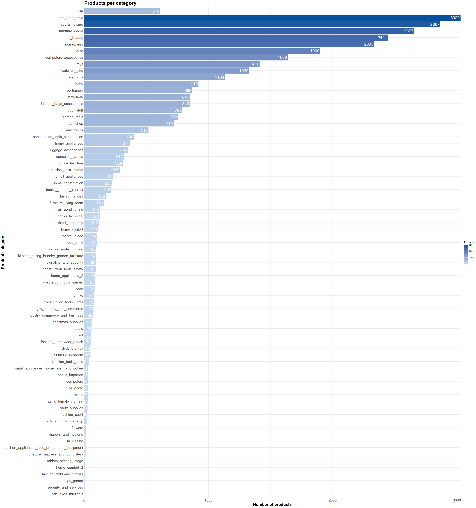
    


```R
#💻 Looking at product dimensions basic stats: 

stats <- products_df %>%
  summarise(
    n = n(),
    mean_length = mean(product_length_cm, na.rm = TRUE),
    sd_length = sd(product_length_cm, na.rm = TRUE),
    median_length = median(product_length_cm, na.rm = TRUE),
    min_length = min(product_length_cm, na.rm = TRUE),
    max_length = max(product_length_cm, na.rm = TRUE),
    mean_height = mean(product_height_cm, na.rm = TRUE),
    sd_height = sd(product_height_cm, na.rm = TRUE),
    median_height = median(product_height_cm, na.rm = TRUE),
    min_height = min(product_height_cm, na.rm = TRUE),
    max_height = max(product_height_cm, na.rm = TRUE),
    mean_width = mean(product_width_cm, na.rm = TRUE),
    sd_width = sd(product_width_cm, na.rm = TRUE),
    median_width = median(product_width_cm, na.rm = TRUE),
    min_width = min(product_width_cm, na.rm = TRUE),
    max_width = max(product_width_cm, na.rm = TRUE))

cat(glue(
"Total products: {stats$n}

Length:
mean:   {round(stats$mean_length, 2)} cm
sd:     {round(stats$sd_length, 2)} cm
median: {stats$median_length} cm
min:    {stats$min_length} cm
max:    {stats$max_length} cm

Height:
mean:   {round(stats$mean_height, 2)} cm
sd:     {round(stats$sd_height, 2)} cm
median: {stats$median_height} cm
min:    {stats$min_height} cm
max:    {stats$max_height} cm

Width:
mean:   {round(stats$mean_width, 2)} cm
sd:     {round(stats$sd_width, 2)} cm
median: {stats$median_width} cm
min:    {stats$min_width} cm
max:    {stats$max_width} cm"))
```

    Total products: 32951
    
    Length:
    mean:   30.82 cm
    sd:     16.91 cm
    median: 25 cm
    min:    7 cm
    max:    105 cm
    
    Height:
    mean:   16.94 cm
    sd:     13.64 cm
    median: 13 cm
    min:    2 cm
    max:    105 cm
    
    Width:
    mean:   23.2 cm
    sd:     12.08 cm
    median: 20 cm
    min:    6 cm
    max:    118 cm


```R
#💻 Since there are known NULLs, in order not to break the code

skim_res <- skimr::skim(
  products_df %>%
    select(product_length_cm, product_height_cm, product_width_cm))

skim_tbl <- as_tibble(skim_res)
skim_tbl
```


<table class="dataframe">
<caption>A tibble: 3 × 12</caption>
<thead>
	<tr><th scope=col>skim_type</th><th scope=col>skim_variable</th><th scope=col>n_missing</th><th scope=col>complete_rate</th><th scope=col>numeric.mean</th><th scope=col>numeric.sd</th><th scope=col>numeric.p0</th><th scope=col>numeric.p25</th><th scope=col>numeric.p50</th><th scope=col>numeric.p75</th><th scope=col>numeric.p100</th><th scope=col>numeric.hist</th></tr>
	<tr><th scope=col>&lt;chr&gt;</th><th scope=col>&lt;chr&gt;</th><th scope=col>&lt;int&gt;</th><th scope=col>&lt;dbl&gt;</th><th scope=col>&lt;dbl&gt;</th><th scope=col>&lt;dbl&gt;</th><th scope=col>&lt;dbl&gt;</th><th scope=col>&lt;dbl&gt;</th><th scope=col>&lt;dbl&gt;</th><th scope=col>&lt;dbl&gt;</th><th scope=col>&lt;dbl&gt;</th><th scope=col>&lt;chr&gt;</th></tr>
</thead>
<tbody>
	<tr><td>numeric</td><td>product_length_cm</td><td>2</td><td>0.9999393</td><td>30.81508</td><td>16.91446</td><td>7</td><td>18</td><td>25</td><td>38</td><td>105</td><td>▇▅▂▁▁</td></tr>
	<tr><td>numeric</td><td>product_height_cm</td><td>2</td><td>0.9999393</td><td>16.93766</td><td>13.63755</td><td>2</td><td> 8</td><td>13</td><td>21</td><td>105</td><td>▇▂▁▁▁</td></tr>
	<tr><td>numeric</td><td>product_width_cm </td><td>2</td><td>0.9999393</td><td>23.19673</td><td>12.07905</td><td>6</td><td>15</td><td>20</td><td>30</td><td>118</td><td>▇▃▁▁▁</td></tr>
</tbody>
</table>


```R
mode_length <- mlv(products_df$product_length_cm, method = "mfv")
cat("The most frequent product length is:", mode_length, "cm\n")

mode_height <- mlv(products_df$product_height_cm, method = "mfv")
cat("The most frequent product height is:", mode_height, "cm\n")

mode_width <- mlv(products_df$product_width_cm, method = "mfv")
cat("The most frequent product width is:", mode_width, "cm\n")
```

    The most frequent product length is: 16 cm
    The most frequent product height is: 10 cm
    The most frequent product width is: 11 cm
    


```R
#💻 Looking at products height, length and width distribution:

options(repr.plot.width = 15, repr.plot.height = 7)

products_dimensions <- products_df %>%
  select(product_length_cm, product_height_cm, product_width_cm) %>%
  pivot_longer(everything(), names_to = "dimension", values_to = "value") %>%
  filter(value > 0)  

ggplot(products_dimensions, aes(x = value, fill = dimension)) +
  geom_histogram(bins = 30, color = "white", alpha = 0.8) +
  facet_wrap(~dimension, scales = "free_x") +
  scale_fill_manual(values = c(product_length_cm = "#7c9885", product_height_cm = "#2F90DB", product_width_cm = "#b56576")) +
  coord_cartesian(xlim = c(0, NA)) +
  labs(title = "Height, Length and Width Distribution", x = "Size (cm)", y = "Product count") +
  theme_minimal() +
  theme(
    plot.title = element_text(size = 22, face = "bold"),
    axis.title.x = element_text(size = 16, face = "bold"),
    axis.title.y = element_text(size = 16, face = "bold"),
    axis.text.x  = element_text(size = 12),  
    axis.text.y  = element_text(size = 12),
    strip.text = element_text(size = 14, face = "bold"))
```


    
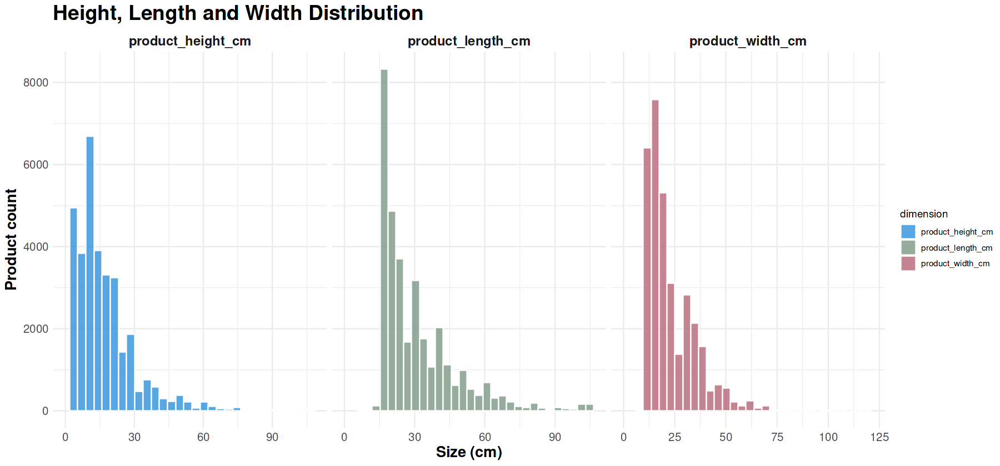
    


The faceted histogram above shows the **marginal distribution of product height, length, and width across all products**. <br>

Each panel is heavily right‑skewed ➡︎ meaing most products are relatively compact, with:
- heights clustered roughly under 30 cm,
- lengths mostly under about 40–50 cm and
- widths concentrated around 15–30 cm.

A long, sparse tail of larger values in each dimension indicates a small number of bulky items, which are the ones most likely to drive higher shipping and handling costs compared to the dense cluster of “typical” products.


```R
#💻 Here's another way to look closer at the product "outliers" based on their dimensions:

options(repr.plot.width = 10, repr.plot.height = 10)

products_long <- products_df %>%
  select(product_length_cm, product_height_cm, product_width_cm) %>%
  pivot_longer(everything(), names_to = "dimension", values_to = "value") %>%
  filter(!is.na(value))

ggplot(products_long, aes(x = dimension, y = value)) +
  geom_boxplot(outlier.colour = "red") +
  coord_cartesian(ylim = c(0, NA)) +
  labs(title = "Length, Height and Width Distribution with Outliers", x = "Dimension", y = "Size (cm)") +
theme_minimal() +
theme(plot.title = element_text(size = 22, face = "bold"),
      axis.title.x = element_text(size = 16, face = "bold"),
      axis.title.y = element_text(size = 16, face = "bold"),
      axis.text.x  = element_text(size = 14),  
      axis.text.y  = element_text(size = 14))
```


    
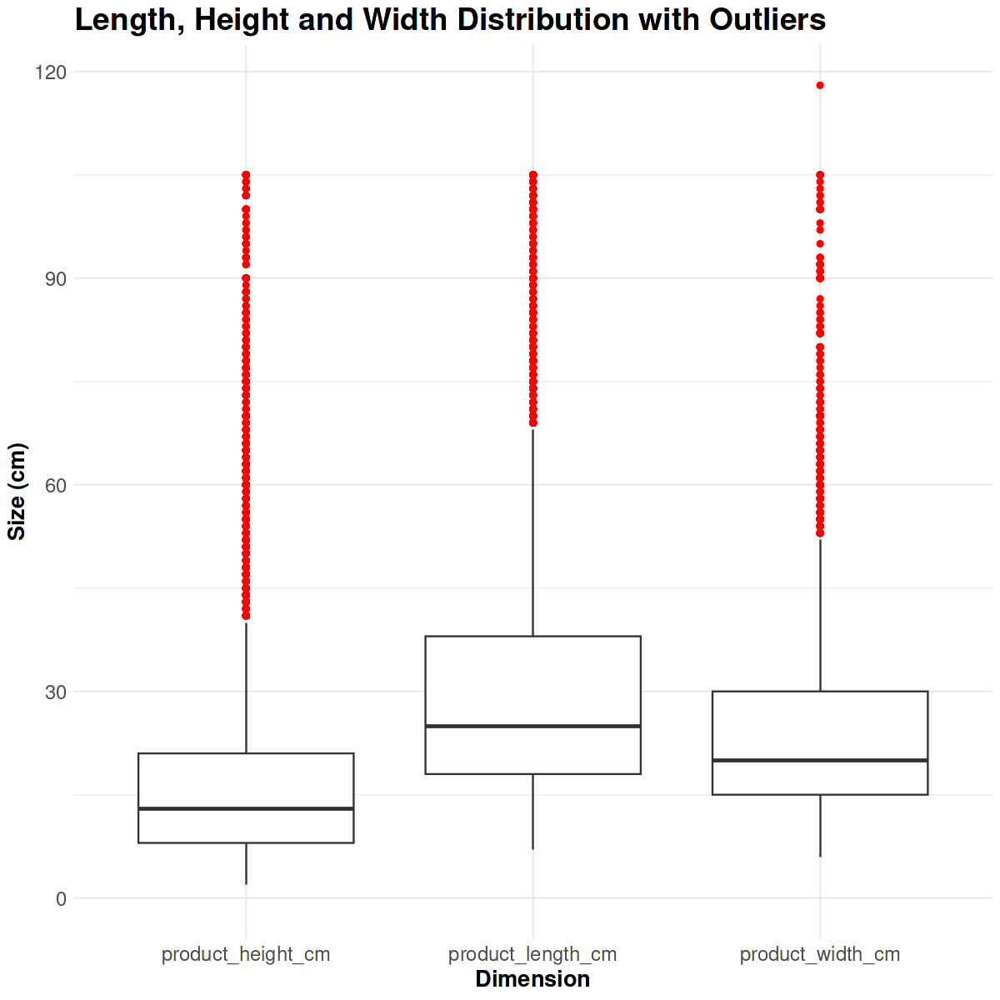
    


Plot above reveals product dimension patterns and extreme outliers.  
1. Length is the dominant dimension: product length (median ~25 cm) is consistently larger than height (~12 cm) and width (~15 cm). This suggests most products are elongated/rectangular, not cubic.
2. Height is the smallest dimension: the boxplot shows the lowest median (~12 cm) and smallest interquartile range (IQR). Most products are relatively flat (books, electronics, clothing, small home goods).
3. All three dimensions have extreme outliers.    
4. The outlier patterns are nearly identical across length/width/height (all reaching ~100-120 cm). This suggests the outliers are likely the same products measured in different orientations (mattresses, for example).
5. The boxes themselves are very compact (tight core distribution, IQR ≈ 10-15 cm for most dimensions), but the outliers extend 5-10x beyond (long tail).   

In order to "flag" and inspect “large” products, I will use percentiles (>= 75th percentile to flag product as "large", and >= 95th percentile as top 5%):


```R
#💻 Calculating thresholds for each dimension

quantiles <- products_df %>%
  summarise(
    p75_length = quantile(product_length_cm, 0.75, na.rm = TRUE),
    p95_length = quantile(product_length_cm, 0.95, na.rm = TRUE),
    p75_height = quantile(product_height_cm, 0.75, na.rm = TRUE),
    p95_height = quantile(product_height_cm, 0.95, na.rm = TRUE),
    p75_width = quantile(product_width_cm, 0.75, na.rm = TRUE),
    p95_width = quantile(product_width_cm, 0.95, na.rm = TRUE))

quantiles
```


<table class="dataframe">
<caption>A tibble: 1 × 6</caption>
<thead>
	<tr><th scope=col>p75_length</th><th scope=col>p95_length</th><th scope=col>p75_height</th><th scope=col>p95_height</th><th scope=col>p75_width</th><th scope=col>p95_width</th></tr>
	<tr><th scope=col>&lt;dbl&gt;</th><th scope=col>&lt;dbl&gt;</th><th scope=col>&lt;dbl&gt;</th><th scope=col>&lt;dbl&gt;</th><th scope=col>&lt;dbl&gt;</th><th scope=col>&lt;dbl&gt;</th></tr>
</thead>
<tbody>
	<tr><td>38</td><td>65</td><td>21</td><td>44</td><td>30</td><td>47</td></tr>
</tbody>
</table>


```R
#💻 All products at or above the 75th percentile in any dimension:

p75_len <- quantiles$p75_length
p75_hgt <- quantiles$p75_height
p75_wid <- quantiles$p75_width

large_products_75 <- products_df %>%
  filter(
    product_length_cm >= p75_len |
    product_height_cm >= p75_hgt |
    product_width_cm  >= p75_wid)

# For stricter ouliers (top 5%):

p95_len <- quantiles$p95_length
p95_hgt <- quantiles$p95_height
p95_wid <- quantiles$p95_width

large_products_95 <- products_df %>%
  filter(
    product_length_cm >= p95_len |
    product_height_cm >= p95_hgt |
    product_width_cm  >= p95_wid)
```


```R
glimpse(large_products_75)
```

    Rows: 15,260
    Columns: 10
    $ product_id                 <chr> "2885aad25d7d1963d3731a9a6ec86306", "4af41a…
    $ product_category_eng       <chr> "books_technical", "furniture_decor", "book…
    $ product_name_length        <int> 26, 53, 41, NA, 51, 54, 52, 53, 53, 63, 45,…
    $ product_description_length <int> 562, 927, 2089, NA, 688, 688, 688, 249, 568…
    $ product_photos_qty         <int> 1, 4, 1, NA, 1, 1, 1, 1, 1, 2, 3, 3, 1, 1, …
    $ product_weight_g           <int> 250, 750, 1200, 250, 250, 300, 300, 350, 30…
    $ product_length_cm          <int> 40, 22, 40, 22, 22, 22, 22, 25, 25, 38, 38,…
    $ product_height_cm          <int> 2, 2, 2, 2, 2, 2, 2, 2, 2, 2, 2, 2, 2, 2, 2…
    $ product_width_cm           <int> 12, 30, 17, 32, 32, 32, 32, 30, 30, 20, 22,…
    $ volume_cm3                 <int> 960, 1320, 1360, 1408, 1408, 1408, 1408, 15…
    


```R
glimpse(large_products_95)
```

    Rows: 4,125
    Columns: 10
    $ product_id                 <chr> "1c8ddcbd9abd12c51979969411f0b110", "479d59…
    $ product_category_eng       <chr> "furniture_decor", "furniture_decor", "furn…
    $ product_name_length        <int> 50, 49, 49, 39, 43, 55, 54, 48, 53, 54, 48,…
    $ product_description_length <int> 534, 534, 534, 534, 534, 534, 285, 272, 373…
    $ product_photos_qty         <int> 1, 1, 1, 1, 1, 1, 2, 2, 1, 2, 2, 2, 2, 1, 3…
    $ product_weight_g           <int> 650, 600, 600, 650, 600, 650, 500, 500, 300…
    $ product_length_cm          <int> 65, 65, 65, 65, 65, 65, 71, 71, 20, 71, 70,…
    $ product_height_cm          <int> 2, 2, 2, 2, 2, 2, 2, 2, 2, 2, 2, 2, 2, 2, 2…
    $ product_width_cm           <int> 13, 13, 13, 13, 13, 13, 13, 13, 60, 18, 23,…
    $ volume_cm3                 <int> 1690, 1690, 1690, 1690, 1690, 1690, 1846, 1…
    

There are 15K+ products in top 25% and there are 4K+ products, which are in the top 5% for **length OR height OR width**, which naturally outputs a lot of rows (**OR** logic)  
 
I want to check for **truly large items**, based on the combination or 75th and 95th percentile dimensions (using **AND** rather than **OR** logic)


```R
large_75_products_strict <- products_df %>%
  filter(
    product_length_cm >= 38,
    product_height_cm >= 21,
    product_width_cm  >= 30)

glimpse(large_75_products_strict)
```

    Rows: 1,958
    Columns: 10
    $ product_id                 <chr> "27c63413ca2806bcab40a31d0f862a59", "ee98d7…
    $ product_category_eng       <chr> "air_conditioning", "construction_tools_saf…
    $ product_name_length        <int> 60, 47, 43, 29, 29, 56, 56, 55, 58, 40, 41,…
    $ product_description_length <int> 1271, 2003, 785, 972, 973, 708, 708, 683, 1…
    $ product_photos_qty         <int> 1, 1, 3, 1, 1, 2, 2, 1, 5, 1, 1, 2, 1, 1, 3…
    $ product_weight_g           <int> 4550, 3125, 1825, 3510, 5455, 5400, 5700, 3…
    $ product_length_cm          <int> 40, 40, 38, 46, 46, 42, 42, 41, 48, 40, 40,…
    $ product_height_cm          <int> 21, 21, 21, 21, 21, 21, 21, 21, 21, 21, 21,…
    $ product_width_cm           <int> 32, 32, 38, 32, 32, 36, 36, 37, 32, 40, 40,…
    $ volume_cm3                 <int> 26880, 26880, 30324, 30912, 30912, 31752, 3…
    


```R
large_75_products_strict %>%
  count(product_category_eng, name = "num_75_large_products") %>%
  arrange(desc(num_75_large_products)) %>% 
mutate(
    pct_75_large_products = round(num_75_large_products / sum(num_75_large_products) * 100, 2)) %>%
  arrange(desc(num_75_large_products))
```


<table class="dataframe">
<caption>A tibble: 49 × 3</caption>
<thead>
	<tr><th scope=col>product_category_eng</th><th scope=col>num_75_large_products</th><th scope=col>pct_75_large_products</th></tr>
	<tr><th scope=col>&lt;chr&gt;</th><th scope=col>&lt;int&gt;</th><th scope=col>&lt;dbl&gt;</th></tr>
</thead>
<tbody>
	<tr><td>bed_bath_table                         </td><td>220</td><td>11.24</td></tr>
	<tr><td>furniture_decor                        </td><td>220</td><td>11.24</td></tr>
	<tr><td>housewares                             </td><td>218</td><td>11.13</td></tr>
	<tr><td>baby                                   </td><td>159</td><td> 8.12</td></tr>
	<tr><td>office_furniture                       </td><td>110</td><td> 5.62</td></tr>
	<tr><td>toys                                   </td><td>110</td><td> 5.62</td></tr>
	<tr><td>auto                                   </td><td>107</td><td> 5.46</td></tr>
	<tr><td>sports_leisure                         </td><td> 90</td><td> 4.60</td></tr>
	<tr><td>pet_shop                               </td><td> 88</td><td> 4.49</td></tr>
	<tr><td>cool_stuff                             </td><td> 79</td><td> 4.03</td></tr>
	<tr><td>garden_tools                           </td><td> 56</td><td> 2.86</td></tr>
	<tr><td>health_beauty                          </td><td> 53</td><td> 2.71</td></tr>
	<tr><td>NA                                     </td><td> 52</td><td> 2.66</td></tr>
	<tr><td>luggage_accessories                    </td><td> 40</td><td> 2.04</td></tr>
	<tr><td>home_construction                      </td><td> 27</td><td> 1.38</td></tr>
	<tr><td>small_appliances                       </td><td> 27</td><td> 1.38</td></tr>
	<tr><td>kitchen_dining_laundry_garden_furniture</td><td> 26</td><td> 1.33</td></tr>
	<tr><td>home_appliances_2                      </td><td> 25</td><td> 1.28</td></tr>
	<tr><td>musical_instruments                    </td><td> 25</td><td> 1.28</td></tr>
	<tr><td>furniture_living_room                  </td><td> 24</td><td> 1.23</td></tr>
	<tr><td>construction_tools_construction        </td><td> 22</td><td> 1.12</td></tr>
	<tr><td>air_conditioning                       </td><td> 19</td><td> 0.97</td></tr>
	<tr><td>agro_industry_and_commerce             </td><td> 17</td><td> 0.87</td></tr>
	<tr><td>computers_accessories                  </td><td> 16</td><td> 0.82</td></tr>
	<tr><td>stationery                             </td><td> 16</td><td> 0.82</td></tr>
	<tr><td>industry_commerce_and_business         </td><td> 15</td><td> 0.77</td></tr>
	<tr><td>home_appliances                        </td><td> 12</td><td> 0.61</td></tr>
	<tr><td>furniture_bedroom                      </td><td> 11</td><td> 0.56</td></tr>
	<tr><td>home_confort                           </td><td> 11</td><td> 0.56</td></tr>
	<tr><td>construction_tools_lights              </td><td> 10</td><td> 0.51</td></tr>
	<tr><td>signaling_and_security                 </td><td>  6</td><td> 0.31</td></tr>
	<tr><td>small_appliances_home_oven_and_coffee  </td><td>  6</td><td> 0.31</td></tr>
	<tr><td>christmas_supplies                     </td><td>  5</td><td> 0.26</td></tr>
	<tr><td>computers                              </td><td>  5</td><td> 0.26</td></tr>
	<tr><td>furniture_mattress_and_upholstery      </td><td>  5</td><td> 0.26</td></tr>
	<tr><td>electronics                            </td><td>  4</td><td> 0.20</td></tr>
	<tr><td>consoles_games                         </td><td>  3</td><td> 0.15</td></tr>
	<tr><td>market_place                           </td><td>  3</td><td> 0.15</td></tr>
	<tr><td>construction_tools_safety              </td><td>  2</td><td> 0.10</td></tr>
	<tr><td>costruction_tools_garden               </td><td>  2</td><td> 0.10</td></tr>
	<tr><td>fashion_bags_accessories               </td><td>  2</td><td> 0.10</td></tr>
	<tr><td>fixed_telephony                        </td><td>  2</td><td> 0.10</td></tr>
	<tr><td>perfumery                              </td><td>  2</td><td> 0.10</td></tr>
	<tr><td>art                                    </td><td>  1</td><td> 0.05</td></tr>
	<tr><td>drinks                                 </td><td>  1</td><td> 0.05</td></tr>
	<tr><td>food                                   </td><td>  1</td><td> 0.05</td></tr>
	<tr><td>la_cuisine                             </td><td>  1</td><td> 0.05</td></tr>
	<tr><td>party_supplies                         </td><td>  1</td><td> 0.05</td></tr>
	<tr><td>watches_gifts                          </td><td>  1</td><td> 0.05</td></tr>
</tbody>
</table>


```R
large_95_products_strict <- products_df %>%
  filter(
    product_length_cm >= 65,
    product_height_cm >= 44,
    product_width_cm  >= 47)

glimpse(large_95_products_strict)
```

    Rows: 44
    Columns: 10
    $ product_id                 <chr> "fd76a5a3907232c96615967475f8689f", "7fb298…
    $ product_category_eng       <chr> "furniture_decor", "furniture_decor", "cool…
    $ product_name_length        <int> 63, 60, 60, 40, 28, 59, 53, 57, 51, 50, 63,…
    $ product_description_length <int> 723, 236, 321, 969, 887, 1289, 720, 148, 12…
    $ product_photos_qty         <int> 8, 1, 1, 1, 5, 3, 1, 1, 4, 1, 7, 5, 6, 3, 4…
    $ product_weight_g           <int> 26400, 30000, 30000, 30000, 30000, 23975, 3…
    $ product_length_cm          <int> 75, 65, 95, 70, 75, 80, 80, 80, 81, 90, 65,…
    $ product_height_cm          <int> 45, 45, 45, 50, 50, 50, 50, 50, 50, 50, 50,…
    $ product_width_cm           <int> 49, 65, 55, 50, 50, 48, 50, 50, 50, 50, 70,…
    $ volume_cm3                 <int> 165375, 190125, 235125, 175000, 187500, 192…
    


```R
large_95_products_strict %>%
  count(product_category_eng, name = "num_95_large_products") %>%
  arrange(desc(num_95_large_products)) %>% 
mutate(
    pct_95_large_products = round(num_95_large_products / sum(num_95_large_products) * 100, 2)) %>%
  arrange(desc(num_95_large_products))
```


<table class="dataframe">
<caption>A tibble: 16 × 3</caption>
<thead>
	<tr><th scope=col>product_category_eng</th><th scope=col>num_95_large_products</th><th scope=col>pct_95_large_products</th></tr>
	<tr><th scope=col>&lt;chr&gt;</th><th scope=col>&lt;int&gt;</th><th scope=col>&lt;dbl&gt;</th></tr>
</thead>
<tbody>
	<tr><td>furniture_decor                        </td><td>11</td><td>25.00</td></tr>
	<tr><td>furniture_living_room                  </td><td> 8</td><td>18.18</td></tr>
	<tr><td>housewares                             </td><td> 4</td><td> 9.09</td></tr>
	<tr><td>health_beauty                          </td><td> 3</td><td> 6.82</td></tr>
	<tr><td>baby                                   </td><td> 2</td><td> 4.55</td></tr>
	<tr><td>cool_stuff                             </td><td> 2</td><td> 4.55</td></tr>
	<tr><td>industry_commerce_and_business         </td><td> 2</td><td> 4.55</td></tr>
	<tr><td>kitchen_dining_laundry_garden_furniture</td><td> 2</td><td> 4.55</td></tr>
	<tr><td>pet_shop                               </td><td> 2</td><td> 4.55</td></tr>
	<tr><td>sports_leisure                         </td><td> 2</td><td> 4.55</td></tr>
	<tr><td>consoles_games                         </td><td> 1</td><td> 2.27</td></tr>
	<tr><td>construction_tools_construction        </td><td> 1</td><td> 2.27</td></tr>
	<tr><td>garden_tools                           </td><td> 1</td><td> 2.27</td></tr>
	<tr><td>office_furniture                       </td><td> 1</td><td> 2.27</td></tr>
	<tr><td>toys                                   </td><td> 1</td><td> 2.27</td></tr>
	<tr><td>NA                                     </td><td> 1</td><td> 2.27</td></tr>
</tbody>
</table>


#### Top 25% and Top 5% large products summary: <br>

> 🔹 1958 products fall strictly into top 25% based on all 3 dimensions  
> 🔹 these 1958 products belong to 49 distinct product categories  
> 🔹 top 3 of these categories are: **1** - **bed_bath_table**, **2** - **furniture_decor** and **3** - **housewares**  


> 🔹 44 products fall strictly into top 5% based on all 3 dimensions  
> 🔹 these 44 products belong to 15 distinct product categories  
> 🔹 top 3 of these categories are: **1** - **furniture_decor**, **2** - **furniture_living_room** and **3** - **housewares**

As my next next, I want to create an additional column in order to "flag" products based on their dimensions for future analysis:

| Flag | Description                                        |
| -    | -                                                  |
| 0    | none of the dimensions fall within top 25% (also top 5%) |
| 1    | 1 of the dimensions fall within top 25%            |
| 2    | 2 of the dimensions fall within top 25%            |
| 3    | all 3 dimensions fall within top 25%               |
| 4    | 1 of the dimensions fall within top 5%             |
| 5    | 2 of the dimensions fall within top 5%             |
| 6    | all 3 dimensions fall within top 5% ➡︎ truly large |

##### In **BigQuery**, I will execute the following query: 
```
💾CREATE OR REPLACE TABLE `olist-project-yuliacarvalho.Olist_datasets.products_final` AS
WITH quantiles AS (
  SELECT
    APPROX_QUANTILES(product_length_cm, 100)[OFFSET(75)] AS p75_len,
    APPROX_QUANTILES(product_length_cm, 100)[OFFSET(95)] AS p95_len,
    APPROX_QUANTILES(product_height_cm, 100)[OFFSET(75)] AS p75_hgt,
    APPROX_QUANTILES(product_height_cm, 100)[OFFSET(95)] AS p95_hgt,
    APPROX_QUANTILES(product_width_cm, 100)[OFFSET(75)] AS p75_wid,
    APPROX_QUANTILES(product_width_cm, 100)[OFFSET(95)] AS p95_wid
  FROM `olist-project-yuliacarvalho.Olist_datasets.products_cleaned`),
scored AS (
  SELECT
    p.*,
    (CASE WHEN product_length_cm >= q.p75_len THEN 1 ELSE 0 END +
     CASE WHEN product_height_cm >= q.p75_hgt THEN 1 ELSE 0 END +
     CASE WHEN product_width_cm  >= q.p75_wid THEN 1 ELSE 0 END) AS n_75,
    (CASE WHEN product_length_cm >= q.p95_len THEN 1 ELSE 0 END +
     CASE WHEN product_height_cm >= q.p95_hgt THEN 1 ELSE 0 END +
     CASE WHEN product_width_cm  >= q.p95_wid THEN 1 ELSE 0 END) AS n_95
  FROM `olist-project-yuliacarvalho.Olist_datasets.products_cleaned` AS p
  CROSS JOIN quantiles AS q)
SELECT
  *,
  CASE
    WHEN n_95 = 3 THEN 6   
    WHEN n_95 = 2 THEN 5   
    WHEN n_95 = 1 THEN 4   
    WHEN n_75 = 3 THEN 3   
    WHEN n_75 = 2 THEN 2   
    WHEN n_75 = 1 THEN 1   
    ELSE 0                 
  END AS size_flag
FROM scored
```

##### Then I will remove **n_75** and **n_95** columns, that are not needed anymore:
```
💾CREATE OR REPLACE TABLE `olist-project-yuliacarvalho.Olist_datasets.products_final` AS
SELECT * EXCEPT(n_75, n_95)
FROM `olist-project-yuliacarvalho.Olist_datasets.products_final`
```


```R
#💻 Bringing "products_final" back here as R dataframe:

products_final_df <- dbGetQuery(connection,
  "SELECT * FROM `olist-project-yuliacarvalho.Olist_datasets.products_final`")

dim(products_final_df)
head(products_final_df)
glimpse(products_final_df)
```


<style>
.list-inline {list-style: none; margin:0; padding: 0}
.list-inline>li {display: inline-block}
.list-inline>li:not(:last-child)::after {content: "\00b7"; padding: 0 .5ex}
</style>
<ol class=list-inline><li>32951</li><li>11</li></ol>


<table class="dataframe">
<caption>A tibble: 6 × 11</caption>
<thead>
	<tr><th scope=col>product_id</th><th scope=col>product_category_eng</th><th scope=col>product_name_length</th><th scope=col>product_description_length</th><th scope=col>product_photos_qty</th><th scope=col>product_weight_g</th><th scope=col>product_length_cm</th><th scope=col>product_height_cm</th><th scope=col>product_width_cm</th><th scope=col>volume_cm3</th><th scope=col>size_flag</th></tr>
	<tr><th scope=col>&lt;chr&gt;</th><th scope=col>&lt;chr&gt;</th><th scope=col>&lt;int&gt;</th><th scope=col>&lt;int&gt;</th><th scope=col>&lt;int&gt;</th><th scope=col>&lt;int&gt;</th><th scope=col>&lt;int&gt;</th><th scope=col>&lt;int&gt;</th><th scope=col>&lt;int&gt;</th><th scope=col>&lt;int&gt;</th><th scope=col>&lt;int&gt;</th></tr>
</thead>
<tbody>
	<tr><td>09ff539a621711667c43eba6a3bd8466</td><td>baby                 </td><td>60</td><td>865</td><td> 3</td><td>  NA</td><td>NA</td><td>NA</td><td>NA</td><td> NA</td><td>0</td></tr>
	<tr><td>5eb564652db742ff8f28759cd8d2652a</td><td>NA                   </td><td>NA</td><td> NA</td><td>NA</td><td>  NA</td><td>NA</td><td>NA</td><td>NA</td><td> NA</td><td>0</td></tr>
	<tr><td>106392145fca363410d287a815be6de4</td><td>bed_bath_table       </td><td>58</td><td>309</td><td> 1</td><td>2083</td><td>12</td><td> 2</td><td> 7</td><td>168</td><td>0</td></tr>
	<tr><td>380b4664ba5bb18cc9db78ee6bac3558</td><td>watches_gifts        </td><td>44</td><td>322</td><td> 4</td><td> 250</td><td>16</td><td> 2</td><td>11</td><td>352</td><td>0</td></tr>
	<tr><td>88d524b8b5576da63abf7b16bef48a39</td><td>computers_accessories</td><td>29</td><td>692</td><td> 1</td><td> 300</td><td>16</td><td> 2</td><td>11</td><td>352</td><td>0</td></tr>
	<tr><td>dca8cbb1c9d8a2db0fbc0c36b8d1a7bc</td><td>audio                </td><td>42</td><td>671</td><td> 5</td><td> 200</td><td>16</td><td> 2</td><td>11</td><td>352</td><td>0</td></tr>
</tbody>
</table>


    Rows: 32,951
    Columns: 11
    $ product_id                 <chr> "09ff539a621711667c43eba6a3bd8466", "5eb564…
    $ product_category_eng       <chr> "baby", NA, "bed_bath_table", "watches_gift…
    $ product_name_length        <int> 60, NA, 58, 44, 29, 42, 54, 57, 44, NA, 56,…
    $ product_description_length <int> 865, NA, 309, 322, 692, 671, 221, 416, 759,…
    $ product_photos_qty         <int> 3, NA, 1, 4, 1, 5, 7, 3, 1, NA, 1, NA, 5, 2…
    $ product_weight_g           <int> NA, NA, 2083, 250, 300, 200, 150, 950, 200,…
    $ product_length_cm          <int> NA, NA, 12, 16, 16, 16, 16, 16, 16, 16, 16,…
    $ product_height_cm          <int> NA, NA, 2, 2, 2, 2, 2, 2, 2, 2, 2, 2, 2, 2,…
    $ product_width_cm           <int> NA, NA, 7, 11, 11, 11, 11, 11, 11, 11, 11, …
    $ volume_cm3                 <int> NA, NA, 168, 352, 352, 352, 352, 352, 352, …
    $ size_flag                  <int> 0, 0, 0, 0, 0, 0, 0, 0, 0, 0, 0, 0, 0, 0, 0…
    

##### Now that product dimensions columns have been looked at, I will move on to **product_name_length**, **product_description_length** and **product_photo_qty** columns 


```R
#💻 Taking a look at "product_name_length", "product_description_length" and "product_photo_qty" columns:

options(width = 200)

skim_desc <- skimr::skim(
    products_df %>% 
    select(product_name_length, product_description_length, product_photos_qty))

try(print(skim_desc), silent = TRUE) 
as_tibble(skim_desc)   

```

    ── Data Summary ────────────────────────
                               Values  
    Name                       %>%(...)
    Number of rows             32951   
    Number of columns          3       
    _______________________            
    Column type frequency:             
      numeric                  3       
    ________________________           
    Group variables            None    
    
    ── Variable type: numeric ──────────────────────────────────────────────────────────────────────────────────────────────────────────────────────────────────────────────────────────────────────────────
      skim_variable              n_missing complete_rate   mean     sd p0 p25 p50 p75 p100 hist 
    1 product_name_length              610         0.981  48.5   10.2   5  42  51  57   76 ▁▁▃▇▁
    2 product_description_length       610         0.981 771.   635.    4 339 595 972 3992 ▇▃▁▁▁
    3 product_photos_qty               610         0.981   2.19   1.74  1   1   1   3   20 ▇▁▁▁▁
    


<table class="dataframe">
<caption>A tibble: 3 × 12</caption>
<thead>
	<tr><th scope=col>skim_type</th><th scope=col>skim_variable</th><th scope=col>n_missing</th><th scope=col>complete_rate</th><th scope=col>numeric.mean</th><th scope=col>numeric.sd</th><th scope=col>numeric.p0</th><th scope=col>numeric.p25</th><th scope=col>numeric.p50</th><th scope=col>numeric.p75</th><th scope=col>numeric.p100</th><th scope=col>numeric.hist</th></tr>
	<tr><th scope=col>&lt;chr&gt;</th><th scope=col>&lt;chr&gt;</th><th scope=col>&lt;int&gt;</th><th scope=col>&lt;dbl&gt;</th><th scope=col>&lt;dbl&gt;</th><th scope=col>&lt;dbl&gt;</th><th scope=col>&lt;dbl&gt;</th><th scope=col>&lt;dbl&gt;</th><th scope=col>&lt;dbl&gt;</th><th scope=col>&lt;dbl&gt;</th><th scope=col>&lt;dbl&gt;</th><th scope=col>&lt;chr&gt;</th></tr>
</thead>
<tbody>
	<tr><td>numeric</td><td>product_name_length       </td><td>610</td><td>0.9814877</td><td> 48.476949</td><td> 10.245741</td><td>5</td><td> 42</td><td> 51</td><td> 57</td><td>  76</td><td>▁▁▃▇▁</td></tr>
	<tr><td>numeric</td><td>product_description_length</td><td>610</td><td>0.9814877</td><td>771.495285</td><td>635.115225</td><td>4</td><td>339</td><td>595</td><td>972</td><td>3992</td><td>▇▃▁▁▁</td></tr>
	<tr><td>numeric</td><td>product_photos_qty        </td><td>610</td><td>0.9814877</td><td>  2.188986</td><td>  1.736766</td><td>1</td><td>  1</td><td>  1</td><td>  3</td><td>  20</td><td>▇▁▁▁▁</td></tr>
</tbody>
</table>


```R
#💻 Summary of basic descriptive statistics:

products_final_df %>%
  summarise(
    n_products = n(),
    
    desc_missing_pct = round(mean(is.na(product_description_length)) * 100, 1),
    desc_mean = round(mean(product_description_length, na.rm = TRUE), 0),
    desc_median = round(median(product_description_length, na.rm = TRUE), 0),
    desc_p95 = round(quantile(product_description_length, 0.95, na.rm = TRUE), 0),
    
    photos_missing_pct = round(mean(is.na(product_photos_qty)) * 100, 1),
    photos_mean = round(mean(product_photos_qty, na.rm = TRUE), 1),
    photos_median = round(median(product_photos_qty, na.rm = TRUE), 1),
    photos_max = max(product_photos_qty, na.rm = TRUE),
    
    name_missing_pct = round(mean(is.na(product_name_length)) * 100, 1),
    name_mean = round(mean(product_name_length, na.rm = TRUE), 0),
    name_median = round(median(product_name_length, na.rm = TRUE), 0),
    name_p95 = round(quantile(product_name_length, 0.95, na.rm = TRUE), 0),
    name_max = max(product_name_length, na.rm = TRUE))
```


<table class="dataframe">
<caption>A tibble: 1 × 14</caption>
<thead>
	<tr><th scope=col>n_products</th><th scope=col>desc_missing_pct</th><th scope=col>desc_mean</th><th scope=col>desc_median</th><th scope=col>desc_p95</th><th scope=col>photos_missing_pct</th><th scope=col>photos_mean</th><th scope=col>photos_median</th><th scope=col>photos_max</th><th scope=col>name_missing_pct</th><th scope=col>name_mean</th><th scope=col>name_median</th><th scope=col>name_p95</th><th scope=col>name_max</th></tr>
	<tr><th scope=col>&lt;int&gt;</th><th scope=col>&lt;dbl&gt;</th><th scope=col>&lt;dbl&gt;</th><th scope=col>&lt;dbl&gt;</th><th scope=col>&lt;dbl&gt;</th><th scope=col>&lt;dbl&gt;</th><th scope=col>&lt;dbl&gt;</th><th scope=col>&lt;dbl&gt;</th><th scope=col>&lt;int&gt;</th><th scope=col>&lt;dbl&gt;</th><th scope=col>&lt;dbl&gt;</th><th scope=col>&lt;dbl&gt;</th><th scope=col>&lt;dbl&gt;</th><th scope=col>&lt;int&gt;</th></tr>
</thead>
<tbody>
	<tr><td>32951</td><td>1.9</td><td>771</td><td>595</td><td>2063</td><td>1.9</td><td>2.2</td><td>1</td><td>20</td><td>1.9</td><td>48</td><td>51</td><td>60</td><td>76</td></tr>
</tbody>
</table>


```R
options(repr.plot.width = 15, repr.plot.height = 7)

products_final_df %>%
  select(product_name_length, product_description_length, product_photos_qty) %>%
  filter(!is.na(product_name_length), !is.na(product_description_length), !is.na(product_photos_qty)) %>%
  pivot_longer(everything(), names_to = "metric", values_to = "value") %>%
  mutate(
    metric = factor(metric, levels = c("product_name_length", "product_description_length", "product_photos_qty"))) %>%
  ggplot(aes(x = value, fill = metric)) +
  geom_histogram(bins = 30, color = "white", alpha = 0.9) +
  facet_wrap(~metric, scales = "free") +
  scale_fill_manual(
    values = c(product_name_length = "#7c9885", product_description_length = "#2F90DB", product_photos_qty = "#b56576")) +
  labs(title = "Product Name, Product Description Length & Photo Count Distributions") +
  theme_minimal() +
  theme(
    plot.background = element_rect(fill = "white", color = NA),
    panel.background = element_rect(fill = "white", color = NA),
    plot.title = element_text(size = 22, face = "bold"),
    axis.title.x = element_text(size = 16, face = "bold"),
    axis.title.y = element_text(size = 16, face = "bold"),
    axis.text.x = element_text(size = 14),
    axis.text.y = element_text(size = 14),
    strip.text = element_text(size = 14, face = "bold"),
    legend.position = "none")
```


    
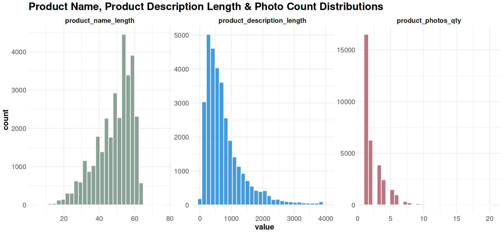
    


##### Next I want to see whether there's any correlation between: <br>

> 1. product's **volume_cm3** and it's **weight_g** (obvious hypothesis, that the larger the product ➡︎ the heavier it is) 
> 2. **product_description_length** and **product_photo_qty** (to support or disprove my hypothesis, that sellers, who invest their time in uploading more images of their products, tend to also generate a broader product description)
> 3. **product_name_length** vs **product_description_length** (do sellers prefer to place as much information to their product name and worry less about product description section?)


```R
#💻 Checking whether there's a positive Pearson correlation between product's volume_cm3 and it's weight:

products_final_df %>%
  summarise(correlation_volume_weight = cor(volume_cm3, product_weight_g, method = "pearson", use = "complete.obs"))
```


<table class="dataframe">
<caption>A tibble: 1 × 1</caption>
<thead>
	<tr><th scope=col>correlation_volume_weight</th></tr>
	<tr><th scope=col>&lt;dbl&gt;</th></tr>
</thead>
<tbody>
	<tr><td>0.8030049</td></tr>
</tbody>
</table>


```R
options(repr.plot.width = 15, repr.plot.height = 7)

products_final_df %>%
  filter(!is.na(volume_cm3), !is.na(product_weight_g)) %>%
  ggplot(aes(x = volume_cm3, y = product_weight_g)) +
  geom_point(alpha = 0.15, color = "#2F90DB") +
  geom_smooth(method = "lm", se = FALSE, color = "red") +
  labs(title = "Relationship Between Product Volume and Weight", x = "Product Volume (cm³)", y = "Product Weight (g)") +
  theme_minimal() +
  theme(
    plot.title   = element_text(size = 22, face = "bold"),
    axis.title.x = element_text(size = 16, face = "bold"),
    axis.title.y = element_text(size = 16, face = "bold"),
    axis.text.x  = element_text(size = 14),
    axis.text.y  = element_text(size = 14))
```

    `geom_smooth()` using formula = 'y ~ x'
    


    
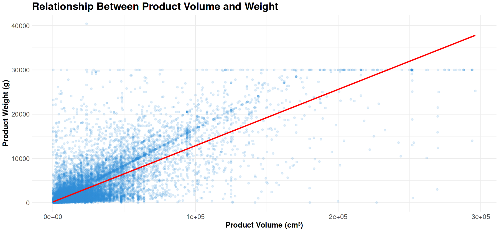
    


The Pearson correlation between product volume and weight is **0.80**, which indicates a strong positive linear relationship: as the volume increases, product weight tends to increase as well.  
The scatter plot above confirms this pattern, and the fitted regression line has a clear upward slope, even though there is noticeable spread for larger volumes (suggesting different material densities and a few very heavy outliers).  
Overall, volume is a good proxy for weight in **`products_final`** and will likely be informative for modeling freight or shipping costs.

* The histograms above show that most products have relatively short to medium‑length descriptions and only a small number of photos, with a long tail of items that are described in much more detail or have many images.
* This suggests substantial variation in how thoroughly products are presented, which could influence how confident customers feel before purchasing.
* Later in the analysis, this information will be used to test whether richer product content (longer descriptions and more photos) is associated with higher review scores, fewer post‑delivery cancellations or returns.


```R
products_final_df %>%
  summarise(correlation_desc_photos <- cor(product_description_length, product_photos_qty, method = "pearson", use = "complete.obs"))
```


<table class="dataframe">
<caption>A tibble: 1 × 1</caption>
<thead>
	<tr><th scope=col>... &lt;- NULL</th></tr>
	<tr><th scope=col>&lt;dbl&gt;</th></tr>
</thead>
<tbody>
	<tr><td>0.1087446</td></tr>
</tbody>
</table>


```R
options(repr.plot.width = 18, repr.plot.height = 7)

p <- ggplot(products_df, aes(x = product_description_length, y = product_photos_qty)) +
  geom_point(alpha = 0.15, color = "#2F90DB") +
  geom_smooth(method = "lm", se = FALSE, color = "red") +
  labs(title = "Relationship Between Product Description Length and Photo Count", x = "Product Description Length (characters)",
    y = "Number of Photos") +
  theme_minimal() +
  theme(
    plot.title   = element_text(size = 22, face = "bold"),
    axis.title.x = element_text(size = 16, face = "bold"),
    axis.title.y = element_text(size = 16, face = "bold"),
    axis.text.x  = element_text(size = 14),
    axis.text.y  = element_text(size = 14))

suppressWarnings(print(p))
```

    `geom_smooth()` using formula = 'y ~ x'
    


    
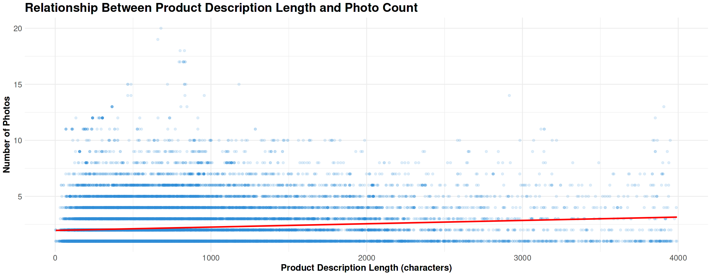
    


**Relationship between product description length and photo count ➡︎**   
The Pearson correlation of about **0.11** indicates only a very weak positive linear relationship between **product description length** and **number of photos associated**. In practice this means that products with longer descriptions tend to have slightly more photos on average, but the effect is small and there is a lot of scatter (points spread widely and only a slightly rising regression line in red). 
This weak correlation suggests that “rich content” is not managed as a single, consistent strategy in the catalog: some products have long descriptions but few photos, others have many photos but short text, and many cluster at low photo counts regardless of product description length.
So my initial hypothesis has been disprooved. <br>

**Relationship between product name length and description length ➡︎**   
Scatter plot shows a very weak positive relationship between product name length and description length: as names get longer, descriptions tend to be slightly longer on average, but the effect is small and there is heavy scatter around the regression line. A Pearson correlation of about 0.0987 confirms this; only a tiny share of the variation in description length can be explained by how long the name is, so sellers are not consistently pairing long names with proportionally longer descriptions.

### **`PRODUCTS`** PREPARE AND PROCESS phase sum-up:

🔹 Primary key validated ➡︎ **product_id**  
🔹 String columns ➡︎ trimmed  
🔹 **product_category_name** in portuguese mapped to english translation from **`product_category_name_translation`** table, portuguese-version category column deleted  
🔹 There are 610 distinct **product_id** with no **product_category** assigned  
 
- Additional columns have been created:  
              1. **volume_cm3** as a result of multiplication: length × width × height <br>
              2. **size_flag** indicates, for each product, how many of its dimensions (L, H, W) fall into higher percentile ranges, helping to classify its size category for shipping considerations

🔹 Final clean table for **<span style="color:#d62728">ANALYZE</span>** phase → **`products_final`**: 32951 clean products (100% retention of raw data)

#### **`PRODUCTS_FINAL`** **schema:**

| Column Name                 | Data Type    | Description                                                   |
|----------------------------|---------|---------------------------------------------------------------|
| product_id                 | STRING  | Unique product identifier                                     |
| product_category_eng       | STRING  | Category of the product, in English                           |
| product_name_length        | INTEGER | Number of characters extracted from the product name          |
| product_description_length | INTEGER | Number of characters extracted from the product description   |
| product_photos_qty         | INTEGER | Number of product photos published                            |
| product_weight_g           | INTEGER | Product weight measured in grams                              |
| product_length_cm          | INTEGER | Product length measured in centimeters                        |
| product_height_cm          | INTEGER | Product height measured in centimeters                        |
| product_width_cm           | INTEGER | Product width measured in centimeters                         |
| volume_cm3                 | INTEGER | Product volume in cubic centimeters (length × width × height) |
| size_flag                  | INTEGER | Categorical flag that summarizes the relative bulkiness of the product based on L, H, and W |

| Property | Value |
|-|-|
| **Total Rows** | 32951 |
| **Columns** | 11 |
| **Primary Key** | "product_id" |

---

Table has been successfully uploaded to BigQuery, an additional column has been added to calculate the difference between review placement by the customer and answer from seller in days, star-rating **review_score** replaced by "excellent" for 5 stars, "good" - 4 stars, "neutral" - 3 stars, "bad" - 2 stars and "very bad" to replace 1 star, simultaneously STRING columns were TRIMmed, and only a DATE portion of **review_creation_date** and **review_answer_timestamp** stayed:

```
💾CREATE OR REPLACE TABLE `olist-project-yuliacarvalho.Olist_datasets.order_review` AS
SELECT
  TRIM(review_id) AS review_id,
  TRIM(order_id) AS order_id,
  CASE
    WHEN review_score = 5 THEN 'excellent'
    WHEN review_score = 4 THEN 'good'
    WHEN review_score = 3 THEN 'neutral'
    WHEN review_score = 2 THEN 'bad'
    WHEN review_score = 1 THEN 'very bad'
    ELSE 'unknown'
  END AS review_score,
  TRIM(review_comment_title)   AS review_comment_title,
  TRIM(review_comment_message) AS review_comment_message,
  DATE(review_creation_date) AS review_creation_date,
  review_answer_timestamp,
  DATE_DIFF(review_answer_timestamp, review_creation_date, DAY) AS review_to_answer
FROM `olist-project-yuliacarvalho.Olist_datasets.order_review`
```


**`ORDER_REVIEWS SCHEMA`**:

| Column name             | Data Type    | Description                                                   |
|------------------------|---------|---------------------------------------------------------------|
| review_id              | STRING  | Unique identifier of the review                            |
| order_id               | STRING  | Identifier of the order associated with the review        |
| review_score           | ~~INTEGER~~ ➡︎ STRING | ~~Star rating~~ Rating given by the customer (e.g. "excellent", "bad")              |
| review_comment_title   | STRING  | Optional short title or summary of the review text         |
| review_comment_message | STRING  | Free‑text review content written by the customer           |
| review_creation_date   | DATE    | Date when the review was created by the customer            |
| review_answer_timestamp | TIMESTAMP  | Date&Time when the review was answered/responded to by the seller |
| review_to_answer       | INTEGER | Amount of days from review placement by the customer to seller's reponse |

### 3.5.5 PREPARE AND PROCESS ➤ `ORDER_REVIEW` 

Original **`order_reviews** CSV-format table contains such user-input columns like **review_comment_title** and **review_comment_message**, which, naturally, contain lots of commas. 
In order to safely upload this table to BigQuery, I need to pre-clean it in Google Sheets:

##### Column **review_comment_title**:
- This column itself is not very informative, it has many nonsense entries like "X", "xx", "*", "aaa", ",", ".", "ss", etc, but I decided to leave this fields as they are. I converted entries to TEXT format and for the sake of eliminating possible errors when uploading CSV file to BigQuery - replaced commas by semicolons. I first went ahead with an approach of wrapping all comments in double quotation marks and upload to BigQuery went through, however there were downstream issues because of "", so I changed my strategy. 

##### Column **review_comment_message**:
- The review_comment_message field can contain anything from single digits or random characters to long, well‑formed sentences, so a wide variety of text patterns is expected. In addition, when preparing the **`order_reviews`** table for BigQuery, some comments were split across multiple lines because they contained hard line breaks, which broke CSV structure and caused load errors in BigQuery. To fix this, embedded line breaks were removed or replaced with spaces so that each review occupies exactly one line in the CSV, ensuring that every row corresponds to a single, valid record.
  
- I got rid of extra spaces and standardized all entries to LOWER and converted to TEXT format (as there were numeric entries, which will throw #VALUE! error if not converted):
`=IF(XX = "", "", LOWER(TRIM(REGEXREPLACE(TO_TEXT(A2), "\s+", " "))))`

- I then replaced commas with semicolons

- In order to filter out meaningless comments, I have created an additional column using formula:
`=IF(XX = "", "none", IF(LEN(XX) < 4, "short", "ok"))`, which computes the length of the comment, and flags it accordingly based on this count: if comment cell is empty ➡︎ "none", if 3 characters and below ➡︎ "short", otherwise ➡︎ "ok". I chose 3 characters as a cutoff based on typical portuguese expressions like "boa/bom" (translates as "good"), "top", "amo" (translates as "love it"), "vlw" - a common brazilian slang short-version of "valeu" (translates "worth it"). Based on this flag I filtered out "short" comments and explored the fields, subsequently. There are lots of meaningless characters and nonsense combination of letters, but it is impossible to go over hundreds of rows manually (especially not possible to go through all "ok"-flagged comments, which though long - might very well still be a meaningless combination of letters. I, instead, will explore another approach - finding meaningful comments longer than a certain number of characters cutoff ➡︎ thus filtering out really meaningful comments from customers.
- Once cleaning is done, flag column will be deleted.

##### Column **review_creation_date**:
This field is stored as a full DATETIME format, but functionally behaves like a DATE stamp: for 99139 out of 99224 rows the TIME component is exactly 00:00:00, and only 85 reviews (0.085% of all reviews) (all dated exactly 2017‑10‑15) show 01:00:00. This small cluster of non‑midnight times on this particular single day is absolutely due to the fact, that in Brazil, daylight saving time in 2017 started on Sunday, 15 October 2017, when clocks in the affected regions were moved one hour forward at midnight. I separated just a DATE part of this column's values, as there is no need to keep meaningless timestamp.

##### Column **review_answer_timestamp**:
Given that this column captures the precise time when a review was answered, and the **review_creation_date** is effectively “date‑only”, retaining the TIME portion does not add useful information for calculating review‑to‑answer delays; for analysis it is more consistent to treat **review_creation_date** as a pure DATE field while using **review_answer_timestamp** wherever time‑of‑day detail is required. Since this column could be only useful for determining how fast a seller responds to a review (which is meaningless, since we do not have correct customer review timestamp) - I will remove TIMESTAMP portion ➡︎ **review_answer_date**. 


```R
#💻 Review_id is NOT a primary key:

review_id_pk <- run_large_query("
SELECT
  review_id,
  COUNT(*) AS count_reviews
FROM `olist-project-yuliacarvalho.Olist_datasets.order_review`
GROUP BY review_id
HAVING count_reviews > 1 
ORDER BY count_reviews DESC")
```

                              review_id count_reviews
    1  70509c441d994fa03d6c1457930c9024             3
    2  4548534449b1f572e357211b90724f1b             3
    3  32415bbf6e341d5d517080a796f79b5c             3
    4  abbfacb2964f74f6487c9c10ac46daa6             3
    5  08528f70f579f0c830189efc523d2182             3
    6  3415c9f764e478409e8e0660ae816dd2             3
    7  4d0e6dd087008d1f992d25ef6e1f619f             3
    8  832acec9bbf4efe65c3fb6423d8b4ed7             3
    9  2d6ac45f859465b5c185274a1c929637             3
    10 f4bb9d6dd4fb6dcc2298f0e7b17b8e1e             3
    


```R
#💻 Order_id is also NOT a primary key:

order_id_pk <- run_large_query("
SELECT
  order_id,
  COUNT(*) AS count_orders
FROM `olist-project-yuliacarvalho.Olist_datasets.order_review`
GROUP BY order_id
HAVING count_orders > 1 
ORDER BY count_orders DESC")
```

                               order_id count_orders
    1  df56136b8031ecd28e200bb18e6ddb2e            3
    2  8e17072ec97ce29f0e1f111e598b0c85            3
    3  03c939fd7fd3b38f8485a0f95798f1f6            3
    4  c88b1d1b157a9999ce368f218a407141            3
    5  f83c07d038cf7ce0132a5797f823e4fe            2
    6  f3ee55bf50ef2f2318599425ef80107d            2
    7  9c54a1816e487456bb7eb5082b9823ff            2
    8  f6089c47bab18faae3d90c64cfb08481            2
    9  2f8f31eb2f7b6572836d662a6625c8e4            2
    10 2deb17060fc1ce18a85eba953ddcdeaf            2
    


```R
#💻 Are there duplicate rows? 

review_duplicate_rows <- run_large_query_wide("
SELECT
  review_id,
  order_id,
  review_score,
  review_comment_title,
  review_comment_message,
  review_creation_date,
  review_answer_timestamp,
  review_to_answer,
  COUNT(*) AS dup_count
FROM `olist-project-yuliacarvalho.Olist_datasets.order_review`
GROUP BY 1, 2, 3, 4, 5, 6, 7, 8
HAVING dup_count > 1
ORDER BY dup_count DESC")
```


<table class="dataframe">
<caption>A tibble: 0 × 9</caption>
<thead>
	<tr><th scope=col>review_id</th><th scope=col>order_id</th><th scope=col>review_score</th><th scope=col>review_comment_title</th><th scope=col>review_comment_message</th><th scope=col>review_creation_date</th><th scope=col>review_answer_timestamp</th><th scope=col>review_to_answer</th><th scope=col>dup_count</th></tr>
	<tr><th scope=col>&lt;chr&gt;</th><th scope=col>&lt;chr&gt;</th><th scope=col>&lt;chr&gt;</th><th scope=col>&lt;chr&gt;</th><th scope=col>&lt;chr&gt;</th><th scope=col>&lt;chr&gt;</th><th scope=col>&lt;dttm&gt;</th><th scope=col>&lt;int64&gt;</th><th scope=col>&lt;int64&gt;</th></tr>
</thead>
<tbody>
</tbody>
</table>


```R
#💻 Combination of review_id + order_is is a composite primary key:

combo_pk <- run_small_query("
SELECT
  review_id,
  order_id,
  COUNT(*) AS pair_count
FROM `olist-project-yuliacarvalho.Olist_datasets.order_review`
GROUP BY review_id, order_id
HAVING pair_count > 1
ORDER BY pair_count DESC")
```

    [1] review_id  order_id   pair_count
    <0 rows> (or 0-length row.names)
    


```R
#💻 All column NULLs:

column_nulls <- run_small_query_wide("
SELECT
  COUNT(*) AS total_rows,
  COUNTIF(review_id IS NULL) AS review_id_nulls,
  COUNTIF(order_id IS NULL) AS order_id_nulls,
  COUNTIF(review_score IS NULL) AS review_score_nulls,
  COUNTIF(review_comment_title IS NULL) AS review_comment_title_nulls,
  COUNTIF(review_comment_message IS NULL) AS review_comment_message_nulls,
  COUNTIF(review_creation_date IS NULL) AS review_creation_date_nulls,
  COUNTIF(review_answer_timestamp IS NULL) AS review_answer_timestamp_nulls,
  COUNTIF(review_to_answer IS NULL) AS review_to_answer_nulls
FROM `olist-project-yuliacarvalho.Olist_datasets.order_review`")
```


<table class="dataframe">
<caption>A tibble: 1 × 9</caption>
<thead>
	<tr><th scope=col>total_rows</th><th scope=col>review_id_nulls</th><th scope=col>order_id_nulls</th><th scope=col>review_score_nulls</th><th scope=col>review_comment_title_nulls</th><th scope=col>review_comment_message_nulls</th><th scope=col>review_creation_date_nulls</th><th scope=col>review_answer_timestamp_nulls</th><th scope=col>review_to_answer_nulls</th></tr>
	<tr><th scope=col>&lt;int&gt;</th><th scope=col>&lt;int&gt;</th><th scope=col>&lt;int&gt;</th><th scope=col>&lt;int&gt;</th><th scope=col>&lt;int&gt;</th><th scope=col>&lt;int&gt;</th><th scope=col>&lt;int&gt;</th><th scope=col>&lt;int&gt;</th><th scope=col>&lt;int&gt;</th></tr>
</thead>
<tbody>
	<tr><td>99224</td><td>0</td><td>0</td><td>0</td><td>87658</td><td>58426</td><td>0</td><td>0</td><td>0</td></tr>
</tbody>
</table>


```R
#💻 Closer look at comment_title and comment_message column NULLs:

comment_nulls <- run_small_query_wide("
SELECT
  COUNT(*) AS total_rows,
  COUNTIF(review_comment_title IS NULL) AS comment_title_nulls,
  ROUND(COUNTIF(review_comment_title IS NULL) * 100 / COUNT(*), 2) AS title_null_pct,
  COUNTIF(review_comment_message IS NULL) AS comment_message_nulls,
  ROUND(COUNTIF(review_comment_message IS NULL) * 100 / COUNT(*), 2) AS comment_message_null_pct
FROM `olist-project-yuliacarvalho.Olist_datasets.order_review`")
```


<table class="dataframe">
<caption>A tibble: 1 × 5</caption>
<thead>
	<tr><th scope=col>total_rows</th><th scope=col>comment_title_nulls</th><th scope=col>title_null_pct</th><th scope=col>comment_message_nulls</th><th scope=col>comment_message_null_pct</th></tr>
	<tr><th scope=col>&lt;int&gt;</th><th scope=col>&lt;int&gt;</th><th scope=col>&lt;dbl&gt;</th><th scope=col>&lt;int&gt;</th><th scope=col>&lt;dbl&gt;</th></tr>
</thead>
<tbody>
	<tr><td>99224</td><td>87658</td><td>88.34</td><td>58426</td><td>58.88</td></tr>
</tbody>
</table>


In the **`order_review`** table, **review_score** has zero NULLs while **review_comment_message** is missing in 88%+ of rows and **review_comment_title** is also sparse. This pattern confirms star ratings are **mandatory** in Olist's review system — every submitted review must include a numeric score, but free-text feedback/comments remain optional. 


#### **Why mandatory star ratings?**
**Olist** likely makes star ratings mandatory to guarantee consistent, quantifiable data for critical business functions. Text comments are optional because they're effort-intensive and unstructured, while stars provide the **"minimum viable feedback"** that powers the core platform functions (matching algorithms, reputation, etc). 

##### **Most probable reasons:**

1. <span style="color:#1f77b4">**Seller performance metrics**</span> ➡︎ every order gets a score for ranking sellers, eligibility for premium listings, or contract renewals.

2. <span style="color:#1f77b4">**Platform quality signals**</span> ➡︎ aggregate scores power product recommendations, search rankings, and buyer alerts ("avoid 1-star sellers").

3. <span style="color:#1f77b4">**Regulatory/compliance**</span> ➡︎ brazilian e-commerce may require verifiable feedback for dispute resolution or consumer protection laws.

4. <span style="color:#1f77b4">**Seller accountability**</span> ➡︎ rating forces sellers to care about every order, reducing repeat bad experiences.

5. <span style="color:#1f77b4">**Faster decisions**</span> ➡︎ stars act as a "shortcut" when browsing hundreds of listings; a high percentage of buyers actually read reviews, but most just scan star ranking.


#### To sum-up:

| Purpose | Business Benefit | Customer Benefit |
|---------|------------------|------------------|
| **Seller Performance** | Ranks sellers for premium listings & contracts | Identifies reliable sellers instantly |
| **Platform Signals** | Powers recommendations, search, "avoid 1-star" alerts | Quick trust shortcuts when scanning listings |
| **Seller Accountability** | Every order counts toward reputation | Reduces repeat bad experiences |
| **Regulatory** | Verifiable feedback for disputes/consumer laws | Transparent resolution process |


```R
#💻: Quick check: are there same order_ids with various reviews assigned?:

query <- run_large_query("
SELECT 
    order_id,
    COUNT(DISTINCT review_id) AS num_reviews
FROM `olist-project-yuliacarvalho.Olist_datasets.order_review`
GROUP BY order_id
HAVING num_reviews > 1
ORDER BY num_reviews DESC")
```

                               order_id num_reviews
    1  df56136b8031ecd28e200bb18e6ddb2e           3
    2  8e17072ec97ce29f0e1f111e598b0c85           3
    3  03c939fd7fd3b38f8485a0f95798f1f6           3
    4  c88b1d1b157a9999ce368f218a407141           3
    5  f83c07d038cf7ce0132a5797f823e4fe           2
    6  f3ee55bf50ef2f2318599425ef80107d           2
    7  9c54a1816e487456bb7eb5082b9823ff           2
    8  f6089c47bab18faae3d90c64cfb08481           2
    9  2f8f31eb2f7b6572836d662a6625c8e4           2
    10 2deb17060fc1ce18a85eba953ddcdeaf           2
    


```R
#💻: multiple-review orders summary:

mult_rev_orders_sum <- run_small_query("
WITH per_order AS (
  SELECT
    r.order_id,
    COUNT(*) AS review_rows
  FROM `olist-project-yuliacarvalho.Olist_datasets.order_review` r
  GROUP BY r.order_id),
summary AS (
  SELECT
    review_rows,                          
    COUNT(*) AS n_orders
  FROM per_order
  GROUP BY review_rows)
SELECT
  review_rows,
  n_orders,
  ROUND(n_orders * 100 / SUM(n_orders) OVER (), 2) AS pct_orders
FROM summary
ORDER BY review_rows")
```

      review_rows n_orders pct_orders
    1           1    98126      99.45
    2           2      543       0.55
    3           3        4       0.00
    


```R
#💻 Every order_id from "reviews": do they exist in "orders" table, what are their "order_status" + how many reviews reference this order:

order_summary_across <- run_large_query_wide("
SELECT
  r.order_id,
  COUNT(*) AS review_rows,
  ANY_VALUE(o.order_status) AS order_status,
  CASE WHEN COUNT(o.order_id) = 0 THEN FALSE ELSE TRUE END AS exists_in_orders
FROM `olist-project-yuliacarvalho.Olist_datasets.order_review` AS r
LEFT JOIN `olist-project-yuliacarvalho.Olist_datasets.orders` AS o USING(order_id)
GROUP BY r.order_id
ORDER BY review_rows DESC, order_status
LIMIT 15")
```


<table class="dataframe">
<caption>A tibble: 15 × 4</caption>
<thead>
	<tr><th scope=col>order_id</th><th scope=col>review_rows</th><th scope=col>order_status</th><th scope=col>exists_in_orders</th></tr>
	<tr><th scope=col>&lt;chr&gt;</th><th scope=col>&lt;int&gt;</th><th scope=col>&lt;chr&gt;</th><th scope=col>&lt;lgl&gt;</th></tr>
</thead>
<tbody>
	<tr><td>03c939fd7fd3b38f8485a0f95798f1f6</td><td>3</td><td>delivered</td><td>TRUE</td></tr>
	<tr><td>8e17072ec97ce29f0e1f111e598b0c85</td><td>3</td><td>delivered</td><td>TRUE</td></tr>
	<tr><td>c88b1d1b157a9999ce368f218a407141</td><td>3</td><td>delivered</td><td>TRUE</td></tr>
	<tr><td>df56136b8031ecd28e200bb18e6ddb2e</td><td>3</td><td>delivered</td><td>TRUE</td></tr>
	<tr><td>02e723e8edb4a123d414f56cc9c4665e</td><td>2</td><td>canceled </td><td>TRUE</td></tr>
	<tr><td>714fb133a6730ab81fa1d3c1b2007291</td><td>2</td><td>canceled </td><td>TRUE</td></tr>
	<tr><td>4fafa25ee16300a26f7ef92f3d15b58b</td><td>2</td><td>canceled </td><td>TRUE</td></tr>
	<tr><td>c4ca4450ac2974ba5eeb4832b7ec724a</td><td>2</td><td>canceled </td><td>TRUE</td></tr>
	<tr><td>f6089c47bab18faae3d90c64cfb08481</td><td>2</td><td>delivered</td><td>TRUE</td></tr>
	<tr><td>2deb17060fc1ce18a85eba953ddcdeaf</td><td>2</td><td>delivered</td><td>TRUE</td></tr>
	<tr><td>4d9a297fbfa9ba6d8d70c06d4bec9ca9</td><td>2</td><td>delivered</td><td>TRUE</td></tr>
	<tr><td>c4f710df20f7d1500da1aef81a993f65</td><td>2</td><td>delivered</td><td>TRUE</td></tr>
	<tr><td>2f8f31eb2f7b6572836d662a6625c8e4</td><td>2</td><td>delivered</td><td>TRUE</td></tr>
	<tr><td>450c49623c365a4edcf0c5a2c93aa7c9</td><td>2</td><td>delivered</td><td>TRUE</td></tr>
	<tr><td>661e075fa45fa4a73a79dd6972bce18b</td><td>2</td><td>delivered</td><td>TRUE</td></tr>
</tbody>
</table>


Queries above output 99.45% of single order-review pairs, but also 547 **order_ids** associated with more than 1 review (1098 rows questionable rows in total: 543 **order_id** are associated with 2 distinct **review_id** and 4 **order_id** - with 3 distinct **review_id**).

##### **Key structural conclusions:**

Every **order_id** that appears in **`order_review`** table exists in **`orders`** table (exists_in_orders = TRUE for all), so there are no reviews pointing to non‑existent orders; this confirms referential integrity between these two tables for order keys.

At this point, 98126 distinct **order_ids** with reviews represent a large share of the overall order base (99441 total orders 99126 orders with reviews sums up to 99.68% coverage), meaning downstream satisfaction analysis can be reliably joined back to order attributes (delivery dates, payment, geography, etc.).

##### **Behavioral and data‑quality implications**

Reviews are associated with orders across all statuses (delivered, shipped, cancelled, unavailable, etc.), indicating that customers can rate experiences even when the order was not successfully completed, which is important when interpreting low scores for cancelled or problematic orders.

Because each **reviewed order** is guaranteed to have a matching record in **`orders`** table, any "orphan" records that remained have likely "appeared" from wrongful JOINs (for example, between orders and order_items, or between reviews and product‑level data) rather than the core order–review link.

Let's take a closer look at 4 **order_ids**, that each are associated with 3 different **review_ids**: 

- df56136b8031ecd28e200bb18e6ddb2e       
- 8e17072ec97ce29f0e1f111e598b0c85           
- 03c939fd7fd3b38f8485a0f95798f1f6           
- c88b1d1b157a9999ce368f218a407141   


```R
#💻 4 x 3-review orders closer look:

three_rev_orders <- run_small_query_wide("
WITH per_order AS (
  SELECT
    order_id,
    COUNT(*) AS review_rows
  FROM `olist-project-yuliacarvalho.Olist_datasets.order_review`
  GROUP BY order_id),
three_review_orders AS (
  SELECT order_id
  FROM per_order
  WHERE review_rows = 3)
SELECT r.*
FROM `olist-project-yuliacarvalho.Olist_datasets.order_review` AS r
JOIN three_review_orders AS t USING(order_id)
ORDER BY r.order_id, r.review_creation_date")
```


<table class="dataframe">
<caption>A tibble: 12 × 8</caption>
<thead>
	<tr><th scope=col>review_id</th><th scope=col>order_id</th><th scope=col>review_score</th><th scope=col>review_comment_title</th><th scope=col>review_comment_message</th><th scope=col>review_creation_date</th><th scope=col>review_answer_timestamp</th><th scope=col>review_to_answer</th></tr>
	<tr><th scope=col>&lt;chr&gt;</th><th scope=col>&lt;chr&gt;</th><th scope=col>&lt;chr&gt;</th><th scope=col>&lt;chr&gt;</th><th scope=col>&lt;chr&gt;</th><th scope=col>&lt;date&gt;</th><th scope=col>&lt;dttm&gt;</th><th scope=col>&lt;int&gt;</th></tr>
</thead>
<tbody>
	<tr><td>405eb2ea45e1dbe2662541ae5b47e2aa</td><td>03c939fd7fd3b38f8485a0f95798f1f6</td><td>neutral  </td><td>NA</td><td>seria ótimo se tivesem entregue os 3 (três) pedidos de uma única vez.                                                                                                                              </td><td>2018-03-06</td><td>2018-03-06 19:50:32</td><td>0</td></tr>
	<tr><td>b04ed893318da5b863e878cd3d0511df</td><td>03c939fd7fd3b38f8485a0f95798f1f6</td><td>neutral  </td><td>NA</td><td>um ponto negativo que achei foi a cobrança de 3 taxas de entregas; sendo que comprei os 3 produtos iguais numa só compra. e mesmo comprando os produtos juntos; chegaram separados.                </td><td>2018-03-20</td><td>2018-03-21 02:28:23</td><td>1</td></tr>
	<tr><td>f4bb9d6dd4fb6dcc2298f0e7b17b8e1e</td><td>03c939fd7fd3b38f8485a0f95798f1f6</td><td>good     </td><td>NA</td><td>NA                                                                                                                                                                                                 </td><td>2018-03-29</td><td>2018-03-30 00:29:09</td><td>1</td></tr>
	<tr><td>2d6ac45f859465b5c185274a1c929637</td><td>8e17072ec97ce29f0e1f111e598b0c85</td><td>very bad </td><td>NA</td><td>comprei 3 unidades do produto vieram 2 unidades que não corresponde com o que comprei. devido a minha opinião é negativa com relação a esse vendedor pois não não cumpriu com o prometido na venda.</td><td>2018-04-07</td><td>2018-04-07 21:13:05</td><td>0</td></tr>
	<tr><td>67c2557eb0bd72e3ece1e03477c9dff5</td><td>8e17072ec97ce29f0e1f111e598b0c85</td><td>very bad </td><td>NA</td><td>entregou o produto errado.                                                                                                                                                                         </td><td>2018-04-07</td><td>2018-04-08 22:48:27</td><td>1</td></tr>
	<tr><td>6e4c4086d9611ae4cc0cc65a262751fe</td><td>8e17072ec97ce29f0e1f111e598b0c85</td><td>very bad </td><td>NA</td><td>embora tenha entregue dentro do prazo; não enviou o produto que comprei.                                                                                                                           </td><td>2018-04-14</td><td>2018-04-16 11:37:31</td><td>2</td></tr>
	<tr><td>fb96ea2ef8cce1c888f4d45c8e22b793</td><td>c88b1d1b157a9999ce368f218a407141</td><td>excellent</td><td>NA</td><td>NA                                                                                                                                                                                                 </td><td>2017-07-21</td><td>2017-07-26 13:45:15</td><td>5</td></tr>
	<tr><td>202b5f44d09cd3cfc0d6bd12f01b044c</td><td>c88b1d1b157a9999ce368f218a407141</td><td>excellent</td><td>NA</td><td>NA                                                                                                                                                                                                 </td><td>2017-07-22</td><td>2017-07-26 13:40:22</td><td>4</td></tr>
	<tr><td>ffb8cff872a625632ac983eb1f88843c</td><td>c88b1d1b157a9999ce368f218a407141</td><td>neutral  </td><td>NA</td><td>NA                                                                                                                                                                                                 </td><td>2017-07-22</td><td>2017-07-26 13:41:07</td><td>4</td></tr>
	<tr><td>72a1098d5b410ae50fbc0509d26daeb9</td><td>df56136b8031ecd28e200bb18e6ddb2e</td><td>excellent</td><td>NA</td><td>NA                                                                                                                                                                                                 </td><td>2017-02-07</td><td>2017-02-10 10:46:09</td><td>3</td></tr>
	<tr><td>c444278834184f72b1484dfe47de7f97</td><td>df56136b8031ecd28e200bb18e6ddb2e</td><td>excellent</td><td>NA</td><td>NA                                                                                                                                                                                                 </td><td>2017-02-08</td><td>2017-02-14 13:58:48</td><td>6</td></tr>
	<tr><td>44f3e54834d23c5570c1d010824d4d59</td><td>df56136b8031ecd28e200bb18e6ddb2e</td><td>excellent</td><td>NA</td><td>NA                                                                                                                                                                                                 </td><td>2017-02-09</td><td>2017-02-09 09:07:28</td><td>0</td></tr>
</tbody>
</table>


It seems, like the review table is event-based, not transactional and Olist did not enforce uniqueness at the database level.
This is totally a valid business behavior:

🔹 Buyers can update their review  
🔹 Buyers can re-write their review  
🔹 Or submit multiple review attempts  
🔹 Or platform retries API submission  
🔹 Or sellers re-send the request for feedback  
🔹 Or the API duplicates a review during network retry  

And Olist’s backend stores each review attempt as a brand new review_id, even if:

◽ the content is identical  
◽ the timestamps match  
◽ the score is unchanged  

➡︎ every attempt to submit a review creates a new row:  
⚠️ If the UI glitches ➡︎ two rows exist    
⚠️ If the customer edits their review but changes nothing ➡︎ same text, new row    

This produces:

🔸**DIFFERENT** review_id  
🔸**SAME** order_id  
🔸**SAME** timestamps  
🔸**SAME** score and review message  

##### As a Data Analyst, working for Olist, I would document my decision:

🔹 99.45% orders: 1 review ➡︎ use directly for downstream analysis  
🔹 543 orders: 2 reviews ➡︎ Selected latest review (customer final opinion)  
🔹 4 orders: 3 reviews ➡︎ Selected latest review (rare occurence → edge case handling)  

**Rationale:** Latest review reflects final customer opinion for satisfaction analysis

This will give me clean 1-to-1 order-review mapping, while acknowledging the event-based nature of **`order_review`** table.

In BigQuery:
```
💾CREATE OR REPLACE TABLE `olist-project-yuliacarvalho.Olist_datasets.order_review_deduped` AS
WITH latest_reviews AS (
  SELECT 
    review_id,
    order_id,
    review_score,
    review_comment_title,
    review_comment_message,
    review_creation_date,
    review_answer_timestamp,
    review_to_answer,
    ROW_NUMBER() OVER (PARTITION BY order_id ORDER BY review_creation_date DESC) AS row_num
  FROM `olist-project-yuliacarvalho.Olist_datasets.order_review`)
SELECT 
  * EXCEPT(row_num)
FROM latest_reviews
WHERE row_num = 1
```

Resulting **`order_review_deduped`** table has 98673 total rows


```R
#💻 Do all orders from "orders" table have a review in "order_review" table?:

order_review_coverage <- run_small_query("
WITH order_review_coverage AS (
  SELECT 
    o.order_id,
    o.order_status,
    CASE 
      WHEN r.order_id IS NULL THEN 'No Review'
      ELSE 'Has Review'
    END AS review_status,
    COUNT(r.order_id) OVER (PARTITION BY o.order_id) AS review_count
  FROM `olist-project-yuliacarvalho.Olist_datasets.orders` AS o
  LEFT JOIN `olist-project-yuliacarvalho.Olist_datasets.order_review_deduped` AS r USING(order_id))
    
SELECT 
  review_status,
  COUNT(*) AS order_count,
  ROUND(COUNT(*) * 100 / SUM(COUNT(*)) OVER(), 2) AS pct_coverage
FROM order_review_coverage
GROUP BY review_status
ORDER BY order_count DESC")
```

      review_status order_count pct_coverage
    1    Has Review       98673        99.23
    2     No Review         768         0.77
    

Further cross-examation with **`orders`** table showed, that 99.2% of all orders from the given timeframe have a star-rating. 

I will further explore those 768 **order_ids** without a review. My hypothesis at this timepoint is that probably these orders were "cancelled" shortly after placement, that's why they did not "make it" further in the processing pipeline.


```R
#💻: What are "order_status" for non-reviewed orders? (total count):

non_reviewed_statuses <- run_small_query("
WITH order_review_coverage AS (
  SELECT 
    o.order_id,
    o.order_status,
    CASE 
      WHEN r.order_id IS NULL THEN 'No Review'
      ELSE 'Has Review'
    END AS review_status,
    COUNT(r.order_id) OVER (PARTITION BY o.order_id) AS review_count
  FROM `olist-project-yuliacarvalho.Olist_datasets.orders` AS o
  LEFT JOIN `olist-project-yuliacarvalho.Olist_datasets.order_review_deduped` AS r
    USING(order_id))

SELECT 
  order_status,
  COUNT(*) AS orders_without_review
FROM order_review_coverage
WHERE review_status = 'No Review'
GROUP BY order_status
ORDER BY orders_without_review DESC")
```

      order_status orders_without_review
    1    delivered                   646
    2      shipped                    75
    3     canceled                    20
    4  unavailable                    14
    5   processing                     6
    6     invoiced                     5
    7      created                     2
    

##### My hypothesis was disproved. Majority on un-reviewed orders are actually "delivered".  
This could mean that: 
> * leaving a review is optional in Olist platform  or   
> * reviews for orders placed near the end of the dataset timeframe may have been submitted later and thus fall outside the dataset’s coverage 


```R
#💻: Quick check: are there "stray" reviews, associated with order_ids, non-existent in "orders" table?

orphaned_reviews <- run_small_query("
SELECT 
  COUNT(*) AS orphaned_reviews
FROM `olist-project-yuliacarvalho.Olist_datasets.order_review_deduped` AS r
LEFT JOIN `olist-project-yuliacarvalho.Olist_datasets.orders` AS o USING(order_id)
WHERE o.order_id IS NULL")
```

      orphaned_reviews
    1                0
    


```R
#💻 Let's find distinct reviews: 

distinct_reviews <- run_small_query("
SELECT
LEFT(review_comment_message, 100) AS review_preview,
COUNT(*) AS review_count
FROM `olist-project-yuliacarvalho.Olist_datasets.order_review_deduped`
GROUP BY review_preview
HAVING review_count > 1
ORDER BY review_count
LIMIT 25")
```

                                           review_preview review_count
    1  produto de ótima qualidade e entrega super rápida.            2
    2                                            gostei .            2
    3                         adoro comprar nas lannister            2
    4                                  muito bom produto.            2
    5                        ótima loja recomendo a todos            2
    6                                         sensacional            2
    7                                     excelente loja.            2
    8                         produto não chegou no prazo            2
    9                            quero devolver o produto            2
    10                          muito bom comprar com vcs            2
    11                               fiz uma ótima compra            2
    12                                 muito bem embalado            2
    13                              não recebi mercadoria            2
    14                   chegou antes do prazo; parabéns!            2
    15                                      chegou rápido            2
    16                                       adorei muito            2
    17                      chegou antes da data prevista            2
    18                                 o produto não veio            2
    19                                     tudo excelente            2
    20                                              bom !            2
    21                                  recomendo!!!!!!!!            2
    22                           tudo dentro do esperado.            2
    23                                   muito boa a loja            2
    24                                        maravilhosa            2
    25                           não recebi meus produtos            2
    

While it was determined, that there are no duplicate rows, and though output from the query above is truncated, there are quite a lot of identical **review_comment_messages**, and I am not talking about obviously redundant ones, like "Ok" and "Bom!", but rather ones, that are long, descriptive and very specific. This could potentially happen when a customer decides to fully copy-paste someone else's comment for the product.

If this is the case - a combination of **order_id + review_id** would be a way to distinguish these comments.

However, further "investigation" revealed, that there are entries, where not only the **review_comment_message**, but also timestamps are exactly identical.

Let's look at one of the examples, **review_id = "4548534449b1f572e357211b90724f1b"**


```R
review_inconsistency <- run_small_query_wide("
SELECT *
FROM `olist-project-yuliacarvalho.Olist_datasets.order_review_deduped`
WHERE review_id = '4548534449b1f572e357211b90724f1b'")
```


<table class="dataframe">
<caption>A tibble: 3 × 8</caption>
<thead>
	<tr><th scope=col>review_id</th><th scope=col>order_id</th><th scope=col>review_score</th><th scope=col>review_comment_title</th><th scope=col>review_comment_message</th><th scope=col>review_creation_date</th><th scope=col>review_answer_timestamp</th><th scope=col>review_to_answer</th></tr>
	<tr><th scope=col>&lt;chr&gt;</th><th scope=col>&lt;chr&gt;</th><th scope=col>&lt;chr&gt;</th><th scope=col>&lt;chr&gt;</th><th scope=col>&lt;chr&gt;</th><th scope=col>&lt;date&gt;</th><th scope=col>&lt;dttm&gt;</th><th scope=col>&lt;int&gt;</th></tr>
</thead>
<tbody>
	<tr><td>4548534449b1f572e357211b90724f1b</td><td>73a8ed1078e1d475d2b1fb7216a52e1a</td><td>very bad</td><td>NA</td><td>quero devolver o produto comprei um veio outro;;; quero meu dinheiro de volta.</td><td>2018-08-18</td><td>2018-08-19 00:39:54</td><td>1</td></tr>
	<tr><td>4548534449b1f572e357211b90724f1b</td><td>a2ac6dad85cf8af5b0afb510a240fe8c</td><td>very bad</td><td>NA</td><td>quero devolver o produto comprei um veio outro;;; quero meu dinheiro de volta.</td><td>2018-08-18</td><td>2018-08-19 00:39:54</td><td>1</td></tr>
	<tr><td>4548534449b1f572e357211b90724f1b</td><td>cfdfd7862e532c4ec1ed1c6a1b56d320</td><td>very bad</td><td>NA</td><td>quero devolver o produto comprei um veio outro;;; quero meu dinheiro de volta.</td><td>2018-08-18</td><td>2018-08-19 00:39:54</td><td>1</td></tr>
</tbody>
</table>


This **review_id** is assigned to 3 different **order_ids**, all the other column values are completely identical!  
                           
I have to find all other cases like that (same review_id + identical content, different order_ids)  
Query below will return every duplicated review where all fields are identical, but attached to multiple orders:


```R
#💻 Same review_id + identical content, different order_ids: 

dup_reviews <- run_small_query_wide("
SELECT
  review_id,
  review_score,
  review_comment_title,
  review_comment_message,
  review_creation_date,
  review_answer_timestamp,
  COUNT(*) AS duplicate_rows,
  STRING_AGG(order_id ORDER BY order_id) AS order_ids
FROM `olist-project-yuliacarvalho.Olist_datasets.order_review_deduped`
GROUP BY
  review_id,
  review_score,
  review_comment_title,
  review_comment_message,
  review_creation_date,
  review_answer_timestamp
HAVING COUNT(*) > 1
ORDER BY duplicate_rows DESC, review_creation_date
LIMIT 20")
```


<table class="dataframe">
<caption>A tibble: 20 × 8</caption>
<thead>
	<tr><th scope=col>review_id</th><th scope=col>review_score</th><th scope=col>review_comment_title</th><th scope=col>review_comment_message</th><th scope=col>review_creation_date</th><th scope=col>review_answer_timestamp</th><th scope=col>duplicate_rows</th><th scope=col>order_ids</th></tr>
	<tr><th scope=col>&lt;chr&gt;</th><th scope=col>&lt;chr&gt;</th><th scope=col>&lt;chr&gt;</th><th scope=col>&lt;chr&gt;</th><th scope=col>&lt;date&gt;</th><th scope=col>&lt;dttm&gt;</th><th scope=col>&lt;int&gt;</th><th scope=col>&lt;chr&gt;</th></tr>
</thead>
<tbody>
	<tr><td>70509c441d994fa03d6c1457930c9024</td><td>excellent</td><td>NA                      </td><td>NA                                                                                                                                                     </td><td>2017-04-11</td><td>2017-04-13 21:12:43</td><td>3</td><td>071ff3583bbaab9f38f020af7006a3d4,748f5318aa38169f5901337bfec3afea,98567268fada7e240bf12be972e03a19</td></tr>
	<tr><td>1fb4ddc969e6bea80e38deec00393a6f</td><td>excellent</td><td>NA                      </td><td>NA                                                                                                                                                     </td><td>2017-08-11</td><td>2017-08-12 14:35:35</td><td>3</td><td>3c1098cb17277b62cfc709c7a9b500f5,afed4265a8b956d840bc032e54dfccd1,d6dde74bdeb424af6b660214881b4845</td></tr>
	<tr><td>38821b5c496b678cf91acc34892805ad</td><td>excellent</td><td>NA                      </td><td>NA                                                                                                                                                     </td><td>2017-09-03</td><td>2017-09-05 12:12:51</td><td>3</td><td>02e723e8edb4a123d414f56cc9c4665e,2613fb342bec59126f9c5180a5bc95ec,2d4bc14df7f5eaf36d2ef6d9a5b7c0d8</td></tr>
	<tr><td>69a1068c3128a14994e3e422e4539e04</td><td>excellent</td><td>NA                      </td><td>NA                                                                                                                                                     </td><td>2017-09-06</td><td>2017-09-08 00:24:52</td><td>3</td><td>175e7244409a1c34674cdd3407e25808,200331f78002771b79409a9cf7962dfa,30d7ab7638f1f3420e09474f704fe784</td></tr>
	<tr><td>e44840754f12fad2b8646712121b349a</td><td>good     </td><td>NA                      </td><td>NA                                                                                                                                                     </td><td>2017-11-01</td><td>2017-11-02 00:11:06</td><td>3</td><td>57cc72d3e635bf57199d76328279b875,6ceabf34d230c31f161988dd2ff8fa92,fb265b2dc558a56445dfc48f8224e201</td></tr>
	<tr><td>dbdf1ea31790c8ecfcc6750525661a9b</td><td>very bad </td><td>NA                      </td><td>o produto veio embalado apenas por um frágil envelope; o que ocasionou o fato da caixa do cartucho ficar totalmente destruída.                         </td><td>2018-03-20</td><td>2018-03-21 01:02:05</td><td>3</td><td>3cf387bb14e9db171ccbb9b87ea607bb,9406240a4e41945ba492020a2702f757,fa06c9f04ef55a2a43f2246a0777b7c8</td></tr>
	<tr><td>f4bb9d6dd4fb6dcc2298f0e7b17b8e1e</td><td>good     </td><td>NA                      </td><td>NA                                                                                                                                                     </td><td>2018-03-29</td><td>2018-03-30 00:29:09</td><td>3</td><td>03c939fd7fd3b38f8485a0f95798f1f6,7791eb26e081ed5f8dd15b40c45393a3,9dc9cfe8dd61f0e37b0baa3043517059</td></tr>
	<tr><td>4d0e6dd087008d1f992d25ef6e1f619f</td><td>good     </td><td>NA                      </td><td>NA                                                                                                                                                     </td><td>2018-06-12</td><td>2018-06-17 23:48:04</td><td>3</td><td>97f95535ada31d6fa853230e815ee4e3,cd0343141ac675cd40fab2c7fd2e99cc,d415e95816c2f3a2a34e06cd519157cc</td></tr>
	<tr><td>3415c9f764e478409e8e0660ae816dd2</td><td>excellent</td><td>NA                      </td><td>NA                                                                                                                                                     </td><td>2018-07-31</td><td>2018-07-31 23:11:57</td><td>3</td><td>4d59cc2a2e7bb6c0a851725f5888a9b5,4d808ed2901ed7dfebbb74bf1cbb74f6,572c4bbf0f5f85a9b4a2c4fe0c7f04d5</td></tr>
	<tr><td>08528f70f579f0c830189efc523d2182</td><td>very bad </td><td>produto errado          </td><td>entrega do produto diferente do solicitado aguardo orientação para a troca                                                                             </td><td>2018-08-03</td><td>2018-08-06 00:09:52</td><td>3</td><td>03310aa823a66056268a3bab36e827fb,53c71d3953507c6239ff73917ed358c9,7813842ae95e8c497fc0233232ae815a</td></tr>
	<tr><td>abbfacb2964f74f6487c9c10ac46daa6</td><td>neutral  </td><td>NA                      </td><td>NA                                                                                                                                                     </td><td>2018-08-15</td><td>2018-08-19 22:35:54</td><td>3</td><td>47282cfe5747c1c19920f090e491d285,81b7c7bbc8ec003eeb67d87441a6a148,b02682757340133856bfb99145dd61cd</td></tr>
	<tr><td>4548534449b1f572e357211b90724f1b</td><td>very bad </td><td>NA                      </td><td>quero devolver o produto comprei um veio outro;;; quero meu dinheiro de volta.                                                                         </td><td>2018-08-18</td><td>2018-08-19 00:39:54</td><td>3</td><td>73a8ed1078e1d475d2b1fb7216a52e1a,a2ac6dad85cf8af5b0afb510a240fe8c,cfdfd7862e532c4ec1ed1c6a1b56d320</td></tr>
	<tr><td>32415bbf6e341d5d517080a796f79b5c</td><td>bad      </td><td>carteira de couro marrom</td><td>o produto veio com defeito! espero que não demore muito a troca pois foi comprada para presentear!                                                     </td><td>2018-08-29</td><td>2018-08-31 22:29:09</td><td>3</td><td>1ad22e16129698e1a3cc11e4350d2cb7,65fdcb432cb9cfa970e3a3817b39040d,bd35b677fd239386e9861d11ae98ab56</td></tr>
	<tr><td>9e25d6e3025e9b9a0fc7f03588d33e2b</td><td>very bad </td><td>razoavel                </td><td>peço um produto por um código e vem outro totalmente diferente.                                                                                        </td><td>2018-08-31</td><td>2018-09-03 09:33:00</td><td>3</td><td>0d3adebce4bebc1f80a7f36e9833f497,52b7fa35b1e5c8bdea5869804dced415,869997fbe01f39d184956b5c6bccfdbe</td></tr>
	<tr><td>d6de9b9a11c919860b73e5b421d1ec46</td><td>good     </td><td>NA                      </td><td>recebi o produto na data programada. é fácil de montar e muito prático para pendurar roupas e sapatos. só que aguenta uma quantidade pequena de roupas.</td><td>2016-10-26</td><td>2016-10-28 21:42:42</td><td>2</td><td>6b5e619dedba6d4297fb10dd5886912f,d868cf92a5a1305fc7277c60062e81ac                                 </td></tr>
	<tr><td>87159a093663b2a1bb847dbb84879c41</td><td>excellent</td><td>NA                      </td><td>excelente produto. vendedor nota 1000                                                                                                                  </td><td>2016-10-29</td><td>2016-10-31 20:00:13</td><td>2</td><td>b19169c7cb8391fb8561e094d61c531a,c4f710df20f7d1500da1aef81a993f65                                 </td></tr>
	<tr><td>9dc50077272395ec4c7dcf0ff89be4fa</td><td>excellent</td><td>NA                      </td><td>super recomendo..um encanto :-)                                                                                                                        </td><td>2017-01-21</td><td>2017-01-23 09:57:30</td><td>2</td><td>4fe2e8b329e56a00aba9b0136b46f00f,c5a468ae781ffb0ec6d36ae89fe512b0                                 </td></tr>
	<tr><td>6689aabfeb781e9fc59aceb91b5de579</td><td>neutral  </td><td>NA                      </td><td>so demorou um pouco mais valeu                                                                                                                         </td><td>2017-01-25</td><td>2017-01-26 02:28:29</td><td>2</td><td>df410b19c3e348fb548ae68badd49827,ed2ea4498bcd56d90d461a23fa47ac56                                 </td></tr>
	<tr><td>b118cdef6c3c167e2c6b4db66a80c9f6</td><td>excellent</td><td>NA                      </td><td>NA                                                                                                                                                     </td><td>2017-01-26</td><td>2017-02-01 15:37:28</td><td>2</td><td>abef8b5d0f7fa066c7473db7d650c870,e068276f5e75a66212f75b84ebfeaccf                                 </td></tr>
	<tr><td>43a8434857dbf1118c88adfd7773f67b</td><td>excellent</td><td>NA                      </td><td>NA                                                                                                                                                     </td><td>2017-01-27</td><td>2017-02-01 18:20:11</td><td>2</td><td>0675116b5556a78cf0413f70aa9f235e,6e4a67f3a94e46e6cc5af48093d14127                                 </td></tr>
</tbody>
</table>


Query above outputs 541 rows (**review_ids** + corresponding info), associated with more than 1 **order_id**. 

This cannot be explained by copy-pasting of previous comments by customers, as timestamp is system-generated, it cannot be copied.

Since **order_id** is a unique identifier of a single order, even if multiple products were ordered simultaneously (as seen in **`order_items`** table: a combo of **order_id + order_item_id** is a primary key), existence of 3 identical reviews cannot be explained by totally different **order_ids**. Especially when the **review_answer_timestamp** with exact precise TIME available cannot be explained. 

From my point of view, this is a **data quality issue** ➜ identical reviews (score, text, creation date, precise answer timestamp) across 3 distinct orders cannot be legitimate business behavior. The precise **review_answer_timestamp** matching down to the second eliminates any timezone/DST explanation.

##### 🧠 What may have caused this? 

Most likely causes are:  
    🔸 ETL duplication during data ingest (same review record was loaded 3x to different order_ids due to join errors or bad primary/foreign mapping in the pipeline)  
    🔸 Platform bug (Olist's review system had a glitch where one customer's feedback was incorrectly associated with multiple orders (e.g., copy-paste error in their backend).  
    🔸 Data entry error (duplication due to faulty manual process or API calls)


I have to decide on how I am going to approach further deduplication. 

#### Plan:
> **`Step 1`**: enrich **`order_review`** by appending **order_purchase_timestamp** column from **`orders`** (**order_purchase_timestamp** column has no NULLs and is the most stable, business-logic-consistent date, unlike **order_approved_at**: has NULLs and introduces atrificial delays, because it depends on payment confirmation)  
> **`Step 2`**: compare the review creation date with the purchase date to identify and flag cases where the review date precedes the purchase date. These temporal inconsistencies will indicate entries, that can be excluded from the table without further investigation:
>> **Flags:**  
    - **<span style="color:red">IMPOSSIBLE</span>** → Review before purchase → clear data quality issue  
    - **<span style="color:#ff7f0e">SUSPECT</span>** → Review >90 days after purchase → unlikely behavior  
    - **<span style="color:green">VALID</span>** → Normal records  

> **`Step 3`**: explore <span style="color:#ff7f0e">SUSPECT</span> and <span style="color:red">IMPOSSIBLE</span> flags


🔧 **Step 1 + 2:**

```
💾CREATE OR REPLACE TABLE `olist-project-yuliacarvalho.Olist_datasets.order_review_enriched` AS
WITH enriched_reviews AS (
  SELECT 
    r.order_id,
    r.review_id,
    r.review_score,
    r.review_comment_title,
    r.review_comment_message,
    r.review_creation_date,
    r.review_answer_timestamp,
    o.order_purchase_timestamp,
    o.order_status,
    o.order_delivered_carrier_date,
    o.order_delivered_customer_date
    CASE 
      WHEN r.review_creation_date < DATE(o.order_purchase_timestamp) THEN 'IMPOSSIBLE'
      WHEN r.review_creation_date > DATE_ADD(DATE(o.order_purchase_timestamp), INTERVAL 90 DAY) THEN 'SUSPECT'
      ELSE 'VALID'
    END AS temporal_flag
  FROM `olist-project-yuliacarvalho.Olist_datasets.order_review_deduped` AS r
  LEFT JOIN `olist-project-yuliacarvalho.Olist_datasets.orders` AS o USING(order_id))
SELECT * FROM enriched_reviews
```

While I have created this **`order_review_enriched`** table, I would like to take the opportunity to perform additional analyses that can provide deeper insights into the review process and customer behavior. Specifically, I plan to calculate metrics such as the average time between the order being delivered by the carrier and the creation of the review by the customer, which can help identify patterns in customer feedback timing. These enriched features will not only enhance the dataset for exploratory data analysis but also support further investigations, such as correlations between review scores, delivery times, and order statuses. By leveraging this opportunity, I can build a more comprehensive understanding of the dynamics between order fulfillment and customer feedback.


```R
#💻 Average delivery-to-review time:

avg_devlivery_to_review <- run_small_query("
SELECT 
  AVG(DATE_DIFF(review_creation_date, DATE(order_delivered_carrier_date), DAY)) AS avg_days_to_review
FROM `olist-project-yuliacarvalho.Olist_datasets.order_review_enriched`
WHERE order_delivered_carrier_date IS NOT NULL AND review_creation_date IS NOT NULL")
```

      avg_days_to_review
    1           9.875535
    

Naturally, this **average delivery-to-review** value is preliminary, as it only considers orders that have been delivered and does not account for other order statuses where a review might exist. More comprehensive and definitive calculations will be performed in the **Analyze phase**, once the **`orders`** table has been fully cleaned and is ready for extracting insights.


```R
#💻 Reviewing flags:

flags_summary <- run_small_query("
SELECT
  DISTINCT temporal_flag,
  COUNT(*) AS flag_count,
  ROUND(COUNT(*) * 100 / SUM(COUNT(*)) OVER(), 2) AS pct_coverage
FROM `olist-project-yuliacarvalho.Olist_datasets.order_review_enriched`
GROUP BY temporal_flag
ORDER BY flag_count")
```

      temporal_flag flag_count pct_coverage
    1       SUSPECT          6         0.01
    2    IMPOSSIBLE         61         0.06
    3         VALID      98606        99.93
    


```R
#💻 SUSPECT flags:

suspect_flags <- run_small_query_wide("
SELECT *
FROM `olist-project-yuliacarvalho.Olist_datasets.order_review_enriched`
WHERE temporal_flag = 'SUSPECT'")
```


<table class="dataframe">
<caption>A tibble: 6 × 13</caption>
<thead>
	<tr><th scope=col>order_id</th><th scope=col>review_id</th><th scope=col>review_score</th><th scope=col>review_comment_title</th><th scope=col>review_comment_message</th><th scope=col>review_creation_date</th><th scope=col>review_answer_timestamp</th><th scope=col>review_to_answer</th><th scope=col>order_purchase_timestamp</th><th scope=col>order_status</th><th scope=col>order_delivered_carrier_date</th><th scope=col>order_delivered_customer_date</th><th scope=col>temporal_flag</th></tr>
	<tr><th scope=col>&lt;chr&gt;</th><th scope=col>&lt;chr&gt;</th><th scope=col>&lt;chr&gt;</th><th scope=col>&lt;chr&gt;</th><th scope=col>&lt;chr&gt;</th><th scope=col>&lt;date&gt;</th><th scope=col>&lt;dttm&gt;</th><th scope=col>&lt;int&gt;</th><th scope=col>&lt;dttm&gt;</th><th scope=col>&lt;chr&gt;</th><th scope=col>&lt;dttm&gt;</th><th scope=col>&lt;dttm&gt;</th><th scope=col>&lt;chr&gt;</th></tr>
</thead>
<tbody>
	<tr><td>6d58638e32674bebee793a47ac4cbadc</td><td>37fed312fd03fa1d0bd2da168cf6f5c0</td><td>very bad </td><td>NA                  </td><td>não recebi o produto e depois me falaram que meu vale de reembolso já estava disponível; mas era mentira; não liberaram nada. esta loja só fica me enrolando.                                         </td><td>2018-03-17</td><td>2018-03-17 04:39:56</td><td>0</td><td>2017-11-25 13:54:39</td><td>delivered </td><td>2017-11-27 18:49:58</td><td>2017-11-30 14:59:18</td><td>SUSPECT</td></tr>
	<tr><td>8c11e7320d48d441627a82aa47d9afc1</td><td>e21c9cb306617ffae4993c097d5a767e</td><td>very bad </td><td>NA                  </td><td>demorou 2 meses p depois cancelar                                                                                                                                                                     </td><td>2017-05-13</td><td>2017-05-13 12:03:53</td><td>0</td><td>2017-02-10 11:11:05</td><td>processing</td><td>NA</td><td>NA</td><td>SUSPECT</td></tr>
	<tr><td>ca263afd88a8a1200605adbd4b63cd7d</td><td>3d163199153af414059e6cfabc09a0fd</td><td>very bad </td><td>NA                  </td><td>depois de receber o produto avariado e solicitar a troca;começou a enrolação.tamanha falta de comunicação entre a loja e o fornecedor do produto. em nenhum momento houve convergência de informações.</td><td>2018-04-21</td><td>2018-04-23 14:03:47</td><td>2</td><td>2018-01-12 18:17:53</td><td>delivered </td><td>2018-01-16 17:34:52</td><td>2018-01-22 18:33:16</td><td>SUSPECT</td></tr>
	<tr><td>36f66ebfbd144aa6fb39338bd87b0bf9</td><td>40c2afd2df7298f4518e6e4acbe08023</td><td>excellent</td><td>aguardando a entrega</td><td>fui comunicada do atraso!                                                                                                                                                                             </td><td>2018-06-16</td><td>2018-06-18 14:29:50</td><td>2</td><td>2018-02-26 00:11:02</td><td>canceled  </td><td>NA</td><td>NA</td><td>SUSPECT</td></tr>
	<tr><td>69d126e78947276280838ee9361f5505</td><td>2efb07bedd59781a1f5a37ec15e3eecb</td><td>very bad </td><td>NA                  </td><td>NA                                                                                                                                                                                                    </td><td>2017-08-24</td><td>2017-08-26 09:29:18</td><td>2</td><td>2017-03-30 15:23:23</td><td>processing</td><td>NA</td><td>NA</td><td>SUSPECT</td></tr>
	<tr><td>13bdf405f961a6deec817d817f5c6624</td><td>bacc1646cb86b3bb80da5e0bc79b6f69</td><td>very bad </td><td>NA                  </td><td>NA                                                                                                                                                                                                    </td><td>2017-08-11</td><td>2017-08-11 16:52:36</td><td>0</td><td>2017-03-16 02:30:51</td><td>canceled  </td><td>NA</td><td>NA</td><td>SUSPECT</td></tr>
</tbody>
</table>


There are just 6 reviews, flagged as suspicious.   
Looking at each of them one by one, having a full context around order_creation, status, delivery timestamps, etc - none of them actually look suspicious.   

🔸 **order_id "13bdf405f961a6deec817d817f5c6624"** was placed in the middle of March, has been cancelled before delivery (no delivery timestamps), and customer only dropped a 1-star review in the middle of August, 5 months later. **`orders`** is a "snapshot" table, so I cannot know, when exactly the order has been cancelled, so one can only speculate: cutomer might have placed the order, which was taking a long time to get approved or even shipped, so they cancelled it. The worst available review rating could be result of a long dispute with the seller over shipping dates/timelines, etc.   

I will leave all <span style="color:#ff7f0e">SUSPECT</span> reviews and remove all <span style="color:red">IMPOSSIBLE</span> ones:   

```
💾CREATE OR REPLACE TABLE `olist-project-yuliacarvalho.Olist_datasets.order_review_valid_suspect` AS
SELECT 
  review_id,
  order_id,
  review_score,
  review_comment_title,
  review_comment_message,
  review_creation_date,
  review_answer_timestamp,
  review_to_answer
FROM `olist-project-yuliacarvalho.Olist_datasets.order_review_enriched`
WHERE temporal_flag IN ('VALID', 'SUSPECT')
```


```R
#💻 Updated table:

order_review_valid_suspect <- run_small_query("
SELECT 
  COUNT(*) AS row_count
FROM `olist-project-yuliacarvalho.Olist_datasets.order_review_valid_suspect`")
```

      row_count
    1     98612
    

Now since table is "cleaner", I can re-visit again the problem of identical review information associaed with more than 1 **order_id** (there were 541 rows before cleaning):


```R
#💻 Revisiting: same review_id + identical content, different order_ids: 

dup_reviews <- run_small_query_wide("
SELECT
  review_id,
  review_score,
  review_comment_title,
  review_comment_message,
  review_creation_date,
  review_answer_timestamp,
  COUNT(*) AS duplicate_rows,
  STRING_AGG(order_id ORDER BY order_id) AS order_ids
FROM `olist-project-yuliacarvalho.Olist_datasets.order_review_valid_suspect`
GROUP BY
  review_id,
  review_score,
  review_comment_title,
  review_comment_message,
  review_creation_date,
  review_answer_timestamp
HAVING COUNT(*) > 1
ORDER BY duplicate_rows DESC, review_creation_date
LIMIT 20")
```


<table class="dataframe">
<caption>A tibble: 20 × 8</caption>
<thead>
	<tr><th scope=col>review_id</th><th scope=col>review_score</th><th scope=col>review_comment_title</th><th scope=col>review_comment_message</th><th scope=col>review_creation_date</th><th scope=col>review_answer_timestamp</th><th scope=col>duplicate_rows</th><th scope=col>order_ids</th></tr>
	<tr><th scope=col>&lt;chr&gt;</th><th scope=col>&lt;chr&gt;</th><th scope=col>&lt;chr&gt;</th><th scope=col>&lt;chr&gt;</th><th scope=col>&lt;date&gt;</th><th scope=col>&lt;dttm&gt;</th><th scope=col>&lt;int&gt;</th><th scope=col>&lt;chr&gt;</th></tr>
</thead>
<tbody>
	<tr><td>70509c441d994fa03d6c1457930c9024</td><td>excellent</td><td>NA</td><td>NA                                                                                                                                                     </td><td>2017-04-11</td><td>2017-04-13 21:12:43</td><td>3</td><td>071ff3583bbaab9f38f020af7006a3d4,748f5318aa38169f5901337bfec3afea,98567268fada7e240bf12be972e03a19</td></tr>
	<tr><td>1fb4ddc969e6bea80e38deec00393a6f</td><td>excellent</td><td>NA</td><td>NA                                                                                                                                                     </td><td>2017-08-11</td><td>2017-08-12 14:35:35</td><td>3</td><td>3c1098cb17277b62cfc709c7a9b500f5,afed4265a8b956d840bc032e54dfccd1,d6dde74bdeb424af6b660214881b4845</td></tr>
	<tr><td>38821b5c496b678cf91acc34892805ad</td><td>excellent</td><td>NA</td><td>NA                                                                                                                                                     </td><td>2017-09-03</td><td>2017-09-05 12:12:51</td><td>3</td><td>02e723e8edb4a123d414f56cc9c4665e,2613fb342bec59126f9c5180a5bc95ec,2d4bc14df7f5eaf36d2ef6d9a5b7c0d8</td></tr>
	<tr><td>69a1068c3128a14994e3e422e4539e04</td><td>excellent</td><td>NA</td><td>NA                                                                                                                                                     </td><td>2017-09-06</td><td>2017-09-08 00:24:52</td><td>3</td><td>175e7244409a1c34674cdd3407e25808,200331f78002771b79409a9cf7962dfa,30d7ab7638f1f3420e09474f704fe784</td></tr>
	<tr><td>e44840754f12fad2b8646712121b349a</td><td>good     </td><td>NA</td><td>NA                                                                                                                                                     </td><td>2017-11-01</td><td>2017-11-02 00:11:06</td><td>3</td><td>57cc72d3e635bf57199d76328279b875,6ceabf34d230c31f161988dd2ff8fa92,fb265b2dc558a56445dfc48f8224e201</td></tr>
	<tr><td>dbdf1ea31790c8ecfcc6750525661a9b</td><td>very bad </td><td>NA</td><td>o produto veio embalado apenas por um frágil envelope; o que ocasionou o fato da caixa do cartucho ficar totalmente destruída.                         </td><td>2018-03-20</td><td>2018-03-21 01:02:05</td><td>3</td><td>3cf387bb14e9db171ccbb9b87ea607bb,9406240a4e41945ba492020a2702f757,fa06c9f04ef55a2a43f2246a0777b7c8</td></tr>
	<tr><td>f4bb9d6dd4fb6dcc2298f0e7b17b8e1e</td><td>good     </td><td>NA</td><td>NA                                                                                                                                                     </td><td>2018-03-29</td><td>2018-03-30 00:29:09</td><td>3</td><td>03c939fd7fd3b38f8485a0f95798f1f6,7791eb26e081ed5f8dd15b40c45393a3,9dc9cfe8dd61f0e37b0baa3043517059</td></tr>
	<tr><td>4d0e6dd087008d1f992d25ef6e1f619f</td><td>good     </td><td>NA</td><td>NA                                                                                                                                                     </td><td>2018-06-12</td><td>2018-06-17 23:48:04</td><td>3</td><td>97f95535ada31d6fa853230e815ee4e3,cd0343141ac675cd40fab2c7fd2e99cc,d415e95816c2f3a2a34e06cd519157cc</td></tr>
	<tr><td>d6de9b9a11c919860b73e5b421d1ec46</td><td>good     </td><td>NA</td><td>recebi o produto na data programada. é fácil de montar e muito prático para pendurar roupas e sapatos. só que aguenta uma quantidade pequena de roupas.</td><td>2016-10-26</td><td>2016-10-28 21:42:42</td><td>2</td><td>6b5e619dedba6d4297fb10dd5886912f,d868cf92a5a1305fc7277c60062e81ac                                 </td></tr>
	<tr><td>87159a093663b2a1bb847dbb84879c41</td><td>excellent</td><td>NA</td><td>excelente produto. vendedor nota 1000                                                                                                                  </td><td>2016-10-29</td><td>2016-10-31 20:00:13</td><td>2</td><td>b19169c7cb8391fb8561e094d61c531a,c4f710df20f7d1500da1aef81a993f65                                 </td></tr>
	<tr><td>9dc50077272395ec4c7dcf0ff89be4fa</td><td>excellent</td><td>NA</td><td>super recomendo..um encanto :-)                                                                                                                        </td><td>2017-01-21</td><td>2017-01-23 09:57:30</td><td>2</td><td>4fe2e8b329e56a00aba9b0136b46f00f,c5a468ae781ffb0ec6d36ae89fe512b0                                 </td></tr>
	<tr><td>6689aabfeb781e9fc59aceb91b5de579</td><td>neutral  </td><td>NA</td><td>so demorou um pouco mais valeu                                                                                                                         </td><td>2017-01-25</td><td>2017-01-26 02:28:29</td><td>2</td><td>df410b19c3e348fb548ae68badd49827,ed2ea4498bcd56d90d461a23fa47ac56                                 </td></tr>
	<tr><td>b118cdef6c3c167e2c6b4db66a80c9f6</td><td>excellent</td><td>NA</td><td>NA                                                                                                                                                     </td><td>2017-01-26</td><td>2017-02-01 15:37:28</td><td>2</td><td>abef8b5d0f7fa066c7473db7d650c870,e068276f5e75a66212f75b84ebfeaccf                                 </td></tr>
	<tr><td>43a8434857dbf1118c88adfd7773f67b</td><td>excellent</td><td>NA</td><td>NA                                                                                                                                                     </td><td>2017-01-27</td><td>2017-02-01 18:20:11</td><td>2</td><td>0675116b5556a78cf0413f70aa9f235e,6e4a67f3a94e46e6cc5af48093d14127                                 </td></tr>
	<tr><td>8600c6c8b100296750e056f4d4f04f08</td><td>excellent</td><td>NA</td><td>NA                                                                                                                                                     </td><td>2017-01-29</td><td>2017-01-29 23:23:17</td><td>2</td><td>b6e5aa946acc4e29e7069510f28a0bce,f77dc5ef53142abf2e1734622d81f664                                 </td></tr>
	<tr><td>6f3ae5a43a1ce5f0c23a640be902525c</td><td>good     </td><td>NA</td><td>a entrega foi rápida; porém a tampa de uma panela veio cortada. preciso que façam a troca.                                                             </td><td>2017-02-04</td><td>2017-02-06 13:28:49</td><td>2</td><td>281a4e1ef3ab9d256027ddd2db90c762,b866af202be0692766081310cd4085e1                                 </td></tr>
	<tr><td>c444278834184f72b1484dfe47de7f97</td><td>excellent</td><td>NA</td><td>NA                                                                                                                                                     </td><td>2017-02-08</td><td>2017-02-14 13:58:48</td><td>2</td><td>566f53fc7d36fa366f7e221468121877,8557dabbdacec1a9e250f5e70afe1eab                                 </td></tr>
	<tr><td>c99a4b57e816d8512107ba7e22595cc7</td><td>good     </td><td>NA</td><td>chegou antes do prazo. o piso é muito prático e de fácil montagem.                                                                                     </td><td>2017-02-09</td><td>2017-02-13 21:44:59</td><td>2</td><td>58fc974f8e0ddd9ce549e3272d0140c0,984b006a1482a4e7916421a663b1e800                                 </td></tr>
	<tr><td>b85476ba79cb6e9994f1d86a60d645f8</td><td>excellent</td><td>NA</td><td>NA                                                                                                                                                     </td><td>2017-02-09</td><td>2017-02-12 10:02:29</td><td>2</td><td>5836a9fd173a29689e12bf421d2d280b,9725a1c59138f30c5dba936ca3a2de34                                 </td></tr>
	<tr><td>0467560f511c516ddaa54a60edb0c291</td><td>excellent</td><td>NA</td><td>NA                                                                                                                                                     </td><td>2017-02-09</td><td>2017-02-14 15:58:44</td><td>2</td><td>0c995611a99f81268d859184a416f1db,55b2e390d5d80ada31ad1b795ebeb087                                 </td></tr>
</tbody>
</table>


Query outputs 512 rows (541 before removing "IMPOSSIBLE" fraction)

#### **Investigating Temporal Patterns in Duplicate Reviews**
To determine if the identical review duplicates/triplicates (512 distinct reviews associated with multiple order_ids) occurred during specific problematic periods, I enriched the data with **order_purchase_timestamp** from the **`orders`** table and grouped first by **order_purchase_date**, then by **review_creation_date**:


```R
#💻: Finding temporal patterns in duplicate reviews on "order_purchase_date":

temp_pattern_order_date <- run_large_query_wide("
WITH identical_review_duplicates AS (
  SELECT
    r.review_id,
    r.review_score,
    r.review_comment_title,
    r.review_comment_message,
    r.review_creation_date,
    r.review_answer_timestamp,
    o.order_purchase_timestamp,
    DATE(o.order_purchase_timestamp) AS order_purchase_date,
    COUNT(DISTINCT r.order_id) AS distinct_order_ids_count,
    STRING_AGG(DISTINCT r.order_id ORDER BY r.order_id) AS associated_order_ids
  FROM `olist-project-yuliacarvalho.Olist_datasets.order_review_valid_suspect` AS r
  JOIN `olist-project-yuliacarvalho.Olist_datasets.orders` AS o USING(order_id)
  GROUP BY
    r.review_id,
    r.review_score,
    r.review_comment_title,
    r.review_comment_message,
    r.review_creation_date,
    r.review_answer_timestamp,
    o.order_purchase_timestamp,
    DATE(o.order_purchase_timestamp)
  HAVING COUNT(DISTINCT r.order_id) > 1)
SELECT
  order_purchase_date,
  COUNT(*) AS identical_review_groups,
  SUM(distinct_order_ids_count) AS total_distinct_orders,
  STRING_AGG(DISTINCT review_id ORDER BY review_id) AS review_ids,
  STRING_AGG(associated_order_ids ORDER BY associated_order_ids) AS order_pairs
FROM identical_review_duplicates
GROUP BY order_purchase_date
ORDER BY identical_review_groups DESC
LIMIT 10")
```


<table class="dataframe">
<caption>A tibble: 10 × 5</caption>
<thead>
	<tr><th scope=col>order_purchase_date</th><th scope=col>identical_review_groups</th><th scope=col>total_distinct_orders</th><th scope=col>review_ids</th><th scope=col>order_pairs</th></tr>
	<tr><th scope=col>&lt;date&gt;</th><th scope=col>&lt;int&gt;</th><th scope=col>&lt;int&gt;</th><th scope=col>&lt;chr&gt;</th><th scope=col>&lt;chr&gt;</th></tr>
</thead>
<tbody>
	<tr><td>2018-03-18</td><td>3</td><td>6</td><td>289450935cf7a082af13e04160716ce5,6b79162437780349e0bb95bd45b46b32,873a5bc219517a3b5cde7782127cd823</td><td>1445ddbb9a2054e295d0ae5b14b1cade,d642fb15b0654daba438822439c28c01,18ed15b7c2fadc5faa4db7a9f24d7d61,23a2d8b0357730d4f9c50aa48773e9e9,2ef81da37176cfe633d519636052f2dd,4fe48790875f264fd93c9009892c3e39</td></tr>
	<tr><td>2017-08-15</td><td>3</td><td>6</td><td>8fc3ad1229b19f354e7996b447111458,b02a40c3ff2dd7ebdc31e625788c50ee,d30a303de458190ca6dc446b7ce68ca2</td><td>03ee63602079004d0098fecfc1d4cfe7,dc80f04232a571734b52cd2c5b40a9f8,08bf75dcf867b9f13026785053e87052,e6a09c11fa9d7a43d90955406cab553c,4f2a73bfb26889724652d46145c4a62f,8265a551f1441d4dd75468036a7a5020</td></tr>
	<tr><td>2017-09-24</td><td>3</td><td>6</td><td>0546d398a833d4c33dec480bedeecfbd,32fdac426bf6f97f7cbd250cff7f1ee8,9a93eaf9096a3c50bba848e77b786743</td><td>5896d753079d9faa8aeaf60231b3e788,f86e20fe6ce750c00d7ed08e8c67384f,6c04516be61ae90e04756c3290c405b7,b72a8ad380aaa28c3f4b75f754d26def,879d57dc015759bf30e71a20b5ae0652,e72a8568c8622825a95439791f668e85</td></tr>
	<tr><td>2018-02-19</td><td>3</td><td>6</td><td>65d0c6182ac939c3f1bd8fa7b988d84c,97611a5acbeac2d3adb5a731bad57eb2,e40c15ccebf9821ea0f3fe18cfb5fcfe</td><td>24a562b69731cbec7439c1752c500f82,b12e6c26723c864922c152d097c3e87e,391cbfa45cfc95e90b2168e5afe04b25,6a276c227b7bb9659f04c271e30d381d,7f6bab6f94c44a7f4ffb9377bc3b82fa,d7cfea82cf5f7148d0a6f7e5a45be7bd</td></tr>
	<tr><td>2018-07-18</td><td>3</td><td>6</td><td>6fbd8ef5367bd723d426167e479c7326,74090c1156e2919231690c770e7cd572,8c0c496d0c714edad925f4e35a084979</td><td>230429e6f253f9cd6561aad72ce7ee2f,715b8576b74d53796bcbb107a201eb55,7150a9da273995bcf6c7c5beeb3e5c42,ef02b499ada182fc2a48dd525cb062c0,77ef3216467887c78ddec18de86a58b9,b76e1e63723d846f3382683973908122</td></tr>
	<tr><td>2017-11-24</td><td>3</td><td>6</td><td>1f80ddc1e47fa27e028f8d94684375d8,8e82db2cf69e84e85e7d15e888d0790a,c880f17947402374c0312bea411a7e18</td><td>18167ddaf5805d7289af17daa51f35a3,c79387fbdb009010c07a17127bd21f0d,3967044b1f033a8b079e050cf79b2586,69730255ec58c4cf06be03ba4718b994,5559edd02dabfec0a6ee808960297d1b,f2f994648283ef31bf69ae8b9109921c</td></tr>
	<tr><td>2017-07-28</td><td>2</td><td>4</td><td>08531aa0b3844944e7aeef53530f8598,ce78834d279d1ef82c477f40ce51fdb7                                 </td><td>622cd02bfa274728c8d0260bc7c492a2,70265e39902a914077a038864209d3c6,a65820c7e4307f72117e77fce6be1074,b1fdceb28f70830d69114860d8b1175a                                                                  </td></tr>
	<tr><td>2017-12-10</td><td>2</td><td>4</td><td>a555fec0a2d54ccb104762e54f058603,f7de3065e38d82bac9dcbd4929ddf722                                 </td><td>00a250dbdb3153cc6ecf4d3f07ef6a17,306b4ec62d908535f2bfa2877665e899,4a7daecdbb69d275f72866f7f8d00448,81b8af3e29c26237d24fbeee21ca2b18                                                                  </td></tr>
	<tr><td>2018-01-14</td><td>2</td><td>4</td><td>ad3f9e9799311af6791551c7eef23c3f,f09eb55a7410e8624c0d538b856b9580                                 </td><td>220e48b13b356b314da2cbc5f1dbfccf,9735a2f9279006018ed254377240bf4c,3ff220e93d03aad9bb6767d90ac0e846,cc1b834e8d019a8c71e3c3b1a23edc61                                                                  </td></tr>
	<tr><td>2017-12-01</td><td>2</td><td>4</td><td>c05b74e77cde703943972816dbb27514,f655b6e860fd2fca8dc258549c5d2a7c                                 </td><td>55d80e98635154dd309f2cb107f5e205,dff84ff9aec9a566fa61a67661110009,6aefae2f6010e130e87f27ff4ed31a8d,931fdd63ba701dba6def14b3655e0a32                                                                  </td></tr>
</tbody>
</table>


```R
#💻: Finding temporal patterns in duplicate reviews on "review_creation_date":

temp_pattern_order_date <- run_large_query_wide("
WITH identical_review_duplicates AS (
  SELECT
    r.review_id,
    r.review_score,
    r.review_comment_title,
    r.review_comment_message,
    r.review_creation_date,
    r.review_answer_timestamp,
    o.order_purchase_timestamp,
    DATE(o.order_purchase_timestamp) AS order_purchase_date,
    COUNT(DISTINCT r.order_id) AS distinct_order_ids_count,
    STRING_AGG(DISTINCT r.order_id ORDER BY r.order_id) AS associated_order_ids
  FROM `olist-project-yuliacarvalho.Olist_datasets.order_review_valid_suspect` AS r
  JOIN `olist-project-yuliacarvalho.Olist_datasets.orders` AS o USING(order_id)
  GROUP BY
    r.review_id,
    r.review_score,
    r.review_comment_title,
    r.review_comment_message,
    r.review_creation_date,
    r.review_answer_timestamp,
    o.order_purchase_timestamp,
    DATE(o.order_purchase_timestamp)
  HAVING COUNT(DISTINCT r.order_id) > 1)
SELECT
  review_creation_date,
  COUNT(*) AS identical_review_groups,
  SUM(distinct_order_ids_count) AS total_distinct_orders,
  STRING_AGG(DISTINCT review_id ORDER BY review_id) AS review_ids,
  STRING_AGG(associated_order_ids ORDER BY associated_order_ids) AS order_pairs
FROM identical_review_duplicates
GROUP BY review_creation_date
ORDER BY review_creation_date
LIMIT 10")
```


<table class="dataframe">
<caption>A tibble: 10 × 5</caption>
<thead>
	<tr><th scope=col>review_creation_date</th><th scope=col>identical_review_groups</th><th scope=col>total_distinct_orders</th><th scope=col>review_ids</th><th scope=col>order_pairs</th></tr>
	<tr><th scope=col>&lt;date&gt;</th><th scope=col>&lt;int&gt;</th><th scope=col>&lt;int&gt;</th><th scope=col>&lt;chr&gt;</th><th scope=col>&lt;chr&gt;</th></tr>
</thead>
<tbody>
	<tr><td>2017-01-21</td><td>1</td><td>2</td><td>9dc50077272395ec4c7dcf0ff89be4fa</td><td>4fe2e8b329e56a00aba9b0136b46f00f,c5a468ae781ffb0ec6d36ae89fe512b0</td></tr>
	<tr><td>2017-01-25</td><td>1</td><td>2</td><td>6689aabfeb781e9fc59aceb91b5de579</td><td>df410b19c3e348fb548ae68badd49827,ed2ea4498bcd56d90d461a23fa47ac56</td></tr>
	<tr><td>2017-01-26</td><td>1</td><td>2</td><td>b118cdef6c3c167e2c6b4db66a80c9f6</td><td>abef8b5d0f7fa066c7473db7d650c870,e068276f5e75a66212f75b84ebfeaccf</td></tr>
	<tr><td>2017-01-27</td><td>1</td><td>2</td><td>43a8434857dbf1118c88adfd7773f67b</td><td>0675116b5556a78cf0413f70aa9f235e,6e4a67f3a94e46e6cc5af48093d14127</td></tr>
	<tr><td>2017-02-16</td><td>1</td><td>2</td><td>24a60a24e0fd528dc4386386310a90cb</td><td>195416246665b8268100ef5fde9722b4,46936461f0c4e3c80b9289ce5fc1682a</td></tr>
	<tr><td>2017-03-09</td><td>1</td><td>2</td><td>7c7d0a7bb5f4b7e668c4e00a931ccbf4</td><td>0af96849112c968e7764ac7f17e4f9f7,171c622bc5e64b427c2708aac335fe6c</td></tr>
	<tr><td>2017-03-10</td><td>1</td><td>2</td><td>ea88898e75d153da5b7656e8e0d48fb8</td><td>671c1562854f03c1d68f6d48e1fa4c7d,aa9f47b4e7c06b6c495bf26fff85bb17</td></tr>
	<tr><td>2017-03-16</td><td>1</td><td>2</td><td>868c4827b9ab7272338ae1c95d192505</td><td>2f0bf599e06ae4fcb639c0acaac2f0ee,f22aed5c774f9d70037e26c5a4b691bd</td></tr>
	<tr><td>2017-03-18</td><td>1</td><td>2</td><td>4316ba70446b0a1872c4a6659000dbe6</td><td>418aaa61ff9515614340e03422fed9c9,45029aac398517a7869c2f22ba01affd</td></tr>
	<tr><td>2017-03-25</td><td>1</td><td>2</td><td>cc0866defe6eebb3092f368f9b057758</td><td>555537da82b73708bc09f6b0c8fa6747,e12ba59fec6cde9a2cf1af5c0772185c</td></tr>
</tbody>
</table>


#### **Investigating Temporal Patterns in Duplicate Reviews** - **Results:**
Queries above identified identical review combinations (matching on review_id, review_score, review_comment_title, review_comment_message, review_creation_date, and review_answer_timestamp) and counted distinct order_ids per group.

No clear date-based patterns emerged. The anomalies were distributed across multiple purchase dates/review creation dates, rather than clustering on specific days, suggesting systematic data quality issues (ETL duplication, platform bugs, or mapping errors) rather than isolated batch processing failures. This reinforces that the problem affects the entire dataset rather than being time-bound.

I wanted to take a closer look yet again at these multiple-order identical reviews, so I went back to the **`order_review_enriched`** table, which has a **temporal_flag** column and **`orders`**-table-related fields


```R
#💻 Closer look at 3-order identical reviews:

query <- run_small_query_wide("
SELECT *
FROM `olist-project-yuliacarvalho.Olist_datasets.order_review_enriched_valid_suspect`
WHERE review_id IN('70509c441d994fa03d6c1457930c9024', '1fb4ddc969e6bea80e38deec00393a6f', '38821b5c496b678cf91acc34892805ad', '69a1068c3128a14994e3e422e4539e04')
ORDER BY review_id")
```


<table class="dataframe">
<caption>A tibble: 12 × 13</caption>
<thead>
	<tr><th scope=col>order_id</th><th scope=col>review_id</th><th scope=col>review_score</th><th scope=col>review_comment_title</th><th scope=col>review_comment_message</th><th scope=col>review_creation_date</th><th scope=col>review_answer_timestamp</th><th scope=col>review_to_answer</th><th scope=col>order_purchase_timestamp</th><th scope=col>order_status</th><th scope=col>order_delivered_carrier_date</th><th scope=col>order_delivered_customer_date</th><th scope=col>temporal_flag</th></tr>
	<tr><th scope=col>&lt;chr&gt;</th><th scope=col>&lt;chr&gt;</th><th scope=col>&lt;chr&gt;</th><th scope=col>&lt;chr&gt;</th><th scope=col>&lt;chr&gt;</th><th scope=col>&lt;date&gt;</th><th scope=col>&lt;dttm&gt;</th><th scope=col>&lt;int&gt;</th><th scope=col>&lt;dttm&gt;</th><th scope=col>&lt;chr&gt;</th><th scope=col>&lt;dttm&gt;</th><th scope=col>&lt;dttm&gt;</th><th scope=col>&lt;chr&gt;</th></tr>
</thead>
<tbody>
	<tr><td>d6dde74bdeb424af6b660214881b4845</td><td>1fb4ddc969e6bea80e38deec00393a6f</td><td>excellent</td><td>NA</td><td>NA</td><td>2017-08-11</td><td>2017-08-12 14:35:35</td><td>1</td><td>2017-07-26 17:22:33</td><td>delivered</td><td>2017-07-31 20:14:42</td><td>2017-08-07 20:32:34</td><td>VALID</td></tr>
	<tr><td>afed4265a8b956d840bc032e54dfccd1</td><td>1fb4ddc969e6bea80e38deec00393a6f</td><td>excellent</td><td>NA</td><td>NA</td><td>2017-08-11</td><td>2017-08-12 14:35:35</td><td>1</td><td>2017-07-26 17:22:34</td><td>delivered</td><td>2017-07-28 17:47:39</td><td>2017-08-16 18:45:49</td><td>VALID</td></tr>
	<tr><td>3c1098cb17277b62cfc709c7a9b500f5</td><td>1fb4ddc969e6bea80e38deec00393a6f</td><td>excellent</td><td>NA</td><td>NA</td><td>2017-08-11</td><td>2017-08-12 14:35:35</td><td>1</td><td>2017-07-26 17:22:35</td><td>delivered</td><td>2017-07-28 19:31:30</td><td>2017-08-10 21:37:27</td><td>VALID</td></tr>
	<tr><td>2d4bc14df7f5eaf36d2ef6d9a5b7c0d8</td><td>38821b5c496b678cf91acc34892805ad</td><td>excellent</td><td>NA</td><td>NA</td><td>2017-09-03</td><td>2017-09-05 12:12:51</td><td>2</td><td>2017-08-18 14:30:22</td><td>delivered</td><td>2017-08-21 19:42:16</td><td>2017-09-02 16:28:00</td><td>VALID</td></tr>
	<tr><td>02e723e8edb4a123d414f56cc9c4665e</td><td>38821b5c496b678cf91acc34892805ad</td><td>excellent</td><td>NA</td><td>NA</td><td>2017-09-03</td><td>2017-09-05 12:12:51</td><td>2</td><td>2017-08-18 14:30:19</td><td>canceled </td><td>NA</td><td>NA</td><td>VALID</td></tr>
	<tr><td>2613fb342bec59126f9c5180a5bc95ec</td><td>38821b5c496b678cf91acc34892805ad</td><td>excellent</td><td>NA</td><td>NA</td><td>2017-09-03</td><td>2017-09-05 12:12:51</td><td>2</td><td>2017-08-18 14:30:22</td><td>delivered</td><td>2017-08-22 14:37:12</td><td>2017-08-31 21:50:18</td><td>VALID</td></tr>
	<tr><td>175e7244409a1c34674cdd3407e25808</td><td>69a1068c3128a14994e3e422e4539e04</td><td>excellent</td><td>NA</td><td>NA</td><td>2017-09-06</td><td>2017-09-08 00:24:52</td><td>2</td><td>2017-08-22 12:49:29</td><td>delivered</td><td>2017-08-31 13:18:31</td><td>2017-09-05 18:57:36</td><td>VALID</td></tr>
	<tr><td>30d7ab7638f1f3420e09474f704fe784</td><td>69a1068c3128a14994e3e422e4539e04</td><td>excellent</td><td>NA</td><td>NA</td><td>2017-09-06</td><td>2017-09-08 00:24:52</td><td>2</td><td>2017-08-22 12:49:28</td><td>delivered</td><td>2017-08-31 14:18:05</td><td>2017-09-06 16:27:02</td><td>VALID</td></tr>
	<tr><td>200331f78002771b79409a9cf7962dfa</td><td>69a1068c3128a14994e3e422e4539e04</td><td>excellent</td><td>NA</td><td>NA</td><td>2017-09-06</td><td>2017-09-08 00:24:52</td><td>2</td><td>2017-08-22 12:49:28</td><td>delivered</td><td>2017-08-31 13:55:04</td><td>2017-09-05 18:40:50</td><td>VALID</td></tr>
	<tr><td>98567268fada7e240bf12be972e03a19</td><td>70509c441d994fa03d6c1457930c9024</td><td>excellent</td><td>NA</td><td>NA</td><td>2017-04-11</td><td>2017-04-13 21:12:43</td><td>2</td><td>2017-04-05 17:58:27</td><td>delivered</td><td>2017-04-07 08:52:00</td><td>2017-04-10 11:08:38</td><td>VALID</td></tr>
	<tr><td>071ff3583bbaab9f38f020af7006a3d4</td><td>70509c441d994fa03d6c1457930c9024</td><td>excellent</td><td>NA</td><td>NA</td><td>2017-04-11</td><td>2017-04-13 21:12:43</td><td>2</td><td>2017-04-05 17:58:31</td><td>delivered</td><td>2017-04-11 14:03:44</td><td>2017-04-17 10:47:50</td><td>VALID</td></tr>
	<tr><td>748f5318aa38169f5901337bfec3afea</td><td>70509c441d994fa03d6c1457930c9024</td><td>excellent</td><td>NA</td><td>NA</td><td>2017-04-11</td><td>2017-04-13 21:12:43</td><td>2</td><td>2017-04-05 17:58:30</td><td>delivered</td><td>2017-04-06 13:55:23</td><td>2017-04-11 11:52:19</td><td>VALID</td></tr>
</tbody>
</table>


Looking at these 4 grouped by **review_id** **order_purchase_timestamp** review_id patterns ➡︎ this is definitive proof of systematic data corruption

**Root Cause** ➡️ probable sequential timestamp collision

⚠️ This is NOT customer behavior. This is a backend bug where 3 orders were created within 2-3 seconds of each other ➡︎ one customer review got incorrectly duplicated/mapped to all 3 orders during ETL/API processing. Platform copied the exact same review record across these orders.

My next action would be to exclude these corrupted **review_ids** entirely (removing 512 corrupted **review_ids** (~1%), keeping 97580 clean reviews (98.95% of data))

Creating a FINAL clean table in BigQuery (leaving only original columns): 
```
💾CREATE OR REPLACE TABLE `olist-project-yuliacarvalho.Olist_datasets.order_review_final` AS
SELECT 
  review_id,
  order_id,
  review_score,
  review_comment_title,
  review_comment_message,
  review_creation_date,
  review_answer_timestamp,
  review_to_answer
FROM `olist-project-yuliacarvalho.Olist_datasets.order_review_enriched_valid_suspect`
WHERE review_id NOT IN (
  SELECT review_id
  FROM `olist-project-yuliacarvalho.Olist_datasets.order_review_enriched_valid_suspect`
  GROUP BY review_id
  HAVING COUNT(DISTINCT order_id) > 1)
```


```R
#💻 order_review_final:

order_review_final <- run_small_query("
SELECT 
  COUNT(*) AS total_rows
FROM `olist-project-yuliacarvalho.Olist_datasets.order_review_final`")
```

      total_rows
    1      97580
    


```R
#💻 Order_review_summary:

order_review_summary_final <- run_small_query_wide("
WITH table_summary AS (
  SELECT 
    COUNT(*) AS total_rows,
    COUNT(DISTINCT order_id) AS distinct_orders,
    COUNT(DISTINCT review_id) AS distinct_reviews,
    (COUNT(*) = COUNT(DISTINCT order_id)) AS perfect_1_to_1_mapping
  FROM `olist-project-yuliacarvalho.Olist_datasets.order_review_final`),
nulls_summary AS (
  SELECT 
    SUM(CASE WHEN order_id IS NULL THEN 1 ELSE 0 END) AS order_id_nulls,
    SUM(CASE WHEN review_id IS NULL THEN 1 ELSE 0 END) AS review_id_nulls,
    SUM(CASE WHEN review_score IS NULL THEN 1 ELSE 0 END) AS review_score_nulls,
    SUM(CASE WHEN review_comment_title IS NULL THEN 1 ELSE 0 END) AS comment_title_nulls,
    SUM(CASE WHEN review_comment_message IS NULL THEN 1 ELSE 0 END) AS comment_message_nulls,
    SUM(CASE WHEN review_creation_date IS NULL THEN 1 ELSE 0 END) AS creation_date_nulls,
    SUM(CASE WHEN review_answer_timestamp IS NULL THEN 1 ELSE 0 END) AS answer_timestamp_nulls,
    SUM(CASE WHEN review_to_answer IS NULL THEN 1 ELSE 0 END) AS review_to_answer_nulls
  FROM `olist-project-yuliacarvalho.Olist_datasets.order_review_final`)
SELECT 
  t.*,
  ROUND(100 * t.total_rows / (SELECT COUNT(*) FROM `olist-project-yuliacarvalho.Olist_datasets.order_review`), 2) AS pct_original_data_retained,
  ROUND(100 * (t.total_rows - n.comment_title_nulls) / t.total_rows, 2) AS pct_non_null_comment_titles,
  ROUND(100 * (t.total_rows - n.comment_message_nulls) / t.total_rows, 2) AS pct_non_null_comment_messages,
  n.*
FROM table_summary AS t
CROSS JOIN nulls_summary AS n")
```


<table class="dataframe">
<caption>A tibble: 1 × 15</caption>
<thead>
	<tr><th scope=col>total_rows</th><th scope=col>distinct_orders</th><th scope=col>distinct_reviews</th><th scope=col>perfect_1_to_1_mapping</th><th scope=col>pct_original_data_retained</th><th scope=col>pct_non_null_comment_titles</th><th scope=col>pct_non_null_comment_messages</th><th scope=col>order_id_nulls</th><th scope=col>review_id_nulls</th><th scope=col>review_score_nulls</th><th scope=col>comment_title_nulls</th><th scope=col>comment_message_nulls</th><th scope=col>creation_date_nulls</th><th scope=col>answer_timestamp_nulls</th><th scope=col>review_to_answer_nulls</th></tr>
	<tr><th scope=col>&lt;int&gt;</th><th scope=col>&lt;int&gt;</th><th scope=col>&lt;int&gt;</th><th scope=col>&lt;lgl&gt;</th><th scope=col>&lt;dbl&gt;</th><th scope=col>&lt;dbl&gt;</th><th scope=col>&lt;dbl&gt;</th><th scope=col>&lt;int&gt;</th><th scope=col>&lt;int&gt;</th><th scope=col>&lt;int&gt;</th><th scope=col>&lt;int&gt;</th><th scope=col>&lt;int&gt;</th><th scope=col>&lt;int&gt;</th><th scope=col>&lt;int&gt;</th><th scope=col>&lt;int&gt;</th></tr>
</thead>
<tbody>
	<tr><td>97580</td><td>97580</td><td>97580</td><td>TRUE</td><td>98.34</td><td>11.76</td><td>41.18</td><td>0</td><td>0</td><td>0</td><td>86108</td><td>57400</td><td>0</td><td>0</td><td>0</td></tr>
</tbody>
</table>


```R
#💻 Clean review table: No-review orders from "orders" table:

order_review_coverage <- run_small_query("
WITH order_review_coverage AS (
  SELECT 
    o.order_id,
    o.order_status,
    CASE 
      WHEN r.order_id IS NULL THEN 'No Review'
      ELSE 'Has Review'
    END AS review_status,
    COUNT(r.order_id) OVER (PARTITION BY o.order_id) AS review_count
  FROM `olist-project-yuliacarvalho.Olist_datasets.orders` AS o
  LEFT JOIN `olist-project-yuliacarvalho.Olist_datasets.order_review_final` AS r
    ON o.order_id = r.order_id)

SELECT 
  review_status,
  COUNT(*) AS order_count,
  ROUND(COUNT(*) * 100 / SUM(COUNT(*)) OVER(), 2) AS pct_coverage
FROM order_review_coverage
GROUP BY review_status
ORDER BY order_count DESC")
```

      review_status order_count pct_coverage
    1    Has Review       97580        98.13
    2     No Review        1861         1.87
    

### **`ORDER_REVIEW`** PREPARE AND PROCESS phase sum-up:

##### **Data Quality Cleanup:**  
🔹 Identified and cleaned cases, where same **order_id** were linked to multiple reviews      
🔹 Identified systematic platform bug: identical reviews duplicated across 2-3 orders, created within 2-second windows, each   
🔹 Removed 1600+ rows (~1.6% of total reviews)     
🔹 Final clean table for **<span style="color:#d62728">ANALYZE</span>** phase → **`order_review_final`**: 97580 clean reviews (98.34% retention of raw data)                
 
- Additional column has been created: **review_to_answer** as a result of subtraction of review answer from review creation (in days)  
- 1861 orders from **`orders`** do not have a review in **`order_review_final`**

#### **`ORDER_REVIEW_FINAL`** **schema:** 

| Column name             | Data Type    | Description                                                   |
|------------------------|---------|---------------------------------------------------------------|
| review_id              | STRING  | Unique identifier of the review                            |
| order_id               | STRING  | Identifier of the order associated with the review        |
| review_score           | ~~INTEGER~~ ➡︎ STRING | ~~Star rating~~ Rating given by the customer (e.g. "excellent", "bad")              |
| review_comment_title   | STRING  | Optional short title or summary of the review text         |
| review_comment_message | STRING  | Free‑text review content written by the customer           |
| review_creation_date   | DATE    | Date when the review was created by the customer            |
| review_answer_timestamp | TIMESTAMP | Date&Time when the review was answered/responded to by the seller |
| review_to_answer       | INTEGER | Amount of days from review placement by the customer to seller's reponse |


| Property | Value |
|-|-|
| **Total Rows** | 97580 |
| **Columns** | 8 |
| **Primary Key** | combination of **review_id + order_id** |

---

### 3.5.6 PREPARE AND PROCESS ➤ **`ORDER_ITEMS`**

Raw dataset has been uploaded to BigQuery to enable structured querying and further processing. 
The table serves as the foundation for cleaning, enrichment and transformation tasks required for analysis.

✅**Table schema inspection** – understanding the column types and structure of the table  
✅**Data quality checks** – identifying missing values, duplicates, possible anomalies  
✅**Feature enrichment** – adding derived columns or calculated metrics to support analysis  
✅**Consistency checks** – ensuring dates, IDs and categorical fields follow expected formats  


<br> 

**`ORDER_ITEMS SCHEMA`**:

| Column Name                | Data Type    | Description |
|---------------------|-----------|--------------------------------------------------------------|
| order_id            | STRING    | Unique identifier of the order                              |
| order_item_id       | INTEGER   | Line-item number within the order                           |
| product_id          | STRING    | Unique identifier of the purchased product                  |
| seller_id           | STRING    | Unique identifier of the seller fulfilling the item         |
| shipping_limit_date | TIMESTAMP | Deadline by which the seller must ship the order item       |
| price               | FLOAT     | Item price charged to the customer (excluding freight)      |
| freight_value       | FLOAT     | Shipping cost (freight) charged for this order item         |


| Property | Value |
|-|-|
| **Total Rows** | 112650
| **Number of Columns** | 7 |

<br>


#### **Clean-up/exploration steps to carry out:**
**Step 1**: Standard data check ➜ TRIM whitespace from STRING columns:
```
💾CREATE OR REPLACE TABLE `olist-project-yuliacarvalho.Olist_datasets.order_items` AS
SELECT 
  LOWER(TRIM(order_id)) AS order_id,
  order_item_id,
  LOWER(TRIM(product_id)) AS product_id,
  LOWER(TRIM(seller_id)) AS seller_id,
  shipping_limit_date,
  price,
  freight_value
FROM `olist-project-yuliacarvalho.Olist_datasets.order_items`
```

**Step 2**: NULL profiling ➜ check all columns for missingness


```R
#💻 All column NULLs:

order_item_nulls <- run_small_query_wide("
SELECT
  COUNTIF(order_id IS NULL) AS null_order_id,
  COUNTIF(order_item_id IS NULL) AS null_order_item_id,
  COUNTIF(product_id IS NULL) AS null_product_id,
  COUNTIF(seller_id IS NULL) AS null_seller_id,
  COUNTIF(shipping_limit_date IS NULL) AS null_shipping_limit_date,
  COUNTIF(price IS NULL) AS null_price,
  COUNTIF(freight_value IS NULL) AS null_freight_value
FROM `olist-project-yuliacarvalho.Olist_datasets.order_items`")
```


<table class="dataframe">
<caption>A tibble: 1 × 7</caption>
<thead>
	<tr><th scope=col>null_order_id</th><th scope=col>null_order_item_id</th><th scope=col>null_product_id</th><th scope=col>null_seller_id</th><th scope=col>null_shipping_limit_date</th><th scope=col>null_price</th><th scope=col>null_freight_value</th></tr>
	<tr><th scope=col>&lt;int&gt;</th><th scope=col>&lt;int&gt;</th><th scope=col>&lt;int&gt;</th><th scope=col>&lt;int&gt;</th><th scope=col>&lt;int&gt;</th><th scope=col>&lt;int&gt;</th><th scope=col>&lt;int&gt;</th></tr>
</thead>
<tbody>
	<tr><td>0</td><td>0</td><td>0</td><td>0</td><td>0</td><td>0</td><td>0</td></tr>
</tbody>
</table>


**Step 3**: **Primary key and uniqueness** ➜ Since each order can have multiple items and **order_item_id** is the line number within the order, a combination of **order_id** and **order_item_id** would be the logical primary key (I have already validated that these columns are not NULL)


```R
#💻 PK validation: check for duplicate (order_id, order_item_id) combinations

pk <- run_small_query("
SELECT
  order_id,
  order_item_id,
  COUNT(*) AS dup_count
FROM `olist-project-yuliacarvalho.Olist_datasets.order_items`
GROUP BY order_id, order_item_id
HAVING COUNT(*) > 1")
```

    [1] order_id      order_item_id dup_count    
    <0 rows> (or 0-length row.names)
    

**Step 4**: 
- Understand relationship between between **`orders`** and **`order_items`**
- Confirm that each **order_items.order_id** exists in **`orders`** table

Relationship between **`orders`** and **`order_items`** is one‑to‑zero-or-more, meaning every **order_items.order_id** must exist in **`orders`**, but not every **orders.order_id** is guaranteed to have matching rows in **`order_items`**

I can hypothesize, that this would typically occur when an order does not progress to the item-fulfillment stage, this could happen when orders are: 
- Cancelled shortly after being placed, before any item is processed
- Order was created but never successfully paid
- Order is in an intermediate state where no items are registered yet

As a result, such orders remain in the orders table but do not generate associated entries in **`order_items`**.


```R
#💻 Do all orders from "order_items" exist in the "orders" table?:

missing_orders <- run_small_query("
SELECT 
    COUNT(*) AS missing_orders
FROM `olist-project-yuliacarvalho.Olist_datasets.order_items` AS i
LEFT JOIN `olist-project-yuliacarvalho.Olist_datasets.orders` AS o
  USING(order_id)
WHERE o.order_id IS NULL")
```

      missing_orders
    1              0
    


```R
#💻 Do all orders from "orders" exist in the "order_items" table?:

missing_orders_vv <- run_small_query("
SELECT COUNT(*) AS orders_without_items
FROM `olist-project-yuliacarvalho.Olist_datasets.orders` AS o
LEFT JOIN `olist-project-yuliacarvalho.Olist_datasets.order_items` AS i USING(order_id)
WHERE i.order_id IS NULL")
```

      orders_without_items
    1                  775
    

To verify which types of orders **appear** & **fail to appear** in **`order_items`**, I can compare the **order_status** distribution for:
1. Orders with order_items
2. Orders without order_items


```R
#💻 Count of orders by number of items:

orders_num_items <- run_small_query("
WITH order_item_count AS (
  SELECT
    order_id,
    COUNT(*) AS num_items
  FROM `olist-project-yuliacarvalho.Olist_datasets.order_items`
  GROUP BY order_id),
total_orders AS (
  SELECT COUNT(*) AS total_orders
  FROM `olist-project-yuliacarvalho.Olist_datasets.orders`)
SELECT
  oic.num_items,
  COUNT(*) AS num_orders,
  ROUND(COUNT(*) / t.total_orders * 100, 3) AS pct_orders
FROM order_item_count AS oic
CROSS JOIN total_orders AS t
GROUP BY oic.num_items, t.total_orders
ORDER BY oic.num_items")
```

       num_items num_orders pct_orders
    1          1      88863     89.363
    2          2       7516      7.558
    3          3       1322      1.329
    4          4        505      0.508
    5          5        204      0.205
    6          6        198      0.199
    7          7         22      0.022
    8          8          8      0.008
    9          9          3      0.003
    10        10          8      0.008
    11        11          4      0.004
    12        12          5      0.005
    13        13          1      0.001
    14        14          2      0.002
    15        15          2      0.002
    16        20          2      0.002
    17        21          1      0.001
    


```R
#💻 Which order_status values appear in orders without items?:

orders_without_items <- run_small_query("
WITH no_item_orders AS (
  SELECT 
    o.order_status,
    o.order_id
  FROM `olist-project-yuliacarvalho.Olist_datasets.orders` AS o
  LEFT JOIN `olist-project-yuliacarvalho.Olist_datasets.order_items` AS i USING(order_id)
  WHERE i.order_id IS NULL)

SELECT
  order_status,
  COUNT(*) AS orders_count,
  ROUND(100 * COUNT(*) / SUM(COUNT(*)) OVER(), 2) AS pct_of_no_item_orders
FROM no_item_orders
GROUP BY order_status
ORDER BY orders_count DESC")
```

      order_status orders_count pct_of_no_item_orders
    1  unavailable          603                 77.81
    2     canceled          164                 21.16
    3      created            5                  0.65
    4     invoiced            2                  0.26
    5      shipped            1                  0.13
    


```R
#💻 Which order_status values appear in orders with items?:

orders_with_items <- run_small_query("
WITH orders_with_items AS (
  SELECT 
    o.order_id,
    o.order_status
  FROM `olist-project-yuliacarvalho.Olist_datasets.orders` AS o
  JOIN `olist-project-yuliacarvalho.Olist_datasets.order_items` AS i
    USING(order_id))

SELECT
  order_status,
  COUNT(order_id) AS orders_count,
  ROUND(COUNT(order_id) * 100 / (SELECT COUNT(*) FROM orders_with_items), 2) AS percentage
FROM orders_with_items
GROUP BY order_status
ORDER BY orders_count DESC")
```

      order_status orders_count percentage
    1    delivered       110197      97.82
    2      shipped         1185       1.05
    3     canceled          542       0.48
    4     invoiced          359       0.32
    5   processing          357       0.32
    6  unavailable            7       0.01
    7     approved            3       0.00
    

🔹 When looking specifically at orders that have no associated items (**order_items**), the pattern is highly concentrated: 77.81% of these cases belong to the "unavailable" status and 21.16% to "cancelled", indicating that almost all mismatched records are tied to orders that never progressed through the fulfillment workflow. Only negligible counts appear under "created", "invoiced", or "shipped". 

***<span style="color:#1f77b4">Conclusion:</span>***  These orders represent failed or incomplete transactions and do not belong to the normal sales pipeline.

<br>

🔹 Orders with items behave very differently → these have valid, expected statuses: with 97.82% of all orders marked as 'delivered'. Only a very tiny fraction of dataset's matched orders fall into other statuses such as:
>~1.7% combined: 'shipped', 'cancelled', 'invoiced' ➜ orders in transit or mid-workflow,  
>0.48% 'cancelled' ➜ proper cancellation after the items were added,  
>0.01% 'unavailable' ➜ extremely rare, suggests failure at some stage  

***<span style="color:#1f77b4">Conclusion:</span>*** These orders represent the true operational flow of Olist: created ➜ approved ➜ invoiced ➜ shipped ➜ delivered.

Overall, the data suggests strong consistency between the two tables, with mismatches occurring almost exclusively in orders that were not fulfilled.

**Step 5**: Basic sanity check:

Check if **shipping_limit_date** is within (or not or is not unreasonably far beyond) the overall Olist dataset timeframe, and by joining **`orders`** table ➜ verify it is **on** or **after** **order_purchase_timestamp** (to ensure there are no impossible **shipping_limit_date** values)


```R
#💻 Shipping_limit_date is on or after order_purchase_timestamp?:

shipping_check_1 <- run_small_query("
SELECT
  COUNT(*) AS total_items,
  SUM(CASE WHEN oi.shipping_limit_date < o.order_purchase_timestamp THEN 1 ELSE 0 END)
    AS shipping_before_purchase
FROM `olist-project-yuliacarvalho.Olist_datasets.order_items` AS oi
JOIN `olist-project-yuliacarvalho.Olist_datasets.orders` AS o USING(order_id)")
```

      total_items shipping_before_purchase
    1      112650                        0
    


```R
#💻 Overall timeframes comparison: orders vs. shipping_limit_date (only for the orders with items):

shipping_check_2 <- run_small_query_wide("
SELECT
  MIN(DATE(o.order_purchase_timestamp)) AS min_order_purchase_date,
  MAX(DATE(o.order_purchase_timestamp)) AS max_order_purchase_date,
  MIN(DATE(oi.shipping_limit_date)) AS min_shipping_limit_date,
  MAX(DATE(oi.shipping_limit_date)) AS max_shipping_limit_date
FROM `olist-project-yuliacarvalho.Olist_datasets.order_items` AS oi
JOIN `olist-project-yuliacarvalho.Olist_datasets.orders` AS o USING(order_id)")
```


<table class="dataframe">
<caption>A tibble: 1 × 4</caption>
<thead>
	<tr><th scope=col>min_order_purchase_date</th><th scope=col>max_order_purchase_date</th><th scope=col>min_shipping_limit_date</th><th scope=col>max_shipping_limit_date</th></tr>
	<tr><th scope=col>&lt;date&gt;</th><th scope=col>&lt;date&gt;</th><th scope=col>&lt;date&gt;</th><th scope=col>&lt;date&gt;</th></tr>
</thead>
<tbody>
	<tr><td>2016-09-04</td><td>2018-09-03</td><td>2016-09-19</td><td>2020-04-09</td></tr>
</tbody>
</table>


**Shipping limit vs order purchase date**: 

🔹There are no cases, where **shipping_limit_date** indicates a date before corresponding **order_purchase_timestamp** ➜ 
shipping and purchase timestamps in Olist dataset seem to be consistent and logically ordered.

**Timeframe comparison**:

🔹Orders placement spans from **2016-09-04 to 2018-09-03** (these dates are reflecting only orders, which have items, that show up in **`order_items`** table, MIN and MAX overall order_purchase_dates from principal **`orders`** table are slightly different)  
🔹Shipping limits span from 2016-09-19 to 2020-04-09 (by **shipping_limit_date**)  

##### **Interpretation:**

🔸The earliest shipping limit comes shortly after the earliest purchase date, which is expected  
🔸The latest shipping limit extends well beyond the last purchase date, suggesting either that some orders really have delivery/ship-by deadlines into 2020, or this is a platform bug and needs to be investigated further.

#### **Next** ➜  **Shipping Limit Date – Quality Check & Diagnostic Analysis**: 

Having identified at least 1 unrealistic or implausibly future-dated **shipping_limit_date** value, I will now perform a structured, multi-step validation and diagnostic analysis to understand the nature of these anomaly/ies. This process combines statistical assessment, business-logic expectations and targeted investigation of extreme outlier(s).

#### **STEP 1:** I will first establish a typical shipping limit behavior (**baseline**)

➜ **shipping_limit_date – order_purchase_timestamp** (in days): MIN, median, AVG, STD, 99th percentile, MAX: this will provide me with a data-driven understanding of what constitutes a "normal" shipping window within the Olist marketplace and will enable statistically justified cutoff selection. This will provide the context for identifying whether long shipping limits are plausible (maybe something like custom-made furniture, etc.)

➜ I have decided to adopt a **business-logic cutoff**:  
   > - I will calculate shipping windows per product category (**shipping_limit_date – order_purchase_timestamp**): this will help identify slow-logistics categories.  
   > - Determine the 99th percentile (P99) of these category-level shipping windows, which reflects an upper bound of “realistic” logistics behavior.  
  >  - Flag every order item, whose shipping window exceeds this calculated P99 threshold (shipping limits > P99 are highly unlikely to be legitimate) in a separate boolean column **shipping_limit_p99** (1 = unrealistic P99 threshold, 0 = normal).   

#### **STEP 2:** Identify and extract all outlier orders

Using the P99 cutoff from above, I will filter all rows where shipping_limit window > P99.     
This will produce a complete list of abnormally long shipping windows (such as the extreme 2020 cases).

#### **STEP 3:** Diagnose the nature of outlier orders  

For each outlier order, I will retrieve full order timeline (purchase, approval, delivery, etc.), seller information, product category, freight value, number of items in order, review data (timestamps, scores).   

This analysis will determine whether the outliers represent legitimate long-lead-time products, systematic patterns tied to specific sellers, 
an ETL or data entry issue, or just a placeholder or default-value future dates.  

#### **STEP 4:** Product category profiling

I will join with the **`products`** table and group the outliers by **product_category_name** to determine whether abnormal shipping limits cluster around categories known for longer logistics cycles:  
   > - made-to-order goods/ handcrafted items (e.g. arts_and_craftmanship category)  
   > - furniture and bulky items  
   > - imported products   
    
This will help confirm or invalidate business-logic explanation.

#### **STEP 5:** Seller-level shipping behavior analysis

For with persistent extreme shipping limits, I will compute:  
   > - minimum shipping_limit offset  
   > - average shipping_limit offset  
   > - maximum shipping_limit offset  

This will clarify whether:  
   > - the extreme cases are isolated incidents,
   > - operational workarounds → sellers setting very long deadlines to avoid penalties, or
   > - the outlier belongs to a broader data quality issue tied to that seller


```R
#💻 Category-level P99 cut-off and outliers-flag:

cat_level_P99 <- run_large_query_wide("
WITH shipping_windows AS (
  SELECT
    oi.*,                                         
    p.product_category_eng AS product_category,
    o.order_purchase_timestamp,
    o.order_approved_at,
    o.order_delivered_carrier_date,
    o.order_delivered_customer_date,
    o.order_estimated_delivery_date,
    o.order_status,
    DATE_DIFF(DATE(oi.shipping_limit_date), DATE(o.order_purchase_timestamp), DAY) AS shipping_limit_days
  FROM `olist-project-yuliacarvalho.Olist_datasets.order_items` AS oi
  JOIN `olist-project-yuliacarvalho.Olist_datasets.orders` AS o USING(order_id)
  LEFT JOIN `olist-project-yuliacarvalho.Olist_datasets.products_final` AS p USING(product_id)
  WHERE oi.shipping_limit_date IS NOT NULL),

category_p99 AS (
  SELECT
    product_category,
    APPROX_QUANTILES(shipping_limit_days, 100)[OFFSET(99)] AS shipping_limit_p99
  FROM shipping_windows
  GROUP BY product_category)

SELECT
  sw.*,                                           
  cp.shipping_limit_p99,
  CASE
    WHEN sw.shipping_limit_days > cp.shipping_limit_p99 THEN 1
    ELSE 0
  END AS shipping_limit_flag_p99,
  r.review_score
FROM shipping_windows AS sw
LEFT JOIN category_p99 AS cp
  USING(product_category)
LEFT JOIN `olist-project-yuliacarvalho.Olist_datasets.order_review_final` AS r
  USING(order_id)
ORDER BY shipping_limit_p99 DESC
LIMIT 15")
```


<table class="dataframe">
<caption>A tibble: 15 × 18</caption>
<thead>
	<tr><th scope=col>order_id</th><th scope=col>order_item_id</th><th scope=col>product_id</th><th scope=col>seller_id</th><th scope=col>shipping_limit_date</th><th scope=col>price</th><th scope=col>freight_value</th><th scope=col>product_category</th><th scope=col>order_purchase_timestamp</th><th scope=col>order_approved_at</th><th scope=col>order_delivered_carrier_date</th><th scope=col>order_delivered_customer_date</th><th scope=col>order_estimated_delivery_date</th><th scope=col>order_status</th><th scope=col>shipping_limit_days</th><th scope=col>shipping_limit_p99</th><th scope=col>shipping_limit_flag_p99</th><th scope=col>review_score</th></tr>
	<tr><th scope=col>&lt;chr&gt;</th><th scope=col>&lt;int&gt;</th><th scope=col>&lt;chr&gt;</th><th scope=col>&lt;chr&gt;</th><th scope=col>&lt;dttm&gt;</th><th scope=col>&lt;dbl&gt;</th><th scope=col>&lt;dbl&gt;</th><th scope=col>&lt;chr&gt;</th><th scope=col>&lt;dttm&gt;</th><th scope=col>&lt;dttm&gt;</th><th scope=col>&lt;dttm&gt;</th><th scope=col>&lt;dttm&gt;</th><th scope=col>&lt;dttm&gt;</th><th scope=col>&lt;chr&gt;</th><th scope=col>&lt;int&gt;</th><th scope=col>&lt;int&gt;</th><th scope=col>&lt;int&gt;</th><th scope=col>&lt;chr&gt;</th></tr>
</thead>
<tbody>
	<tr><td>ac1a1d01dcd4350d31887f6eab3f63d5</td><td>1</td><td>58c91c9e1ddc24815b7c15ac4e8fee5e</td><td>d91fb3b7d041e83b64a00a3edfb37e4f</td><td>2018-08-29 21:55:16</td><td>27.72</td><td> 7.93</td><td>small_appliances_home_oven_and_coffee</td><td>2018-08-23 21:43:41</td><td>2018-08-23 21:55:16</td><td>2018-08-27 14:54:00</td><td>2018-08-30 21:05:56</td><td>2018-08-31</td><td>delivered</td><td> 6</td><td>35</td><td>0</td><td>good     </td></tr>
	<tr><td>abf8d2c3cc9ffa42db0103106b061889</td><td>1</td><td>f8a7665279f140d238371c8e7604c204</td><td>6861de0f40cacb0602e473c51639f980</td><td>2018-05-14 08:35:23</td><td>25.00</td><td>23.28</td><td>office_furniture                     </td><td>2018-05-08 08:23:21</td><td>2018-05-08 08:35:23</td><td>2018-05-08 13:20:00</td><td>2018-05-15 16:52:15</td><td>2018-06-08</td><td>delivered</td><td> 6</td><td>35</td><td>0</td><td>neutral  </td></tr>
	<tr><td>5de443f7adc75b72230b61e63ce5007a</td><td>4</td><td>f8a7665279f140d238371c8e7604c204</td><td>6861de0f40cacb0602e473c51639f980</td><td>2018-07-10 08:32:02</td><td>25.00</td><td>18.33</td><td>office_furniture                     </td><td>2018-06-29 08:12:42</td><td>2018-07-05 16:02:24</td><td>2018-07-04 12:57:00</td><td>2018-07-12 18:16:44</td><td>2018-08-08</td><td>delivered</td><td>11</td><td>35</td><td>0</td><td>very bad </td></tr>
	<tr><td>5de443f7adc75b72230b61e63ce5007a</td><td>1</td><td>f8a7665279f140d238371c8e7604c204</td><td>6861de0f40cacb0602e473c51639f980</td><td>2018-07-10 08:32:02</td><td>25.00</td><td>18.33</td><td>office_furniture                     </td><td>2018-06-29 08:12:42</td><td>2018-07-05 16:02:24</td><td>2018-07-04 12:57:00</td><td>2018-07-12 18:16:44</td><td>2018-08-08</td><td>delivered</td><td>11</td><td>35</td><td>0</td><td>very bad </td></tr>
	<tr><td>5de443f7adc75b72230b61e63ce5007a</td><td>2</td><td>f8a7665279f140d238371c8e7604c204</td><td>6861de0f40cacb0602e473c51639f980</td><td>2018-07-10 08:32:02</td><td>25.00</td><td>18.33</td><td>office_furniture                     </td><td>2018-06-29 08:12:42</td><td>2018-07-05 16:02:24</td><td>2018-07-04 12:57:00</td><td>2018-07-12 18:16:44</td><td>2018-08-08</td><td>delivered</td><td>11</td><td>35</td><td>0</td><td>very bad </td></tr>
	<tr><td>fcaa22948cf53b9b3ff7de0c67b6391c</td><td>1</td><td>31240eaae01b43247d878f3e89996e35</td><td>8b28d096634035667e8263d57ba3368c</td><td>2018-02-14 19:55:28</td><td>24.90</td><td>11.85</td><td>small_appliances_home_oven_and_coffee</td><td>2018-02-08 19:39:39</td><td>2018-02-08 19:55:28</td><td>2018-02-10 00:26:22</td><td>2018-02-16 14:33:01</td><td>2018-03-02</td><td>delivered</td><td> 6</td><td>35</td><td>0</td><td>excellent</td></tr>
	<tr><td>7f6945b2c635db3bce1cfb585ba82d33</td><td>1</td><td>514171f9d45a3d93574fc587ef775579</td><td>d91fb3b7d041e83b64a00a3edfb37e4f</td><td>2018-08-02 10:04:23</td><td>35.19</td><td>18.35</td><td>small_appliances_home_oven_and_coffee</td><td>2018-07-27 09:52:08</td><td>2018-07-27 10:04:23</td><td>2018-07-30 12:15:00</td><td>2018-08-02 23:03:29</td><td>2018-08-28</td><td>delivered</td><td> 6</td><td>35</td><td>0</td><td>excellent</td></tr>
	<tr><td>082730bdb06cc2b755fbb33becd6ccec</td><td>1</td><td>eee404f099d4035b0f3e4dc374669a31</td><td>88cf19ec1fc2c58f161aee259d57142c</td><td>2018-07-30 23:15:14</td><td>30.00</td><td>18.31</td><td>small_appliances_home_oven_and_coffee</td><td>2018-07-24 23:00:55</td><td>2018-07-24 23:15:14</td><td>2018-07-25 14:50:00</td><td>2018-08-01 16:28:49</td><td>2018-08-10</td><td>delivered</td><td> 6</td><td>35</td><td>0</td><td>excellent</td></tr>
	<tr><td>312f43273284b7ab987d5bc4d880d5ef</td><td>1</td><td>f8a7665279f140d238371c8e7604c204</td><td>6861de0f40cacb0602e473c51639f980</td><td>2018-07-09 20:31:35</td><td>25.00</td><td>16.37</td><td>office_furniture                     </td><td>2018-07-03 20:17:22</td><td>2018-07-05 16:27:45</td><td>2018-07-04 13:01:00</td><td>2018-07-09 15:40:50</td><td>2018-07-27</td><td>delivered</td><td> 6</td><td>35</td><td>0</td><td>excellent</td></tr>
	<tr><td>22014e568766c4f4d4faf4f8ee12c606</td><td>1</td><td>f8a7665279f140d238371c8e7604c204</td><td>6861de0f40cacb0602e473c51639f980</td><td>2018-07-12 03:11:21</td><td>25.00</td><td>20.45</td><td>office_furniture                     </td><td>2018-07-04 17:37:50</td><td>2018-07-06 03:11:21</td><td>2018-07-09 13:16:00</td><td>2018-07-14 01:40:49</td><td>2018-07-31</td><td>delivered</td><td> 8</td><td>35</td><td>0</td><td>good     </td></tr>
	<tr><td>b0f3b60e4ef21a14515d0e51782a7580</td><td>1</td><td>31240eaae01b43247d878f3e89996e35</td><td>8b28d096634035667e8263d57ba3368c</td><td>2017-08-21 03:50:29</td><td>21.90</td><td>11.85</td><td>small_appliances_home_oven_and_coffee</td><td>2017-08-13 22:11:21</td><td>2017-08-15 03:50:29</td><td>2017-08-16 12:57:16</td><td>2017-08-19 14:02:47</td><td>2017-09-01</td><td>delivered</td><td> 8</td><td>35</td><td>0</td><td>neutral  </td></tr>
	<tr><td>61f26d1fbc29fc8e6d6bc8ba373e81f6</td><td>1</td><td>6341aca5b02d00d80b6f4dead6816435</td><td>5194c22ed1f616ec0c0f33c571542879</td><td>2018-07-31 21:30:18</td><td>29.90</td><td>22.14</td><td>small_appliances_home_oven_and_coffee</td><td>2018-07-27 21:19:42</td><td>2018-07-27 21:32:03</td><td>2018-07-30 13:11:00</td><td>2018-08-15 18:59:50</td><td>2018-08-21</td><td>delivered</td><td> 4</td><td>35</td><td>0</td><td>good     </td></tr>
	<tr><td>55bd3d21d10786b863b8537b32bc3899</td><td>1</td><td>32bad49615b7c5da42609b98df97482c</td><td>d91fb3b7d041e83b64a00a3edfb37e4f</td><td>2018-08-06 14:05:16</td><td>16.29</td><td>18.23</td><td>small_appliances_home_oven_and_coffee</td><td>2018-08-01 13:52:56</td><td>2018-08-01 14:05:16</td><td>2018-08-03 11:20:00</td><td>2018-08-07 20:33:36</td><td>2018-08-20</td><td>delivered</td><td> 5</td><td>35</td><td>0</td><td>excellent</td></tr>
	<tr><td>5de443f7adc75b72230b61e63ce5007a</td><td>3</td><td>f8a7665279f140d238371c8e7604c204</td><td>6861de0f40cacb0602e473c51639f980</td><td>2018-07-10 08:32:02</td><td>25.00</td><td>18.33</td><td>office_furniture                     </td><td>2018-06-29 08:12:42</td><td>2018-07-05 16:02:24</td><td>2018-07-04 12:57:00</td><td>2018-07-12 18:16:44</td><td>2018-08-08</td><td>delivered</td><td>11</td><td>35</td><td>0</td><td>very bad </td></tr>
	<tr><td>1e67200d1a2ae06bc9830fa7b62d8b85</td><td>1</td><td>32bad49615b7c5da42609b98df97482c</td><td>d91fb3b7d041e83b64a00a3edfb37e4f</td><td>2018-08-02 02:05:11</td><td>10.19</td><td> 7.87</td><td>small_appliances_home_oven_and_coffee</td><td>2018-07-25 22:57:36</td><td>2018-07-27 02:05:11</td><td>2018-07-30 12:26:00</td><td>2018-08-01 20:03:17</td><td>2018-08-06</td><td>delivered</td><td> 8</td><td>35</td><td>0</td><td>excellent</td></tr>
</tbody>
</table>


The resulting table was saved as **`order_items_int`**  (enriched original 112650 rows)  <br>

A quick summary of **shipping_limit** P99 cutoff for each category (I will also calculate **average review_score** by category, but only for orders, that are outliers as well; since **review_score** is a categorical STRING (which I have converted to while cleaning the **`order_reviews`** table, I will first need to re-map it to numeric values):


```R
p99_cutoff_cat <- run_small_query_wide("
WITH category_summary AS (
  SELECT 
    oi.product_category, 
    oi.shipping_limit_p99, 
    ROUND(AVG(oi.shipping_limit_days), 1) AS avg_shipping_limit,
    SUM(oi.shipping_limit_flag_p99) AS outlier_count,
    ROUND(AVG(
      CASE 
        WHEN oi.shipping_limit_flag_p99 = 1 THEN
          CASE oi.review_score
            WHEN 'excellent' THEN 5
            WHEN 'good' THEN 4
            WHEN 'neutral' THEN 3
            WHEN 'bad' THEN 2
            WHEN 'very bad' THEN 1
            ELSE NULL
          END
        ELSE NULL
      END), 2) AS avg_review_score_outliers

  FROM `olist-project-yuliacarvalho.Olist_datasets.order_items_int` AS oi
  GROUP BY oi.product_category, oi.shipping_limit_p99)
SELECT
  *,
  ROUND(100 * outlier_count / SUM(outlier_count) OVER (), 2) AS outlier_pct_of_total
FROM category_summary
ORDER BY outlier_pct_of_total DESC")
```


<table class="dataframe">
<caption>A tibble: 74 × 6</caption>
<thead>
	<tr><th scope=col>product_category</th><th scope=col>shipping_limit_p99</th><th scope=col>avg_shipping_limit</th><th scope=col>outlier_count</th><th scope=col>avg_review_score_outliers</th><th scope=col>outlier_pct_of_total</th></tr>
	<tr><th scope=col>&lt;chr&gt;</th><th scope=col>&lt;int&gt;</th><th scope=col>&lt;dbl&gt;</th><th scope=col>&lt;int&gt;</th><th scope=col>&lt;dbl&gt;</th><th scope=col>&lt;dbl&gt;</th></tr>
</thead>
<tbody>
	<tr><td>bed_bath_table                 </td><td>22</td><td> 6.9</td><td>94</td><td>4.34</td><td>10.26</td></tr>
	<tr><td>furniture_decor                </td><td>19</td><td> 6.8</td><td>85</td><td>3.20</td><td> 9.28</td></tr>
	<tr><td>health_beauty                  </td><td>17</td><td> 6.6</td><td>73</td><td>4.04</td><td> 7.97</td></tr>
	<tr><td>sports_leisure                 </td><td>18</td><td> 6.4</td><td>71</td><td>3.51</td><td> 7.75</td></tr>
	<tr><td>computers_accessories          </td><td>18</td><td> 7.2</td><td>69</td><td>3.90</td><td> 7.53</td></tr>
	<tr><td>housewares                     </td><td>20</td><td> 7.0</td><td>59</td><td>4.05</td><td> 6.44</td></tr>
	<tr><td>watches_gifts                  </td><td>16</td><td> 6.2</td><td>46</td><td>3.04</td><td> 5.02</td></tr>
	<tr><td>toys                           </td><td>15</td><td> 6.2</td><td>41</td><td>3.18</td><td> 4.48</td></tr>
	<tr><td>garden_tools                   </td><td>14</td><td> 6.3</td><td>39</td><td>3.72</td><td> 4.26</td></tr>
	<tr><td>telephony                      </td><td>14</td><td> 6.5</td><td>39</td><td>3.08</td><td> 4.26</td></tr>
	<tr><td>cool_stuff                     </td><td>17</td><td> 6.8</td><td>37</td><td>3.97</td><td> 4.04</td></tr>
	<tr><td>auto                           </td><td>17</td><td> 6.3</td><td>36</td><td>3.59</td><td> 3.93</td></tr>
	<tr><td>perfumery                      </td><td>21</td><td> 7.1</td><td>32</td><td>3.47</td><td> 3.49</td></tr>
	<tr><td>baby                           </td><td>22</td><td> 6.7</td><td>24</td><td>3.50</td><td> 2.62</td></tr>
	<tr><td>electronics                    </td><td>14</td><td> 6.2</td><td>20</td><td>4.30</td><td> 2.18</td></tr>
	<tr><td>fashion_bags_accessories       </td><td>15</td><td> 6.2</td><td>18</td><td>2.83</td><td> 1.97</td></tr>
	<tr><td>pet_shop                       </td><td>16</td><td> 6.3</td><td>16</td><td>4.27</td><td> 1.75</td></tr>
	<tr><td>stationery                     </td><td>14</td><td> 6.4</td><td>16</td><td>4.06</td><td> 1.75</td></tr>
	<tr><td>office_furniture               </td><td>35</td><td>13.1</td><td>13</td><td>2.64</td><td> 1.42</td></tr>
	<tr><td>consoles_games                 </td><td>29</td><td> 7.3</td><td>10</td><td>3.90</td><td> 1.09</td></tr>
	<tr><td>construction_tools_construction</td><td>13</td><td> 5.7</td><td> 9</td><td>3.56</td><td> 0.98</td></tr>
	<tr><td>luggage_accessories            </td><td>13</td><td> 5.9</td><td> 5</td><td>4.20</td><td> 0.55</td></tr>
	<tr><td>food                           </td><td>13</td><td> 5.7</td><td> 5</td><td>3.40</td><td> 0.55</td></tr>
	<tr><td>books_general_interest         </td><td>15</td><td> 6.5</td><td> 4</td><td>4.00</td><td> 0.44</td></tr>
	<tr><td>home_comfort                   </td><td>11</td><td> 6.0</td><td> 4</td><td>3.25</td><td> 0.44</td></tr>
	<tr><td>home_appliances                </td><td>13</td><td> 6.0</td><td> 4</td><td>5.00</td><td> 0.44</td></tr>
	<tr><td>small_appliances               </td><td>23</td><td> 7.1</td><td> 4</td><td>3.00</td><td> 0.44</td></tr>
	<tr><td>home_construction              </td><td>14</td><td> 7.2</td><td> 4</td><td>3.25</td><td> 0.44</td></tr>
	<tr><td>musical_instruments            </td><td>15</td><td> 6.6</td><td> 4</td><td>2.75</td><td> 0.44</td></tr>
	<tr><td>furniture_living_room          </td><td>32</td><td> 7.0</td><td> 4</td><td>3.50</td><td> 0.44</td></tr>
	<tr><td>⋮</td><td>⋮</td><td>⋮</td><td>⋮</td><td>⋮</td><td>⋮</td></tr>
	<tr><td>fixed_telephony                              </td><td>21</td><td> 7.1</td><td>1</td><td> 1</td><td>0.11</td></tr>
	<tr><td>signaling_and_security                       </td><td>22</td><td> 6.8</td><td>1</td><td> 3</td><td>0.11</td></tr>
	<tr><td>construction_tools_safety                    </td><td>14</td><td> 6.4</td><td>1</td><td> 1</td><td>0.11</td></tr>
	<tr><td>computers                                    </td><td>11</td><td> 6.3</td><td>1</td><td> 4</td><td>0.11</td></tr>
	<tr><td>furniture_bedroom                            </td><td>34</td><td> 8.6</td><td>1</td><td>NA</td><td>0.11</td></tr>
	<tr><td>fashion_underwear_beach                      </td><td>13</td><td> 6.1</td><td>1</td><td> 5</td><td>0.11</td></tr>
	<tr><td>small_appliances_home_oven_and_coffee        </td><td>35</td><td> 6.2</td><td>0</td><td>NA</td><td>0.00</td></tr>
	<tr><td>construction_tools_garden                    </td><td>14</td><td> 6.8</td><td>0</td><td>NA</td><td>0.00</td></tr>
	<tr><td>fashion_male_clothing                        </td><td>15</td><td> 7.1</td><td>0</td><td>NA</td><td>0.00</td></tr>
	<tr><td>music                                        </td><td>15</td><td> 7.2</td><td>0</td><td>NA</td><td>0.00</td></tr>
	<tr><td>cds_dvds_musicals                            </td><td>13</td><td>10.6</td><td>0</td><td>NA</td><td>0.00</td></tr>
	<tr><td>furniture_mattress_and_upholstery            </td><td>16</td><td> 6.3</td><td>0</td><td>NA</td><td>0.00</td></tr>
	<tr><td>party_supplies                               </td><td>16</td><td> 7.0</td><td>0</td><td>NA</td><td>0.00</td></tr>
	<tr><td>audio                                        </td><td>12</td><td> 6.1</td><td>0</td><td>NA</td><td>0.00</td></tr>
	<tr><td>dvds_blu_ray                                 </td><td>17</td><td> 6.2</td><td>0</td><td>NA</td><td>0.00</td></tr>
	<tr><td>tablets_printing_image                       </td><td>18</td><td> 7.5</td><td>0</td><td>NA</td><td>0.00</td></tr>
	<tr><td>home_comfort_2                               </td><td>11</td><td> 6.0</td><td>0</td><td>NA</td><td>0.00</td></tr>
	<tr><td>books_imported                               </td><td>11</td><td> 5.8</td><td>0</td><td>NA</td><td>0.00</td></tr>
	<tr><td>fashion_female_clothing                      </td><td>25</td><td> 6.8</td><td>0</td><td>NA</td><td>0.00</td></tr>
	<tr><td>cine_photo                                   </td><td>10</td><td> 6.0</td><td>0</td><td>NA</td><td>0.00</td></tr>
	<tr><td>arts_and_craftmanship                        </td><td>10</td><td> 5.8</td><td>0</td><td>NA</td><td>0.00</td></tr>
	<tr><td>diapers_and_hygiene                          </td><td>10</td><td> 5.1</td><td>0</td><td>NA</td><td>0.00</td></tr>
	<tr><td>flowers                                      </td><td> 9</td><td> 6.2</td><td>0</td><td>NA</td><td>0.00</td></tr>
	<tr><td>fashion_sport                                </td><td> 9</td><td> 6.3</td><td>0</td><td>NA</td><td>0.00</td></tr>
	<tr><td>fashion_childrens_clothes                    </td><td> 9</td><td> 7.5</td><td>0</td><td>NA</td><td>0.00</td></tr>
	<tr><td>security_and_services                        </td><td> 9</td><td> 6.5</td><td>0</td><td>NA</td><td>0.00</td></tr>
	<tr><td>kitchen_appliances_food_preparation_equipment</td><td> 8</td><td> 5.5</td><td>0</td><td>NA</td><td>0.00</td></tr>
	<tr><td>la_cuisine                                   </td><td> 8</td><td> 5.4</td><td>0</td><td>NA</td><td>0.00</td></tr>
	<tr><td>pc_gamer                                     </td><td> 7</td><td> 5.2</td><td>0</td><td>NA</td><td>0.00</td></tr>
	<tr><td>NA                                           </td><td>NA</td><td> 6.6</td><td>0</td><td>NA</td><td>0.00</td></tr>
</tbody>
</table>


#### **Summary of shipping limit outliers by product category**

🔹Total categories analyzed: 74  (**`order_items`** table contains orders from all listed categories)  
🔹Categories with at least one outlier: 50  
🔹Categories with zero outliers: 24  
🔹Top 5 categories by number of outliers (most extreme shipping windows):  
> **bed_bath_table** ➡︎ 94 outliers (~10.3% of all outliers)<br>
>  
> **furniture_decor** ➡︎ 85 outliers (~9.3%) <br>
> 
> **health_beauty** ➡︎ 73 outliers (~8.0%) <br>
> 
> **sports_leisure** ➡︎ 71 outliers (~7.8%) <br>
> 
> **computers_accessories** ➡︎ 69 outliers (~7.5%)<br>

**Outlier distribution:**  
🔹Top 10 categories account for ~70% of all outliers, indicating that most extreme shipping windows cluster in **home, furniture, and lifestyle categories** - consistent with these categories generally having longer shipping windows due to product size, customization, or logistics complexity.  
🔹Categories with very few outliers (<= 1) include low-volume categories like **fashion_shoes, construction_tools_tools, food_drink, computers**, etc.    
🔹Many categories have few or no outliers, indicating that most product categories follow typical shipping windows.   
🔹Most categories have an average shipping window of 5–7 days.


```R
#💻 Extract all outlier orders, using P99 cut-off flag: 

shipping_outliers <- run_small_query_wide("
SELECT *
FROM `olist-project-yuliacarvalho.Olist_datasets.order_items_int`
WHERE shipping_limit_flag_p99 = 1
ORDER BY shipping_limit_days DESC, shipping_limit_date DESC
LIMIT 15")
```


<table class="dataframe">
<caption>A tibble: 15 × 18</caption>
<thead>
	<tr><th scope=col>order_id</th><th scope=col>order_item_id</th><th scope=col>product_id</th><th scope=col>seller_id</th><th scope=col>shipping_limit_date</th><th scope=col>price</th><th scope=col>freight_value</th><th scope=col>product_category</th><th scope=col>order_purchase_timestamp</th><th scope=col>order_approved_at</th><th scope=col>order_delivered_carrier_date</th><th scope=col>order_delivered_customer_date</th><th scope=col>order_estimated_delivery_date</th><th scope=col>order_status</th><th scope=col>shipping_limit_days</th><th scope=col>shipping_limit_p99</th><th scope=col>shipping_limit_flag_p99</th><th scope=col>review_score</th></tr>
	<tr><th scope=col>&lt;chr&gt;</th><th scope=col>&lt;int&gt;</th><th scope=col>&lt;chr&gt;</th><th scope=col>&lt;chr&gt;</th><th scope=col>&lt;dttm&gt;</th><th scope=col>&lt;dbl&gt;</th><th scope=col>&lt;dbl&gt;</th><th scope=col>&lt;chr&gt;</th><th scope=col>&lt;dttm&gt;</th><th scope=col>&lt;dttm&gt;</th><th scope=col>&lt;dttm&gt;</th><th scope=col>&lt;dttm&gt;</th><th scope=col>&lt;dttm&gt;</th><th scope=col>&lt;chr&gt;</th><th scope=col>&lt;int&gt;</th><th scope=col>&lt;int&gt;</th><th scope=col>&lt;int&gt;</th><th scope=col>&lt;chr&gt;</th></tr>
</thead>
<tbody>
	<tr><td>13bdf405f961a6deec817d817f5c6624</td><td>1</td><td>96ea060e41bdecc64e2de00b97068975</td><td>7a241947449cc45dbfda4f9d0798d9d0</td><td>2020-02-05 03:30:51</td><td> 69.99</td><td> 14.66</td><td>housewares     </td><td>2017-03-16 02:30:51</td><td>2017-03-16 02:30:51</td><td>NA</td><td>NA</td><td>2017-08-08</td><td>canceled  </td><td>1056</td><td>20</td><td>1</td><td>very bad </td></tr>
	<tr><td>9c94a4ea2f7876660fa6f1b59b69c8e6</td><td>1</td><td>282b126b2354516c5f400154398f616d</td><td>7a241947449cc45dbfda4f9d0798d9d0</td><td>2020-02-03 20:23:22</td><td> 75.99</td><td> 14.70</td><td>housewares     </td><td>2017-03-14 19:23:22</td><td>2017-03-14 19:23:22</td><td>2017-03-16 14:31:15</td><td>NA</td><td>2017-08-04</td><td>shipped   </td><td>1056</td><td>20</td><td>1</td><td>very bad </td></tr>
	<tr><td>c2bb89b5c1dd978d507284be78a04cb2</td><td>2</td><td>87b92e06b320e803d334ac23966c80b1</td><td>7a241947449cc45dbfda4f9d0798d9d0</td><td>2020-04-09 22:35:08</td><td> 99.99</td><td> 61.44</td><td>housewares     </td><td>2017-05-23 22:28:36</td><td>2017-05-24 22:35:08</td><td>2017-05-29 02:03:28</td><td>2017-06-09 13:35:54</td><td>2017-10-11</td><td>delivered </td><td>1052</td><td>20</td><td>1</td><td>excellent</td></tr>
	<tr><td>c2bb89b5c1dd978d507284be78a04cb2</td><td>1</td><td>87b92e06b320e803d334ac23966c80b1</td><td>7a241947449cc45dbfda4f9d0798d9d0</td><td>2020-04-09 22:35:08</td><td> 99.99</td><td> 61.44</td><td>housewares     </td><td>2017-05-23 22:28:36</td><td>2017-05-24 22:35:08</td><td>2017-05-29 02:03:28</td><td>2017-06-09 13:35:54</td><td>2017-10-11</td><td>delivered </td><td>1052</td><td>20</td><td>1</td><td>excellent</td></tr>
	<tr><td>69d126e78947276280838ee9361f5505</td><td>1</td><td>984a3b9f9bb4c8feb319da951212696e</td><td>88af55b4a7ca402b27df16f7c7c9b5d2</td><td>2017-08-25 15:32:11</td><td>130.00</td><td> 11.52</td><td>cool_stuff     </td><td>2017-03-30 15:23:23</td><td>2017-03-30 15:35:11</td><td>NA</td><td>NA</td><td>2017-08-22</td><td>processing</td><td> 148</td><td>17</td><td>1</td><td>very bad </td></tr>
	<tr><td>40dc2ba6f322a17626aac6244332828c</td><td>1</td><td>38841dec90eddf2f43cdfabc48b3831a</td><td>1354d51653f645349064725ed204e85e</td><td>2018-01-10 22:49:21</td><td> 40.00</td><td> 14.10</td><td>art            </td><td>2017-10-05 21:39:05</td><td>2017-10-05 21:49:21</td><td>2017-10-09 12:13:58</td><td>2017-10-13 13:49:07</td><td>2018-01-30</td><td>delivered </td><td>  97</td><td>27</td><td>1</td><td>excellent</td></tr>
	<tr><td>c72727d29cde4cf870d569bf65edabfd</td><td>1</td><td>ee2f96cb63d491d963a67285f048775a</td><td>fce62094ffe6a4009188ec44e681dfdd</td><td>2017-05-12 17:01:15</td><td> 25.90</td><td> 26.09</td><td>market_place   </td><td>2017-02-07 18:01:15</td><td>2017-02-09 02:50:07</td><td>2017-02-10 05:32:55</td><td>2017-02-14 14:27:45</td><td>2017-07-04</td><td>delivered </td><td>  94</td><td>17</td><td>1</td><td>excellent</td></tr>
	<tr><td>36f66ebfbd144aa6fb39338bd87b0bf9</td><td>1</td><td>574498be1ecac5af243037bfcc6f8b22</td><td>b45d7ebfb7378630f1bcd74b6ff86ff7</td><td>2018-05-29 03:36:33</td><td> 47.90</td><td> 15.11</td><td>bed_bath_table </td><td>2018-02-26 00:11:02</td><td>2018-02-27 04:31:24</td><td>NA</td><td>NA</td><td>2018-06-13</td><td>canceled  </td><td>  92</td><td>22</td><td>1</td><td>excellent</td></tr>
	<tr><td>440b5d8129165b7e04b3c37e3a5e93d7</td><td>1</td><td>6d01fb6c593d9afd887262570b656f9e</td><td>9baf5cb77970f539089d09a38bcec5c3</td><td>2017-08-03 09:31:38</td><td>189.99</td><td> 20.82</td><td>market_place   </td><td>2017-05-21 08:01:31</td><td>2017-05-22 10:41:28</td><td>2017-06-06 12:26:27</td><td>2017-06-13 06:51:53</td><td>2017-08-23</td><td>delivered </td><td>  74</td><td>17</td><td>1</td><td>good     </td></tr>
	<tr><td>e6cc57f923c4dab2222b8c9aa8742eea</td><td>1</td><td>7b35ccd93a2184646c03b70326626923</td><td>4d6d651bd7684af3fffabd5f08d12e5a</td><td>2018-04-17 11:31:13</td><td>113.00</td><td> 15.54</td><td>sports_leisure </td><td>2018-02-07 12:09:45</td><td>2018-02-07 12:31:13</td><td>2018-02-21 23:38:05</td><td>2018-03-05 18:56:39</td><td>2018-05-11</td><td>delivered </td><td>  69</td><td>18</td><td>1</td><td>excellent</td></tr>
	<tr><td>2e5dc86c8c4aa663549caf5e31de840d</td><td>1</td><td>02f8dd9b448d3ec2c73e65a22da1121c</td><td>7e93a43ef30c4f03f38b393420bc753a</td><td>2017-04-13 10:56:48</td><td>124.96</td><td> 25.00</td><td>watches_gifts  </td><td>2017-02-03 00:04:49</td><td>2017-04-04 10:56:48</td><td>NA</td><td>NA</td><td>2017-03-31</td><td>processing</td><td>  69</td><td>16</td><td>1</td><td>very bad </td></tr>
	<tr><td>2e5dc86c8c4aa663549caf5e31de840d</td><td>2</td><td>02f8dd9b448d3ec2c73e65a22da1121c</td><td>7e93a43ef30c4f03f38b393420bc753a</td><td>2017-04-13 10:56:48</td><td>124.96</td><td> 25.00</td><td>watches_gifts  </td><td>2017-02-03 00:04:49</td><td>2017-04-04 10:56:48</td><td>NA</td><td>NA</td><td>2017-03-31</td><td>processing</td><td>  69</td><td>16</td><td>1</td><td>very bad </td></tr>
	<tr><td>2e7a8482f6fb09756ca50c10d7bfc047</td><td>1</td><td>c1488892604e4ba5cff5b4eb4d595400</td><td>1554a68530182680ad5c8b042c3ab563</td><td>2016-10-26 18:25:19</td><td> 39.99</td><td> 31.67</td><td>furniture_decor</td><td>2016-09-04 21:15:19</td><td>2016-10-07 13:18:03</td><td>2016-10-18 13:14:51</td><td>NA</td><td>2016-10-20</td><td>shipped   </td><td>  52</td><td>19</td><td>1</td><td>very bad </td></tr>
	<tr><td>2e7a8482f6fb09756ca50c10d7bfc047</td><td>2</td><td>f293394c72c9b5fafd7023301fc21fc2</td><td>1554a68530182680ad5c8b042c3ab563</td><td>2016-10-26 18:25:19</td><td> 32.90</td><td> 31.67</td><td>furniture_decor</td><td>2016-09-04 21:15:19</td><td>2016-10-07 13:18:03</td><td>2016-10-18 13:14:51</td><td>NA</td><td>2016-10-20</td><td>shipped   </td><td>  52</td><td>19</td><td>1</td><td>very bad </td></tr>
	<tr><td>bc9c2fb123725ad0d99fb76888543245</td><td>1</td><td>9fe7f92d158e1d98ee0b32849b893677</td><td>855668e0971d4dfd7bef1b6a4133b41b</td><td>2018-08-03 10:20:05</td><td>389.99</td><td>140.91</td><td>baby           </td><td>2018-06-13 15:04:36</td><td>2018-06-14 10:20:05</td><td>2018-08-02 14:16:00</td><td>2018-08-08 00:56:38</td><td>2018-07-24</td><td>delivered </td><td>  51</td><td>22</td><td>1</td><td>very bad </td></tr>
</tbody>
</table>


🔹Query above outputs a total of 916 outliers, that fall into two very different groups: a tiny number of clearly bad metadata values and a long tail of legitimately long, but plausible shipping windows.

🔹First 4 rows (3 distinct orders) show clear data errors in **shipping_limit_date**, all 4 records have:
> **order_purchase_timestamp** in 2017  
> **shipping_limit_date** in 2020
> **seller_id** is the same

➡︎ Producing **shipping_limit**  of almost 3 years!

| Row | Order_status  | Meaning                                                                             |
| --- | ------------- | ----------------------------------------------------------------------------------------- |
| 1   | **canceled**  | Order was canceled in 2017 - but system assigned a fake 2020 shipping limit date         |
| 2   | **shipped**   | Order was shipped in 2017 - delivery missing - but **shipping_limit_date** set to 2020 |
| 3-4 | **delivered** | Order was fully delivered in June 2017 - but **shipping_limit_date** wrongly shows 2020      |

🔹These first 4 rows do not represent real delays ➡︎ they are data inconsistencies where the **shipping_limit_date** was overwritten or logged incorrectly. Since all these orders share the same seller_id, this strongly suggests a seller-specific operational or data-feed issue rather than a marketplace-wide problem. The evidence indicates a misconfigured **shipping_limit_date**, not an actual delivery problem - actual delivery was fast and satisfactory, and the anomaly lies in the estimate field, not in logistics performance.
🔹The actual delivery status (**cancelled / shipped / delivered**) confirms that these orders were resolved in 2017, not 2020.

**Outlier pattern after the three extreme cases:**

After the three 3-year errors (all from the same **housewares**-category seller), the next highest outliers drop sharply:

> * 148 days in cool_stuff (p99 = 17)  
> * 97 days in art (p99 = 27)  
> * 94 days in market_place (p99 = 17)  

These are flagged by the p99 cut-off rule, but they are not structurally impossible — they look like slow-moving items, manual sellers, or delayed fulfillment rather than corrupted timestamps.

**Category-level outlier landscape:**

Across the rest of the dataset, most unusual cases fall in the 50–90 day range, while their category p99 values stay between 16-22 days (e.g., **bed_bath_table**, **sports_leisure**, **watches_gifts**, **furniture_decor**, **baby**).

These represent true statistical outliers, but they still fall within plausible operational behavior:
> long-lead items
> supply-chain delays
> backorders
> sellers with extended handling times
> manually entered shipping windows

They differ fundamentally from the ~1050-day errors, which are clearly incorrect data.


➜ I have created a separate table - **`shipping_outliers`**, to isolate all orders flagged as shipping window outliers, enabling further investigation, detailed statistical analysis, and assessment of delivery performance relative to extreme shipping limits.


```R
#💻 shipping outliers stats:

shipping_outliers <- run_small_query_wide("
WITH stats AS (
  SELECT
    COUNT(*) AS total_orders,
    COUNTIF(order_status = 'delivered') AS delivered_orders,
    COUNTIF(order_status NOT IN ('delivered')) AS other_status_orders,
    COUNTIF(order_status = 'delivered' AND order_delivered_carrier_date IS NOT NULL) AS delivered_with_carrier_ts,
    COUNTIF(order_status = 'delivered' AND order_delivered_carrier_date IS NOT NULL
    AND DATE(order_delivered_carrier_date) <= DATE(shipping_limit_date)) AS delivered_early
  FROM `olist-project-yuliacarvalho.Olist_datasets.shipping_outliers`)

SELECT
  total_orders,
  delivered_orders,
  ROUND(100 * delivered_orders / total_orders, 2) AS pct_delivered,
  other_status_orders,
  delivered_with_carrier_ts,
  ROUND(100 * delivered_with_carrier_ts / delivered_orders, 2) AS pct_delivered_with_ts,
  delivered_early,
  ROUND(100 * delivered_early / delivered_orders, 2) AS pct_delivered_early
FROM stats")
```


<table class="dataframe">
<caption>A tibble: 1 × 8</caption>
<thead>
	<tr><th scope=col>total_orders</th><th scope=col>delivered_orders</th><th scope=col>pct_delivered</th><th scope=col>other_status_orders</th><th scope=col>delivered_with_carrier_ts</th><th scope=col>pct_delivered_with_ts</th><th scope=col>delivered_early</th><th scope=col>pct_delivered_early</th></tr>
	<tr><th scope=col>&lt;int&gt;</th><th scope=col>&lt;int&gt;</th><th scope=col>&lt;dbl&gt;</th><th scope=col>&lt;int&gt;</th><th scope=col>&lt;int&gt;</th><th scope=col>&lt;dbl&gt;</th><th scope=col>&lt;int&gt;</th><th scope=col>&lt;dbl&gt;</th></tr>
</thead>
<tbody>
	<tr><td>916</td><td>851</td><td>92.9</td><td>65</td><td>851</td><td>100</td><td>749</td><td>88.01</td></tr>
</tbody>
</table>


#### **Summary of findings:**

➡︎ **High delivery rate despite flagged shipping windows:**
> Out of 916 total outlier orders, 851 were delivered → ~93%  
> This shows that even extreme shipping limits (p99 outliers) do not prevent orders from reaching customers  

➡︎ **Other statuses are rare:**
> Only 65 orders had statuses other than delivered (canceled, processing, etc.) → ~7%  
> Most outlier orders are operationally completed, not abandoned

➡︎ **Valid carrier timestamps for all delivered orders:**
> All 851 delivered orders have a valid order_delivered_carrier_date → 100%  
> This ensures that I can meaningfully compare actual delivery dates to shipping limits  

➡︎ **Most outliers delivered earlier than the limit:**
> 749 delivered orders (~88%) had order_delivered_carrier_date earlier than the shipping limit  
> Despite being flagged as outliers in shipping windows, the majority shipped faster than the allowed maximum  

#### **🔹 Key Takeaways:**

➡︎ The extreme shipping window outliers are data or configuration anomalies (very long allowed limits), but they did not negatively affect actual delivery performance   
➡︎ Customer experience remained largely unaffected - most orders shipped on time or earlier  

➡️ I will retain all **shipping_limit_dates** and outlier flags in the table as they are, but for further analysis — such as KPI calculations, averages and other aggregations involving shipping limits — I will exclude orders with `EXTRACT(YEAR FROM shipping_limit_date) >= 2020`

**Step 6**: Basic sanity check:

Verify **price** and **freight_value** columns do not have negative values (filter out rows, where both column values are 0 ➡︎ suspicious)


```R
#💻 Negative FLOAT values (price and shipping):

neg_values <- run_small_query_wide("
SELECT
  SUM(CASE WHEN price < 0 THEN 1 ELSE 0 END) AS negative_price,
  SUM(CASE WHEN freight_value < 0 THEN 1 ELSE 0 END) AS negative_freight
FROM `olist-project-yuliacarvalho.Olist_datasets.order_items`")
```


<table class="dataframe">
<caption>A tibble: 1 × 2</caption>
<thead>
	<tr><th scope=col>negative_price</th><th scope=col>negative_freight</th></tr>
	<tr><th scope=col>&lt;int&gt;</th><th scope=col>&lt;int&gt;</th></tr>
</thead>
<tbody>
	<tr><td>0</td><td>0</td></tr>
</tbody>
</table>


```R
#💻 zero price:

zero_price <- run_small_query_wide("
SELECT
  *
FROM `olist-project-yuliacarvalho.Olist_datasets.order_items`
WHERE price = 0")
```


<table class="dataframe">
<caption>A tibble: 0 × 7</caption>
<thead>
	<tr><th scope=col>order_id</th><th scope=col>order_item_id</th><th scope=col>product_id</th><th scope=col>seller_id</th><th scope=col>shipping_limit_date</th><th scope=col>price</th><th scope=col>freight_value</th></tr>
	<tr><th scope=col>&lt;chr&gt;</th><th scope=col>&lt;int64&gt;</th><th scope=col>&lt;chr&gt;</th><th scope=col>&lt;chr&gt;</th><th scope=col>&lt;dttm&gt;</th><th scope=col>&lt;dbl&gt;</th><th scope=col>&lt;dbl&gt;</th></tr>
</thead>
<tbody>
</tbody>
</table>


```R
#💻 zero freight_value:

zero_freight <- run_large_query_wide("
SELECT
  *
FROM `olist-project-yuliacarvalho.Olist_datasets.order_items`
WHERE freight_value = 0
ORDER BY price DESC
LIMIT 15")
```


<table class="dataframe">
<caption>A tibble: 15 × 7</caption>
<thead>
	<tr><th scope=col>order_id</th><th scope=col>order_item_id</th><th scope=col>product_id</th><th scope=col>seller_id</th><th scope=col>shipping_limit_date</th><th scope=col>price</th><th scope=col>freight_value</th></tr>
	<tr><th scope=col>&lt;chr&gt;</th><th scope=col>&lt;int&gt;</th><th scope=col>&lt;chr&gt;</th><th scope=col>&lt;chr&gt;</th><th scope=col>&lt;dttm&gt;</th><th scope=col>&lt;dbl&gt;</th><th scope=col>&lt;dbl&gt;</th></tr>
</thead>
<tbody>
	<tr><td>cb9628da43a976b479b45230984a05b8</td><td>1</td><td>2a34e0af5f72ca6cdeb148377a247c86</td><td>955fee9216a65b617aa5c0531780ce60</td><td>2018-08-30 21:04:01</td><td>712.9</td><td>0</td></tr>
	<tr><td>fd4907109f6bac23f07064af84bec02d</td><td>1</td><td>7a10781637204d8d10485c71a6108a2e</td><td>4869f7a5dfa277a7dca6462dcf3b52b2</td><td>2018-04-30 11:31:32</td><td>219.0</td><td>0</td></tr>
	<tr><td>1b41edd8cc8fe751d98cba50338f8c8b</td><td>1</td><td>7a10781637204d8d10485c71a6108a2e</td><td>4869f7a5dfa277a7dca6462dcf3b52b2</td><td>2018-04-25 09:55:20</td><td>209.0</td><td>0</td></tr>
	<tr><td>e1a73a8183d164944b0f44e1eb39ea7d</td><td>1</td><td>7a10781637204d8d10485c71a6108a2e</td><td>4869f7a5dfa277a7dca6462dcf3b52b2</td><td>2018-04-24 09:11:46</td><td>209.0</td><td>0</td></tr>
	<tr><td>c8310ae899dc9ca256b06db4c50d814c</td><td>1</td><td>7a10781637204d8d10485c71a6108a2e</td><td>4869f7a5dfa277a7dca6462dcf3b52b2</td><td>2018-04-24 19:12:26</td><td>209.0</td><td>0</td></tr>
	<tr><td>2cba3cbb6058bc3efbf3531e9dcafeb5</td><td>1</td><td>7a10781637204d8d10485c71a6108a2e</td><td>4869f7a5dfa277a7dca6462dcf3b52b2</td><td>2018-05-17 12:12:26</td><td>199.0</td><td>0</td></tr>
	<tr><td>bb3b9252816ff94fc9f21944cfa0b6d1</td><td>1</td><td>7a10781637204d8d10485c71a6108a2e</td><td>4869f7a5dfa277a7dca6462dcf3b52b2</td><td>2018-05-10 16:13:44</td><td>199.0</td><td>0</td></tr>
	<tr><td>567694848ecdb6633bef4b3b48bbc4d2</td><td>1</td><td>7a10781637204d8d10485c71a6108a2e</td><td>4869f7a5dfa277a7dca6462dcf3b52b2</td><td>2018-05-15 16:16:59</td><td>199.0</td><td>0</td></tr>
	<tr><td>bfe28aa1dfc04a7e2d243e25622e2c58</td><td>1</td><td>7a10781637204d8d10485c71a6108a2e</td><td>4869f7a5dfa277a7dca6462dcf3b52b2</td><td>2018-05-04 20:15:30</td><td>199.0</td><td>0</td></tr>
	<tr><td>577b745a85120419fe27073e3c9e1a76</td><td>1</td><td>7a10781637204d8d10485c71a6108a2e</td><td>4869f7a5dfa277a7dca6462dcf3b52b2</td><td>2018-05-04 13:30:47</td><td>199.0</td><td>0</td></tr>
	<tr><td>31effa440b34ae0432d83ef645db463a</td><td>1</td><td>7a10781637204d8d10485c71a6108a2e</td><td>4869f7a5dfa277a7dca6462dcf3b52b2</td><td>2018-05-11 17:17:17</td><td>199.0</td><td>0</td></tr>
	<tr><td>ad2b9f8531232554f31be87d5ea9da10</td><td>1</td><td>7a10781637204d8d10485c71a6108a2e</td><td>4869f7a5dfa277a7dca6462dcf3b52b2</td><td>2018-05-15 13:55:23</td><td>199.0</td><td>0</td></tr>
	<tr><td>6541aed6de52f3a9f2cb99afe498dde4</td><td>1</td><td>7a10781637204d8d10485c71a6108a2e</td><td>4869f7a5dfa277a7dca6462dcf3b52b2</td><td>2018-05-15 22:14:38</td><td>199.0</td><td>0</td></tr>
	<tr><td>f927763b2f03e72c178092609d6be813</td><td>1</td><td>7a10781637204d8d10485c71a6108a2e</td><td>4869f7a5dfa277a7dca6462dcf3b52b2</td><td>2018-05-08 16:57:21</td><td>199.0</td><td>0</td></tr>
	<tr><td>dc8c9fb3edc11055d2fa5198744dff2b</td><td>1</td><td>7a10781637204d8d10485c71a6108a2e</td><td>4869f7a5dfa277a7dca6462dcf3b52b2</td><td>2018-05-15 02:54:17</td><td>199.0</td><td>0</td></tr>
</tbody>
</table>


Query above outputs a total of 383 rows:  
From the truncated query output it is clear, that zero **freight_value** is associated with certain sellers and certain products.  

Checking whether these free-shipping orders happened within some certain narrow timeframe (that could correspond to a special overall Olist platform promotion for free shipping), checking min and max **product_price**, where shipping was free.


```R
#💻 Basic zero-freight stats:

zero_freight_stats <- run_small_query_wide("
WITH zero_freight AS (
  SELECT *
  FROM `olist-project-yuliacarvalho.Olist_datasets.order_items_int`
  WHERE freight_value = 0)
SELECT 
  MIN(price) AS min_price,
  MAX(price) AS max_price,
  MIN(order_purchase_timestamp) AS min_order_purchase_ts,
  MAX(order_purchase_timestamp) AS max_order_purchase_ts
FROM zero_freight")
```


<table class="dataframe">
<caption>A tibble: 1 × 4</caption>
<thead>
	<tr><th scope=col>min_price</th><th scope=col>max_price</th><th scope=col>min_order_purchase_ts</th><th scope=col>max_order_purchase_ts</th></tr>
	<tr><th scope=col>&lt;dbl&gt;</th><th scope=col>&lt;dbl&gt;</th><th scope=col>&lt;dttm&gt;</th><th scope=col>&lt;dttm&gt;</th></tr>
</thead>
<tbody>
	<tr><td>53.9</td><td>712.9</td><td>2017-08-25 10:24:47</td><td>2018-08-28 20:49:17</td></tr>
</tbody>
</table>


🔹 All zero-shipping value orders happened within 1 year span (late-August 2017 to late-August 2018)  
🔹 For free-shipping items, minimum **order_price** was 53.9 BRL, maximum - ~713 BRL


```R
#💻 Distinct sellers, that have free shipping:

free_shipping_sellers <- run_small_query_wide("
SELECT
  seller_id,
  COUNT(*) AS free_shipping_items,
  COUNT(DISTINCT order_id) AS orders_with_free_shipping
FROM `olist-project-yuliacarvalho.Olist_datasets.order_items_int`
WHERE freight_value = 0
GROUP BY seller_id
ORDER BY free_shipping_items DESC")
```


<table class="dataframe">
<caption>A tibble: 9 × 3</caption>
<thead>
	<tr><th scope=col>seller_id</th><th scope=col>free_shipping_items</th><th scope=col>orders_with_free_shipping</th></tr>
	<tr><th scope=col>&lt;chr&gt;</th><th scope=col>&lt;int&gt;</th><th scope=col>&lt;int&gt;</th></tr>
</thead>
<tbody>
	<tr><td>7d13fca15225358621be4086e1eb0964</td><td>158</td><td>146</td></tr>
	<tr><td>955fee9216a65b617aa5c0531780ce60</td><td> 99</td><td> 83</td></tr>
	<tr><td>4869f7a5dfa277a7dca6462dcf3b52b2</td><td> 56</td><td> 56</td></tr>
	<tr><td>1f50f920176fa81dab994f9023523100</td><td> 56</td><td> 40</td></tr>
	<tr><td>37be5a7c751166fbc5f8ccba4119e043</td><td>  9</td><td>  9</td></tr>
	<tr><td>c826c40d7b19f62a09e2d7c5e7295ee2</td><td>  2</td><td>  2</td></tr>
	<tr><td>cc419e0650a3c5ba77189a1882b7556a</td><td>  1</td><td>  1</td></tr>
	<tr><td>8581055ce74af1daba164fdbd55a40de</td><td>  1</td><td>  1</td></tr>
	<tr><td>bc2ac6b95e1accce9858528ee566c17e</td><td>  1</td><td>  1</td></tr>
</tbody>
</table>


↑ This output shows which sellers are responsible for orders with free shipping, and how "concentrated" that behavior is.

🔹There are 10 distinct sellers (by **seller_id**), that have free-shipping available.  
🔹**free_shipping_items** ➡︎ how many order-item rows this seller has, where freight_value = 0.  
🔹**orders_with_free_shipping** ➡︎ in how many distinct orders this seller has at least one line with freight_value = 0.

##### **Examples/Key points:**

🔸Seller **7d13fca15225358621be4086e1eb0964** has 158 free-shipping line items spread across 146 distinct orders, so this seller offers free shipping a lot, often on single items but also on multi‑item orders.  
🔸Sellers **4869f7a5dfa277a7dca6462dcf3b52b2** and **37be5a7c751166fbc5f8ccba4119e043** show a 1:1 ratio (56 items in 56 orders, 9 in 9), suggesting mostly single‑item orders with free shipping.  
🔸The bottom sellers (rows 7–9) have only 1 free‑shipping item and 1 order, meaning they <span style="color:red">almost never *</span> use free shipping.  

So overall, free shipping is heavily concentrated in a few sellers, with a long tail of sellers that only rarely have zero freight.

The interpretation above applies, of course, only within the subset of rows, where `freight_value = 0`. To know whether those sellers <span style="color:red">* almost never</span> use free shipping overall, I would need to compare their total items/orders (with associated shipping cost), vs their free‑shipping items/orders.


```R
#💻 Distinct products and their categories, that have free shipping:

free_shipping_products <- run_small_query_wide("
SELECT
  oi.product_id,
  p.product_category_eng,
  COUNT(*) AS free_shipping_items,
  COUNT(DISTINCT oi.order_id) AS orders_with_free_shipping,
  all_counts.total_orders AS total_product_orders
FROM `olist-project-yuliacarvalho.Olist_datasets.order_items_int` AS oi
LEFT JOIN `olist-project-yuliacarvalho.Olist_datasets.products_final` AS p USING(product_id)
 
LEFT JOIN (
  SELECT
    product_id,
    COUNT(*) AS total_orders
  FROM `olist-project-yuliacarvalho.Olist_datasets.order_items_int`
  GROUP BY product_id) AS all_counts
  ON oi.product_id = all_counts.product_id
WHERE oi.freight_value = 0
GROUP BY
  oi.product_id,
  p.product_category_eng,
  all_counts.total_orders
ORDER BY free_shipping_items DESC")
```


<table class="dataframe">
<caption>A tibble: 10 × 5</caption>
<thead>
	<tr><th scope=col>product_id</th><th scope=col>product_category_eng</th><th scope=col>free_shipping_items</th><th scope=col>orders_with_free_shipping</th><th scope=col>total_product_orders</th></tr>
	<tr><th scope=col>&lt;chr&gt;</th><th scope=col>&lt;chr&gt;</th><th scope=col>&lt;int&gt;</th><th scope=col>&lt;int&gt;</th><th scope=col>&lt;int&gt;</th></tr>
</thead>
<tbody>
	<tr><td>53b36df67ebb7c41585e8d54d6772e08</td><td>watches_gifts   </td><td>187</td><td>175</td><td>323</td></tr>
	<tr><td>aca2eb7d00ea1a7b8ebd4e68314663af</td><td>furniture_decor </td><td> 98</td><td> 82</td><td>527</td></tr>
	<tr><td>422879e10f46682990de24d770e7f83d</td><td>garden_tools    </td><td> 56</td><td> 40</td><td>484</td></tr>
	<tr><td>7a10781637204d8d10485c71a6108a2e</td><td>watches_gifts   </td><td> 27</td><td> 27</td><td>143</td></tr>
	<tr><td>f1c7f353075ce59d8a6f3cf58f419c9c</td><td>bed_bath_table  </td><td>  9</td><td>  9</td><td>154</td></tr>
	<tr><td>5a848e4ab52fd5445cdc07aab1c40e48</td><td>NA              </td><td>  2</td><td>  2</td><td>197</td></tr>
	<tr><td>2a34e0af5f72ca6cdeb148377a247c86</td><td>office_furniture</td><td>  1</td><td>  1</td><td>  3</td></tr>
	<tr><td>2b4609f8948be18874494203496bc318</td><td>health_beauty   </td><td>  1</td><td>  1</td><td>260</td></tr>
	<tr><td>4fcb3d9a5f4871e8362dfedbdb02b064</td><td>auto            </td><td>  1</td><td>  1</td><td> 89</td></tr>
	<tr><td>81fe540cb0119e1d4ef5f191701b3cb9</td><td>books_imported  </td><td>  1</td><td>  1</td><td>  2</td></tr>
</tbody>
</table>


This result highlights all products, that most frequently benefit from free shipping, the number of orders in which free shipping occurs, and how these counts compare to total product orders.

##### **Examples/Key points:**

🔹Free shipping is highly concentrated in a few products.  
🔹The **watches_gifts** category leads, with one product showing 187 free‑shipping items across 175 orders (out of 323 total orders).  
🔹A **furniture_decor** product has 98 free‑shipping items across 82 orders (from 527 total orders).  
🔹Several other products (e.g., in **watches_gifts**, **bed_bath_table**) show smaller but still repeated free‑shipping usage (9–27 items, all in the same number of orders, suggesting mostly one item per order).  
🔹At the tail, a handful of products (including one with <NA> category) appear with free shipping only once or twice, indicating occasional or exceptional free‑shipping cases for those individual products.

Overall, free shipping is not evenly distributed across the catalog: a small set of products, particularly in **watches_gifts** and **furniture_decor** dominates the free‑shipping frequency.

A logical next step would be looking at **sellers** in order to understand, whether free shipping is concentrated among a few sellers or more evenly spread across the marketplace, similar to the product-level analysis.


```R
#💻 sellers who actually offer free shipping + stats:

seller_free_shipping <- run_small_query_wide("
WITH seller_free_shipping AS (
  SELECT
    seller_id,
    COUNT(*) AS total_sales,  
    SUM(CASE WHEN freight_value = 0 THEN 1 ELSE 0 END) AS free_shipping_sales
  FROM `olist-project-yuliacarvalho.Olist_datasets.order_items_int`
  GROUP BY seller_id)

SELECT
  seller_id,
  total_sales,
  free_shipping_sales,
  ROUND(100 * free_shipping_sales / total_sales, 1) AS pct_free_shipping
FROM seller_free_shipping
WHERE free_shipping_sales > 0       
ORDER BY free_shipping_sales DESC")
```


<table class="dataframe">
<caption>A tibble: 9 × 4</caption>
<thead>
	<tr><th scope=col>seller_id</th><th scope=col>total_sales</th><th scope=col>free_shipping_sales</th><th scope=col>pct_free_shipping</th></tr>
	<tr><th scope=col>&lt;chr&gt;</th><th scope=col>&lt;int&gt;</th><th scope=col>&lt;int&gt;</th><th scope=col>&lt;dbl&gt;</th></tr>
</thead>
<tbody>
	<tr><td>7d13fca15225358621be4086e1eb0964</td><td> 578</td><td>158</td><td>27.3</td></tr>
	<tr><td>955fee9216a65b617aa5c0531780ce60</td><td>1499</td><td> 99</td><td> 6.6</td></tr>
	<tr><td>4869f7a5dfa277a7dca6462dcf3b52b2</td><td>1156</td><td> 56</td><td> 4.8</td></tr>
	<tr><td>1f50f920176fa81dab994f9023523100</td><td>1931</td><td> 56</td><td> 2.9</td></tr>
	<tr><td>37be5a7c751166fbc5f8ccba4119e043</td><td> 281</td><td>  9</td><td> 3.2</td></tr>
	<tr><td>c826c40d7b19f62a09e2d7c5e7295ee2</td><td> 373</td><td>  2</td><td> 0.5</td></tr>
	<tr><td>cc419e0650a3c5ba77189a1882b7556a</td><td>1775</td><td>  1</td><td> 0.1</td></tr>
	<tr><td>8581055ce74af1daba164fdbd55a40de</td><td> 435</td><td>  1</td><td> 0.2</td></tr>
	<tr><td>bc2ac6b95e1accce9858528ee566c17e</td><td>  22</td><td>  1</td><td> 4.5</td></tr>
</tbody>
</table>


**Free shipping is concentrated among a few sellers/ is not evenly distributed across sellers**

> 🔹 The seller '7d13fca15225358621be4086e1eb0964' has the highest free-shipping volume with 158 items, representing 27.3% of their total sales  
> 🔹 Most other sellers have relatively low free-shipping proportions, even if their total sales are high  
> 🔹 High-volume sellers don’t necessarily offer much free shipping  
> 🔹 Occasional free shipping occurs across sellers of all sizes, but it’s not significant in absolute numbers  
> 🔹 Most sellers offer free shipping very rarely, even if they have large total sales.

A small subset of sellers dominates the free-shipping activity (both in absolute numbers and in proportion of their sales)


In order to follow the pattern of cleaned tables naming, I will save **`order_items_final`** by keeping all original columns


```R
#💻 Products price basic stats:

products_stats <- run_small_query_wide("
SELECT
  COUNT(*) AS total_products,
  MIN(price) AS min_price,
  APPROX_QUANTILES(price, 2)[OFFSET(1)] AS median_price,
  ROUND(AVG(price), 2) AS avg_price,
  MAX(price) AS max_price
FROM `olist-project-yuliacarvalho.Olist_datasets.order_items_final`")
```


<table class="dataframe">
<caption>A tibble: 1 × 5</caption>
<thead>
	<tr><th scope=col>total_products</th><th scope=col>min_price</th><th scope=col>median_price</th><th scope=col>avg_price</th><th scope=col>max_price</th></tr>
	<tr><th scope=col>&lt;int&gt;</th><th scope=col>&lt;dbl&gt;</th><th scope=col>&lt;dbl&gt;</th><th scope=col>&lt;dbl&gt;</th><th scope=col>&lt;dbl&gt;</th></tr>
</thead>
<tbody>
	<tr><td>112650</td><td>0.85</td><td>74.49</td><td>120.65</td><td>6735</td></tr>
</tbody>
</table>


After checking the overall price statistics for all order items, we observe a strong right-skew in the distribution. This indicates that while most products are relatively inexpensive, a small number of high-priced items significantly inflate the mean.  

To better understand how prices are distributed across different ranges and to identify patterns that may not be visible from summary statistics alone, I will load the price data into an R dataframe and visualize it using a bucketed bar chart. This will allow me to clearly see the concentration of items at lower price ranges and the presence of outliers in the higher ranges.


```R
con <- dbConnect(
  bigrquery::bigquery(),
  project = "olist-project-yuliacarvalho",
  dataset = "Olist_datasets")

order_items_df <- dbGetQuery(con, "
  SELECT *
  FROM `olist-project-yuliacarvalho.Olist_datasets.order_items_final`")
```


```R
summary(order_items_df$price)

```


       Min. 1st Qu.  Median    Mean 3rd Qu.    Max. 
       0.85   39.90   74.99  120.65  134.90 6735.00 


```R
order_items_df <- order_items_df %>%
  mutate(price_bucket = case_when(
    price < 5 ~ '< 5',
    price < 10 ~ '5–10',
    price < 20 ~ '10–20',
    price < 30 ~ '20–30',
    price < 50 ~ '30–50',
    price < 75 ~ '50–75',
    price < 100 ~ '75–100',
    price < 150 ~ '100–150',
    price < 250 ~ '150–250',
    price < 500 ~ '250–500',
    price < 1000 ~ '500–1,000',
    TRUE ~ '≥ 1,000'),
 price_bucket = factor(price_bucket, levels = c('< 5','5–10','10–20','20–30','30–50','50–75','75–100','100–150','150–250','250–500','500–1,000','≥ 1,000'))
  )

price_dist <- order_items_df %>%
  group_by(price_bucket) %>%
  summarise(items_count = n())

# Plot 1:

options(repr.plot.width = 12, repr.plot.height = 10)

ggplot(price_dist, aes(x = price_bucket, y = items_count)) +
  geom_col(fill = "#4682B4") +
  scale_y_continuous(labels = comma) +
  labs(title = "Distribution of Order Item Prices", x = "Price Range (BRL)", y = "Number of Items") +
  theme_minimal() +
  theme(
    axis.text.x = element_text(angle = 45, hjust = 1, size = 14),
    axis.text.y = element_text(size = 14),
    axis.title = element_text(size = 16),
    plot.title = element_text(size = 22, face = "bold"))
```


    
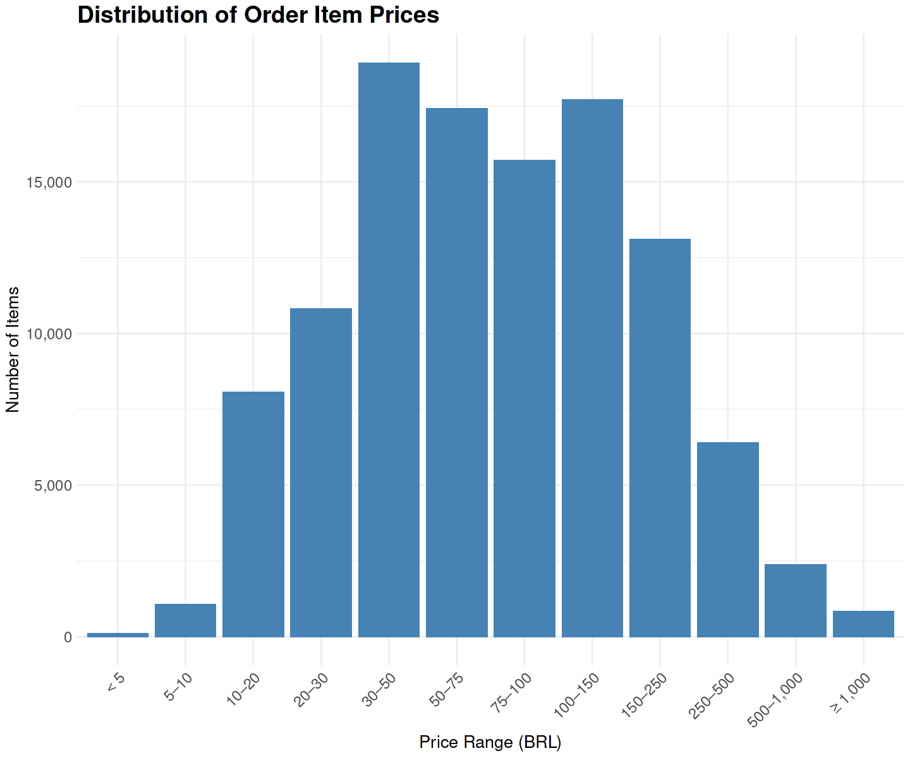
    


```R
# Plot 2: Items per order distribution

items_per_order <- order_items_df %>%
  group_by(order_id) %>%
  summarise(n_items = n()) %>%
  count(n_items)

options(repr.plot.width = 12, repr.plot.height = 6)

ggplot(items_per_order, aes(x = n_items, y = n)) +
  geom_col(fill = "#4682B4") +
  geom_text(aes(label = n), vjust = -0.3, size = 4) +
  scale_x_continuous(breaks = seq(1, max(items_per_order$n_items), by = 1)) +
  scale_y_continuous(expand = expansion(mult = c(0, 0.1))) +
  labs(title = "Distribution of Items per Order", x = "Number of Items per Order", y = "Number of Orders") +
  theme_minimal() +
  theme(
    plot.background = element_rect(fill = "white", color = NA),
    panel.background = element_rect(fill = "white", color = NA),
    plot.title = element_text(size = 22, face = "bold"),
    axis.title.x = element_text(size = 16, face = "bold"),
    axis.title.y = element_text(size = 16, face = "bold"),
    axis.text.x = element_text(size = 14),
    axis.text.y = element_text(size = 14))

# Plot 3: Category summary - Top 15 by GMV

category_summary <- order_items_df %>%
  group_by(product_category) %>%
  summarise(
    n_items = n(),
    total_revenue = sum(price),
    avg_price = mean(price), .groups = 'drop') %>%
  arrange(desc(total_revenue)) %>%
  slice_max(total_revenue, n = 15)

options(repr.plot.width = 14, repr.plot.height = 10)
ggplot(category_summary, 
       aes(x = reorder(product_category, total_revenue), y = total_revenue / 1000)) +
  geom_col(fill = "#4682B4") +
  geom_text(aes(label = paste0(round(total_revenue / 1000, 1), "K")), hjust = -0.1, size = 4) +
  coord_flip() +
  scale_y_continuous(expand = expansion(mult = c(0, 0.15))) +
  labs(title = "Top 15 Product Categories by GMV", x = "Product Category", y = "Total GMV (K BRL)") +
  theme_minimal() +
  theme(
    plot.background = element_rect(fill = "white", color = NA),
    panel.background = element_rect(fill = "white", color = NA),
    plot.title = element_text(size = 22, face = "bold"),
    axis.title.x = element_text(size = 16, face = "bold"),
    axis.title.y = element_text(size = 16, face = "bold"),
    axis.text.x = element_text(size = 14),
    axis.text.y = element_text(size = 14))

# Plot 4: Order value composition - price vs. freight

order_totals <- order_items_df %>%
  group_by(order_id) %>%
  summarise(
    total_price = sum(price),
    total_freight = sum(freight_value),
    freight_pct = total_freight / (total_price + total_freight) * 100, .groups = 'drop')

options(repr.plot.width = 18, repr.plot.height = 11)

ggplot(order_totals, aes(x = total_price, y = freight_pct)) +
  geom_point(alpha = 0.2, color = "#4682B4") +
  geom_hline(yintercept = 10, color = "#d62728", linetype = "dashed", size = 1) +
  annotate("text", x = max(order_totals$total_price) * 0.8, y = 12, 
           label = "10% freight threshold", color = "#d62728", size = 5) +
  scale_x_continuous(breaks = seq(0, max(order_totals$total_price), by = 1000), 
                     labels = scales::comma) +
  scale_y_continuous(breaks = seq(0, 100, by = 10)) +
  labs(title = "Freight Cost as Percentage of Order Value", x = "Total Order Price (BRL)", y = "Freight as % of Total Order Value") +
  theme_minimal() +
  theme(
    plot.background = element_rect(fill = "white", color = NA),
    panel.background = element_rect(fill = "white", color = NA),
    plot.title = element_text(size = 22, face = "bold"),
    plot.subtitle = element_text(size = 14),
    axis.title.x = element_text(size = 16, face = "bold"),
    axis.title.y = element_text(size = 16, face = "bold"),
    axis.text.x = element_text(size = 14),
    axis.text.y = element_text(size = 14)  )

# Plot 5: Shipping limit compliance by category

options(repr.plot.width = 14, repr.plot.height = 16)

ggplot(order_items_df %>% 
       group_by(product_category) %>%
       summarise(exceed_rate = mean(shipping_limit_flag_p99) * 100, .groups = 'drop'),
       aes(x = reorder(product_category, exceed_rate), y = exceed_rate)) +
  geom_col(fill = "#4682B4") +
  geom_text(aes(label = paste0(round(exceed_rate, 1), "%")), hjust = -0.1, size = 4) +
  coord_flip() +
  scale_y_continuous(expand = expansion(mult = c(0, 0.15))) +
  labs(title = "Shipping Limit Violations by Product Category", subtitle = "% of items exceeding P99 shipping deadline",
    x = "Product Category", y = "Exceed Rate (%)") +
  theme_minimal() +
  theme(
    plot.background = element_rect(fill = "white", color = NA),
    panel.background = element_rect(fill = "white", color = NA),
    plot.title = element_text(size = 22, face = "bold"),
    plot.subtitle = element_text(size = 14),
    axis.title.x = element_text(size = 16, face = "bold"),
    axis.title.y = element_text(size = 16, face = "bold"),
    axis.text.x = element_text(size = 14),
    axis.text.y = element_text(size = 14))
```


    
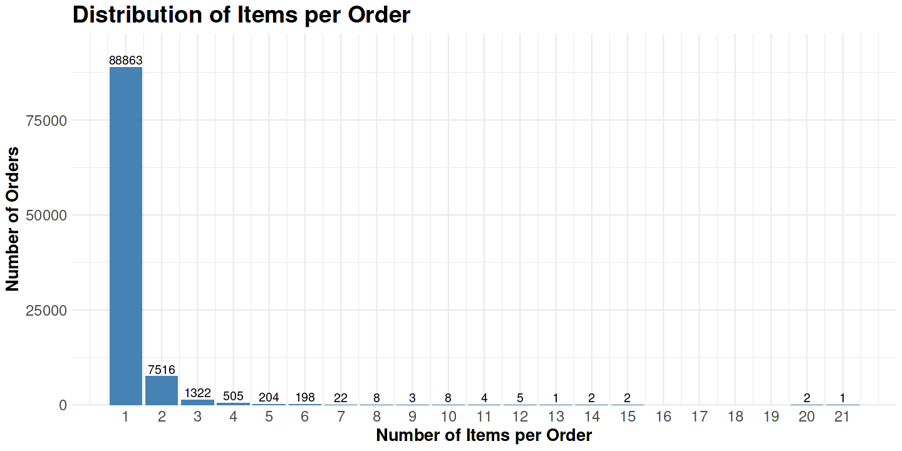
    


    Warning message:
    “Using `size` aesthetic for lines was deprecated in ggplot2 3.4.0.
    ℹ Please use `linewidth` instead.”
    


    
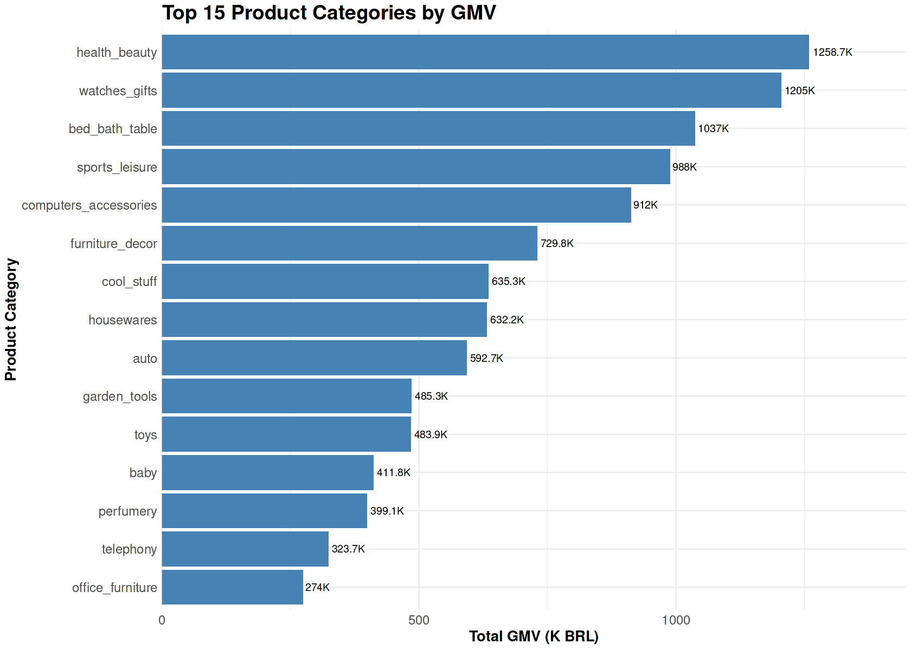
    


    
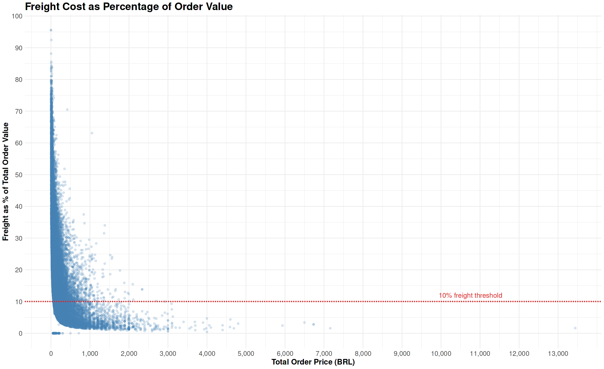
    


    
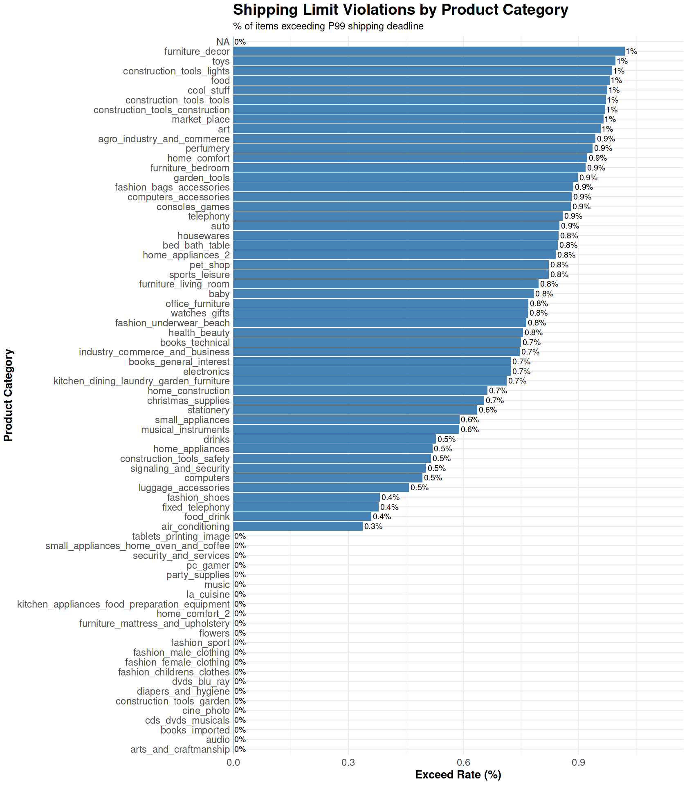
    


**Plot: Distribution of Items per Order**

Olist is overwhelmingly a single-item marketplace - 88853 orders (93%) contain just 1 item. Only 7516 orders (8%) have 2 items. Multi-item orders (3+) are extremely rare.  

**Plot: Top 15 Categories by GMV**

Health/beauty dominates with 1259 K BRL GMV, followed by **watches/gifts** (1205 K) and bed/bath/table (1037 K). Top 3 categories alone represent ~22% of total platform GMV. Office furniture ranks last at 274 K despite being physically largest products.

**Plot: Freight Cost as Percentage of Order Value**

Low-value orders (<500 BRL) pay brutal freight burdens (25-100% of order value), while orders >1000 BRL stabilize around 10% freight. Hyperbolic curve confirms freight is a fixed cost - larger orders achieve better freight cost efficiency because freight behaves as a fixed cost per shipment, not a percentage of product value.  


**Plot: Shipping Limit Violations by Category**

Furniture/construction categories (1%) have highest shipping deadline violations, but overall compliance is excellent (99%+ for most categories). Music, party supplies, and security show 0% violations - perfect on-time shipping to carriers.  

### **`ORDER_ITEMS`** PREPARE AND PROCESS phase sum-up:

##### **Data Quality Cleanup:**  
🔹 Kept all 112650 original item rows (100% retention) and preserved item-level grain with composite key `order_id + order_item_id`   
🔹 Final clean table for **<span style="color:#d62728">ANALYZE</span>** phase ➡︎ **`order_items_final`**: 112650 item-level records, structurally consistent and enriched with analytical features.
 
- **Additional derived columns:**
  > **shipping_limit_days** – days between `order_purchase_timestamp` and `shipping_limit_date`  
  > **shipping_limit_p99** – product-level 99th percentile benchmark of `shipping_limit_days`  
  > **shipping_limit_flag_p99** – flag for items whose shipping window exceeds the product’s 99th percentile threshold  
  
- **Appended context columns:**
  > **product_category** (in english, from **`products`**)  
  > **order_purchase_timestamp** (from **`orders`**)  
  > **review_score** (order-level review score attached to each item in the order)  
  
  
#### **`ORDER_ITEMS_FINAL`** **schema:** 

| Column Name                 | Data Type  | Description                                                       |
|----------------------------|-----------|-------------------------------------------------------------------|
| order_id                   | STRING    | Unique identifier for the order                                  |
| order_item_id              | INTEGER   | Line-item index within the order                                |
| product_id                 | STRING    | Unique identifier for the product                               |
| seller_id                  | STRING    | Unique identifier of the seller fulfilling the item             |
| shipping_limit_date        | TIMESTAMP | Latest timestamp by which the seller must ship the item         |
| price                      | FLOAT     | Item price charged to the customer (excluding freight)          |
| freight_value              | FLOAT     | Shipping (freight) cost allocated to this item                  |
| product_category           | STRING    | Product category (English, from `products_final`)               |
| order_purchase_timestamp   | TIMESTAMP | Timestamp when the order was placed                             |
| order_approved_at          | TIMESTAMP | Timestamp when the payment was approved                         |
| order_delivered_carrier_date | TIMESTAMP | Timestamp when the package was handed to the carrier          |
| order_delivered_customer_date | TIMESTAMP | Timestamp when the package was delivered to the customer     |
| order_estimated_delivery_date | TIMESTAMP | Estimated delivery deadline for the order                     |
| order_status               | STRING    | Final lifecycle status of the order (delivered, shipped, etc.)  |
| shipping_limit_days        | INTEGER   | Days between order placement and shipping_limit_date            |
| shipping_limit_p99         | INTEGER   | Product-level 99th percentile of shipping_limit_days            |
| shipping_limit_flag_p99    | INTEGER   | Flag indicating shipping_limit_days > product’s 99th percentile |
| review_score               | STRING    | Review score for the order (shared across its items)            |

| Property | Value |
|-|-|
| **Total Rows** | 112650 |
| **Number of Columns** | 18 |


#### **<span style="color:mediumblue">Key findings from initial exploration:</span>** 

🔸 Most of the data issues in **`order_items`** are tied to orders that never entered normal fulfillment, while orders with items closely follow the expected lifecycle and show strong consistency between **`orders`** and **`order_items`** tables   
🔸 Orders without items are almost entirely in "unavailable" or "canceled" status and represent failed or incomplete transactions, not part of the sales pipeline. In contrast, orders with items are overwhelmingly "delivered" with only a tiny share in other statuses, confirming that the joined dataset captures the true operational flow from creation through delivery    
🔸 Shipping timestamps are chronologically consistent (no shipping limits before purchases), and most products have typical shipping windows of about 5–7 days, with p99-based outlier detection isolating 916 unusually long limits  
🔸 A couple of extreme 3‑year shipping limits are clear metadata errors linked to one seller, while the remaining long windows are rare, but plausible delays concentrated in "home", "furniture" and lifestyle categories; most of these orders still ship before the limit and are successfully delivered  
🔸 Free shipping is highly asymmetric: it is heavily concentrated in a small subset of products and about 10 sellers, with one seller and a few products (especially in "watches_gifts" and "furniture_decor") accounting for most zero‑freight items, while the vast majority of sellers and products use free shipping only rarely  
🔸 Most orders have 1 item (ca. 89%), a smaller share has 2–3 items (ca. 9%), and very few orders have 4 or more items (ca. 2%), with extreme cases of 15–21 items being extremely rare. 

---

### 3.5.7 PREPARE AND PROCESS ➤ ORDER_PAYMENTS

Raw dataset has been uploaded to BigQuery to enable structured querying and further processing. 
The table serves as the foundation for cleaning, enrichment and transformation tasks required for analysis.

✅**Table schema inspection** – understanding the column types and structure of the table  
✅**Data quality checks** – identifying missing values, duplicates, possible anomalies  
✅**Feature enrichment** – adding derived columns or calculated metrics to support analysis  
✅**Consistency checks** – ensuring dates, IDs and categorical fields follow expected formats  


<br> 

**`ORDER_PAYMENTS SCHEMA`**:

| Column Name          | Data Type | Description                                                              |
| -------------------- | --------- | ------------------------------------------------------------------------ |
| order_id             | STRING    | Unique identifier of the order                                           |
| payment_sequential   | INTEGER | Sequence number of the payment record within the same order (used when an order has multiple payment entries) |
| payment_type         | STRING    | method used for payment (credit_card, boleto, voucher, debit_card, etc.) |
| payment_installments | INTEGER   | number of installments chosen for this payment                           |
| payment_value        | FLOAT     | monetary value of this payment transaction                               |


| Property | Value |
|-|-|
| **Total Rows** | 103886
| **Number of Columns** | 5 |


First of all, in BigQuery:
```
💾CREATE OR REPLACE TABLE `olist-project-yuliacarvalho.Olist_datasets.order_payments` AS
SELECT 
  LOWER(TRIM(order_id)) AS order_id,
  payment_sequential,
  LOWER(TRIM(payment_type)) AS payment_type,
  payment_installments,
  payment_value
 FROM `olist-project-yuliacarvalho.Olist_datasets.order_payments`
```


```R
#💻 order_payments primary key:

payments_pk <- run_small_query_wide("
SELECT DISTINCT
  order_id,
  payment_sequential,
  COUNT(*) AS count
FROM `olist-project-yuliacarvalho.Olist_datasets.order_payments`
GROUP BY 1, 2
HAVING count > 1")
```


<table class="dataframe">
<caption>A tibble: 0 × 3</caption>
<thead>
	<tr><th scope=col>order_id</th><th scope=col>payment_sequential</th><th scope=col>count</th></tr>
	<tr><th scope=col>&lt;chr&gt;</th><th scope=col>&lt;int64&gt;</th><th scope=col>&lt;int64&gt;</th></tr>
</thead>
<tbody>
</tbody>
</table>


```R
#💻 all column NULLs:

column_nulls <- run_small_query_wide("
SELECT
  COUNTIF(order_id IS NULL) AS order_id_nulls,
  COUNTIF(payment_sequential IS NULL) AS payemnt_seq_nulls,
  COUNTIF(payment_type IS NULL) AS payment_type_nulls,
  COUNTIF(payment_installments IS NULL) AS payment_installments_nulls,
  COUNTIF(payment_value IS NULL) AS payment_value_nulls
FROM `olist-project-yuliacarvalho.Olist_datasets.order_payments`")
```


<table class="dataframe">
<caption>A tibble: 1 × 5</caption>
<thead>
	<tr><th scope=col>order_id_nulls</th><th scope=col>payemnt_seq_nulls</th><th scope=col>payment_type_nulls</th><th scope=col>payment_installments_nulls</th><th scope=col>payment_value_nulls</th></tr>
	<tr><th scope=col>&lt;int&gt;</th><th scope=col>&lt;int&gt;</th><th scope=col>&lt;int&gt;</th><th scope=col>&lt;int&gt;</th><th scope=col>&lt;int&gt;</th></tr>
</thead>
<tbody>
	<tr><td>0</td><td>0</td><td>0</td><td>0</td><td>0</td></tr>
</tbody>
</table>


```R
#💻 distinct payment types and distribution across all orders:

payment_types <- run_small_query_wide("
SELECT
  DISTINCT payment_type,
  COUNT(*) AS orders_per_payment_type,
  ROUND(100 * COUNT(*) / SUM(COUNT(*)) OVER (), 3) AS pct_orders
FROM `olist-project-yuliacarvalho.Olist_datasets.order_payments`
GROUP BY payment_type")
```


<table class="dataframe">
<caption>A tibble: 5 × 3</caption>
<thead>
	<tr><th scope=col>payment_type</th><th scope=col>orders_per_payment_type</th><th scope=col>pct_orders</th></tr>
	<tr><th scope=col>&lt;chr&gt;</th><th scope=col>&lt;int&gt;</th><th scope=col>&lt;dbl&gt;</th></tr>
</thead>
<tbody>
	<tr><td>boleto     </td><td>19784</td><td>19.044</td></tr>
	<tr><td>credit_card</td><td>76795</td><td>73.922</td></tr>
	<tr><td>debit_card </td><td> 1529</td><td> 1.472</td></tr>
	<tr><td>not_defined</td><td>    3</td><td> 0.003</td></tr>
	<tr><td>voucher    </td><td> 5775</td><td> 5.559</td></tr>
</tbody>
</table>


```R
#💻 Are there orders in payments that are missing in "orders_final"?:

orders_in_orders <- run_small_query_wide("
SELECT 
  COUNT(DISTINCT p.order_id) AS payment_orders,
  COUNT(DISTINCT o.order_id) AS matched_orders,
  COUNT(DISTINCT p.order_id) - COUNT(DISTINCT o.order_id) AS missing_order_ids
FROM `olist-project-yuliacarvalho.Olist_datasets.order_payments` AS p
LEFT JOIN `olist-project-yuliacarvalho.Olist_datasets.orders_final` AS o USING(order_id)")
```


<table class="dataframe">
<caption>A tibble: 1 × 3</caption>
<thead>
	<tr><th scope=col>payment_orders</th><th scope=col>matched_orders</th><th scope=col>missing_order_ids</th></tr>
	<tr><th scope=col>&lt;int&gt;</th><th scope=col>&lt;int&gt;</th><th scope=col>&lt;int&gt;</th></tr>
</thead>
<tbody>
	<tr><td>99440</td><td>99440</td><td>0</td></tr>
</tbody>
</table>


```R
#💻 The other way around?:

orders_without_payments <- run_small_query_wide("
SELECT 
  COUNT(DISTINCT o.order_id) AS total_orders,
  COUNT(DISTINCT p.order_id) AS orders_with_payments,
  COUNT(DISTINCT o.order_id) - COUNT(DISTINCT p.order_id) AS orders_without_payments
FROM `olist-project-yuliacarvalho.Olist_datasets.orders_final` o
LEFT JOIN `olist-project-yuliacarvalho.Olist_datasets.order_payments` AS p USING(order_id)")
```


<table class="dataframe">
<caption>A tibble: 1 × 3</caption>
<thead>
	<tr><th scope=col>total_orders</th><th scope=col>orders_with_payments</th><th scope=col>orders_without_payments</th></tr>
	<tr><th scope=col>&lt;int&gt;</th><th scope=col>&lt;int&gt;</th><th scope=col>&lt;int&gt;</th></tr>
</thead>
<tbody>
	<tr><td>99441</td><td>99440</td><td>1</td></tr>
</tbody>
</table>


```R
#💻 The other way around?:

orders_without_payments <- run_small_query_wide("
SELECT 
  o.*
FROM `olist-project-yuliacarvalho.Olist_datasets.orders_final` AS o
LEFT JOIN `olist-project-yuliacarvalho.Olist_datasets.order_payments` AS p USING(order_id)
WHERE p.order_id IS NULL")
```


<table class="dataframe">
<caption>A tibble: 1 × 21</caption>
<thead>
	<tr><th scope=col>order_id</th><th scope=col>customer_id</th><th scope=col>order_status</th><th scope=col>order_purchase_timestamp</th><th scope=col>order_approved_at</th><th scope=col>order_delivered_carrier_date</th><th scope=col>order_delivered_customer_date</th><th scope=col>order_estimated_delivery_date</th><th scope=col>has_approval</th><th scope=col>delivery_timestamp_is_complete</th><th scope=col>⋯</th><th scope=col>carrier_before_purchase</th><th scope=col>customer_before_carrier</th><th scope=col>order_to_delivery_days</th><th scope=col>approval_lag_hours</th><th scope=col>timeline_is_valid</th><th scope=col>days_since_carrier</th><th scope=col>days_since_approval</th><th scope=col>days_since_purchase</th><th scope=col>is_hanging</th><th scope=col>has_payment_record</th></tr>
	<tr><th scope=col>&lt;chr&gt;</th><th scope=col>&lt;chr&gt;</th><th scope=col>&lt;chr&gt;</th><th scope=col>&lt;dttm&gt;</th><th scope=col>&lt;dttm&gt;</th><th scope=col>&lt;dttm&gt;</th><th scope=col>&lt;dttm&gt;</th><th scope=col>&lt;dttm&gt;</th><th scope=col>&lt;int&gt;</th><th scope=col>&lt;int&gt;</th><th scope=col>⋯</th><th scope=col>&lt;int&gt;</th><th scope=col>&lt;int&gt;</th><th scope=col>&lt;int&gt;</th><th scope=col>&lt;dbl&gt;</th><th scope=col>&lt;int&gt;</th><th scope=col>&lt;int&gt;</th><th scope=col>&lt;int&gt;</th><th scope=col>&lt;int&gt;</th><th scope=col>&lt;int&gt;</th><th scope=col>&lt;int&gt;</th></tr>
</thead>
<tbody>
	<tr><td>bfbd0f9bdef84302105ad712db648a6c</td><td>86dc2ffce2dfff336de2f386a786e574</td><td>delivered</td><td>2016-09-15 12:16:38</td><td>2016-09-15 12:16:38</td><td>2016-11-07 17:11:53</td><td>2016-11-09 07:47:38</td><td>2016-10-04</td><td>1</td><td>1</td><td>⋯</td><td>0</td><td>0</td><td>55</td><td>0</td><td>1</td><td>709</td><td>762</td><td>762</td><td>0</td><td>0</td></tr>
</tbody>
</table>


This early order, placed on 2016-09-15 (just days after the dataset's first order on 2016-09-04), went through the complete lifecycle: purchase ➡︎ approval ➡︎ carrier handoff ➡︎ final customer delivery (all with valid timestamps), but never received a corresponding entry in the **`order_payments`** table. Given its position at the very start of Olist's recorded history and the otherwise clean operational flags, it appears to be a rare artifact of incomplete historical data backfill or early ETL integration glitches rather than a genuinely unpaid or failed transaction.

How I am going to handle the situation: I am going to flag this order explicitly by adding a boolean column **has_payment_record** in **`orders_final`** table and in later analysis I will exclude it from payment-based metrics: 
> when calculating total sales value  
> revenue by payment type  
> number of installments   

In BigQuery:
```
💾CREATE OR REPLACE TABLE `olist-project-yuliacarvalho.Olist_datasets.orders_final` AS
SELECT
  o.*,
  CASE
    WHEN p.order_id IS NOT NULL THEN 1
    ELSE 0
  END AS has_payment_record
FROM `olist-project-yuliacarvalho.Olist_datasets.orders_final` AS o
LEFT JOIN (
  SELECT DISTINCT order_id
  FROM `olist-project-yuliacarvalho.Olist_datasets.order_payments`) AS p
USING (order_id)
```

I need to have a clear idea of what **payment_sequential** column means.

Is it a sequence index of payment records within the same order, used when:
- an order is paid using multiple payment instruments? or  
- the payment is split across methods (e.g. voucher + credit card)? or  
- multiple records are generated for accounting reasons? 


```R
#💻 How common are split payments?:

multi_payment_orders <- run_small_query_wide("
SELECT
  COUNTIF(payment_count > 1) AS multi_payment_orders,
  COUNT(*) AS total_orders,
  ROUND(100 * COUNTIF(payment_count > 1) / COUNT(*), 2) AS pct_multi_payment_orders
FROM (
  SELECT
    order_id,
    COUNT(*) AS payment_count
  FROM `olist-project-yuliacarvalho.Olist_datasets.order_payments`
  GROUP BY order_id)")
```


<table class="dataframe">
<caption>A tibble: 1 × 3</caption>
<thead>
	<tr><th scope=col>multi_payment_orders</th><th scope=col>total_orders</th><th scope=col>pct_multi_payment_orders</th></tr>
	<tr><th scope=col>&lt;int&gt;</th><th scope=col>&lt;int&gt;</th><th scope=col>&lt;dbl&gt;</th></tr>
</thead>
<tbody>
	<tr><td>2961</td><td>99440</td><td>2.98</td></tr>
</tbody>
</table>


```R
#💻 payment count distribution:

payment_distr <- run_small_query_wide("
SELECT
  payment_count,
  COUNT(*) AS num_orders,
  ROUND(100 * COUNT(*) / SUM(COUNT(*)) OVER (), 3) AS pct_orders
FROM (
  SELECT
    order_id,
    COUNT(*) AS payment_count
  FROM `olist-project-yuliacarvalho.Olist_datasets.order_payments`
  GROUP BY order_id)
GROUP BY payment_count
ORDER BY payment_count")
```


<table class="dataframe">
<caption>A tibble: 20 × 3</caption>
<thead>
	<tr><th scope=col>payment_count</th><th scope=col>num_orders</th><th scope=col>pct_orders</th></tr>
	<tr><th scope=col>&lt;int&gt;</th><th scope=col>&lt;int&gt;</th><th scope=col>&lt;dbl&gt;</th></tr>
</thead>
<tbody>
	<tr><td> 1</td><td>96479</td><td>97.022</td></tr>
	<tr><td> 2</td><td> 2382</td><td> 2.395</td></tr>
	<tr><td> 3</td><td>  301</td><td> 0.303</td></tr>
	<tr><td> 4</td><td>  108</td><td> 0.109</td></tr>
	<tr><td> 5</td><td>   52</td><td> 0.052</td></tr>
	<tr><td> 6</td><td>   36</td><td> 0.036</td></tr>
	<tr><td> 7</td><td>   28</td><td> 0.028</td></tr>
	<tr><td> 8</td><td>   11</td><td> 0.011</td></tr>
	<tr><td> 9</td><td>    9</td><td> 0.009</td></tr>
	<tr><td>10</td><td>    5</td><td> 0.005</td></tr>
	<tr><td>11</td><td>    8</td><td> 0.008</td></tr>
	<tr><td>12</td><td>    8</td><td> 0.008</td></tr>
	<tr><td>13</td><td>    3</td><td> 0.003</td></tr>
	<tr><td>14</td><td>    2</td><td> 0.002</td></tr>
	<tr><td>15</td><td>    2</td><td> 0.002</td></tr>
	<tr><td>19</td><td>    2</td><td> 0.002</td></tr>
	<tr><td>21</td><td>    1</td><td> 0.001</td></tr>
	<tr><td>22</td><td>    1</td><td> 0.001</td></tr>
	<tr><td>26</td><td>    1</td><td> 0.001</td></tr>
	<tr><td>29</td><td>    1</td><td> 0.001</td></tr>
</tbody>
</table>


```R
#💻 payment_sequential stats:

payment_seq_stats <- run_small_query_wide("
SELECT 
  MIN(payment_sequential) AS min_payments,
  APPROX_QUANTILES(payment_sequential, 100)[OFFSET(50)] AS median_payments,
(APPROX_TOP_COUNT(payment_sequential, 1)[OFFSET(0)]).value AS mode_payments,
  MAX(payment_sequential) AS max_payments
FROM `olist-project-yuliacarvalho.Olist_datasets.order_payments`")
```


<table class="dataframe">
<caption>A tibble: 1 × 4</caption>
<thead>
	<tr><th scope=col>min_payments</th><th scope=col>median_payments</th><th scope=col>mode_payments</th><th scope=col>max_payments</th></tr>
	<tr><th scope=col>&lt;int&gt;</th><th scope=col>&lt;int&gt;</th><th scope=col>&lt;int&gt;</th><th scope=col>&lt;int&gt;</th></tr>
</thead>
<tbody>
	<tr><td>1</td><td>1</td><td>1</td><td>29</td></tr>
</tbody>
</table>


**payment_sequential** is the order in which payment records appear for the same order_id

Multi-payment orders are a small, but interesting minority in this dataset, and most orders are paid with a single payment record:
> 🔹 the vast majority of orders (97.02%) have exactly 1 payment row  
> 🔹 out of 99440 total orders, 2961 have more than one payment record (2.4% with 2 payments and a very long but extremely "thin tail" up to 29 payments  
> 🔹 MIN, MAX, median and mode of payment counts are all 1, which confirms, that “one payment per order” is the typical pattern, and multi-payment behavior is a rare edge case  

🔹In Olist, it is allowed for a customer to pay the same order using multiple payment methods or multiple captures (split between credit card and voucher, for example), so the results above suggest, that 2 payments per order is the **most common multi-payment scenario**, which plausibly represents simple split-payments  
🔹Orders with very high payment_count (e.g., 10–29) are extremely rare and likely reflect retries, cancellations or data artifacts in the raw payment stream rather than 29 distinct “real” payments 

❗An important note ➡︎ installments are captured in the **payment_installments** column, not by multiple rows per order. So a typical order paid in 10 installments, for example, will have only one row in **`order_payments`** table with **payment_installments** column value = 10

Moving on to **payment_installments** column


```R
#💻 payment installments distribution:

pay_inst_distr <- run_small_query_wide("
SELECT
  payment_installments,
  COUNT(*) AS num_payments,
  COUNT(DISTINCT order_id) AS num_orders
FROM `olist-project-yuliacarvalho.Olist_datasets.order_payments`
GROUP BY payment_installments
ORDER BY payment_installments")
```


<table class="dataframe">
<caption>A tibble: 24 × 3</caption>
<thead>
	<tr><th scope=col>payment_installments</th><th scope=col>num_payments</th><th scope=col>num_orders</th></tr>
	<tr><th scope=col>&lt;int&gt;</th><th scope=col>&lt;int&gt;</th><th scope=col>&lt;int&gt;</th></tr>
</thead>
<tbody>
	<tr><td> 0</td><td>    2</td><td>    2</td></tr>
	<tr><td> 1</td><td>52546</td><td>49060</td></tr>
	<tr><td> 2</td><td>12413</td><td>12389</td></tr>
	<tr><td> 3</td><td>10461</td><td>10443</td></tr>
	<tr><td> 4</td><td> 7098</td><td> 7088</td></tr>
	<tr><td> 5</td><td> 5239</td><td> 5234</td></tr>
	<tr><td> 6</td><td> 3920</td><td> 3916</td></tr>
	<tr><td> 7</td><td> 1626</td><td> 1623</td></tr>
	<tr><td> 8</td><td> 4268</td><td> 4253</td></tr>
	<tr><td> 9</td><td>  644</td><td>  644</td></tr>
	<tr><td>10</td><td> 5328</td><td> 5315</td></tr>
	<tr><td>11</td><td>   23</td><td>   23</td></tr>
	<tr><td>12</td><td>  133</td><td>  133</td></tr>
	<tr><td>13</td><td>   16</td><td>   16</td></tr>
	<tr><td>14</td><td>   15</td><td>   15</td></tr>
	<tr><td>15</td><td>   74</td><td>   74</td></tr>
	<tr><td>16</td><td>    5</td><td>    5</td></tr>
	<tr><td>17</td><td>    8</td><td>    8</td></tr>
	<tr><td>18</td><td>   27</td><td>   27</td></tr>
	<tr><td>20</td><td>   17</td><td>   17</td></tr>
	<tr><td>21</td><td>    3</td><td>    3</td></tr>
	<tr><td>22</td><td>    1</td><td>    1</td></tr>
	<tr><td>23</td><td>    1</td><td>    1</td></tr>
	<tr><td>24</td><td>   18</td><td>   18</td></tr>
</tbody>
</table>


```R
#💻 rows with payment_installments = 1:

single_inst_orders <- run_small_query_wide("
SELECT
  COUNT(*) AS num_payments_installments_1
FROM `olist-project-yuliacarvalho.Olist_datasets.order_payments`
WHERE payment_installments = 1")
```


<table class="dataframe">
<caption>A tibble: 1 × 1</caption>
<thead>
	<tr><th scope=col>num_payments_installments_1</th></tr>
	<tr><th scope=col>&lt;int&gt;</th></tr>
</thead>
<tbody>
	<tr><td>52546</td></tr>
</tbody>
</table>


```R
#💻 distribution by payment type:

pay_type_distr <- run_small_query_wide("
SELECT
  payment_type,
  payment_installments,
  COUNT(*) AS num_payments
FROM `olist-project-yuliacarvalho.Olist_datasets.order_payments`
GROUP BY payment_type, payment_installments
ORDER BY payment_type, payment_installments;
")
```


<table class="dataframe">
<caption>A tibble: 28 × 3</caption>
<thead>
	<tr><th scope=col>payment_type</th><th scope=col>payment_installments</th><th scope=col>num_payments</th></tr>
	<tr><th scope=col>&lt;chr&gt;</th><th scope=col>&lt;int&gt;</th><th scope=col>&lt;int&gt;</th></tr>
</thead>
<tbody>
	<tr><td>boleto     </td><td> 1</td><td>19784</td></tr>
	<tr><td>credit_card</td><td> 0</td><td>    2</td></tr>
	<tr><td>credit_card</td><td> 1</td><td>25455</td></tr>
	<tr><td>credit_card</td><td> 2</td><td>12413</td></tr>
	<tr><td>credit_card</td><td> 3</td><td>10461</td></tr>
	<tr><td>credit_card</td><td> 4</td><td> 7098</td></tr>
	<tr><td>credit_card</td><td> 5</td><td> 5239</td></tr>
	<tr><td>credit_card</td><td> 6</td><td> 3920</td></tr>
	<tr><td>credit_card</td><td> 7</td><td> 1626</td></tr>
	<tr><td>credit_card</td><td> 8</td><td> 4268</td></tr>
	<tr><td>credit_card</td><td> 9</td><td>  644</td></tr>
	<tr><td>credit_card</td><td>10</td><td> 5328</td></tr>
	<tr><td>credit_card</td><td>11</td><td>   23</td></tr>
	<tr><td>credit_card</td><td>12</td><td>  133</td></tr>
	<tr><td>credit_card</td><td>13</td><td>   16</td></tr>
	<tr><td>credit_card</td><td>14</td><td>   15</td></tr>
	<tr><td>credit_card</td><td>15</td><td>   74</td></tr>
	<tr><td>credit_card</td><td>16</td><td>    5</td></tr>
	<tr><td>credit_card</td><td>17</td><td>    8</td></tr>
	<tr><td>credit_card</td><td>18</td><td>   27</td></tr>
	<tr><td>credit_card</td><td>20</td><td>   17</td></tr>
	<tr><td>credit_card</td><td>21</td><td>    3</td></tr>
	<tr><td>credit_card</td><td>22</td><td>    1</td></tr>
	<tr><td>credit_card</td><td>23</td><td>    1</td></tr>
	<tr><td>credit_card</td><td>24</td><td>   18</td></tr>
	<tr><td>debit_card </td><td> 1</td><td> 1529</td></tr>
	<tr><td>not_defined</td><td> 1</td><td>    3</td></tr>
	<tr><td>voucher    </td><td> 1</td><td> 5775</td></tr>
</tbody>
</table>


```R
#💻 orders that were paid in a single installment:

single_inst_orders <- run_small_query_wide("
SELECT
  COUNT(*) AS orders_one_shot
FROM (
  SELECT
    order_id,
    SUM(payment_installments) AS total_installments
  FROM `olist-project-yuliacarvalho.Olist_datasets.order_payments`
  GROUP BY order_id)
WHERE total_installments = 1")
```


<table class="dataframe">
<caption>A tibble: 1 × 1</caption>
<thead>
	<tr><th scope=col>orders_one_shot</th></tr>
	<tr><th scope=col>&lt;int&gt;</th></tr>
</thead>
<tbody>
	<tr><td>46264</td></tr>
</tbody>
</table>


```R
#💻 x2 orders with payment_installments = 0:

zero_inst_orders <-run_small_query_wide("
SELECT 
  o.order_id,
  o.order_status,
  o.order_purchase_timestamp,
  o.order_approved_at,
  o.order_delivered_carrier_date,
  o.order_delivered_customer_date,
  o.has_payment_record,
  p.payment_type,
  p.payment_value,
  p.payment_installments
FROM `olist-project-yuliacarvalho.Olist_datasets.orders_final` o
JOIN `olist-project-yuliacarvalho.Olist_datasets.order_payments` p
  ON o.order_id = p.order_id
WHERE p.payment_installments = 0")
```


<table class="dataframe">
<caption>A tibble: 2 × 10</caption>
<thead>
	<tr><th scope=col>order_id</th><th scope=col>order_status</th><th scope=col>order_purchase_timestamp</th><th scope=col>order_approved_at</th><th scope=col>order_delivered_carrier_date</th><th scope=col>order_delivered_customer_date</th><th scope=col>has_payment_record</th><th scope=col>payment_type</th><th scope=col>payment_value</th><th scope=col>payment_installments</th></tr>
	<tr><th scope=col>&lt;chr&gt;</th><th scope=col>&lt;chr&gt;</th><th scope=col>&lt;dttm&gt;</th><th scope=col>&lt;dttm&gt;</th><th scope=col>&lt;dttm&gt;</th><th scope=col>&lt;dttm&gt;</th><th scope=col>&lt;int&gt;</th><th scope=col>&lt;chr&gt;</th><th scope=col>&lt;dbl&gt;</th><th scope=col>&lt;int&gt;</th></tr>
</thead>
<tbody>
	<tr><td>744bade1fcf9ff3f31d860ace076d422</td><td>delivered</td><td>2018-04-22 11:34:42</td><td>2018-04-24 19:04:46</td><td>2018-04-24 03:14:34</td><td>2018-04-27 20:55:28</td><td>1</td><td>credit_card</td><td> 58.69</td><td>0</td></tr>
	<tr><td>1a57108394169c0b47d8f876acc9ba2d</td><td>delivered</td><td>2018-05-15 16:25:14</td><td>2018-05-15 16:36:52</td><td>2018-05-17 12:37:00</td><td>2018-05-24 15:45:41</td><td>1</td><td>credit_card</td><td>129.94</td><td>0</td></tr>
</tbody>
</table>


```R
#💻 closer look at order_items level:

zero_inst_orders <- run_small_query_wide("
SELECT *
FROM `olist-project-yuliacarvalho.Olist_datasets.delivered_orders_items_final`
WHERE order_id IN('744bade1fcf9ff3f31d860ace076d422', '1a57108394169c0b47d8f876acc9ba2d')")
```


<table class="dataframe">
<caption>A tibble: 3 × 29</caption>
<thead>
	<tr><th scope=col>order_id</th><th scope=col>order_item_id</th><th scope=col>product_id</th><th scope=col>product_category</th><th scope=col>order_status</th><th scope=col>order_purchase_timestamp</th><th scope=col>order_approved_at</th><th scope=col>approval_lag_hours</th><th scope=col>order_estimated_delivery_date</th><th scope=col>shipping_limit_date</th><th scope=col>⋯</th><th scope=col>customer_id</th><th scope=col>seller_id</th><th scope=col>price</th><th scope=col>freight_value</th><th scope=col>shipping_limit_days</th><th scope=col>shipping_limit_p99</th><th scope=col>shipping_limit_flag_p99</th><th scope=col>review_score</th><th scope=col>carrier_to_customer_days</th><th scope=col>delivery_performance</th></tr>
	<tr><th scope=col>&lt;chr&gt;</th><th scope=col>&lt;int&gt;</th><th scope=col>&lt;chr&gt;</th><th scope=col>&lt;chr&gt;</th><th scope=col>&lt;chr&gt;</th><th scope=col>&lt;dttm&gt;</th><th scope=col>&lt;dttm&gt;</th><th scope=col>&lt;dbl&gt;</th><th scope=col>&lt;dttm&gt;</th><th scope=col>&lt;dttm&gt;</th><th scope=col>⋯</th><th scope=col>&lt;chr&gt;</th><th scope=col>&lt;chr&gt;</th><th scope=col>&lt;dbl&gt;</th><th scope=col>&lt;dbl&gt;</th><th scope=col>&lt;int&gt;</th><th scope=col>&lt;int&gt;</th><th scope=col>&lt;int&gt;</th><th scope=col>&lt;chr&gt;</th><th scope=col>&lt;int&gt;</th><th scope=col>&lt;int&gt;</th></tr>
</thead>
<tbody>
	<tr><td>1a57108394169c0b47d8f876acc9ba2d</td><td>2</td><td>db35a562fb6ba63e19fa42a15349dc04</td><td>housewares</td><td>delivered</td><td>2018-05-15 16:25:14</td><td>2018-05-15 16:36:52</td><td> 0.2</td><td>2018-06-06</td><td>2018-05-18 16:31:54</td><td>⋯</td><td>48ebb06cf56dba9d009230cc751bb195</td><td>282f23a9769b2690c5dda22e316f9941</td><td>41.69</td><td>23.28</td><td>3</td><td>20</td><td>0</td><td>excellent</td><td>7</td><td>2</td></tr>
	<tr><td>1a57108394169c0b47d8f876acc9ba2d</td><td>1</td><td>db35a562fb6ba63e19fa42a15349dc04</td><td>housewares</td><td>delivered</td><td>2018-05-15 16:25:14</td><td>2018-05-15 16:36:52</td><td> 0.2</td><td>2018-06-06</td><td>2018-05-18 16:31:54</td><td>⋯</td><td>48ebb06cf56dba9d009230cc751bb195</td><td>282f23a9769b2690c5dda22e316f9941</td><td>41.69</td><td>23.28</td><td>3</td><td>20</td><td>0</td><td>excellent</td><td>7</td><td>2</td></tr>
	<tr><td>744bade1fcf9ff3f31d860ace076d422</td><td>1</td><td>0cf573090c66bb30ac5e53c82bdb0403</td><td>telephony </td><td>delivered</td><td>2018-04-22 11:34:42</td><td>2018-04-24 19:04:46</td><td>55.5</td><td>2018-05-16</td><td>2018-04-26 12:31:06</td><td>⋯</td><td>5e5794daaa13f73e2f1cdb4114529843</td><td>7202e2ba20579a9bd1acb29e61fe71f6</td><td>45.90</td><td>12.79</td><td>4</td><td>14</td><td>0</td><td>excellent</td><td>3</td><td>1</td></tr>
</tbody>
</table>


🔹52546 ➡︎ number of payment rows where payment_installments = 1 (num_payments_installments_1)  
🔹49060 ➡︎ number of distinct orders that have at least one payment row with payment_installments = 1 (num_orders in the row where "payment_installments" = 1)  
🔹46264 ➡︎ number of orders whose total installments across all payments sum to 1  

**Most payments are single-shot**: 52546 payment rows with payment_installments = 1 belong to 49060 distinct orders. Of these, 46264 orders have exactly one such payment row (total installments = 1)

🔹Installments are common but moderate: 2–10 installments cover the bulk of the remaining volume, with some peaks at 2, 3 and 10  
🔹Very long plans (11–24 installments) exist, but are rare  
🔹Relationship to payment types ➡︎ only credit cards use installments. 
🔹Boleto, debit_card, not_defined and voucher appear only with **payment_installments** = 0 or 1 (one-shot payments)  


#### Note on zero-installment credit card payments

🔸 During cleaning and validation of `order_payments`, **2 payment rows** were identified with `payment_type = 'credit_card'` and `payment_installments = 0`.

**Reviewed orders**
- `1a57108394169c0b47d8f876acc9ba2d`
- `744bade1fcf9ff3f31d860ace076d422`
  
🔸 Both cases were reviewed manually. In each case, the order was successfully **delivered**, the payment value was consistent with the order total, and the order timeline was complete and coherent. These transactions also occurred in **2018**, so they are not attributable to early-period dataset instability.

🔸 Given the extremely low frequency of this pattern (**2 cases only** in the full dataset), these rows were treated as **rare source-data anomalies** rather than as evidence of a broader payment-quality issue.

**Analytical treatment:**

> * **Revenue and payment-value analysis:** retained as observed, because a valid payment clearly occurred  
> * **Installment analysis:** acknowledged as anomalous `credit_card` cases and interpreted as exceptions  

No additional correction flag was created, as this would add unnecessary complexity without materially affecting results.

Next, I will take a look at **order_payments**:


```R
#💻 payment_value distribution:

payment_value_bottom20 <- run_small_query_wide("
SELECT
  payment_value,
  COUNT(*) AS num_payments
FROM `olist-project-yuliacarvalho.Olist_datasets.order_payments`
GROUP BY payment_value
ORDER BY payment_value
LIMIT 20")
```


<table class="dataframe">
<caption>A tibble: 20 × 2</caption>
<thead>
	<tr><th scope=col>payment_value</th><th scope=col>num_payments</th></tr>
	<tr><th scope=col>&lt;dbl&gt;</th><th scope=col>&lt;int&gt;</th></tr>
</thead>
<tbody>
	<tr><td>0.00</td><td>9</td></tr>
	<tr><td>0.01</td><td>6</td></tr>
	<tr><td>0.03</td><td>2</td></tr>
	<tr><td>0.05</td><td>2</td></tr>
	<tr><td>0.07</td><td>1</td></tr>
	<tr><td>0.08</td><td>2</td></tr>
	<tr><td>0.09</td><td>1</td></tr>
	<tr><td>0.10</td><td>3</td></tr>
	<tr><td>0.11</td><td>2</td></tr>
	<tr><td>0.13</td><td>2</td></tr>
	<tr><td>0.14</td><td>3</td></tr>
	<tr><td>0.15</td><td>3</td></tr>
	<tr><td>0.16</td><td>1</td></tr>
	<tr><td>0.17</td><td>2</td></tr>
	<tr><td>0.19</td><td>1</td></tr>
	<tr><td>0.20</td><td>3</td></tr>
	<tr><td>0.21</td><td>1</td></tr>
	<tr><td>0.22</td><td>4</td></tr>
	<tr><td>0.23</td><td>3</td></tr>
	<tr><td>0.24</td><td>2</td></tr>
</tbody>
</table>


```R
#💻 payment_value distribution:

payment_value_top20 <- run_small_query_wide("
SELECT
  payment_value,
  COUNT(*) AS num_payments
FROM `olist-project-yuliacarvalho.Olist_datasets.order_payments`
GROUP BY payment_value
ORDER BY payment_value DESC
LIMIT 20")
```


<table class="dataframe">
<caption>A tibble: 20 × 2</caption>
<thead>
	<tr><th scope=col>payment_value</th><th scope=col>num_payments</th></tr>
	<tr><th scope=col>&lt;dbl&gt;</th><th scope=col>&lt;int&gt;</th></tr>
</thead>
<tbody>
	<tr><td>13664.08</td><td>1</td></tr>
	<tr><td> 7274.88</td><td>1</td></tr>
	<tr><td> 6929.31</td><td>1</td></tr>
	<tr><td> 6922.21</td><td>1</td></tr>
	<tr><td> 6726.66</td><td>1</td></tr>
	<tr><td> 6081.54</td><td>1</td></tr>
	<tr><td> 4950.34</td><td>1</td></tr>
	<tr><td> 4809.44</td><td>1</td></tr>
	<tr><td> 4764.34</td><td>1</td></tr>
	<tr><td> 4681.78</td><td>1</td></tr>
	<tr><td> 4513.32</td><td>1</td></tr>
	<tr><td> 4445.50</td><td>1</td></tr>
	<tr><td> 4175.26</td><td>1</td></tr>
	<tr><td> 4163.51</td><td>1</td></tr>
	<tr><td> 4042.74</td><td>1</td></tr>
	<tr><td> 4016.91</td><td>1</td></tr>
	<tr><td> 3979.55</td><td>1</td></tr>
	<tr><td> 3899.00</td><td>1</td></tr>
	<tr><td> 3826.80</td><td>1</td></tr>
	<tr><td> 3792.59</td><td>1</td></tr>
</tbody>
</table>


```R
#💻 summary stats:

payment_stats <- run_small_query_wide("
SELECT
  COUNT(*) AS total_payment_rows,
  COUNT(DISTINCT order_id) AS unique_orders,
  ROUND(SUM(payment_value), 2) AS total_payment_value,
  AVG(payment_value) AS avg_payment,
  MIN(payment_value) AS min_payment,
  APPROX_QUANTILES(payment_value, 100)[OFFSET(50)] as median_payment,
  MAX(payment_value) AS max_payment
FROM `olist-project-yuliacarvalho.Olist_datasets.order_payments`")
```


<table class="dataframe">
<caption>A tibble: 1 × 7</caption>
<thead>
	<tr><th scope=col>total_payment_rows</th><th scope=col>unique_orders</th><th scope=col>total_payment_value</th><th scope=col>avg_payment</th><th scope=col>min_payment</th><th scope=col>median_payment</th><th scope=col>max_payment</th></tr>
	<tr><th scope=col>&lt;int&gt;</th><th scope=col>&lt;int&gt;</th><th scope=col>&lt;dbl&gt;</th><th scope=col>&lt;dbl&gt;</th><th scope=col>&lt;dbl&gt;</th><th scope=col>&lt;dbl&gt;</th><th scope=col>&lt;dbl&gt;</th></tr>
</thead>
<tbody>
	<tr><td>103886</td><td>99440</td><td>16008872</td><td>154.1004</td><td>0</td><td>100</td><td>13664.08</td></tr>
</tbody>
</table>


```R
#💻 micro-payments stats:

micro_payments <- run_small_query("
SELECT 
  COUNT(*) AS micro_payments_count,
  COUNT(DISTINCT order_id) AS affected_orders,
  SUM(payment_value) AS total_micro_value
FROM `olist-project-yuliacarvalho.Olist_datasets.order_payments`
WHERE payment_value > 0 AND payment_value < 1")
```

      micro_payments_count affected_orders total_micro_value
    1                  157             136              70.3
    

To investigate further these payments (<1 BRL), I will create a micro-payment flag column:


```R
#💻 validating micro-payment behavior:

micro_payments <- run_small_query_wide("
WITH payments AS (
  SELECT
    order_id,
    payment_type,
    payment_value,
    payment_installments,
    CASE WHEN payment_value > 0 AND payment_value < 1 THEN 1 ELSE 0 END AS is_micro_payment
  FROM `olist-project-yuliacarvalho.Olist_datasets.order_payments`
)
SELECT
  payment_type,
  payment_installments,
  COUNT(*) AS num_payments,
  SUM(is_micro_payment) AS num_micro_payments,
  ROUND(SUM(is_micro_payment) * 100 / COUNT(*), 2) AS micro_share_pct
FROM payments
GROUP BY payment_type, payment_installments
ORDER BY micro_share_pct DESC")
```


<table class="dataframe">
<caption>A tibble: 28 × 5</caption>
<thead>
	<tr><th scope=col>payment_type</th><th scope=col>payment_installments</th><th scope=col>num_payments</th><th scope=col>num_micro_payments</th><th scope=col>micro_share_pct</th></tr>
	<tr><th scope=col>&lt;chr&gt;</th><th scope=col>&lt;int&gt;</th><th scope=col>&lt;int&gt;</th><th scope=col>&lt;int&gt;</th><th scope=col>&lt;dbl&gt;</th></tr>
</thead>
<tbody>
	<tr><td>voucher    </td><td> 1</td><td> 5775</td><td>66</td><td>1.14</td></tr>
	<tr><td>credit_card</td><td> 1</td><td>25455</td><td>91</td><td>0.36</td></tr>
	<tr><td>boleto     </td><td> 1</td><td>19784</td><td> 0</td><td>0.00</td></tr>
	<tr><td>credit_card</td><td> 0</td><td>    2</td><td> 0</td><td>0.00</td></tr>
	<tr><td>credit_card</td><td> 4</td><td> 7098</td><td> 0</td><td>0.00</td></tr>
	<tr><td>credit_card</td><td> 5</td><td> 5239</td><td> 0</td><td>0.00</td></tr>
	<tr><td>credit_card</td><td> 6</td><td> 3920</td><td> 0</td><td>0.00</td></tr>
	<tr><td>credit_card</td><td> 7</td><td> 1626</td><td> 0</td><td>0.00</td></tr>
	<tr><td>credit_card</td><td> 8</td><td> 4268</td><td> 0</td><td>0.00</td></tr>
	<tr><td>credit_card</td><td> 9</td><td>  644</td><td> 0</td><td>0.00</td></tr>
	<tr><td>credit_card</td><td>10</td><td> 5328</td><td> 0</td><td>0.00</td></tr>
	<tr><td>credit_card</td><td>12</td><td>  133</td><td> 0</td><td>0.00</td></tr>
	<tr><td>credit_card</td><td>15</td><td>   74</td><td> 0</td><td>0.00</td></tr>
	<tr><td>credit_card</td><td>18</td><td>   27</td><td> 0</td><td>0.00</td></tr>
	<tr><td>credit_card</td><td>14</td><td>   15</td><td> 0</td><td>0.00</td></tr>
	<tr><td>credit_card</td><td>17</td><td>    8</td><td> 0</td><td>0.00</td></tr>
	<tr><td>credit_card</td><td>20</td><td>   17</td><td> 0</td><td>0.00</td></tr>
	<tr><td>credit_card</td><td>24</td><td>   18</td><td> 0</td><td>0.00</td></tr>
	<tr><td>credit_card</td><td>13</td><td>   16</td><td> 0</td><td>0.00</td></tr>
	<tr><td>credit_card</td><td>11</td><td>   23</td><td> 0</td><td>0.00</td></tr>
	<tr><td>credit_card</td><td>21</td><td>    3</td><td> 0</td><td>0.00</td></tr>
	<tr><td>credit_card</td><td>16</td><td>    5</td><td> 0</td><td>0.00</td></tr>
	<tr><td>credit_card</td><td>23</td><td>    1</td><td> 0</td><td>0.00</td></tr>
	<tr><td>credit_card</td><td>22</td><td>    1</td><td> 0</td><td>0.00</td></tr>
	<tr><td>debit_card </td><td> 1</td><td> 1529</td><td> 0</td><td>0.00</td></tr>
	<tr><td>not_defined</td><td> 1</td><td>    3</td><td> 0</td><td>0.00</td></tr>
	<tr><td>credit_card</td><td> 2</td><td>12413</td><td> 0</td><td>0.00</td></tr>
	<tr><td>credit_card</td><td> 3</td><td>10461</td><td> 0</td><td>0.00</td></tr>
</tbody>
</table>


```R
#💻 validating micro-payment behavior:

micro_payments <- run_small_query_wide("
WITH payments AS (
  SELECT
    order_id,
    payment_type,
    payment_value,
    payment_installments,
    CASE WHEN payment_value > 0 AND payment_value < 1 THEN 1 ELSE 0 END AS is_micro_payment
  FROM `olist-project-yuliacarvalho.Olist_datasets.order_payments`
),
aggregation AS (
  SELECT
    payment_type,
    payment_installments,
    COUNT(*) AS num_payments,
    SUM(is_micro_payment) AS num_micro_payments
  FROM payments
  GROUP BY payment_type, payment_installments
),
total AS (
  SELECT SUM(num_micro_payments) AS total_micro_payments
  FROM aggregation
)
SELECT
  a.payment_type,
  a.payment_installments,
  a.num_payments,
  a.num_micro_payments,
  ROUND(a.num_micro_payments * 100 / t.total_micro_payments, 2) AS micro_share_pct_of_all_micro
FROM aggregation AS a
CROSS JOIN total AS t
WHERE a.num_micro_payments > 0
ORDER BY micro_share_pct_of_all_micro DESC")
```


<table class="dataframe">
<caption>A tibble: 2 × 5</caption>
<thead>
	<tr><th scope=col>payment_type</th><th scope=col>payment_installments</th><th scope=col>num_payments</th><th scope=col>num_micro_payments</th><th scope=col>micro_share_pct_of_all_micro</th></tr>
	<tr><th scope=col>&lt;chr&gt;</th><th scope=col>&lt;int&gt;</th><th scope=col>&lt;int&gt;</th><th scope=col>&lt;int&gt;</th><th scope=col>&lt;dbl&gt;</th></tr>
</thead>
<tbody>
	<tr><td>credit_card</td><td>1</td><td>25455</td><td>91</td><td>57.96</td></tr>
	<tr><td>voucher    </td><td>1</td><td> 5775</td><td>66</td><td>42.04</td></tr>
</tbody>
</table>


#### Note on micro-payments (`payment_value < 1` BRL)

Exploration of `order_payments` identified **157 payment records** below **1 BRL**, belonging to **136 unique orders** and totaling **70.3 BRL**. This represents a **materially negligible share** of total payment value.

Cross-tab checks showed that these low-value payments occur only in:
- **voucher** payments
- **single-installment credit_card** payments

No such cases were found in boleto or multi-installment credit card payments. Their distribution and transaction-level structure are consistent with genuine low-value payment events rather than failed transactions or obvious data errors.

To preserve this pattern transparently in the cleaned table, I will create a calculated column:

**`is_micro_payment = 1` when `payment_value > 0` and `payment_value < 1`, otherwise `0`**

These records were retained in the cleaned dataset as valid observed payments. However, because they are economically real, but analytically negligible, the `is_micro_payment` flag is used in downstream metric logic to exclude them from **core revenue KPIs** such as **Net GMV**, and therefore also from derived value metrics such as **AOV** and **revenue per customer** where appropriate.

This approach preserves the original payment data while keeping headline business metrics focused on meaningful commercial activity.


```R
#💻 checking zero and negative payment_value:

neg_zero_payments <- run_small_query_wide("
SELECT *
FROM `olist-project-yuliacarvalho.Olist_datasets.order_payments`
WHERE payment_value = 0 OR payment_value < 0")
```


<table class="dataframe">
<caption>A tibble: 9 × 5</caption>
<thead>
	<tr><th scope=col>order_id</th><th scope=col>payment_sequential</th><th scope=col>payment_type</th><th scope=col>payment_installments</th><th scope=col>payment_value</th></tr>
	<tr><th scope=col>&lt;chr&gt;</th><th scope=col>&lt;int&gt;</th><th scope=col>&lt;chr&gt;</th><th scope=col>&lt;int&gt;</th><th scope=col>&lt;dbl&gt;</th></tr>
</thead>
<tbody>
	<tr><td>c8c528189310eaa44a745b8d9d26908b</td><td> 1</td><td>not_defined</td><td>1</td><td>0</td></tr>
	<tr><td>00b1cb0320190ca0daa2c88b35206009</td><td> 1</td><td>not_defined</td><td>1</td><td>0</td></tr>
	<tr><td>4637ca194b6387e2d538dc89b124b0ee</td><td> 1</td><td>not_defined</td><td>1</td><td>0</td></tr>
	<tr><td>45ed6e85398a87c253db47c2d9f48216</td><td> 3</td><td>voucher    </td><td>1</td><td>0</td></tr>
	<tr><td>6ccb433e00daae1283ccc956189c82ae</td><td> 4</td><td>voucher    </td><td>1</td><td>0</td></tr>
	<tr><td>b23878b3e8eb4d25a158f57d96331b18</td><td> 4</td><td>voucher    </td><td>1</td><td>0</td></tr>
	<tr><td>8bcbe01d44d147f901cd3192671144db</td><td> 4</td><td>voucher    </td><td>1</td><td>0</td></tr>
	<tr><td>fa65dad1b0e818e3ccc5cb0e39231352</td><td>13</td><td>voucher    </td><td>1</td><td>0</td></tr>
	<tr><td>fa65dad1b0e818e3ccc5cb0e39231352</td><td>14</td><td>voucher    </td><td>1</td><td>0</td></tr>
</tbody>
</table>


#### What these zero payments suggest: 

There are 9 records with payment_value = 0.0 and no negatives:
> 3 with payment_type = 'not_defined', payment_installments = 1  
> 6 with payment_type = 'voucher', payment_installments = 1  

Zero-amount voucher entries might indicate a fully discounted voucher (like 100% off) or a technical placeholder row where a voucher “payment event” exists in the system but no money actually changed hands. Zero-amount not_defined rows look like incomplete or system-generated payment records with no financial impact.

These are real rows in the log, but they do not represent revenue and should not influence monetary metrics.

I will add a simple flag alongside **is_micro_payment** ➡︎ **is_zero_payment**
```
`CASE WHEN payment_value = 0 THEN 1 ELSE 0 END AS is_zero_payment`
```
🔹**Include:** in raw transaction-level analyses if you care about system behavior/log completeness  
🔸**Exclude:** from all monetary aggregations (GMV, AOV, revenue per customer, etc.), since they contribute 0 by definition 

#### Last, but not least: 

I want to check if payments actually match what customers bought and compare by **order_status**


```R
#💻 Order-level data by order_status:

payment_item_consistency <- run_small_query_wide("
WITH order_level AS (
  WITH order_payments AS (
    SELECT
      order_id,
      SUM(payment_value) AS total_payment_value
    FROM `olist-project-yuliacarvalho.Olist_datasets.order_payments`
    GROUP BY order_id
  ),
  order_items AS (
    SELECT
      order_id,
      SUM(price + freight_value) AS total_item_value
    FROM `olist-project-yuliacarvalho.Olist_datasets.order_items_final`
    GROUP BY order_id
  )
  SELECT
    o.order_id,
    o.order_status,
    IFNULL(p.total_payment_value, 0) AS total_payment_value,
    IFNULL(i.total_item_value, 0) AS total_item_value,
    ROUND(IFNULL(p.total_payment_value, 0) - IFNULL(i.total_item_value, 0), 2) AS payment_minus_items
  FROM `olist-project-yuliacarvalho.Olist_datasets.orders` o
  LEFT JOIN order_payments AS p USING (order_id)
  LEFT JOIN order_items AS i USING (order_id)
)

SELECT
  order_status,
  COUNT(*) AS num_orders,
  SUM(CASE WHEN total_payment_value = 0 THEN 1 ELSE 0 END) AS orders_with_zero_payment,
  SUM(CASE WHEN total_item_value = 0 THEN 1 ELSE 0 END) AS orders_with_zero_items,
  SUM(CASE WHEN ABS(payment_minus_items) > 1 THEN 1 ELSE 0 END) AS orders_with_gaps,
  ROUND(AVG(payment_minus_items), 2) AS avg_payment_minus_items
FROM order_level
GROUP BY order_status
ORDER BY num_orders DESC")
```


<table class="dataframe">
<caption>A tibble: 8 × 6</caption>
<thead>
	<tr><th scope=col>order_status</th><th scope=col>num_orders</th><th scope=col>orders_with_zero_payment</th><th scope=col>orders_with_zero_items</th><th scope=col>orders_with_gaps</th><th scope=col>avg_payment_minus_items</th></tr>
	<tr><th scope=col>&lt;chr&gt;</th><th scope=col>&lt;int&gt;</th><th scope=col>&lt;int&gt;</th><th scope=col>&lt;int&gt;</th><th scope=col>&lt;int&gt;</th><th scope=col>&lt;dbl&gt;</th></tr>
</thead>
<tbody>
	<tr><td>delivered  </td><td>96478</td><td>1</td><td>  0</td><td>247</td><td>  0.03</td></tr>
	<tr><td>shipped    </td><td> 1107</td><td>0</td><td>  1</td><td>  2</td><td>  0.08</td></tr>
	<tr><td>canceled   </td><td>  625</td><td>3</td><td>164</td><td>163</td><td> 59.79</td></tr>
	<tr><td>unavailable</td><td>  609</td><td>0</td><td>603</td><td>603</td><td>204.17</td></tr>
	<tr><td>invoiced   </td><td>  314</td><td>0</td><td>  2</td><td>  2</td><td>  0.48</td></tr>
	<tr><td>processing </td><td>  301</td><td>0</td><td>  0</td><td>  0</td><td>  0.00</td></tr>
	<tr><td>created    </td><td>    5</td><td>0</td><td>  5</td><td>  5</td><td>137.62</td></tr>
	<tr><td>approved   </td><td>    2</td><td>0</td><td>  0</td><td>  0</td><td>  0.00</td></tr>
</tbody>
</table>


**orders_with_gaps** column counts how many orders, within each order_status, have a difference greater than 1 BRL between the total amount paid by the customer and the total value of the items (price + freight) on the order.

#### Payment-item validation sum-up:

This output seems to show good data quality overall with expected patterns by status. 

**Delivered orders:**  

> * total of 96478 orders  
> * 1 zero-payment order (0.001%) ➡︎ single edge case to investigate (probably refunded/chargeback), otherwise basically perfect  
> * 247 orders with gaps >1 BRL (~0.26%)  
> * average difference: +0.03 BRL (overpayment of 3 centavos)  
Near-perfect: 99.999% payment coverage, tiny average overpayment (+3 centavos), minor gaps likely rounding/discounts  

**Processing/Approved orders:**

> clean - no zero payments
> minimal gaps

**Shipped orders:**

> total of 1107 orders    
> 0 zero-payments    
> 1 zero-items order    
> 2 gaps >1 BRL    


**Cancelled orders:** 

> 625 orders  
> 3 zero payments  
> 164 zero items (expected - items removed post-payment?)   
> average difference: +59 BRL  

**Unavailable orders:** 

> 609 orders  
> 603 zero items  
> average difference: +204 BRL    

**Cancelled orders:** 

> often have no items listed (prevented from checkout) but may have partial payments started    
> positive avg_payment_minus_items = payments attempted, but items removed → normal cancellation flow    

#### Minor Concerns

invoiced (314 orders): 2 zero items, avg +0.48 BRL gap ➡︎ I interpret this as normal (pending final billing, etc.), small gaps are expected  
created (5 orders): avg +137 BRL gap ➡︎ Abandoned carts? 

1 zero-item **shipped** order needs further check:


```R
#💻 zero-item shipped order:

zero_item_shipped <- run_small_query_wide("
WITH order_payments AS (
  SELECT
    order_id,
    SUM(payment_value) AS total_payment_value
  FROM `olist-project-yuliacarvalho.Olist_datasets.order_payments`
  GROUP BY order_id),
order_items AS (
  SELECT
    order_id,
    SUM(price + freight_value) AS total_item_value
  FROM `olist-project-yuliacarvalho.Olist_datasets.order_items_final`
  GROUP BY order_id),
order_level AS (
  SELECT
    o.order_id,
    o.order_status,
    IFNULL(p.total_payment_value, 0) AS total_payment_value,
    IFNULL(i.total_item_value, 0) AS total_item_value,
    ROUND(IFNULL(p.total_payment_value, 0) - IFNULL(i.total_item_value, 0), 2) AS payment_minus_items
  FROM `olist-project-yuliacarvalho.Olist_datasets.orders_final` o
  LEFT JOIN order_payments p USING (order_id)
  LEFT JOIN order_items i USING (order_id))
SELECT *
FROM order_level
WHERE order_status = 'shipped' AND total_item_value = 0")
```


<table class="dataframe">
<caption>A tibble: 1 × 5</caption>
<thead>
	<tr><th scope=col>order_id</th><th scope=col>order_status</th><th scope=col>total_payment_value</th><th scope=col>total_item_value</th><th scope=col>payment_minus_items</th></tr>
	<tr><th scope=col>&lt;chr&gt;</th><th scope=col>&lt;chr&gt;</th><th scope=col>&lt;dbl&gt;</th><th scope=col>&lt;dbl&gt;</th><th scope=col>&lt;dbl&gt;</th></tr>
</thead>
<tbody>
	<tr><td>a68ce1686d536ca72bd2dadc4b8671e5</td><td>shipped</td><td>77.73</td><td>0</td><td>77.73</td></tr>
</tbody>
</table>


```R
#💻 zero-item shipped order:

zero_item_shipped <- run_small_query_wide("
WITH order_payments AS (
  SELECT
    order_id,
    SUM(payment_value) AS total_payment_value
  FROM `olist-project-yuliacarvalho.Olist_datasets.order_payments`
  GROUP BY order_id),
order_items_detail AS (
  SELECT
    order_id,
    price,
    freight_value,
    product_category
  FROM `olist-project-yuliacarvalho.Olist_datasets.order_items_final`
  WHERE order_id = 'a68ce1686d536ca72bd2dadc4b8671e5'),
order_level AS (
  SELECT
    o.order_id,
    o.order_status,
    IFNULL(p.total_payment_value, 0) AS total_payment_value,
    SUM(i.price) AS total_price,
    SUM(i.freight_value) AS total_freight_value,
    SUM(i.price + i.freight_value) AS total_item_value,
    ANY_VALUE(i.product_category) AS product_category,
    ROUND(IFNULL(p.total_payment_value, 0) - COALESCE(SUM(i.price + i.freight_value), 0), 2) AS payment_minus_items
  FROM `olist-project-yuliacarvalho.Olist_datasets.orders_final` o
  LEFT JOIN order_payments p USING (order_id)
  LEFT JOIN order_items_detail i USING (order_id)
  GROUP BY o.order_id, o.order_status, p.total_payment_value)
SELECT *
FROM order_level
WHERE order_id = 'a68ce1686d536ca72bd2dadc4b8671e5'")
```


<table class="dataframe">
<caption>A tibble: 1 × 8</caption>
<thead>
	<tr><th scope=col>order_id</th><th scope=col>order_status</th><th scope=col>total_payment_value</th><th scope=col>total_price</th><th scope=col>total_freight_value</th><th scope=col>total_item_value</th><th scope=col>product_category</th><th scope=col>payment_minus_items</th></tr>
	<tr><th scope=col>&lt;chr&gt;</th><th scope=col>&lt;chr&gt;</th><th scope=col>&lt;dbl&gt;</th><th scope=col>&lt;dbl&gt;</th><th scope=col>&lt;dbl&gt;</th><th scope=col>&lt;dbl&gt;</th><th scope=col>&lt;chr&gt;</th><th scope=col>&lt;dbl&gt;</th></tr>
</thead>
<tbody>
	<tr><td>a68ce1686d536ca72bd2dadc4b8671e5</td><td>shipped</td><td>77.73</td><td>NA</td><td>NA</td><td>NA</td><td>NA</td><td>77.73</td></tr>
</tbody>
</table>


So what's the result?:

> customer paid  → payment system logged it  
> warehouse shipped → status updated  
> items record never created (or deleted) → inventory sync failed  

Since this order does not exist in **`order_items`** table, there is no way to say which **product_category** it belongs to.
I wasn't sure, whether it could have been a digital product, but I couldn't find any information about it in online sources, all I found is that Olist is mainly selling physical products. Even if it was a digital product, it would still have a **product_category** and should have been registered in order_items level. 

This is a single edge case (0.09% of all "shipped" orders) - it is immaterial for analysis. I will keep it as it is, as it won't distort aggregates.


In BigQuery:
```
💾CREATE OR REPLACE TABLE
  `olist-project-yuliacarvalho.Olist_datasets.order_payments_final` AS
SELECT
  order_id,
  payment_sequential,
  payment_type,
  payment_installments,
  payment_value,
  CASE WHEN payment_value > 0 AND payment_value < 1 THEN 1 ELSE 0 END AS is_micro_payment,
  CASE WHEN payment_value = 0 THEN 1 ELSE 0 END AS is_zero_payment
FROM `olist-project-yuliacarvalho.Olist_datasets.order_payments`;
```
#### Flag Usage Summary (Payment Flags Usage Guide)

**is_micro_payment = 1** (157 records):  
❌ Exclude from GMV (questionable real revenue)  
❌ Exclude from AOV, revenue per customer (statistical noise)

**is_zero_payment = 1** (9 records):  
❌ Exclude from ALL monetary metrics (no revenue)  
✅ Keep for transaction completeness analysis


```R
#💻 validation counts:

validation <- run_small_query_wide("
SELECT
  SUM(is_micro_payment) AS micro_payments,
  SUM(is_zero_payment) AS zero_payments,
  COUNT(*) AS total_rows
FROM `olist-project-yuliacarvalho.Olist_datasets.order_payments_final`")
```


<table class="dataframe">
<caption>A tibble: 1 × 3</caption>
<thead>
	<tr><th scope=col>micro_payments</th><th scope=col>zero_payments</th><th scope=col>total_rows</th></tr>
	<tr><th scope=col>&lt;int&gt;</th><th scope=col>&lt;int&gt;</th><th scope=col>&lt;int&gt;</th></tr>
</thead>
<tbody>
	<tr><td>157</td><td>9</td><td>103886</td></tr>
</tbody>
</table>


### **`ORDER_PAYMENTS`** PREPARE AND PROCESS phase sum-up:

##### **Data Quality Cleanup:**  
🔹 Identified 157 micro-payments (<1 BRL, 0.00044% total value) ➡︎ **is_micro_payment** flag     
🔹 Identified 9 zero-payments (=0 BRL) ➡︎ **is_zero_payment** flag  
🔹 Final clean table for **<span style="color:#d62728">ANALYZE</span>** phase ➡︎ **`order_payments_final`**: 103886 payments (100% retention of raw data, issues handled via flags rather than row drops)  
🔹 No systematic bugs identified - 1 shipped zero-items edge case (0.09%, possible warehouse "glitch")  
 
#### **`ORDER_PAYMENTS_FINAL`** **schema:** 

| Column Name           | Data Type | Description                                      |
|-----------------------|-----------|--------------------------------------------------|
| order_id           | STRING    | Order identifier                                 |
| payment_sequential  | INTEGER   | Payment sequence per order                       |
| payment_type        | STRING    | credit_card, boleto, voucher, not_defined        |
| payment_installments | INTEGER   | Number of installments                           |
| payment_value      | FLOAT64   | Amount charged to customer                  |
| is_micro_payment   | INTEGER   | 1 if 0 < payment_value < 1 BRL      |
| is_zero_payment    | INTEGER   | 1 if payment_value = 0 BRL            |


| Property | Value |
|-|-|
| **Total Rows** | 103886 |
| **Columns** | 7 |
| **Primary Key** | combination of **order_id + payment_sequential** |

#### **<span style="color:mediumblue">Key findings from initial exploration:</span>** 

🔸 Micro-payments: 58% credit_card (91), 42% voucher (66) → Legitimate add-ons  
🔸 Payment-item validation: 99.9% consistency in delivered orders (96,478)  
🔸 1 shipped zero-items (a68ce...): Warehouse sync glitch (0.09%, immaterial)  
🔸 not_defined payments: 3 records (all zero-value) ➡︎ flagged, excluded from revenue  

---

### 3.5.7 PREPARE AND PROCESS ➤ **`GEOLOCATION`** 

Raw dataset has been uploaded to BigQuery to enable structured querying and further processing. 
The table serves as the foundation for cleaning, enrichment and transformation tasks required for analysis.

✅**Table schema inspection** – understanding the column types and structure of the table  
✅**Data quality checks** – identifying missing values, duplicates, possible anomalies  
✅**Feature enrichment** – adding derived columns or calculated metrics to support analysis  
✅**Consistency checks** – ensuring dates, IDs and categorical fields follow expected formats  


<br> 

**`GEOLOCATION SCHEMA`**: 

| Column Name                   | Data Type     | Description                                                                                     |
|------------------------------|----------|---------------------------------------------------------------------------------------------------|
| geolocation_zip_code_prefix  | INTEGER  | The prefix (first digits) of the Brazilian postal code        |
| geolocation_lat              | FLOAT    | Latitude coordinate of the location (WGS 84 standard)                       |
| geolocation_lng              | FLOAT    | Longitude coordinate of the location (WGS 84 standard)                      |
| geolocation_city             | STRING   | Name of the city corresponding to the geolocation point   |
| geolocation_state            | STRING   | State abbreviation (two-letter Brazilian code) for where the geolocation is located  |


| Property | Value |
|-|-|
| **Total Rows** | 1000163
| **Number of Columns** | 5 |


I will perform basic verification and cleaning steps: 

- STRING columns **TRIM** (removing leading/trailing spaces, invisible characters, accidental whitespaces important for avoiding downstream JOIN mismatches, grouping inconsistencies and proper detection of possible duplicates.
- Prepending a 0 for 4-digit **geolocation_zip_code_prefix** values
- ROUNDing **geolocation_lat** and **geolocation_lng** to reasonable 6 decimal points (some lat and lng coordinates have values with 14/15 decimal points, some just 7. Cutting extra decimals off to 6 will provide a total location accuracy up to ~0.11 m (11 centimeters))
- Dealing with special characters from portuguese alphabet: replacing with standard latin ones: 

In BigQuery:
```
💾CREATE OR REPLACE TABLE `olist-project-yuliacarvalho.Olist_datasets.geolocation` AS(
SELECT
  CAST(
    CASE
      WHEN LENGTH(CAST(geolocation_zip_code_prefix AS STRING)) = 4 THEN LPAD(CAST(geolocation_zip_code_prefix AS STRING), 5, '0')
      ELSE CAST(geolocation_zip_code_prefix AS STRING)
    END AS STRING) AS geolocation_zip_code_prefix,
  ROUND(geolocation_lat, 6) AS geolocation_lat,
  ROUND(geolocation_lng, 6) AS geolocation_lng,
  TRIM(LOWER(TRANSLATE(geolocation_city, 'áâãçéêíóôõú', 'aaaceeiooou'))) AS geolocation_city,
  TRIM(geolocation_state) AS geolocation_state
FROM `olist-project-yuliacarvalho.Olist_datasets.geolocation`)
```


```R
#💻 Checking NULLs in all columns:

geolocation_nulls <- run_small_query("
SELECT
  COUNT(*) AS total_rows,
  COUNTIF(geolocation_zip_code_prefix IS NULL) AS geolocation_zip_code_prefix_nulls,
  COUNTIF(geolocation_lat IS NULL) AS geolocation_lat_nulls,
  COUNTIF(geolocation_lng IS NULL) AS geolocation_lng_nulls,
  COUNTIF(geolocation_city IS NULL) AS geolocation_city_nulls,
  COUNTIF(geolocation_state IS NULL) AS geolocation_state_nulls
FROM `olist-project-yuliacarvalho.Olist_datasets.geolocation`")
```

      total_rows geolocation_zip_code_prefix_nulls geolocation_lat_nulls geolocation_lng_nulls geolocation_city_nulls geolocation_state_nulls
    1    1000163                                 0                     0                     0                      0                       0
    


```R
#💻 Validating a Primary Key: I am assuming, that a combination of latitude and longitude coordinated could be the primary key:

pk_validation <- run_large_query("
SELECT 
  geolocation_lat,
  geolocation_lng,
  COUNT(*) AS count
FROM 
  `olist-project-yuliacarvalho.Olist_datasets.geolocation`
GROUP BY
  geolocation_lat,
  geolocation_lng
HAVING count > 1
ORDER BY count DESC")
```

       geolocation_lat geolocation_lng count
    1        -27.10210       -48.62961   314
    2        -23.49590       -46.87469   190
    3        -23.50605       -46.71738   141
    4        -23.49062       -46.86900   127
    5        -23.00551       -43.37596   102
    6        -22.96591       -43.39000    89
    7        -23.00458       -43.31990    89
    8        -15.84145       -48.02403    85
    9        -23.53719       -46.59404    83
    10       -23.49189       -46.54629    82
    


```R
#💻 Let's try a combination of latitude, longitude and zip-code prefix as a composite primary key candidate:

pk_validation_2 <- run_large_query("
SELECT 
  geolocation_zip_code_prefix,
  geolocation_lat,
  geolocation_lng,
  COUNT(*) AS count
FROM 
  `olist-project-yuliacarvalho.Olist_datasets.geolocation`
GROUP BY
  geolocation_zip_code_prefix,
  geolocation_lat,
  geolocation_lng
HAVING COUNT(*) > 1
ORDER BY count DESC")
```

       geolocation_zip_code_prefix geolocation_lat geolocation_lng count
    1                        88220       -27.10210       -48.62961   314
    2                        06414       -23.49590       -46.87469   189
    3                        05145       -23.50605       -46.71738   141
    4                        06414       -23.49062       -46.86900   127
    5                        22620       -23.00551       -43.37596   102
    6                        22640       -23.00458       -43.31990    89
    7                        22775       -22.96591       -43.39000    89
    8                        71936       -15.84145       -48.02403    85
    9                        03015       -23.53719       -46.59404    83
    10                       06401       -23.50924       -46.88667    81
    


```R
geolocation_duplicates <- run_large_query_wide("
SELECT
  geolocation_zip_code_prefix,
  geolocation_lat,
  geolocation_lng,
  geolocation_city,
  geolocation_state,
  COUNT(*) AS count
FROM `olist-project-yuliacarvalho.Olist_datasets.geolocation`
GROUP BY 1, 2, 3, 4, 5
HAVING count > 1
ORDER BY count DESC
LIMIT 10")
```


<table class="dataframe">
<caption>A tibble: 10 × 6</caption>
<thead>
	<tr><th scope=col>geolocation_zip_code_prefix</th><th scope=col>geolocation_lat</th><th scope=col>geolocation_lng</th><th scope=col>geolocation_city</th><th scope=col>geolocation_state</th><th scope=col>count</th></tr>
	<tr><th scope=col>&lt;chr&gt;</th><th scope=col>&lt;dbl&gt;</th><th scope=col>&lt;dbl&gt;</th><th scope=col>&lt;chr&gt;</th><th scope=col>&lt;chr&gt;</th><th scope=col>&lt;int&gt;</th></tr>
</thead>
<tbody>
	<tr><td>88220</td><td>-27.10210</td><td>-48.62961</td><td>itapema              </td><td>SC</td><td>314</td></tr>
	<tr><td>06414</td><td>-23.49590</td><td>-46.87469</td><td>barueri              </td><td>SP</td><td>189</td></tr>
	<tr><td>05145</td><td>-23.50605</td><td>-46.71738</td><td>sao paulo            </td><td>SP</td><td>141</td></tr>
	<tr><td>06414</td><td>-23.49062</td><td>-46.86900</td><td>barueri              </td><td>SP</td><td>127</td></tr>
	<tr><td>22620</td><td>-23.00551</td><td>-43.37596</td><td>rio de janeiro       </td><td>RJ</td><td>102</td></tr>
	<tr><td>22775</td><td>-22.96591</td><td>-43.39000</td><td>rio de janeiro       </td><td>RJ</td><td> 89</td></tr>
	<tr><td>22640</td><td>-23.00458</td><td>-43.31990</td><td>rio de janeiro       </td><td>RJ</td><td> 89</td></tr>
	<tr><td>71936</td><td>-15.84145</td><td>-48.02403</td><td>brasilia             </td><td>DF</td><td> 85</td></tr>
	<tr><td>03015</td><td>-23.53719</td><td>-46.59404</td><td>sao paulo            </td><td>SP</td><td> 83</td></tr>
	<tr><td>09781</td><td>-23.72764</td><td>-46.53106</td><td>sao bernardo do campo</td><td>SP</td><td> 81</td></tr>
</tbody>
</table>


- Primary key composition is still unknown
- There are **131546 duplicate rows** in **`geolocation`** dataset, which makes me question, whether Olist collects geolocation per order, and that this table is not a complementary table for unique mapping based on zip-code prefix + latitude + longitude coordinates. On the other side, this is impossible. because Olist primary table **`orders`** contains roughly 100K orders (**`geolocation`** has 1M+ rows). I will then assume, that **`geolocation`** dataset is more like a reference dataset, used for mapping, shipping route optimization or area analysis, independent of **`orders`**.

I will remove all of the duplicate rows by executing this query directly in BigQuery:

```
💾CREATE OR REPLACE TABLE `olist-project-yuliacarvalho.Olist_datasets.geolocation_clean` AS
SELECT DISTINCT *
FROM `olist-project-yuliacarvalho.Olist_datasets.geolocation`
```


```R
geolocation_clean <- run_small_query_wide("
SELECT *
FROM `olist-project-yuliacarvalho.Olist_datasets.geolocation_clean`
LIMIT 15")
```


<table class="dataframe">
<caption>A tibble: 15 × 5</caption>
<thead>
	<tr><th scope=col>geolocation_zip_code_prefix</th><th scope=col>geolocation_lat</th><th scope=col>geolocation_lng</th><th scope=col>geolocation_city</th><th scope=col>geolocation_state</th></tr>
	<tr><th scope=col>&lt;chr&gt;</th><th scope=col>&lt;dbl&gt;</th><th scope=col>&lt;dbl&gt;</th><th scope=col>&lt;chr&gt;</th><th scope=col>&lt;chr&gt;</th></tr>
</thead>
<tbody>
	<tr><td>03203</td><td>-23.21665</td><td>-46.86137</td><td>jundiai            </td><td>SP</td></tr>
	<tr><td>04004</td><td>-23.57480</td><td>-46.65011</td><td>taboao da serra    </td><td>SP</td></tr>
	<tr><td>04132</td><td>-23.62272</td><td>-46.62036</td><td>saopaulo           </td><td>SP</td></tr>
	<tr><td>04346</td><td>-23.64036</td><td>-46.65212</td><td>sp                 </td><td>SP</td></tr>
	<tr><td>04728</td><td>-23.63987</td><td>-46.71357</td><td>sa£o paulo         </td><td>SP</td></tr>
	<tr><td>05026</td><td>-23.53163</td><td>-46.69012</td><td>sp                 </td><td>SP</td></tr>
	<tr><td>05372</td><td>-23.18813</td><td>-45.88770</td><td>sao jose dos campos</td><td>SP</td></tr>
	<tr><td>05854</td><td>-23.65865</td><td>-46.76310</td><td>sp                 </td><td>SP</td></tr>
	<tr><td>06310</td><td>-23.51471</td><td>-46.83768</td><td>carapicuiba        </td><td>SP</td></tr>
	<tr><td>06310</td><td>-23.51740</td><td>-46.84690</td><td>carapicuiba        </td><td>SP</td></tr>
	<tr><td>06310</td><td>-23.52055</td><td>-46.83311</td><td>carapicuiba        </td><td>SP</td></tr>
	<tr><td>06310</td><td>-23.51660</td><td>-46.83871</td><td>carapicuiba        </td><td>SP</td></tr>
	<tr><td>06310</td><td>-23.51385</td><td>-46.83663</td><td>carapicuiba        </td><td>SP</td></tr>
	<tr><td>06310</td><td>-23.51517</td><td>-46.83829</td><td>carapicuiba        </td><td>SP</td></tr>
	<tr><td>06310</td><td>-23.51445</td><td>-46.83822</td><td>carapicuiba        </td><td>SP</td></tr>
</tbody>
</table>


It is obvious, that there are still inconsistencies to be worked on: 
> there are other types of special characters present  
> some city names have typos


* I have used the following query to further clean up:
```
💾CREATE OR REPLACE TABLE `olist-project-yuliacarvalho.Olist_datasets.geolocation_cleaned` AS
SELECT
  geolocation_zip_code_prefix,
  geolocation_lat,
  geolocation_lng,
  CASE
    WHEN geolocation_city IN ('sp', 'sao paulo', 'saopaulo', 'sa£o paulo') THEN 'sao paulo'
    WHEN geolocation_city LIKE '...%' THEN SUBSTR(geolocation_city, 4)
    WHEN geolocation_city IN ('4o. centenario', '4o centenario', '4º centenario') THEN 'quarto centenario'
    WHEN geolocation_city LIKE "´%" THEN SUBSTR(geolocation_city, 2)
    WHEN geolocation_city LIKE "'%" THEN SUBSTR(geolocation_city, 2)
    ELSE geolocation_city
  END AS geolocation_city,
  geolocation_state
FROM `olist-project-yuliacarvalho.Olist_datasets.geolocation_clean`
WHERE geolocation_city != '* cidade'
```

* I used this query to check for any kind of special characters, that might come from mistyping on a keyboard (there are valid cities, which names contain "d'", like "d'agua", "d'oeste" ➡︎ these will stay as they are:
```
SELECT *
FROM `olist-project-yuliacarvalho.Olist_datasets.geolocation_cleaned`
WHERE REGEXP_CONTAINS(geolocation_city, r"[áâãàéêíóôõúüç$%&#@!*?_=+<>/\"'()\[\]{};:~]")
  AND NOT REGEXP_CONTAINS(geolocation_city, r"d'")
```

* Result from executing the previous query revealed, that there were still a few issues left, which I have solved by running the following queries directly in BigQuery one by one:

```
💾CREATE OR REPLACE TABLE `olist-project-yuliacarvalho.Olist_datasets.geolocation_cleaned` AS(
SELECT
  geolocation_zip_code_prefix,
  geolocation_lat,
  geolocation_lng,
  REGEXP_REPLACE(
    REGEXP_REPLACE(geolocation_city, r"&oacute;", "o"), r"ü", "u") AS geolocation_city,
  geolocation_state
FROM `olist-project-yuliacarvalho.Olist_datasets.geolocation_cleaned`)
```
____________________________
```
💾CREATE OR REPLACE TABLE `olist-project-yuliacarvalho.Olist_datasets.geolocation_cleaned` AS(
SELECT
  geolocation_zip_code_prefix,
  geolocation_lat,
  geolocation_lng,
  geolocation_state,
  CASE
    WHEN geolocation_city = 'lindoeste' THEN 'lindoeste'
    ELSE
      REGEXP_REPLACE(
        REGEXP_REPLACE(geolocation_city, r"\b(d[\s]?oeste|doeste)\b", "d'oeste"),
        r"\bdagua\b", "d'agua"
      )
  END AS geolocation_city
FROM `olist-project-yuliacarvalho.Olist_datasets.geolocation_cleaned`)
```


```R
#💻 Now, that the table is pre-cleaned, just a quick check:

geo_clean_nulls <- run_small_query_wide("
SELECT
  COUNT(*) AS total_rows,
  COUNTIF(geolocation_zip_code_prefix IS NULL) AS geolocation_zip_code_prefix_nulls,
  COUNTIF(geolocation_lat IS NULL) AS geolocation_lat_nulls,
  COUNTIF(geolocation_lng IS NULL) AS geolocation_lng_nulls,
  COUNTIF(geolocation_city IS NULL) AS geolocation_city_nulls,
  COUNTIF(geolocation_state IS NULL) AS geolocation_state_nulls
FROM `olist-project-yuliacarvalho.Olist_datasets.geolocation_cleaned`")
```


<table class="dataframe">
<caption>A tibble: 1 × 6</caption>
<thead>
	<tr><th scope=col>total_rows</th><th scope=col>geolocation_zip_code_prefix_nulls</th><th scope=col>geolocation_lat_nulls</th><th scope=col>geolocation_lng_nulls</th><th scope=col>geolocation_city_nulls</th><th scope=col>geolocation_state_nulls</th></tr>
	<tr><th scope=col>&lt;int&gt;</th><th scope=col>&lt;int&gt;</th><th scope=col>&lt;int&gt;</th><th scope=col>&lt;int&gt;</th><th scope=col>&lt;int&gt;</th><th scope=col>&lt;int&gt;</th></tr>
</thead>
<tbody>
	<tr><td>720221</td><td>0</td><td>0</td><td>0</td><td>0</td><td>0</td></tr>
</tbody>
</table>


* What about duplicate rows? ➡︎ some re-appeared after further cleaning and standardizing steps ➡︎

```
SELECT
  geolocation_zip_code_prefix,
  geolocation_lat,
  geolocation_lng,
  geolocation_city,
  geolocation_state,
  COUNT(*) AS count
FROM `olist-project-yuliacarvalho.Olist_datasets.geolocation_cleaned`
GROUP BY 1, 2, 3, 4, 5
HAVING count > 1
ORDER BY geolocation_city
```

I removed them ➡︎ 
```
💾CREATE OR REPLACE TABLE `olist-project-yuliacarvalho.Olist_datasets.geolocation_cleaned` AS(
SELECT 
  DISTINCT *
FROM `olist-project-yuliacarvalho.Olist_datasets.geolocation_cleaned`)
```

Since I am not sure, how **`geolocation`** table's data has been collected, I would like to check whether all values from **geolocation_lat** and **geolocation_lng** columns "fall into" official Brazil's geographical coordinates

Source: [IBGE — Coordinados Extremas do Brasil](https://www.ibge.gov.br/biblioteca/visualizacao/periodicos/2/bn_2023_v31_art02.pdf?) (SIRGAS2000 datum) ➡︎ These are mainland territory coordinates:

| Boundary Type | Description        | Value (degrees) |
|---------------|--------------------|------------------|
| **Latitude**  | Minimum (South)    | **−33.7511°**    |
| **Latitude**  | Maximum (North)    | **+5.2719°**     |
| **Longitude** | Minimum (West)     | **−73.9906°**    |
| **Longitude** | Maximum (East)     | **−34.7931°**    |

According to a [study](https://seer.ufu.br/index.php/caminhosdegeografia/article/view/70109) using IBGE’s Bases Cartográficas Contínuas, there are 1200 Brazilian maritime islands/islets cataloged, and there's no concrete information about total number of inhabitable ones, with only a very few oceanic islands, that are permanently inhabited. Even in IBGE’s “continuous cartographic base,” there are gaps in data (“lacunas de informações”) about some smaller islands. Some islands are part of municipalities/districts, others are unincorporated/have very low population. 

| Direction | Latitude    | Longitude     |
|-----------|-------------|---------------|
| North     | 5.271944    | -60.212500    |
| South     | -33.751111  | -53.394722    |
| East      | -7.155000   | -34.793056    |
| West      | -7.535833   | -73.990556    |
Source: [IBGE 2023](https://www.ibge.gov.br/biblioteca/visualizacao/periodicos/2/bn_2023_v31_art02.pdf) |


```R
mainland_coord_outliers <- run_small_query_wide("
SELECT *
FROM `olist-project-yuliacarvalho.Olist_datasets.geolocation_cleaned`
WHERE geolocation_lat NOT BETWEEN -33.7511 AND 5.2719
   OR geolocation_lng NOT BETWEEN -73.9906 AND -34.7931")
```


<table class="dataframe">
<caption>A tibble: 0 × 5</caption>
<thead>
	<tr><th scope=col>geolocation_zip_code_prefix</th><th scope=col>geolocation_lat</th><th scope=col>geolocation_lng</th><th scope=col>geolocation_state</th><th scope=col>geolocation_city</th></tr>
	<tr><th scope=col>&lt;chr&gt;</th><th scope=col>&lt;dbl&gt;</th><th scope=col>&lt;dbl&gt;</th><th scope=col>&lt;chr&gt;</th><th scope=col>&lt;chr&gt;</th></tr>
</thead>
<tbody>
</tbody>
</table>


```
SELECT *
FROM `olist-project-yuliacarvalho.Olist_datasets.geolocation_cleaned`
WHERE geolocation_lat NOT BETWEEN -33.751111 AND 5.271944
  AND geolocation_lng NOT BETWEEN -73.990556 AND -34.793056
```
Revealed **20 outliers**, based on official Brazilian territory geographical boundaries presented above


* Below I have compiled the questionable coordinates and the actual country they appoint to: 

| Latitude  | Longitude   | City                   | Actual Geolocation Country |
|-----------|-------------|------------------------|---------------------------|
| 28.00898  | -15.536867  | bom retiro da esperanca| Canary Islands                  |
| 42.43929  | 13.820214   | santa maria            | Italy                     |
| 41.61405  | -8.411675   | vila nova de campos    | Portugal                  |
| 38.38167  | -6.328200   | raposo                 | Spain                     |
| 43.68496  | -7.411080   | portela                | Spain                     |
| 29.40925  | -98.484121  | santo antonio do canaa | United States             |
| 21.65755  | -101.466766 | santo antonio do canaa | Mexico                    |
| 25.99525  | -98.078533  | santana do paraiso     | Mexico                    |
| 25.99520  | -98.078544  | santana do paraiso     | Spain                     |
| 38.32394  | -6.775035   | itabatan               | Spain                     |
| 38.99196  | -4.947823   | ibiajara               | Spain                     |
| 38.26821  | -7.803886   | santana do sobrado     | Portugal                  |
| 45.06593  | 9.341528    | pau d'arco             | Italy                     |
| 41.38533  | -8.717342   | sao jose da mata       | Portugal                  |
| 41.14620  | -8.577855   | porto trombetas        | Portugal                  |
| 42.16680  | -6.898531   | porto trombetas        | Spain                     |
| 42.16725  | -6.898559   | porto trombetas        | Spain                     |
| 38.71313  | -9.135741   | castelo dos sonhos     | Portugal                  |
| 42.42888  | -6.873344   | vila dos cabanos       | Spain                     |
| 38.81682  | -9.394625   | varzea grande          | Portugal                  |
| 42.18400  | -8.723762   | ilha dos valadares     | Spain                     |
| 39.05763  | -9.400037   | areia branca dos assis | Portugal                  |
| 14.58507  | 121.105394  | santa lucia do piai    | Philippines               |

* I have removed (in BigQuery) datapoints from **`geolocation_cleaned`** table, that fall outside the official range of extreme geographic coordinate bounds for Brazil:
```
💾CREATE OR REPLACE TABLE `olist-project-yuliacarvalho.Olist_datasets.geolocation_cleaned` AS(
SELECT *
FROM `olist-project-yuliacarvalho.Olist_datasets.geolocation_cleaned`
WHERE geolocation_lat BETWEEN -33.751111 AND 5.271944
  AND geolocation_lng BETWEEN -73.990556 AND -34.793056)
```

##### Majority of city_names in **`geolocation_cleaned`** table are represented by multiple rows (multiple coordinates), I want to check this out: 


```R
rows_per_city <- run_large_query("
SELECT
  geolocation_city,
  COUNT(*) AS city_count,
  ROUND(COUNT(*) * 100 / SUM(COUNT(*)) OVER (), 2) AS percentage_of_total
FROM `olist-project-yuliacarvalho.Olist_datasets.geolocation_cleaned`
GROUP BY geolocation_city
ORDER BY city_count DESC")
```

            geolocation_city city_count percentage_of_total
    1              sao paulo      91741               12.74
    2         rio de janeiro      35152                4.88
    3         belo horizonte      19471                2.70
    4               curitiba      11261                1.56
    5           porto alegre       8701                1.21
    6               brasilia       8228                1.14
    7               salvador       8067                1.12
    8              guarulhos       7410                1.03
    9  sao bernardo do campo       5461                0.76
    10           santo andre       5412                0.75
    

Since I know, that there are no duplicate rows in **`geolocation_cleaned`** table and invalid coordinates have been removed, I can rely on these numbers ➡︎ really almost 92K entries exist for São Paulo alone! 

Now let's look at zip-code prefixes there are per each city_name:


```R
zip_code_city <- run_large_query("
SELECT
  geolocation_zip_code_prefix,
  COUNT(DISTINCT geolocation_city) AS city_count
FROM `olist-project-yuliacarvalho.Olist_datasets.geolocation_cleaned`
GROUP BY geolocation_zip_code_prefix
HAVING COUNT(DISTINCT geolocation_city) > 1
ORDER BY city_count DESC")
```

       geolocation_zip_code_prefix city_count
    1                        65935          4
    2                        45936          4
    3                        17970          4
    4                        06900          3
    5                        85139          3
    6                        73760          3
    7                        72270          3
    8                        45816          3
    9                        42850          3
    10                       42841          3
    

There are 520 ambiguous zip_code_prefix values - assigned to more than 1 city, which is totally valid ➡︎ this happens due to overlapping administrative boundaries, "fuzzy" urban edges, etc. A complete Brazilian zip_code consists of 8 digits (in XXXXX-XXX format), which would provide us with a definitive city name, but only a prefix of 5 digits is available in this dataset. 

I want to look at **zip_code_prefix + city_name** combo to see whether all city names have been cleaned well:


```R
zip_city <- run_large_query_wide("
SELECT
  geolocation_zip_code_prefix,
  COUNT(DISTINCT geolocation_city) AS city_count,
  ARRAY_TO_STRING(ARRAY_AGG(DISTINCT geolocation_city ORDER BY geolocation_city), ', ') AS cities
FROM `olist-project-yuliacarvalho.Olist_datasets.geolocation_cleaned`
GROUP BY geolocation_zip_code_prefix
HAVING city_count > 1
ORDER BY city_count DESC")
```


<table class="dataframe">
<caption>A tibble: 520 × 3</caption>
<thead>
	<tr><th scope=col>geolocation_zip_code_prefix</th><th scope=col>city_count</th><th scope=col>cities</th></tr>
	<tr><th scope=col>&lt;chr&gt;</th><th scope=col>&lt;int&gt;</th><th scope=col>&lt;chr&gt;</th></tr>
</thead>
<tbody>
	<tr><td>17970</td><td>4</td><td>sao joao do pau d alho, sao joao do pau d%26apos%3balho, sao joao do pau d'alho, sao joao do pau dalho</td></tr>
	<tr><td>45936</td><td>4</td><td>itabata, itabatan, itabatan (mucuri), mucuri                                                          </td></tr>
	<tr><td>65935</td><td>4</td><td>buritirama, buritirana, senador la rocque, senador la roque                                           </td></tr>
	<tr><td>06900</td><td>3</td><td>embu guacu, embu-guacu, embuguacu                                                                     </td></tr>
	<tr><td>09780</td><td>3</td><td>sao bernardo do campo, sao caetano do sul, sbcampo                                                    </td></tr>
	<tr><td>13318</td><td>3</td><td>cabreuva, jacare, jacare (cabreuva)                                                                   </td></tr>
	<tr><td>13855</td><td>3</td><td>martinho prado junior, mogi guacu, mogi-guacu                                                         </td></tr>
	<tr><td>25936</td><td>3</td><td>guia de pacobaiba, inhomirim, mage                                                                    </td></tr>
	<tr><td>27163</td><td>3</td><td>barra do pirai, california da barra, california da barra (barra do pirai)                             </td></tr>
	<tr><td>28950</td><td>3</td><td>armacao de buzios, armacao dos buzios, buzios                                                         </td></tr>
	<tr><td>28993</td><td>3</td><td>bacaxa, bacaxa (saquarema) - distrito, saquarema                                                      </td></tr>
	<tr><td>35315</td><td>3</td><td>caratinga, santa luzia, santa luzia de caratinga                                                      </td></tr>
	<tr><td>36206</td><td>3</td><td>costas da mantiqueira, mantiqueira do palmital, sao sebastiao dos torres                              </td></tr>
	<tr><td>38295</td><td>3</td><td>limeira d'oeste, limeira do oeste, limeira do oeste mg                                                </td></tr>
	<tr><td>38749</td><td>3</td><td>patrocinio, sao joao da serra negra, silvano                                                          </td></tr>
	<tr><td>42820</td><td>3</td><td>camacari, monte gordo, monte gordo (camacari) - distrito                                              </td></tr>
	<tr><td>42841</td><td>3</td><td>abrantes, camacari, catu de abrantes                                                                  </td></tr>
	<tr><td>42850</td><td>3</td><td>dias d avila, dias d'avila, dias davila                                                               </td></tr>
	<tr><td>45816</td><td>3</td><td>arraial d ajuda, arraial d'ajuda, porto seguro                                                        </td></tr>
	<tr><td>72270</td><td>3</td><td>brasilia, ceilandia, ceilandia norte                                                                  </td></tr>
	<tr><td>73760</td><td>3</td><td>sao joao d alianca, sao joao d'alianca, sao joao dalianca                                             </td></tr>
	<tr><td>85139</td><td>3</td><td>colonia vitoria, guarapuava, vitoria                                                                  </td></tr>
	<tr><td>03203</td><td>2</td><td>jundiai, sao paulo                                                                                    </td></tr>
	<tr><td>04004</td><td>2</td><td>sao paulo, taboao da serra                                                                            </td></tr>
	<tr><td>05372</td><td>2</td><td>sao jose dos campos, sao paulo                                                                        </td></tr>
	<tr><td>06803</td><td>2</td><td>embu, embu das artes                                                                                  </td></tr>
	<tr><td>06804</td><td>2</td><td>embu, embu das artes                                                                                  </td></tr>
	<tr><td>06805</td><td>2</td><td>embu, embu das artes                                                                                  </td></tr>
	<tr><td>06806</td><td>2</td><td>embu, embu das artes                                                                                  </td></tr>
	<tr><td>06807</td><td>2</td><td>embu, embu das artes                                                                                  </td></tr>
	<tr><td>⋮</td><td>⋮</td><td>⋮</td></tr>
	<tr><td>87145</td><td>2</td><td>agua boa, paicandu                           </td></tr>
	<tr><td>87214</td><td>2</td><td>cianorte, vidigal                            </td></tr>
	<tr><td>87365</td><td>2</td><td>4º centenario, quarto centenario             </td></tr>
	<tr><td>87395</td><td>2</td><td>rancho alegre d  oeste, rancho alegre d'oeste</td></tr>
	<tr><td>87895</td><td>2</td><td>adhemar de barros, terra rica                </td></tr>
	<tr><td>88061</td><td>2</td><td>florianopolis, floripa                       </td></tr>
	<tr><td>88165</td><td>2</td><td>biguacu, guaporanga                          </td></tr>
	<tr><td>88330</td><td>2</td><td>balneario camboriu, camboriu                 </td></tr>
	<tr><td>88370</td><td>2</td><td>botuvera, navegantes                         </td></tr>
	<tr><td>88371</td><td>2</td><td>botuvera, navegantes                         </td></tr>
	<tr><td>88380</td><td>2</td><td>balneario picarras, picarras                 </td></tr>
	<tr><td>88509</td><td>2</td><td>lages, videira                               </td></tr>
	<tr><td>88835</td><td>2</td><td>estacao cocal, morro da fumaca               </td></tr>
	<tr><td>88915</td><td>2</td><td>maracaja, maracana                           </td></tr>
	<tr><td>89115</td><td>2</td><td>gaspar, luiz alves                           </td></tr>
	<tr><td>89143</td><td>2</td><td>dalbergia, ibirama                           </td></tr>
	<tr><td>89294</td><td>2</td><td>campo alegre, fragosos                       </td></tr>
	<tr><td>89610</td><td>2</td><td>herval d' oeste, herval d'oeste              </td></tr>
	<tr><td>91130</td><td>2</td><td>porto aelgre, porto alegre                   </td></tr>
	<tr><td>95181</td><td>2</td><td>farroupilha, jansen                          </td></tr>
	<tr><td>95272</td><td>2</td><td>flores da cunha, otavio rocha                </td></tr>
	<tr><td>95588</td><td>2</td><td>xangri-la, xangrila                          </td></tr>
	<tr><td>96222</td><td>2</td><td>quinta, rio grande                           </td></tr>
	<tr><td>96859</td><td>2</td><td>monte alverne, santa cruz do sul             </td></tr>
	<tr><td>97538</td><td>2</td><td>barra do quarai, barrado quarai              </td></tr>
	<tr><td>97573</td><td>2</td><td>sant'ana do livramento, santana do livramento</td></tr>
	<tr><td>97578</td><td>2</td><td>sant'ana do livramento, santana do livramento</td></tr>
	<tr><td>07141</td><td>2</td><td>guarulhos, sao paulo                         </td></tr>
	<tr><td>06050</td><td>2</td><td>osasco, sao paulo                            </td></tr>
	<tr><td>01307</td><td>2</td><td>sao bernardo do campo, sao paulo             </td></tr>
</tbody>
</table>


Okay, so there are way too many city_name inconsistencies, that need extensive cleaning. I need to either explore available R packages (*fuzzyjoin*) for mapping clear acceptable city names, or I have to find a clean dataset for zipcode ↔ city matching

To reconcile city names across datasets (customers, sellers, geolocation), I will use **`brazilian_city_zips`** reference table containing clean, standardized brazilian city names (in portuguese) along with their corresponding ranges of zip-code prefixes. Instead of relying on direct text matching — which is unreliable due to spelling variations, abbreviations, typos, and inconsistent formatting in the Olist tables — I will map each messy city entry by checking which zip-code prefix range it belongs to.

So what I have up to now: 
- I will start with 'fixing' **geolocation_cleaned** table (since I don't want to overwrite the query results from earlier cleaning steps, I have to give a table a new name:

```
💾CREATE OR REPLACE TABLE `olist-project-yuliacarvalho.Olist_datasets.geolocation_ready` AS(
  SELECT 
    g.*,
    c.state,
    c.city,
    c.key
  FROM `olist-project-yuliacarvalho.Olist_datasets.geolocation_cleaned` AS g
  LEFT JOIN `olist-project-yuliacarvalho.Olist_datasets.brazilian_city_zips` AS c
    ON g.geolocation_zip_code_prefix BETWEEN c.cep_range_start AND c.cep_range_end)
```


```R
geolocation_ready <- run_small_query_wide("
SELECT *
FROM `olist-project-yuliacarvalho.Olist_datasets.geolocation_ready`
LIMIT 15")
```


<table class="dataframe">
<caption>A tibble: 15 × 8</caption>
<thead>
	<tr><th scope=col>geolocation_zip_code_prefix</th><th scope=col>geolocation_lat</th><th scope=col>geolocation_lng</th><th scope=col>geolocation_state</th><th scope=col>geolocation_city</th><th scope=col>state</th><th scope=col>city</th><th scope=col>key</th></tr>
	<tr><th scope=col>&lt;chr&gt;</th><th scope=col>&lt;dbl&gt;</th><th scope=col>&lt;dbl&gt;</th><th scope=col>&lt;chr&gt;</th><th scope=col>&lt;chr&gt;</th><th scope=col>&lt;chr&gt;</th><th scope=col>&lt;chr&gt;</th><th scope=col>&lt;chr&gt;</th></tr>
</thead>
<tbody>
	<tr><td>32553</td><td>-19.969714</td><td>-44.17559</td><td>MG</td><td>betim          </td><td>NA</td><td>NA</td><td>NA</td></tr>
	<tr><td>35578</td><td>-20.450024</td><td>-45.55588</td><td>MG</td><td>corrego fundo  </td><td>NA</td><td>NA</td><td>NA</td></tr>
	<tr><td>35578</td><td>-20.447030</td><td>-45.54951</td><td>MG</td><td>corrego fundo  </td><td>NA</td><td>NA</td><td>NA</td></tr>
	<tr><td>35578</td><td>-20.449968</td><td>-45.55249</td><td>MG</td><td>corrego fundo  </td><td>NA</td><td>NA</td><td>NA</td></tr>
	<tr><td>35578</td><td>-20.452366</td><td>-45.55649</td><td>MG</td><td>corrego fundo  </td><td>NA</td><td>NA</td><td>NA</td></tr>
	<tr><td>39220</td><td>-18.109249</td><td>-44.26583</td><td>MG</td><td>augusto de lima</td><td>NA</td><td>NA</td><td>NA</td></tr>
	<tr><td>39220</td><td>-18.103275</td><td>-44.25500</td><td>MG</td><td>augusto de lima</td><td>NA</td><td>NA</td><td>NA</td></tr>
	<tr><td>39220</td><td>-18.109894</td><td>-44.25861</td><td>MG</td><td>augusto de lima</td><td>NA</td><td>NA</td><td>NA</td></tr>
	<tr><td>39999</td><td>-15.526818</td><td>-41.49423</td><td>MG</td><td>aguas vermelhas</td><td>NA</td><td>NA</td><td>NA</td></tr>
	<tr><td>58310</td><td> -6.966500</td><td>-34.83554</td><td>PB</td><td>cabedelo       </td><td>NA</td><td>NA</td><td>NA</td></tr>
	<tr><td>58310</td><td> -7.048261</td><td>-34.84350</td><td>PB</td><td>cabedelo       </td><td>NA</td><td>NA</td><td>NA</td></tr>
	<tr><td>58310</td><td> -6.999860</td><td>-34.83387</td><td>PB</td><td>cabedelo       </td><td>NA</td><td>NA</td><td>NA</td></tr>
	<tr><td>69470</td><td> -3.351925</td><td>-64.72427</td><td>AM</td><td>tefe           </td><td>NA</td><td>NA</td><td>NA</td></tr>
	<tr><td>69470</td><td> -3.350469</td><td>-64.70540</td><td>AM</td><td>tefe           </td><td>NA</td><td>NA</td><td>NA</td></tr>
	<tr><td>69470</td><td> -3.352309</td><td>-64.72670</td><td>AM</td><td>tefe           </td><td>NA</td><td>NA</td><td>NA</td></tr>
</tbody>
</table>


I have **307 total entries** without a match. 

I have added **city_match** column and created **geolocation_match_check** table:

```
 💾CREATE OR REPLACE TABLE `olist-project-yuliacarvalho.Olist_datasets.geolocation_match_check` AS(
  WITH matched AS(
    SELECT
      *, 
      city = geolocation_city AS city_match
  FROM `olist-project-yuliacarvalho.Olist_datasets.geolocation_ready`
  ORDER BY city_match)
  SELECT *
  FROM matched)
```


```R
#💻 Let's see what we have got:

match_status_check <- run_small_query("
SELECT
  city_match,
  COUNT(*) AS match_status_count,
  ROUND(COUNT(*) * 100 / SUM(COUNT(*)) OVER (), 2) AS match_status_percent
FROM
  `olist-project-yuliacarvalho.Olist_datasets.geolocation_match_check`
GROUP BY
  city_match
ORDER BY
  match_status_count DESC")
```

      city_match match_status_count match_status_percent
    1       TRUE             714669                99.23
    2      FALSE               5261                 0.73
    3         NA                307                 0.04
    

Fortunately, over 99% of all records from **`geolocation_ready`** table got a match.
<br>

As for the other unmatched ones - I have to dig deeper. I have created separate temporary tables named **'geo_match_nulls'** and **'geo_match_false'**


```R
match_nulls <- run_small_query("
SELECT
  geolocation_state,
  geolocation_city,
  COUNT(DISTINCT geolocation_zip_code_prefix) AS unique_zip_prefix_count,
  COUNT(*) AS null_match_count
FROM
  `olist-project-yuliacarvalho.Olist_datasets.geo_match_nulls`
GROUP BY
  geolocation_state,
  geolocation_city
ORDER BY
  null_match_count DESC")
```

      geolocation_state geolocation_city unique_zip_prefix_count null_match_count
    1                RS       santa rosa                       1              157
    2                SC          indaial                       1              129
    3                AM             tefe                       1                8
    4                MG    corrego fundo                       1                4
    5                MG  augusto de lima                       1                3
    6                PB         cabedelo                       1                3
    7                GO   pilar de goias                       1                1
    8                MG            betim                       1                1
    9                MG  aguas vermelhas                       1                1
    


* Grouping these entries by city_name revealed, that there are only 9 distinct cities with unmatched zip-code_prefixes, and for each city this unmatched zip-code_prefix is unique. 
* Technically it shouldn't be hard to manually check official zip-code ranges and correct the range/add new entries for matching to the **`brazilian_city_zips`** table.

* None of these 9 unmatched zip_code_prefixes fall within official range from [CEPs do Brazil](https://www.kaggle.com/datasets/arvati/lista-de-ceps-do-brasil)
* I have carried out individual online search on [Código Postal de Brasil](https://codigo-postal.org/brasil/) and [World Postal Codes](https://postal-codes.cybo.com/brazil/):
  
| geolocation_city | match_nulls | zip_prefix | city_range_official          | is_match? | source |
|------------------|-------------|------------|-------------------------------|-----------|--------|
| santa rosa       | 157         | 98900      | 98780-001 a 98799-999        | ✅ Yes     | https://postal-codes.cybo.com/brazil/98900_santa-rosa-rio-grande-do-sul/ |
| indaial          | 129         | 89130      | 89080-000 a 89099-999        | ✅ Yes     | https://postal-codes.cybo.com/brazil/89130_indaial/ |
| tefe             | 8           | 69470      | 69550-001 a 69558-999        | ✅ Yes     | https://postal-codes.cybo.com/brazil/69470_tef%C3%A9/ |
| corrego fundo    | 4           | 35578      | 35568-000 a 35568-999        | ✅ Yes | https://postal-codes.cybo.com/brazil/35578_c%C3%B3rrego-fundo/ |
| augusto de lima  | 3           | 39220      | 39219-000 a 39219-999        | ✅ Yes     | https://postal-codes.cybo.com/brazil/39220_augusto-de-lima-minas-gerais/ |
| cabedelo         | 3           | 58310      | 58100-001 a 58109-999        | ✅ Yes     | https://postal-codes.cybo.com/brazil/58310_cabedelo/ |
| pilar de goias   | 1           | 76370      | 76372-000 a 76372-999        | ✅ Yes     | https://postal-codes.cybo.com/brazil/76370_pilar-de-goi%C3%A1s/ |
| betim            | 1           | 32553      | 32600-001 a 32699-999        | ✅ Yes     | https://postal-codes.cybo.com/brazil/32553_betim/ |
| aguas vermelhas  | 1           | 39999      | 39990-000 a 39994-999        | ❌ No     | https://postal-codes.cybo.com/brazil/39999_minas-gerais/ |


* Aguas Vermelhas, MG ➡︎ no such zip-code prefix found online, but I found 46 entries in **`geolocation_match_check`**, where prefix is 39990. I can safely assume, that there was a typo and I can correct it manually.


* I manually replaced zip_code prefix and updated relevant columns entries for 'aguas vermelhas' ➡︎ **`geolocation_ready_v0`**

```
💾CREATE OR REPLACE TABLE `olist-project-yuliacarvalho.Olist_datasets.geolocation_ready_v0` AS
SELECT
  CASE
    WHEN geolocation_city = 'aguas vermelhas' AND geolocation_zip_code_prefix = '39999'
      THEN '39990'
    ELSE geolocation_zip_code_prefix
  END AS geolocation_zip_code_prefix,
  geolocation_lat,
  geolocation_lng,
  geolocation_state,
  geolocation_city,
  CASE
    WHEN geolocation_city = 'aguas vermelhas' AND geolocation_zip_code_prefix = '39999'
      THEN geolocation_city
    ELSE city
  END AS city,
  CASE
    WHEN geolocation_city = 'aguas vermelhas' AND geolocation_zip_code_prefix = '39999'
      THEN geolocation_state
    ELSE state
  END AS state,
  key
FROM `olist-project-yuliacarvalho.Olist_datasets.geolocation_ready`
```

* I manually replaced the rest of 8 city inconsistencies, that have been verified ➡︎ **`geolocation_ready_v1`**

```
💾CREATE OR REPLACE TABLE `olist-project-yuliacarvalho.Olist_datasets.geolocation_ready_v1` AS
SELECT
  geolocation_zip_code_prefix,
  geolocation_lat,
  geolocation_lng,
  geolocation_state,
  geolocation_city,
  
  CASE
    WHEN city IS NULL AND state IS NULL AND key IS NULL
      AND geolocation_city = 'santa rosa' AND geolocation_state = 'RS' 
      AND geolocation_zip_code_prefix = '98900'
      THEN geolocation_city
    WHEN city IS NULL AND state IS NULL AND key IS NULL
      AND geolocation_city = 'indaial' AND geolocation_state = 'SC' 
      AND geolocation_zip_code_prefix = '89130'
      THEN geolocation_city
    WHEN city IS NULL AND state IS NULL AND key IS NULL
         AND geolocation_city = 'tefe' AND geolocation_state = 'AM' 
         AND geolocation_zip_code_prefix = '69470'
      THEN geolocation_city
    WHEN city IS NULL AND state IS NULL AND key IS NULL
         AND geolocation_city = 'corrego fundo' AND geolocation_state = 'MG' 
         AND geolocation_zip_code_prefix = '35578'
      THEN geolocation_city
    WHEN city IS NULL AND state IS NULL AND key IS NULL
         AND geolocation_city = 'augusto de lima' AND geolocation_state = 'MG' 
         AND geolocation_zip_code_prefix = '39220'
      THEN geolocation_city
    WHEN city IS NULL AND state IS NULL AND key IS NULL
         AND geolocation_city = 'cabedelo' AND geolocation_state = 'PB' 
         AND geolocation_zip_code_prefix = '58310'
      THEN geolocation_city
    WHEN city IS NULL AND state IS NULL AND key IS NULL
         AND geolocation_city = 'pilar de goias' AND geolocation_state = 'GO' 
         AND geolocation_zip_code_prefix = '76370'
      THEN geolocation_city
    WHEN city IS NULL AND state IS NULL AND key IS NULL
         AND geolocation_city = 'betim' AND geolocation_state = 'MG' 
         AND geolocation_zip_code_prefix = '32553'
      THEN geolocation_city
    ELSE city
  END AS city,

  CASE
    WHEN city IS NULL AND state IS NULL AND key IS NULL
         AND geolocation_city = 'santa rosa' AND geolocation_state = 'RS' 
         AND geolocation_zip_code_prefix = '98900'
      THEN geolocation_state
    WHEN city IS NULL AND state IS NULL AND key IS NULL
         AND geolocation_city = 'indaial' AND geolocation_state = 'SC' 
         AND geolocation_zip_code_prefix = '89130'
      THEN geolocation_state
    WHEN city IS NULL AND state IS NULL AND key IS NULL
         AND geolocation_city = 'tefe' AND geolocation_state = 'AM' 
         AND geolocation_zip_code_prefix = '69470'
      THEN geolocation_state
    WHEN city IS NULL AND state IS NULL AND key IS NULL
         AND geolocation_city = 'corrego fundo' AND geolocation_state = 'MG' 
         AND geolocation_zip_code_prefix = '35578'
      THEN geolocation_state
    WHEN city IS NULL AND state IS NULL AND key IS NULL
         AND geolocation_city = 'augusto de lima' AND geolocation_state = 'MG' 
         AND geolocation_zip_code_prefix = '39220'
      THEN geolocation_state
    WHEN city IS NULL AND state IS NULL AND key IS NULL
         AND geolocation_city = 'cabedelo' AND geolocation_state = 'PB' 
         AND geolocation_zip_code_prefix = '58310'
      THEN geolocation_state
    WHEN city IS NULL AND state IS NULL AND key IS NULL
         AND geolocation_city = 'pilar de goias' AND geolocation_state = 'GO' 
         AND geolocation_zip_code_prefix = '76370'
      THEN geolocation_state
    WHEN city IS NULL AND state IS NULL AND key IS NULL
         AND geolocation_city = 'betim' AND geolocation_state = 'MG' 
         AND geolocation_zip_code_prefix = '32553'
      THEN geolocation_state
    ELSE state
  END AS state,
  key
FROM `olist-project-yuliacarvalho.Olist_datasets.geolocation_ready_v0`
```

However further investigation brought me to yet another roadblock ➡︎ as I am going 1 by one through these 9 mismatched city entries, I come across inconsistencies:
E.g. Augusto de Lima, AM:
        - Mismatched zip-code prefix from Olist dataset ➡︎ 39220  
        - Official zip-code range from [CEPs do Brazil](https://www.kaggle.com/datasets/arvati/lista-de-ceps-do-brasil): 39219-000 to 39219-999  
        - Simply Google search for 39220 prefix reveals, that it is officially assigned to Buenópolis, MG (Minas Gerais), Brazil with official range of 39220-000 to 39229-999  

Question I have already asked myself a few times - how was **`geolocation`** table created? 
Was, for example, a real Augusto de Lima zip-code entered correctly in full (from the far range, for example, like 39219-999), and once Olist data has been anonymized (zip-codes truncated to 5-digit prefix) - could there be potentially a rounding issue?   

I do not feel comfortable making any calculations/aggregations for sellers/customers, when I do not have correct information  
I could drop the zipcodes altogether and only operate with city names  


While comparing zip-code range from [CEPs do Brazil](https://www.kaggle.com/datasets/arvati/lista-de-ceps-do-brasil) dataset, found here on Kaggle, and the unmatched entries' zip-code prefixes, I have discovered, that some ranges are completely off and officially are assigned to a completely different municipality (e.g. "Tefé", has 8 mismatched zip-code-prefix entries:
- 69470 is a zip-code prefix from original Olist dataset
- 69550-001 a 69559-999 - is a complete zip-code range from [CEPs do Brazil](https://www.kaggle.com/datasets/arvati/lista-de-ceps-do-brasil)

###### There are reliable alternatives to address all these issues - like Google Maps Reverse Geocoding API (that can easily convert geolocation coordinates to a readable address, including a postal code)

 > free tier of up to 40K requests per month (charges roughly $5 USD per 1K requests beyond = 720K rows originally would be expensive)  
 > Google API only supports single coordinates per request, so I would have to script the calls using Python  

I filtered NULLs and FALSEs as `olist-project-yuliacarvalho.Olist_datasets.geolocation_unmatched` ➡︎ 5568 rows
Activated Google Geocoding APIs
Created API key

Ran the following script in VS Code:
```
import csv
import requests
import time

API_KEY = 'XXXXXXXXXXXXXXXXXXXXXXXXXXXXXXXX'
BASE_URL = 'https://maps.googleapis.com/maps/api/geocode/json'

input_file = 'C:/Users/xxx/Desktop/Olist_Google_Project/geolocation_unmatched.csv'
output_file = 'C:/Users/xxx/Desktop/Olist_Google_Project/reverse_geo_results.csv'

def reverse_geocode(lat, lng):
    params = {'latlng': f'{lat},{lng}', 'key': API_KEY}
    response = requests.get(BASE_URL, params=params)
    if response.status_code == 200:
        results = response.json().get('results', [])
        city, state, postal_code = None, None, None
        for result in results:
            for comp in result['address_components']:
                if 'postal_code' in comp['types']:
                    postal_code = comp['long_name']
                if 'administrative_area_level_2' in comp['types']:
                    city = comp['long_name']
                if 'administrative_area_level_1' in comp['types']:
                    state = comp['short_name']
        return city, state, postal_code
    return None, None, None

with open(input_file, newline='') as csvfile, open(output_file, 'w', newline='') as outfile:
    reader = csv.DictReader(csvfile)
    writer = csv.writer(outfile)
    writer.writerow(['geolocation_lat', 'geolocation_lng', 'city', 'state', 'postal_code'])
    for row in reader:
        lat = row['geolocation_lat']
        lng = row['geolocation_lng']
        city, state, postal_code = reverse_geocode(lat, lng)
        writer.writerow([lat, lng, city, state, postal_code])
        time.sleep(0.05)
```

Output file uploaded to BigQuery, it contains only 184 rows

Choosing 1 entry as an example: 
```
SELECT *
FROM `olist-project-yuliacarvalho.Olist_datasets.reverse_geo_results`
WHERE geolocation_lat = -12.267754 AND geolocation_lng = -38.979474
```
does not show up in **reverse_geo_results**

Trying these coordinated directly in browser: `https://maps.googleapis.com/maps/api/geocode/json?latlng=-12.267754,-38.979474&key=XXXXXXXXXXXXXXXXXXXXXXXXXXXXXXXXXXXXXXXX` outputs a standard json format, however only the following information available for these exact coordinates: **formatted_address: "P2JC+V6 Feira de Santana - Maria Quitéria, Feira de Santana - State of Bahia, Brazil** - so no zip-code can be extracted from here.

The geolocation_final table is created as a lean, production-ready reference layer by applying a final set of strict quality filters on top of geolocation_ready_v1. Starting from geolocation_ready_v1, only rows where the reference city and state from the CEP range mapping fully agree with the cleaned Olist city and state are kept, ensuring that every record has a consistent and validated location mapping. Records are then constrained to lie within the official IBGE latitude and longitude bounds for Brazil, with zero or extreme coordinates removed, and only valid five-character numeric CEP prefixes retained. Empty city or state strings are excluded, and a final SELECT DISTINCT over the five core fields (geolocation_zip_code_prefix, geolocation_lat, geolocation_lng, geolocation_city, geolocation_state) guarantees that no duplicate combinations remain. The result is a compact geolocation_final table that preserves almost all trustworthy records from geolocation_ready_v1 while dropping the small fraction of mismatched or invalid entries, ready to be used for city/state-level enrichment and mapping in the analyze phase.

In BigQuery:
```
💾CREATE OR REPLACE TABLE `olist-project-yuliacarvalho.Olist_datasets.geolocation_final` AS
WITH final_clean AS (
  SELECT
    geolocation_zip_code_prefix,
    geolocation_lat,
    geolocation_lng,
    geolocation_state,
    geolocation_city
  FROM `olist-project-yuliacarvalho.Olist_datasets.geolocation_ready_v1`
  WHERE city IS NOT NULL AND state IS NOT NULL AND city = geolocation_city AND geolocation_state = state
    AND geolocation_lat BETWEEN -33.751111 AND 5.271944 AND geolocation_lng BETWEEN -73.990556 AND -34.793056
    AND geolocation_lat != 0 AND geolocation_lng != 0 AND ABS(geolocation_lat) <= 90 AND ABS(geolocation_lng) <= 180
    AND LENGTH(geolocation_zip_code_prefix) = 5 AND REGEXP_CONTAINS(geolocation_zip_code_prefix, r'^[0-9]{5}$')
    AND TRIM(geolocation_city) != '' AND TRIM(geolocation_state) != ''
)

SELECT DISTINCT
  geolocation_zip_code_prefix,
  geolocation_lat,
  geolocation_lng,
  geolocation_city,
  geolocation_state
FROM final_clean
ORDER BY geolocation_zip_code_prefix, geolocation_city, geolocation_state
```

**Final row number**: 714971 rows  
I will verify, where exactly I "lost" 5266 rows (0.73% loss):


```R
dropped_rows_breakdown <- run_small_query("
SELECT 
  'Total input' AS filter_stage, COUNT(*) AS row_count
FROM `olist-project-yuliacarvalho.Olist_datasets.geolocation_ready_v1`
UNION ALL
SELECT 
  'Reference match failed' AS filter_stage, COUNT(*) AS row_count
FROM `olist-project-yuliacarvalho.Olist_datasets.geolocation_ready_v1`
WHERE city IS NULL OR state IS NULL OR city != geolocation_city OR geolocation_state != state
UNION ALL
SELECT 
  'Outside IBGE bounds' AS filter_stage, COUNT(*) AS row_count
FROM `olist-project-yuliacarvalho.Olist_datasets.geolocation_ready_v1`
WHERE NOT (geolocation_lat BETWEEN -33.751111 AND 5.271944 AND geolocation_lng BETWEEN -73.990556 AND -34.793056)
UNION ALL
SELECT 
  'Invalid coordinates' AS filter_stage, COUNT(*) AS row_count
FROM `olist-project-yuliacarvalho.Olist_datasets.geolocation_ready_v1`
WHERE geolocation_lat = 0 OR geolocation_lng = 0 OR ABS(geolocation_lat) > 90 OR ABS(geolocation_lng) > 180
UNION ALL
SELECT 
  'Invalid zipcode prefix' AS filter_stage, COUNT(*) AS row_count
FROM `olist-project-yuliacarvalho.Olist_datasets.geolocation_ready_v1`
WHERE LENGTH(geolocation_zip_code_prefix) != 5 OR NOT REGEXP_CONTAINS(geolocation_zip_code_prefix, r'^[0-9]{5}$')")
```

                filter_stage row_count
    1            Total input    720237
    2 Reference match failed      5266
    3    Outside IBGE bounds         0
    4    Invalid coordinates         0
    5 Invalid zipcode prefix         0
    

### **`GEOLOCATION`** PREPARE AND PROCESS phase sum-up:

🔹 Removed **131546 duplicate rows** (~13.1% of total, two passes after string cleaning)  
🔹 Removed **20 global outliers** outside official IBGE Brazil territorial bounds (Portugal, Spain, US, Mexico, Philippines)  
🔹 Standardized **zip_code_prefix** to 5-character STRING and extensively cleaned **city names** (accent removal, typos, encoding artifacts) 
🔹 **Final quality filter**: removed **5266 reference mismatches** (0.73% of **`geolocation_ready_v1`**) where Olist city/state didn't match authoritative CEP reference  
🔹 Final clean table for **<span style="color:#d62728">ANALYZE</span>** phase → **`geolocation_final`**: **714971 clean rows** (71.4% retention of raw 1000163 rows)               

- **Added `brazilian_city_zips` reference join** (99.23% match rate) for authoritative city/state validation  
- **Manually resolved 9 edge-case cities** via official CEP range verification  
- **Future use**: Potential mapping of customer/seller coordinates (to be determined in **ANALYZE** phase)

> Primary key is **combination of all columns** (no stable single-column PK due to CEP prefix ambiguity)  
> String columns trimmed and standardized  
> **geolocation_city** names extensively cleaned (accents → ASCII, typos fixed, encoding artifacts removed)  
> Zip-code prefixes standardized as 5-character STRING  
> **Geographical outliers removed** using IBGE SIRGAS2000 territorial bounds  
> Contains **5204 unique cities** across **26 states + DF** (Distrito Federal)  

### **`GEOLOCATION`** Table Evolution (Timeline)

| Stage | Table Name                      | Rows      | Key Actions Added / Removed                                                                 |
|-------|---------------------------------|-----------|---------------------------------------------------------------------------------------------|
| **0** | `geolocation` (RAW)             | 1000163   | Original dataset                                                                            |
| **1** | `geolocation` (pre-cleaned)     | 1000163   | **ZIP→STRING(5), lat/lng→6 decimals, city→ASCII+TRIM, state→TRIM**                                |
| **2** | `geolocation_clean`             | 868617    | **Removed 131546 duplicates** (`SELECT DISTINCT *`)                                         |
| **3** | `geolocation_cleaned` (v1)      | 868617    | **Manual city fixes** (são paulo variants, '4o centenario'→'quarto', etc.) + **WHERE != '* cidade'** |
| **4** | `geolocation_cleaned` (v2)      | 868617    | **REGEXP_REPLACE** (`&oacute;`➡︎ o, ü ➡︎ u)                                                      |
| **5** | `geolocation_cleaned` (v3)      | 720221    | **d'oeste/d'agua standardization** + **Re-dedupe** (`SELECT DISTINCT *`)                    |
| **6** | `geolocation_cleaned` (v4)      | 720221    | **IBGE bounds filter** (removed 20 global outliers: Portugal/Spain/US/Mexico/Philippines)   |
| **7** | `geolocation_ready`             | 720237    | **LEFT JOIN brazilian_city_zips** (+ `state`, `city`, `key` columns)                        |
| **8** | `geolocation_match_check`       | 720237    | **Added `city_match` flag** (99.23% TRUE, 307 nulls, 5261 false)                            |
| **9** | `geolocation_ready_v0`          | 720237    | **Manual fix**: 39999' ➡︎ '39990 (Aguas Vermelhas)                                           |
| **10**| `geolocation_ready_v1`          | 720237    | **Manual fixes**: 8 cities (santa rosa, indaial, tefe, etc.) ➡︎ **FINAL**                    |
| **11**| **`geolocation_final`**         | 714971    | **Removed 5266 reference mismatches** (0.73%) + schema freeze (5 core columns)       |


#### **`GEOLOCATION_FINAL`** **schema:** 


| Field Name                   | Type     | Description                                                                                       |
|------------------------------|----------|---------------------------------------------------------------------------------------------------|
| geolocation_zip_code_prefix  | ~INTEGER~ ➡︎ STRING  | The prefix (first 5 ~digits~ ➡︎ characters) of the Brazilian postal code        |
| geolocation_lat              | FLOAT    | Latitude coordinate of the location, 6 decimals (WGS 84 standard)                       |
| geolocation_lng              | FLOAT    | Longitude coordinate of the location, 6 decimals (WGS 84 standard)                      |
| geolocation_city             | STRING   | Standardized name of the city corresponding to the geolocation point   |
| geolocation_state            | STRING   | 2-letter Brazilian state abbreviation (CEP reference validated)     |


| Property | Value |
|-|-|
| **Total Rows** | 714971
| **Columns** | 5 |
| **Primary Key** | combo of all columns |


### **Usage for ANALYZE phase**

**✅ READY FOR**: State/city-level geographic aggregations, choropleth maps, approximate customer/seller coordinate enrichment
**🏆 QUALITY**: **99.27% reference matched**, 0 duplicates, 100% Brazil-bounded

**⚠️ LIMITATIONS**: 
- 5-digit CEP prefixes are inherently ambiguous (520 prefixes map to 2+ cities)
- Use **state → city → CEP prefix** hierarchy for robust aggregations

---

## 3.6 Prepare & Process Phase wrap-up and key notes

The Olist Brazilian e-commerce dataset (2016-2018) is a public dataset with excellent structure for analytical case study.

Across all core Olist tables, during the prepare and process phase, I focused on:  
> **preserving raw detail**
> **adding targeted flags**
> and **making data-quality issues explicit instead of silently dropping records**  

- ✅ **No table was aggressively filtered**: wherever possible, 100% of the original rows were retained and issues are surfaced via flags   
- ✅ **Lifecycle consistency is enforced** at the order and item level (`timeline_is_valid`, delivery and shipping-limit metrics, delivery-performance bands)  
- ✅ **Location fields (customers, sellers)** are standardized (trimmed strings, 5-character zipcode prefixes) and supported by a `customers_dictionary` lookup table  
- ✅ **Products** are enriched with volume and size flags and mapped to English category names, while uncategorized products are kept and explicitly recognized  
- ✅ **Reviews** are de-duplicated and enhanced with response time (`review_to_answer`), enabling cleaner satisfaction and SLA analysis  
- ✅ **Payments** are validated against items at the order level, with micro- and zero-payments flagged, so revenue and unit-economics metrics can be computed cleanly without losing transaction detail  

Overall, the Olist dataset after this phase provides a **fully traceable, flag-rich analytical layer**:    
🔹 Core business KPIs can be calculated on **clean, delivered, valid timelines**,  
🔹 While edge cases (canceled, unavailable, created, invoiced, warehouse glitches) remain available for **operations and QA analysis** without "contaminating" headline metrics  

All **`_final`** tables are now ready for the **ANALYZE** phase.


| Table                     | Rows (Final) | State | Quality Flags / Derived Fields                                         | Notes                                                  |
|---------------------------|--------------|-------|-------------------------------------------------------------------------|--------------------------------------------------------|
| `orders_final`            | 99441       | ✅    | lifecycle flags, timeline flags, timing metrics, `is_hanging`          | 97% delivered; clear handling of hanging/invalid flows |
| `delivered_orders_items_final` | 110189 | ✅    | lifecycle flags, delivery metrics, shipping-limit flags, perf bands    | Only delivered orders; item-level delivery analytics   |
| `order_items_final`       | 112650      | ✅    | `shipping_limit_days`, `shipping_limit_p99`, `shipping_limit_flag_p99` | Item-level grain, enriched with product/order context  |
| `order_payments_final`    | 103886      | ✅    | `is_micro_payment` (157), `is_zero_payment` (9)                         | 99.9% payment–item consistency; 1 shipped edge case    |
| `order_review_final`      | 97580       | ✅    | `review_to_answer`                                                      | ~1.6% duplicates removed; 98.34% retention             |
| `customers_final`         | 99441       | ✅    | cleaned zip prefix, city/state standardization                          | 100% retention; customers in 27 Brazilian states       |
| `customers_dictionary`    | 15009       | ✅    | zipcode dictionary keys                                                 | Supports downstream zipcode-prefix matching            |
| `sellers_final`           | 3095        | ✅    | cleaned zip prefix, `key` (state+city)                                  | 100% retention; ~60% sellers in São Paulo              |
| `products_final`          | 32951       | ✅    | `volume_cm3`, `size_flag`, English category name                        | 610 products without category kept and flagged         |
| `geolocation_final`       | 1005        | ✅    | [not yet described here]                                                | Coordinate/zip-level mapping (non-grain table)         |


**Historical dataset (2016-2018) treated as analytical training exercise** → **Next: ANALYZE phase** 🎉


# 4. ANALYZE AND VISUALIZE

The preparation and processing work is now complete, so in this section I will shift from building the clean dataset to actually using it.

This phase will **combine exploratory analysis and data visualization**, so it can naturally be framed as **"Analyze & Visualize"** rather than just "Analyze". The work here will be structured as a sequence of clearly defined analytical questions, each followed by a focused answer (each question will be answered with a mix of summary statistics, tables and visualizations).  

The goal of this phase is to turn the cleaned Olist tables into concrete insights.

#### Tools and workflow  

To support flexible exploration and high-quality plots, all **`"_final"`** tables will be loaded as R data frames. From there, transformations, aggregations and feature engineering will be performed primarily with tools like dplyr, tidyr, and related R packages, and the results will be visualized using R plotting libraries (mainly ggplot2).

The workflow inside this section will typically follow a repeatable pattern:  
🔹Locate a concrete business or analytical question  
🔹Prepare the necessary subset or aggregation of the data in R  
🔹Create one or more visualizations to reveal patterns (time series, distributions, segment comparisons, etc.)    
🔹Interpret the results in plain language, tying them back to the Olist context  

This structure will keep my notebook narrative clear and make it easy for a reader to follow the logic from raw data, through the cleaned "_final" tables, into answering progressively more advanced questions about how the Olist marketplace operates.

The next step would be to load my cleaned **"_final"** datasets as R data frames to kick off analysis and dataviz.  

Before loading all the final Olist tables as R data frames for the **"Analyze & Visualize"** phase, a quick memory footprint check is essential given the combined size of these datasets (I have a total of 9 cleaned tables, ranging from 3095 rows in **`sellers_final`** to a hefty 714971 rows in **`geolocation_final`**, which may represent substantial volume that could strain notebook memory.   
Since Kaggle notebooks have RAM limits, loading all tables at once needs validation to ensure smooth execution without memory crashes. I will carry out an estimated memory usage analysis across all tables, to confirm if total data "footprint" remains under limits before proceeding with the full bulk load.


```R
# Quick memory footprint analysis:

library(pryr)  

table_memory <- data.frame(
  Table = c("orders_final", "order_payments_final", "order_items_final", "delivered_orders_items_final", "customers_final", "products_final", 
            "sellers_final", "order_review_final", "geolocation_final"),
  Rows = c(99441, 103886, 112650, 110189, 99441, 32951, 3095, 97580, 714971),
  Columns = c(20, 7, 18, 29, 5, 11, 5, 8, 5),
  Estimated_MB = c(99441*20*8/1e6, 103886*7*8/1e6, 112650*18*8/1e6, 
             110189*29*8/1e6, 99441*5*8/1e6, 32951*11*8/1e6, 
             3095*5*8/1e6, 97580*8*8/1e6, 714971*5*8/1e6))

print(table_memory, row.names = FALSE)
cat("\nTOTAL ESTIMATED MEMORY: ", sum(table_memory$Estimated_MB), "MB\n")
```

    
    Attaching package: ‘pryr’
    
    
    The following object is masked from ‘package:dplyr’:
    
        where
    
    
    

                            Table   Rows Columns Estimated_MB
                     orders_final  99441      20    15.910560
             order_payments_final 103886       7     5.817616
                order_items_final 112650      18    16.221600
     delivered_orders_items_final 110189      29    25.563848
                  customers_final  99441       5     3.977640
                   products_final  32951      11     2.899688
                    sellers_final   3095       5     0.123800
               order_review_final  97580       8     6.245120
                geolocation_final 714971       5    28.598840
    
    TOTAL ESTIMATED MEMORY:  105.3587 MB
    

#### In my Kaggle environment the free tier limits are:  

> Disk: 57.6 GiB (58 GB)  
> RAM:  30 GiB (30 GB)      

 My total data: 105 MB ➜ 0.35% of RAM ➜ NO PROBLEM


```R
library(bigrquery)
```


```R
#💻 Loading tables using previously established working connection pattern:

products <- dbGetQuery(connection, "SELECT * FROM `olist-project-yuliacarvalho.Olist_datasets.products_final`")
orders <- dbGetQuery(connection, "SELECT * FROM `olist-project-yuliacarvalho.Olist_datasets.orders_final`")
order_payments <- dbGetQuery(connection, "SELECT * FROM `olist-project-yuliacarvalho.Olist_datasets.order_payments_final`")
order_items <- dbGetQuery(connection, "SELECT * FROM `olist-project-yuliacarvalho.Olist_datasets.order_items_final`")
delivered_orders <- dbGetQuery(connection, "SELECT * FROM `olist-project-yuliacarvalho.Olist_datasets.delivered_orders_items_final`")
customers <- dbGetQuery(connection, "SELECT * FROM `olist-project-yuliacarvalho.Olist_datasets.customers_final`")
sellers <- dbGetQuery(connection, "SELECT * FROM `olist-project-yuliacarvalho.Olist_datasets.sellers_final`")
order_review <- dbGetQuery(connection, "SELECT * FROM `olist-project-yuliacarvalho.Olist_datasets.order_review_final`")
geolocation <- dbGetQuery(connection, "SELECT * FROM `olist-project-yuliacarvalho.Olist_datasets.geolocation_final`")
```


```R
cat("orders:", nrow(orders), "rows,", ncol(orders), "columns\n")
cat("order_payments:", nrow(order_payments), "rows,", ncol(order_payments), "columns\n")
cat("order_items:", nrow(order_items), "rows,", ncol(order_items), "columns\n")
cat("delivered_orders:", nrow(delivered_orders), "rows,", ncol(delivered_orders), "columns\n")
cat("customers:", nrow(customers), "rows,", ncol(customers), "columns\n")
cat("products:", nrow(products), "rows,", ncol(products), "columns\n")
cat("sellers:", nrow(sellers), "rows,", ncol(sellers), "columns\n")
cat("order_review:", nrow(order_review), "rows,", ncol(order_review), "columns\n")
cat("geolocation:", nrow(geolocation), "rows,", ncol(geolocation), "columns\n")
```

    orders: 99441 rows, 21 columns
    order_payments: 103886 rows, 7 columns
    order_items: 112650 rows, 18 columns
    delivered_orders: 110189 rows, 29 columns
    customers: 99441 rows, 5 columns
    products: 32951 rows, 11 columns
    sellers: 3095 rows, 5 columns
    order_review: 97580 rows, 8 columns
    geolocation: 714971 rows, 5 columns
    

Now, that all clean tables are loaded, it's time to ask and answer business questions!

### **Question 1: "What is Olist's total GMV for delivered orders, and how has monthly revenue trended over the 2016-2018 period?"**

Answering this first question will establish how large and healthy the Olist marketplace is by quantifying total Gross Merchandise Value (GMV) from genuinely completed, paid orders and tracking how marketplace transaction volume evolves over time.


```R
payments_per_order <- order_payments %>%
  group_by(order_id) %>%
  summarise(order_gmv = sum(payment_value, na.rm = TRUE), .groups = "drop") %>%
  filter(order_gmv >= 1)

gmv_monthly <- orders %>%
  filter(order_status == "delivered", timeline_is_valid == 1, is_hanging == 0) %>%
  inner_join(payments_per_order, by = "order_id") %>%
  mutate(month = as.Date(floor_date(order_purchase_timestamp, "month"))) %>%
  group_by(month) %>%
  summarise(gmv = sum(order_gmv, na.rm = TRUE), orders_n = n_distinct(order_id), .groups = "drop")

period_start <- min(gmv_monthly$month, na.rm = TRUE)
period_end   <- max(gmv_monthly$month, na.rm = TRUE)

total_gmv <- sum(gmv_monthly$gmv, na.rm = TRUE)

cat(glue("Total Olist GMV between {format(period_start, '%Y-%m')} and {format(period_end, '%Y-%m')}, ", "based on delivered orders with valid timelines and excluding micro- and zero-payments, ",
  "is {format(round(total_gmv, 2), scientific = FALSE, big.mark = '')} BRL (R$).\n\n\n\n"))

options(repr.plot.width = 14, repr.plot.height = 8)

ggplot(gmv_monthly, aes(x = month, y = gmv)) +
  geom_line(color = "#4682B4", linewidth = 1) +
  scale_x_date(
    breaks = seq(min(gmv_monthly$month, na.rm = TRUE), max(gmv_monthly$month, na.rm = TRUE), by = "1 month"), date_labels = "%Y-%m") +
  labs(title = "Olist's Monthly Gross Merchandise Value", x = "Month", y = "GMV (R$)") +
  theme_minimal() +
  theme(
    plot.background = element_rect(fill = "white", color = NA),
    panel.background = element_rect(fill = "white", color = NA),
    axis.text.y = element_text(size = 14),
    axis.text.x = element_text(size = 14, angle = 45, hjust = 1),
    plot.title = element_text(size = 22, face = "bold"),
    axis.title.x = element_text(size = 16, face = "bold"),
    axis.title.y = element_text(size = 16, face = "bold"))
```

    Total Olist GMV between 2016-10 and 2018-08, based on delivered orders with valid timelines and excluding micro- and zero-payments, is 15211231 BRL (R$).
    
    
    


    

    


❗GMV was calculated as the sum of valid payment values associated with delivered orders. Aggregating payments at the order level yields the same total GMV, confirming that the results are robust to payment-level granularity in the Olist dataset.  

🔹The chart shows, that Olist generated a bit over 15M BRL in GMV between October 2016 and August 2018, considering only delivered orders with valid timelines and excluding micro- and zero-payments. Monthly GMV grows very sharply from close to zero in late 2016 to around 600K–700K BRL by mid-to-late 2017, then continues to rise and stabilizes around 900K–1.1M BRL throughout most of 2018, with a visible spike in late 2017 and some fluctuations afterwards.  
🔹This pattern suggests a young marketplace in a strong acceleration phase during 2017, followed by a period of sustained high transaction volume in 2018, consistent with a **maturing**, but still growing platform.  

### **Question 2: "How many orders were placed on Olist over time, and how does monthly order volume relate to the GMV trend?"**


```R
orders_monthly_all <- orders %>%
  mutate(month = floor_date(order_purchase_timestamp, "month"),
         month = as.Date(month)) %>%
  group_by(month) %>%
  summarise(total_orders_n = n_distinct(order_id), .groups = "drop")

gmv_monthly <- gmv_monthly %>%
  left_join(orders_monthly_all, by = "month")
x <- gmv_monthly$month
y1 <- gmv_monthly$orders_n
y2 <- gmv_monthly$gmv / 1000
y3 <- gmv_monthly$total_orders_n
par(bty = "n", cex.main = 1.6, cex.lab = 1.3, cex.axis = 1.1, mar = c(7, 5, 4, 5) + 0.1)
x_ticks <- seq(min(x), max(x), by = "1 month")
plot(x, y1, type = "l", col = "steelblue", lwd = 2, xlab = "", ylab = "", ylim = range(c(y1, y3), na.rm = TRUE), xaxt = "n", main = "Monthly Orders and GMV (K R$)")
lines(x, y3, col = "#006400", lwd = 2, lty = 3)
axis.Date(1, at = x_ticks, format = "%Y-%m", las = 2)
mtext("Month", side = 1, line = 5, font = 2, cex = 1.3)
mtext("Orders", side = 2, line = 3.5, font = 2, cex = 1.3)
par(new = TRUE)
plot(x, y2, type = "l", col = "#b56576", lwd = 2, lty = 2, axes = FALSE, xlab = "", ylab = "", ylim = range(y2, na.rm = TRUE))
axis(4)
mtext("GMV (K R$)", side = 4, line = 3.5, font = 2, cex = 1.3)
legend("topleft", legend = c("Delivered orders", "All orders placed", "GMV (K R$)"), col = c("steelblue", "#006400", "#b56576"), lwd = 2, lty = c(1, 3, 2), bty = "n", cex = 1.1)
```


    

    


🔹The chart shows three monthly series: all orders placed, delivered orders, and GMV (in thousand R$). Chart shows that the volume of delivered orders and GMV move almost in lockstep over time, which indicates a strong positive relationship between the number of successful orders and total transaction value (which is expected in a marketplace business model).

🔹The green “all orders placed” series consistently sits slightly above the blue “delivered orders” series, with a small and stable gap between them. This aligns with the high delivery rate observed in the cleaned dataset (approximately 97%), indicating that only a small share of orders fail to reach completion and that this proportion remains stable over time.

🔹From late 2016 through mid-2017, both order volume and GMV increase rapidly from near zero to a higher, sustained level. A pronounced spike appears in late 2017, followed by a brief dip and then a prolonged period of high, relatively stable activity through mid-2018. This pattern may reflect strong seasonal demand or a temporary growth shock after which the marketplace retained most of its expanded scale.


### **Question 3: "How does delivery performance vary over time, and are there months where customers are more likely to experience non‑delivery?"**
I can compute a monthly delivery rate and investigate periods where performance worsens.
This ties directly to customer experience and could hint at operational bottlenecks (e.g. peak season, logistics issues)


```R
delivery_monthly <- orders %>%
  mutate(month = floor_date(order_purchase_timestamp, "month"), month = as.Date(month)) %>%
  group_by(month) %>%
  summarise(total_orders_n = n_distinct(order_id), delivered_orders_n = n_distinct(if_else(order_status == "delivered", order_id, NA_character_)),
    .groups = "drop")

delivery_monthly <- delivery_monthly %>%
  mutate(delivery_rate = delivered_orders_n / total_orders_n)

mean_delivery_rate <- mean(delivery_monthly$delivery_rate, na.rm = TRUE)
cat(sprintf("Average delivery rate over the period: %.1f%% (%d delivered out of %d orders on average per month).\n",
    mean_delivery_rate * 100, round(mean(delivery_monthly$delivered_orders_n, na.rm = TRUE)), round(mean(delivery_monthly$total_orders_n,
    na.rm = TRUE))))
```

    Average delivery rate over the period: 87.9% (3860 delivered out of 3978 orders on average per month).
    


```R
delivery_monthly <- orders %>%
  filter(timeline_is_valid == 1, is_hanging == 0) %>%
  mutate(month = as.Date(floor_date(order_purchase_timestamp, "month"))) %>%
  group_by(month) %>%
  summarise(
    total_orders_n = n_distinct(order_id),
    delivered_orders_n = n_distinct(
      if_else(order_status == "delivered", order_id, NA_character_)), .groups = "drop") %>%
  mutate(
    delivery_rate = delivered_orders_n / total_orders_n,
    non_delivery_rate = 1 - delivery_rate)

mean_delivery_rate <- mean(delivery_monthly$delivery_rate, na.rm = TRUE)

cat(sprintf("Average monthly delivery rate (excluding hanging orders): %.1f%%\n\n\n", mean_delivery_rate * 100))

options(repr.plot.width = 14, repr.plot.height = 6)

ggplot(delivery_monthly, aes(x = month, y = delivery_rate)) +
  geom_line(color = "#6A994E", linewidth = 1) +
  geom_point(color = "#4C78A8", size = 1.6) +
  scale_y_continuous(
    labels = percent_format(accuracy = 1),
    limits = c(0, 1)) +
  scale_x_date(
    breaks = seq(min(delivery_monthly$month, na.rm = TRUE), max(delivery_monthly$month, na.rm = TRUE), by = "1 month"),
    date_labels = "%Y-%m") +
  labs(title = "Monthly Delivery Rate (Orders with Final Outcomes)", x = "Month", y = "Delivered orders share") +
  theme_minimal() +
  theme(
    plot.background = element_rect(fill = "white", color = NA),
    panel.background = element_rect(fill = "white", color = NA),
    axis.text.y = element_text(size = 13),
    axis.text.x = element_text(size = 14, angle = 45, hjust = 1),
    plot.title = element_text(size = 22, face = "bold"),
    axis.title = element_text(size = 16, face = "bold"))


options(repr.plot.width = 14, repr.plot.height = 6)

ggplot(delivery_monthly, aes(x = month, y = non_delivery_rate)) +
  geom_line(color = "tomato", linewidth = 1) +
  geom_point(color = "#386641", size = 1.6) +
  scale_y_continuous(
    labels = percent_format(accuracy = 0.1),
    limits = c(0, max(delivery_monthly$non_delivery_rate, na.rm = TRUE) * 1.2)) +
  scale_x_date(
    breaks = seq(min(delivery_monthly$month, na.rm = TRUE), max(delivery_monthly$month, na.rm = TRUE), by = "1 month"), date_labels = "%Y-%m") +
  labs(title = "Monthly Non-Delivery Rate", x = "Month", y = "Non-delivered orders share") +
  theme_minimal() +
  theme(
    plot.background = element_rect(fill = "white", color = NA),
    panel.background = element_rect(fill = "white", color = NA),
    axis.text.y = element_text(size = 13),
    axis.text.x = element_text(size = 12, angle = 45, hjust = 1),
    plot.title = element_text(size = 22, face = "bold"),
    axis.title = element_text(size = 16, face = "bold"))
```

    Average monthly delivery rate (excluding hanging orders): 99.9%
    
    
    


    

    


    
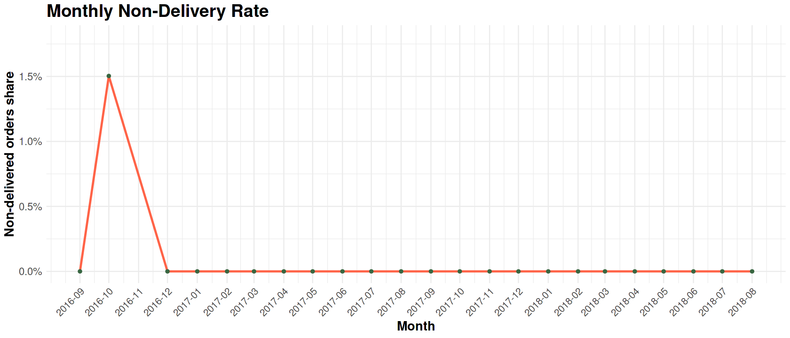
    


❗ To avoid misclassifying in-progress orders as delivery failures, orders flagged as “hanging” were excluded from the analysis. The **is_hanging** flag identifies orders whose elapsed time since purchase has not yet exceeded the maximum observed order-to-delivery duration for their corresponding product category (calculations based on historical data). When computing delivery rates, only orders with sufficient time to reasonably reach a final delivery outcome were included.

🔹 The charts show that delivery performance improves very rapidly during the early months of the marketplace and then remains extremely high and stable throughout the remainder of the observation period. After a brief ramp-up phase in late 2016, the monthly delivery rate stays consistently close to 100%, with non-delivery rates effectively near zero.

🔹 A small spike in non-delivery is visible in October 2016, likely reflecting early-stage operational immaturity or low order volumes during the platform’s launch phase. Beyond this initial period, there is no evidence of sustained delivery issues or seasonal degradation in performance.

🔹 Overall, from late 2016 through mid-2018, Olist demonstrates very strong and stable fulfillment performance, indicating that logistics and delivery operations scaled effectively alongside rapid marketplace growth, without introducing meaningful increases in non-delivery risk for customers.


### **Question 4: "How concentrated is Olist’s GMV and order volume across sellers and products?"**
Answer to this question will show whether the marketplace depends on a small set of top sellers/products or is broadly diversified, as well as help identify key contributors to GMV and where risk is if those sellers/products churn


```R
seller_gmv <- orders %>%
  filter(order_status == "delivered",
         timeline_is_valid == 1,
         is_hanging == 0) %>%
  select(order_id) %>%
  inner_join(order_items %>% select(order_id, seller_id, price, freight_value), by = "order_id") %>%
  group_by(seller_id) %>%
  summarise(
    gmv = sum(price + freight_value, na.rm = TRUE),
    orders_n = n_distinct(order_id),
    .groups = "drop"
  ) %>%
  arrange(desc(gmv)) %>%
  mutate(
    seller_rank = row_number(),
    cum_gmv = cumsum(gmv),
    cum_gmv_share = cum_gmv / sum(gmv),
    cum_gmv_share_pct = round(cum_gmv_share * 100, 2)
  )

seller_gmv %>%
  summarise(
    total_sellers = n(),
    top_10_share = cum_gmv_share_pct[10],
    top_50_share = cum_gmv_share_pct[50],
    top_100_share = cum_gmv_share_pct[100]
  )
```


<table class="dataframe">
<caption>A tibble: 1 × 4</caption>
<thead>
	<tr><th scope=col>total_sellers</th><th scope=col>top_10_share</th><th scope=col>top_50_share</th><th scope=col>top_100_share</th></tr>
	<tr><th scope=col>&lt;int&gt;</th><th scope=col>&lt;dbl&gt;</th><th scope=col>&lt;dbl&gt;</th><th scope=col>&lt;dbl&gt;</th></tr>
</thead>
<tbody>
	<tr><td>2959</td><td>12.99</td><td>32.62</td><td>44.9</td></tr>
</tbody>
</table>


```R
ggplot(seller_gmv, aes(x = seller_rank, y = cum_gmv_share)) +
  geom_line(color = "#4682B4", linewidth = 1) +
  scale_y_continuous(labels = scales::percent_format(accuracy = 1)) +
  labs(title = "Cumulative GMV share by seller", x = "Seller rank (by GMV)", y = "Cumulative GMV share") +
  theme_minimal() +
  theme(
    plot.background = element_rect(fill = "white", color = NA),
    panel.background = element_rect(fill = "white", color = NA),
    axis.text.y = element_text(size = 14),
    axis.text.x = element_text(size = 14),
    plot.title = element_text(size = 22, face = "bold"),
    axis.title.x = element_text(size = 16, face = "bold"),
    axis.title.y = element_text(size = 16, face = "bold"))
```


    

    


🔹 The cumulative GMV curve rises steeply for the top-ranked sellers and then gradually flattens, indicating a right-skewed distribution of GMV across sellers, consistent with a **power-law** or **long-tail** marketplace structure.

🔹 Seller-level GMV is meaningfully concentrated but not dominated by a handful of sellers. The top 10 sellers account for approximately 13% of total GMV, the top 50 for ~33%, and the top 100 for ~45%, out of ~3K sellers. This suggests that leading sellers contribute disproportionately, but a substantial share of GMV is still generated by a broad base of mid-tier and smaller sellers.

🔹 The long tail contributes progressively less GMV per additional seller, as reflected in the flattening cumulative curve at higher ranks. At the same time, its combined contribution remains economically important, suggesting that Olist’s marketplace is not excessively dependent on a very small seller elite.

🔹 From a risk perspective, this distribution suggests moderate concentration risk rather than extreme dependence. The loss of one or several top sellers would likely have a noticeable impact on GMV, but would not by itself destabilize the marketplace. Broader seller-side issues affecting many participants would likely pose a greater structural risk than isolated top-seller churn.


To assess how concentrated Olist’s GMV is across sellers, I decided to use two complementary concentration metrics: the **Gini coefficient** and the **Herfindahl–Hirschman Index (HHI)**.

The **Gini coefficient** captures inequality in distribution (how unevenly is GMV spread across sellers?) A high Gini value indicates a strong long-tail structure (a small number of sellers account for a large share of total GMV). This is particularly useful in marketplace settings, where seller sizes vary widely and inequality is expected.

However, inequality alone does not indicate dependency risk. A marketplace can be highly unequal yet still diversified if no single seller (or small group) dominates total volume. To address this, I also computed the **Herfindahl–Hirschman Index (HHI)**, which measures market concentration by squaring and summing sellers’ GMV shares. HHI is sensitive to dominant players and is commonly used in competition economics to assess structural risk.

Using both metrics together allows for a more nuanced interpretation: Gini explains how skewed GMV distribution is, HHI explains whether that skew translates into structural dependency.


```R
seller_gmv_shares <- seller_gmv %>%
  mutate(gmv_share = gmv / sum(gmv))

gmv_vec <- seller_gmv$gmv
n_sellers <- length(gmv_vec)

gini_gmv <- sum(abs(outer(gmv_vec, gmv_vec, "-"))) / (2 * n_sellers^2 * mean(gmv_vec))
cat(sprintf("Gini coefficient of seller GMV: %.3f\n\n", gini_gmv))

hhi_gmv <- sum(seller_gmv_shares$gmv_share^2)
cat(sprintf("Herfindahl–Hirschman Index (HHI) for seller GMV: %.4f\n\n", hhi_gmv))
```

    Gini coefficient of seller GMV: 0.782
    
    Herfindahl–Hirschman Index (HHI) for seller GMV: 0.0035
    
    

🔹**Gini coefficient = 0.78** ➡︎ indicates extreme inequality in GMV distribution across sellers ➡︎ a small fraction of sellers captures a disproportionately large share of GMV, while majority of sellers contribute relatively little individually (classic long-tail marketplace).

This quantitatively confirms what the graph's steep initial slope of the cumulative GMV curve already suggested.

However, worth mentioning, that high Gini coefficient does not indicate an unhealthy marketplace. A high Gini is common and often expected in such business scenario, because sellers vary a lot in scale and professionalism, large sellers naturally dominate volume. 


🔹**HHI = 0.0035** ➡︎ indicates very low market concentration (0 → perfectly competitive, 1 → monopoly; in competition economics HHI < 0.01 means very unconcentrated) ➡︎ no single seller (or small seller group) dominates the marketplace, even the largest sellers hold only small individual market shares ➡︎ Olist platform risk from single-seller failure is low

This is a crucial counterbalance to the high Gini.

🔹In the case of Olist platform, the combination of a high Gini coefficient and a very low HHI indicates a classic platform pattern: GMV is **highly unequal but not concentrated** around a few dominant sellers. This suggests a healthy long-tail marketplace, where top sellers matter, but overall performance is not fragile to the loss of any single participant.


**Conclusion:**

Formal concentration metrics confirm the visual findings. Seller GMV is highly unequal, with a Gini coefficient indicating a strong long-tail structure where a small subset of sellers generates a large share of volume. However, the Herfindahl–Hirschman Index remains very low, well below thresholds associated with market concentration. This combination implies that while top sellers are disproportionately important, Olist’s GMV is not dependent on any single seller or narrow group, suggesting limited systemic risk from individual seller churn and a broadly diversified marketplace.


### **Question 5: "Which product categories drive most of Olist’s GMV and orders, and how stable is this mix over time?"**

Answering this question will show, where demand is concentrated at the product-category level, complementing the seller-level view. It will help identify strategic categories ("cash cows" vs "long tail") and whether Olist’s assortment focus shifts over time.


```R
orders_clean <- orders %>%
  filter(order_status == "delivered", timeline_is_valid == 1, is_hanging == 0) %>%
  select(order_id, order_purchase_timestamp) %>%
  rename(order_ts = order_purchase_timestamp)  

payments_per_order <- order_payments %>%
  filter(is_micro_payment == 0, is_zero_payment == 0) %>%
  group_by(order_id) %>%
  summarise(order_gmv = sum(payment_value, na.rm = TRUE), .groups = "drop")

order_items_weighted <- order_items %>%
  group_by(order_id) %>%
  mutate(order_total_price = sum(price, na.rm = TRUE), item_weight = (price + freight_value) / sum(price + freight_value)) %>%
  ungroup()

items_with_gmv <- order_items_weighted %>%
  inner_join(payments_per_order, by = "order_id")

category_items <- items_with_gmv %>%
  inner_join(orders_clean, by = "order_id") %>%  
  left_join(products %>% select(product_id, product_category_eng), by = "product_id")

category_items <- category_items %>%
  mutate(
    product_category_eng = if_else(is.na(product_category_eng), "unknown_category", product_category_eng),
    item_gmv = order_gmv * item_weight,
    month = as.Date(floor_date(order_ts, "month")))

category_gmv <- category_items %>%
  group_by(product_category_eng) %>%
  summarise(
    gmv = sum(item_gmv, na.rm = TRUE),
    orders_n = n_distinct(order_id), .groups = "drop") %>%
  arrange(desc(gmv)) %>%
  mutate(category_rank = row_number(), cum_gmv = cumsum(gmv), cum_gmv_share = cum_gmv / sum(gmv))

options(repr.plot.width = 10, repr.plot.height = 8)

ggplot(category_gmv, aes(x = category_rank, y = cum_gmv_share)) +
  geom_line(color = "#4682B4", linewidth = 1) +
  scale_y_continuous(labels = percent_format(accuracy = 1)) +
  labs(title = "Cumulative GMV share by product category", x = "Category rank (by GMV)", y = "Cumulative GMV share") +
  theme_minimal() +
  theme(
    plot.title = element_text(size = 22, face = "bold"),
    axis.title = element_text(size = 16, face = "bold"),
    axis.text = element_text(size = 14))
```


    
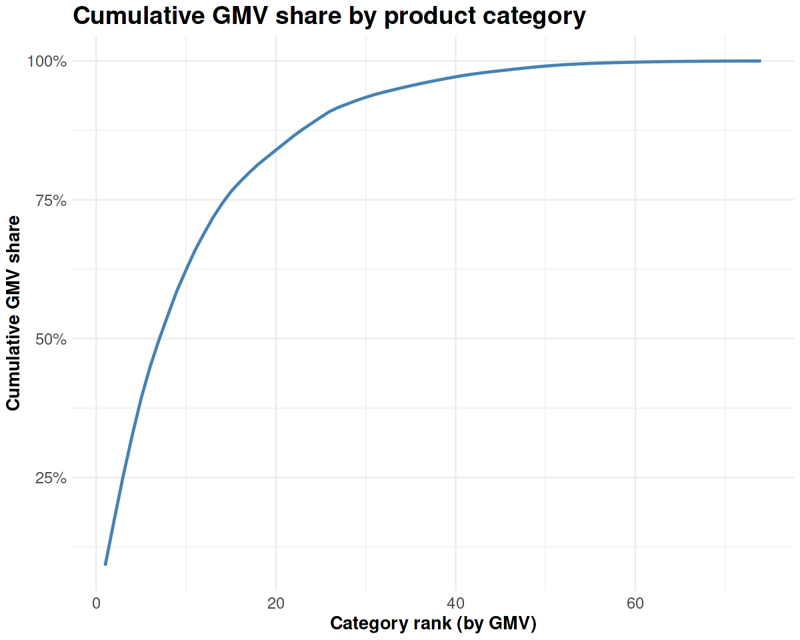
    


```R
top_n <- 20

top_categories <- category_gmv %>%
  slice_head(n = top_n) %>%
  select(category_rank, product_category_eng, gmv, cum_gmv_share)

top_categories
```


<table class="dataframe">
<caption>A tibble: 20 × 4</caption>
<thead>
	<tr><th scope=col>category_rank</th><th scope=col>product_category_eng</th><th scope=col>gmv</th><th scope=col>cum_gmv_share</th></tr>
	<tr><th scope=col>&lt;int&gt;</th><th scope=col>&lt;chr&gt;</th><th scope=col>&lt;dbl&gt;</th><th scope=col>&lt;dbl&gt;</th></tr>
</thead>
<tbody>
	<tr><td> 1</td><td>health_beauty        </td><td>1386837.5</td><td>0.09117233</td></tr>
	<tr><td> 2</td><td>watches_gifts        </td><td>1247806.4</td><td>0.17320459</td></tr>
	<tr><td> 3</td><td>bed_bath_table       </td><td>1206990.4</td><td>0.25255355</td></tr>
	<tr><td> 4</td><td>sports_leisure       </td><td>1105561.9</td><td>0.32523449</td></tr>
	<tr><td> 5</td><td>computers_accessories</td><td>1019339.2</td><td>0.39224705</td></tr>
	<tr><td> 6</td><td>furniture_decor      </td><td> 869493.3</td><td>0.44940856</td></tr>
	<tr><td> 7</td><td>housewares           </td><td> 743066.8</td><td>0.49825864</td></tr>
	<tr><td> 8</td><td>cool_stuff           </td><td> 686083.6</td><td>0.54336258</td></tr>
	<tr><td> 9</td><td>auto                 </td><td> 662460.0</td><td>0.58691348</td></tr>
	<tr><td>10</td><td>garden_tools         </td><td> 560342.5</td><td>0.62375105</td></tr>
	<tr><td>11</td><td>toys                 </td><td> 539642.2</td><td>0.65922777</td></tr>
	<tr><td>12</td><td>baby                 </td><td> 460038.7</td><td>0.68947125</td></tr>
	<tr><td>13</td><td>perfumery            </td><td> 436847.6</td><td>0.71819012</td></tr>
	<tr><td>14</td><td>telephony            </td><td> 375315.4</td><td>0.74286380</td></tr>
	<tr><td>15</td><td>office_furniture     </td><td> 334274.9</td><td>0.76483942</td></tr>
	<tr><td>16</td><td>stationery           </td><td> 266421.5</td><td>0.78235428</td></tr>
	<tr><td>17</td><td>pet_shop             </td><td> 246049.7</td><td>0.79852987</td></tr>
	<tr><td>18</td><td>computers            </td><td> 228349.7</td><td>0.81354185</td></tr>
	<tr><td>19</td><td>electronics          </td><td> 198703.3</td><td>0.82660484</td></tr>
	<tr><td>20</td><td>musical_instruments  </td><td> 198445.8</td><td>0.83965090</td></tr>
</tbody>
</table>


```R
options(repr.plot.width = 11, repr.plot.height = 8)
ggplot(top_categories, aes(x = reorder(product_category_eng, -gmv), y = gmv / 1000)) +
  geom_col(fill = "#4682B4") +
  labs(title = paste("Top 20 product categories by GMV"), x = "Product category", y = "GMV (K R$)") +
  theme_minimal() +
  theme(
    plot.background = element_rect(fill = "white", color = NA),
    panel.background = element_rect(fill = "white", color = NA),
    axis.text.x = element_text(size = 14, angle = 45, hjust = 1),
    axis.text.y = element_text(size = 14),
    plot.title = element_text(size = 22, face = "bold"),
    axis.title.x = element_text(size = 16, face = "bold"),
    axis.title.y = element_text(size = 16, face = "bold"))
```


    
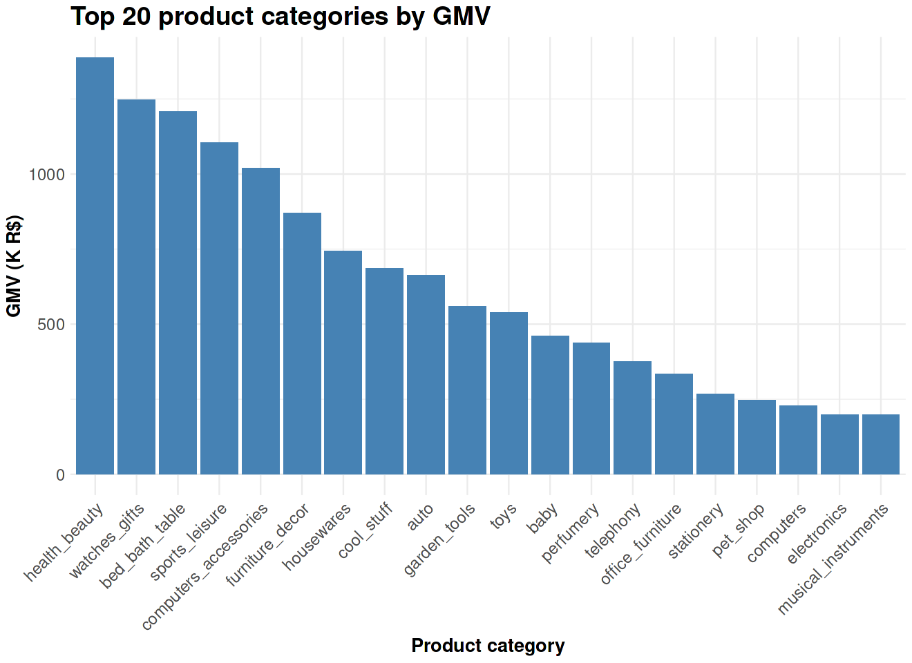
    


🔹 Olist’s GMV is highly concentrated in a small set of product categories. The cumulative curve rises steeply for the first ~15 categories, then flattens, showing that the remaining 40+ categories add only marginal GMV. High‑performing categories like **health_beauty**, **watches_gifts**, **bed_bath_table**, **sports_leisure**, **computers_accessories** and **furniture_decor** drive most GMV and therefore concentrate both: growth potential and risk, while the long tail of smaller categories plays a secondary, niche role.

### **Question 6: "How many customers are one‑time buyers vs repeat buyers, and how much GMV comes from repeat customers?"**

Answer to this question will show how dependent Olist platofrm is on repeat purchases vs acquisition of new customers


```R
orders_enriched <- orders %>%
  left_join(customers %>% select(customer_id, customer_unique_id), by = "customer_id")

customer_orders <- orders_enriched %>%
  filter(order_status == "delivered", timeline_is_valid == 1, is_hanging == 0) %>%
  inner_join(order_payments, by = "order_id") %>%
  filter(is_micro_payment == 0, is_zero_payment == 0) %>%
  group_by(customer_unique_id, order_id) %>%
  summarise(gmv_order = sum(payment_value, na.rm = TRUE), .groups = "drop")

customer_summary <- customer_orders %>%
  group_by(customer_unique_id) %>%
  summarise(orders_per_customer = n_distinct(order_id), gmv_per_customer = sum(gmv_order, na.rm = TRUE), .groups = "drop") %>%
  mutate(customer_type = if_else(orders_per_customer > 1, "Repeat", "One-time"))

repeat_stats <- customer_summary %>%
  group_by(customer_type) %>%
  summarise(customers_n = n(), gmv = sum(gmv_per_customer, na.rm = TRUE), .groups = "drop") %>%
  mutate(customers_share = round(customers_n / sum(customers_n) * 100, 2), gmv_share = round(gmv / sum(gmv) * 100, 2))

repeat_stats
cat("\n\n\n")

options(repr.plot.width = 14, repr.plot.height = 3)
ggplot(repeat_stats, aes(x = customer_type, y = gmv_share, fill = customer_type)) +
  geom_col(width = 0.6) +
  geom_text(aes(label = paste0(gmv_share, "%")), color = "white", size = 5, fontface = "bold", position = position_stack(vjust = 0.5)) +
  scale_fill_manual(values = c("One-time" = "#4682B4", "Repeat" = "#b56576")) +
  labs(title = "Share of GMV by customer type", x = "Customer type", y = "Share of GMV") +
coord_flip() +
  theme_minimal() +
  theme(
    plot.background = element_rect(fill = "white", color = NA),
    panel.background = element_rect(fill = "white", color = NA),
    legend.position = "none",
    axis.text.x = element_text(size = 14),
    axis.text.y = element_text(size = 14),
    plot.title = element_text(size = 22, face = "bold"),
    axis.title.x = element_text(size = 16, face = "bold"),
    axis.title.y = element_text(size = 16, face = "bold"))
```


<table class="dataframe">
<caption>A tibble: 2 × 5</caption>
<thead>
	<tr><th scope=col>customer_type</th><th scope=col>customers_n</th><th scope=col>gmv</th><th scope=col>customers_share</th><th scope=col>gmv_share</th></tr>
	<tr><th scope=col>&lt;chr&gt;</th><th scope=col>&lt;int&gt;</th><th scope=col>&lt;dbl&gt;</th><th scope=col>&lt;dbl&gt;</th><th scope=col>&lt;dbl&gt;</th></tr>
</thead>
<tbody>
	<tr><td>One-time</td><td>89280</td><td>14364796</td><td>97.02</td><td>94.44</td></tr>
	<tr><td>Repeat  </td><td> 2744</td><td>  846371</td><td> 2.98</td><td> 5.56</td></tr>
</tbody>
</table>


    
    
    
    


    
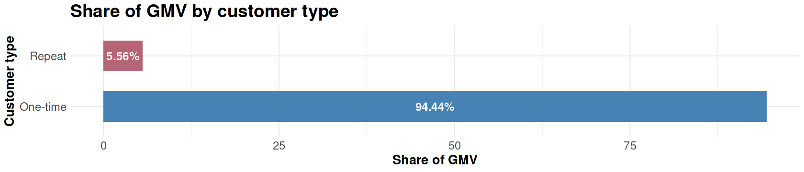
    


#### Among customers with valid delivered orders, how many were one-time vs repeat, and how was GMV distributed between them?

🔹The vast majority of GMV comes from **one‑time** customers, not repeat ones, they generate about 94% of total GMV.  

🔹Repeat customers contribute only about 5.6% of GMV, they are roughly 3% of the customer base (their per‑customer GMV is higher).  

🔹Olist growth relies heavily on acquiring new customers and their first purchases, retention is a minor driver of GMV, but presents a valuable opportunity. Increasing repeat purchase rates could improve profitability and stabilize GMV.  

🔹Because repeat buyers are more valuable on a per‑customer basis, have much higher lifetime value and are cheaper to retain than new customers are to acquire, improving retention and repeat purchasing could materially shift GMV mix even if the repeat customer share of the base stays relatively small. This could be acheieved by investing in repeat-customers' **post‑purchase experience**, **loyalty programs** and **remarketing campaigns** to increase repeat rate ➜ should materially improve profitability and GMV stability over time.  

🔹The bar chart highlights the stark GMV contrast between one-time and repeat buyers. Even though repeat buyers are a small fraction, targeting them effectively could yield outsized returns.  

### **Question 7: "How do the unit economics (average order value, margin per order, and acquisition/retention costs) differ between one‑time and repeat customers, and what does this imply for where the business should invest to maximize long‑term profit?"**


```R
orders_with_customer_type <- customer_summary %>%
  select(customer_unique_id, customer_type) %>%
  inner_join(customer_orders, by = "customer_unique_id")

customer_type_metrics <- orders_with_customer_type %>%
  group_by(customer_type) %>%
  summarise(
    orders_n = n_distinct(order_id),
    customers_n = n_distinct(customer_unique_id),
    gmv_total = sum(gmv_order, na.rm = TRUE),
    aov_gmv = round((gmv_total / orders_n), 2),          
    gmv_per_customer = round((gmv_total / customers_n), 2), .groups = "drop")

customer_type_metrics
```


<table class="dataframe">
<caption>A tibble: 2 × 6</caption>
<thead>
	<tr><th scope=col>customer_type</th><th scope=col>orders_n</th><th scope=col>customers_n</th><th scope=col>gmv_total</th><th scope=col>aov_gmv</th><th scope=col>gmv_per_customer</th></tr>
	<tr><th scope=col>&lt;chr&gt;</th><th scope=col>&lt;int&gt;</th><th scope=col>&lt;int&gt;</th><th scope=col>&lt;dbl&gt;</th><th scope=col>&lt;dbl&gt;</th><th scope=col>&lt;dbl&gt;</th></tr>
</thead>
<tbody>
	<tr><td>One-time</td><td>89280</td><td>89280</td><td>14364796</td><td>160.9</td><td>160.90</td></tr>
	<tr><td>Repeat  </td><td> 5801</td><td> 2744</td><td>  846371</td><td>145.9</td><td>308.44</td></tr>
</tbody>
</table>


🔹  It is now confirmed, that **repeat customers are much more valuable on a per‑customer basis**, even though their average order value is slightly lower than that of one‑time customers (about 145.9 vs 160.9 R$ ➜ one‑time customers have a slightly higher AOV, so their typical basket is marginally bigger on each purchase).

🔹 However, repeat customers bring in about 92% more GMV per customer, almost twice as much, confirming that repeat buyers place multiple orders and drive substantially higher revenue over their relationship with the platform.

🔹 Acquiring a repeat customer is far more valuable than acquiring a new one-time buyer. Even if the AOV per order is slightly lower for repeat buyers, their lifetime value (LTV) is much higher. Prioritizing retention can be more profitable than focusing solely on acquisition.


**My recommendations:** 
> * Invest in post-purchase engagement to convert one-time buyers into repeat ones  
> * Use loyalty programs, remarketing and personalized offers to increase repeat rates  
> * Accept slightly lower AOV for repeat orders if it encourages retention over time, the GMV gain per customer outweighs this  
> * Track unit economics carefully to see the ROI on retention initiatives compared to acquisition campaigns

### **Question 8: "How many orders does the average one‑time vs repeat customer place, and how skewed is ordering behavior within each group?"**


```R
orders_dist <- customer_summary %>%
  group_by(customer_type, orders_per_customer) %>%
  summarise(customers_n = n(), .groups = "drop")

orders_freq_stats <- customer_summary %>%
  group_by(customer_type) %>%
  summarise(
    customers_n = n(),
    mean_orders = mean(orders_per_customer),
    median_orders = median(orders_per_customer),
    p90_orders = quantile(orders_per_customer, 0.9),
    max_orders = max(orders_per_customer), .groups = "drop")
orders_dist
cat("\n\n")
orders_freq_stats
cat("\n\n")
repeat_orders_dist <- customer_summary %>%
  filter(customer_type == "Repeat") %>%
  group_by(orders_per_customer) %>%
  summarise(customers_n = n(), .groups = "drop")
cat("\n\n")

options(repr.plot.width = 10, repr.plot.height = 6)
ggplot(repeat_orders_dist, aes(x = factor(orders_per_customer), y = customers_n)) +
  geom_col(fill = "#b56576", width = 0.6) +
  geom_text(aes(label = customers_n), vjust = -0.5, size = 5) +
  labs(title = "Order Frequency Distribution for Repeat Customers", x = "Number of Orders per Customer", y = "Number of Customers") +
  theme_minimal() +
  theme(
    plot.title = element_text(size = 22, face = "bold"),
    axis.title = element_text(size = 16, face = "bold"),
    axis.text = element_text(size = 14))
```


<table class="dataframe">
<caption>A tibble: 9 × 3</caption>
<thead>
	<tr><th scope=col>customer_type</th><th scope=col>orders_per_customer</th><th scope=col>customers_n</th></tr>
	<tr><th scope=col>&lt;chr&gt;</th><th scope=col>&lt;int&gt;</th><th scope=col>&lt;int&gt;</th></tr>
</thead>
<tbody>
	<tr><td>One-time</td><td> 1</td><td>89280</td></tr>
	<tr><td>Repeat  </td><td> 2</td><td> 2521</td></tr>
	<tr><td>Repeat  </td><td> 3</td><td>  177</td></tr>
	<tr><td>Repeat  </td><td> 4</td><td>   27</td></tr>
	<tr><td>Repeat  </td><td> 5</td><td>    9</td></tr>
	<tr><td>Repeat  </td><td> 6</td><td>    5</td></tr>
	<tr><td>Repeat  </td><td> 7</td><td>    3</td></tr>
	<tr><td>Repeat  </td><td> 9</td><td>    1</td></tr>
	<tr><td>Repeat  </td><td>15</td><td>    1</td></tr>
</tbody>
</table>


    
    
    


<table class="dataframe">
<caption>A tibble: 2 × 6</caption>
<thead>
	<tr><th scope=col>customer_type</th><th scope=col>customers_n</th><th scope=col>mean_orders</th><th scope=col>median_orders</th><th scope=col>p90_orders</th><th scope=col>max_orders</th></tr>
	<tr><th scope=col>&lt;chr&gt;</th><th scope=col>&lt;int&gt;</th><th scope=col>&lt;dbl&gt;</th><th scope=col>&lt;dbl&gt;</th><th scope=col>&lt;dbl&gt;</th><th scope=col>&lt;int&gt;</th></tr>
</thead>
<tbody>
	<tr><td>One-time</td><td>89280</td><td>1.000000</td><td>1</td><td>1</td><td> 1</td></tr>
	<tr><td>Repeat  </td><td> 2744</td><td>2.114067</td><td>2</td><td>2</td><td>15</td></tr>
</tbody>
</table>


    
    
    
    
    


    
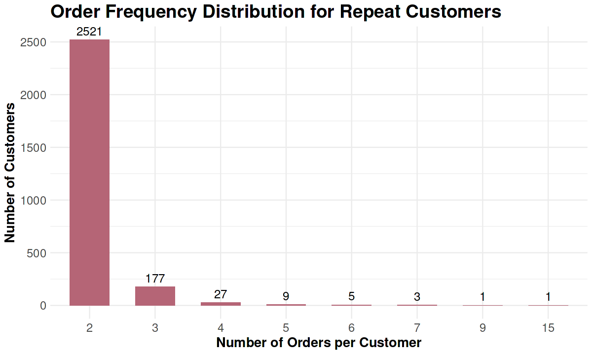
    


🔹One-time buyers ➜ all place exactly 1 order, no natural repeat behavior in this segment  
🔹Repeat customers ➜ buy more often (average: ~2.1 orders per customer), but the repeat behavior is shallow for most of them and extreme for a tiny "elite" (both: **median AND 90th percentile** ➡︎ 2 orders, **max** ➜ 15 orders)    
🔹Distribution is highly right-skewed: few customers place many orders  
🔹Once again: main focus should be on converting one-time buyers into second-time buyers, on encouraging the second purchase, as this is where most growth can be unlocked  
🔹Advanced segmentation can target "elite" repeaters with premium offers or loyalty perks to maximize long-term value  

A natural next question would be about who these valuable customers are ➤  

### **Question 9: "How do customer demographics and purchase characteristics differ between one‑time, light‑repeat (2 orders), and heavy‑repeat (3+ orders) customers?"**


```R
customer_segments <- customer_summary %>%
  mutate(
    freq_segment = case_when(
      orders_per_customer == 1 ~ "One-time",           
      orders_per_customer == 2 ~ "Light-repeat (2)",          
      orders_per_customer >= 3 ~ "Heavy-repeat (3+)"))

orders_with_segment <- customer_orders %>%
  inner_join(customer_segments %>%
    select(customer_unique_id, freq_segment),
  by = "customer_unique_id")

orders_seg_geo <- orders_with_segment %>%
  inner_join(customers %>% select(customer_unique_id, customer_state), by = "customer_unique_id", relationship = "many-to-many") %>%
  group_by(freq_segment, customer_state) %>%
  summarise(
    customers_n = n_distinct(customer_unique_id),
    gmv_total = sum(gmv_order, na.rm = TRUE), .groups = "drop")

orders_seg_geo

cat("\n\n")

orders_seg_pay <- orders_with_segment %>%
inner_join(order_payments %>% select(order_id, payment_type), by = "order_id") %>%
  group_by(freq_segment, payment_type) %>%
  summarise(
    customers_n = n_distinct(customer_unique_id),
    gmv_total   = sum(gmv_order, na.rm = TRUE), .groups = "drop")

orders_seg_pay
```


<table class="dataframe">
<caption>A tibble: 74 × 4</caption>
<thead>
	<tr><th scope=col>freq_segment</th><th scope=col>customer_state</th><th scope=col>customers_n</th><th scope=col>gmv_total</th></tr>
	<tr><th scope=col>&lt;chr&gt;</th><th scope=col>&lt;chr&gt;</th><th scope=col>&lt;int&gt;</th><th scope=col>&lt;dbl&gt;</th></tr>
</thead>
<tbody>
	<tr><td>Heavy-repeat (3+)</td><td>AM</td><td> 1</td><td>  2074.00</td></tr>
	<tr><td>Heavy-repeat (3+)</td><td>BA</td><td> 8</td><td> 13697.90</td></tr>
	<tr><td>Heavy-repeat (3+)</td><td>CE</td><td> 2</td><td>  1898.63</td></tr>
	<tr><td>Heavy-repeat (3+)</td><td>DF</td><td> 4</td><td>  3555.14</td></tr>
	<tr><td>Heavy-repeat (3+)</td><td>ES</td><td> 6</td><td> 11395.52</td></tr>
	<tr><td>Heavy-repeat (3+)</td><td>GO</td><td> 5</td><td>  7762.40</td></tr>
	<tr><td>Heavy-repeat (3+)</td><td>MA</td><td> 2</td><td>  4577.86</td></tr>
	<tr><td>Heavy-repeat (3+)</td><td>MG</td><td>25</td><td> 40634.67</td></tr>
	<tr><td>Heavy-repeat (3+)</td><td>MS</td><td> 3</td><td>  3216.06</td></tr>
	<tr><td>Heavy-repeat (3+)</td><td>MT</td><td> 2</td><td>  1467.18</td></tr>
	<tr><td>Heavy-repeat (3+)</td><td>PA</td><td> 2</td><td>  2150.25</td></tr>
	<tr><td>Heavy-repeat (3+)</td><td>PB</td><td> 2</td><td>  5085.20</td></tr>
	<tr><td>Heavy-repeat (3+)</td><td>PE</td><td> 3</td><td> 15972.93</td></tr>
	<tr><td>Heavy-repeat (3+)</td><td>PI</td><td> 2</td><td>  2994.66</td></tr>
	<tr><td>Heavy-repeat (3+)</td><td>PR</td><td>11</td><td> 11300.79</td></tr>
	<tr><td>Heavy-repeat (3+)</td><td>RJ</td><td>37</td><td> 64957.93</td></tr>
	<tr><td>Heavy-repeat (3+)</td><td>RO</td><td> 2</td><td>  3385.48</td></tr>
	<tr><td>Heavy-repeat (3+)</td><td>RS</td><td>15</td><td> 51165.97</td></tr>
	<tr><td>Heavy-repeat (3+)</td><td>SC</td><td> 6</td><td> 13830.11</td></tr>
	<tr><td>Heavy-repeat (3+)</td><td>SP</td><td>89</td><td>155161.05</td></tr>
	<tr><td>Light-repeat (2) </td><td>AC</td><td> 4</td><td>  3688.72</td></tr>
	<tr><td>Light-repeat (2) </td><td>AL</td><td>10</td><td> 11864.06</td></tr>
	<tr><td>Light-repeat (2) </td><td>AM</td><td> 2</td><td>  2916.24</td></tr>
	<tr><td>Light-repeat (2) </td><td>AP</td><td> 1</td><td>  1211.66</td></tr>
	<tr><td>Light-repeat (2) </td><td>BA</td><td>82</td><td> 56747.61</td></tr>
	<tr><td>Light-repeat (2) </td><td>CE</td><td>19</td><td> 10973.68</td></tr>
	<tr><td>Light-repeat (2) </td><td>DF</td><td>56</td><td> 27403.41</td></tr>
	<tr><td>Light-repeat (2) </td><td>ES</td><td>49</td><td> 29837.53</td></tr>
	<tr><td>Light-repeat (2) </td><td>GO</td><td>51</td><td> 25300.06</td></tr>
	<tr><td>Light-repeat (2) </td><td>MA</td><td>13</td><td>  9414.87</td></tr>
	<tr><td>⋮</td><td>⋮</td><td>⋮</td><td>⋮</td></tr>
	<tr><td>Light-repeat (2)</td><td>SE</td><td>    8</td><td>   4618.47</td></tr>
	<tr><td>Light-repeat (2)</td><td>SP</td><td> 1114</td><td> 603877.41</td></tr>
	<tr><td>Light-repeat (2)</td><td>TO</td><td>    6</td><td>   4028.66</td></tr>
	<tr><td>One-time        </td><td>AC</td><td>   69</td><td>  17207.28</td></tr>
	<tr><td>One-time        </td><td>AL</td><td>  374</td><td>  88470.67</td></tr>
	<tr><td>One-time        </td><td>AM</td><td>  136</td><td>  25518.02</td></tr>
	<tr><td>One-time        </td><td>AP</td><td>   65</td><td>  15535.98</td></tr>
	<tr><td>One-time        </td><td>BA</td><td> 3022</td><td> 552668.01</td></tr>
	<tr><td>One-time        </td><td>CE</td><td> 1217</td><td> 255484.36</td></tr>
	<tr><td>One-time        </td><td>DF</td><td> 1921</td><td> 323785.79</td></tr>
	<tr><td>One-time        </td><td>ES</td><td> 1848</td><td> 296405.91</td></tr>
	<tr><td>One-time        </td><td>GO</td><td> 1808</td><td> 314098.87</td></tr>
	<tr><td>One-time        </td><td>MA</td><td>  672</td><td> 140874.26</td></tr>
	<tr><td>One-time        </td><td>MG</td><td>10516</td><td>1702950.72</td></tr>
	<tr><td>One-time        </td><td>MS</td><td>  658</td><td> 128596.99</td></tr>
	<tr><td>One-time        </td><td>MT</td><td>  813</td><td> 169316.99</td></tr>
	<tr><td>One-time        </td><td>PA</td><td>  890</td><td> 204070.94</td></tr>
	<tr><td>One-time        </td><td>PB</td><td>  486</td><td> 131685.99</td></tr>
	<tr><td>One-time        </td><td>PE</td><td> 1494</td><td> 295260.03</td></tr>
	<tr><td>One-time        </td><td>PI</td><td>  447</td><td> 100057.88</td></tr>
	<tr><td>One-time        </td><td>PR</td><td> 4558</td><td> 732024.03</td></tr>
	<tr><td>One-time        </td><td>RJ</td><td>11397</td><td>1908671.82</td></tr>
	<tr><td>One-time        </td><td>RN</td><td>  447</td><td>  96476.29</td></tr>
	<tr><td>One-time        </td><td>RO</td><td>  220</td><td>  53639.67</td></tr>
	<tr><td>One-time        </td><td>RR</td><td>   38</td><td>   7841.06</td></tr>
	<tr><td>One-time        </td><td>RS</td><td> 4930</td><td> 799796.31</td></tr>
	<tr><td>One-time        </td><td>SC</td><td> 3301</td><td> 559710.05</td></tr>
	<tr><td>One-time        </td><td>SE</td><td>  320</td><td>  67494.70</td></tr>
	<tr><td>One-time        </td><td>SP</td><td>37380</td><td>5367178.12</td></tr>
	<tr><td>One-time        </td><td>TO</td><td>  258</td><td>  57526.13</td></tr>
</tbody>
</table>


    
    
    


<table class="dataframe">
<caption>A tibble: 12 × 4</caption>
<thead>
	<tr><th scope=col>freq_segment</th><th scope=col>payment_type</th><th scope=col>customers_n</th><th scope=col>gmv_total</th></tr>
	<tr><th scope=col>&lt;chr&gt;</th><th scope=col>&lt;chr&gt;</th><th scope=col>&lt;int&gt;</th><th scope=col>&lt;dbl&gt;</th></tr>
</thead>
<tbody>
	<tr><td>Heavy-repeat (3+)</td><td>boleto     </td><td>   68</td><td>   25141.82</td></tr>
	<tr><td>Heavy-repeat (3+)</td><td>credit_card</td><td>  179</td><td>   85099.48</td></tr>
	<tr><td>Heavy-repeat (3+)</td><td>debit_card </td><td>    2</td><td>      88.70</td></tr>
	<tr><td>Heavy-repeat (3+)</td><td>voucher    </td><td>   27</td><td>    6703.81</td></tr>
	<tr><td>Light-repeat (2) </td><td>boleto     </td><td>  562</td><td>  143822.87</td></tr>
	<tr><td>Light-repeat (2) </td><td>credit_card</td><td> 2074</td><td>  572589.04</td></tr>
	<tr><td>Light-repeat (2) </td><td>debit_card </td><td>   57</td><td>    8437.93</td></tr>
	<tr><td>Light-repeat (2) </td><td>voucher    </td><td>  189</td><td>   49288.35</td></tr>
	<tr><td>One-time         </td><td>boleto     </td><td>17793</td><td> 2563091.41</td></tr>
	<tr><td>One-time         </td><td>credit_card</td><td>68785</td><td>11560416.39</td></tr>
	<tr><td>One-time         </td><td>debit_card </td><td> 1366</td><td>  193724.26</td></tr>
	<tr><td>One-time         </td><td>voucher    </td><td> 3328</td><td>  686948.62</td></tr>
</tbody>
</table>


```R
top_states <- orders_seg_geo %>%
  group_by(customer_state) %>%
  summarise(gmv_total = sum(gmv_total), .groups = "drop") %>%
  slice_max(gmv_total, n = 10) %>%
  pull(customer_state)

orders_seg_geo_top <- orders_seg_geo %>%
  filter(customer_state %in% top_states)

options(repr.plot.width = 16, repr.plot.height = 8)
ggplot(orders_seg_geo_top, aes(x = reorder(customer_state, gmv_total), y = gmv_total, fill = freq_segment)) +
  geom_col(position = "fill", width = 0.6) +
  scale_y_continuous(labels = percent_format(accuracy = 1)) +
  scale_fill_manual(
    values = c("One-time" = "#7C95AD", "Light-repeat (2)" = "#E09791", "Heavy-repeat (3+)"= "#ADBCA5")) +
  coord_flip() +
  labs(title = "GMV share by frequency segment and state (top states)", x = "State", y = "GMV share", fill = "Customer segment") +
  theme_minimal() +
  theme(
    plot.background  = element_rect(fill = "white", color = NA),
    panel.background = element_rect(fill = "white", color = NA),
    axis.text.x = element_text(size = 14),
    axis.text.y = element_text(size = 14),
    plot.title = element_text(size = 22, face = "bold"),
    axis.title.x = element_text(size = 16, face = "bold"),
    axis.title.y = element_text(size = 16, face = "bold"),
    legend.title = element_text(size = 16, face = "bold"),
    legend.text = element_text(size = 14))
```


    
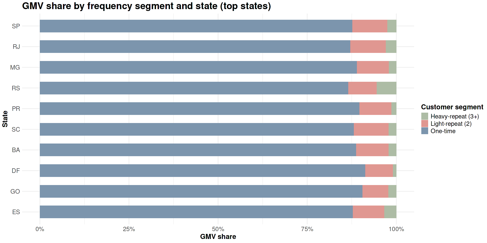
    


🔹 Credit card payments clearly dominate GMV across all segments, and repeat customers using cards are disproportionately valuable compared to other payment types:
> * Among heavy‑repeat customers (3+ orders), credit card users are the core: 179 customers generate about 85K GMV, versus 68 boleto customers at 25K and 27 voucher customers at 6.7K    
> * For light‑repeat customers, credit card again leads (2074 customers and ca. 573K GMV), followed by boleto (ca. 144K) and voucher (ca. 49K), so repeat behavior is tightly linked to card payments  
> * One‑time customers are overwhelmingly credit card users as well (68785 customers and ~11.6M GMV), but boleto still plays a sizable role (17793 customers and ~2.56M GMV), suggesting some one‑time, more transactional behavior via boleto

🔹 Vouchers and debit cards are minor across all segments  
🔹 Overall, the fact that **one‑time** and **repeat** customers both mostly use credit cards, is largely just reflecting Brazil’s e-commerce reality, not a special pattern in this dataset.

> * Target credit-card users with repeat incentives — they already show propensity to buy again
> * Consider offering special promotions or payment flexibility to convert boleto users to repeat customers

For geographic targeting:
> * Concentrate high retention efforts in São Paulo (SP), Rio de Janeiro (RJ), Minar Gerais (MG), and Parana (PR) states, where heavy and light repeaters are concentrated
> * Broader acquisition campaigns can continue nationwide to grow the one-time customer base


A good next question would be about what repeat customers actually buy:

### **Question 10: "How does GMV by product category differ between one‑time, light‑repeat, and heavy‑repeat customers, and which categories are relatively more important for heavy‑repeat customers?"**

This can reveal if certain categories are driving repeat-purchase behavior and where to focus merchandising, recommendations and promotions.


```R
orders_items_cat <- order_items %>%
  inner_join(orders_with_segment %>% select(order_id, freq_segment, gmv_order), by = "order_id") %>%
  inner_join(products %>% select(product_id, product_category_eng), by = "product_id")

# Allocating order GMV to each item proportionally by item price:

orders_items_cat <- orders_items_cat %>%
  group_by(order_id) %>%
  mutate(
    order_items_total_price = sum(price, na.rm = TRUE),
    gmv_item = if_else(
      order_items_total_price > 0,
      gmv_order * price / order_items_total_price,
      NA_real_)) %>%
  ungroup()

seg_cat_gmv <- orders_items_cat %>%
  group_by(freq_segment, product_category_eng) %>%
  summarise(gmv_total = sum(gmv_item, na.rm = TRUE), .groups = "drop"  )

seg_cat_share <- seg_cat_gmv %>%
  group_by(freq_segment) %>%
  mutate(gmv_share = gmv_total / sum(gmv_total)) %>%
  ungroup()

top_seg_cat <- seg_cat_share %>%
  group_by(freq_segment) %>%
  slice_max(order_by = gmv_share, n = 5, with_ties = FALSE) %>%
  ungroup() %>%
  mutate(label_pct = scales::percent(gmv_share, accuracy = 1))

ggplot(top_seg_cat, aes(x = freq_segment, y = gmv_share, fill = product_category_eng)) +
  geom_col(width = 0.7) +
  geom_text(
    aes(label = label_pct),
    position = position_stack(vjust = 0.5),
    size = 5,
    color = "black") +
  scale_y_continuous(labels = percent_format(accuracy = 1)) +
  scale_fill_brewer(palette = "Pastel1") +
  coord_flip() +
  labs(
    title = "Top categories by GMV share within each segment",
    x = "Customer segment",
    y = "GMV share",
    fill = "Category"
  ) +
  theme_minimal() +
  theme(
    plot.background  = element_rect(fill = "white", color = NA),
    panel.background = element_rect(fill = "white", color = NA),
    axis.text.x = element_text(size = 14),
    axis.text.y = element_text(size = 14),
    plot.title = element_text(size = 22, face = "bold"),
    axis.title.x = element_text(size = 16, face = "bold"),
    axis.title.y = element_text(size = 16, face = "bold"),
    legend.title = element_text(size = 15, face = "bold"),
    legend.text = element_text(size = 14))
```


    
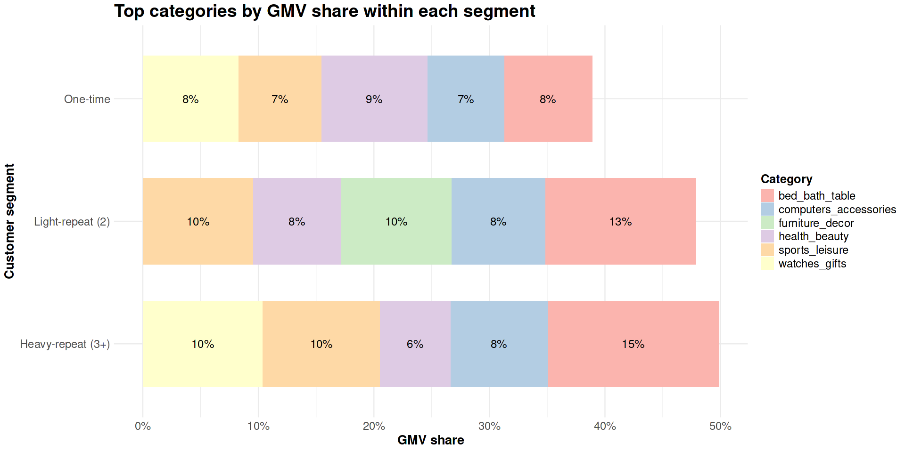
    


I want to verify, that allocated item GMV sums back to order GMV. 


```R
allocation_check <- orders_items_cat %>%
  group_by(order_id) %>%
  summarise(
    gmv_order = first(gmv_order),
    gmv_item_sum = sum(gmv_item, na.rm = TRUE),
    diff = gmv_order - gmv_item_sum,
    .groups = "drop")

summary(allocation_check$diff)
```


          Min.    1st Qu.     Median       Mean    3rd Qu.       Max. 
    -9.095e-13  0.000e+00  0.000e+00 -3.700e-18  0.000e+00  9.095e-13 


Min   -9.095e-13  
Mean  -3.7e-18  
Max    9.095e-13  

➜ That is floating-point noise around zero. 

> * item GMV sums exactly to order GMV
> * there's no leakage or inflation

**Chart description:** 
> * This chart compares how Gross Merchandise Value (GMV) is distributed across the top product categories within each customer frequency segment: one-time buyers, light-repeat buyers (2 orders), and heavy-repeat buyers (3+ orders)  
> * The x-axis represents GMV share, and each horizontal bar corresponds to a customer segment. Each bar is divided into stacked sections representing the top five product categories by GMV share within that segment. The legend indicates which color corresponds to each category
> * Because the categories are selected independently within each segment, the chart highlights where revenue is concentrated within each segment, rather than comparing a fixed set of categories across all segments
> * The stacked bars represent the combined GMV share of the top five categories within each segment, while the remaining categories form a long tail that is not displayed in the chart  

Across all segments, GMV is concentrated in a relatively small number of **lifestyle and consumer categories**, including: **health_beauty**, **sports_leisure**, **fashion_bags_accessories**, **bed_bath_table** and **watches_gifts**. These categories consistently account for a large portion of customer spending, indicating that a small number of product groups drive a substantial share of marketplace revenue.  

**Key Observations:**

1. Category concentration differs by customer segment:
> **Heavy-repeat buyers** ➡︎ GMV among heavy-repeat customers is concentrated in a small set of categories: (bed_bath_table (ca.15% GMV), sports_leisure (ca.10%), watches_gifts (ca.10%), computers_accessories (ca.8%), fashion_bags_accessories (ca.6%)) ➡︎ concentration suggests that repeat buyers tend to return to the platform for purchases within a relatively focused set of lifestyle and home-related categories.    
> **Light-repeat buyers** ➡︎ display a somewhat more diversified spending pattern. Their GMV is still strongly represented by:  bed_bath_table, furniture_decor, sports_leisure, and computers_accessories. Compared with heavy-repeat customers, category spending is slightly more dispersed.    
> **One-time buyers** ➡︎ spending is dominated by categories such as: health_beauty, bed_bath_table, watches_gifts, computers_accessories, and sports_leisure. While similar categories appear across all segments, spending among one-time buyers is somewhat less concentrated than among heavy-repeat customers.   

2. Category mix shifts with customer loyalty:
One notable pattern is the shift in dominant categories across customer segments:
 > One-time buyers: health_beauty plays a major role
 > Repeat buyers: home and lifestyle categories such as bed_bath_table become more prominent  

This suggests that repeat purchasing behavior may be associated with categories that naturally encourage multiple purchases over time, such as home goods or lifestyle products.

3. GMV concentration patterns ➡︎ Across all customer segments, a relatively small number of categories account for a substantial share of GMV. However, this concentration is most pronounced among heavy-repeat customers, indicating that loyal buyers tend to focus their purchases within a narrower set of product categories.

**Interpretation:**

The results suggest that repeat purchasing behavior on the Olist platform is associated with a specific set of lifestyle, home, and consumer product categories. While these categories appear across all customer segments, their relative importance increases among repeat buyers. This pattern indicates that certain product categories may be more effective at encouraging customers to return to the marketplace.

However, **this analysis identifies associations, rather than causal relationships**. The results show where repeat customers concentrate their spending, but do not prove that these categories directly cause repeat purchases.

**Recommendations:**

* **Focus retention initiatives in repeat-heavy categories** (**bed_bath_table**, **sports_leisure**, **furniture_decor** appear strongly represented among repeat buyers. These categories may be promising targets for retention campaigns or seller recruitment efforts aimed at strengthening repeat engagement).  
* **Expand cross-sell and up-sell strategies**: customers purchasing within repeat-heavy categories may respond well to cross-sell recommendations for related products. For example:
> * home goods ➡︎ decor or household accessories   
> * sports equipment ➡︎ complementary accessories

Encouraging additional purchases within these ecosystems could increase overall customer lifetime value.  

* **Steer/guide one-time buyers toward repeat-heavy categories:** personalized recommendations or promotions could be used to expose one-time buyers to categories that appear more common among repeat customers.
By encouraging customers to explore these categories early in their lifecycle, Olist may increase the likelihood of converting one-time buyers into repeat purchasers.

**Conclusion**

Overall, the analysis shows that marketplace revenue within each customer segment is concentrated in a small number of product categories. While similar categories appear across segments, repeat buyers exhibit stronger concentration in home and lifestyle categories, suggesting these areas may play an important role in sustaining repeat engagement on the platform.

These findings provide useful direction for merchandising strategy, category promotion, and customer retention initiatives aimed at strengthening long-term marketplace growth.


### **Question 11: "How do delivery times and delays differ between one‑time, light‑repeat, and heavy‑repeat customers, and is faster, more reliable delivery associated with higher repeat purchase behaviour?"**

### Restricting the analysis to single-item delivered orders

For this question, I initially planned to compare `delivery_performance` across customer frequency segments. However, I found that `delivery_performance` was not always unique at the order level.

The reason is structural: while delivery timestamps are recorded once per order, `delivery_performance` was benchmarked relative to **product-category-specific delivery norms**. In multi-item orders containing products from different categories, the same order-level delivery time can therefore fall into different performance buckets depending on the item category. As a result, a small number of orders (125 orders) appeared in more than one `delivery_performance` class.

This creates a mismatch between:
- the **business question**, which is order-level and customer-level
- the **derived variable**, which is category-relative and can become ambiguous in multi-item orders

To preserve a single, unambiguous `delivery_performance` label per order, I restricted this analysis to **single-item delivered orders** only.

This is a defensible tradeoff because:
- it removes the category-conflict problem at the source
- it preserves the large majority of the delivered-order cohort
- it allows clean comparison of delivery performance across one-time, light-repeat, and heavy-repeat customers without double-counting orders across multiple delivery buckets


```R
# Identifying/extracting orders, that have exactly one item: 

single_item_orders <- order_items %>%
  group_by(order_id) %>%
  summarise(item_count = n(), .groups = "drop") %>%
  filter(item_count == 1)

# Defining the delivered clean-order base used for this analysis:

delivered_order_base <- orders_enriched %>%
  filter(order_status == "delivered", timeline_is_valid == 1, is_hanging == 0) %>%
  select(order_id) %>%
  distinct()

# Restricting the delivered cohort to single-item orders only:

single_item_delivered_orders <- delivered_order_base %>%
  semi_join(single_item_orders, by = "order_id")

# Cohort summary:

delivered_cohort_summary <- delivered_order_base %>%
  summarise(
    delivered_clean_orders = n()
  ) %>%
  mutate(
    single_item_delivered_orders = nrow(single_item_delivered_orders),
    excluded_multi_item_orders = delivered_clean_orders - single_item_delivered_orders,
    pct_single_item_within_delivered = round(100 * single_item_delivered_orders / delivered_clean_orders, 2)
  )

delivered_cohort_summary

# Validating that delivery_performance is now unique per order:

single_item_delivery_perf_check <- delivered_orders %>%
  semi_join(single_item_delivered_orders, by = "order_id") %>%
  select(order_id, delivery_performance) %>%
  distinct() %>%
  summarise(
    rows = n(),
    distinct_orders = n_distinct(order_id)
  )

single_item_delivery_perf_check
```


<table class="dataframe">
<caption>A tibble: 1 × 4</caption>
<thead>
	<tr><th scope=col>delivered_clean_orders</th><th scope=col>single_item_delivered_orders</th><th scope=col>excluded_multi_item_orders</th><th scope=col>pct_single_item_within_delivered</th></tr>
	<tr><th scope=col>&lt;int&gt;</th><th scope=col>&lt;int&gt;</th><th scope=col>&lt;int&gt;</th><th scope=col>&lt;dbl&gt;</th></tr>
</thead>
<tbody>
	<tr><td>95082</td><td>85606</td><td>9476</td><td>90.03</td></tr>
</tbody>
</table>


<table class="dataframe">
<caption>A tibble: 1 × 2</caption>
<thead>
	<tr><th scope=col>rows</th><th scope=col>distinct_orders</th></tr>
	<tr><th scope=col>&lt;int&gt;</th><th scope=col>&lt;int&gt;</th></tr>
</thead>
<tbody>
	<tr><td>85606</td><td>85606</td></tr>
</tbody>
</table>


### Findings from the cohort restriction

The delivered clean-order cohort contains **95082** orders. After restricting the analysis to **single-item delivered orders**, **85606** orders remain, meaning that **90.03%** of the delivered clean-order cohort is retained. Only **9476** multi-item orders are excluded. I have a robust sample size, that is more than enough for the results to be statistically representative of the entire marketplace behavior.


This shows, that restricting the analysis to single-item orders preserves the large majority of the delivered clean-order cohort and does not materially reduce the sample.

A second validation step confirmed, that `delivery_performance` is now uniquely defined at the order level within this subset:

-> `rows` = **85606** vs `distinct orders` = **85606**

This resolves the earlier ambiguity caused by multi-item orders spanning categories with different delivery-performance benchmarks. In the restricted subset, each order maps to exactly one `delivery_performance` class, making the variable structurally suitable for order-level comparison across customer frequency segments.


Using this cleaned single-item delivered subset, I will next join:
> - the order-level delivery data
> - customer identifiers
> - customer frequency segments

This will produce a clean analytical base where each row represents one order with one customer and one delivery-performance class, allowing a valid comparison across:
- **One-time**
- **Light-repeat**
- **Heavy-repeat** customers

With the single-item restriction validated, I can now construct the order-level table for customer-segment comparison.


```R
orders_delivery_seg_single <- delivered_orders %>%
  semi_join(single_item_delivered_orders, by = "order_id") %>%
  select(order_id, delivery_performance) %>%
  distinct() %>%
  inner_join(
    orders_enriched %>%
      select(order_id, customer_unique_id) %>%
      distinct(),
    by = "order_id"
  ) %>%
  inner_join(
    customer_segments %>%
      select(customer_unique_id, freq_segment) %>%
      distinct(),
    by = "customer_unique_id"
  )

orders_delivery_seg_single %>%
  summarise(
    rows = n(),
    distinct_orders = n_distinct(order_id),
    distinct_customers = n_distinct(customer_unique_id)
  )
```


<table class="dataframe">
<caption>A tibble: 1 × 3</caption>
<thead>
	<tr><th scope=col>rows</th><th scope=col>distinct_orders</th><th scope=col>distinct_customers</th></tr>
	<tr><th scope=col>&lt;int&gt;</th><th scope=col>&lt;int&gt;</th><th scope=col>&lt;int&gt;</th></tr>
</thead>
<tbody>
	<tr><td>85606</td><td>85606</td><td>83249</td></tr>
</tbody>
</table>


So `orders_delivery_seg_single` is correct with one row per order. I can now safely summarise delivery performance by customer segment without worrying about duplicated orders/ subsequent aritifcial inflation of metrics


```R
delivery_perf_by_segment_single <- orders_delivery_seg_single %>%
  group_by(freq_segment, delivery_performance) %>%
  summarise(
    orders_n = n(),
    .groups = "drop"
  ) %>%
  group_by(freq_segment) %>%
  mutate(
    orders_share_pct = round(100 * orders_n / sum(orders_n), 2)
  ) %>%
  ungroup()

delivery_perf_by_segment_single


# Data for the plot:

delivery_perf_plot_single <- delivery_perf_by_segment_single %>%
  mutate(
    delivery_perf_label = factor(
      delivery_performance,
      levels = c(1, 2, 3, 4),
      labels = c("Fast (P≤25)", "Typical (P25–75)", "Slow (P75–95)", "Very slow (P>95)")
    ),
    freq_segment = factor(
      freq_segment,
      levels = c("One-time", "Light-repeat (2)", "Heavy-repeat (3+)")),
    share = orders_share_pct / 100)

options(repr.plot.width = 14, repr.plot.height = 6)

ggplot(delivery_perf_plot_single, aes(x = freq_segment, y = share, fill = delivery_perf_label)) +
  geom_col(width = 0.7) +
  geom_text(
    aes(label = percent(share, accuracy = 1)),
    position = position_stack(vjust = 0.5),
    color = "black",
    size = 5
  ) +
  scale_y_continuous(labels = percent_format(accuracy = 1)) +
  scale_fill_brewer(name = "Delivery performance", palette = "Pastel1") +
  coord_flip() +
  labs(
    title = "Delivery performance mix by customer segment\n(single-item delivered orders only)",
    x = "Customer segment",
    y = "Share of orders"
  ) +
  theme_minimal() +
  theme(
    plot.background  = element_rect(fill = "white", color = NA),
    panel.background = element_rect(fill = "white", color = NA),
    axis.text.x = element_text(size = 14),
    axis.text.y = element_text(size = 14),
    plot.title = element_text(size = 22, face = "bold"),
    axis.title.x = element_text(size = 16, face = "bold"),
    axis.title.y = element_text(size = 16, face = "bold"),
    legend.title = element_text(size = 14, face = "bold"),
    legend.text = element_text(size = 12))
```


<table class="dataframe">
<caption>A tibble: 12 × 4</caption>
<thead>
	<tr><th scope=col>freq_segment</th><th scope=col>delivery_performance</th><th scope=col>orders_n</th><th scope=col>orders_share_pct</th></tr>
	<tr><th scope=col>&lt;chr&gt;</th><th scope=col>&lt;int&gt;</th><th scope=col>&lt;int&gt;</th><th scope=col>&lt;dbl&gt;</th></tr>
</thead>
<tbody>
	<tr><td>Heavy-repeat (3+)</td><td>1</td><td>  163</td><td>25.91</td></tr>
	<tr><td>Heavy-repeat (3+)</td><td>2</td><td>  322</td><td>51.19</td></tr>
	<tr><td>Heavy-repeat (3+)</td><td>3</td><td>  108</td><td>17.17</td></tr>
	<tr><td>Heavy-repeat (3+)</td><td>4</td><td>   36</td><td> 5.72</td></tr>
	<tr><td>Light-repeat (2) </td><td>1</td><td> 1228</td><td>28.16</td></tr>
	<tr><td>Light-repeat (2) </td><td>2</td><td> 2012</td><td>46.14</td></tr>
	<tr><td>Light-repeat (2) </td><td>3</td><td>  860</td><td>19.72</td></tr>
	<tr><td>Light-repeat (2) </td><td>4</td><td>  261</td><td> 5.98</td></tr>
	<tr><td>One-time         </td><td>1</td><td>22368</td><td>27.75</td></tr>
	<tr><td>One-time         </td><td>2</td><td>37861</td><td>46.96</td></tr>
	<tr><td>One-time         </td><td>3</td><td>15112</td><td>18.75</td></tr>
	<tr><td>One-time         </td><td>4</td><td> 5275</td><td> 6.54</td></tr>
</tbody>
</table>


    
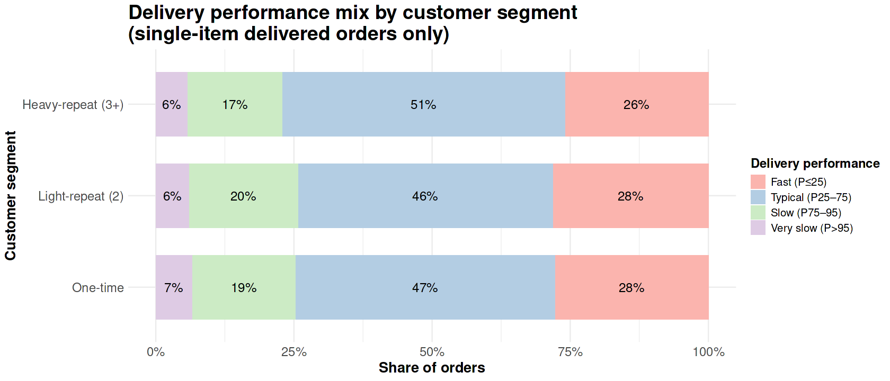
    


Across all three customer segments, the delivery profile is broadly stable, with most orders falling into:

> * Typical deliveries (2): about 46–51%  
> * Fast deliveries (1): about 26–28%  
> * Slow deliveries (3): about 17–20%  
> * Very slow deliveries (4): about 6% 

So the broad shape is similar across segments. 

Overall, heavy-repeat customers show a slightly more favorable delivery mix, mainly because they have a somewhat higher share of Typical deliveries and a somewhat lower share of Slow / Very slow outcomes. But the differences are small, not structural.

**The key point:**
Repeat customers do not appear to have a radically different delivery profile (though there are some small differences), but they do seem to experience slightly fewer poor delivery outcomes. However, heavy-repeat segment has a much smaller sample size, so I'd be careful to not over-interpret these small differences. 


```R
# Are repeat buyers "treated better" by logistics?:

delivery_friction <- delivery_perf_by_segment_single %>%
  mutate(
    delivery_group = case_when(
      delivery_performance %in% c(1, 2) ~ "Good delivery",
      delivery_performance %in% c(3, 4) ~ "Slow / delayed delivery")) %>%
  group_by(freq_segment, delivery_group) %>%
  summarise(
    orders_n = sum(orders_n), .groups = "drop") %>%
  group_by(freq_segment) %>%
  mutate(share = orders_n / sum(orders_n)) %>%
  ungroup()

ggplot(delivery_friction,
       aes(x = freq_segment, y = share, fill = delivery_group)) +
  geom_col(width = 0.7) +
  geom_text(
    aes(label = scales::percent(share, accuracy = 1)),
    position = position_stack(vjust = 0.5),
    size = 5) +
  coord_flip() +
  scale_y_continuous(labels = scales::percent_format()) +
  scale_fill_manual(
    values = c("#6FCF97", "#EB5757"),
    name = "Delivery experience") +
  labs(
    title = "Delivery friction rate by customer segment\n(single-item delivered orders only)",
    x = "Customer segment",
    y = "Share of orders") +
  theme_minimal() + 
  theme(
    plot.background  = element_rect(fill = "white", color = NA),
    panel.background = element_rect(fill = "white", color = NA),
    axis.text.x = element_text(size = 14),
    axis.text.y = element_text(size = 14),
    plot.title = element_text(size = 22, face = "bold"),
    axis.title.x = element_text(size = 16, face = "bold"),
    axis.title.y = element_text(size = 16, face = "bold"),
    legend.title = element_text(size = 14, face = "bold"),
    legend.text = element_text(size = 12))
```


    
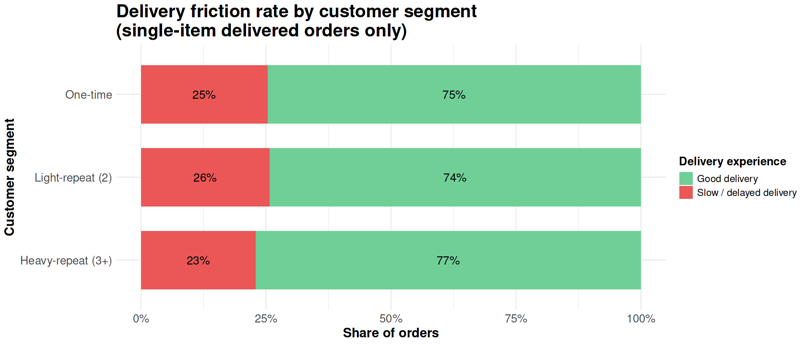
    


**Repeat customers experience slightly less delivery friction, but the gap is modest**

**Key findings:**

When the four delivery categories are collapsed into two broader groups:

* **Better delivery (Fast + Typical)**
> - One-time: 75%  
> - Light-repeat: 74%  
> - Heavy-repeat: 77%  

* **Slower / delayed delivery (Slow + Very slow)**
> - One-time: 25%  
> - Light-repeat: 26%  
> - Heavy-repeat: 23%  

🔹 This shows that heavy-repeat customers face somewhat less delivery friction than the other two groups, but the difference is only around 2–3 percentage points.

🔹 Light-repeat customers actually look slightly worse than one-time buyers on this collapsed measure, which reinforces the point, that the relationship is not strong or linear.

**Interpretation:**

The main pattern is not “repeat buyers are treated much better by logistics” The real pattern is weaker:

* Delivery quality is broadly similar across customer segments (because repeat customers experience delivery speeds similar to those of one-time buyers, faster delivery does not appear to be a strong differentiating factor, explaining repeat purchase behaviour in this dataset)
* This suggests that other factors — such as product assortment, pricing, or category preferences — may play a larger role in encouraging customers to return to the platform  
* Heavy-repeat customers have a slightly cleaner delivery profile  
* But the gap is too small to support a strong claim, that logistics is the primary driver of repeat purchase behaviour  

A more defensible conclusion would be that **poor delivery is not absent among repeat buyers**, and **good delivery alone does not clearly explain retention depth**.


**Operational implications:**

🔹 Although delivery speed may not strongly influence repeat behaviour, logistics performance still matters for overall customer experience.
🔹 Reducing the share of Slow and Very slow deliveries could still improve satisfaction across all customer segments and help maintain positive reviews and marketplace reputation.

---

### **Question 12: "How do customer review scores differ between one‑time, light‑repeat, and heavy‑repeat customers, and are higher review scores associated with higher repeat‑purchase behaviour?"**

Answering this question let me test whether happier customers (via reviews) are more likely to come back, and whether heavy‑repeat customers systematically rate their experiences better than one‑time buyers


```R
orders_reviews_seg <- order_review %>%
  select(order_id, review_score, review_creation_date, review_answer_timestamp, review_to_answer) %>%
  inner_join(orders_enriched %>% select(order_id, customer_unique_id), by = "order_id") %>%
  inner_join(customer_segments, by = "customer_unique_id")

review_mix_by_segment <- orders_reviews_seg %>%
  group_by(freq_segment, review_score) %>%
  summarise(reviews_n = n(), .groups = "drop") %>%
  group_by(freq_segment) %>%
  mutate(reviews_share_pct = round(reviews_n / sum(reviews_n) * 100, 2)) %>%
  ungroup() %>%
  arrange(freq_segment, desc(reviews_share_pct))

review_mix_by_segment

review_mix_for_plot <- review_mix_by_segment %>%
  mutate(freq_segment = factor(freq_segment, levels = c("One-time", "Light-repeat (2)", "Heavy-repeat (3+)")),
    review_score = factor(review_score, levels = c("very bad", "bad", "neutral", "good", "excellent")),
    share = reviews_share_pct / 100)  

options(repr.plot.width = 15, repr.plot.height = 4)

ggplot(review_mix_for_plot, aes(x = freq_segment, y = share, fill = review_score)) +
  geom_col(width = 0.4) +
  geom_text(aes(label = percent(share, accuracy = 1)), position = position_stack(vjust = 0.5), color = "black", size = 5) +
  scale_y_continuous(labels = percent_format(accuracy = 1)) +
  scale_fill_brewer(name = "Review score", palette = "Spectral") +
  coord_flip() +
  labs(title = "Review mix by customer segment", x = "Customer segment", y = "Share of reviews") +
  theme_minimal(base_size = 14, base_family = "Arial") +
  theme(
    plot.title = element_text(size = 22, face = "bold"),
    axis.title = element_text(size = 16, face = "bold"),
    axis.text = element_text(size = 14),
    legend.title = element_text(size = 14, face = "bold"),
    legend.text = element_text(size = 12))

response_time_by_cat <- orders_reviews_seg %>%
  filter(!is.na(review_to_answer)) %>%
  group_by(review_score) %>%
  summarise(n_reviews = n(),
    mean_days_to_reply = round(mean(review_to_answer), 2),
    median_days = median(review_to_answer), .groups = "drop")

response_time_by_cat
```


<table class="dataframe">
<caption>A tibble: 15 × 4</caption>
<thead>
	<tr><th scope=col>freq_segment</th><th scope=col>review_score</th><th scope=col>reviews_n</th><th scope=col>reviews_share_pct</th></tr>
	<tr><th scope=col>&lt;chr&gt;</th><th scope=col>&lt;chr&gt;</th><th scope=col>&lt;int&gt;</th><th scope=col>&lt;dbl&gt;</th></tr>
</thead>
<tbody>
	<tr><td>Heavy-repeat (3+)</td><td>excellent</td><td>  473</td><td>71.78</td></tr>
	<tr><td>Heavy-repeat (3+)</td><td>good     </td><td>   94</td><td>14.26</td></tr>
	<tr><td>Heavy-repeat (3+)</td><td>neutral  </td><td>   47</td><td> 7.13</td></tr>
	<tr><td>Heavy-repeat (3+)</td><td>very bad </td><td>   33</td><td> 5.01</td></tr>
	<tr><td>Heavy-repeat (3+)</td><td>bad      </td><td>   12</td><td> 1.82</td></tr>
	<tr><td>Light-repeat (2) </td><td>excellent</td><td> 2625</td><td>62.92</td></tr>
	<tr><td>Light-repeat (2) </td><td>good     </td><td>  764</td><td>18.31</td></tr>
	<tr><td>Light-repeat (2) </td><td>very bad </td><td>  355</td><td> 8.51</td></tr>
	<tr><td>Light-repeat (2) </td><td>neutral  </td><td>  320</td><td> 7.67</td></tr>
	<tr><td>Light-repeat (2) </td><td>bad      </td><td>  108</td><td> 2.59</td></tr>
	<tr><td>One-time         </td><td>excellent</td><td>52316</td><td>58.91</td></tr>
	<tr><td>One-time         </td><td>good     </td><td>17619</td><td>19.84</td></tr>
	<tr><td>One-time         </td><td>very bad </td><td> 8776</td><td> 9.88</td></tr>
	<tr><td>One-time         </td><td>neutral  </td><td> 7372</td><td> 8.30</td></tr>
	<tr><td>One-time         </td><td>bad      </td><td> 2731</td><td> 3.07</td></tr>
</tbody>
</table>


<table class="dataframe">
<caption>A tibble: 5 × 4</caption>
<thead>
	<tr><th scope=col>review_score</th><th scope=col>n_reviews</th><th scope=col>mean_days_to_reply</th><th scope=col>median_days</th></tr>
	<tr><th scope=col>&lt;chr&gt;</th><th scope=col>&lt;int&gt;</th><th scope=col>&lt;dbl&gt;</th><th scope=col>&lt;dbl&gt;</th></tr>
</thead>
<tbody>
	<tr><td>bad      </td><td> 2851</td><td>2.47</td><td>1</td></tr>
	<tr><td>excellent</td><td>55414</td><td>2.63</td><td>1</td></tr>
	<tr><td>good     </td><td>18477</td><td>2.54</td><td>1</td></tr>
	<tr><td>neutral  </td><td> 7739</td><td>2.40</td><td>1</td></tr>
	<tr><td>very bad </td><td> 9164</td><td>2.52</td><td>1</td></tr>
</tbody>
</table>


    
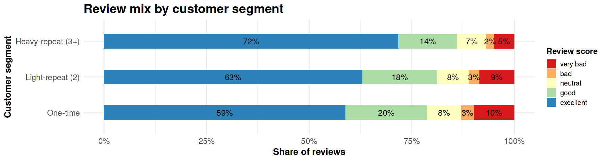
    


**Most of Olist customers leave excellent reviews across all segments, and repeat customers are slightly more positive than one‑time buyers**

* **Satisfaction level by segment** ➡︎ **one‑time** customers still show a majority of excellent reviews, at about 59% of their feedback  
* **Light‑repeat** customers have the highest share of excellent reviews at roughly 63%, indicating better overall satisfaction when customers come back  
* **Heavy‑repeat** customers remain very positive, with about 72% excellent and 14% good, and only a small tail of negative scores  

**Negative feedback pattern** ➡︎ share of **very bad** and **bad** reviews stays in the single digits for all customer segments, suggesting that severe dissatisfaction is rare, once the customer has received the order. One‑time buyers contribute the largest absolute volume of negative reviews, which is expected since they dominate total order volume  

**Seller response time vs review score** ➡︎ median seller response time is about 1 day for all categories, with mean response times clustered between roughly 2.4 and 2.6 days, so seller teams are reacting at a similar speed regardless of score

**Recomendations:** Since satisfaction is already high for repeat customer segments, focus on first‑time buyers with bad or very bad reviews, and try to win them back with targeted follow‑up and fixes.

The strong dominance of excellent reviews among heavy‑repeat customers supports using them for loyalty programs, referrals, or testimonials, as they appear to be Olist's most "enthusiastic" group.


### **Question 13: "How much revenue and profit do one‑time, light‑repeat, and heavy‑repeat customers generate, and does higher satisfaction (review score) translate into higher customer lifetime value?"**


```R
cust_revenue <- order_items %>%
  group_by(order_id) %>%
  summarise(order_total = sum(price + freight_value, na.rm = TRUE), .groups = "drop") %>%
  inner_join(orders_enriched %>% select(order_id, customer_unique_id), by = "order_id") %>%
  group_by(customer_unique_id) %>%
  summarise(total_revenue = sum(order_total, na.rm = TRUE), orders_n = n_distinct(order_id), .groups = "drop") %>%
  inner_join(customer_segments, by = "customer_unique_id")

cust_reviews <- order_review %>%
  inner_join(orders_enriched %>% select(order_id, customer_unique_id), by = "order_id") %>%
  group_by(customer_unique_id) %>%
  summarise(most_recent_score = review_score[which.max(review_creation_date)], .groups = "drop")

cust_value_reviews <- cust_revenue %>%
  inner_join(cust_reviews, by = "customer_unique_id")

segment_review_value <- cust_value_reviews %>%
  group_by(freq_segment, most_recent_score) %>%
  summarise(
    customers_n = n(),
    avg_orders = mean(orders_n),
    avg_revenue = mean(total_revenue),
    median_revenue = median(total_revenue),
    revenue_share_pct = round(
      sum(total_revenue) / sum(cust_value_reviews$total_revenue) * 100, 2), .groups = "drop") %>%
  arrange(freq_segment, desc(avg_revenue))

segment_review_value
cat("\n\n")
options(repr.plot.width = 16, repr.plot.height = 10)

ggplot(segment_review_value, aes(x = freq_segment, y = avg_revenue, fill = most_recent_score)) +
  geom_col(position = position_dodge(width = 0.7), width = 0.7) +
  geom_text(aes(label = round(avg_revenue, 0)), position = position_dodge(width = 0.7),  
    vjust = 0.5, hjust = 1.1, color = "black", size = 5) +
  coord_flip() +
  labs(title = "Average customer revenue by segment and review score", x = "Customer segment", y = "Average revenue per customer (R$)") +
  scale_fill_brewer(palette = "Spectral", name = "Most recent score") +
  theme_minimal(base_size = 16, base_family = "Arial") +
  theme(
    plot.title  = element_text(size = 22, face = "bold"),
    axis.title  = element_text(size = 16, face = "bold"),
    axis.text   = element_text(size = 14),
    legend.title = element_text(size = 14, face = "bold"),
    legend.text  = element_text(size = 12))
```


<table class="dataframe">
<caption>A tibble: 15 × 7</caption>
<thead>
	<tr><th scope=col>freq_segment</th><th scope=col>most_recent_score</th><th scope=col>customers_n</th><th scope=col>avg_orders</th><th scope=col>avg_revenue</th><th scope=col>median_revenue</th><th scope=col>revenue_share_pct</th></tr>
	<tr><th scope=col>&lt;chr&gt;</th><th scope=col>&lt;chr&gt;</th><th scope=col>&lt;int&gt;</th><th scope=col>&lt;dbl&gt;</th><th scope=col>&lt;dbl&gt;</th><th scope=col>&lt;dbl&gt;</th><th scope=col>&lt;dbl&gt;</th></tr>
</thead>
<tbody>
	<tr><td>Heavy-repeat (3+)</td><td>bad      </td><td>    2</td><td>4.000000</td><td>658.3700</td><td>658.370</td><td> 0.01</td></tr>
	<tr><td>Heavy-repeat (3+)</td><td>good     </td><td>   31</td><td>3.354839</td><td>647.2042</td><td>519.240</td><td> 0.13</td></tr>
	<tr><td>Heavy-repeat (3+)</td><td>very bad </td><td>   13</td><td>3.153846</td><td>642.5408</td><td>532.440</td><td> 0.06</td></tr>
	<tr><td>Heavy-repeat (3+)</td><td>neutral  </td><td>   17</td><td>3.529412</td><td>531.2671</td><td>295.570</td><td> 0.06</td></tr>
	<tr><td>Heavy-repeat (3+)</td><td>excellent</td><td>  156</td><td>3.442308</td><td>469.5572</td><td>379.490</td><td> 0.49</td></tr>
	<tr><td>Light-repeat (2) </td><td>bad      </td><td>   64</td><td>2.015625</td><td>339.0105</td><td>255.325</td><td> 0.14</td></tr>
	<tr><td>Light-repeat (2) </td><td>very bad </td><td>  178</td><td>2.011236</td><td>338.6205</td><td>273.630</td><td> 0.40</td></tr>
	<tr><td>Light-repeat (2) </td><td>neutral  </td><td>  156</td><td>2.006410</td><td>311.8585</td><td>223.655</td><td> 0.32</td></tr>
	<tr><td>Light-repeat (2) </td><td>excellent</td><td> 1337</td><td>2.005236</td><td>299.8239</td><td>219.930</td><td> 2.67</td></tr>
	<tr><td>Light-repeat (2) </td><td>good     </td><td>  360</td><td>2.011111</td><td>259.3719</td><td>213.265</td><td> 0.62</td></tr>
	<tr><td>One-time         </td><td>very bad </td><td> 8736</td><td>1.004579</td><td>195.5514</td><td>122.130</td><td>11.39</td></tr>
	<tr><td>One-time         </td><td>bad      </td><td> 2724</td><td>1.001468</td><td>169.7539</td><td>110.895</td><td> 3.08</td></tr>
	<tr><td>One-time         </td><td>excellent</td><td>52234</td><td>1.001340</td><td>157.6236</td><td>103.725</td><td>54.90</td></tr>
	<tr><td>One-time         </td><td>good     </td><td>17599</td><td>1.000739</td><td>155.7268</td><td>103.200</td><td>18.27</td></tr>
	<tr><td>One-time         </td><td>neutral  </td><td> 7360</td><td>1.001495</td><td>151.5996</td><td>103.365</td><td> 7.44</td></tr>
</tbody>
</table>


    
    
    


    
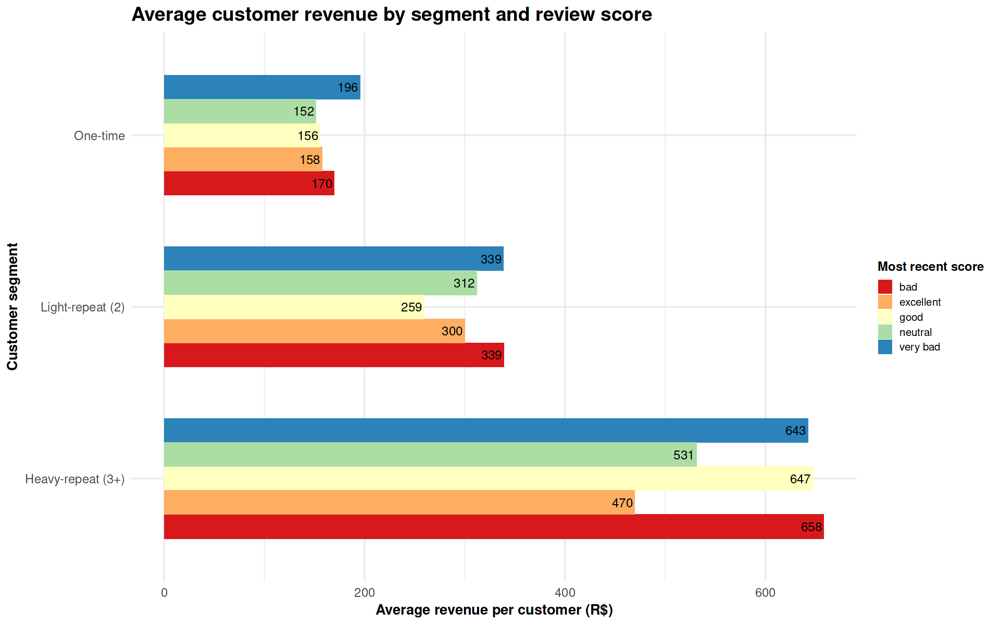
    


* Customer lifetime value is driven primarily by purchase frequency, not satisfaction alone  
* Heavy‑repeat customers generate far more revenue per person than one‑time or light‑repeat customers, and this holds even when their most recent review is negative
* Higher satisfaction amplifies value within repeat segments, but does not compensate for low frequency among one-time buyers
* Revenue is highly concentrated: a small group of satisfied heavy-repeat customers contributes a disproportionate share of total GMV

#### Revenue contribution by segment:
<br>   

**One-time customers**:
> Average revenue per customer is low and flat (~R$150–200) across all review scores, reflecting a single-purchase "ceiling"  
> Satisfaction without a second purchase has limited economic impact  

**Light-repeat**:
> Average revenue rises to ~R$260–340, roughly 2x one-time customers, confirming a clear step‑up in value as customers move from one‑time to multi‑order behaviour  
> Review score matters more here, but differences remain moderate
> This segment represents the highest leverage point for moving customers up the value curve  

**Heavy-repeat**:
> Average revenue jumps to ~R$600 per customer
> Customers with worse recent reviews have higher observed CLV, while excellent reviews correspond to lower average revenue  
> Although numerically small, this segment captures a disproportionate share of revenue  

**Key insights** ➡︎ 
1. Repeat behavior is the primary driver of customer value: moving customers from one-time to repeat status creates substantially more value than improving satisfaction within the one-time segment  
2. High value does not imply high satisfaction among heavy-repeat customers: heavy-repeat customers generate the highest revenue even when their most recent reviews are neutral or negative, indicating that purchasing behavior and short-term satisfaction are partially decoupled at high usage levels
3. Retention risk is concentrated in a small, high-impact group: heavy-repeat customers with bad or very bad reviews are few in number but economically critical; proactive service recovery for this group should be prioritized, as losing even a small fraction would materially impact revenue


### **Question 14: "Among customers with different review scores, which groups are most likely to churn (not place another order), and how does this vary between one‑time, light‑repeat, and heavy‑repeat segments?"**  

In order to answer this question, I need to define **churn window**. I will base this value on days between orders for **light** and **heavy** users (this would be a behaviour‑based approach and more realistic than picking just an arbitrary fixed window):

- I will use 75th percentile of the **days between orders** distribution for light & heavy customers (not a MAX days cutoff, because it is driven by outliers; not an average or median, because this approach will cut-off slower, but still healthy customers). P75 captures behaviour of **most** active customers.

- I also have a hypothesis to test ➜ customers are more tolerant of delays when shipping costs are low. When freight represents a large share of the order value, late deliveries might trigger a steep increase in low reviews. 


```R
cust_orders <- orders %>%
  inner_join(orders_enriched %>% select(order_id, customer_unique_id), by = "order_id") %>%
  inner_join(customer_segments, by = "customer_unique_id") %>%
  filter(order_status == "delivered") %>%
  mutate(order_date = as_date(order_purchase_timestamp)) %>%
  arrange(customer_unique_id, order_date)

intervals_repeat <- cust_orders %>%
  filter(freq_segment %in% c("Light-repeat (2)", "Heavy-repeat (3+)")) %>%
  group_by(customer_unique_id, freq_segment) %>%
  mutate(days_to_next = as.numeric(lead(order_date) - order_date)) %>%
  filter(!is.na(days_to_next)) %>%
  ungroup()

p75_gap <- quantile(intervals_repeat$days_to_next, probs = 0.75, na.rm = TRUE)

churn_window_days <- as.numeric(p75_gap)  
cat("Churn window:", churn_window_days, "days since the last order (P75 of days-between-orders for light and heavy repeat customers).\n")
cat("\n\n")

cust_orders_churn <- cust_orders %>%
  group_by(customer_unique_id) %>%
  mutate(next_order_date = lead(order_date), days_to_next = as.numeric(next_order_date - order_date),
    churn_flag = if_else(is.na(next_order_date) | days_to_next > churn_window_days, 1L, 0L)) %>%
  ungroup()

last_orders <- cust_orders_churn %>%
  group_by(customer_unique_id) %>%
  slice_max(order_date, n = 1, with_ties = FALSE) %>%
  ungroup()

cust_last_review <- order_review %>%
  inner_join(orders_enriched %>% select(order_id, customer_unique_id), by = "order_id") %>%
  group_by(customer_unique_id) %>%
  slice_max(review_creation_date, n = 1, with_ties = FALSE) %>%
  ungroup() %>%
  select(customer_unique_id, most_recent_score = review_score)

churn_base <- last_orders %>%
  select(customer_unique_id, churn_flag) %>%
  inner_join(customer_segments, by = "customer_unique_id") %>%
  inner_join(cust_last_review, by = "customer_unique_id")

churn_summary <- churn_base %>%
  group_by(freq_segment, most_recent_score) %>%
  summarise(customers_n = n(), churn_rate_pct = round(mean(churn_flag) * 100, 2), .groups = "drop") %>%
  arrange(freq_segment, desc(churn_rate_pct))

churn_summary
cat("\n\n")
ggplot(churn_summary, aes(x = freq_segment, y = churn_rate_pct, fill = most_recent_score)) +
  geom_col(position = position_dodge(width = 0.8), width = 0.7) +
  geom_text(aes(label = paste0(churn_rate_pct, "%")), position = position_dodge(width = 0.8), vjust = 0.5, hjust  = 1.15, size = 5) +
  coord_flip() +
  labs(title = "Churn rate by segment and most recent review score", x = "Customer segment", y = "Churn rate (%)") +
  scale_fill_brewer(palette = "Spectral", name = "Most recent score") +
  theme_minimal(base_size = 14, base_family = "Arial") +
  theme(
    plot.title = element_text(size = 22, face = "bold"),
    axis.title = element_text(size = 16, face = "bold"),
    axis.text = element_text(size = 14),
    legend.title = element_text(size = 14, face = "bold"),
    legend.text = element_text(size = 12))
```

    Churn window: 121 days since the last order (P75 of days-between-orders for light and heavy repeat customers).
    
    
    


<table class="dataframe">
<caption>A tibble: 15 × 4</caption>
<thead>
	<tr><th scope=col>freq_segment</th><th scope=col>most_recent_score</th><th scope=col>customers_n</th><th scope=col>churn_rate_pct</th></tr>
	<tr><th scope=col>&lt;chr&gt;</th><th scope=col>&lt;chr&gt;</th><th scope=col>&lt;int&gt;</th><th scope=col>&lt;dbl&gt;</th></tr>
</thead>
<tbody>
	<tr><td>Heavy-repeat (3+)</td><td>bad      </td><td>    2</td><td>100.00</td></tr>
	<tr><td>Heavy-repeat (3+)</td><td>good     </td><td>   31</td><td> 87.10</td></tr>
	<tr><td>Heavy-repeat (3+)</td><td>very bad </td><td>   13</td><td> 84.62</td></tr>
	<tr><td>Heavy-repeat (3+)</td><td>excellent</td><td>  156</td><td> 81.41</td></tr>
	<tr><td>Heavy-repeat (3+)</td><td>neutral  </td><td>   17</td><td> 76.47</td></tr>
	<tr><td>Light-repeat (2) </td><td>excellent</td><td> 1337</td><td> 85.56</td></tr>
	<tr><td>Light-repeat (2) </td><td>good     </td><td>  360</td><td> 82.22</td></tr>
	<tr><td>Light-repeat (2) </td><td>neutral  </td><td>  156</td><td> 82.05</td></tr>
	<tr><td>Light-repeat (2) </td><td>very bad </td><td>  178</td><td> 80.34</td></tr>
	<tr><td>Light-repeat (2) </td><td>bad      </td><td>   64</td><td> 73.44</td></tr>
	<tr><td>One-time         </td><td>bad      </td><td> 2724</td><td>100.00</td></tr>
	<tr><td>One-time         </td><td>excellent</td><td>52234</td><td>100.00</td></tr>
	<tr><td>One-time         </td><td>good     </td><td>17599</td><td>100.00</td></tr>
	<tr><td>One-time         </td><td>neutral  </td><td> 7360</td><td>100.00</td></tr>
	<tr><td>One-time         </td><td>very bad </td><td> 8736</td><td>100.00</td></tr>
</tbody>
</table>


    
    
    


    

    


The 121‑day window is quite strict for this marketplace: even many heavy‑repeat customers do not place another order within four months, so they are flagged as churned under my churn window definition

**Churn risk is structurally high across all segments, weakly correlated with satisfaction, and most economically dangerous among heavy-repeat customers despite their small numbers.**

- One-time customers are structurally churned (by definition): they place one order and never cross the second-purchase threshold within the churn window. Their review score has zero predictive power for retention.

- **Repeat customers churn heavily, even when satisfied**: Light-repeat churn rates remain very high: ~73–86%, even among customers with excellent reviews. Heavy-repeat churn rates are similarly elevated: ~76–87% for neutral to excellent scores. **Customer satisfaction alone does not ensure continued purchasing. Repeat behavior on Olist is episodic, not habitual**

- **Review score is a weak churn predictor among repeat customers**: differences in churn rates by review score are quite logical (worse reviews → somewhat higher churn), but the gaps are modest: heavy‑repeat churn only shifts from around the mid‑70s to high‑80s across review categories, and light‑repeat churn stays in a similarly narrow band.

Bottom line: churn on Olist is primarily a structural and temporal phenomenon, not a satisfaction problem.
The biggest value unlock lies in engineering the second and third purchase, not in polishing already-completed experiences.


Because the current 121‑day window classifies most customers as churned, it blurs the line between truly lost customers and those on long but normal purchase cycles. To better separate structurally infrequent buyers from genuinely lost ones, testing longer windows (for example MAX) would sharpen churn identification and highlight customers who are still realistically recoverable.


```R
cust_orders <- orders %>%
  inner_join(orders_enriched %>% select(order_id, customer_unique_id), by = "order_id") %>%
  inner_join(customer_segments, by = "customer_unique_id") %>%
  filter(order_status == "delivered") %>%
  mutate(order_date = as_date(order_purchase_timestamp)) %>%
  arrange(customer_unique_id, order_date)

intervals_repeat <- cust_orders %>%
  filter(freq_segment %in% c("Light-repeat (2)", "Heavy-repeat (3+)")) %>%
  group_by(customer_unique_id, freq_segment) %>%
  mutate(days_to_next = as.numeric(lead(order_date) - order_date)) %>%
  filter(!is.na(days_to_next)) %>%
  ungroup()

max_gap <- max(intervals_repeat$days_to_next, na.rm = TRUE)

churn_window_days <- as.numeric(max_gap)
cat("Churn window:", churn_window_days, "days since the last order (maximum observed gap between orders for light- and heavy-repeat customers).\n")

cat("\n\n")

cust_orders_churn <- cust_orders %>%
  group_by(customer_unique_id) %>%
  mutate(
    next_order_date = lead(order_date),
    days_to_next = as.numeric(next_order_date - order_date),
    churn_flag = if_else(is.na(next_order_date) | days_to_next > churn_window_days, 1L, 0L)) %>%
  ungroup()

last_orders <- cust_orders_churn %>%
  group_by(customer_unique_id) %>%
  slice_max(order_date, n = 1, with_ties = FALSE) %>%
  ungroup()

cust_last_review <- order_review %>%
  inner_join(
    orders_enriched %>% select(order_id, customer_unique_id), by = "order_id") %>%
  group_by(customer_unique_id) %>%
  slice_max(review_creation_date, n = 1, with_ties = FALSE) %>%
  ungroup() %>%
  select(customer_unique_id, most_recent_score = review_score)

churn_base <- last_orders %>%
  select(customer_unique_id, churn_flag) %>%
  inner_join(customer_segments, by = "customer_unique_id") %>%
  inner_join(cust_last_review, by = "customer_unique_id")

churn_summary <- churn_base %>%
  group_by(freq_segment, most_recent_score) %>%
  summarise(customers_n = n(), churn_rate_pct = round(mean(churn_flag) * 100, 2), .groups = "drop") %>%
  mutate(freq_segment = factor(freq_segment, levels = c("One-time", "Light-repeat (2)", "Heavy-repeat (3+)")),
    most_recent_score = factor(most_recent_score, levels = c("very bad", "bad", "neutral", "good", "excellent"))) %>%
  arrange(freq_segment, most_recent_score)

churn_summary
cat("\n\n")

dodge <- position_dodge(width = 0.8)

ggplot(churn_summary, aes(x = freq_segment, y = churn_rate_pct, fill = most_recent_score)) +
  geom_col(position = dodge, width = 0.7) +
  geom_text(aes(label = paste0(churn_rate_pct, "%")), position = dodge, vjust = 0.5, hjust = 1.15, size = 5, color = "black") +
  coord_flip() +
  labs(title = "Churn rate by segment and most recent review score", x = "Customer segment", y = "Churn rate (%)") +
  scale_fill_brewer(palette = "Spectral", name = "Most recent score") +
  theme_minimal(base_size = 14, base_family = "Arial") +
  theme(
    plot.title  = element_text(size = 22, face = "bold"),
    axis.title  = element_text(size = 16, face = "bold"),
    axis.text   = element_text(size = 14),
    legend.title = element_text(size = 16, face = "bold"),
    legend.text  = element_text(size = 14))
```

    Churn window: 583 days since the last order (maximum observed gap between orders for light- and heavy-repeat customers).
    
    
    


<table class="dataframe">
<caption>A tibble: 15 × 4</caption>
<thead>
	<tr><th scope=col>freq_segment</th><th scope=col>most_recent_score</th><th scope=col>customers_n</th><th scope=col>churn_rate_pct</th></tr>
	<tr><th scope=col>&lt;fct&gt;</th><th scope=col>&lt;fct&gt;</th><th scope=col>&lt;int&gt;</th><th scope=col>&lt;dbl&gt;</th></tr>
</thead>
<tbody>
	<tr><td>One-time         </td><td>very bad </td><td> 8736</td><td>100.00</td></tr>
	<tr><td>One-time         </td><td>bad      </td><td> 2724</td><td>100.00</td></tr>
	<tr><td>One-time         </td><td>neutral  </td><td> 7360</td><td>100.00</td></tr>
	<tr><td>One-time         </td><td>good     </td><td>17599</td><td>100.00</td></tr>
	<tr><td>One-time         </td><td>excellent</td><td>52234</td><td>100.00</td></tr>
	<tr><td>Light-repeat (2) </td><td>very bad </td><td>  178</td><td> 80.34</td></tr>
	<tr><td>Light-repeat (2) </td><td>bad      </td><td>   64</td><td> 73.44</td></tr>
	<tr><td>Light-repeat (2) </td><td>neutral  </td><td>  156</td><td> 82.05</td></tr>
	<tr><td>Light-repeat (2) </td><td>good     </td><td>  360</td><td> 82.22</td></tr>
	<tr><td>Light-repeat (2) </td><td>excellent</td><td> 1337</td><td> 85.56</td></tr>
	<tr><td>Heavy-repeat (3+)</td><td>very bad </td><td>   13</td><td> 84.62</td></tr>
	<tr><td>Heavy-repeat (3+)</td><td>bad      </td><td>    2</td><td>100.00</td></tr>
	<tr><td>Heavy-repeat (3+)</td><td>neutral  </td><td>   17</td><td> 76.47</td></tr>
	<tr><td>Heavy-repeat (3+)</td><td>good     </td><td>   31</td><td> 87.10</td></tr>
	<tr><td>Heavy-repeat (3+)</td><td>excellent</td><td>  156</td><td> 81.41</td></tr>
</tbody>
</table>


    
    
    


    
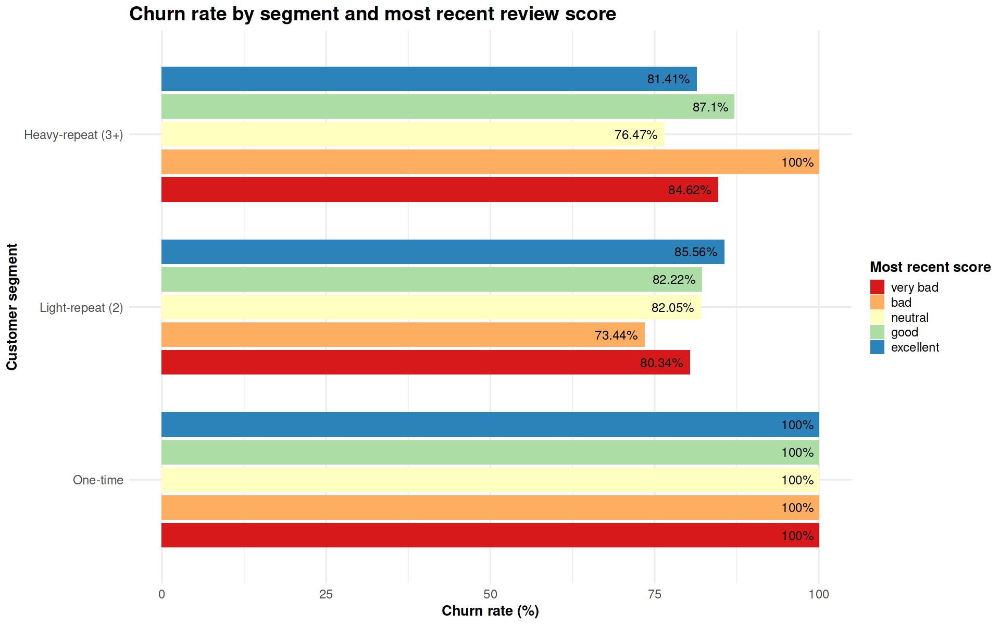
    


Using the max gap instead of P75 barely changes the story: churn still looks extremely high, and review scores remain a weak churn signal, but the max‑based window is even more forgiving for a few heavy‑repeat customers.

**Light-repeat customers**: P75 already produced high churn rates (~73–86%); the max‑based window leaves these rates virtually unchanged by review category, still sitting in the low‑70s to mid‑80s. The ordering by review score is still intuitive (worse reviews ≈ slightly higher churn), but the differences are small and do not materially alter the retention picture compared with P75.

**Heavy-repeat customers**: For heavy-repeat customers, churn rates under P75-rule were roughly mid‑70s to mid‑80s for neutral to excellent scores; with the max window they shift only slightly but remain high (around 76–87% across review categories).

The only visible change is that a tiny “bad” subgroup (2 customers) flips between “almost all churned” and “fully churned”; this is not analytically meaningful and reflects sample size, not a real behavioural shift.

**Overall conclusion** ➜ moving from a P75‑based to a MAX‑gap churn window does not materially change segment‑level churn rates or the weak relationship between review score and churn; both definitions say churn is structurally high and only mildly moderated by satisfaction

Because the max window is driven by rare long gaps, it is less statistically robust, than my previous P75-based rule, and adds little insight, so the P75‑based window remains the more defensible definition.


### **Question 15: "Which operational factors (delivery delays, freight cost, payment type and seller performance) have the strongest impact on review scores and revenue, and where are the biggest opportunities to improve margin without hurting satisfaction?"** 

* I have a hypothesis, I want to check: are customers more tolerant of delays, when shipping costs are low? (when freight price represents a large share of the order value, late deliveries trigger a steep increase in low reviews?)

#### Restricting the analysis to single-item orders

For this question, I am going to restrict the operational analysis to **single-item delivered orders** in order to preserve a clean and interpretable order-level structure.

This is important because the key outcome variables in the analysis — **delivery delay** and **review score** — are both observed at the **order level**, not at the item level. In multi-item orders, the same review score and the same delivery outcome are shared across all items in the order, even when the order contains different products and, in some cases, different sellers.

As a result, multi-item orders introduce unavoidable ambiguity: it is not possible to determine, whether a low review reflects dissatisfaction with one specific item, the full order experience, the seller communication, the delivery, or some combination of these factors. Using such orders in item-level operational comparisons would therefore require assumptions, that the data cannot support.

Restricting the analysis to **single-item orders** removes this ambiguity. Each order then corresponds to:
> - one item  
> - one seller 
> - one delivery outcome  
> - one review score

This creates a cleaner analytical base for testing how operational factors such as delivery delay, freight burden, payment structure, and seller-level execution relate to customer satisfaction and order value, without introducing unsupported attribution assumptions.

I can use `single_item_delivered_orders` dataframe created earlier in the analysis.

To define **delivery delays**, in this analysis I will treat **order_estimated_delivery_date** as the promised delivery date and measure delays as the difference between this estimate and the actual delivery date, then bucket that difference into delay categories.


```R
# defining common delay levels:

delay_levels <- c(">=3 days early", "early/on time", "1–3 days late", ">3 days late")


# re-mapping order review labels back to numeric score:

order_review_clean <- order_review %>%
  mutate(
    review_score_num = case_when(
      review_score == "very bad" ~ 1,
      review_score == "bad" ~ 2,
      review_score == "neutral" ~ 3,
      review_score == "good" ~ 4,
      review_score == "excellent" ~ 5))


# delivered_orders: estimated delivery vs actual delivery: 

delivered_orders_delay <- delivered_orders %>%
  mutate(delay_vs_eta = as.numeric(
      difftime(order_delivered_customer_date, order_estimated_delivery_date, units = "days")))


# Building clean single-item ops core ops table:

orders_ops_single <- single_item_delivered_orders %>%
  inner_join(
    delivered_orders_delay %>%
      select(order_id, delay_vs_eta, price, freight_value, seller_id),
    by = "order_id") %>%
  inner_join(
    order_payments %>%
      group_by(order_id) %>%
      summarise(
        max_installments = max(payment_installments, na.rm = TRUE),
        main_payment_type = first(payment_type),
        total_payment_value = sum(payment_value, na.rm = TRUE), .groups = "drop"),
    by = "order_id") %>%
  inner_join(
    order_review_clean %>%
      select(order_id, review_score, review_score_num),
    by = "order_id")


# Sanity check for correct granularity (must be one row per order):

orders_ops_single %>%
  summarise(
    rows = n(),
    distinct_orders = n_distinct(order_id))


# Adding buckets and derived fields:

orders_ops_buckets <- orders_ops_single %>%
  mutate(
    delay_bucket = case_when(
      delay_vs_eta <= -3 ~ ">=3 days early",
      delay_vs_eta > -3 & delay_vs_eta <= 0 ~ "early/on time",
      delay_vs_eta > 0 & delay_vs_eta <= 3 ~ "1–3 days late",
      delay_vs_eta > 3 ~ ">3 days late",
      TRUE ~ NA_character_),
    delay_bucket = factor(delay_bucket, levels = delay_levels),

    freight_pct = if_else(
      price > 0,
      (freight_value / price) * 100,
      NA_real_),

    freight_pct_bucket = case_when(
      freight_pct <= 5 ~ "<=5%",
      freight_pct > 5 & freight_pct <= 10 ~ "5–10%",
      freight_pct > 10 & freight_pct <= 20 ~ "10–20%",
      freight_pct > 20 ~ ">20%",
      TRUE ~ "unknown"),

    installments_bucket = case_when(
      max_installments <= 1 ~ "1",
      max_installments <= 3 ~ "2–3",
      max_installments <= 6 ~ "4–6",
      max_installments > 6 ~ "7+",
      TRUE ~ "unknown"))

# Sanity check again:
orders_ops_buckets %>%
  summarise(
    rows = n(),
    distinct_orders = n_distinct(order_id))

# Summary by delay & payment type:

ops_summary <- orders_ops_buckets %>%
  group_by(delay_bucket, main_payment_type) %>%
  summarise(
    orders_n = n(),
    avg_review = round(mean(review_score_num, na.rm = TRUE), 2),
    share_low_1_2 = round(mean(review_score_num <= 2, na.rm = TRUE) * 100, 2),
    avg_revenue = round(mean(price + freight_value, na.rm = TRUE), 2),
    avg_freight = round(mean(freight_value, na.rm = TRUE), 2),
    avg_installment = round(mean(max_installments, na.rm = TRUE), 2),
    .groups = "drop") %>%
  group_by(delay_bucket) %>%
  mutate(
    pct_orders = round(100 * orders_n / sum(orders_n), 2)) %>%
  ungroup() %>%
  arrange(delay_bucket, desc(avg_review))

# Summary by delay & freight burden:

delay_freight_summary <- orders_ops_buckets %>%
  filter(!is.na(review_score_num)) %>%
  group_by(delay_bucket, freight_pct_bucket) %>%
  summarise(
    orders_n = n(),
    avg_review = round(mean(review_score_num, na.rm = TRUE), 2),
    share_low_1_2 = round(mean(review_score_num <= 2, na.rm = TRUE) * 100, 2),
    .groups = "drop") %>%
  arrange(delay_bucket, freight_pct_bucket)

# Plot data:

mean_delay <- orders_ops_buckets %>%
  group_by(delay_bucket) %>%
  summarise(
    avg_review = round(mean(review_score_num, na.rm = TRUE), 2),
    .groups = "drop")

low_delay <- orders_ops_buckets %>%
  group_by(delay_bucket) %>%
  summarise(
    share_low_1_2 = round(mean(review_score_num <= 2, na.rm = TRUE) * 100, 2), .groups = "drop") %>%
  mutate(
    delay_bucket = factor(
      delay_bucket,
      levels = c(">3 days late", "1–3 days late", "early/on time", ">=3 days early")))

# Plots:

plot1 <- ggplot(mean_delay, aes(x = delay_bucket, y = avg_review, group = 1)) +
  geom_col(fill = "#4b9dd2") +
  geom_text(aes(label = avg_review), vjust = 1.5, color = "white", size = 5) +
  labs(
    title = "Average review score by delivery delay",
    subtitle = "Single-item delivered clean orders | Delay defined vs estimated delivery date (ETA)",
    x = "Delivery delay bucket",
    y = "Average review score (1–5)") +
  theme_minimal(base_size = 14, base_family = "Arial") +
  theme(
    plot.title = element_text(face = "bold", size = 22),
    plot.subtitle = element_text(size = 16, color = "gray30"),
    axis.title.x = element_text(size = 16, face = "bold", margin = margin(t = 10)),
    axis.title.y = element_text(size = 16, face = "bold", margin = margin(r = 10)),
    axis.text.x = element_text(size = 15, angle = 20, hjust = 1),
    panel.grid.minor = element_blank())

plot2 <- ggplot(low_delay, aes(x = delay_bucket, y = share_low_1_2)) +
  geom_col(fill = "#4b9dd2") +
  geom_text(aes(label = paste0(share_low_1_2, "%")), vjust = 1.5, size = 5, color = "white") +
  labs(
    title = "Share of low reviews (1–2) by delivery delay",
    subtitle = "Single-item delivered clean orders | Delay defined vs estimated delivery date (ETA)",
    x = "Delivery delay bucket",
    y = "Share of 1–2 star reviews (%)") +
  theme_minimal(base_size = 14, base_family = "Arial") +
  theme(
    plot.title = element_text(face = "bold", size = 22),
    plot.subtitle = element_text(size = 16, color = "gray30"),
    axis.title.x = element_text(size = 16, face = "bold", margin = margin(t = 10)),
    axis.title.y = element_text(size = 16, face = "bold", margin = margin(r = 10)),
    axis.text.x = element_text(size = 15),
    panel.grid.minor = element_blank())

plot3 <- ggplot(
  delay_freight_summary,
  aes(x = delay_bucket, y = share_low_1_2, fill = freight_pct_bucket)) +
  geom_col(position = "dodge") +
  geom_text(
    aes(label = paste0(round(share_low_1_2, 0), "%")),
    position = position_dodge(width = 0.9),
    vjust = 1.5,
    size = 5,
    color = "black") +
  scale_fill_brewer(palette = "Spectral") +
  labs(
    title = "Low-review share by delivery delay and freight burden",
    subtitle = "Single-item delivered clean orders | Does expensive shipping make lateness hurt more?",
    x = "Delivery delay vs ETA",
    y = "Share of 1–2 star reviews (%)",
    fill = "Freight as % of item value") +
  theme_minimal(base_size = 14) +
  theme(
    plot.title = element_text(face = "bold", size = 22),
    plot.subtitle = element_text(size = 15, color = "gray30"),
    axis.text.x = element_text(size = 15),
    panel.grid.minor = element_blank())

# Payment & installments:

pay_summary <- orders_ops_buckets %>%
  group_by(main_payment_type, installments_bucket) %>%
  summarise(
    orders_n = n(),
    avg_review = round(mean(review_score_num, na.rm = TRUE), 2),
    share_low_1_2 = round(mean(review_score_num <= 2, na.rm = TRUE) * 100, 2),
    avg_total = round(mean(price + freight_value, na.rm = TRUE), 2),
    .groups = "drop")

pay_summary
```


<table class="dataframe">
<caption>A tibble: 1 × 2</caption>
<thead>
	<tr><th scope=col>rows</th><th scope=col>distinct_orders</th></tr>
	<tr><th scope=col>&lt;int&gt;</th><th scope=col>&lt;int&gt;</th></tr>
</thead>
<tbody>
	<tr><td>84218</td><td>84218</td></tr>
</tbody>
</table>


<table class="dataframe">
<caption>A tibble: 1 × 2</caption>
<thead>
	<tr><th scope=col>rows</th><th scope=col>distinct_orders</th></tr>
	<tr><th scope=col>&lt;int&gt;</th><th scope=col>&lt;int&gt;</th></tr>
</thead>
<tbody>
	<tr><td>84218</td><td>84218</td></tr>
</tbody>
</table>


<table class="dataframe">
<caption>A tibble: 10 × 6</caption>
<thead>
	<tr><th scope=col>main_payment_type</th><th scope=col>installments_bucket</th><th scope=col>orders_n</th><th scope=col>avg_review</th><th scope=col>share_low_1_2</th><th scope=col>avg_total</th></tr>
	<tr><th scope=col>&lt;chr&gt;</th><th scope=col>&lt;chr&gt;</th><th scope=col>&lt;int&gt;</th><th scope=col>&lt;dbl&gt;</th><th scope=col>&lt;dbl&gt;</th><th scope=col>&lt;dbl&gt;</th></tr>
</thead>
<tbody>
	<tr><td>boleto     </td><td>1  </td><td>16627</td><td>4.21</td><td>11.10</td><td>129.71</td></tr>
	<tr><td>credit_card</td><td>1  </td><td>21528</td><td>4.26</td><td>10.27</td><td> 93.76</td></tr>
	<tr><td>credit_card</td><td>2–3</td><td>19316</td><td>4.20</td><td>11.32</td><td>128.93</td></tr>
	<tr><td>credit_card</td><td>4–6</td><td>13469</td><td>4.19</td><td>11.77</td><td>173.28</td></tr>
	<tr><td>credit_card</td><td>7+ </td><td> 9630</td><td>4.18</td><td>12.67</td><td>333.08</td></tr>
	<tr><td>debit_card </td><td>1  </td><td> 1307</td><td>4.27</td><td>10.18</td><td>133.10</td></tr>
	<tr><td>voucher    </td><td>1  </td><td> 2046</td><td>4.17</td><td>12.37</td><td>103.51</td></tr>
	<tr><td>voucher    </td><td>2–3</td><td>  158</td><td>4.01</td><td>15.82</td><td>181.28</td></tr>
	<tr><td>voucher    </td><td>4–6</td><td>   87</td><td>4.43</td><td> 4.60</td><td>178.06</td></tr>
	<tr><td>voucher    </td><td>7+ </td><td>   50</td><td>4.08</td><td>14.00</td><td>375.91</td></tr>
</tbody>
</table>


```R
cat("1. Average Review by Delivery Delay\n")
cat("----------------------------------------\n\n")
options(repr.plot.width = 10, repr.plot.height = 6)
print(plot1)
```

    1. Average Review by Delivery Delay
    ----------------------------------------
    
    


    
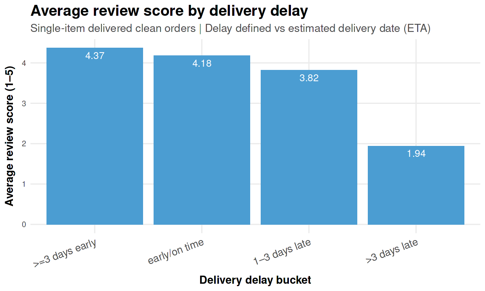
    


```R
cat("2. Share of low reviews (1-2) by delay\n")
cat("----------------------------------------\n\n")
options(repr.plot.width = 10, repr.plot.height = 6)
print(plot2)
```

    2. Share of low reviews (1-2) by delay
    ----------------------------------------
    
    


    
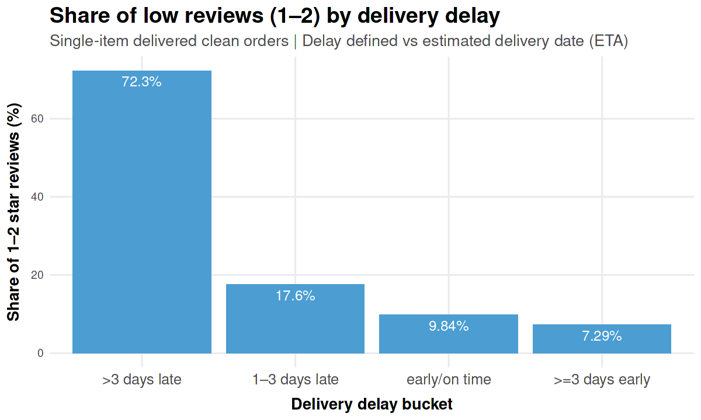
    


```R
cat("3. Delay vs Freight interaction\n")
cat("----------------------------------------\n\n")
options(repr.plot.width = 14, repr.plot.height = 8)
print(plot3)
```

    3. Delay vs Freight interaction
    ----------------------------------------
    
    


    
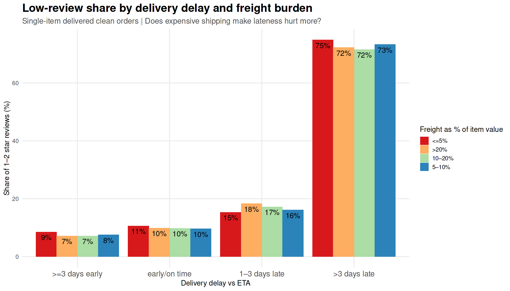
    


## Part 1: Key findings summary

### Delivery delay ➡︎ by far the strongest driver

Delivery delay is the most damaging operational factor for customer satisfaction in this analysis — much more than freight burden or payment structure.

The pattern is very clear:

- **>=3 days early** → **4.37 avg review** | **7.29% low reviews (1–2 stars)**
- **early/on time** → **4.18 avg review** | **9.84% low reviews**
- **1–3 days late** → **3.82 avg review** | **17.6% low reviews**
- **>3 days late** → **1.94 avg review** | **72.3% low reviews**

So once delivery becomes **seriously late**, satisfaction falls off a cliff.

That means the real break point is not small lateness - it is **severe lateness**.  
Moving from on-time / early delivery to **>3 days late** creates a swing of roughly **62–65 percentage points** in low-review share. That is enormous.

### My hypothesis ➡︎ rejected

My initial idea was that customers might be **less tolerant of delays when freight cost is high** - in other words, if shipping already feels expensive, then lateness might hurt even more.

That did **not** show up in the data: within each delay bucket, **low-review shares stay pretty similar across freight-burden groups**.

Most importantly, inside the **>3 days late** bucket, low-review rates are brutal no matter what the freight share looks like:

- **<=5% freight** → **75%** low reviews
- **5–10% freight** → **73%**
- **10–20% freight** → **72%**
- **>20% freight** → **72%**

Same story in the better-performing buckets:

- **>=3 days early** → around **7–9%** low reviews across freight groups
- **early/on time** → around **10–11%**
- **1–3 days late** → around **15–18%**

So the conclusion here is simple: **delay bucket predicts satisfaction; freight burden barely changes the story.**


### Freight cost ➡︎ much weaker than delay

This does **not** mean freight cost never matters.  
It means that in this analysis, **freight burden is a much weaker satisfaction signal, than delivery timing**.

Customers seem willing to tolerate different shipping-cost levels **as long as the order arrives roughly when expected**. But once an order is **seriously late**, the review penalty is massive, regardless of whether freight was cheap or expensive.

So if the question is "What hurts satisfaction more — expensive shipping or late delivery?" - the answer is clearly: **late delivery, by a mile.**

### Payment type & installments ➡︎ weak effect compared with delay

Payment structure looks much less important than delivery timing.

Delay creates a huge review swing:

- from **4.37** for very early deliveries
- down to **1.94** for orders **>3 days late**

That is a collapse of more than **2.4 review points** on a 1–5 scale.

By comparison, payment type and installment structure may show some variation, but nothing close to that magnitude.

So the practical takeaway is:

> - **delivery reliability** is a major satisfaction lever  
> - **payment flexibility** is not a major satisfaction lever  
> - **freight discounts** are also not a strong satisfaction lever if delivery timing stays the same  

#### Bottom line -> If the goal is to improve customer satisfaction, the strongest operational priority is clear: 
**reduce serious lateness.**

> ! Not small differences in shipping cost   
> ! Not payment configuration tweaks  
> ! Not installment flexibility  

The biggest damage happens, when orders arrive **more than 3 days after the promised date**. That is where customer sentiment really breaks.

### Important scope note

This analysis is based on **single-item delivered clean orders only**.

That restriction was intentional. Delivery delay and review score are both observed at the **order level**, and for multi-item orders it is impossible to tell whether a bad review reflects one item, the whole order, the seller, the delivery experience, or some combination of those. Restricting to single-item orders gives a cleaner and more defensible link between operational factors and customer response.

### Interim takeaway

For the satisfaction side of Question 15, the evidence points strongly in one direction: **late delivery is the main operational problem.**


```R
# Sellers' stats:

seller_perf <- orders_ops_buckets %>%
  group_by(seller_id) %>%
  summarise(
    seller_orders_n = n(),
    avg_delay = mean(delay_vs_eta, na.rm = TRUE),
    share_late = mean(delay_vs_eta > 0, na.rm = TRUE) * 100,
    .groups = "drop")


seller_perf %>%
  summarise(
    sellers = n(),
    min_orders = min(seller_orders_n, na.rm = TRUE),
    median_orders = median(seller_orders_n, na.rm = TRUE),
    max_orders = max(seller_orders_n, na.rm = TRUE))
```


<table class="dataframe">
<caption>A tibble: 1 × 4</caption>
<thead>
	<tr><th scope=col>sellers</th><th scope=col>min_orders</th><th scope=col>median_orders</th><th scope=col>max_orders</th></tr>
	<tr><th scope=col>&lt;int&gt;</th><th scope=col>&lt;int&gt;</th><th scope=col>&lt;int&gt;</th><th scope=col>&lt;int&gt;</th></tr>
</thead>
<tbody>
	<tr><td>2863</td><td>1</td><td>6</td><td>1571</td></tr>
</tbody>
</table>


I can see, that the seller distribution is very uneven. So if I bucket sellers by lateness without any minimum-order threshold, those "tiny" sellers will introduce noise.

As a next step, I will define a mimimum seller volume threshold. 


```R
# Filtering out meaningful seller cohort:

seller_perf_filtered <- seller_perf %>%
  filter(seller_orders_n >= 30)

seller_perf_filtered %>%
  summarise(
    sellers_kept = n(),
    min_orders = min(seller_orders_n, na.rm = TRUE),
    median_orders = median(seller_orders_n, na.rm = TRUE),
    max_orders = max(seller_orders_n, na.rm = TRUE))

seller_perf %>%
  summarise(total_orders = sum(seller_orders_n, na.rm = TRUE))

seller_perf_filtered %>%
  summarise(filtered_orders = sum(seller_orders_n, na.rm = TRUE))
```


<table class="dataframe">
<caption>A tibble: 1 × 4</caption>
<thead>
	<tr><th scope=col>sellers_kept</th><th scope=col>min_orders</th><th scope=col>median_orders</th><th scope=col>max_orders</th></tr>
	<tr><th scope=col>&lt;int&gt;</th><th scope=col>&lt;int&gt;</th><th scope=col>&lt;int&gt;</th><th scope=col>&lt;int&gt;</th></tr>
</thead>
<tbody>
	<tr><td>563</td><td>30</td><td>64</td><td>1571</td></tr>
</tbody>
</table>


<table class="dataframe">
<caption>A tibble: 1 × 1</caption>
<thead>
	<tr><th scope=col>total_orders</th></tr>
	<tr><th scope=col>&lt;int&gt;</th></tr>
</thead>
<tbody>
	<tr><td>84218</td></tr>
</tbody>
</table>


<table class="dataframe">
<caption>A tibble: 1 × 1</caption>
<thead>
	<tr><th scope=col>filtered_orders</th></tr>
	<tr><th scope=col>&lt;int&gt;</th></tr>
</thead>
<tbody>
	<tr><td>68840</td></tr>
</tbody>
</table>


After testing various thresholds, I have ended up applying `>=30`:
> * sellers with fewer than 30 orders are too noisy for reliable lateness-rate comparisons  
> * seller-level operational risk should be assessed only where there is enough volume for the percentage to mean something

With this filter I still keep:

> * 563 sellers  
> * 68840 orders out of 84218  
> * that is about 81.7% of all orders  

This way a lot of unstable tiny sellers are removed, but the subset still has a strong enough coverage:

- enough seller history to make lateness rates meaningful  
- still preserves the large majority of the order base 


```R
orders_ops_seller <- orders_ops_buckets %>%
  inner_join(
    seller_perf_filtered,
    by = "seller_id")

orders_ops_seller %>%
  summarise(
    rows = n(),
    distinct_orders = n_distinct(order_id),
    distinct_sellers = n_distinct(seller_id))

# "Bucketing" sellers by lateness rate

seller_buckets <- orders_ops_seller %>%
  mutate(
    seller_delay_bucket = case_when(
      share_late <= 10 ~ "<=10% late",
      share_late > 10 & share_late <= 25 ~ "10–25% late",
      share_late > 25 & share_late <= 50 ~ "25–50% late",
      share_late > 50 ~ ">50% late",
      TRUE ~ NA_character_),
    seller_delay_bucket = factor(
      seller_delay_bucket,
      levels = c("<=10% late", "10–25% late", "25–50% late", ">50% late"))
  ) %>%
  group_by(seller_delay_bucket) %>%
  summarise(
    orders_n = n(),
    avg_review = round(mean(review_score_num, na.rm = TRUE), 2),
    share_low_1_2 = round(mean(review_score_num <= 2, na.rm = TRUE) * 100, 2),
    avg_total = round(mean(price + freight_value, na.rm = TRUE), 2),
    .groups = "drop")

cat("Seller lateness buckets\n")
cat(rep("-", 13), "\n\n")
seller_buckets
```


<table class="dataframe">
<caption>A tibble: 1 × 3</caption>
<thead>
	<tr><th scope=col>rows</th><th scope=col>distinct_orders</th><th scope=col>distinct_sellers</th></tr>
	<tr><th scope=col>&lt;int&gt;</th><th scope=col>&lt;int&gt;</th><th scope=col>&lt;int&gt;</th></tr>
</thead>
<tbody>
	<tr><td>68840</td><td>68840</td><td>563</td></tr>
</tbody>
</table>


    Seller lateness buckets
    - - - - - - - - - - - - - 
    
    


<table class="dataframe">
<caption>A tibble: 3 × 5</caption>
<thead>
	<tr><th scope=col>seller_delay_bucket</th><th scope=col>orders_n</th><th scope=col>avg_review</th><th scope=col>share_low_1_2</th><th scope=col>avg_total</th></tr>
	<tr><th scope=col>&lt;fct&gt;</th><th scope=col>&lt;int&gt;</th><th scope=col>&lt;dbl&gt;</th><th scope=col>&lt;dbl&gt;</th><th scope=col>&lt;dbl&gt;</th></tr>
</thead>
<tbody>
	<tr><td>&lt;=10% late </td><td>45606</td><td>4.27</td><td> 9.79</td><td>136.26</td></tr>
	<tr><td>10–25% late</td><td>22810</td><td>4.08</td><td>14.44</td><td>142.54</td></tr>
	<tr><td>25–50% late</td><td>  424</td><td>3.46</td><td>29.48</td><td>136.10</td></tr>
</tbody>
</table>


### Key findings: Seller performance ➡︎ meaningful background risk factor

Seller-level lateness also matters for customer satisfaction, although its effect is weaker, than the direct impact of a specific order arriving late.

A clear gradient appears across seller lateness buckets:

- **<=10% late sellers** → **4.27 avg review** | **9.79% low reviews**
- **10–25% late sellers** → **4.08 avg review** | **14.44% low reviews**
- **25–50% late sellers** → **3.46 avg review** | **29.48% low reviews**

So as seller lateness increases, customer satisfaction steadily worsens.

This suggests, that seller operational reliability is a meaningful background risk factor: sellers with a history of late deliveries tend to generate lower reviews overall.

At the same time, the effect is still smaller, than the penalty of direct order-level delay. Earlier results showed, that orders delivered **>3 days late** produce **72.3% low reviews**, which is far more damaging, than seller-level lateness alone.

### Interpretation

Seller quality clearly matters, but mostly as a **risk amplifier**, not the main shock.

Simply speaking:

- **direct delivery delay on the order itself** is the strongest driver of dissatisfaction
- **seller-level chronic lateness** is a useful secondary warning signal
- **freight burden and payment structure** remain much weaker in comparison

This means there is a real operational opportunity in identifying and improving sellers with persistently poor delivery reliability, especially those with enough order volume to make their lateness profile stable and meaningful.

---

### Reframing seller performance: final delivery delay vs seller-controlled processing

At first glance, it seems natural to identify “late sellers” using the share of orders delivered after the promised customer delivery date. However, that is not the cleanest seller-performance metric.

The reason is that **final delivery delay** (`delay_vs_eta`) reflects the full downstream logistics chain, not just seller execution. It combines:

- seller processing time
- carrier pickup timing
- transportation and route effects
- final-mile delivery performance

So a seller can appear associated with late deliveries, even when the operational bottleneck happens after the package has already been handed to the carrier.

Because of this, seller-level late-delivery share is better interpreted as a **customer-facing outcome measure**, than as a pure seller-accountability metric.

A more appropriate way to evaluate seller operational performance would be to focus on the part of the process the seller can actually influence more directly: **processing time before carrier hand-off**. In this project, that is better captured by metrics such as:

- **approval_to_carrier time**
- or whether a seller’s approval-to-carrier time exceeds the overall platform’s pre-defined threshold (e.g. **P90 processing threshold**)

This approach would provide a cleaner signal of seller-side execution.

That said, even seller processing speed should not be judged without context. Different sellers may operate under different business models and product constraints. For example:

> - sellers of stocked, standard products should generally hand off quickly  
> - sellers of bulky, customized, or made-to-order products may naturally require longer preparation time  

So the next analytical step is not only to identify sellers with slow processing, but also to understand **what categories they sell**. This will help separate:

- sellers with genuinely weak operational discipline
from
- sellers whose longer processing time may reflect category-specific fulfillment realities

### Revised interpretation

So for this question:

- **delivery delay vs ETA** remains the right metric for analyzing **customer satisfaction**
- but for identifying **seller-side operational risk**, a more meaningful approach is to analyze **seller processing time before carrier hand-off**
- and to interpret that processing time together with **product category context**
- I will not restrict analysis only to **delivered** orders, but to all statuses, since an order review can be associated with other non-final statuses.

This makes the seller analysis more operationally fair and much more actionable.


```R
# Step 1: I am going to re-build a clean base table
# structural cohort: single-item + single-seller + all order_status:

item_count_by_order <- order_items %>%
  group_by(order_id) %>%
  summarise(
    item_count = n(),
    seller_count = n_distinct(seller_id),
    seller_id = first(seller_id),
    order_price = sum(price, na.rm = TRUE),
    order_freight = sum(freight_value, na.rm = TRUE),
    .groups = "drop"
  )

orders_base_single <- orders %>%
  inner_join(item_count_by_order, by = "order_id") %>%
  filter(item_count == 1, seller_count == 1) %>%
  mutate(
    order_total = order_price + order_freight
  ) %>%
  inner_join(
    order_review_clean %>%
      select(order_id, review_score, review_score_num),
    by = "order_id"
  )

orders_base_single_reviewed <- orders_base_single %>%
  filter(!is.na(review_score_num))

orders_base_single_reviewed %>%
  summarise(
    rows = n(),
    distinct_orders = n_distinct(order_id),
    distinct_sellers = n_distinct(seller_id)
  )

orders_base_single_reviewed %>%
  count(order_status, sort = TRUE)

```


<table class="dataframe">
<caption>A tibble: 1 × 3</caption>
<thead>
	<tr><th scope=col>rows</th><th scope=col>distinct_orders</th><th scope=col>distinct_sellers</th></tr>
	<tr><th scope=col>&lt;int&gt;</th><th scope=col>&lt;int&gt;</th><th scope=col>&lt;int&gt;</th></tr>
</thead>
<tbody>
	<tr><td>87341</td><td>87341</td><td>2987</td></tr>
</tbody>
</table>


<table class="dataframe">
<caption>A tibble: 7 × 2</caption>
<thead>
	<tr><th scope=col>order_status</th><th scope=col>n</th></tr>
	<tr><th scope=col>&lt;chr&gt;</th><th scope=col>&lt;int&gt;</th></tr>
</thead>
<tbody>
	<tr><td>delivered  </td><td>85445</td></tr>
	<tr><td>shipped    </td><td>  958</td></tr>
	<tr><td>canceled   </td><td>  398</td></tr>
	<tr><td>invoiced   </td><td>  276</td></tr>
	<tr><td>processing </td><td>  258</td></tr>
	<tr><td>unavailable</td><td>    5</td></tr>
	<tr><td>approved   </td><td>    1</td></tr>
</tbody>
</table>


Now I need to tighten my logic and be careful - I want to look at all order statuses, but non-delivered ones will have a different set of logistics timestamps


```R
orders_base_single_reviewed_ops <- orders_base_single_reviewed %>%
  mutate(
    delay_vs_eta = as.numeric(
      difftime(order_delivered_customer_date, order_estimated_delivery_date, units = "days")
    ),
    approval_to_carrier_days = as.numeric(
      difftime(order_delivered_carrier_date, order_approved_at, units = "days")
    )
  )

# checking missingness & scope:

orders_base_single_reviewed_ops %>%
  summarise(
    rows = n(),
    distinct_orders = n_distinct(order_id),
    non_missing_delay_vs_eta = sum(!is.na(delay_vs_eta)),
    non_missing_approval_to_carrier = sum(!is.na(approval_to_carrier_days)),
    has_approval_n = sum(has_approval == 1, na.rm = TRUE),
    delivery_timestamp_complete_n = sum(delivery_timestamp_is_complete == 1, na.rm = TRUE),
    timeline_valid_n = sum(timeline_is_valid == 1, na.rm = TRUE)
  )
```


<table class="dataframe">
<caption>A tibble: 1 × 7</caption>
<thead>
	<tr><th scope=col>rows</th><th scope=col>distinct_orders</th><th scope=col>non_missing_delay_vs_eta</th><th scope=col>non_missing_approval_to_carrier</th><th scope=col>has_approval_n</th><th scope=col>delivery_timestamp_complete_n</th><th scope=col>timeline_valid_n</th></tr>
	<tr><th scope=col>&lt;int&gt;</th><th scope=col>&lt;int&gt;</th><th scope=col>&lt;int&gt;</th><th scope=col>&lt;int&gt;</th><th scope=col>&lt;int&gt;</th><th scope=col>&lt;int&gt;</th><th scope=col>&lt;int&gt;</th></tr>
</thead>
<tbody>
	<tr><td>87341</td><td>87341</td><td>85442</td><td>86452</td><td>87328</td><td>85442</td><td>84223</td></tr>
</tbody>
</table>


For the broader review analysis, I keep reviewed single-item single-seller orders across all statuses. However, seller-processing time can only be measured for the subset of orders, where **both: approval and carrier hand-off timestamps exist**. The seller P90 offender analysis is therefore based on this narrower measurable-processing cohort, not on all reviewed orders.


```R
seller_processing_base <- orders_base_single_reviewed_ops %>%
  filter(
    has_approval == 1,
    !is.na(order_approved_at),
    !is.na(order_delivered_carrier_date),
    !is.na(approval_to_carrier_days)
  ) %>%
  select(
    order_id,
    seller_id,
    order_status,
    review_score_num,
    order_total,
    approval_to_carrier_days
  )

seller_processing_base %>%
  summarise(
    rows = n(),
    distinct_orders = n_distinct(order_id),
    distinct_sellers = n_distinct(seller_id))

seller_processing_base %>%
  count(order_status, sort = TRUE)
```


<table class="dataframe">
<caption>A tibble: 1 × 3</caption>
<thead>
	<tr><th scope=col>rows</th><th scope=col>distinct_orders</th><th scope=col>distinct_sellers</th></tr>
	<tr><th scope=col>&lt;int&gt;</th><th scope=col>&lt;int&gt;</th><th scope=col>&lt;int&gt;</th></tr>
</thead>
<tbody>
	<tr><td>86452</td><td>86452</td><td>2880</td></tr>
</tbody>
</table>


<table class="dataframe">
<caption>A tibble: 3 × 2</caption>
<thead>
	<tr><th scope=col>order_status</th><th scope=col>n</th></tr>
	<tr><th scope=col>&lt;chr&gt;</th><th scope=col>&lt;int&gt;</th></tr>
</thead>
<tbody>
	<tr><td>delivered</td><td>85430</td></tr>
	<tr><td>shipped  </td><td>  958</td></tr>
	<tr><td>canceled </td><td>   64</td></tr>
</tbody>
</table>


My seller-processing base now contains:

- 86K distinct orders (at proper grain)
- 2880 sellers

...with the following status mix:

> - 85430 delivered  
> - 958 shipped  
> - 64 canceled  

So this is not literally all statuses anymore (**NOT all reviewed single-item single-seller orders**), it is **reviewed single-item single-seller orders with measurable approval-to-carrier time**, but that is fine — because this subset is defined by whether seller processing time can actually be measured.

Next step: computing the platform-wide P90 threshold for approval_to_carrier_days.


```R
approval_to_carrier_p90 <- quantile(
  seller_processing_base$approval_to_carrier_days,
  probs = 0.90,
  na.rm = TRUE,
  type = 7)

approval_to_carrier_p90

# Establishing P90 threshold:

seller_processing_base <- seller_processing_base %>%
  mutate(
    slow_processed_p90 = approval_to_carrier_days > 5.91938888888889)

seller_processing_seller <- seller_processing_base %>%
  group_by(seller_id) %>%
  summarise(
    seller_orders_n = n(),
    slow_processed_orders_n = sum(slow_processed_p90, na.rm = TRUE),
    slow_processing_rate_pct = 100 * slow_processed_orders_n / seller_orders_n,
    avg_approval_to_carrier_days = mean(approval_to_carrier_days, na.rm = TRUE),
    avg_review = mean(review_score_num, na.rm = TRUE),
    share_low_1_2 = 100 * mean(review_score_num <= 2, na.rm = TRUE),
    avg_order_total = mean(order_total, na.rm = TRUE),
    .groups = "drop")

seller_processing_seller %>%
  summarise(
    sellers = n(),
    min_orders = min(seller_orders_n, na.rm = TRUE),
    median_orders = median(seller_orders_n, na.rm = TRUE),
    max_orders = max(seller_orders_n, na.rm = TRUE))
```


<strong>90%:</strong> 5.91938888888889


<table class="dataframe">
<caption>A tibble: 1 × 4</caption>
<thead>
	<tr><th scope=col>sellers</th><th scope=col>min_orders</th><th scope=col>median_orders</th><th scope=col>max_orders</th></tr>
	<tr><th scope=col>&lt;int&gt;</th><th scope=col>&lt;int&gt;</th><th scope=col>&lt;dbl&gt;</th><th scope=col>&lt;int&gt;</th></tr>
</thead>
<tbody>
	<tr><td>2880</td><td>1</td><td>6</td><td>1644</td></tr>
</tbody>
</table>


```R
# Filtering for sellers with 30+ orders:

seller_processing_seller_30 <- seller_processing_seller %>%
  filter(seller_orders_n >= 30)

seller_processing_seller_30 %>%
  summarise(
    sellers_kept = n(),
    min_orders = min(seller_orders_n, na.rm = TRUE),
    median_orders = median(seller_orders_n, na.rm = TRUE),
    max_orders = max(seller_orders_n, na.rm = TRUE))

seller_processing_seller %>%
  summarise(total_orders = sum(seller_orders_n, na.rm = TRUE))

seller_processing_seller_30 %>%
  summarise(filtered_orders = sum(seller_orders_n, na.rm = TRUE))
```


<table class="dataframe">
<caption>A tibble: 1 × 4</caption>
<thead>
	<tr><th scope=col>sellers_kept</th><th scope=col>min_orders</th><th scope=col>median_orders</th><th scope=col>max_orders</th></tr>
	<tr><th scope=col>&lt;int&gt;</th><th scope=col>&lt;int&gt;</th><th scope=col>&lt;int&gt;</th><th scope=col>&lt;int&gt;</th></tr>
</thead>
<tbody>
	<tr><td>575</td><td>30</td><td>65</td><td>1644</td></tr>
</tbody>
</table>


<table class="dataframe">
<caption>A tibble: 1 × 1</caption>
<thead>
	<tr><th scope=col>total_orders</th></tr>
	<tr><th scope=col>&lt;int&gt;</th></tr>
</thead>
<tbody>
	<tr><td>86452</td></tr>
</tbody>
</table>


<table class="dataframe">
<caption>A tibble: 1 × 1</caption>
<thead>
	<tr><th scope=col>filtered_orders</th></tr>
	<tr><th scope=col>&lt;int&gt;</th></tr>
</thead>
<tbody>
	<tr><td>70946</td></tr>
</tbody>
</table>


Using `>=30 orders` "filter" allows me to keep ca. 82% of the processing-measurable cohort (575 sellers, ca. 71K orders).

Now I will identify the actual "offenders": 
> * 30+ measurable orders
> * I will compute their **slow processing rate**
> * rank the worst sellers


```R
top_20_processing_offenders <- seller_processing_seller_30 %>%
  arrange(desc(slow_processing_rate_pct), desc(avg_order_total)) %>%
  select(
    seller_id,
    seller_orders_n,
    slow_processed_orders_n,
    slow_processing_rate_pct,
    avg_approval_to_carrier_days,
    avg_review,
    share_low_1_2,
    avg_order_total) %>%
  slice_head(n = 20) %>%
  mutate(
    slow_processing_rate_pct = round(slow_processing_rate_pct, 1),
    avg_approval_to_carrier_days = round(avg_approval_to_carrier_days, 2),
    avg_review = round(avg_review, 2),
    share_low_1_2 = round(share_low_1_2, 1),
    avg_order_total = round(avg_order_total, 2))

top_20_processing_offenders

# population summary:

seller_processing_seller_30 %>%
  summarise(
    avg_slow_processing_rate = round(mean(slow_processing_rate_pct, na.rm = TRUE), 2),
    median_slow_processing_rate = round(median(slow_processing_rate_pct, na.rm = TRUE), 2),
    max_slow_processing_rate = round(max(slow_processing_rate_pct, na.rm = TRUE), 2))
```


<table class="dataframe">
<caption>A tibble: 20 × 8</caption>
<thead>
	<tr><th scope=col>seller_id</th><th scope=col>seller_orders_n</th><th scope=col>slow_processed_orders_n</th><th scope=col>slow_processing_rate_pct</th><th scope=col>avg_approval_to_carrier_days</th><th scope=col>avg_review</th><th scope=col>share_low_1_2</th><th scope=col>avg_order_total</th></tr>
	<tr><th scope=col>&lt;chr&gt;</th><th scope=col>&lt;int&gt;</th><th scope=col>&lt;int&gt;</th><th scope=col>&lt;dbl&gt;</th><th scope=col>&lt;dbl&gt;</th><th scope=col>&lt;dbl&gt;</th><th scope=col>&lt;dbl&gt;</th><th scope=col>&lt;dbl&gt;</th></tr>
</thead>
<tbody>
	<tr><td>66e0557ecc2b4dbea057e93f215f68d8</td><td> 30</td><td> 30</td><td>100.0</td><td>17.93</td><td>4.03</td><td>13.3</td><td>420.95</td></tr>
	<tr><td>17f51e7198701186712e53a39c564617</td><td> 49</td><td> 48</td><td> 98.0</td><td>11.98</td><td>4.35</td><td>10.2</td><td>941.10</td></tr>
	<tr><td>5058e8c1e82653974541e83690655b4a</td><td> 49</td><td> 45</td><td> 91.8</td><td>15.40</td><td>3.37</td><td>26.5</td><td>167.43</td></tr>
	<tr><td>7c67e1448b00f6e969d365cea6b010ab</td><td>756</td><td>670</td><td> 88.6</td><td>11.31</td><td>3.64</td><td>21.7</td><td>184.43</td></tr>
	<tr><td>cee48807215b30a12ca2ca10ffb5f250</td><td> 34</td><td> 30</td><td> 88.2</td><td>12.24</td><td>3.91</td><td>17.6</td><td>208.42</td></tr>
	<tr><td>6fd52c528dcb38be2eea044946b811f8</td><td> 56</td><td> 45</td><td> 80.4</td><td>13.71</td><td>3.34</td><td>37.5</td><td>109.71</td></tr>
	<tr><td>a7f13822ceb966b076af67121f87b063</td><td> 64</td><td> 50</td><td> 78.1</td><td>10.61</td><td>3.23</td><td>32.8</td><td>191.89</td></tr>
	<tr><td>213b25e6f54661939f11710a6fddb871</td><td>105</td><td> 82</td><td> 78.1</td><td> 8.68</td><td>4.12</td><td>12.4</td><td>117.07</td></tr>
	<tr><td>835f0f7810c76831d6c7d24c7a646d4d</td><td> 36</td><td> 28</td><td> 77.8</td><td>10.00</td><td>3.42</td><td>27.8</td><td>131.25</td></tr>
	<tr><td>2eb70248d66e0e3ef83659f71b244378</td><td>173</td><td>126</td><td> 72.8</td><td>11.07</td><td>2.75</td><td>48.6</td><td>214.57</td></tr>
	<tr><td>93dc87703c046b603023e75222018b45</td><td> 31</td><td> 22</td><td> 71.0</td><td> 8.46</td><td>3.97</td><td>16.1</td><td>256.22</td></tr>
	<tr><td>4917cee8d902e13428c3ec4b1ca6f315</td><td> 31</td><td> 21</td><td> 67.7</td><td> 7.98</td><td>4.16</td><td>12.9</td><td>199.30</td></tr>
	<tr><td>9baf5cb77970f539089d09a38bcec5c3</td><td> 30</td><td> 20</td><td> 66.7</td><td> 8.40</td><td>4.40</td><td> 6.7</td><td>213.31</td></tr>
	<tr><td>db2956745b3a8e9f3785c99f34b5d25e</td><td> 44</td><td> 28</td><td> 63.6</td><td> 6.78</td><td>3.86</td><td>18.2</td><td>204.10</td></tr>
	<tr><td>ad781527c93d00d89a11eecd9dcad7c1</td><td> 34</td><td> 20</td><td> 58.8</td><td>12.24</td><td>3.29</td><td>35.3</td><td>215.10</td></tr>
	<tr><td>2089a6d640999f9b9141ac719b2af596</td><td> 37</td><td> 21</td><td> 56.8</td><td> 8.16</td><td>4.03</td><td>21.6</td><td>209.97</td></tr>
	<tr><td>8444e55c1f13cd5c179851e5ca5ebd00</td><td> 83</td><td> 45</td><td> 54.2</td><td>10.86</td><td>3.46</td><td>30.1</td><td>254.59</td></tr>
	<tr><td>a2e874074c877c5a05abae80ad6e488f</td><td> 39</td><td> 21</td><td> 53.8</td><td>11.00</td><td>4.23</td><td> 7.7</td><td>218.91</td></tr>
	<tr><td>dd7ddc04e1b6c2c614352b383efe2d36</td><td> 93</td><td> 50</td><td> 53.8</td><td> 6.82</td><td>4.01</td><td>16.1</td><td> 92.64</td></tr>
	<tr><td>54965bbe3e4f07ae045b90b0b8541f52</td><td> 64</td><td> 34</td><td> 53.1</td><td>14.32</td><td>3.17</td><td>40.6</td><td>162.10</td></tr>
</tbody>
</table>


<table class="dataframe">
<caption>A tibble: 1 × 3</caption>
<thead>
	<tr><th scope=col>avg_slow_processing_rate</th><th scope=col>median_slow_processing_rate</th><th scope=col>max_slow_processing_rate</th></tr>
	<tr><th scope=col>&lt;dbl&gt;</th><th scope=col>&lt;dbl&gt;</th><th scope=col>&lt;dbl&gt;</th></tr>
</thead>
<tbody>
	<tr><td>10.6</td><td>3.47</td><td>100</td></tr>
</tbody>
</table>


### Seller processing offenders ➡︎ a small tail of sellers creates outsized operational risk

Using the platform-wide **P90 approval-to-carrier threshold** (**~ 5.92 days**), I flagged orders with unusually slow seller processing and then calculated, for each seller, the share of measurable single-seller orders above that threshold.

Among sellers with at least **30 measurable orders**, the overall picture is quite skewed:

- **median slow-processing rate:** **3.47%**
- **average slow-processing rate:** **10.6%**

So most sellers are not extreme offenders. The problem is concentrated in a smaller tail of sellers with very high slow-processing rates.

The top offender list shows some very severe cases:

- one seller has **100%** of measurable orders above the P90 threshold
- ranked next has **98%**
- one especially important high-volume seller has **756 orders**, with **88.6%** of them slow-processed

This matters because some offenders are not just slow — they are also commercially meaningful.

For example, some sellers combine:

- high slow-processing rates
- substantial order volume
- lower review scores
- elevated low-review shares
- moderate to high average order values

That makes them strong candidates for operational intervention.

At the same time, the list should **not** be interpreted as a pure “bad seller” ranking yet.

Some sellers are extremely slow-processed but still maintain relatively decent review scores or high order values. That suggests category context may matter: certain sellers may handle products, that naturally require longer preparation times, such as specialized, bulky, or less standardized goods.

🔹 This offender list is best treated as an **investigation shortlist**, not a final blame list.

It tells:

- which sellers are far slower than the platform norm
- which of them matter most in terms of order volume and revenue
- which sellers may be creating avoidable customer dissatisfaction

The next step is to examine **what categories these sellers actually sell**, so that slow processing can be interpreted relative to fulfillment context, and not just in isolation.


```R
# Getting sellers-"offenders" list:

offender_sellers <- top_20_processing_offenders %>%
  select(seller_id) %>%
  distinct()

cat("\n\n")
cat("\nTop 20 offender sellers list: unique seller IDs from the top slow-processing offender list\n")
offender_sellers

# Building and sanity-checking seller-category base:

seller_category_base <- seller_processing_base %>%
  inner_join(
    order_items %>%
      select(order_id, seller_id, product_category),
    by = c("order_id", "seller_id"))

cat("\nSeller-category sanity check to confirm whether joining product categories back to the processing base preserved order grain\n")


seller_category_base %>%
  summarise(
    rows = n(),
    distinct_orders = n_distinct(order_id),
    distinct_sellers = n_distinct(seller_id))

# How many categories each "offender" seller sells?:

offender_category_counts <- seller_category_base %>%
  semi_join(offender_sellers, by = "seller_id") %>%
  group_by(seller_id) %>%
  summarise(
    category_count = n_distinct(product_category),
    .groups = "drop"
  ) %>%
  arrange(desc(category_count))

cat("\n\n")
cat("How many distinct product categories each slow-processing offender sells (low cat count -> category concentration; high -> broader assortment).\n")
offender_category_counts

# Category mix per "offender":

offender_category_mix <- seller_category_base %>%
  semi_join(offender_sellers, by = "seller_id") %>%
  group_by(seller_id, product_category) %>%
  summarise(
    orders_n = n(),
    .groups = "drop") %>%
  group_by(seller_id) %>%
  mutate(
    seller_orders_n = sum(orders_n),
    pct_orders = round(100 * orders_n / seller_orders_n, 2)) %>%
  ungroup() %>%
  arrange(desc(pct_orders), seller_id, desc(orders_n))

cat("\n\n")
cat("Break-down of each 'offender seller' orders by product category\n")
offender_category_mix

# Top category per "offender":

offender_top_category <- offender_category_mix %>%
  group_by(seller_id) %>%
  slice_max(order_by = orders_n, n = 1, with_ties = FALSE) %>%
  ungroup() %>%
  select(seller_id, product_category, orders_n, pct_orders)

cat("\n\n")
cat("Top category per offender seller (only the dominant category)\n")

offender_top_category
```

    
    
    
    Top 20 offender sellers list: unique seller IDs from the top slow-processing offender list
    


<table class="dataframe">
<caption>A tibble: 20 × 1</caption>
<thead>
	<tr><th scope=col>seller_id</th></tr>
	<tr><th scope=col>&lt;chr&gt;</th></tr>
</thead>
<tbody>
	<tr><td>66e0557ecc2b4dbea057e93f215f68d8</td></tr>
	<tr><td>17f51e7198701186712e53a39c564617</td></tr>
	<tr><td>5058e8c1e82653974541e83690655b4a</td></tr>
	<tr><td>7c67e1448b00f6e969d365cea6b010ab</td></tr>
	<tr><td>cee48807215b30a12ca2ca10ffb5f250</td></tr>
	<tr><td>6fd52c528dcb38be2eea044946b811f8</td></tr>
	<tr><td>a7f13822ceb966b076af67121f87b063</td></tr>
	<tr><td>213b25e6f54661939f11710a6fddb871</td></tr>
	<tr><td>835f0f7810c76831d6c7d24c7a646d4d</td></tr>
	<tr><td>2eb70248d66e0e3ef83659f71b244378</td></tr>
	<tr><td>93dc87703c046b603023e75222018b45</td></tr>
	<tr><td>4917cee8d902e13428c3ec4b1ca6f315</td></tr>
	<tr><td>9baf5cb77970f539089d09a38bcec5c3</td></tr>
	<tr><td>db2956745b3a8e9f3785c99f34b5d25e</td></tr>
	<tr><td>ad781527c93d00d89a11eecd9dcad7c1</td></tr>
	<tr><td>2089a6d640999f9b9141ac719b2af596</td></tr>
	<tr><td>8444e55c1f13cd5c179851e5ca5ebd00</td></tr>
	<tr><td>a2e874074c877c5a05abae80ad6e488f</td></tr>
	<tr><td>dd7ddc04e1b6c2c614352b383efe2d36</td></tr>
	<tr><td>54965bbe3e4f07ae045b90b0b8541f52</td></tr>
</tbody>
</table>


    
    Seller-category sanity check to confirm whether joining product categories back to the processing base preserved order grain
    


<table class="dataframe">
<caption>A tibble: 1 × 3</caption>
<thead>
	<tr><th scope=col>rows</th><th scope=col>distinct_orders</th><th scope=col>distinct_sellers</th></tr>
	<tr><th scope=col>&lt;int&gt;</th><th scope=col>&lt;int&gt;</th><th scope=col>&lt;int&gt;</th></tr>
</thead>
<tbody>
	<tr><td>86452</td><td>86452</td><td>2880</td></tr>
</tbody>
</table>


    
    
    How many distinct product categories each slow-processing offender sells (low cat count -> category concentration; high -> broader assortment).
    


<table class="dataframe">
<caption>A tibble: 20 × 2</caption>
<thead>
	<tr><th scope=col>seller_id</th><th scope=col>category_count</th></tr>
	<tr><th scope=col>&lt;chr&gt;</th><th scope=col>&lt;int&gt;</th></tr>
</thead>
<tbody>
	<tr><td>8444e55c1f13cd5c179851e5ca5ebd00</td><td>11</td></tr>
	<tr><td>2eb70248d66e0e3ef83659f71b244378</td><td>10</td></tr>
	<tr><td>9baf5cb77970f539089d09a38bcec5c3</td><td> 8</td></tr>
	<tr><td>7c67e1448b00f6e969d365cea6b010ab</td><td> 6</td></tr>
	<tr><td>a7f13822ceb966b076af67121f87b063</td><td> 5</td></tr>
	<tr><td>5058e8c1e82653974541e83690655b4a</td><td> 4</td></tr>
	<tr><td>2089a6d640999f9b9141ac719b2af596</td><td> 3</td></tr>
	<tr><td>213b25e6f54661939f11710a6fddb871</td><td> 3</td></tr>
	<tr><td>93dc87703c046b603023e75222018b45</td><td> 3</td></tr>
	<tr><td>a2e874074c877c5a05abae80ad6e488f</td><td> 3</td></tr>
	<tr><td>4917cee8d902e13428c3ec4b1ca6f315</td><td> 2</td></tr>
	<tr><td>835f0f7810c76831d6c7d24c7a646d4d</td><td> 2</td></tr>
	<tr><td>cee48807215b30a12ca2ca10ffb5f250</td><td> 2</td></tr>
	<tr><td>dd7ddc04e1b6c2c614352b383efe2d36</td><td> 2</td></tr>
	<tr><td>17f51e7198701186712e53a39c564617</td><td> 1</td></tr>
	<tr><td>54965bbe3e4f07ae045b90b0b8541f52</td><td> 1</td></tr>
	<tr><td>66e0557ecc2b4dbea057e93f215f68d8</td><td> 1</td></tr>
	<tr><td>6fd52c528dcb38be2eea044946b811f8</td><td> 1</td></tr>
	<tr><td>ad781527c93d00d89a11eecd9dcad7c1</td><td> 1</td></tr>
	<tr><td>db2956745b3a8e9f3785c99f34b5d25e</td><td> 1</td></tr>
</tbody>
</table>


    
    
    Break-down of each 'offender seller' orders by product category
    


<table class="dataframe">
<caption>A tibble: 70 × 5</caption>
<thead>
	<tr><th scope=col>seller_id</th><th scope=col>product_category</th><th scope=col>orders_n</th><th scope=col>seller_orders_n</th><th scope=col>pct_orders</th></tr>
	<tr><th scope=col>&lt;chr&gt;</th><th scope=col>&lt;chr&gt;</th><th scope=col>&lt;int&gt;</th><th scope=col>&lt;int&gt;</th><th scope=col>&lt;dbl&gt;</th></tr>
</thead>
<tbody>
	<tr><td>17f51e7198701186712e53a39c564617</td><td>health_beauty                          </td><td> 49</td><td> 49</td><td>100.00</td></tr>
	<tr><td>54965bbe3e4f07ae045b90b0b8541f52</td><td>bed_bath_table                         </td><td> 64</td><td> 64</td><td>100.00</td></tr>
	<tr><td>66e0557ecc2b4dbea057e93f215f68d8</td><td>consoles_games                         </td><td> 30</td><td> 30</td><td>100.00</td></tr>
	<tr><td>6fd52c528dcb38be2eea044946b811f8</td><td>bed_bath_table                         </td><td> 56</td><td> 56</td><td>100.00</td></tr>
	<tr><td>ad781527c93d00d89a11eecd9dcad7c1</td><td>baby                                   </td><td> 34</td><td> 34</td><td>100.00</td></tr>
	<tr><td>db2956745b3a8e9f3785c99f34b5d25e</td><td>health_beauty                          </td><td> 44</td><td> 44</td><td>100.00</td></tr>
	<tr><td>cee48807215b30a12ca2ca10ffb5f250</td><td>auto                                   </td><td> 32</td><td> 34</td><td> 94.12</td></tr>
	<tr><td>7c67e1448b00f6e969d365cea6b010ab</td><td>office_furniture                       </td><td>687</td><td>756</td><td> 90.87</td></tr>
	<tr><td>a7f13822ceb966b076af67121f87b063</td><td>office_furniture                       </td><td> 58</td><td> 64</td><td> 90.62</td></tr>
	<tr><td>93dc87703c046b603023e75222018b45</td><td>watches_gifts                          </td><td> 28</td><td> 31</td><td> 90.32</td></tr>
	<tr><td>a2e874074c877c5a05abae80ad6e488f</td><td>housewares                             </td><td> 35</td><td> 39</td><td> 89.74</td></tr>
	<tr><td>213b25e6f54661939f11710a6fddb871</td><td>home_construction                      </td><td> 94</td><td>105</td><td> 89.52</td></tr>
	<tr><td>4917cee8d902e13428c3ec4b1ca6f315</td><td>home_appliances_2                      </td><td> 27</td><td> 31</td><td> 87.10</td></tr>
	<tr><td>dd7ddc04e1b6c2c614352b383efe2d36</td><td>pet_shop                               </td><td> 81</td><td> 93</td><td> 87.10</td></tr>
	<tr><td>835f0f7810c76831d6c7d24c7a646d4d</td><td>housewares                             </td><td> 29</td><td> 36</td><td> 80.56</td></tr>
	<tr><td>5058e8c1e82653974541e83690655b4a</td><td>office_furniture                       </td><td> 35</td><td> 49</td><td> 71.43</td></tr>
	<tr><td>2eb70248d66e0e3ef83659f71b244378</td><td>watches_gifts                          </td><td>105</td><td>173</td><td> 60.69</td></tr>
	<tr><td>2089a6d640999f9b9141ac719b2af596</td><td>sports_leisure                         </td><td> 22</td><td> 37</td><td> 59.46</td></tr>
	<tr><td>9baf5cb77970f539089d09a38bcec5c3</td><td>housewares                             </td><td> 14</td><td> 30</td><td> 46.67</td></tr>
	<tr><td>2089a6d640999f9b9141ac719b2af596</td><td>perfumery                              </td><td> 12</td><td> 37</td><td> 32.43</td></tr>
	<tr><td>2eb70248d66e0e3ef83659f71b244378</td><td>computers_accessories                  </td><td> 51</td><td>173</td><td> 29.48</td></tr>
	<tr><td>8444e55c1f13cd5c179851e5ca5ebd00</td><td>perfumery                              </td><td> 23</td><td> 83</td><td> 27.71</td></tr>
	<tr><td>8444e55c1f13cd5c179851e5ca5ebd00</td><td>cool_stuff                             </td><td> 22</td><td> 83</td><td> 26.51</td></tr>
	<tr><td>5058e8c1e82653974541e83690655b4a</td><td>furniture_living_room                  </td><td> 11</td><td> 49</td><td> 22.45</td></tr>
	<tr><td>835f0f7810c76831d6c7d24c7a646d4d</td><td>fashion_male_clothing                  </td><td>  7</td><td> 36</td><td> 19.44</td></tr>
	<tr><td>9baf5cb77970f539089d09a38bcec5c3</td><td>furniture_decor                        </td><td>  4</td><td> 30</td><td> 13.33</td></tr>
	<tr><td>4917cee8d902e13428c3ec4b1ca6f315</td><td>kitchen_dining_laundry_garden_furniture</td><td>  4</td><td> 31</td><td> 12.90</td></tr>
	<tr><td>dd7ddc04e1b6c2c614352b383efe2d36</td><td>NA                                     </td><td> 12</td><td> 93</td><td> 12.90</td></tr>
	<tr><td>9baf5cb77970f539089d09a38bcec5c3</td><td>market_place                           </td><td>  3</td><td> 30</td><td> 10.00</td></tr>
	<tr><td>9baf5cb77970f539089d09a38bcec5c3</td><td>telephony                              </td><td>  3</td><td> 30</td><td> 10.00</td></tr>
	<tr><td>⋮</td><td>⋮</td><td>⋮</td><td>⋮</td><td>⋮</td></tr>
	<tr><td>8444e55c1f13cd5c179851e5ca5ebd00</td><td>fashion_bags_accessories               </td><td> 5</td><td> 83</td><td>6.02</td></tr>
	<tr><td>8444e55c1f13cd5c179851e5ca5ebd00</td><td>toys                                   </td><td> 5</td><td> 83</td><td>6.02</td></tr>
	<tr><td>cee48807215b30a12ca2ca10ffb5f250</td><td>sports_leisure                         </td><td> 2</td><td> 34</td><td>5.88</td></tr>
	<tr><td>5058e8c1e82653974541e83690655b4a</td><td>furniture_decor                        </td><td> 2</td><td> 49</td><td>4.08</td></tr>
	<tr><td>8444e55c1f13cd5c179851e5ca5ebd00</td><td>auto                                   </td><td> 3</td><td> 83</td><td>3.61</td></tr>
	<tr><td>9baf5cb77970f539089d09a38bcec5c3</td><td>baby                                   </td><td> 1</td><td> 30</td><td>3.33</td></tr>
	<tr><td>9baf5cb77970f539089d09a38bcec5c3</td><td>NA                                     </td><td> 1</td><td> 30</td><td>3.33</td></tr>
	<tr><td>93dc87703c046b603023e75222018b45</td><td>sports_leisure                         </td><td> 1</td><td> 31</td><td>3.23</td></tr>
	<tr><td>a7f13822ceb966b076af67121f87b063</td><td>auto                                   </td><td> 2</td><td> 64</td><td>3.12</td></tr>
	<tr><td>a7f13822ceb966b076af67121f87b063</td><td>furniture_decor                        </td><td> 2</td><td> 64</td><td>3.12</td></tr>
	<tr><td>2eb70248d66e0e3ef83659f71b244378</td><td>baby                                   </td><td> 5</td><td>173</td><td>2.89</td></tr>
	<tr><td>2eb70248d66e0e3ef83659f71b244378</td><td>consoles_games                         </td><td> 5</td><td>173</td><td>2.89</td></tr>
	<tr><td>213b25e6f54661939f11710a6fddb871</td><td>construction_tools_lights              </td><td> 3</td><td>105</td><td>2.86</td></tr>
	<tr><td>a2e874074c877c5a05abae80ad6e488f</td><td>art                                    </td><td> 1</td><td> 39</td><td>2.56</td></tr>
	<tr><td>8444e55c1f13cd5c179851e5ca5ebd00</td><td>drinks                                 </td><td> 2</td><td> 83</td><td>2.41</td></tr>
	<tr><td>5058e8c1e82653974541e83690655b4a</td><td>kitchen_dining_laundry_garden_furniture</td><td> 1</td><td> 49</td><td>2.04</td></tr>
	<tr><td>a7f13822ceb966b076af67121f87b063</td><td>furniture_living_room                  </td><td> 1</td><td> 64</td><td>1.56</td></tr>
	<tr><td>a7f13822ceb966b076af67121f87b063</td><td>sports_leisure                         </td><td> 1</td><td> 64</td><td>1.56</td></tr>
	<tr><td>7c67e1448b00f6e969d365cea6b010ab</td><td>sports_leisure                         </td><td>10</td><td>756</td><td>1.32</td></tr>
	<tr><td>8444e55c1f13cd5c179851e5ca5ebd00</td><td>consoles_games                         </td><td> 1</td><td> 83</td><td>1.20</td></tr>
	<tr><td>8444e55c1f13cd5c179851e5ca5ebd00</td><td>stationery                             </td><td> 1</td><td> 83</td><td>1.20</td></tr>
	<tr><td>2eb70248d66e0e3ef83659f71b244378</td><td>telephony                              </td><td> 2</td><td>173</td><td>1.16</td></tr>
	<tr><td>2eb70248d66e0e3ef83659f71b244378</td><td>cool_stuff                             </td><td> 1</td><td>173</td><td>0.58</td></tr>
	<tr><td>2eb70248d66e0e3ef83659f71b244378</td><td>electronics                            </td><td> 1</td><td>173</td><td>0.58</td></tr>
	<tr><td>2eb70248d66e0e3ef83659f71b244378</td><td>food_drink                             </td><td> 1</td><td>173</td><td>0.58</td></tr>
	<tr><td>2eb70248d66e0e3ef83659f71b244378</td><td>health_beauty                          </td><td> 1</td><td>173</td><td>0.58</td></tr>
	<tr><td>2eb70248d66e0e3ef83659f71b244378</td><td>sports_leisure                         </td><td> 1</td><td>173</td><td>0.58</td></tr>
	<tr><td>7c67e1448b00f6e969d365cea6b010ab</td><td>furniture_living_room                  </td><td> 4</td><td>756</td><td>0.53</td></tr>
	<tr><td>7c67e1448b00f6e969d365cea6b010ab</td><td>auto                                   </td><td> 3</td><td>756</td><td>0.40</td></tr>
	<tr><td>7c67e1448b00f6e969d365cea6b010ab</td><td>baby                                   </td><td> 3</td><td>756</td><td>0.40</td></tr>
</tbody>
</table>


    
    
    Top category per offender seller (only the dominant category)
    


<table class="dataframe">
<caption>A tibble: 20 × 4</caption>
<thead>
	<tr><th scope=col>seller_id</th><th scope=col>product_category</th><th scope=col>orders_n</th><th scope=col>pct_orders</th></tr>
	<tr><th scope=col>&lt;chr&gt;</th><th scope=col>&lt;chr&gt;</th><th scope=col>&lt;int&gt;</th><th scope=col>&lt;dbl&gt;</th></tr>
</thead>
<tbody>
	<tr><td>17f51e7198701186712e53a39c564617</td><td>health_beauty    </td><td> 49</td><td>100.00</td></tr>
	<tr><td>2089a6d640999f9b9141ac719b2af596</td><td>sports_leisure   </td><td> 22</td><td> 59.46</td></tr>
	<tr><td>213b25e6f54661939f11710a6fddb871</td><td>home_construction</td><td> 94</td><td> 89.52</td></tr>
	<tr><td>2eb70248d66e0e3ef83659f71b244378</td><td>watches_gifts    </td><td>105</td><td> 60.69</td></tr>
	<tr><td>4917cee8d902e13428c3ec4b1ca6f315</td><td>home_appliances_2</td><td> 27</td><td> 87.10</td></tr>
	<tr><td>5058e8c1e82653974541e83690655b4a</td><td>office_furniture </td><td> 35</td><td> 71.43</td></tr>
	<tr><td>54965bbe3e4f07ae045b90b0b8541f52</td><td>bed_bath_table   </td><td> 64</td><td>100.00</td></tr>
	<tr><td>66e0557ecc2b4dbea057e93f215f68d8</td><td>consoles_games   </td><td> 30</td><td>100.00</td></tr>
	<tr><td>6fd52c528dcb38be2eea044946b811f8</td><td>bed_bath_table   </td><td> 56</td><td>100.00</td></tr>
	<tr><td>7c67e1448b00f6e969d365cea6b010ab</td><td>office_furniture </td><td>687</td><td> 90.87</td></tr>
	<tr><td>835f0f7810c76831d6c7d24c7a646d4d</td><td>housewares       </td><td> 29</td><td> 80.56</td></tr>
	<tr><td>8444e55c1f13cd5c179851e5ca5ebd00</td><td>perfumery        </td><td> 23</td><td> 27.71</td></tr>
	<tr><td>93dc87703c046b603023e75222018b45</td><td>watches_gifts    </td><td> 28</td><td> 90.32</td></tr>
	<tr><td>9baf5cb77970f539089d09a38bcec5c3</td><td>housewares       </td><td> 14</td><td> 46.67</td></tr>
	<tr><td>a2e874074c877c5a05abae80ad6e488f</td><td>housewares       </td><td> 35</td><td> 89.74</td></tr>
	<tr><td>a7f13822ceb966b076af67121f87b063</td><td>office_furniture </td><td> 58</td><td> 90.62</td></tr>
	<tr><td>ad781527c93d00d89a11eecd9dcad7c1</td><td>baby             </td><td> 34</td><td>100.00</td></tr>
	<tr><td>cee48807215b30a12ca2ca10ffb5f250</td><td>auto             </td><td> 32</td><td> 94.12</td></tr>
	<tr><td>db2956745b3a8e9f3785c99f34b5d25e</td><td>health_beauty    </td><td> 44</td><td>100.00</td></tr>
	<tr><td>dd7ddc04e1b6c2c614352b383efe2d36</td><td>pet_shop         </td><td> 81</td><td> 87.10</td></tr>
</tbody>
</table>


```R
top_processing_offenders_with_categories <- top_20_processing_offenders %>%
  left_join(offender_category_counts, by = "seller_id") %>%
  left_join(
    offender_top_category %>%
      rename(
        top_category = product_category,
        top_category_orders = orders_n,
        top_category_pct = pct_orders),
    by = "seller_id")

top_processing_offenders_with_categories
```


<table class="dataframe">
<caption>A tibble: 20 × 12</caption>
<thead>
	<tr><th scope=col>seller_id</th><th scope=col>seller_orders_n</th><th scope=col>slow_processed_orders_n</th><th scope=col>slow_processing_rate_pct</th><th scope=col>avg_approval_to_carrier_days</th><th scope=col>avg_review</th><th scope=col>share_low_1_2</th><th scope=col>avg_order_total</th><th scope=col>category_count</th><th scope=col>top_category</th><th scope=col>top_category_orders</th><th scope=col>top_category_pct</th></tr>
	<tr><th scope=col>&lt;chr&gt;</th><th scope=col>&lt;int&gt;</th><th scope=col>&lt;int&gt;</th><th scope=col>&lt;dbl&gt;</th><th scope=col>&lt;dbl&gt;</th><th scope=col>&lt;dbl&gt;</th><th scope=col>&lt;dbl&gt;</th><th scope=col>&lt;dbl&gt;</th><th scope=col>&lt;int&gt;</th><th scope=col>&lt;chr&gt;</th><th scope=col>&lt;int&gt;</th><th scope=col>&lt;dbl&gt;</th></tr>
</thead>
<tbody>
	<tr><td>66e0557ecc2b4dbea057e93f215f68d8</td><td> 30</td><td> 30</td><td>100.0</td><td>17.93</td><td>4.03</td><td>13.3</td><td>420.95</td><td> 1</td><td>consoles_games   </td><td> 30</td><td>100.00</td></tr>
	<tr><td>17f51e7198701186712e53a39c564617</td><td> 49</td><td> 48</td><td> 98.0</td><td>11.98</td><td>4.35</td><td>10.2</td><td>941.10</td><td> 1</td><td>health_beauty    </td><td> 49</td><td>100.00</td></tr>
	<tr><td>5058e8c1e82653974541e83690655b4a</td><td> 49</td><td> 45</td><td> 91.8</td><td>15.40</td><td>3.37</td><td>26.5</td><td>167.43</td><td> 4</td><td>office_furniture </td><td> 35</td><td> 71.43</td></tr>
	<tr><td>7c67e1448b00f6e969d365cea6b010ab</td><td>756</td><td>670</td><td> 88.6</td><td>11.31</td><td>3.64</td><td>21.7</td><td>184.43</td><td> 6</td><td>office_furniture </td><td>687</td><td> 90.87</td></tr>
	<tr><td>cee48807215b30a12ca2ca10ffb5f250</td><td> 34</td><td> 30</td><td> 88.2</td><td>12.24</td><td>3.91</td><td>17.6</td><td>208.42</td><td> 2</td><td>auto             </td><td> 32</td><td> 94.12</td></tr>
	<tr><td>6fd52c528dcb38be2eea044946b811f8</td><td> 56</td><td> 45</td><td> 80.4</td><td>13.71</td><td>3.34</td><td>37.5</td><td>109.71</td><td> 1</td><td>bed_bath_table   </td><td> 56</td><td>100.00</td></tr>
	<tr><td>a7f13822ceb966b076af67121f87b063</td><td> 64</td><td> 50</td><td> 78.1</td><td>10.61</td><td>3.23</td><td>32.8</td><td>191.89</td><td> 5</td><td>office_furniture </td><td> 58</td><td> 90.62</td></tr>
	<tr><td>213b25e6f54661939f11710a6fddb871</td><td>105</td><td> 82</td><td> 78.1</td><td> 8.68</td><td>4.12</td><td>12.4</td><td>117.07</td><td> 3</td><td>home_construction</td><td> 94</td><td> 89.52</td></tr>
	<tr><td>835f0f7810c76831d6c7d24c7a646d4d</td><td> 36</td><td> 28</td><td> 77.8</td><td>10.00</td><td>3.42</td><td>27.8</td><td>131.25</td><td> 2</td><td>housewares       </td><td> 29</td><td> 80.56</td></tr>
	<tr><td>2eb70248d66e0e3ef83659f71b244378</td><td>173</td><td>126</td><td> 72.8</td><td>11.07</td><td>2.75</td><td>48.6</td><td>214.57</td><td>10</td><td>watches_gifts    </td><td>105</td><td> 60.69</td></tr>
	<tr><td>93dc87703c046b603023e75222018b45</td><td> 31</td><td> 22</td><td> 71.0</td><td> 8.46</td><td>3.97</td><td>16.1</td><td>256.22</td><td> 3</td><td>watches_gifts    </td><td> 28</td><td> 90.32</td></tr>
	<tr><td>4917cee8d902e13428c3ec4b1ca6f315</td><td> 31</td><td> 21</td><td> 67.7</td><td> 7.98</td><td>4.16</td><td>12.9</td><td>199.30</td><td> 2</td><td>home_appliances_2</td><td> 27</td><td> 87.10</td></tr>
	<tr><td>9baf5cb77970f539089d09a38bcec5c3</td><td> 30</td><td> 20</td><td> 66.7</td><td> 8.40</td><td>4.40</td><td> 6.7</td><td>213.31</td><td> 8</td><td>housewares       </td><td> 14</td><td> 46.67</td></tr>
	<tr><td>db2956745b3a8e9f3785c99f34b5d25e</td><td> 44</td><td> 28</td><td> 63.6</td><td> 6.78</td><td>3.86</td><td>18.2</td><td>204.10</td><td> 1</td><td>health_beauty    </td><td> 44</td><td>100.00</td></tr>
	<tr><td>ad781527c93d00d89a11eecd9dcad7c1</td><td> 34</td><td> 20</td><td> 58.8</td><td>12.24</td><td>3.29</td><td>35.3</td><td>215.10</td><td> 1</td><td>baby             </td><td> 34</td><td>100.00</td></tr>
	<tr><td>2089a6d640999f9b9141ac719b2af596</td><td> 37</td><td> 21</td><td> 56.8</td><td> 8.16</td><td>4.03</td><td>21.6</td><td>209.97</td><td> 3</td><td>sports_leisure   </td><td> 22</td><td> 59.46</td></tr>
	<tr><td>8444e55c1f13cd5c179851e5ca5ebd00</td><td> 83</td><td> 45</td><td> 54.2</td><td>10.86</td><td>3.46</td><td>30.1</td><td>254.59</td><td>11</td><td>perfumery        </td><td> 23</td><td> 27.71</td></tr>
	<tr><td>a2e874074c877c5a05abae80ad6e488f</td><td> 39</td><td> 21</td><td> 53.8</td><td>11.00</td><td>4.23</td><td> 7.7</td><td>218.91</td><td> 3</td><td>housewares       </td><td> 35</td><td> 89.74</td></tr>
	<tr><td>dd7ddc04e1b6c2c614352b383efe2d36</td><td> 93</td><td> 50</td><td> 53.8</td><td> 6.82</td><td>4.01</td><td>16.1</td><td> 92.64</td><td> 2</td><td>pet_shop         </td><td> 81</td><td> 87.10</td></tr>
	<tr><td>54965bbe3e4f07ae045b90b0b8541f52</td><td> 64</td><td> 34</td><td> 53.1</td><td>14.32</td><td>3.17</td><td>40.6</td><td>162.10</td><td> 1</td><td>bed_bath_table   </td><td> 64</td><td>100.00</td></tr>
</tbody>
</table>


#### Category context for slow-processing sellers

To make the seller offender list more interpretable, I joined the top 20 slow-processing sellers back to `order_items` and checked how many product categories they sell, as well as each seller’s dominant category. This adds an important fairness layer to the interpretation.

And quite a clear pattern emerged:

- many top offenders are **highly concentrated in one main category**: 
> - several (6 to be exact) sell **100%** of their measurable orders in a single category  
> - others are still strongly concentrated, with **80–95%** of orders coming from one category  

This suggests, that slow processing is not always just a seller-discipline problem in isolation. In some cases, it may be partly shaped by the category itself (e.g. categories, that are operationally slower to prepare, bulkier to handle, or more complex to fulfill).

At the same time, category concentration does **not automatically explain away** the problem. Some highly concentrated sellers still show both:

- very high slow-processing rates
- clearly weak customer outcomes (low average reviews and high low-review shares)

So the right interpretation here would be:

- category context matters
- but some sellers still look like genuine operational risk cases, even after that context is considered

The offender list appears to contain both:
- **category-concentrated slow sellers**, where product type may partly explain the lag
- **multi-category offenders**, where the "category explanation" is weaker and the case for operational underperformance is stronger

That makes this list useful not as a final "blame ranking", but as a practical shortlist for deeper investigation.


#### Before going further: are these sellers really slow, or are they selling naturally slower categories?

At this point, I have a shortlist of sellers with unusually high slow-processing rates, based on **approval-to-carrier time above the platform P90 threshold**. But I do not want to jump too quickly into calling them "bad sellers", that would be too simplistic.

Some sellers are heavily concentrated in just one category. In a few cases, they sell almost **100%** of their orders in a single product category. That immediately raises a fair question:

> are these sellers slow because they are operationally weak, or because they sell products that are naturally slower to prepare and hand off?

This matters a lot.

A seller dealing mostly in stocked, straightforward products should probably move faster, than a seller handling goods that are bulky, fragile, harder to pack, or more operationally demanding. So if I only look at seller-level slow-processing rates without category context, I risk blaming the seller for something, that may partly reflect what they sell.

So the next step is to add that missing layer of context: I want to compare each offender seller not just to the platform overall, but also to the **category baseline**. In other words:

- is this seller slow compared with everyone else on the platform?
- or are they mostly slow compared with sellers in the **same kind of category**?
- and are some categories systematically overrepresented among the worst offenders?

That will make the interpretation much fairer.

If a seller is slow in a category, that is already slow across the platform, that weakens the case, that the seller alone is the problem. But if a seller is much slower than the typical processing time **within their own main category**, then the signal becomes much stronger, that this is a genuine seller-side operational issue.


```R
# Category baseline: approval-to-carrier performance across the platform:

category_processing_baseline <- seller_category_base %>%
  filter(!is.na(product_category)) %>%
  group_by(product_category) %>%
  summarise(
    cat_orders_n = n(),
    cat_avg_approval_to_carrier_days = mean(approval_to_carrier_days, na.rm = TRUE),
    cat_median_approval_to_carrier_days = median(approval_to_carrier_days, na.rm = TRUE),
    cat_p90_approval_to_carrier_days = quantile(
      approval_to_carrier_days,
      probs = 0.90,
      na.rm = TRUE,
      type = 7),
    .groups = "drop") %>%
  arrange(desc(cat_orders_n))

cat("\n\nCategory-level processing baseline: one row per product category, showing typical approval-to-carrier time across the platform (no seller-size restriction)\n")
category_processing_baseline


# Attaching the main category to each "offender"

top_processing_offenders_with_categories <- top_20_processing_offenders %>%
  left_join(offender_category_counts, by = "seller_id") %>%
  left_join(offender_top_category %>%
      rename(
        top_cat = product_category,
        top_cat_orders = orders_n,
        top_cat_pct = pct_orders), by = "seller_id")

cat("\n\nTop processing offenders with category context attached: added category count and dominant category for each offender seller\n")
top_processing_offenders_with_categories


# Comparing each "offender" seller to their main-category baseline:

top_processing_offenders_vs_category <- top_processing_offenders_with_categories %>%
  left_join(category_processing_baseline %>%
      rename(top_cat = product_category), by = "top_cat") %>%
  mutate(
    seller_vs_cat_avg_gap_days = avg_approval_to_carrier_days - cat_avg_approval_to_carrier_days,
    seller_vs_cat_median_gap_days = avg_approval_to_carrier_days - cat_median_approval_to_carrier_days) %>%
  arrange(desc(seller_vs_cat_avg_gap_days))

cat("\n\nOffender sellers compared against their main-category baseline: showed how much slower each seller is than the category norm\n")
top_processing_offenders_vs_category


# Final output:

top_processing_offenders_vs_category_clean <- top_processing_offenders_vs_category %>%
  mutate(
    slow_processing_rate_pct = round(slow_processing_rate_pct, 1),
    avg_approval_to_carrier_days = round(avg_approval_to_carrier_days, 2),
    avg_review = round(avg_review, 2),
    share_low_1_2 = round(share_low_1_2, 1),
    avg_order_total = round(avg_order_total, 2),
    top_cat_pct = round(top_cat_pct, 2),
    cat_avg_approval_to_carrier_days = round(cat_avg_approval_to_carrier_days, 2),
    cat_median_approval_to_carrier_days = round(cat_median_approval_to_carrier_days, 2),
    cat_p90_approval_to_carrier_days = round(cat_p90_approval_to_carrier_days, 2),
    seller_vs_cat_avg_gap_days = round(seller_vs_cat_avg_gap_days, 2),
    seller_vs_cat_median_gap_days = round(seller_vs_cat_median_gap_days, 2)) %>%
  select(
    seller_id,
    seller_orders_n,
    slow_processing_rate_pct,
    avg_approval_to_carrier_days,
    top_cat,
    top_cat_pct,
    cat_orders_n,
    cat_avg_approval_to_carrier_days,
    cat_median_approval_to_carrier_days,
    cat_p90_approval_to_carrier_days,
    seller_vs_cat_avg_gap_days,
    avg_review,
    share_low_1_2,
    avg_order_total)

cat("\n\nFinal cleaned offender comparison table: rounded and selected columns for interpretation\n")
top_processing_offenders_vs_category_clean
```

    
    
    Category-level processing baseline: one row per product category, showing typical approval-to-carrier time across the platform (no seller-size restriction)
    


<table class="dataframe">
<caption>A tibble: 73 × 5</caption>
<thead>
	<tr><th scope=col>product_category</th><th scope=col>cat_orders_n</th><th scope=col>cat_avg_approval_to_carrier_days</th><th scope=col>cat_median_approval_to_carrier_days</th><th scope=col>cat_p90_approval_to_carrier_days</th></tr>
	<tr><th scope=col>&lt;chr&gt;</th><th scope=col>&lt;int&gt;</th><th scope=col>&lt;dbl&gt;</th><th scope=col>&lt;dbl&gt;</th><th scope=col>&lt;dbl&gt;</th></tr>
</thead>
<tbody>
	<tr><td>health_beauty                  </td><td>7950</td><td>2.599587</td><td>1.6971181</td><td> 5.660144</td></tr>
	<tr><td>bed_bath_table                 </td><td>7700</td><td>2.763601</td><td>1.8932639</td><td> 5.620352</td></tr>
	<tr><td>sports_leisure                 </td><td>6719</td><td>2.336589</td><td>1.4907986</td><td> 5.006250</td></tr>
	<tr><td>computers_accessories          </td><td>5717</td><td>3.044063</td><td>1.8598727</td><td> 6.908315</td></tr>
	<tr><td>watches_gifts                  </td><td>5206</td><td>2.495852</td><td>1.6638310</td><td> 5.188825</td></tr>
	<tr><td>housewares                     </td><td>5002</td><td>2.636588</td><td>1.6858333</td><td> 5.737439</td></tr>
	<tr><td>furniture_decor                </td><td>4884</td><td>3.218514</td><td>2.1182523</td><td> 6.613101</td></tr>
	<tr><td>telephony                      </td><td>3832</td><td>3.015746</td><td>2.3174942</td><td> 6.006326</td></tr>
	<tr><td>auto                           </td><td>3546</td><td>2.512403</td><td>1.5296817</td><td> 5.066053</td></tr>
	<tr><td>toys                           </td><td>3545</td><td>2.422442</td><td>1.4769560</td><td> 5.216674</td></tr>
	<tr><td>cool_stuff                     </td><td>3384</td><td>2.434251</td><td>1.5719734</td><td> 5.142150</td></tr>
	<tr><td>perfumery                      </td><td>2876</td><td>2.575481</td><td>1.7010127</td><td> 5.174248</td></tr>
	<tr><td>garden_tools                   </td><td>2859</td><td>2.532681</td><td>1.9627662</td><td> 5.381845</td></tr>
	<tr><td>baby                           </td><td>2595</td><td>2.990731</td><td>1.7707523</td><td> 6.573296</td></tr>
	<tr><td>electronics                    </td><td>2335</td><td>2.301140</td><td>1.5872106</td><td> 4.929296</td></tr>
	<tr><td>stationery                     </td><td>2070</td><td>2.722210</td><td>2.0483623</td><td> 5.911998</td></tr>
	<tr><td>fashion_bags_accessories       </td><td>1661</td><td>2.212438</td><td>1.3183796</td><td> 4.655949</td></tr>
	<tr><td>pet_shop                       </td><td>1492</td><td>2.761633</td><td>1.8238600</td><td> 5.968424</td></tr>
	<tr><td>office_furniture               </td><td>1007</td><td>9.685551</td><td>9.3117477</td><td>16.725752</td></tr>
	<tr><td>luggage_accessories            </td><td> 956</td><td>1.654810</td><td>1.0671991</td><td> 3.720891</td></tr>
	<tr><td>consoles_games                 </td><td> 946</td><td>3.642506</td><td>2.1229051</td><td> 7.741215</td></tr>
	<tr><td>home_appliances                </td><td> 677</td><td>2.652307</td><td>1.6839236</td><td> 5.033984</td></tr>
	<tr><td>construction_tools_construction</td><td> 617</td><td>1.935904</td><td>1.1223843</td><td> 3.751991</td></tr>
	<tr><td>musical_instruments            </td><td> 570</td><td>2.885429</td><td>1.9491319</td><td> 5.724344</td></tr>
	<tr><td>small_appliances               </td><td> 557</td><td>2.315759</td><td>1.4115394</td><td> 5.214806</td></tr>
	<tr><td>books_general_interest         </td><td> 460</td><td>2.618302</td><td>1.7313368</td><td> 5.778043</td></tr>
	<tr><td>food                           </td><td> 393</td><td>1.655195</td><td>0.9638542</td><td> 3.621843</td></tr>
	<tr><td>home_construction              </td><td> 387</td><td>4.154055</td><td>2.6547685</td><td>10.201472</td></tr>
	<tr><td>furniture_living_room          </td><td> 342</td><td>3.337394</td><td>2.1088252</td><td> 6.950358</td></tr>
	<tr><td>audio                          </td><td> 327</td><td>2.567249</td><td>2.0896065</td><td> 5.458373</td></tr>
	<tr><td>⋮</td><td>⋮</td><td>⋮</td><td>⋮</td><td>⋮</td></tr>
	<tr><td>agro_industry_and_commerce                   </td><td>163</td><td>2.3820689</td><td>1.5392361</td><td> 5.149014</td></tr>
	<tr><td>computers                                    </td><td>161</td><td>2.8135770</td><td>2.1317824</td><td> 5.179387</td></tr>
	<tr><td>construction_tools_garden                    </td><td>148</td><td>2.4657223</td><td>1.4305035</td><td> 6.170708</td></tr>
	<tr><td>construction_tools_safety                    </td><td>138</td><td>2.7675436</td><td>1.4226794</td><td> 6.724159</td></tr>
	<tr><td>fashion_underwear_beach                      </td><td>112</td><td>3.8473116</td><td>2.3478646</td><td> 8.183337</td></tr>
	<tr><td>christmas_supplies                           </td><td>110</td><td>3.2405682</td><td>2.2068634</td><td> 6.645081</td></tr>
	<tr><td>signaling_and_security                       </td><td>101</td><td>2.5691519</td><td>1.8497917</td><td> 5.796181</td></tr>
	<tr><td>construction_tools_tools                     </td><td> 89</td><td>2.2960049</td><td>1.6643056</td><td> 5.220137</td></tr>
	<tr><td>fashion_male_clothing                        </td><td> 89</td><td>3.7271978</td><td>2.4278819</td><td> 7.667137</td></tr>
	<tr><td>furniture_bedroom                            </td><td> 77</td><td>4.2829398</td><td>3.3716898</td><td> 7.312271</td></tr>
	<tr><td>small_appliances_home_oven_and_coffee        </td><td> 72</td><td>2.3015135</td><td>1.6910012</td><td> 5.358779</td></tr>
	<tr><td>tablets_printing_image                       </td><td> 70</td><td>3.0501639</td><td>2.8961806</td><td> 6.508505</td></tr>
	<tr><td>cine_photo                                   </td><td> 58</td><td>1.6621314</td><td>0.9469039</td><td> 4.396198</td></tr>
	<tr><td>dvds_blu_ray                                 </td><td> 50</td><td>2.5548229</td><td>1.7466667</td><td> 5.136271</td></tr>
	<tr><td>books_imported                               </td><td> 42</td><td>2.5194254</td><td>0.9050521</td><td> 6.170081</td></tr>
	<tr><td>furniture_mattress_and_upholstery            </td><td> 35</td><td>2.4053717</td><td>1.9397917</td><td> 5.015317</td></tr>
	<tr><td>music                                        </td><td> 35</td><td>3.0660036</td><td>1.8025463</td><td> 4.523218</td></tr>
	<tr><td>party_supplies                               </td><td> 34</td><td>1.7599578</td><td>1.2808912</td><td> 3.545898</td></tr>
	<tr><td>fashion_female_clothing                      </td><td> 32</td><td>4.8619770</td><td>2.9430729</td><td>11.112120</td></tr>
	<tr><td>fashion_sport                                </td><td> 23</td><td>2.1363924</td><td>1.0352083</td><td> 4.939694</td></tr>
	<tr><td>flowers                                      </td><td> 23</td><td>2.9007241</td><td>1.8762731</td><td> 5.619660</td></tr>
	<tr><td>diapers_and_hygiene                          </td><td> 22</td><td>3.4488920</td><td>2.0610069</td><td> 5.752029</td></tr>
	<tr><td>arts_and_craftmanship                        </td><td> 20</td><td>1.5629578</td><td>0.8570544</td><td> 4.553867</td></tr>
	<tr><td>home_comfort_2                               </td><td> 17</td><td>2.2376355</td><td>1.0679398</td><td> 4.348891</td></tr>
	<tr><td>kitchen_appliances_food_preparation_equipment</td><td> 12</td><td>1.2025965</td><td>0.7956539</td><td> 2.935255</td></tr>
	<tr><td>cds_dvds_musicals                            </td><td> 10</td><td>2.7236273</td><td>2.3888194</td><td> 5.879501</td></tr>
	<tr><td>la_cuisine                                   </td><td>  9</td><td>1.3608526</td><td>1.7746296</td><td> 1.974866</td></tr>
	<tr><td>fashion_childrens_clothes                    </td><td>  5</td><td>1.5929653</td><td>0.9395139</td><td> 3.072576</td></tr>
	<tr><td>pc_gamer                                     </td><td>  5</td><td>2.4699815</td><td>1.9636458</td><td> 4.642593</td></tr>
	<tr><td>security_and_services                        </td><td>  2</td><td>0.9146701</td><td>0.9146701</td><td> 1.103656</td></tr>
</tbody>
</table>


    
    
    Top processing offenders with category context attached: added category count and dominant category for each offender seller
    


<table class="dataframe">
<caption>A tibble: 20 × 12</caption>
<thead>
	<tr><th scope=col>seller_id</th><th scope=col>seller_orders_n</th><th scope=col>slow_processed_orders_n</th><th scope=col>slow_processing_rate_pct</th><th scope=col>avg_approval_to_carrier_days</th><th scope=col>avg_review</th><th scope=col>share_low_1_2</th><th scope=col>avg_order_total</th><th scope=col>category_count</th><th scope=col>top_cat</th><th scope=col>top_cat_orders</th><th scope=col>top_cat_pct</th></tr>
	<tr><th scope=col>&lt;chr&gt;</th><th scope=col>&lt;int&gt;</th><th scope=col>&lt;int&gt;</th><th scope=col>&lt;dbl&gt;</th><th scope=col>&lt;dbl&gt;</th><th scope=col>&lt;dbl&gt;</th><th scope=col>&lt;dbl&gt;</th><th scope=col>&lt;dbl&gt;</th><th scope=col>&lt;int&gt;</th><th scope=col>&lt;chr&gt;</th><th scope=col>&lt;int&gt;</th><th scope=col>&lt;dbl&gt;</th></tr>
</thead>
<tbody>
	<tr><td>66e0557ecc2b4dbea057e93f215f68d8</td><td> 30</td><td> 30</td><td>100.0</td><td>17.93</td><td>4.03</td><td>13.3</td><td>420.95</td><td> 1</td><td>consoles_games   </td><td> 30</td><td>100.00</td></tr>
	<tr><td>17f51e7198701186712e53a39c564617</td><td> 49</td><td> 48</td><td> 98.0</td><td>11.98</td><td>4.35</td><td>10.2</td><td>941.10</td><td> 1</td><td>health_beauty    </td><td> 49</td><td>100.00</td></tr>
	<tr><td>5058e8c1e82653974541e83690655b4a</td><td> 49</td><td> 45</td><td> 91.8</td><td>15.40</td><td>3.37</td><td>26.5</td><td>167.43</td><td> 4</td><td>office_furniture </td><td> 35</td><td> 71.43</td></tr>
	<tr><td>7c67e1448b00f6e969d365cea6b010ab</td><td>756</td><td>670</td><td> 88.6</td><td>11.31</td><td>3.64</td><td>21.7</td><td>184.43</td><td> 6</td><td>office_furniture </td><td>687</td><td> 90.87</td></tr>
	<tr><td>cee48807215b30a12ca2ca10ffb5f250</td><td> 34</td><td> 30</td><td> 88.2</td><td>12.24</td><td>3.91</td><td>17.6</td><td>208.42</td><td> 2</td><td>auto             </td><td> 32</td><td> 94.12</td></tr>
	<tr><td>6fd52c528dcb38be2eea044946b811f8</td><td> 56</td><td> 45</td><td> 80.4</td><td>13.71</td><td>3.34</td><td>37.5</td><td>109.71</td><td> 1</td><td>bed_bath_table   </td><td> 56</td><td>100.00</td></tr>
	<tr><td>a7f13822ceb966b076af67121f87b063</td><td> 64</td><td> 50</td><td> 78.1</td><td>10.61</td><td>3.23</td><td>32.8</td><td>191.89</td><td> 5</td><td>office_furniture </td><td> 58</td><td> 90.62</td></tr>
	<tr><td>213b25e6f54661939f11710a6fddb871</td><td>105</td><td> 82</td><td> 78.1</td><td> 8.68</td><td>4.12</td><td>12.4</td><td>117.07</td><td> 3</td><td>home_construction</td><td> 94</td><td> 89.52</td></tr>
	<tr><td>835f0f7810c76831d6c7d24c7a646d4d</td><td> 36</td><td> 28</td><td> 77.8</td><td>10.00</td><td>3.42</td><td>27.8</td><td>131.25</td><td> 2</td><td>housewares       </td><td> 29</td><td> 80.56</td></tr>
	<tr><td>2eb70248d66e0e3ef83659f71b244378</td><td>173</td><td>126</td><td> 72.8</td><td>11.07</td><td>2.75</td><td>48.6</td><td>214.57</td><td>10</td><td>watches_gifts    </td><td>105</td><td> 60.69</td></tr>
	<tr><td>93dc87703c046b603023e75222018b45</td><td> 31</td><td> 22</td><td> 71.0</td><td> 8.46</td><td>3.97</td><td>16.1</td><td>256.22</td><td> 3</td><td>watches_gifts    </td><td> 28</td><td> 90.32</td></tr>
	<tr><td>4917cee8d902e13428c3ec4b1ca6f315</td><td> 31</td><td> 21</td><td> 67.7</td><td> 7.98</td><td>4.16</td><td>12.9</td><td>199.30</td><td> 2</td><td>home_appliances_2</td><td> 27</td><td> 87.10</td></tr>
	<tr><td>9baf5cb77970f539089d09a38bcec5c3</td><td> 30</td><td> 20</td><td> 66.7</td><td> 8.40</td><td>4.40</td><td> 6.7</td><td>213.31</td><td> 8</td><td>housewares       </td><td> 14</td><td> 46.67</td></tr>
	<tr><td>db2956745b3a8e9f3785c99f34b5d25e</td><td> 44</td><td> 28</td><td> 63.6</td><td> 6.78</td><td>3.86</td><td>18.2</td><td>204.10</td><td> 1</td><td>health_beauty    </td><td> 44</td><td>100.00</td></tr>
	<tr><td>ad781527c93d00d89a11eecd9dcad7c1</td><td> 34</td><td> 20</td><td> 58.8</td><td>12.24</td><td>3.29</td><td>35.3</td><td>215.10</td><td> 1</td><td>baby             </td><td> 34</td><td>100.00</td></tr>
	<tr><td>2089a6d640999f9b9141ac719b2af596</td><td> 37</td><td> 21</td><td> 56.8</td><td> 8.16</td><td>4.03</td><td>21.6</td><td>209.97</td><td> 3</td><td>sports_leisure   </td><td> 22</td><td> 59.46</td></tr>
	<tr><td>8444e55c1f13cd5c179851e5ca5ebd00</td><td> 83</td><td> 45</td><td> 54.2</td><td>10.86</td><td>3.46</td><td>30.1</td><td>254.59</td><td>11</td><td>perfumery        </td><td> 23</td><td> 27.71</td></tr>
	<tr><td>a2e874074c877c5a05abae80ad6e488f</td><td> 39</td><td> 21</td><td> 53.8</td><td>11.00</td><td>4.23</td><td> 7.7</td><td>218.91</td><td> 3</td><td>housewares       </td><td> 35</td><td> 89.74</td></tr>
	<tr><td>dd7ddc04e1b6c2c614352b383efe2d36</td><td> 93</td><td> 50</td><td> 53.8</td><td> 6.82</td><td>4.01</td><td>16.1</td><td> 92.64</td><td> 2</td><td>pet_shop         </td><td> 81</td><td> 87.10</td></tr>
	<tr><td>54965bbe3e4f07ae045b90b0b8541f52</td><td> 64</td><td> 34</td><td> 53.1</td><td>14.32</td><td>3.17</td><td>40.6</td><td>162.10</td><td> 1</td><td>bed_bath_table   </td><td> 64</td><td>100.00</td></tr>
</tbody>
</table>


    
    
    Offender sellers compared against their main-category baseline: showed how much slower each seller is than the category norm
    


<table class="dataframe">
<caption>A tibble: 20 × 18</caption>
<thead>
	<tr><th scope=col>seller_id</th><th scope=col>seller_orders_n</th><th scope=col>slow_processed_orders_n</th><th scope=col>slow_processing_rate_pct</th><th scope=col>avg_approval_to_carrier_days</th><th scope=col>avg_review</th><th scope=col>share_low_1_2</th><th scope=col>avg_order_total</th><th scope=col>category_count</th><th scope=col>top_cat</th><th scope=col>top_cat_orders</th><th scope=col>top_cat_pct</th><th scope=col>cat_orders_n</th><th scope=col>cat_avg_approval_to_carrier_days</th><th scope=col>cat_median_approval_to_carrier_days</th><th scope=col>cat_p90_approval_to_carrier_days</th><th scope=col>seller_vs_cat_avg_gap_days</th><th scope=col>seller_vs_cat_median_gap_days</th></tr>
	<tr><th scope=col>&lt;chr&gt;</th><th scope=col>&lt;int&gt;</th><th scope=col>&lt;int&gt;</th><th scope=col>&lt;dbl&gt;</th><th scope=col>&lt;dbl&gt;</th><th scope=col>&lt;dbl&gt;</th><th scope=col>&lt;dbl&gt;</th><th scope=col>&lt;dbl&gt;</th><th scope=col>&lt;int&gt;</th><th scope=col>&lt;chr&gt;</th><th scope=col>&lt;int&gt;</th><th scope=col>&lt;dbl&gt;</th><th scope=col>&lt;int&gt;</th><th scope=col>&lt;dbl&gt;</th><th scope=col>&lt;dbl&gt;</th><th scope=col>&lt;dbl&gt;</th><th scope=col>&lt;dbl&gt;</th><th scope=col>&lt;dbl&gt;</th></tr>
</thead>
<tbody>
	<tr><td>66e0557ecc2b4dbea057e93f215f68d8</td><td> 30</td><td> 30</td><td>100.0</td><td>17.93</td><td>4.03</td><td>13.3</td><td>420.95</td><td> 1</td><td>consoles_games   </td><td> 30</td><td>100.00</td><td> 946</td><td>3.642506</td><td>2.122905</td><td> 7.741215</td><td>14.2874942</td><td>15.807095</td></tr>
	<tr><td>54965bbe3e4f07ae045b90b0b8541f52</td><td> 64</td><td> 34</td><td> 53.1</td><td>14.32</td><td>3.17</td><td>40.6</td><td>162.10</td><td> 1</td><td>bed_bath_table   </td><td> 64</td><td>100.00</td><td>7700</td><td>2.763601</td><td>1.893264</td><td> 5.620352</td><td>11.5563990</td><td>12.426736</td></tr>
	<tr><td>6fd52c528dcb38be2eea044946b811f8</td><td> 56</td><td> 45</td><td> 80.4</td><td>13.71</td><td>3.34</td><td>37.5</td><td>109.71</td><td> 1</td><td>bed_bath_table   </td><td> 56</td><td>100.00</td><td>7700</td><td>2.763601</td><td>1.893264</td><td> 5.620352</td><td>10.9463990</td><td>11.816736</td></tr>
	<tr><td>cee48807215b30a12ca2ca10ffb5f250</td><td> 34</td><td> 30</td><td> 88.2</td><td>12.24</td><td>3.91</td><td>17.6</td><td>208.42</td><td> 2</td><td>auto             </td><td> 32</td><td> 94.12</td><td>3546</td><td>2.512403</td><td>1.529682</td><td> 5.066053</td><td> 9.7275972</td><td>10.710318</td></tr>
	<tr><td>17f51e7198701186712e53a39c564617</td><td> 49</td><td> 48</td><td> 98.0</td><td>11.98</td><td>4.35</td><td>10.2</td><td>941.10</td><td> 1</td><td>health_beauty    </td><td> 49</td><td>100.00</td><td>7950</td><td>2.599587</td><td>1.697118</td><td> 5.660144</td><td> 9.3804133</td><td>10.282882</td></tr>
	<tr><td>ad781527c93d00d89a11eecd9dcad7c1</td><td> 34</td><td> 20</td><td> 58.8</td><td>12.24</td><td>3.29</td><td>35.3</td><td>215.10</td><td> 1</td><td>baby             </td><td> 34</td><td>100.00</td><td>2595</td><td>2.990731</td><td>1.770752</td><td> 6.573296</td><td> 9.2492688</td><td>10.469248</td></tr>
	<tr><td>2eb70248d66e0e3ef83659f71b244378</td><td>173</td><td>126</td><td> 72.8</td><td>11.07</td><td>2.75</td><td>48.6</td><td>214.57</td><td>10</td><td>watches_gifts    </td><td>105</td><td> 60.69</td><td>5206</td><td>2.495852</td><td>1.663831</td><td> 5.188825</td><td> 8.5741477</td><td> 9.406169</td></tr>
	<tr><td>a2e874074c877c5a05abae80ad6e488f</td><td> 39</td><td> 21</td><td> 53.8</td><td>11.00</td><td>4.23</td><td> 7.7</td><td>218.91</td><td> 3</td><td>housewares       </td><td> 35</td><td> 89.74</td><td>5002</td><td>2.636588</td><td>1.685833</td><td> 5.737439</td><td> 8.3634117</td><td> 9.314167</td></tr>
	<tr><td>8444e55c1f13cd5c179851e5ca5ebd00</td><td> 83</td><td> 45</td><td> 54.2</td><td>10.86</td><td>3.46</td><td>30.1</td><td>254.59</td><td>11</td><td>perfumery        </td><td> 23</td><td> 27.71</td><td>2876</td><td>2.575481</td><td>1.701013</td><td> 5.174248</td><td> 8.2845191</td><td> 9.158987</td></tr>
	<tr><td>835f0f7810c76831d6c7d24c7a646d4d</td><td> 36</td><td> 28</td><td> 77.8</td><td>10.00</td><td>3.42</td><td>27.8</td><td>131.25</td><td> 2</td><td>housewares       </td><td> 29</td><td> 80.56</td><td>5002</td><td>2.636588</td><td>1.685833</td><td> 5.737439</td><td> 7.3634117</td><td> 8.314167</td></tr>
	<tr><td>93dc87703c046b603023e75222018b45</td><td> 31</td><td> 22</td><td> 71.0</td><td> 8.46</td><td>3.97</td><td>16.1</td><td>256.22</td><td> 3</td><td>watches_gifts    </td><td> 28</td><td> 90.32</td><td>5206</td><td>2.495852</td><td>1.663831</td><td> 5.188825</td><td> 5.9641477</td><td> 6.796169</td></tr>
	<tr><td>2089a6d640999f9b9141ac719b2af596</td><td> 37</td><td> 21</td><td> 56.8</td><td> 8.16</td><td>4.03</td><td>21.6</td><td>209.97</td><td> 3</td><td>sports_leisure   </td><td> 22</td><td> 59.46</td><td>6719</td><td>2.336589</td><td>1.490799</td><td> 5.006250</td><td> 5.8234115</td><td> 6.669201</td></tr>
	<tr><td>9baf5cb77970f539089d09a38bcec5c3</td><td> 30</td><td> 20</td><td> 66.7</td><td> 8.40</td><td>4.40</td><td> 6.7</td><td>213.31</td><td> 8</td><td>housewares       </td><td> 14</td><td> 46.67</td><td>5002</td><td>2.636588</td><td>1.685833</td><td> 5.737439</td><td> 5.7634117</td><td> 6.714167</td></tr>
	<tr><td>5058e8c1e82653974541e83690655b4a</td><td> 49</td><td> 45</td><td> 91.8</td><td>15.40</td><td>3.37</td><td>26.5</td><td>167.43</td><td> 4</td><td>office_furniture </td><td> 35</td><td> 71.43</td><td>1007</td><td>9.685551</td><td>9.311748</td><td>16.725752</td><td> 5.7144487</td><td> 6.088252</td></tr>
	<tr><td>213b25e6f54661939f11710a6fddb871</td><td>105</td><td> 82</td><td> 78.1</td><td> 8.68</td><td>4.12</td><td>12.4</td><td>117.07</td><td> 3</td><td>home_construction</td><td> 94</td><td> 89.52</td><td> 387</td><td>4.154055</td><td>2.654769</td><td>10.201472</td><td> 4.5259448</td><td> 6.025231</td></tr>
	<tr><td>db2956745b3a8e9f3785c99f34b5d25e</td><td> 44</td><td> 28</td><td> 63.6</td><td> 6.78</td><td>3.86</td><td>18.2</td><td>204.10</td><td> 1</td><td>health_beauty    </td><td> 44</td><td>100.00</td><td>7950</td><td>2.599587</td><td>1.697118</td><td> 5.660144</td><td> 4.1804133</td><td> 5.082882</td></tr>
	<tr><td>dd7ddc04e1b6c2c614352b383efe2d36</td><td> 93</td><td> 50</td><td> 53.8</td><td> 6.82</td><td>4.01</td><td>16.1</td><td> 92.64</td><td> 2</td><td>pet_shop         </td><td> 81</td><td> 87.10</td><td>1492</td><td>2.761633</td><td>1.823860</td><td> 5.968424</td><td> 4.0583673</td><td> 4.996140</td></tr>
	<tr><td>4917cee8d902e13428c3ec4b1ca6f315</td><td> 31</td><td> 21</td><td> 67.7</td><td> 7.98</td><td>4.16</td><td>12.9</td><td>199.30</td><td> 2</td><td>home_appliances_2</td><td> 27</td><td> 87.10</td><td> 219</td><td>4.006881</td><td>2.984086</td><td> 7.605167</td><td> 3.9731189</td><td> 4.995914</td></tr>
	<tr><td>7c67e1448b00f6e969d365cea6b010ab</td><td>756</td><td>670</td><td> 88.6</td><td>11.31</td><td>3.64</td><td>21.7</td><td>184.43</td><td> 6</td><td>office_furniture </td><td>687</td><td> 90.87</td><td>1007</td><td>9.685551</td><td>9.311748</td><td>16.725752</td><td> 1.6244487</td><td> 1.998252</td></tr>
	<tr><td>a7f13822ceb966b076af67121f87b063</td><td> 64</td><td> 50</td><td> 78.1</td><td>10.61</td><td>3.23</td><td>32.8</td><td>191.89</td><td> 5</td><td>office_furniture </td><td> 58</td><td> 90.62</td><td>1007</td><td>9.685551</td><td>9.311748</td><td>16.725752</td><td> 0.9244487</td><td> 1.298252</td></tr>
</tbody>
</table>


    
    
    Final cleaned offender comparison table: rounded and selected columns for interpretation
    


<table class="dataframe">
<caption>A tibble: 20 × 14</caption>
<thead>
	<tr><th scope=col>seller_id</th><th scope=col>seller_orders_n</th><th scope=col>slow_processing_rate_pct</th><th scope=col>avg_approval_to_carrier_days</th><th scope=col>top_cat</th><th scope=col>top_cat_pct</th><th scope=col>cat_orders_n</th><th scope=col>cat_avg_approval_to_carrier_days</th><th scope=col>cat_median_approval_to_carrier_days</th><th scope=col>cat_p90_approval_to_carrier_days</th><th scope=col>seller_vs_cat_avg_gap_days</th><th scope=col>avg_review</th><th scope=col>share_low_1_2</th><th scope=col>avg_order_total</th></tr>
	<tr><th scope=col>&lt;chr&gt;</th><th scope=col>&lt;int&gt;</th><th scope=col>&lt;dbl&gt;</th><th scope=col>&lt;dbl&gt;</th><th scope=col>&lt;chr&gt;</th><th scope=col>&lt;dbl&gt;</th><th scope=col>&lt;int&gt;</th><th scope=col>&lt;dbl&gt;</th><th scope=col>&lt;dbl&gt;</th><th scope=col>&lt;dbl&gt;</th><th scope=col>&lt;dbl&gt;</th><th scope=col>&lt;dbl&gt;</th><th scope=col>&lt;dbl&gt;</th><th scope=col>&lt;dbl&gt;</th></tr>
</thead>
<tbody>
	<tr><td>66e0557ecc2b4dbea057e93f215f68d8</td><td> 30</td><td>100.0</td><td>17.93</td><td>consoles_games   </td><td>100.00</td><td> 946</td><td>3.64</td><td>2.12</td><td> 7.74</td><td>14.29</td><td>4.03</td><td>13.3</td><td>420.95</td></tr>
	<tr><td>54965bbe3e4f07ae045b90b0b8541f52</td><td> 64</td><td> 53.1</td><td>14.32</td><td>bed_bath_table   </td><td>100.00</td><td>7700</td><td>2.76</td><td>1.89</td><td> 5.62</td><td>11.56</td><td>3.17</td><td>40.6</td><td>162.10</td></tr>
	<tr><td>6fd52c528dcb38be2eea044946b811f8</td><td> 56</td><td> 80.4</td><td>13.71</td><td>bed_bath_table   </td><td>100.00</td><td>7700</td><td>2.76</td><td>1.89</td><td> 5.62</td><td>10.95</td><td>3.34</td><td>37.5</td><td>109.71</td></tr>
	<tr><td>cee48807215b30a12ca2ca10ffb5f250</td><td> 34</td><td> 88.2</td><td>12.24</td><td>auto             </td><td> 94.12</td><td>3546</td><td>2.51</td><td>1.53</td><td> 5.07</td><td> 9.73</td><td>3.91</td><td>17.6</td><td>208.42</td></tr>
	<tr><td>17f51e7198701186712e53a39c564617</td><td> 49</td><td> 98.0</td><td>11.98</td><td>health_beauty    </td><td>100.00</td><td>7950</td><td>2.60</td><td>1.70</td><td> 5.66</td><td> 9.38</td><td>4.35</td><td>10.2</td><td>941.10</td></tr>
	<tr><td>ad781527c93d00d89a11eecd9dcad7c1</td><td> 34</td><td> 58.8</td><td>12.24</td><td>baby             </td><td>100.00</td><td>2595</td><td>2.99</td><td>1.77</td><td> 6.57</td><td> 9.25</td><td>3.29</td><td>35.3</td><td>215.10</td></tr>
	<tr><td>2eb70248d66e0e3ef83659f71b244378</td><td>173</td><td> 72.8</td><td>11.07</td><td>watches_gifts    </td><td> 60.69</td><td>5206</td><td>2.50</td><td>1.66</td><td> 5.19</td><td> 8.57</td><td>2.75</td><td>48.6</td><td>214.57</td></tr>
	<tr><td>a2e874074c877c5a05abae80ad6e488f</td><td> 39</td><td> 53.8</td><td>11.00</td><td>housewares       </td><td> 89.74</td><td>5002</td><td>2.64</td><td>1.69</td><td> 5.74</td><td> 8.36</td><td>4.23</td><td> 7.7</td><td>218.91</td></tr>
	<tr><td>8444e55c1f13cd5c179851e5ca5ebd00</td><td> 83</td><td> 54.2</td><td>10.86</td><td>perfumery        </td><td> 27.71</td><td>2876</td><td>2.58</td><td>1.70</td><td> 5.17</td><td> 8.28</td><td>3.46</td><td>30.1</td><td>254.59</td></tr>
	<tr><td>835f0f7810c76831d6c7d24c7a646d4d</td><td> 36</td><td> 77.8</td><td>10.00</td><td>housewares       </td><td> 80.56</td><td>5002</td><td>2.64</td><td>1.69</td><td> 5.74</td><td> 7.36</td><td>3.42</td><td>27.8</td><td>131.25</td></tr>
	<tr><td>93dc87703c046b603023e75222018b45</td><td> 31</td><td> 71.0</td><td> 8.46</td><td>watches_gifts    </td><td> 90.32</td><td>5206</td><td>2.50</td><td>1.66</td><td> 5.19</td><td> 5.96</td><td>3.97</td><td>16.1</td><td>256.22</td></tr>
	<tr><td>2089a6d640999f9b9141ac719b2af596</td><td> 37</td><td> 56.8</td><td> 8.16</td><td>sports_leisure   </td><td> 59.46</td><td>6719</td><td>2.34</td><td>1.49</td><td> 5.01</td><td> 5.82</td><td>4.03</td><td>21.6</td><td>209.97</td></tr>
	<tr><td>9baf5cb77970f539089d09a38bcec5c3</td><td> 30</td><td> 66.7</td><td> 8.40</td><td>housewares       </td><td> 46.67</td><td>5002</td><td>2.64</td><td>1.69</td><td> 5.74</td><td> 5.76</td><td>4.40</td><td> 6.7</td><td>213.31</td></tr>
	<tr><td>5058e8c1e82653974541e83690655b4a</td><td> 49</td><td> 91.8</td><td>15.40</td><td>office_furniture </td><td> 71.43</td><td>1007</td><td>9.69</td><td>9.31</td><td>16.73</td><td> 5.71</td><td>3.37</td><td>26.5</td><td>167.43</td></tr>
	<tr><td>213b25e6f54661939f11710a6fddb871</td><td>105</td><td> 78.1</td><td> 8.68</td><td>home_construction</td><td> 89.52</td><td> 387</td><td>4.15</td><td>2.65</td><td>10.20</td><td> 4.53</td><td>4.12</td><td>12.4</td><td>117.07</td></tr>
	<tr><td>db2956745b3a8e9f3785c99f34b5d25e</td><td> 44</td><td> 63.6</td><td> 6.78</td><td>health_beauty    </td><td>100.00</td><td>7950</td><td>2.60</td><td>1.70</td><td> 5.66</td><td> 4.18</td><td>3.86</td><td>18.2</td><td>204.10</td></tr>
	<tr><td>dd7ddc04e1b6c2c614352b383efe2d36</td><td> 93</td><td> 53.8</td><td> 6.82</td><td>pet_shop         </td><td> 87.10</td><td>1492</td><td>2.76</td><td>1.82</td><td> 5.97</td><td> 4.06</td><td>4.01</td><td>16.1</td><td> 92.64</td></tr>
	<tr><td>4917cee8d902e13428c3ec4b1ca6f315</td><td> 31</td><td> 67.7</td><td> 7.98</td><td>home_appliances_2</td><td> 87.10</td><td> 219</td><td>4.01</td><td>2.98</td><td> 7.61</td><td> 3.97</td><td>4.16</td><td>12.9</td><td>199.30</td></tr>
	<tr><td>7c67e1448b00f6e969d365cea6b010ab</td><td>756</td><td> 88.6</td><td>11.31</td><td>office_furniture </td><td> 90.87</td><td>1007</td><td>9.69</td><td>9.31</td><td>16.73</td><td> 1.62</td><td>3.64</td><td>21.7</td><td>184.43</td></tr>
	<tr><td>a7f13822ceb966b076af67121f87b063</td><td> 64</td><td> 78.1</td><td>10.61</td><td>office_furniture </td><td> 90.62</td><td>1007</td><td>9.69</td><td>9.31</td><td>16.73</td><td> 0.92</td><td>3.23</td><td>32.8</td><td>191.89</td></tr>
</tbody>
</table>


#### Category context check ➡︎ are these sellers slow because of what they sell, or slow even within their own category?

I can see, that a lot of offender sellers are indeed **highly concentrated in one dominant category**. In several cases, 90–100% of their measurable orders come from a single category. That confirms category context really does matter.

However, category context does **not** fully explain the slowest sellers.

Many of them are still processing orders **far more slowly than the average seller in their own main category**. Some of the gaps are very large:

- **consoles_games seller** → **17.93 days** vs category average **3.64** (**+14.29 days**)
- **bed_bath_table seller** → **14.32 days** vs **2.76** (**+11.56 days**)
- **bed_bath_table seller** → **13.71 days** vs **2.76** (**+10.95 days**)
- **auto seller** → **12.24 days** vs **2.51** (**+9.73 days**)
- **health_beauty seller** → **11.98 days** vs **2.60** (**+9.38 days**)
- **baby seller** → **12.24 days** vs **2.99** (**+9.25 days**)

These are not small deviations. These sellers look slow even after allowing for the fact that different categories have different normal preparation times.

🔹**Office furniture** is a good example of why this check matters: this category (**office_furniture**) is genuinely slow across the platform:

- category average approval-to-carrier time = **9.69 days**

So some slowness there is clearly structural, not just seller-specific. But even within that slower category, some sellers still stand out:

- one seller averages **15.40 days** (**+5.71 days** above category average)
- another averages **11.31 days** (**+1.62 days**)
- another averages **10.61 days** (**+0.92 days**)

So category context softens the judgment, but does not erase the offender signal.

#### Final interpretation

This check made the "offender"-seller analysis much stronger.

It shows that:

- some sellers are slow partly because they operate in slower categories
- but several sellers are still **unusually slow even relative to their own category baseline**
- and some of those same sellers also have clearly weak customer outcomes, with low average reviews and high shares of 1–2 star reviews

So the right conclusion is not **these sellers are slow only because of the categories they sell**, and also not **all slow sellers are equally bad**

The more accurate conclusion is:

> **category context explains part of the pattern, but a subset of sellers still look like genuine processing outliers, even after that context is considered**.

That makes these sellers strong candidates for targeted operational follow-up.


```R
# Plot 2 (displaying product categories instead of slow processing rate):

viz_offenders_cat <- top_processing_offenders_vs_category_clean %>%
  mutate(
    seller_label = substr(seller_id, 1, 8),
    category_label = top_cat
  )

median_gap <- median(viz_offenders_cat$seller_vs_cat_avg_gap_days, na.rm = TRUE)
median_low_review <- median(viz_offenders_cat$share_low_1_2, na.rm = TRUE)

options(repr.plot.width = 16, repr.plot.height = 9)

ggplot(
  viz_offenders_cat,
  aes(
    x = seller_vs_cat_avg_gap_days,
    y = share_low_1_2,
    size = seller_orders_n,
    color = top_cat)
) +
  geom_vline(
    xintercept = median_gap,
    linetype = "dashed",
    color = "gray45",
    linewidth = 0.8) +
  geom_hline(
    yintercept = median_low_review,
    linetype = "dashed",
    color = "gray45",
    linewidth = 0.8
  ) +
  geom_point(alpha = 0.9) +
  ggrepel::geom_text_repel(
    aes(label = category_label),
    size = 5,
    max.overlaps = Inf,
    box.padding = 0.5,
    point.padding = 0.35,
    show.legend = FALSE
  ) +
  annotate(
    "text",
    x = max(viz_offenders_cat$seller_vs_cat_avg_gap_days, na.rm = TRUE),
    y = max(viz_offenders_cat$share_low_1_2, na.rm = TRUE),
    label = "High priority:\nslow vs category +\nhigh low-review share",
    hjust = 1,
    vjust = 1,
    size = 6,
    fontface = "bold"
  ) +
  scale_size_continuous(
    range = c(5, 18),
    breaks = c(50, 100, 200, 400, 600),
    labels = c("50", "100", "200", "400", "600"),
    name = "Seller orders"
  ) +
  scale_color_manual(
  values = c(
    "consoles_games" = "#D55E00",
    "health_beauty" = "#0072B2",
    "office_furniture" = "#CC79A7",
    "auto" = "#009E73",
    "bed_bath_table" = "#E69F00",
    "home_construction" = "#56B4E9",
    "housewares" = "#000000",
    "watches_gifts" = "#F04452",
    "baby" = "#6A3D9A",
    "sports_leisure" = "#1B9E77",
    "perfumery" = "#8B4513",
    "pet_shop" = "#4B0082",
    "home_appliances_2" = "#A6761D"
  ),
  name = "Top category"
) +
  labs(
    title = "Which categories appear among slow-processing sellers hurting satisfaction?",
    subtitle = "Each point is a seller | Labels and colors show the seller's main product category | Dashed lines = seller medians",
    x = "Gap vs main category average processing time (days)",
    y = "Low reviews (1–2 stars, %)"
  ) +
  guides(
  color = guide_legend(
    override.aes = list(size = 6)
  ),
  size = guide_legend(
    override.aes = list(size = 8))
) +
  theme_minimal(base_size = 16) +
  theme(
    plot.title = element_text(face = "bold", size = 24),
    plot.subtitle = element_text(size = 16, color = "gray30"),
    axis.title.x = element_text(size = 18, face = "bold", margin = margin(t = 12)),
    axis.title.y = element_text(size = 18, face = "bold", margin = margin(r = 12)),
    axis.text.x = element_text(size = 15),
    axis.text.y = element_text(size = 15),
    legend.title = element_text(size = 16, face = "bold"),
    legend.text = element_text(size = 13),
    panel.grid.minor = element_blank())
```


    

    


```R
# Plot 1:

viz_offenders <- top_processing_offenders_vs_category_clean %>%
  mutate(
    seller_label = substr(seller_id, 1, 8))

median_gap <- median(viz_offenders$seller_vs_cat_avg_gap_days, na.rm = TRUE)
median_low_review <- median(viz_offenders$share_low_1_2, na.rm = TRUE)

options(repr.plot.width = 17, repr.plot.height = 11)

ggplot(viz_offenders, aes(
    x = seller_vs_cat_avg_gap_days,
    y = share_low_1_2,
    size = seller_orders_n,
    color = slow_processing_rate_pct)
) +
  geom_vline(
    xintercept = median_gap,
    linetype = "dashed",
    color = "gray45",
    linewidth = 0.8
  ) +
  geom_hline(
    yintercept = median_low_review,
    linetype = "dashed",
    color = "gray45",
    linewidth = 0.8
  ) +
  geom_point(alpha = 0.85) +
  ggrepel::geom_text_repel(
    aes(label = seller_label),
    size = 5,
    max.overlaps = Inf,
    box.padding = 0.5,
    point.padding = 0.35,
    show.legend = FALSE
  ) +
  annotate("text",
    x = max(viz_offenders$seller_vs_cat_avg_gap_days, na.rm = TRUE),
    y = max(viz_offenders$share_low_1_2, na.rm = TRUE),
    label = "High priority:\nslow vs category +\nhigh low-review share",
    hjust = 1,
    vjust = 1,
    size = 6,
    fontface = "bold"
  ) +
  scale_size_continuous(
  range = c(5, 18),
  breaks = c(50, 100, 200, 400, 600),
  labels = c("50", "100", "200", "400", "600"),
  name = "Seller orders"
) +
  scale_color_gradient(
    low = "#56B1F7",
    high = "#D73027",
    name = "Slow processing rate (%)"
  ) +
  labs(
    title = "Which slow-processing sellers are also hurting satisfaction?",
    subtitle = "Top seller offenders | X = extra approval-to-carrier days vs main category average | dashed lines = seller medians",
    x = "Gap vs main category average processing time (days)",
    y = "Low reviews (1–2 stars, %)"
  ) +
  theme_minimal(base_size = 16) +
  theme(
    plot.title = element_text(face = "bold", size = 24),
    plot.subtitle = element_text(size = 16, color = "gray30"),
    axis.title.x = element_text(size = 18, face = "bold", margin = margin(t = 12)),
    axis.title.y = element_text(size = 18, face = "bold", margin = margin(r = 12)),
    axis.text.x = element_text(size = 15),
    axis.text.y = element_text(size = 15),
    legend.title = element_text(size = 16, face = "bold"),
    legend.text = element_text(size = 14),
    panel.grid.minor = element_blank()  )
```


    
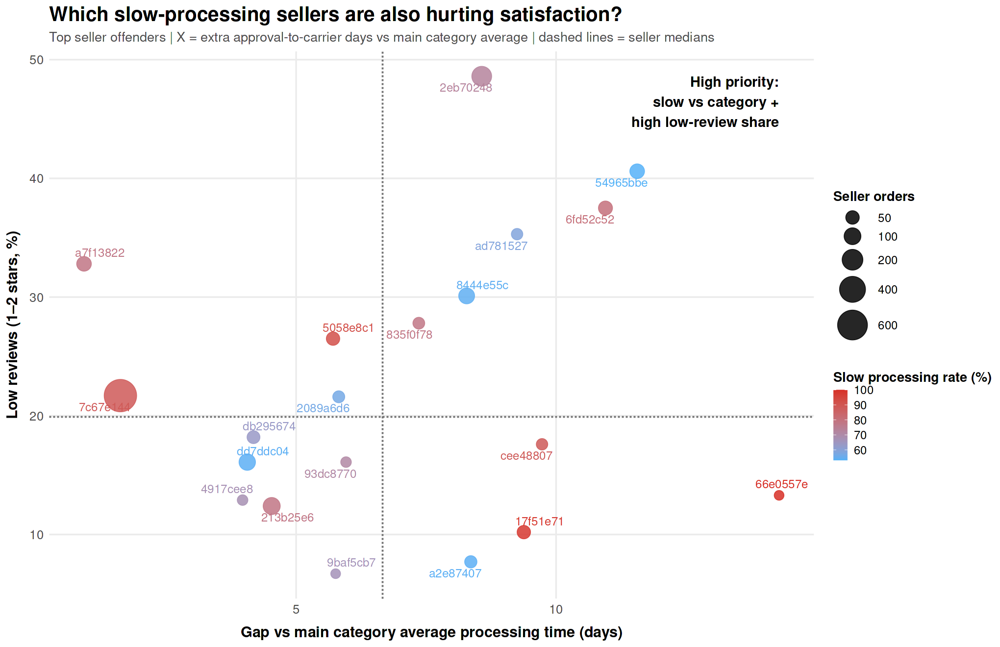
    


#### Viz summary

**Plot 1: Category view ➡︎ where do slow-processing offender patterns cluster?**

🔹 Before looking at individual seller IDs, I first use this chart to understand whether the worst slow-processing cases show any category pattern.
🔹 Each point represents **one seller**, but the point is labeled and colored by that seller’s **main product category**.

So this chart is not yet about naming exact sellers, it is a first diagnostic view asking: **"Do the slow-processing sellers hurting satisfaction appear to cluster in certain product categories?"**

🔹 The highest-priority area is the top-right quadrant of the chart: **slow compared with category baseline + high share of low reviews**
Several categories appear in or near this problem zone, especially:

- **bed_bath_table**
- **watches_gifts**
- **housewares**
- **baby**
- **perfumery**

This suggests that slow-processing risk is not evenly distributed across the offender group. Some product categories appear more exposed to seller-processing problems, than others.

🔸 Important nuance: this does **not** mean these categories are “bad”. The chart is built only from the **top slow-processing offender sellers**, not from the full marketplace. So it shows category patterns **inside the offender group**, not overall category performance.
The better interpretation is **some risky sellers are concentrated in certain categories, so category context matters before blaming sellers directly**.


🔹 This view helps frame the problem before drilling into exact seller IDs.

It tells me:
> - whether slow-processing risk has category patterns  
> - whether certain categories may involve more complex fulfillment  
> - whether a seller’s delay should be judged against category context, not only platform averages  

For example, **office_furniture** is already a slower category overall, so a seller in that category needs to be compared against office-furniture norms, not against a generic platform average.

#### Practical interpretation:

🔹 This category view is a diagnostic layer.
🔹 It helps decide where to look more closely, but it does not yet tell me exactly who to act on.
🔹 The next step is therefore to move from category pattern to **exact seller-level accountability**

That is why the next chart uses seller IDs instead of category names.


This chart shows that slow-processing seller risk has category structure, but category alone is not enough.

It helps identify where risky sellers are concentrated, while the seller-ID chart that follows is needed to pinpoint the exact offenders and prioritize action.

---

**Plot 2: Seller processing risk vs customer satisfaction**

This chart separates slow-processing sellers into a more useful priority view.

🔹 Each point is one top slow-processing seller (20 in total)   
🔹 X-axis shows how many extra approval-to-carrier days the seller takes, compared with the average processing time of their own main category    
🔹 Y-axis shows the share of low reviews (1-2 stars)  
🔹 Bubble size shows seller's order volume  
🔹 Color shows the seller’s slow-processing rate  

The most important area is the **top-right quadrant**: sellers who are both slower than their category norm and also generating a high share of bad reviews.

The main sellers in this high-priority zone are:

- `2eb70248...` — very concerning: high category-adjusted delay gap, **48.6% low reviews**, and **173 orders**
- `54965bbe...` — strong risk signal: **40.6% low reviews**, high gap vs category, concentrated in `bed_bath_table`
- `6fd52c52...` — similar pattern: high processing gap, **37.5% low reviews**, also `bed_bath_table`
- `ad781527...` — high gap and **35.3% low reviews**, concentrated in `baby`
- `8444e55c...` — multi-category seller with **30.1% low reviews**, so the “category excuse” is weaker
- `835f0f78...` — high low-review share and slower than category baseline
- `5058e8c1...` — high slow-processing rate and elevated low-review share, mostly `office_furniture`

The chart also shows an important nuance: some sellers are extremely slow, but do not have very bad review outcomes. For example, `66e0557e...` and `17f51e71...` have large processing gaps, but their low-review shares are relatively low. These sellers should not be treated the same as the top-right-quadrant sellers. They may sell products, where customers tolerate longer processing, or they may compensate with product quality, communication, pricing, or expectations.

The biggest operational priority should therefore not be “all slow sellers.” It should be sellers where slow processing and poor satisfaction overlap.

**Recommended next steps:**

1. Prioritize an "investigation" into the top-right quadrant sellers first, especially `2eb70248...`, `54965bbe...`, and `6fd52c52...` (high category-adjusted processing gap + high low-review share).
2. Separate sellers into action groups:
   - slow + unhappy customers ➡︎ operational intervention
   - slow + low complaint rate ➡︎ check expectations / product type before penalizing
   - not very slow + unhappy customers ➡︎ investigate product quality, listing accuracy, or service issues
3. For the worst sellers, inspect inventory availability, handling workflow, and carrier handoff process.
4. Quantify business impact by adding order volume / GMV-at-risk, so prioritization is not based only on review pain.
5. Use category-adjusted thresholds instead of one platform-wide SLA when evaluating seller processing.

---

**So overall: which chart actually matters?**
- The category one (1st) is useful for pattern recognition, but it’s vague. It tells where problems tend to happen, while the seller chart tells who is causing the problem.
- The **seller-level (IDs)** is the one, that matters operationally.
  

In a marketplace business context you don’t fix "categories", you fix sellers, contracts, SLAs, fulfillment processes

So:
> * Category chart = context  
> * Seller chart = action

---

After the visual analysis, the pattern is already fairly clear: severe delivery delays are strongly linked to low reviews, and some sellers also stand out as processing-risk cases, even after comparing them with their own category baseline. But the charts are still descriptive. They show patterns, not the relative strength of each factor when several variables are considered together. So the next step is to use simple linear regression models to stress-test the relationships more formally: 
- first, to check how strongly the customer’s own order-level delay is associated with review score;
- and second, to test whether seller-side processing risk still has a measurable relationship with reviews, when framed as approval-to-carrier performance (instead of final delivery delay).


```R
library(car)

# Model 1: Order-level delay (for review prediction): direct customer delivery experience (Does this specific order arriving late hurt review score?)

# Order-level payment features
payment_features <- order_payments %>%
  group_by(order_id) %>%
  summarise(
    max_installments = max(payment_installments, na.rm = TRUE),
    main_payment_type = first(payment_type),
    total_payment_value = sum(payment_value, na.rm = TRUE),
    .groups = "drop")

model_review_delivery_base <- orders_base_single_reviewed_ops %>%
  filter(!is.na(delay_vs_eta)) %>%
  mutate(
    freight_pct = if_else(order_price > 0, 100 * order_freight / order_price, NA_real_)) %>%
  inner_join(payment_features, by = "order_id") %>%
  filter(
    !is.na(review_score_num),
    !is.na(delay_vs_eta),
    !is.na(freight_pct),
    !is.na(max_installments),
    !is.na(main_payment_type))

model_review_delivery_base %>%
  summarise(
    rows = n(),
    distinct_orders = n_distinct(order_id))

model_reviews <- lm(
  review_score_num ~ delay_vs_eta + freight_pct + max_installments + main_payment_type,
  data = model_review_delivery_base)

cat("\n\n\n")
cat("Model 1: Order-level delay impact on customer satisfaction (review score)\n")
summary(model_reviews)

cat("\n\n\n")
cat("Multicollinearity check (Model 1)\n")
vif(model_reviews)
```


<table class="dataframe">
<caption>A tibble: 1 × 2</caption>
<thead>
	<tr><th scope=col>rows</th><th scope=col>distinct_orders</th></tr>
	<tr><th scope=col>&lt;int&gt;</th><th scope=col>&lt;int&gt;</th></tr>
</thead>
<tbody>
	<tr><td>85442</td><td>85442</td></tr>
</tbody>
</table>


    
    
    
    Model 1: Order-level delay impact on customer satisfaction (review score)
    


    
    Call:
    lm(formula = review_score_num ~ delay_vs_eta + freight_pct + 
        max_installments + main_payment_type, data = model_review_delivery_base)
    
    Residuals:
        Min      1Q  Median      3Q     Max 
    -5.7832 -0.3698  0.4939  0.7917  6.2610 
    
    Coefficients:
                                   Estimate Std. Error t value Pr(>|t|)    
    (Intercept)                   3.8873204  0.0110628 351.388   <2e-16 ***
    delay_vs_eta                 -0.0371802  0.0003960 -93.891   <2e-16 ***
    freight_pct                  -0.0013056  0.0001328  -9.830   <2e-16 ***
    max_installments             -0.0144812  0.0016712  -8.665   <2e-16 ***
    main_payment_typecredit_card -0.0010015  0.0108607  -0.092   0.9265    
    main_payment_typedebit_card   0.0295325  0.0330768   0.893   0.3719    
    main_payment_typevoucher     -0.0635759  0.0256657  -2.477   0.0132 *  
    ---
    Signif. codes:  0 ‘***’ 0.001 ‘**’ 0.01 ‘*’ 0.05 ‘.’ 0.1 ‘ ’ 1
    
    Residual standard error: 1.169 on 85435 degrees of freedom
    Multiple R-squared:  0.09432,	Adjusted R-squared:  0.09426 
    F-statistic:  1483 on 6 and 85435 DF,  p-value: < 2.2e-16
    


    
    
    
    Multicollinearity check (Model 1)
    


<table class="dataframe">
<caption>A matrix: 4 × 3 of type dbl</caption>
<thead>
	<tr><th></th><th scope=col>GVIF</th><th scope=col>Df</th><th scope=col>GVIF^(1/(2*Df))</th></tr>
</thead>
<tbody>
	<tr><th scope=row>delay_vs_eta</th><td>1.002674</td><td>1</td><td>1.001336</td></tr>
	<tr><th scope=row>freight_pct</th><td>1.047496</td><td>1</td><td>1.023472</td></tr>
	<tr><th scope=row>max_installments</th><td>1.222166</td><td>1</td><td>1.105516</td></tr>
	<tr><th scope=row>main_payment_type</th><td>1.176783</td><td>3</td><td>1.027502</td></tr>
</tbody>
</table>


*Payment features were summarized at order level. Because 97.02% of orders contain only one payment record, `main_payment_type` was treated as the first recorded payment type for modeling purposes. This is a reasonable simplification for the current analysis, but split-payment orders may contain mixed instruments such as voucher + credit card*


#### Model 1 — Order-level delay impact on review score

🔹 Model 1 tests the direct customer experience: whether the specific order arriving late compared with the estimated delivery date is associated with lower review scores.

🔹 The model was fitted on **85442 reviewed single-item, single-seller orders** with measurable delivery delay. The grain is clean: **85442 rows = 85442 distinct orders**.

🔹 The strongest predictor is clearly `delay_vs_eta`.

- `delay_vs_eta` coefficient = **-0.0372**  
- p-value: **< 2e-16**

🔹 This means that, holding freight burden, installments and payment type constant, each additional day late vs ETA is associated with a decrease of about **0.037 review points** on the 1–5 review scale.

The effect looks small per single day, but it can compound:

- **3 days late** ≈ -0.11 review points
- **10 days late** ≈ -0.37 review points
- **20 days late** ≈ -0.74 review points

🔹 So the model supports what the earlier analysis already showed: **severe lateness is highly damaging for customer satisfaction**.

🔹 Freight burden and installments are also statistically significant, but their practical effects are much smaller:

- `freight_pct` coefficient = **-0.0013**
- `max_installments` coefficient = **-0.0145**

🔹 Payment type has little explanatory value in this model. Credit card and debit card are not statistically significant, while voucher is statistically significant, but small in effect size.

🔹 The model has an adjusted R2 of **0.0943**, meaning these operational and payment variables explain about **9.4%** of the variation in review scores. This is reasonable for customer-review data, where many important drivers are not observed in the dataset, such as product quality, packaging, communication and customer expectations.

🔹 The multicollinearity check shows no concern. All adjusted GVIF values are close to 1, meaning the predictors are not strongly overlapping.

**Conclusion:** direct order-level delay is the dominant operational predictor in this model. Freight burden and installment structure have measurable but much weaker associations, while payment type does not materially explain review outcomes.

---

#### Moving to Model 2 — seller-side processing risk

Model 1 confirmed the customer-facing side of the story: when an individual order arrives late compared with the ETA, review scores drop. That is the direct customer experience.

But this still does not tell us whether some sellers are systematically creating operational risk before the package even reaches the carrier.

So Model 2 shifts the focus from **"Was this specific order late to the customer?"** to **"Do sellers with slower processing patterns also receive worse reviews?"**

For this model, I will not use final delivery delay as the seller metric, because final delivery also includes carrier and route effects. Instead, I will use the cleaner seller-side signal built earlier: **approval-to-carrier processing performance**, especially the seller’s category-adjusted processing gap and slow-processing rate.

This lets me test whether seller-side processing risk is associated with review scores after accounting for the fact that some categories naturally take longer to prepare than others.


```R
# Model 2: Seller-side processing risk (Do sellers with slower category-adjusted processing patterns receive worse reviews?)

# 1. Building category mix for all eligible sellers:

seller_category_mix_all <- seller_category_base %>%
  group_by(seller_id, product_category) %>%
  summarise(
    orders_n = n(),
    .groups = "drop") %>%
  group_by(seller_id) %>%
  mutate(
    seller_orders_n = sum(orders_n),
    pct_orders = 100 * orders_n / seller_orders_n) %>%
  ungroup()

# 2. Getting top category per seller:

seller_top_category_all <- seller_category_mix_all %>%
  group_by(seller_id) %>%
  slice_max(order_by = orders_n, n = 1, with_ties = FALSE) %>%
  ungroup() %>%
  select(
    seller_id,
    top_category = product_category,
    top_category_pct = pct_orders)

# 3. Attaching category baseline to all sellers with >=30 measurable processing orders:

seller_processing_features_all <- seller_processing_seller_30 %>%
  left_join(seller_top_category_all, by = "seller_id") %>%
  left_join(
    category_processing_baseline %>%
      rename(top_category = product_category),
    by = "top_category") %>%
  mutate(
    seller_vs_category_avg_gap_days =
      avg_approval_to_carrier_days - cat_avg_approval_to_carrier_days)

# 4. Joining seller-level processing features back to order-level reviewed processing base:

model_seller_processing_base <- seller_processing_base %>%
  inner_join(
    seller_processing_features_all %>%
      select(
        seller_id,
        slow_processing_rate_pct,
        avg_approval_to_carrier_days,
        seller_vs_category_avg_gap_days), by = "seller_id")

# Sanity check: still order grain?

model_seller_processing_base %>%
  summarise(
    rows = n(),
    distinct_orders = n_distinct(order_id),
    distinct_sellers = n_distinct(seller_id))

# 5. Fitting Model 2:

model_seller_processing <- lm(review_score_num ~ seller_vs_category_avg_gap_days + slow_processing_rate_pct, data = model_seller_processing_base)

cat("\n\nModel 2: Seller-side processing risk impact on review score\n")
summary(model_seller_processing)

cat("\n\nMulticollinearity check (Model 2)\n")
vif(model_seller_processing)
```


<table class="dataframe">
<caption>A tibble: 1 × 3</caption>
<thead>
	<tr><th scope=col>rows</th><th scope=col>distinct_orders</th><th scope=col>distinct_sellers</th></tr>
	<tr><th scope=col>&lt;int&gt;</th><th scope=col>&lt;int&gt;</th><th scope=col>&lt;int&gt;</th></tr>
</thead>
<tbody>
	<tr><td>70946</td><td>70946</td><td>575</td></tr>
</tbody>
</table>


    
    
    Model 2: Seller-side processing risk impact on review score
    


    
    Call:
    lm(formula = review_score_num ~ seller_vs_category_avg_gap_days + 
        slow_processing_rate_pct, data = model_seller_processing_base)
    
    Residuals:
        Min      1Q  Median      3Q     Max 
    -3.3144 -0.2541  0.7353  0.7880  1.6970 
    
    Coefficients:
                                      Estimate Std. Error t value Pr(>|t|)    
    (Intercept)                      4.2307968  0.0069867 605.551  < 2e-16 ***
    seller_vs_category_avg_gap_days -0.0283408  0.0050465  -5.616 1.96e-08 ***
    slow_processing_rate_pct        -0.0052297  0.0005131 -10.193  < 2e-16 ***
    ---
    Signif. codes:  0 ‘***’ 0.001 ‘**’ 0.01 ‘*’ 0.05 ‘.’ 0.1 ‘ ’ 1
    
    Residual standard error: 1.252 on 70478 degrees of freedom
      (465 observations deleted due to missingness)
    Multiple R-squared:  0.008792,	Adjusted R-squared:  0.008764 
    F-statistic: 312.6 on 2 and 70478 DF,  p-value: < 2.2e-16
    


    
    
    Multicollinearity check (Model 2)
    


<style>
.dl-inline {width: auto; margin:0; padding: 0}
.dl-inline>dt, .dl-inline>dd {float: none; width: auto; display: inline-block}
.dl-inline>dt::after {content: ":\0020"; padding-right: .5ex}
.dl-inline>dt:not(:first-of-type) {padding-left: .5ex}
</style><dl class=dl-inline><dt>seller_vs_category_avg_gap_days</dt><dd>2.75604813586986</dd><dt>slow_processing_rate_pct</dt><dd>2.75604813586986</dd></dl>


### Model 2 — Seller-side processing risk

🔹 Model 2 tests whether seller-side processing risk is associated with review scores.

🔹 Unlike the earlier seller-delay logic, this model does not use final delivery delay as the seller metric. Instead, it uses approval-to-carrier processing behaviour, which is closer to the part of the order lifecycle that sellers can actually influence.

🔹 The model was fitted on **70946 reviewed single-item, single-seller orders** linked to **575 sellers** with at least **30 measurable approval-to-carrier orders**. The grain is clean: **70946 rows = 70946 distinct orders**.

🔹 Both seller-processing variables are statistically significant:

> - `seller_vs_category_avg_gap_days` coefficient = **-0.0283**  
> - `slow_processing_rate_pct` coefficient = **-0.0052**  

🔹 This means that sellers, who process orders more slowly than their category baseline, tend to receive lower review scores. Similarly, sellers with a higher share of orders above the platform P90 approval-to-carrier threshold also tend to have lower reviews.

🔹 Model’s explanatory power is weak, however: **`adjusted R2 = 0.0088`**. So seller-processing risk explains less than **1%** of review-score variation. This means it is a real signal, but not a dominant driver of satisfaction by itself.

🔹 The multicollinearity check shows moderate overlap between the two seller-processing variables: VIF ~ **2.76**
This is acceptable and below common concern thresholds, but it also makes sense: sellers with high slow-processing rates often also have positive category-adjusted processing gaps.

**Conclusion:** seller-side processing risk matters, but mostly as a screening and prioritization signal. It is useful for identifying operationally risky sellers, not for fully explaining review scores.


```R
library(broom)

coef_m1 <- tidy(model_reviews, conf.int = TRUE) %>%
  filter(term != "(Intercept)") %>%
  mutate(model = "Model 1: Order-level delivery experience")

coef_m2 <- tidy(model_seller_processing, conf.int = TRUE) %>%
  filter(term != "(Intercept)") %>%
  mutate(model = "Model 2: Seller-side processing risk")

coef_combined <- bind_rows(coef_m1, coef_m2) %>%
  mutate(
    term = case_when(
      term == "delay_vs_eta" ~ "Delay vs ETA (+1 day)",
      term == "freight_pct" ~ "Freight cost % of item value",
      term == "max_installments" ~ "Installments (+1)",
      term == "main_payment_typecredit_card" ~ "Payment: Credit card",
      term == "main_payment_typedebit_card" ~ "Payment: Debit card",
      term == "main_payment_typevoucher" ~ "Payment: Voucher",
      term == "seller_vs_category_avg_gap_days" ~ "Seller gap vs category avg (+1 day)",
      term == "slow_processing_rate_pct" ~ "Seller slow-processing rate (+1 pp)",
      TRUE ~ term),
    significant = ifelse(p.value < 0.05, "Yes", "No"))

options(repr.plot.width = 18, repr.plot.height = 10)

ggplot(coef_combined,
  aes(x = estimate, y = reorder(term, estimate), color = significant)
) +
  geom_vline(
    xintercept = 0,
    linetype = "dashed",
    color = "gray50",
    linewidth = 1) +
  geom_errorbarh(
    aes(xmin = conf.low, xmax = conf.high),
    height = 0.3,
    linewidth = 1) +
  geom_point(size = 4) +
  facet_wrap(~ model, ncol = 1, scales = "free_y") +
  scale_color_manual(
    values = c("Yes" = "#d62728", "No" = "gray70")) +
  labs(
    title = "Order-level delay has a stronger relationship \n with reviews than seller processing risk",
    subtitle = "Coefficient estimates with 95% confidence intervals | Red = statistically significant",
    x = "Estimated effect on review score (1–5 scale)",
    y = NULL,
    color = "Significant?") +
  theme_minimal(base_size = 14, base_family = "Arial") +
  theme(
  plot.title = element_text(face = "bold", size = 22),
  plot.subtitle = element_text(size = 18, color = "gray30"),
  axis.title.x = element_text(size = 17, face = "bold", margin = margin(t = 10)),
  axis.text.x = element_text(size = 16),
  axis.text.y = element_text(size = 18),
  strip.text = element_text(face = "bold", size = 17),
  legend.position = "bottom",
  legend.title = element_text(size = 17, face = "bold"),
  legend.text = element_text(size = 16),
  panel.grid.minor = element_blank(),
  plot.margin = margin(10, 30, 10, 10))
```


    
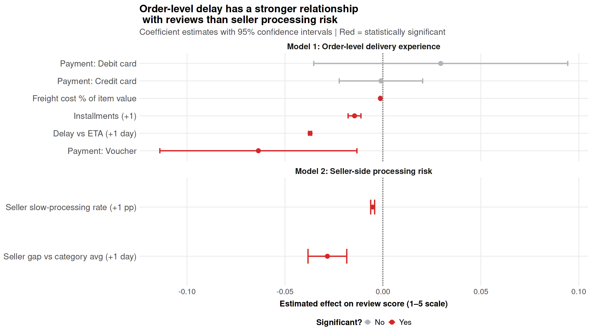
    


#### Coefficient plot — key interpretation:

This chart compares the estimated effects from the two regression models:

- **Model 1:** direct order-level delivery experience
- **Model 2:** seller-side processing risk

The main message is: `direct order-level delay has a stronger and more actionable relationship with review scores than seller-level processing risk`.


- **Delay vs ETA** is clearly negative and statistically significant. The later an order arrives (compared with the estimated delivery date) ➡︎ the lower the review score tends to be.

- **Seller processing risk is also significant**, but weaker. Sellers who are slower than their category baseline, or who have more orders above the P90 approval-to-carrier threshold, tend to receive worse reviews — but the effect is smaller, than the direct delay experienced by the customer.

- **Freight burden and installments have small negative effects.** They are statistically visible, but they do not drive satisfaction the way delivery delay does.

- **Payment type is mostly not important.**  Credit card and debit card are not meaningful predictors here; voucher shows a negative effect, but this should not become the main business story.

<br>

##### 🔹 Key takeaway

The chart supports the same conclusion as the earlier visual analysis ➜

> ***customers react most strongly to what happened to their own order***

Seller processing metrics are still useful, but mainly as an **early-warning / seller-monitoring tool**, not as the primary explanation for customer satisfaction.

<br>

##### 🔹 Business meaning

The strongest operational priority is:
> ***reduce severe customer-facing delays***

The second priority is:
> ***use category-adjusted seller processing metrics to identify sellers likely to create future delay problems***

<br>

So the right strategy is not broad freight discounts or payment flexibility tweaks. It is tighter delivery reliability and targeted seller-process intervention.

**Question 15 executive summary:**

🔹 The main finding is very clear ➜ **Late delivery is the strongest operational driver of dissatisfaction.**

🔹 Severe lateness creates a huge increase in low reviews. Freight burden does not meaningfully change that story: cheap shipping does not “save” a late order, and expensive shipping does not matter much if the order arrives on time.

🔹 The seller analysis adds a second layer ➜ **some sellers are slow even compared with their own category baseline.**
This is important because it turns the analysis from a generic logistics problem into a seller-prioritization problem. The goal should not be "fix all sellers" or "punish slow categories". The goal should be to identify sellers, where three things overlap:

> 1. slow processing vs category norm  
> 2. high low-review share  
> 3. meaningful order volume  

↑ Those are the sellers most likely creating avoidable operational damage.

🔹 So the final business recommendation is:

> ***Focus first on preventing severe delivery delays, then use seller-processing metrics as an early-warning system to identify chronic seller-side bottlenecks***

🔹 The biggest opportunity is not broad freight discounts or payment flexibility. It is **better operational control**:

- monitor approval-to-carrier delays
- compare sellers against category-specific baselines
- intervene with high-risk sellers before delays become customer-facing
- improve expectation-setting for naturally slower categories
- prioritize high-volume sellers where small operational improvements affect many orders

🔹 In simple terms:

> * Customers mostly care whether their own order arrives when expected.   
> * Seller history matters, but mainly as a warning signal for where future problems may happen.


**The opportunity lies in simultaneously improving seller delivery performance (delivery speed improvements) while strategically increasing freight margins on reliable routes**

### **Question 16: "Do Delays During Holidays Hurt More?"** 

I would like to examine, whether the relationship between delivery delays and customer satisfaction changes during holiday periods - essentially I want to test if customers are more forgiving or less forgiving of delays during peak shopping seasons.

**Hypothesis:** During high-traffic shopping events such as Black Friday, Christmas, Mother's Day, etc., delivery delays lead to a larger drop in review scores compared to average periods, because customer expectations are heightened and logistical systems are operating near capacity

I have researched online sources:
[Commercial Calendar](https://conteudo.stone.com.br/calendario-comercial/), [Brazilian Carnival](https://en.wikipedia.org/wiki/Brazilian_Carnival), [Marketing Calendar](https://selzy.com/br/blog/calendario-de-marketing/)

and after a careful consideration, I have decided to segment such holidays as:

1. **High-expectation gifting holidays (time-sensitive):**
> * Christmas    
> * Mother’s Day (typically celebrated on the second Sunday in May)  
> * Father’s Day (second Sunday of August)  
> * Valentine’s Day (12th of June)  
> * Children’s Day (12th of October)  

2. **High-volume sales events (deal-focused, not as time-sensitive)**: 
> * **Mega-sales November** (Black Friday + Cyber Monday)     
> * **Dia do Consumidor** (around 15th of March, often celebrated as a multi-day promo window (±3–7 days), not a single peak day)  
> * **Carnival** (late February / early March) ➜ I will include Carnival as a logistics disruption period, not a gift-giving time-sensitive holiday:  


| Holiday / Event                                                           | Year | Exact date / period | In Olist data? | Analysis window |
| ------------------------------------------------------------------------- | ---- | ------------------- | -------------- | ------------------------- |
| **Valentine’s Day (Dia dos Namorados)**  | 2016 | 12 Jun 2016         | ❌              | −7 to +2 days             |
|                                                                           | 2017 | 12 Jun 2017         | ✅              | −7 to +2 days             |
|                                                                           | 2018 | 12 Jun 2018         | ✅              | −7 to +2 days             |
| **Mother’s Day (2nd Sunday of May)**     | 2016 | 8 May 2016          | ❌              | −7 to +3 days             |
|                                                                           | 2017 | 14 May 2017         | ✅              | −7 to +3 days             |
|                                                                           | 2018 | 13 May 2018         | ✅              | −7 to +3 days             |
| **Father’s Day (2nd Sunday of August)**     | 2016 | 14 Aug 2016         | ❌              | −7 to +3 days             |
|                                                                           | 2017 | 13 Aug 2017         | ✅              | −7 to +3 days             |
|                                                                           | 2018 | 12 Aug 2018         | ✅              | −7 to +3 days             |
| **Children’s Day**    | 2016 | 12 Oct 2016         | ✅              | −7 to +2 days             |
|                                                                           | 2017 | 12 Oct 2017         | ✅              | −7 to +3 days             |
|                                                                           | 2018 | 12 Oct 2018         | ❌              | −7 to +3 days             |
| **Christmas**         | 2016 | 25 Dec 2016         | ✅              | −21 to +5 days            |
|                                                                           | 2017 | 25 Dec 2017         | ✅              | −21 to +5 days            |
|                                                                           | 2018 | 25 Dec 2018         | ❌              | −21 to +5 days            |
| **Carnival**          | 2016 | 8-9 Feb 2016          | ❌              | −3 to +3 days             |
|                                                                           | 2017 | 27-28 Feb 2017         | ✅              | −3 to +3 days             |
|                                                                           | 2018 | 12-13 Feb 2018         | ✅              | −3 to +3 days             |
| **Dia do Consumidor**   | 2016 | 15 Mar 2016         | ❌              | −3 to +2 days             |
|                                                                           | 2017 | 15 Mar 2017         | ✅              | −3 to +2 days             |
|                                                                           | 2018 | 15 Mar 2018         | ✅              | −3 to +2 days             |
| **Mega-sales November**<br>(Black November / Black Friday / Cyber Monday) | 2016 | ~1–30 Nov 2016      | ✅              | Full month of November    |
|                                                                           | 2017 | ~1–30 Nov 2017      | ✅              | Full month of November    |
|                                                                           | 2018 | ~1–30 Nov 2018      | ❌              | Full month of November    |

 
**Carnival**: −3 to +3 days ➜ -3 days (Pre-Carnival) is a weekend before Carnival, where people/workers are leaving cities for coastal and party destinations, warehouse/shipping staffing is minimal; Monday-Tuesday is Carnival peak (Brazil essentially shuts down): minimal deliveries, street parties are blocking routes in major cities, +3 days (Post_carnival): backlog of orders piling up, causing extended delivery windows, as operations recover.

**Mega-sales November** ➜ In Brazil, November has evolved into an extended promotional period, commonly referred to as “Black November”, rather than a single shopping day, promotions are spread across multiple weeks, creating a prolonged high-volume sales period. Concentrating promotions into a single day (Black Friday/Cyber Monday) historically caused severe delivery delays, warehouse bottlenecks and, as a result, a huge customer dissatisfaction), therefore extending promotions across the whole month of November smooths demand and reduces operational collapse

**Christmas**: −21 to +5 days ➜ longer pre-holiday-window, as Christmas is fundamentally different from other holidays, customers are aware: higher order volume = higher logistics strain = more delays across entire December. 5-day post-holiday window to capture angry late reviews.

**Mother's Day, Father's Day, Children's Day, Valentine's Day**: −7 to +3 days ➜ 1 week is standard e-commerce buffer for gift planning/buying


<br>

*Because customer satisfaction is recorded at the order-review level, this analysis was restricted to single-item delivered orders and aggregated to one row per order before assigning holiday periods. This avoids giving multi-item orders multiple votes in satisfaction averages, delay effects, and interaction models.*


```R
# Defining exact holiday dates and windows for 2016-2018:

q16_base <- delivered_orders_delay %>%
  semi_join(single_item_orders, by = "order_id") %>%
  left_join(
    order_review_clean %>% select(order_id, review_score_num),
    by = "order_id") %>%
  distinct(order_id, .keep_all = TRUE)

q16_base <- q16_base %>%
  mutate(
    order_date = as.Date(order_purchase_timestamp),
    order_year = year(order_date),
    
    # Valentine's Day (Dia dos Namorados) - June 12, only 2017 and 2018 | -7 to +2
    is_valentines = case_when(
      order_year == 2017 & order_date >= as.Date("2017-06-05") & order_date <= as.Date("2017-06-14") ~ TRUE,
      order_year == 2018 & order_date >= as.Date("2018-06-05") & order_date <= as.Date("2018-06-14") ~ TRUE,
      TRUE ~ FALSE),
    
    # Mother's Day - 2nd Sunday of May, only 2017 and 2018 | -7 to +3
    is_mothers_day = case_when(
      order_year == 2017 & order_date >= as.Date("2017-05-07") & order_date <= as.Date("2017-05-17") ~ TRUE,
      order_year == 2018 & order_date >= as.Date("2018-05-06") & order_date <= as.Date("2018-05-16") ~ TRUE,
      TRUE ~ FALSE),
    
    # Father's Day - 2nd Sunday of August, only 2017 and 2018 | -7 to +3
    is_fathers_day = case_when(
      order_year == 2017 & order_date >= as.Date("2017-08-06") & order_date <= as.Date("2017-08-16") ~ TRUE,
      order_year == 2018 & order_date >= as.Date("2018-08-05") & order_date <= as.Date("2018-08-15") ~ TRUE,
      TRUE ~ FALSE),
    
    # Children's Day - October 12, only 2016 and 2017 | -7 to +3
    is_children_day = case_when(
      order_year == 2016 & order_date >= as.Date("2016-10-05") & order_date <= as.Date("2016-10-14") ~ TRUE,
      order_year == 2017 & order_date >= as.Date("2017-10-05") & order_date <= as.Date("2017-10-15") ~ TRUE,
      TRUE ~ FALSE),
    
    # Christmas - December 25, all years | -21 to +5
    is_christmas = case_when(
      order_year == 2016 & order_date >= as.Date("2016-12-04") & order_date <= as.Date("2016-12-30") ~ TRUE,
      order_year == 2017 & order_date >= as.Date("2017-12-04") & order_date <= as.Date("2017-12-30") ~ TRUE,
      TRUE ~ FALSE),
    
    # Carnival/logistics disruption - Variable dates, only 2017 and 2018 | -3 to +3 
    is_carnival = case_when(
      order_year == 2017 & order_date >= as.Date("2017-02-24") & order_date <= as.Date("2017-03-03") ~ TRUE,
      order_year == 2018 & order_date >= as.Date("2018-02-09") & order_date <= as.Date("2018-02-16") ~ TRUE,
      TRUE ~ FALSE),
    
    # Dia do Consumidor - March 15, only 2017 and 2018 | -3 to +2
    is_consumidor = case_when(
      order_year == 2017 & order_date >= as.Date("2017-03-12") & order_date <= as.Date("2017-03-17") ~ TRUE,
      order_year == 2018 & order_date >= as.Date("2018-03-12") & order_date <= as.Date("2018-03-17") ~ TRUE,
      TRUE ~ FALSE),
    
    # Black November - Full month (Black Friday + Cyber Monday period)
    is_black_november = case_when(
      order_year == 2016 & month(order_date) == 11 ~ TRUE,
      order_year == 2017 & month(order_date) == 11 ~ TRUE,
      TRUE ~ FALSE),
    
    is_holiday_period = is_valentines | is_mothers_day | is_fathers_day | is_children_day | is_christmas | is_carnival | is_consumidor | 
      is_black_november,
    
   shopping_period = case_when(
      is_christmas ~ "Christmas",
      is_mothers_day ~ "Mother's Day",
      is_fathers_day ~ "Father's Day",
      is_valentines ~ "Valentine's Day",
      is_children_day ~ "Children's Day",
      is_black_november ~ "Black November",
      is_consumidor ~ "Dia do Consumidor",
      is_carnival ~ "Carnival",
      TRUE ~ "Regular"))

# Verifying  holiday coverage:

cat("\nHoliday Period Coverage (2016-2018)\n")
cat(rep("_", 70), "\n")

holiday_summary <- q16_base %>%
  group_by(shopping_period) %>%
  summarise(
    orders_n = n_distinct(order_id),
    date_range = paste(min(order_date), "to", max(order_date)),
    .groups = "drop"
  ) %>%
  arrange(desc(orders_n))

print(holiday_summary, n = Inf)

# Analyzing delay impact by period:

delay_impact_by_period <- q16_base %>%
  mutate(is_late = delay_vs_eta > 0) %>%
  group_by(shopping_period, is_late) %>%
  summarise(
    orders_n = n_distinct(order_id), 
    avg_review = round(mean(review_score_num, na.rm = TRUE), 2),
    share_low_reviews = round(mean(review_score_num <= 2, na.rm = TRUE) * 100, 1),
    avg_delay = round(mean(delay_vs_eta, na.rm = TRUE), 1), 
    .groups = "drop"
  ) %>%
  arrange(shopping_period, desc(is_late))

cat("\n\nDelay impact by shopping period\n")
cat(rep("_", 60), "\n")
print(delay_impact_by_period, n = Inf)


# Satisfaction drop for each period:

impact_comparison <- delay_impact_by_period %>%
  select(shopping_period, is_late, avg_review) %>%
  pivot_wider(
    names_from = is_late,
    values_from = avg_review,
    names_prefix = "late_"
  ) %>%
  mutate(
    satisfaction_drop = late_FALSE - late_TRUE,
    pct_drop = round((satisfaction_drop / late_FALSE) * 100, 1)
  ) %>%
  arrange(desc(satisfaction_drop))

cat("\n\nSatisfaction drop when late (by period)\n")
cat(rep("_", 60), "\n")
print(impact_comparison, n = Inf)


# Model:

model_interaction <- lm(
  review_score_num ~ delay_vs_eta * is_holiday_period,
  data = q16_base)

cat("\n\nDelay × Holiday interaction model\n")
cat(rep("_", 60), "\n")
summary(model_interaction)

interaction_coef <- coef(model_interaction)["delay_vs_eta:is_holiday_periodTRUE"]


# Severe delays (>3 days) by period:

severe_delay_by_period <- q16_base %>%
  filter(delay_vs_eta > 3) %>%
  group_by(shopping_period) %>%
  summarise(
    orders_n = n_distinct(order_id),
    avg_review = round(mean(review_score_num, na.rm = TRUE), 2),
    share_1_2_star = round(mean(review_score_num <= 2, na.rm = TRUE) * 100, 1),
    avg_delay = round(mean(delay_vs_eta, na.rm = TRUE), 1),
    .groups = "drop") %>%
  arrange(avg_review)

cat("\n\nSevere delays (>3 Days) by period\n")
cat(rep("_", 70), "\n")
print(severe_delay_by_period, n = Inf)


# Revenue at risk by period:

order_revenue <- orders_ops_buckets %>%
  group_by(order_id) %>%
  summarise(
    order_total = first(total_payment_value),
    .groups = "drop")

revenue_risk_by_period <- q16_base %>%
  left_join(order_revenue, by = "order_id") %>%
  mutate(
    is_poor_review = review_score_num <= 2,
    is_late = delay_vs_eta > 0
  ) %>%
  group_by(shopping_period, is_late) %>%
  summarise(
    orders_n = n_distinct(order_id),
    total_revenue = sum(order_total, na.rm = TRUE),
    revenue_at_risk = sum(order_total[is_poor_review], na.rm = TRUE),
    pct_revenue_at_risk = round((revenue_at_risk / total_revenue) * 100, 1),
    .groups = "drop") %>%
  filter(is_late == TRUE) %>%
  arrange(desc(pct_revenue_at_risk))

cat("\n\nRevenue at risk from late deliveries (by period)\n")
cat(rep("_", 60), "\n")
print(revenue_risk_by_period, n = Inf)
```

    
    Holiday Period Coverage (2016-2018)
    _ _ _ _ _ _ _ _ _ _ _ _ _ _ _ _ _ _ _ _ _ _ _ _ _ _ _ _ _ _ _ _ _ _ _ _ _ _ _ _ _ _ _ _ _ _ _ _ _ _ _ _ _ _ _ _ _ _ _ _ _ _ _ _ _ _ _ _ _ _ 
    # A tibble: 9 × 3
      shopping_period   orders_n date_range              
      <chr>                <int> <chr>                   
    1 Regular              59612 2016-10-03 to 2018-08-29
    2 Black November        6466 2017-11-01 to 2017-11-30
    3 Christmas             4324 2016-12-23 to 2017-12-30
    4 Father's Day          4156 2017-08-06 to 2018-08-15
    5 Mother's Day          4022 2017-05-07 to 2018-05-16
    6 Valentine's Day       3038 2017-06-05 to 2018-06-14
    7 Carnival              1993 2017-02-24 to 2018-02-16
    8 Dia do Consumidor     1674 2017-03-12 to 2018-03-17
    9 Children's Day        1550 2016-10-05 to 2017-10-15
    
    
    Delay impact by shopping period
    _ _ _ _ _ _ _ _ _ _ _ _ _ _ _ _ _ _ _ _ _ _ _ _ _ _ _ _ _ _ _ _ _ _ _ _ _ _ _ _ _ _ _ _ _ _ _ _ _ _ _ _ _ _ _ _ _ _ _ _ 
    # A tibble: 18 × 6
       shopping_period   is_late orders_n avg_review share_low_reviews avg_delay
       <chr>             <lgl>      <int>      <dbl>             <dbl>     <dbl>
     1 Black November    TRUE         944       2.44              57.6      10.6
     2 Black November    FALSE       5522       4.34               7.2     -10.3
     3 Carnival          TRUE         245       2.24              61.6      10.4
     4 Carnival          FALSE       1748       4.29               7.9     -11.1
     5 Children's Day    TRUE          81       2.79              47.4       7.6
     6 Children's Day    FALSE       1469       4.32               8.4     -15.5
     7 Christmas         TRUE         350       2.4               59.3       9.3
     8 Christmas         FALSE       3974       4.33               8.1     -14.3
     9 Dia do Consumidor TRUE         338       2.33              61.3      10.7
    10 Dia do Consumidor FALSE       1336       4.31               7.3     -10.9
    11 Father's Day      TRUE         388       3.49              29.8       4  
    12 Father's Day      FALSE       3768       4.43               6.2     -10  
    13 Mother's Day      TRUE         337       3.14              37.7       6.3
    14 Mother's Day      FALSE       3685       4.38               7       -11.8
    15 Regular           TRUE        4429       2.53              54.7      10.1
    16 Regular           FALSE      55183       4.37               7.5     -13.2
    17 Valentine's Day   TRUE          85       2.5               57.1      10.8
    18 Valentine's Day   FALSE       2953       4.37               7.5     -16.8
    
    
    Satisfaction drop when late (by period)
    _ _ _ _ _ _ _ _ _ _ _ _ _ _ _ _ _ _ _ _ _ _ _ _ _ _ _ _ _ _ _ _ _ _ _ _ _ _ _ _ _ _ _ _ _ _ _ _ _ _ _ _ _ _ _ _ _ _ _ _ 
    # A tibble: 9 × 5
      shopping_period   late_TRUE late_FALSE satisfaction_drop pct_drop
      <chr>                 <dbl>      <dbl>             <dbl>    <dbl>
    1 Carnival               2.24       4.29              2.05     47.8
    2 Dia do Consumidor      2.33       4.31              1.98     45.9
    3 Christmas              2.4        4.33              1.93     44.6
    4 Black November         2.44       4.34              1.9      43.8
    5 Valentine's Day        2.5        4.37              1.87     42.8
    6 Regular                2.53       4.37              1.84     42.1
    7 Children's Day         2.79       4.32              1.53     35.4
    8 Mother's Day           3.14       4.38              1.24     28.3
    9 Father's Day           3.49       4.43              0.94     21.2
    
    
    Delay × Holiday interaction model
    _ _ _ _ _ _ _ _ _ _ _ _ _ _ _ _ _ _ _ _ _ _ _ _ _ _ _ _ _ _ _ _ _ _ _ _ _ _ _ _ _ _ _ _ _ _ _ _ _ _ _ _ _ _ _ _ _ _ _ _ 
    


    
    Call:
    lm(formula = review_score_num ~ delay_vs_eta * is_holiday_period, 
        data = q16_base)
    
    Residuals:
        Min      1Q  Median      3Q     Max 
    -5.6395 -0.3671  0.4920  0.7840  6.2635 
    
    Coefficients:
                                         Estimate Std. Error t value Pr(>|t|)    
    (Intercept)                         3.8193482  0.0073555 519.251  < 2e-16 ***
    delay_vs_eta                       -0.0358887  0.0004830 -74.310  < 2e-16 ***
    is_holiday_periodTRUE              -0.0363269  0.0124631  -2.915  0.00356 ** 
    delay_vs_eta:is_holiday_periodTRUE -0.0034342  0.0008456  -4.061 4.89e-05 ***
    ---
    Signif. codes:  0 ‘***’ 0.001 ‘**’ 0.01 ‘*’ 0.05 ‘.’ 0.1 ‘ ’ 1
    
    Residual standard error: 1.17 on 85433 degrees of freedom
      (1398 observations deleted due to missingness)
    Multiple R-squared:  0.09301,	Adjusted R-squared:  0.09298 
    F-statistic:  2920 on 3 and 85433 DF,  p-value: < 2.2e-16
    


    
    
    Severe delays (>3 Days) by period
    _ _ _ _ _ _ _ _ _ _ _ _ _ _ _ _ _ _ _ _ _ _ _ _ _ _ _ _ _ _ _ _ _ _ _ _ _ _ _ _ _ _ _ _ _ _ _ _ _ _ _ _ _ _ _ _ _ _ _ _ _ _ _ _ _ _ _ _ _ _ 
    # A tibble: 9 × 5
      shopping_period   orders_n avg_review share_1_2_star avg_delay
      <chr>                <int>      <dbl>          <dbl>     <dbl>
    1 Carnival               173       1.69           78.4      14.1
    2 Christmas              236       1.85           76.5      13  
    3 Dia do Consumidor      251       1.88           74.4      13.9
    4 Black November         657       1.89           73.9      14.6
    5 Regular               2974       1.9            73        14.3
    6 Valentine's Day         59       1.95           74.6      14.9
    7 Children's Day          47       2.02           72.7      12.1
    8 Father's Day           163       2.45           57.6       7.8
    9 Mother's Day           212       2.5            55         9.2
    
    
    Revenue at risk from late deliveries (by period)
    _ _ _ _ _ _ _ _ _ _ _ _ _ _ _ _ _ _ _ _ _ _ _ _ _ _ _ _ _ _ _ _ _ _ _ _ _ _ _ _ _ _ _ _ _ _ _ _ _ _ _ _ _ _ _ _ _ _ _ _ 
    # A tibble: 9 × 6
      shopping_period   is_late orders_n total_revenue revenue_at_risk pct_revenue_at_risk
      <chr>             <lgl>      <int>         <dbl>           <dbl>               <dbl>
    1 Dia do Consumidor TRUE         338        51747.          35338.                68.3
    2 Christmas         TRUE         350        66518.          42570.                64  
    3 Carnival          TRUE         245        33352.          20886.                62.6
    4 Regular           TRUE        4429       704603.         409234.                58.1
    5 Black November    TRUE         944       146891.          84978.                57.9
    6 Valentine's Day   TRUE          85        20474.          11781.                57.5
    7 Children's Day    TRUE          81        10379.           4589.                44.2
    8 Mother's Day      TRUE         337        57092.          23727.                41.6
    9 Father's Day      TRUE         388        57266.          17044.                29.8
    

**Key insights:**

🔹 The results show, that delivery delays have a strong negative impact on customer satisfaction across all shopping periods. Across regular periods, late orders received an average review score of 2.53 compared with 4.37 for on-time or early orders, a **satisfaction drop of 1.84 points**.

🔹 The interaction model supports the hypothesis that delays hurt slightly more during holiday periods. In regular periods, each additional delay day was associated with a decrease of 0.036 review points (`delay_vs_eta = -0.0359`). During holiday periods, the penalty became slightly stronger, with an additional negative interaction effect of 0.003 review points per delay day (`delay_vs_eta:is_holiday_periodTRUE = -0.0034`, p < 0.001). This means the holiday effect is statistically significant, but modest in practical size.

🔹 The largest satisfaction drops appeared during Carnival (-2.05), Dia do Consumidor (-1.98), Christmas (-1.93), Black November (-1.90), and Valentine’s Day (-1.87). Regular periods also showed a large drop (-1.84), which suggests that holiday timing intensifies the impact of delays but does not fundamentally change the pattern.

🔹 Severe delays above three days were especially damaging. Average review scores dropped to 1.69 during Carnival, 1.85 during Christmas, 1.88 during Dia do Consumidor, 1.89 during Black November, and 1.90 during regular periods. This indicates that once delays become severe, customer satisfaction collapses regardless of the shopping period.

🔹 From a revenue-risk perspective, Dia do Consumidor, Christmas, and Carnival were the most exposed periods. Among late orders, the share of revenue associated with poor reviews was 68.3% for Dia do Consumidor, 64.0% for Christmas, and 62.6% for Carnival. These periods therefore represent the strongest operational risk windows.

🔹 Mother’s Day and Father’s Day showed smaller satisfaction drops (-1.24 and -0.94), but this should be interpreted carefully. Their late orders also had shorter average delays, especially Father’s Day at only 4.0 days, compared with around 10–11 days for Carnival, Black November, and Dia do Consumidor. The weaker review impact may therefore reflect milder delays rather than higher customer tolerance.

🔹 Overall, the analysis supports the hypothesis, but with nuance. Customers are not substantially more forgiving during holidays. Delays are damaging in all periods, and holiday periods add a small but statistically significant extra penalty. The biggest opportunity is to prevent severe delays during high-volume and high-expectation periods, especially Carnival, Dia do Consumidor, Christmas, and Black November.


**Conclusion:**
Delivery delays reduce satisfaction across all periods. Holiday periods show a statistically significant additional penalty, but the practical difference versus regular periods is modest. The strongest business risk appears in disruption/high-volume windows — especially Carnival, Dia do Consumidor, Christmas, and Black November — where late orders combine larger satisfaction drops, high low-review shares, and elevated revenue-at-risk.


```R
# Plot 1: Low review share by delivery status and shopping period

heatmap_data <- q16_base %>%
  mutate(
    delivery_status = case_when(
      delay_vs_eta <= 0 ~ "On-Time",
      delay_vs_eta > 0 & delay_vs_eta <= 3 ~ "Late (1-3 days)",
      delay_vs_eta > 3 ~ "Severely Late (>3 days)"),
    delivery_status = factor(
      delivery_status,
      levels = c("On-Time", "Late (1-3 days)", "Severely Late (>3 days)")),
    is_low_review = review_score_num <= 2) %>%
  group_by(shopping_period, delivery_status) %>%
  summarise(
    total_orders = n_distinct(order_id),
    low_reviews = n_distinct(order_id[is_low_review]),
    pct_low_reviews = round((low_reviews / total_orders) * 100, 1), .groups = "drop")

period_order <- heatmap_data %>%
  filter(delivery_status == "Severely Late (>3 days)") %>%
  arrange(desc(pct_low_reviews)) %>%
  pull(shopping_period)

heatmap_data_plot <- heatmap_data %>%
  mutate(shopping_period = factor(shopping_period, levels = period_order))

options(repr.plot.width = 15, repr.plot.height = 10)

ggplot(heatmap_data_plot, aes(x = delivery_status, y = shopping_period, fill = pct_low_reviews)) +
  geom_tile(color = "white", linewidth = 1.5) +
  geom_text(aes(label = paste0(pct_low_reviews, "%")), size = 5.5, color = "white") +
  scale_fill_gradient2(
    low = "dodgerblue3",
    mid = "gray92",
    high = "firebrick3",
    midpoint = 40,
    limits = c(0, 80),
    name = "% Low Reviews\n(1-2 Stars)"
  ) +
  labs(
    title = "Low Review Share by Delivery Performance and Shopping Period",
    subtitle = "Single-item delivered orders only | One row = one customer review",
    x = NULL,
    y = NULL
  ) +
  theme_minimal(base_size = 14, base_family = "Arial") +
  theme(
    plot.title = element_text(face = "bold", size = 20),
    plot.subtitle = element_text(size = 16, color = "gray40"),
    axis.text.x = element_text(face = "bold", size = 14),
    axis.text.y = element_text(face = "bold", size = 14),
    legend.title = element_text(face = "bold", size = 16),
    legend.text = element_text(size = 14),
    legend.position = "right",
    panel.background = element_rect(fill = "white", color = NA),
    plot.background = element_rect(fill = "white", color = NA),
    panel.grid = element_blank())


# Plot 2: Average review score by delivery status and shopping period

chart_data <- delay_impact_by_period %>%
  mutate(
    delivery_status = ifelse(is_late, "Late", "On-Time"),
    delivery_status = factor(delivery_status, levels = c("On-Time", "Late")),
    shopping_period = factor(
      shopping_period,
      levels = c(
        "Father's Day", "Mother's Day", "Children's Day", "Valentine's Day",
        "Dia do Consumidor", "Regular", "Black November", "Christmas", "Carnival"
      )
    )
  )

cat(rep("_", 60), "\n")
options(repr.plot.width = 15, repr.plot.height = 10)

ggplot(chart_data, aes(x = shopping_period, y = avg_review, fill = delivery_status)) +
  geom_col(position = position_dodge(width = 0.8), width = 0.75) +
  geom_text(
    aes(label = avg_review),
    position = position_dodge(width = 0.8),
    vjust = 1.5,
    size = 5.5
  ) +
  scale_fill_brewer(palette = "Paired", name = "Delivery Status", direction = -1) +
  scale_y_continuous(
    limits = c(0, 5),
    breaks = seq(0, 5, 1),
    expand = expansion(mult = c(0, 0.1))
  ) +
  labs(
    title = "Average Review Score: On-Time vs Late Deliveries",
    subtitle = "Single-item delivered orders only | One row = one customer review",
    x = NULL,
    y = "Average Review Score (1-5)"
  ) +
  theme_minimal(base_size = 14, base_family = "Arial") +
  theme(
    plot.title = element_text(face = "bold", size = 21, margin = margin(b = 5)),
    plot.subtitle = element_text(size = 16, color = "gray40", margin = margin(b = 15)),
    axis.text.x = element_text(angle = 45, hjust = 1, size = 14),
    axis.text.y = element_text(size = 14),
    axis.title.y = element_text(face = "bold", size = 14, margin = margin(r = 10)),
    legend.position = "top",
    legend.title = element_text(size = 14),
    legend.text = element_text(size = 14),
    panel.grid.major.x = element_blank(),
    panel.grid.minor = element_blank(),
    plot.margin = margin(15, 15, 15, 15))


# Plot 3: Satisfaction drop when late by shopping period

diverging_data <- impact_comparison %>%
  mutate(
    period_type = case_when(
      shopping_period %in% c("Mother's Day", "Father's Day") ~ "Relationship Holidays",
      shopping_period %in% c("Valentine's Day", "Children's Day", "Christmas") ~ "Gift Occasions",
      shopping_period %in% c("Black November", "Carnival", "Dia do Consumidor") ~ "Promotional / Disruption Periods",
      TRUE ~ "Regular Period"
    ),
    shopping_period = factor(shopping_period, levels = shopping_period[order(satisfaction_drop)])
  )

cat(rep("_", 60), "\n")
options(repr.plot.width = 15, repr.plot.height = 10)

ggplot(diverging_data, aes(x = satisfaction_drop, y = shopping_period, fill = period_type)) +
  geom_col(width = 0.7) +
  geom_text(
    aes(label = round(satisfaction_drop, 2)),
    hjust = -0.2,
    size = 5.5,
    color = "black"
  ) +
  scale_fill_manual(
    values = c(
      "Relationship Holidays" = "darkseagreen",
      "Gift Occasions" = "skyblue3",
      "Promotional / Disruption Periods" = "salmon",
      "Regular Period" = "sandybrown"
    ),
    name = "Period Type"
  ) +
  scale_x_continuous(
    limits = c(0, 2.25),
    breaks = seq(0, 2.25, 0.25),
    expand = expansion(mult = c(0, 0.05))
  ) +
  labs(
    title = "Satisfaction Drop When Deliveries Are Late",
    subtitle = "Difference between average review score for on-time vs late orders",
    x = "Satisfaction Drop (Review Points)",
    y = NULL
  ) +
  theme_minimal(base_size = 14, base_family = "Arial") +
  theme(
    plot.title = element_text(face = "bold", size = 21),
    plot.subtitle = element_text(size = 16, color = "gray40"),
    axis.title.x = element_text(face = "bold", size = 16),
    axis.text.y = element_text(size = 14, face = "bold"),
    axis.text.x = element_text(size = 14),
    legend.title = element_text(face = "bold", size = 16),
    legend.text = element_text(size = 13),
    legend.position = "top",
    panel.background = element_rect(fill = "white", color = NA),
    plot.background = element_rect(fill = "white", color = NA),
    panel.grid.major.y = element_blank(),
    panel.grid.minor = element_blank()
  )
```

    _ _ _ _ _ _ _ _ _ _ _ _ _ _ _ _ _ _ _ _ _ _ _ _ _ _ _ _ _ _ _ _ _ _ _ _ _ _ _ _ _ _ _ _ _ _ _ _ _ _ _ _ _ _ _ _ _ _ _ _ 
    


    
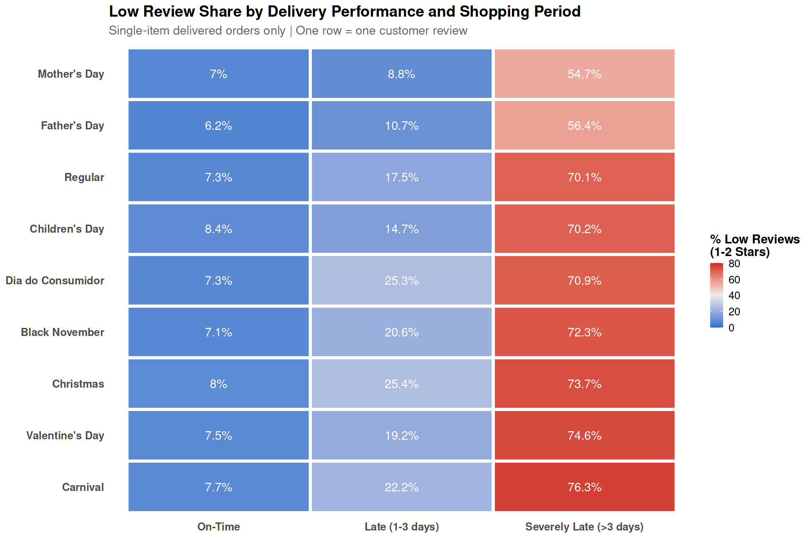
    


    _ _ _ _ _ _ _ _ _ _ _ _ _ _ _ _ _ _ _ _ _ _ _ _ _ _ _ _ _ _ _ _ _ _ _ _ _ _ _ _ _ _ _ _ _ _ _ _ _ _ _ _ _ _ _ _ _ _ _ _ 
    


    

    


    
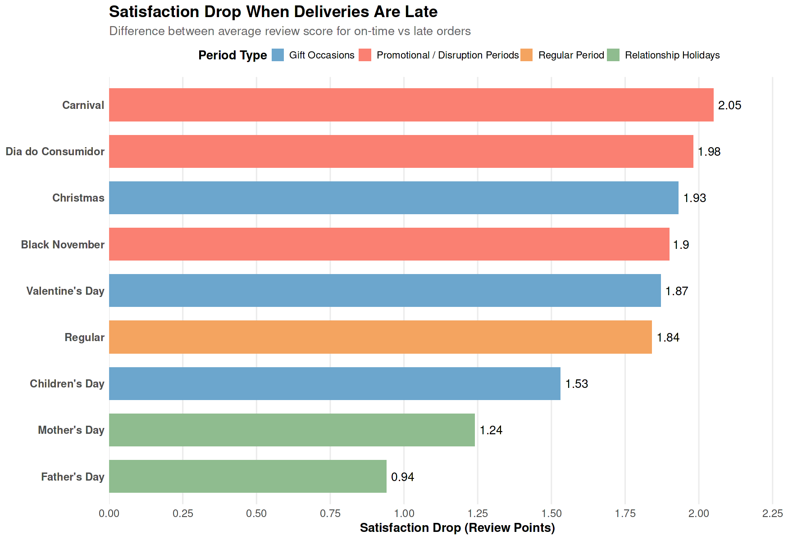
    


```R
# Scatter plot: Satisfaction impact vs revenue risk

scatter_data <- impact_comparison %>%
  select(shopping_period, satisfaction_drop) %>%
  left_join(
    revenue_risk_by_period %>% 
      filter(is_late == TRUE) %>%
      select(shopping_period, pct_revenue_at_risk),
    by = "shopping_period") %>%
  left_join(
    delay_impact_by_period %>%
      group_by(shopping_period) %>%
      summarise(total_orders = sum(orders_n), .groups = "drop"),
    by = "shopping_period") %>%
  mutate(
    period_type = case_when(
      shopping_period %in% c("Mother's Day", "Father's Day") ~ "Family Holidays",
      shopping_period %in% c("Valentine's Day", "Children's Day", "Christmas") ~ "Gift Occasions",
      shopping_period %in% c("Black November", "Carnival", "Dia do Consumidor") ~ "Promotional / Disruption Periods",
      TRUE ~ "Regular Period"))

options(repr.plot.width = 15, repr.plot.height = 10)

ggplot(scatter_data, aes(
    x = satisfaction_drop,
    y = pct_revenue_at_risk,
    size = total_orders,
    color = period_type)) +
  geom_point(alpha = 0.7) +
  geom_text_repel(
    aes(label = shopping_period),
    size = 4.5,
    color = "black",
    box.padding = 0.5,
    point.padding = 0.3,
    segment.color = "grey31",
    segment.size = 0.3,
    max.overlaps = 20,
    show.legend = FALSE) +
  scale_size_continuous(
    name = "Order Volume",
    range = c(3, 20),
    labels = scales::comma) +
  scale_color_brewer(
    palette = "Set2",
    name = "Period Type") +
  scale_x_continuous(
    limits = c(0.5, 2.2),
    breaks = seq(0.5, 2, 0.25)) +
  scale_y_continuous(
    limits = c(25, 75),
    breaks = seq(25, 75, 5)) +
  labs(
    title = "Revenue Risk vs Satisfaction Impact by Shopping Period",
    subtitle = "Single-item delivered orders only | Bubble size = reviewed order volume",
    x = "Satisfaction Drop When Late (Review Points)",
    y = "Revenue at Risk from Late Deliveries (%)") +
  theme_minimal(base_size = 14, base_family = "Arial") +
  theme(
    plot.title = element_text(face = "bold", size = 22),
    plot.subtitle = element_text(size = 16, color = "gray40"),
    axis.title.x = element_text(size = 16, face = "bold"),
    axis.title.y = element_text(size = 16, face = "bold"),
    axis.text = element_text(size = 16),
    legend.title = element_text(face = "bold", size = 16, color = "black"),
    legend.text = element_text(size = 16, color = "black"),
    panel.background = element_rect(fill = "white", color = NA),
    plot.background = element_rect(fill = "white", color = NA),
    panel.grid.minor = element_blank())

# Waterfall chart: Revenue linked to poor reviews among late deliveries

waterfall_data <- revenue_risk_by_period %>%
  filter(is_late == TRUE) %>%
  select(shopping_period, revenue_at_risk) %>%
  arrange(desc(revenue_at_risk)) %>%
  mutate(
    revenue_at_risk_k = revenue_at_risk / 1000,
    end = cumsum(revenue_at_risk_k),
    start = lag(end, default = 0),
    id = row_number(),
    type = "period")

total_row <- data.frame(
  shopping_period = "Total at Risk",
  revenue_at_risk = sum(waterfall_data$revenue_at_risk),
  revenue_at_risk_k = sum(waterfall_data$revenue_at_risk_k),
  end = sum(waterfall_data$revenue_at_risk_k),
  start = 0,
  id = nrow(waterfall_data) + 1,
  type = "total")

waterfall_merged <- bind_rows(waterfall_data, total_row) %>%
  mutate(shopping_period = factor(shopping_period, levels = shopping_period))

options(repr.plot.width = 15, repr.plot.height = 10)

ggplot(waterfall_merged, aes(x = shopping_period, fill = type)) +
  geom_rect(
    aes(
      xmin = id - 0.4,
      xmax = id + 0.4,
      ymin = start,
      ymax = end
    )
  ) +
  geom_segment(
    data = waterfall_data,
    aes(
      x = id + 0.4,
      xend = id + 0.6,
      y = end,
      yend = end
    ),
    linetype = "dashed",
    color = "gray50",
    linewidth = 0.5
  ) +
  geom_text(
    aes(
      x = id,
      y = end,
      label = paste0("R$", round(revenue_at_risk_k, 0), "K")
    ),
    vjust = -0.5,
    size = 4
  ) +
  scale_fill_manual(
    values = c("period" = "#4682B4", "total" = "Tomato"),
    labels = c("period" = "Shopping Period", "total" = "Total"),
    name = NULL
  ) +
  scale_y_continuous(
    labels = scales::dollar_format(prefix = "R$", suffix = "K"),
    expand = expansion(mult = c(0, 0.15))
  ) +
  labs(
    title = "Cumulative Revenue Linked to Poor Reviews Among Late Deliveries",
    subtitle = "Single-item delivered orders only | Revenue at risk = late orders with review score ≤ 2",
    x = NULL,
    y = "Cumulative Revenue at Risk"
  ) +
  theme_minimal(base_size = 14, base_family = "Arial") +
  theme(
    plot.title = element_text(face = "bold", size = 22),
    plot.subtitle = element_text(size = 16, color = "gray40"),
    axis.title.y = element_text(face = "bold", size = 16),
    axis.text.x = element_text(angle = 45, hjust = 1, size = 16, face = "bold"),
    axis.text.y = element_text(size = 16),
    legend.text = element_text(size = 16),
    legend.position = "top",
    panel.background = element_rect(fill = "white", color = NA),
    plot.background = element_rect(fill = "white", color = NA),
    panel.grid.major.x = element_blank(),
    panel.grid.minor = element_blank()
  )


cat("\nRevenue at Risk Contribution:\n")
cat(rep("_", 30), "\n")


waterfall_data %>%
  mutate(
    pct_of_total = round((revenue_at_risk / sum(revenue_at_risk)) * 100, 1)
  ) %>%
  select(shopping_period, revenue_at_risk_k, pct_of_total) %>%
  arrange(desc(revenue_at_risk_k)) %>%
  print(n = Inf)
```


    
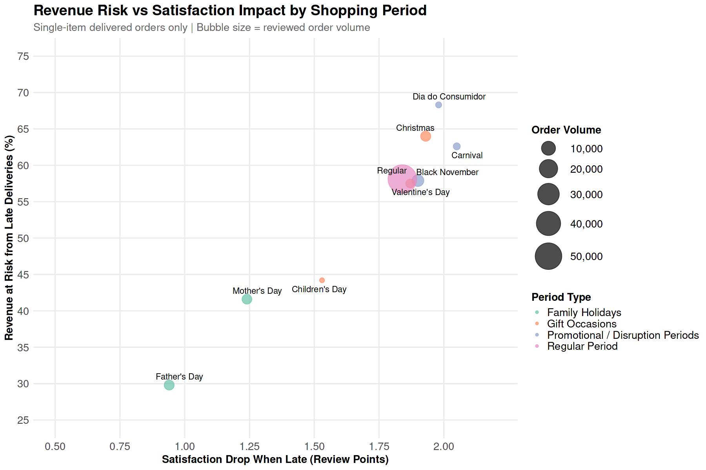
    


    
    Revenue at Risk Contribution:
    _ _ _ _ _ _ _ _ _ _ _ _ _ _ _ _ _ _ _ _ _ _ _ _ _ _ _ _ _ _ 
    # A tibble: 9 × 3
      shopping_period   revenue_at_risk_k pct_of_total
      <chr>                         <dbl>        <dbl>
    1 Regular                      409.           62.9
    2 Black November                85.0          13.1
    3 Christmas                     42.6           6.5
    4 Dia do Consumidor             35.3           5.4
    5 Mother's Day                  23.7           3.6
    6 Carnival                      20.9           3.2
    7 Father's Day                  17.0           2.6
    8 Valentine's Day               11.8           1.8
    9 Children's Day                 4.59          0.7
    


    
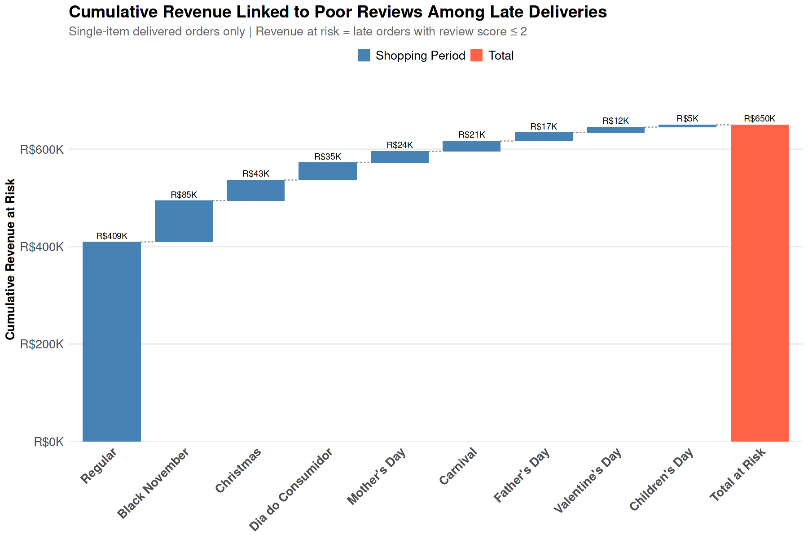
    


#### Key Insights and Summary

**Order distribution:** Regular periods dominate the dataset (~ 60K orders), followed by Black November (~ 6.5K) and major holidays (~ 3–4K each). Carnival and Dia do Consumidor are smaller in volume (~ 1.5–2K orders), but still meaningful for analysis.

---

#### Do delays during holidays hurt more? 

**Short answer: yes — but only slightly.**

To formally test this, an interaction (moderation) linear regression model was used:

> `review_score ~ delay_vs_eta * is_holiday_period`

This model answers three key questions:
- Do delays hurt reviews in general?
- Are reviews lower during holidays even without delays?
- Do delays hurt more during holidays?

---

### Model interpretation

- **Intercept ~ 3.82** ➡︎ expected review score for on-time deliveries during regular periods.

- **delay_vs_eta = -0.0359 (p < 0.001)** ➡︎ each additional day of delay reduces the review score by ~ 0.036 points ➡︎ strong and consistent negative effect.

- **is_holiday_period = -0.0363 (p < 0.01)** ➡︎ even on-time holiday orders receive slightly lower reviews. Likely reflects higher expectations and emotional context.

- **delay_vs_eta × holiday = -0.0034 (p < 0.001)** ➡︎ delays hurt slightly more during holidays (~ 0.003 extra penalty per day).  
Statistically significant, but practically small.

- **Model fit: R2 ~ 0.093** ➡︎ about 9% of review variability is explained by delays and timing.  
Most satisfaction is driven by other factors (product quality, expectations, service).

---

**What the model actually tells me?** 

> ***Delays are always harmful, and holidays slightly amplify the effect, but not dramatically.***

The idea that customers are “much less forgiving” during holidays is **not strongly supported at an aggregate level**.

---

### Where delays hurt the most (by period)

Looking beyond the model:

**Highest satisfaction drop when late:**
> - Carnival: -2.05    
> - Dia do Consumidor: -1.98    
> - Christmas: -1.93    
> - Black November: -1.90    
> - Regular: -1.84    

**Lower impact:**
> - Mother’s Day: -1.24    
> - Father’s Day: -0.94    

---

### What is actually driving the differences?

The main driver is **delay severity, not holiday type**.

- High-impact periods ➡︎ delays ~ 10–11 days  
- Lower-impact periods ➡︎ delays ~ 4–6 days  

So ➡︎ **Customers are not more forgiving during certain holidays — they are reacting to how bad the delay is.**

---

### Special cases

**Carnival:** acts as a logistics disruption period ➡︎ highest satisfaction drop.

**Christmas:** combines high expectations + high volume ➡︎ high risk.

**Black November:** High total impact due to volume, but not the worst per-order risk ➡︎ suggests demand smoothing works.

---

### Financial impact

**Largest contributors to total revenue at risk:**
- Regular period: ~ 63%  
- Black November: ~ 13%  
- Christmas: ~ 6.5%  

**Highest per-order risk:**
- Dia do Consumidor: 68.3%  
- Christmas: 64.0%  
- Carnival: 62.6%  

---

### Final takeaway

The model confirms, that delays are a strong and consistent driver of dissatisfaction. Holiday periods add a small additional penalty, but the dominant factor is delay severity.

> *The biggest opportunity is to reduce severe delays — especially during high-volume and disruption-heavy periods — rather than assuming that holidays fundamentally change customer tolerance*.


### **Geographic Delay Analysis**  
### **Question 17: "Which Brazilian states and cities experience the worst delivery performance, and is poor logistics performance driven by seller location, customer location, or specific shipping routes?"** 

Earlier, in Business Questions 13 and 14, I've established, that delivery delay is one of the strongest operational drivers of customer dissatisfaction. In the single-item order-level analysis, each additional day of delay is associated with an average decrease of approximately 0.036 review points, and orders delivered more than 3 days late show very high negative-review rates, often around 73% depending on the period analyzed.

In Business Question 15, I further established that seller behavior is a critical contributor to delay-related dissatisfaction. The results show, that a concentrated group of high-risk sellers is disproportionately associated with slow processing, late delivery, and poor review outcomes.

However, knowing that "delays matter" and "which sellers cause delays" doesn't tell operations teams where to intervene geographically. There are still some critical unanswered questions:

- Are problem sellers geographically clustered?
- Do certain states create unavoidable delays?
- Do certain routes consistently fail?

If delays are concentrated in specific states or cities, Olist can:

1. Prioritize logistics partnerships in high-delay regions (negotiate better rates with regional carriers, establish fulfillment centers closer to problem areas)
2. Screen sellers by location during onboarding - if sellers in remote states consistently deliver late, implement stricter performance requirements or discourage marketplace participation from those regions
3. Set realistic delivery estimates by geography - instead of one-size-fits-all ETAs, adjust promised delivery windows based on historical performance per route
4. Quantify infrastructure gaps for investment decisions

Additionally, this analysis will reveal whether delays are a seller behavior problem (certain sellers ship late regardless of destination) or a logistics infrastructure problem (certain routes are consistently slow). Answering this business question will show, if those problem sellers are geographically clustered or if Brazil's logistics network itself is the bottleneck.


```R
# Once again to be sure: How many orders have multiple sellers?

multi_seller_orders <- order_items %>%
  group_by(order_id) %>%
  summarise(unique_sellers = n_distinct(seller_id), items_count = n(), .groups = "drop") %>%
  filter(unique_sellers > 1)

cat(sprintf("Orders with multiple sellers: %d (%.1f%%)\n",
            nrow(multi_seller_orders), nrow(multi_seller_orders) / n_distinct(order_items$order_id) * 100))

multi_seller_orders %>%
  count(unique_sellers) %>%
  arrange(desc(unique_sellers))
```

    Orders with multiple sellers: 1278 (1.3%)
    


<table class="dataframe">
<caption>A tibble: 4 × 2</caption>
<thead>
	<tr><th scope=col>unique_sellers</th><th scope=col>n</th></tr>
	<tr><th scope=col>&lt;int&gt;</th><th scope=col>&lt;int&gt;</th></tr>
</thead>
<tbody>
	<tr><td>5</td><td>   2</td></tr>
	<tr><td>4</td><td>   3</td></tr>
	<tr><td>3</td><td>  54</td></tr>
	<tr><td>2</td><td>1219</td></tr>
</tbody>
</table>


Before proceeding with geographic delay analysis, it's critical to address data granularity: Olist orders can contain items from multiple sellers, creating ambiguity in assigning geographic origin to each order.

While only 1.3% of orders involve multiple sellers, ignoring this creates methodological problems for my business question:

- If I assign each order to a single "primary" seller, I will lose visibility into secondary sellers' geographic patterns. If problematic sellers are concentrated in specific states, collapsing multi-seller orders could mask this clustering.
- A single order shipping from 2 different locations represent two distinct logistics relationships with different delivery performance. Treating this as one route can ignore important bottlenecks.

Overall, to test whether those problematic sellers are geographically clustered, I need seller-level geographic analysis, not order-level.

I will analyze this problem at the seller × order granularity, where:
- each unique seller-order combination is one observation
- multi-seller orders appear multiple times (once per seller)
- metrics report both seller-order pairs (total observations) and unique orders (distinct order count)

This will ensure, that I captured all seller-geography relationships and transparently reported true order volumes.

#### **Terminology and Methodology Notes**

**Geographic Delay Metrics**:   
In this analysis I calculate **end-to-end delivery delays**, grouped by geographic location, to identify whether delays are driven by origin (seller state) or destination (customer state) infrastructure:

🔹`seller_delay` (more accurately: "origin state delay"): average delay vs. ETA for orders shipped FROM sellers in State X to any destination. Includes seller processing time, carrier pickup, transit and final delivery. A high `seller_delay` will indicate problems with outbound logistics from that state X.    

🔹`customer_delay` (more accurately: "destination state delay"): average delay vs. ETA for orders delivered TO customers in State X from any origin. Reflects the difficulty of reaching that state through Brazil's logistics network.  

🔹`delay_difference`: `seller_delay` - `customer_delay`. Positive values (>+1 day) will indicate seller location problems (harder to ship FROM than TO), while negative values (<-1 day) indicate customer location problems (harder to ship TO than FROM). I classify values between -1 and +1 as "balanced."  

These metrics measure total supply chain performance by geography, not individual seller behavior (like carrier handoff timing). They reveal systemic infrastructure bottlenecks, rather than seller-specific issues.

**Statistical Reliability Thresholds:**  
To ensure analysis is based on reliable patterns rather than noise, I applied the following volume thresholds:

🔹`≥30 seller-order pairs`: Central Limit Theorem "dictates" n≥30 for normally distributed means, but I have already established, that Olist data has a "heavy" right tail (extreme delays). I will stick to n≥30, as it will ensure sufficient robustness of the mean delay estimate, limiting the influence of extreme outliers.  

🔹`≥100 unique orders`: threshold for "high-volume" routes requiring operational attention. Routes with 100+ orders represent meaningful business volume where logistics improvements have measurable ROI. Below this threshold, routes are analyzed, but flagged as lower priority.  

🔹`≥50 seller-order pairs`: Mid-range threshold for regional and intra-state analyses, balancing sample size reliability with coverage of important secondary routes.  


```R
# PART 1: OVERVIEW
# Seller-order pair level analysis (each unique seller-order combination is one observation):

geo_delays <- delivered_orders_delay %>%
  filter(!is.na(delay_vs_eta)) %>%
  group_by(order_id, seller_id, customer_id) %>%
  summarise(
    items_n = n(),
    delay_vs_eta = mean(delay_vs_eta, na.rm = TRUE),
    order_to_delivery_days = mean(order_to_delivery_days, na.rm = TRUE), .groups = "drop")

geo_delays <- geo_delays %>%
  left_join(customers %>% select(customer_id, customer_city, customer_state), by = "customer_id") %>%
  left_join(sellers %>% select(seller_id, seller_city, seller_state), by = "seller_id") %>%
  filter(!is.na(customer_state), !is.na(seller_state))

state_region <- tibble(
  state = c(
    "SP","RJ","MG","ES", # Southeast -> 4
    "RS","SC","PR",  # South -> 3
    "BA","SE","AL","PE","PB","RN","CE","PI","MA",  # Northeast -> 9
    "GO","DF","MT","MS",  # Central-West -> 4
    "AM","RR","AP","PA","TO","RO","AC"), # North -> 7
  
  region = c(rep("Southeast", 4), rep("South", 3), rep("Northeast", 9), rep("Central-West", 4), rep("North", 7)))

geo_delays <- geo_delays %>%
  mutate(is_late = delay_vs_eta > 0, is_very_late = delay_vs_eta > 3,
    same_state = seller_state == customer_state,
    route = paste0(seller_state, " ➡︎ ", customer_state)) %>%
  left_join(state_region %>% rename(customer_region = region), by = c("customer_state" = "state")) %>%
  left_join(state_region %>% rename(seller_region = region), by = c("seller_state" = "state")) %>%
  mutate(same_region = seller_region == customer_region)
  

cat("\n\nGEOGRAPHIC DELAY ANALYSIS (at seller-order pair level)\n")

cat("Analysis unit: Each seller-order combination\n")
cat("Important: Multi-seller orders appear multiple times (once per seller)\n\n")
cat("Total seller-order pairs:", nrow(geo_delays), "\n")
cat("Unique orders:", n_distinct(geo_delays$order_id), "\n")
cat("Unique sellers:", n_distinct(geo_delays$seller_id), "\n")
cat("States covered - Customers:", n_distinct(geo_delays$customer_state), "\n")
cat("States covered - Sellers:", n_distinct(geo_delays$seller_state), "\n")
cat("Unique routes:", n_distinct(geo_delays$route), "\n\n")


# Checking multi-seller order prevalence:

multi_seller_check <- geo_delays %>%
  group_by(order_id) %>%
  summarise(sellers_per_order = n_distinct(seller_id), .groups = "drop") %>%
  mutate(order_type = ifelse(sellers_per_order == 1, "Single-seller", "Multi-seller"))

multi_seller_summary <- multi_seller_check %>%
  group_by(order_type) %>%
  summarise(orders_n = n(), .groups = "drop") %>%
  mutate(pct = round(orders_n / sum(orders_n) * 100, 1))

cat("MULTI-SELLER ORDER PREVALENCE:\n")
cat(rep("_", 60), "\n")
print(multi_seller_summary)
cat("\n")
```

    
    
    GEOGRAPHIC DELAY ANALYSIS (at seller-order pair level)
    Analysis unit: Each seller-order combination
    Important: Multi-seller orders appear multiple times (once per seller)
    
    Total seller-order pairs: 97811 
    Unique orders: 96470 
    Unique sellers: 2970 
    States covered - Customers: 27 
    States covered - Sellers: 21 
    Unique routes: 408 
    
    MULTI-SELLER ORDER PREVALENCE:
    _ _ _ _ _ _ _ _ _ _ _ _ _ _ _ _ _ _ _ _ _ _ _ _ _ _ _ _ _ _ _ _ _ _ _ _ _ _ _ _ _ _ _ _ _ _ _ _ _ _ _ _ _ _ _ _ _ _ _ _ 
    # A tibble: 2 × 3
      order_type    orders_n   pct
      <chr>            <int> <dbl>
    1 Multi-seller      1275   1.3
    2 Single-seller    95195  98.7
    
    

**PART 1: Summary and Key insights:**

**Analysis scope:**  
   🔹 Only 1.3% of all orders are multi-seller ones (1275 out of 96470 orders); 98.7% of orders are single-seller (95195 orders)    
   🔹 Total seller-order pairs: 97811, out of which 96470 unique orders: so 1341 extra pairs created by those 1275 multi-seller orders   (additional seller entries beyond the first seller in multi-seller orders). My seller-order pair analysis approach does not significantly inflate counts. So technically I could have used orders instead of seller-order pairs     
   🔹 All 27 Brazilian states have customers, only 21 states have sellers ➜ 6 states are customer only    
   🔹 408 state-to-state combinations observed (out of 21*27 = 567 possible ones, 72% coverage, meaning 159 routes (28%) have zero observed orders in Olist dataset (customer-only states))  


```R
# PART 2: STATE-LEVEL ANALYSIS -> which states are problematic and why?

cat("PART 2: STATE-LEVEL ANALYSIS (Which states are problematic and why?)\n")
cat("\n\n")


# Customer state analysis:

customer_state_perf <- geo_delays %>%
  group_by(customer_state) %>%
  summarise(
    seller_order_pairs = n(),
    unique_orders = n_distinct(order_id),
    avg_delay_vs_eta = round(mean(delay_vs_eta, na.rm = TRUE), 1),
    avg_delivery_days = round(mean(order_to_delivery_days, na.rm = TRUE), 1),  
    late_rate = round(mean(is_late, na.rm = TRUE) * 100, 1),
    severe_late_rate = round(mean(is_very_late, na.rm = TRUE) * 100, 1),
    .groups = "drop") %>%
  mutate(volume_pct = round((unique_orders / sum(unique_orders)) * 100, 1)) %>%
  arrange(desc(avg_delivery_days))

cat("DELIVERY PERFORMANCE BY DESTINATION (CUSTOMER STATE -> 27 Brazilian states ranked by delivery time)\n")
cat("\n\n")
print(customer_state_perf, n = Inf)


# Seller state analysis: 

seller_state_perf <- geo_delays %>%
  group_by(seller_state) %>%
  summarise(
    seller_order_pairs = n(),
    unique_sellers = n_distinct(seller_id),
    unique_orders = n_distinct(order_id),
    avg_delay_vs_eta = round(mean(delay_vs_eta, na.rm = TRUE), 1),
    avg_delivery_days = round(mean(order_to_delivery_days, na.rm = TRUE), 1),  # FIXED
    late_rate = round(mean(is_late, na.rm = TRUE) * 100, 1),
    severe_late_rate = round(mean(is_very_late, na.rm = TRUE) * 100, 1), .groups = "drop") %>%
  mutate(
    volume_pct = round((unique_orders / sum(unique_orders)) * 100, 1),
    pairs_per_seller = round(seller_order_pairs / unique_sellers, 1)) %>%
  arrange(desc(avg_delivery_days))

cat("\n\nDELIVERY PERFORMANCE BY ORIGIN (SELLER STATE -> 21 seller states ranked by delivery time)\n")
cat("\n\n")
print(seller_state_perf, n = Inf)


# Seller concentration analysis: 

seller_concentration <- seller_state_perf %>%
  select(seller_state, unique_sellers, unique_orders, pairs_per_seller, avg_delivery_days) %>%
  arrange(desc(unique_sellers))

cat("\n\nSELLER CONCENTRATION BY STATE\n")
cat("\n\n")
print(seller_concentration, n = Inf)


# Seller vs. Customer location effect:

state_comparison <- customer_state_perf %>%
  select(state = customer_state, customer_orders = unique_orders, customer_delay = avg_delivery_days, customer_late_rate = late_rate) %>%
  full_join(seller_state_perf %>%
      select(state = seller_state, seller_orders = unique_orders, seller_delay = avg_delivery_days, seller_late_rate = late_rate), by = "state") %>%
  mutate(
    delay_difference = seller_delay - customer_delay,
    primary_bottleneck = case_when(
      is.na(seller_delay) ~ "Customer-only state",
      is.na(customer_delay) ~ "Seller-only state",
      abs(delay_difference) < 1 ~ "Balanced",
      delay_difference > 1 ~ "Seller location problem",
      delay_difference < -1 ~ "Customer location problem",
      TRUE ~ "Balanced")) %>%
  arrange(desc(abs(delay_difference)))

cat("\n\nSELLER VS. CUSTOMER LOCATION EFFECT\n")
cat("\n\n")
print(state_comparison, n = Inf)


# Bottleneck type distribution:

bottleneck_summary <- state_comparison %>%
  group_by(primary_bottleneck) %>%
  summarise(states_n = n(), .groups = "drop") %>%
  arrange(desc(states_n))

cat("\n\nBOTTLENECK TYPE DISTRIBUTION\n")
cat("\n\n")
print(bottleneck_summary)


# High-volume problematic states:

problem_customer_states <- customer_state_perf %>%
  filter(unique_orders >= 100, avg_delay_vs_eta > median(customer_state_perf$avg_delay_vs_eta)) %>%
  arrange(desc(unique_orders))

cat("\n\nHIGH-VOLUME PROBLEMATIC STATES (CUSTOMERS)\n")
cat("Threshold: >100 unique orders, above-median delay vs ETA\n")
cat("\n\n")
print(problem_customer_states, n = Inf)
```

    PART 2: STATE-LEVEL ANALYSIS (Which states are problematic and why?)
    
    
    DELIVERY PERFORMANCE BY DESTINATION (CUSTOMER STATE -> 27 Brazilian states ranked by delivery time)
    
    
    # A tibble: 27 × 8
       customer_state seller_order_pairs unique_orders avg_delay_vs_eta avg_delivery_days late_rate severe_late_rate volume_pct
       <chr>                       <int>         <int>            <dbl>             <dbl>     <dbl>            <dbl>      <dbl>
     1 RR                             41            41            -16.6              29.3      12.2             12.2        0  
     2 AP                             67            67            -19.1              27.2       4.5              1.5        0.1
     3 AM                            145           145            -18.9              26.4       4.1              2.1        0.2
     4 AL                            399           397             -8.1              24.5      23.8             19.3        0.4
     5 PA                            955           946            -13.4              23.7      12.4             10.2        1  
     6 MA                            729           717             -9                21.4      19.5             13.7        0.7
     7 SE                            338           335             -9.3              21.4      15.1             13          0.3
     8 CE                           1290          1279            -10.2              21.1      15.2             11.7        1.3
     9 AC                             80            80            -20.1              21         3.8              2.5        0.1
    10 PB                            521           517            -12.6              20.3      10.9              8.6        0.5
    11 PI                            478           476            -10.7              19.4      15.9             11.1        0.5
    12 RO                            246           243            -19.6              19.3       2.8              2          0.3
    13 BA                           3294          3256            -10.2              19.2      13.9             10.1        3.4
    14 RN                            478           474            -13                19.2      10.7              7.9        0.5
    15 PE                           1602          1593            -12.7              18.4      10.7              8.1        1.7
    16 MT                            905           886            -13.9              17.9       6.7              4.6        0.9
    17 TO                            282           274            -11.6              17.4      12.4              7.4        0.3
    18 ES                           2022          1995             -9.9              15.7      12.1              8.5        2.1
    19 GO                           1988          1957            -11.5              15.5       8                5          2  
    20 MS                            708           701            -10.4              15.5      11.6              6.9        0.7
    21 RJ                          12515         12350            -11.1              15.2      13.3             10.2       12.8
    22 RS                           5442          5344            -13.3              15.2       7                4.9        5.5
    23 SC                           3588          3546            -10.9              14.9       9.6              6.3        3.7
    24 DF                           2106          2080            -11.4              12.8       7                4.2        2.2
    25 MG                          11523         11354            -12.6              11.9       5.5              3.3       11.8
    26 PR                           4987          4923            -12.7              11.9       4.9              2.9        5.1
    27 SP                          41082         40494            -10.5               8.7       5.8              3.2       42  
    
    
    DELIVERY PERFORMANCE BY ORIGIN (SELLER STATE -> 21 seller states ranked by delivery time)
    
    
    # A tibble: 21 × 10
       seller_state seller_order_pairs unique_sellers unique_orders avg_delay_vs_eta avg_delivery_days late_rate severe_late_rate volume_pct pairs_per_seller
       <chr>                     <int>          <int>         <int>            <dbl>             <dbl>     <dbl>            <dbl>      <dbl>            <dbl>
     1 AM                            3              1             3              9.3              48        66.7             33.3        0                3  
     2 CE                           87             12            87            -12.8              17.7       9.2              6.9        0.1              7.2
     3 MA                          389              1           389            -10.7              17.6      23.1             16.2        0.4            389  
     4 RO                           14              2            14            -23.9              17.4       0                0          0                7  
     5 MT                          136              4           136            -15                14.7       4.4              3.7        0.1             34  
     6 BA                          553             19           553            -11.9              13.9       6                4.2        0.6             29.1
     7 PI                           11              1            11            -14.3              13.7       0                0          0               11  
     8 SC                         3770            191          3765            -13.4              13.5       5.7              3.8        3.9             19.7
     9 PR                         7662            346          7618            -13.5              13.3       6.4              4.4        7.9             22.1
    10 RN                           49              4            49            -13                13.3      10.2              8.2        0.1             12.2
    11 ES                          310             22           310            -12.4              13         7.1              4.2        0.3             14.1
    12 GO                          451             39           451            -13.3              12.8       4                2.2        0.5             11.6
    13 MG                         7901            242          7889            -12.7              12.7       5.5              3.8        8.1             32.6
    14 PE                          403              9           403            -15.1              12.7       4.5              2.5        0.4             44.8
    15 PB                           35              6            35            -18.5              12.6       5.7              0          0                5.8
    16 SE                            9              2             9            -16.9              12.6       0                0          0                4.5
    17 DF                          809             31           809            -12.6              12.4       6.1              3.8        0.8             26.1
    18 SP                        68830           1737         68081            -10.5              12.3       8.7              5.7       70.2             39.6
    19 MS                           49              5            49            -16.9              12.1       8.2              6.1        0.1              9.8
    20 RJ                         4370            168          4367            -11.7              12.1       8.4              5.7        4.5             26  
    21 RS                         1970            128          1968            -15.5              11.4       4.3              2.6        2               15.4
    
    
    SELLER CONCENTRATION BY STATE
    
    
    # A tibble: 21 × 5
       seller_state unique_sellers unique_orders pairs_per_seller avg_delivery_days
       <chr>                 <int>         <int>            <dbl>             <dbl>
     1 SP                     1737         68081             39.6              12.3
     2 PR                      346          7618             22.1              13.3
     3 MG                      242          7889             32.6              12.7
     4 SC                      191          3765             19.7              13.5
     5 RJ                      168          4367             26                12.1
     6 RS                      128          1968             15.4              11.4
     7 GO                       39           451             11.6              12.8
     8 DF                       31           809             26.1              12.4
     9 ES                       22           310             14.1              13  
    10 BA                       19           553             29.1              13.9
    11 CE                       12            87              7.2              17.7
    12 PE                        9           403             44.8              12.7
    13 PB                        6            35              5.8              12.6
    14 MS                        5            49              9.8              12.1
    15 MT                        4           136             34                14.7
    16 RN                        4            49             12.2              13.3
    17 RO                        2            14              7                17.4
    18 SE                        2             9              4.5              12.6
    19 AM                        1             3              3                48  
    20 MA                        1           389            389                17.6
    21 PI                        1            11             11                13.7
    
    
    SELLER VS. CUSTOMER LOCATION EFFECT
    
    
    # A tibble: 27 × 9
       state customer_orders customer_delay customer_late_rate seller_orders seller_delay seller_late_rate delay_difference primary_bottleneck       
       <chr>           <int>          <dbl>              <dbl>         <int>        <dbl>            <dbl>            <dbl> <chr>                    
     1 AM                145           26.4                4.1             3         48               66.7           21.6   Seller location problem  
     2 SE                335           21.4               15.1             9         12.6              0             -8.8   Customer location problem
     3 PB                517           20.3               10.9            35         12.6              5.7           -7.7   Customer location problem
     4 RN                474           19.2               10.7            49         13.3             10.2           -5.9   Customer location problem
     5 PI                476           19.4               15.9            11         13.7              0             -5.7   Customer location problem
     6 PE               1593           18.4               10.7           403         12.7              4.5           -5.7   Customer location problem
     7 BA               3256           19.2               13.9           553         13.9              6             -5.3   Customer location problem
     8 RS               5344           15.2                7            1968         11.4              4.3           -3.8   Customer location problem
     9 MA                717           21.4               19.5           389         17.6             23.1           -3.80  Customer location problem
    10 SP              40494            8.7                5.8         68081         12.3              8.7            3.6   Seller location problem  
    11 CE               1279           21.1               15.2            87         17.7              9.2           -3.40  Customer location problem
    12 MS                701           15.5               11.6            49         12.1              8.2           -3.4   Customer location problem
    13 MT                886           17.9                6.7           136         14.7              4.4           -3.2   Customer location problem
    14 RJ              12350           15.2               13.3          4367         12.1              8.4           -3.1   Customer location problem
    15 ES               1995           15.7               12.1           310         13                7.1           -2.7   Customer location problem
    16 GO               1957           15.5                8             451         12.8              4             -2.7   Customer location problem
    17 RO                243           19.3                2.8            14         17.4              0             -1.90  Customer location problem
    18 SC               3546           14.9                9.6          3765         13.5              5.7           -1.4   Customer location problem
    19 PR               4923           11.9                4.9          7618         13.3              6.4            1.4   Seller location problem  
    20 MG              11354           11.9                5.5          7889         12.7              5.5            0.800 Balanced                 
    21 DF               2080           12.8                7             809         12.4              6.1           -0.400 Balanced                 
    22 RR                 41           29.3               12.2            NA         NA               NA             NA     Customer-only state      
    23 AP                 67           27.2                4.5            NA         NA               NA             NA     Customer-only state      
    24 AL                397           24.5               23.8            NA         NA               NA             NA     Customer-only state      
    25 PA                946           23.7               12.4            NA         NA               NA             NA     Customer-only state      
    26 AC                 80           21                  3.8            NA         NA               NA             NA     Customer-only state      
    27 TO                274           17.4               12.4            NA         NA               NA             NA     Customer-only state      
    
    
    BOTTLENECK TYPE DISTRIBUTION
    
    
    # A tibble: 4 × 2
      primary_bottleneck        states_n
      <chr>                        <int>
    1 Customer location problem       16
    2 Customer-only state              6
    3 Seller location problem          3
    4 Balanced                         2
    
    
    HIGH-VOLUME PROBLEMATIC STATES (CUSTOMERS)
    Threshold: >100 unique orders, above-median delay vs ETA
    
    
    # A tibble: 13 × 8
       customer_state seller_order_pairs unique_orders avg_delay_vs_eta avg_delivery_days late_rate severe_late_rate volume_pct
       <chr>                       <int>         <int>            <dbl>             <dbl>     <dbl>            <dbl>      <dbl>
     1 SP                          41082         40494            -10.5               8.7       5.8              3.2       42  
     2 RJ                          12515         12350            -11.1              15.2      13.3             10.2       12.8
     3 SC                           3588          3546            -10.9              14.9       9.6              6.3        3.7
     4 BA                           3294          3256            -10.2              19.2      13.9             10.1        3.4
     5 DF                           2106          2080            -11.4              12.8       7                4.2        2.2
     6 ES                           2022          1995             -9.9              15.7      12.1              8.5        2.1
     7 GO                           1988          1957            -11.5              15.5       8                5          2  
     8 CE                           1290          1279            -10.2              21.1      15.2             11.7        1.3
     9 MA                            729           717             -9                21.4      19.5             13.7        0.7
    10 MS                            708           701            -10.4              15.5      11.6              6.9        0.7
    11 PI                            478           476            -10.7              19.4      15.9             11.1        0.5
    12 AL                            399           397             -8.1              24.5      23.8             19.3        0.4
    13 SE                            338           335             -9.3              21.4      15.1             13          0.3
    

**PART 2: Summary and Key insights:**

**Customer state performance (delivery performance by destination)**  

**Tier 1: North Region (20-29 days delivery)**  
🔹 Slowest destinations: RR, AP, AM (26-29 days) + AL from Northeast (24.5 days)  
🔹 Why so slow? Geographic isolation (Amazon region), low seller presence, weak transportation networks (reliance on air/river transport)  
🔹 AL (Alagoas) is the outlier: 23.8% late rate (worst in Brazil!), 19.3% severe late rate. Suggests poor logistics execution, not just geography  

**Tier 2: Northeast Region (18-21 days delivery)**    
🔹 Systematically slower: BA, CE, MA, SE, PI (19-21 days)  
🔹 High late rates despite longer ETAs: ETAs not adjusted enough for infrastructure reality  
🔹 Opportunity: BA could be Northeast fulfillment hub (3.4% of Brazil's orders, decent seller base)  

**Tier 3: Southeast/South Core (9-15 days delivery)**    
🔹 Why fast? ➜ Dense seller network (~59% of sellers in SP alone), many intra-state/intra-region orders, best infrastructure (roads, airports, warehouses)  
🔹 SP = Brazil's E-commerce capital: 42% of all orders delivered there, 8.7 days average, 5.8% late rate  

➡️ Customers in the North wait ~2x longer than those in the Southeast  

<br>

**Delivery performance by origin (seller state)**  

**Best Performers:**  
🔹 Southern sellers outperform: RS (11.4 days, 4.3% late rate - best in Brazil!), SC (13.5 days, 5.7% late), PR (13.3 days, 6.4% late)  
🔹 SP sellers dominate: 1737 sellers (58.5% of Brazil), 68081 orders (70.2% of volume!), 12.3 days average delivery, 39.6 pairs/seller (high productivity)  

**Problem Sellers:**  
🔹 AM (Amazonas) disaster: Only 1 seller, 3 orders, 66.7% late rate, 48 days delivery (worst in Brazil!)  
🔹 MA (Maranhão) seller: 389 orders but 23.1% late rate (worst seller state)  

**Overall pattern:** South ➡︎ Southeast is fastest inter-region corridor


**Seller Concentration**  
🔹 Extreme concentration: Top 3 states (SP + PR + MG) = 77% of sellers (2325) and >85% of order volume    
🔹 Efficiency varies: High pairs-per-seller = better performance (MG: 32.6, BA: 29.1, SP: 39.6)    
🔹 6 states have NO sellers: customer-only markets (RR, AP, AL, PA, AC, TO)    

**Seller vs. Customer location effect**

Is poor performance driven by seller location? ➜ Mostly NO!

**Customer location problems** (16 states = 60%)  
🔹 Northeast: AL, MA, SE, CE, PI, BA ➡︎ 19-25 days delivery, 15-25% late rates  
🔹 North: AM, PA, AP, RR ➡︎ 23-30 days delivery (extremely long)  
🔹 Problem: Receiving infrastructure issues (ports, last-mile, urban logistics)  

**Seller location problems** (3 states = 11%)  
🔹 SP, PR: Appear as "seller problems" only because they ship massive volumes nationwide as exporting hubs (not inefficiency!)  
🔹 AM (Amazonas) - the true outlier:  
> Receiving TO AM: 26.4 days (slow but manageable)    
> Sending FROM AM: 48 days (nearly 2x slower!)    
> Only 3 orders FROM AM vs. 145 orders TO AM    
> Severe outbound infrastructure constraints    

🔹 Balanced States (2 states = 7%):  
> MG (Minas Gerais): 11.9 days receiving, 12.7 days sending (0.8 difference) ➜ could be logistics hub (central location)  
> DF (Federal District): similar balance  

➡️ Seller origin matters far less than where the customer is located. Poor performance clusters geographically — distance, infrastructure and region boundaries matter more than seller behavior.


**High-Volume problematic states (>100 orders + above-median delay)**

13 states qualify — representing scale + performance problems:

**São Paulo (SP):**    
🔹 42% of Brazil's orders, 5.8% late rate (best among high-volume states)  
🔹 Delivers 10.5 days early on average  
🔹 Finding: Even with best infrastructure, sheer scale creates operational strain  

**Rio de Janeiro (RJ):**    
🔹 12.8% of orders, 13.3% late rate (>2x worse than SP despite same Southeast region!)  
🔹 Delivers ~11 days early on average  
🔹 3x worse severe late rate vs. SP (10.2% vs. 3.2%)  
🔹 Problem: Last-mile issues in RJ metro area (congestion, urban complexity)  

**Northeast Cluster (MA, CE, BA):**    
🔹 All deliver ~20-21 days but high late rates: MA (19.5%), CE (15.2%), BA (13.9%)  
🔹 Root cause: ETAs poorly adjusted - don't match infrastructure reality  
🔹 Volume matters: BA has 3256 orders (3.4% of Brazil) ➡︎ priority for regional fulfillment center  

**The Outlier - AL (Alagoas):**    
🔹 Only 397 orders but 23.8% late rate (highest in Brazil!), 24.5 days delivery  
🔹 Route-level data confirms: SP ➡︎ AL (26.5% late), PR ➡︎ AL (36.8% late!)  
🔹 State-specific infrastructure breakdown, not just distance  

**Overall Strategic Insights**    
➡️ Poor delivery performance in Brazil is driven primarily by:  
    - Geography (distance to North/Northeast)  
    - Customer location infrastructure (16 of 27 states)  
    - Regional boundaries (crossing regions adds major delays)  

➡️ NOT driven by seller inefficiency — most sellers perform well given infrastructure constraints  

➡️ **Action priorities:**  
    - Recruit more sellers in Northeast/North (BA, CE, PE - states with decent seller performance) to serve local customers and reduce dependence on long-distance sellers  
    - Improve delivery TO problem states (better carriers, route optimization, open a BA fulfillment center)  
    - Restrict AM sellers (48-day deliveries are unacceptable)  
    - ETA calibration needed: all states deliver 7-19 days early within their region ➜ reduce ETAs for intra-region routes appropriately: more accurate promises increase trust  


```R
# PART 3: REGIONAL ANALYSIS  (How do regions compare?) 

# Regional performance analysis:

region_performance <- geo_delays %>%
  group_by(customer_region) %>%
  summarise(
    seller_order_pairs = n(),
    unique_orders = n_distinct(order_id),
    avg_delivery_days = round(mean(order_to_delivery_days, na.rm = TRUE), 1),
    late_rate = round(mean(is_late, na.rm = TRUE) * 100, 1), .groups = "drop") %>%
  arrange(desc(avg_delivery_days))

cat("\n\nDELIVERY PERFORMANCE BY CUSTOMER REGION\n")
cat("\n\n")
print(region_performance)


# Intra-region seller performance analysis:

intra_region_seller_perf <- geo_delays %>%
  filter(same_region) %>%   
  group_by(seller_state) %>%
  summarise(
    seller_order_pairs = n(),
    avg_delay_vs_eta = round(mean(delay_vs_eta, na.rm = TRUE), 1),
    late_rate = round(mean(is_late) * 100, 1), .groups = "drop") %>%
  arrange(desc(avg_delay_vs_eta))

cat("\n\nINTRA-REGION SELLER PERFORMANCE (seller and customer are in the same region)\n")
cat("\n\n")
print(intra_region_seller_perf, n = Inf)

# Cross-region route performance: 

cross_region_routes <- geo_delays %>%
  mutate(region_route = paste0(seller_region, " ➡︎ ", customer_region)) %>%
  group_by(seller_region, customer_region, region_route) %>%
  summarise(
    seller_order_pairs = n(),
    unique_orders = n_distinct(order_id),
    avg_delivery_days = round(mean(order_to_delivery_days, na.rm = TRUE), 1),
    late_rate = round(mean(is_late, na.rm = TRUE) * 100, 1), .groups = "drop") %>%
  filter(seller_order_pairs >= 50) %>%
  arrange(desc(avg_delivery_days))

cat("\n\nCROSS-REGION ROUTE PERFORMANCE\n")
cat("Threshold: minimum 50 seller-order pairs\n")
cat("\n\n")
print(cross_region_routes, n = 30)
```

    
    
    DELIVERY PERFORMANCE BY CUSTOMER REGION
    
    
    # A tibble: 5 × 5
      customer_region seller_order_pairs unique_orders avg_delivery_days late_rate
      <chr>                        <int>         <int>             <dbl>     <dbl>
    1 North                         1816          1796              22.5       9.7
    2 Northeast                     9129          9044              19.9      14.2
    3 Central-West                  5707          5624              14.9       7.9
    4 South                        14017         13813              13.9       6.9
    5 Southeast                    67142         66193              10.6       7.4
    
    
    INTRA-REGION SELLER PERFORMANCE (seller and customer are in the same region)
    
    
    # A tibble: 19 × 4
       seller_state seller_order_pairs avg_delay_vs_eta late_rate
       <chr>                     <int>            <dbl>     <dbl>
     1 MA                           75             -7.4      29.3
     2 DF                           99             -9         5.1
     3 BA                          175             -9.5       8.6
     4 SP                        48110            -10         8  
     5 GO                           76            -11.3       3.9
     6 CE                           30            -11.5      13.3
     7 ES                          210            -11.7       8.1
     8 RJ                         3053            -11.7       7.5
     9 RS                          550            -12.1       4  
    10 PR                         1735            -12.2       5.1
    11 SC                          877            -12.2       4.9
    12 MG                         5560            -12.5       5  
    13 MS                            7            -13.1      14.3
    14 RN                           32            -13.7       6.2
    15 MT                           27            -14.1       0  
    16 PI                            5            -14.1       0  
    17 PE                          107            -14.5       4.7
    18 SE                            2            -15.7       0  
    19 PB                           11            -19.4       9.1
    
    
    CROSS-REGION ROUTE PERFORMANCE
    Threshold: minimum 50 seller-order pairs
    
    
    # A tibble: 18 × 7
       seller_region customer_region region_route                seller_order_pairs unique_orders avg_delivery_days late_rate
       <chr>         <chr>           <chr>                                    <int>         <int>             <dbl>     <dbl>
     1 Southeast     North           Southeast ➡︎ North                         1522          1506              22.5      10.2
     2 South         North           South ➡︎ North                              206           206              22.4       6.8
     3 South         Northeast       South ➡︎ Northeast                          867           863              21.9      15.1
     4 Southeast     Northeast       Southeast ➡︎ Northeast                     7649          7588              20        14.3
     5 Central-West  Northeast       Central-West ➡︎ Northeast                   172           172              19.8      12.8
     6 Northeast     South           Northeast ➡︎ South                          139           139              18.1      15.1
     7 Northeast     Central-West    Northeast ➡︎ Central-West                   122           122              16        11.5
     8 Central-West  South           Central-West ➡︎ South                       126           126              15.8       7.9
     9 South         Central-West    South ➡︎ Central-West                       657           655              15.1       4.1
    10 Southeast     Central-West    Southeast ➡︎ Central-West                  4719          4651              15.1       8.5
    11 Southeast     South           Southeast ➡︎ South                        10588         10466              14.9       7.5
    12 Northeast     Northeast       Northeast ➡︎ Northeast                      437           437              13.9      11.2
    13 Northeast     Southeast       Northeast ➡︎ Southeast                      793           793              13.6       8.3
    14 South         Southeast       South ➡︎ Southeast                         8510          8471              12.8       5.5
    15 Central-West  Southeast       Central-West ➡︎ Southeast                   895           895              11.5       3.8
    16 South         South           South ➡︎ South                             3162          3142              10.6       4.9
    17 Southeast     Southeast       Southeast ➡︎ Southeast                    56933         56228              10.3       7.7
    18 Central-West  Central-West    Central-West ➡︎ Central-West                209           209               8.9       4.3
    

**PART 3: Summary and Key insights**  

**Delivery performance by customer region:**  

🔹 Delivery time differs strongly by customer region  
🔹 Ranking (slow ➡︎ fast) is consistent with geography & infrastructure:  
> North: ~22.5 days  
> Northeast: ~19.9 days  
> Central-West: ~14.9 days  
> South: ~13.9 days   
> Southeast: ~10.6 days 

🔹 Late rates increase as delivery distance & infrastructure complexity increase  
🔹 Customer region is a primary determinant of delivery performance

This is NOT a seller behaviour, this is customer-side only!  

<br>

**Intra-region seller performance:** ("When geography is not the problem (removing long-distance and cross-region orders), how well do sellers perform?") 
 
 🔹 Across almost all high-volume states: 
- average delay_vs_eta improves
- late rates drop to single digits
- performance differences between states shrink  

 🔹 High-volume seller states perform consistently well intra-region: SP,MG, RJ, PR, SC (most relevant states operationally); despite large volume, SP performs quite in line with its peers within region - which, once again, confirms, that SP is not a poor seller state, it is a heavily loaded operations hub.   
 🔹 Northeast states improve noticably, when shipping locally: 
> * for BA, CE and PE ➡︎ this confirms, that poor Northeast states' performance is mostly driven by inbound inter-region shipping, not local sellers  
> * MA, however, though delivering ca.7 days early on average, still exhibits very high late rate (~30%, even intra-region), which may indicate local infrastructure issues, or last-mile carrier weaknesses

 🔹 There are a couple of low-volume states (PI, MT, MS, SE and PB), that represent a very small sample size, they have either extreme average delays, or zero late rates - overall these are statistically unstable and should not drive strategic decisions.


➡️ When sellers ship within their own region, delivery performance is consistently strong across Brazil - confirming that poor logistics performance is driven primarily by cross-region distance and infrastructure, not by seller inefficiency      
➡️ Expanding seller presence in North and Northeast could reduce delays and late rates, as well as lower logistics cost per order  
➡️ Olist should focus improvement efforts of inter-region hand-offs (and not on penalizing sellers with good intra-region performance, as I suggested earlier in my analysis)  
➡️ Overall this output disproves several assumptions, like **some states have bad sellers** and **late deliveries are mainly due to sellers' inefficiency**, and shows, instead, that **sellers perform reasonably well, once region aspect is removed** and **logistics issues escalate primarily when deliveries are inter-region**  

<br>

**Cross-region route performance analysis:**

Cross-region route performance shows clear directional penalties:  

1. **Worst-performing** flows:  
Southeast ➡︎ North  
Southeast / South ➡︎ Northeast

2. **Best-performing** flows:  
Within-region routes  
Central-West ➡︎ Southeast  
South ➡︎ Southeast  


Brazilian logistics **performs best** when:
> * shipping within the same region
> * shipping towards Southeast (confirms infrastructure concentration in Southeast)

It **performs worst** when shipping into North/Northeast from distant hubs.


```R
# PART 4: ROUTE-LEVEL DEEP-DIVE (Which specific routes need fixing?)

# Intra-state delivery performance: 
    
intra_state_perf <- geo_delays %>%
  filter(same_state) %>%
  group_by(customer_state) %>%
  summarise(
    seller_order_pairs = n(),
    unique_orders = n_distinct(order_id),
    avg_delivery_days = round(mean(order_to_delivery_days, na.rm = TRUE), 1),
    late_rate = round(mean(is_late, na.rm = TRUE) * 100, 1), .groups = "drop") %>%
  filter(seller_order_pairs >= 50) %>%
  arrange(desc(avg_delivery_days))

cat("\n\nINTRA-STATE DELIVERY PERFORMANCE (threshold: minimum 50 seller–order pairs)\n")
cat("\n\n")
print(intra_state_perf, n = Inf)


# Top 30 worst shipping routes (route_performance %>% head(30))

route_performance <- geo_delays %>%
  mutate(
    route_type = case_when(
      same_state ~ "Intra-State",
      same_region ~ "Intra-Region",
      TRUE ~ "Inter-Region")) %>%
  group_by(seller_state, customer_state, route, route_type) %>%
  summarise(
    seller_order_pairs = n(),
    unique_orders = n_distinct(order_id),
    avg_delay_vs_eta = round(mean(delay_vs_eta, na.rm = TRUE), 1),
    late_rate = round(mean(is_late) * 100, 1),
    severe_late_rate = round(mean(is_very_late) * 100, 1),
    avg_delivery_days = round(mean(order_to_delivery_days, na.rm = TRUE), 1),
    .groups = "drop") %>%
  filter(seller_order_pairs >= 30) %>%
  mutate(weighted_impact = unique_orders * abs(avg_delivery_days)) %>%
  arrange(desc(avg_delivery_days))

cat("\n\nTOP 30 WORST SHIPPING ROUTES (absolute performance, threshold: minimum 30 seller–order pairs)\n")
cat("\n\n")

route_performance %>%
  head(30) %>%
  print(n = 30)


# High-volume problematic states (customers)

customer_state_problematic <- geo_delays %>%
  group_by(customer_state) %>%
  summarise(
    seller_order_pairs = n(),
    unique_orders = n_distinct(order_id),
    avg_delivery_days = round(mean(order_to_delivery_days, na.rm = TRUE), 1),
    avg_delay_vs_eta = round(mean(delay_vs_eta, na.rm = TRUE), 1),
    late_rate = round(mean(is_late, na.rm = TRUE) * 100, 1),
    severe_late_rate = round(mean(is_very_late, na.rm = TRUE) * 100, 1), .groups = "drop")

median_delay <- median(customer_state_problematic$avg_delivery_days, na.rm = TRUE)

high_volume_problematic_states <- customer_state_problematic %>%
  filter(unique_orders >= 100, avg_delivery_days > median_delay) %>%
  arrange(desc(avg_delivery_days))

cat("\n\nHIGH-VOLUME PROBLEMATIC CUSTOMER STATES (>=100 unique orders and above-median average delivery time)\n")
cat("\n\n")

print(high_volume_problematic_states, n = Inf)
    
# High-impact problematic routes (high_impact_routes)
    
high_impact_routes <- route_performance %>%
  filter(unique_orders >= 100, avg_delivery_days > median(route_performance$avg_delivery_days)) %>%
  arrange(desc(weighted_impact))

cat("\n\nHIGH-IMPACT PROBLEMATIC ROUTES (threshold: >=100 unique orders, above-median average delivery time)\n")
cat("\n\n")
print(high_impact_routes, n = 30)


# Route heatmap:

top_seller_states <- seller_state_perf %>%
  arrange(desc(unique_orders)) %>%
  head(20) %>%
  pull(seller_state)

top_customer_states <- customer_state_perf %>%
  arrange(desc(unique_orders)) %>%
  head(20) %>%
  pull(customer_state)

route_heatmap_data <- route_performance %>%
  filter(seller_state %in% top_seller_states,
         customer_state %in% top_customer_states,
         seller_order_pairs >= 20)

ggplot(route_heatmap_data, aes(x = customer_state, y = seller_state, fill = avg_delivery_days)) +
  geom_tile(color = "white", linewidth = 1) +
  geom_text(aes(label = round(avg_delivery_days, 1)), 
            size = 4.5, color = "black") +
  scale_fill_gradient2(low = "steelblue4", mid = "white", high = "tomato",
                       midpoint = median(route_heatmap_data$avg_delivery_days),
                       name = "Avg Delivery\nDays") +
  labs(title = "Delivery Time Heatmap: Seller State ➡︎ Customer State",
       subtitle = "Top 12 states by volume; minimum 20 seller-order pairs per route",
       x = "Customer State (Destination)",
       y = "Seller State (Origin)") +
  theme_minimal(base_size = 14, base_family = "Arial") +
  theme(
    plot.title = element_text(face = "bold", size = 22),
    plot.subtitle = element_text(size = 16, color = "black"),
    axis.text.x = element_text(angle = 45, hjust = 1, size = 14),
    axis.text.y = element_text(size = 14),
    axis.title.x = element_text(face = "bold", size = 16),
    axis.title.y = element_text(face = "bold", size = 16),
    legend.title = element_text(face = "bold", size = 14),
    panel.background = element_rect(fill = "white", color = NA),
    plot.background = element_rect(fill = "white", color = NA),
    panel.grid = element_blank())
```

    
    
    INTRA-STATE DELIVERY PERFORMANCE (threshold: minimum 50 seller–order pairs)
    
    
    # A tibble: 8 × 5
      customer_state seller_order_pairs unique_orders avg_delivery_days late_rate
      <chr>                       <int>         <int>             <dbl>     <dbl>
    1 BA                             66            66              10.4       9.1
    2 MG                           1581          1578               8.5       3.2
    3 SC                            272           271               8.3       5.9
    4 PR                            729           726               8.1       4.3
    5 SP                          30969         30621               7.8       6.2
    6 RS                            290           290               7.3       5.2
    7 RJ                            993           992               6.6       6.3
    8 DF                             50            50               5         6  
    
    
    TOP 30 WORST SHIPPING ROUTES (absolute performance, threshold: minimum 30 seller–order pairs)
    
    
    # A tibble: 30 × 11
       seller_state customer_state route   route_type   seller_order_pairs unique_orders avg_delay_vs_eta late_rate severe_late_rate avg_delivery_days weighted_impact
       <chr>        <chr>          <chr>   <chr>                     <int>         <int>            <dbl>     <dbl>            <dbl>             <dbl>           <dbl>
     1 SP           RR             SP ➡︎ RR Inter-Region                 33            33            -13.8      15.2             15.2              31.6           1043.
     2 PR           AL             PR ➡︎ AL Inter-Region                 38            38             -6.9      36.8             28.9              28.7           1091.
     3 SP           AP             SP ➡︎ AP Inter-Region                 49            49            -17.8       6.1              2                28.1           1377.
     4 MG           PA             MG ➡︎ PA Inter-Region                 84            84            -10.5      13.1              8.3              27.3           2293.
     5 SP           AM             SP ➡︎ AM Inter-Region                 99            99            -18.6       4                2                25.8           2554.
     6 MG           SE             MG ➡︎ SE Inter-Region                 36            36             -8.4      11.1              8.3              25.3            911.
     7 PR           PA             PR ➡︎ PA Inter-Region                 55            55            -14.3      12.7              9.1              25.2           1386 
     8 SP           AL             SP ➡︎ AL Inter-Region                253           252             -7        26.5             22.5              25             6300 
     9 PR           CE             PR ➡︎ CE Inter-Region                 69            68             -8.9      14.5             14.5              24.9           1693.
    10 RJ           CE             RJ ➡︎ CE Inter-Region                 57            57             -6.1      21.1             17.5              24.7           1408.
    11 SP           PA             SP ➡︎ PA Inter-Region                684           679            -13.4      13               11                23.2          15753.
    12 PR           PB             PR ➡︎ PB Inter-Region                 42            42            -13        16.7             11.9              22.2            932.
    13 PR           MA             PR ➡︎ MA Inter-Region                 43            42             -9.6      18.6             11.6              22              924 
    14 SP           MA             SP ➡︎ MA Inter-Region                495           491             -8.6      21.2             15.4              22            10802 
    15 RJ           PA             RJ ➡︎ PA Inter-Region                 41            41            -14.2       9.8              7.3              21.9            898.
    16 MG           AL             MG ➡︎ AL Inter-Region                 36            36            -11.4      16.7             11.1              21.8            785.
    17 PR           BA             PR ➡︎ BA Inter-Region                145           145             -9.5      16.6             13.8              21.8           3161 
    18 RJ           MT             RJ ➡︎ MT Inter-Region                 31            31            -13         9.7              3.2              21.2            657.
    19 SP           SE             SP ➡︎ SE Inter-Region                209           207             -8.7      16.3             13.9              21.2           4388.
    20 SP           CE             SP ➡︎ CE Inter-Region                967           961            -10.3      15.2             11.4              21.1          20277.
    21 RS           BA             RS ➡︎ BA Inter-Region                 42            42             -8.9      16.7             11.9              21              882 
    22 MG           MT             MG ➡︎ MT Inter-Region                 54            54            -12.9       7.4              3.7              20.8           1123.
    23 SP           AC             SP ➡︎ AC Inter-Region                 57            57            -19.9       3.5              1.8              20.7           1180.
    24 SC           BA             SC ➡︎ BA Inter-Region                 80            80            -10.3      12.5             10                20.6           1648 
    25 SP           PB             SP ➡︎ PB Inter-Region                334           333            -12.3      10.8              8.1              20.6           6860.
    26 MG           CE             MG ➡︎ CE Inter-Region                 75            75            -11.6      12               12                20.5           1538.
    27 SP           RN             SP ➡︎ RN Inter-Region                333           332            -12.3      12                8.1              20.4           6773.
    28 SP           PI             SP ➡︎ PI Inter-Region                330           328            -10        18.2             13.6              20.2           6626.
    29 PR           PE             PR ➡︎ PE Inter-Region                 88            88            -11.3      13.6             10.2              19.7           1734.
    30 SP           BA             SP ➡︎ BA Inter-Region               2322          2295            -10.2      14.8             10.4              19.7          45212.
    
    
    HIGH-VOLUME PROBLEMATIC CUSTOMER STATES (>=100 unique orders and above-median average delivery time)
    
    
    # A tibble: 9 × 7
      customer_state seller_order_pairs unique_orders avg_delivery_days avg_delay_vs_eta late_rate severe_late_rate
      <chr>                       <int>         <int>             <dbl>            <dbl>     <dbl>            <dbl>
    1 AM                            145           145              26.4            -18.9       4.1              2.1
    2 AL                            399           397              24.5             -8.1      23.8             19.3
    3 PA                            955           946              23.7            -13.4      12.4             10.2
    4 MA                            729           717              21.4             -9        19.5             13.7
    5 SE                            338           335              21.4             -9.3      15.1             13  
    6 CE                           1290          1279              21.1            -10.2      15.2             11.7
    7 PB                            521           517              20.3            -12.6      10.9              8.6
    8 PI                            478           476              19.4            -10.7      15.9             11.1
    9 RO                            246           243              19.3            -19.6       2.8              2  
    
    
    HIGH-IMPACT PROBLEMATIC ROUTES (threshold: >=100 unique orders, above-median average delivery time)
    
    
    # A tibble: 26 × 11
       seller_state customer_state route   route_type   seller_order_pairs unique_orders avg_delay_vs_eta late_rate severe_late_rate avg_delivery_days weighted_impact
       <chr>        <chr>          <chr>   <chr>                     <int>         <int>            <dbl>     <dbl>            <dbl>             <dbl>           <dbl>
     1 SP           RJ             SP ➡︎ RJ Intra-Region               8195          8110            -10.2      15.5             12.2              16.2         131382 
     2 SP           RS             SP ➡︎ RS Inter-Region               3630          3583            -13.6       7.5              5.3              16.1          57686.
     3 SP           BA             SP ➡︎ BA Inter-Region               2322          2295            -10.2      14.8             10.4              19.7          45212.
     4 SP           PE             SP ➡︎ PE Inter-Region               1130          1126            -13        10.7              8.2              18.8          21169.
     5 SP           CE             SP ➡︎ CE Inter-Region                967           961            -10.3      15.2             11.4              21.1          20277.
     6 PR           RJ             PR ➡︎ RJ Inter-Region               1000           994            -12.6      13.5              9.7              17            16898 
     7 SP           PA             SP ➡︎ PA Inter-Region                684           679            -13.4      13               11                23.2          15753.
     8 SP           MT             SP ➡︎ MT Inter-Region                660           649            -14.1       6.7              4.7              17.6          11422.
     9 SP           MA             SP ➡︎ MA Inter-Region                495           491             -8.6      21.2             15.4              22            10802 
    10 SC           RJ             SC ➡︎ RJ Inter-Region                490           488            -12.9       9.8              7.6              16.1           7857.
    11 SP           PB             SP ➡︎ PB Inter-Region                334           333            -12.3      10.8              8.1              20.6           6860.
    12 MG           BA             MG ➡︎ BA Inter-Region                376           376            -10.1      10.4              8.5              18.2           6843.
    13 SP           RN             SP ➡︎ RN Inter-Region                333           332            -12.3      12                8.1              20.4           6773.
    14 SP           PI             SP ➡︎ PI Inter-Region                330           328            -10        18.2             13.6              20.2           6626.
    15 SP           AL             SP ➡︎ AL Inter-Region                253           252             -7        26.5             22.5              25             6300 
    16 MG           RS             MG ➡︎ RS Inter-Region                288           287            -16.1       4.9              3.8              17             4879 
    17 SP           SE             SP ➡︎ SE Inter-Region                209           207             -8.7      16.3             13.9              21.2           4388.
    18 MG           SC             MG ➡︎ SC Inter-Region                258           258            -12.7       8.5              4.3              17             4386 
    19 SP           TO             SP ➡︎ TO Inter-Region                204           198            -10.9      12.3              8.8              17.5           3465 
    20 SP           RO             SP ➡︎ RO Inter-Region                169           166            -19.6       3                1.8              19.2           3187.
    21 PR           BA             PR ➡︎ BA Inter-Region                145           145             -9.5      16.6             13.8              21.8           3161 
    22 MG           ES             MG ➡︎ ES Intra-Region                178           178            -11.6       5.1              3.9              16.3           2901.
    23 RJ           BA             RJ ➡︎ BA Inter-Region                143           143            -10        11.2             10.5              17             2431 
    24 MA           SP             MA ➡︎ SP Inter-Region                124           124             -9.2      25               18.5              16             1984 
    25 PR           ES             PR ➡︎ ES Inter-Region                111           111            -12.3       9                8.1              17.5           1942.
    26 MG           PE             MG ➡︎ PE Inter-Region                113           113            -14.4       8                6.2              16.4           1853.
    


    
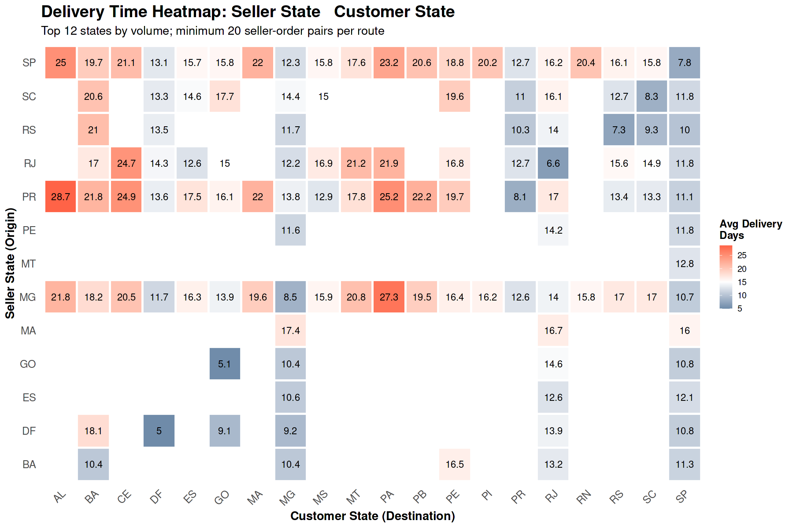
    


**PART 4: Summary and Key insights** 

**Intra-state delivery performance:**

🔹 Intra-state delivery represents the best-case scenario, where geography and cross-region complexity are removed  
🔹 Average delivery days are significantly lower than inter-region routes (5-10 days)  
🔹 Late rates are generally low (<10%), even in high-volume states like SP and MG  

➡️ When sellers ship within the same state, performance is consistently strong — delays are primarily driven by inter-region logistics, not local seller efficiency.

**Top 30 worst shipping routes:**

🔹 The worst-performing routes are almost exclusively inter-region, especially from Southeast and South hubs to distant North/Northeast states  
🔹 Examples of extreme delays:
> SP → RR: 31.6 days average  
> SP → AM: 25.8 days  
> MG → PA: 27.3 days  

🔹 Routes with moderate volumes can have very high delays (e.g. PR ➡︎ AL: 28.7 days)  

➡️ Inter-region distance and infrastructure gaps are the primary drivers of poor route performance. Local sellers generally perform well  

**High-volume problematic customer states:**

🔹 Customer states with both high order volumes and above-median delivery times: AM ➜ 26.4 days, AL ➜ 24.5 days, PA ➜ 23.7 days, MA, SE, CE, PB, PI, RO ➜ 19–21 days  
🔹 These states are mainly in North and Northeast, confirming that poor performance is geographically concentrated  

➡️ Prioritize operational support, local hubs, or improved last-mile partnerships in these high-volume, problematic states  

<br>

**High-impact problematic routes:**

🔹 Routes combining high order volume and high delays show where operational improvements would have the largest impact  
🔹 Top examples: SP ➡︎ RJ (16.2 average delivery days, 8110 orders), SP ➡︎ RS (16.1 average delivery days, 3583 orders), SP ➡︎ BA (19.7 average delivery days, 2295 orders), SP ➡︎ PE/CE/PA (18–23 average delivery days, 600–1500 orders)  

➡️ Even high-volume, efficient states like SP, generate major delays when shipping to distant regions — these routes are key targets for logistics improvements.  


<br>

**Strategic implications**

➜ Inter-region logistics are the bottleneck: distance + infrastructure issues, not seller inefficiency, drive most delays  

➜ Focus improvement efforts on high-impact routes: SP → North/Northeast, PR → Northeast, MG → PA/AL, etc  

➜ Leverage intra-region performance: high-volume states like SP, MG, PR, SC perform well within their region; consider regional fulfillment hubs to reduce cross-region penalties  

➜ Targeted interventions for problematic states: AM, AL, PA, MA, SE, CE, PB, PI, RO could benefit most from local storage, faster carriers, or optimized last-mile solutions  


Overall, Part 4 confirms, that delivery issues are route-specific and geography-driven. Improving inter-region hand-offs, building/improving regional distribution capacity, and prioritizing high-impact routes can reduce delivery times and late rates across Brazil.


```R
# PART 5: ACTIONABLE PRIORITIES

operational_priority <- route_performance %>%
  mutate(
    volume_tier = case_when(
      unique_orders >= 500 ~ "High Volume (500+)",
      unique_orders >= 100 ~ "Medium Volume (100-499)",
      unique_orders >= 30 ~ "Low Volume (30-99)",
      TRUE ~ "Very Low Volume (<30)"),
    delay_tier = case_when(
      late_rate >= quantile(late_rate, 0.75, na.rm = TRUE) ~ "Severe Delays (top 25% late rate)",
      late_rate >= median(late_rate, na.rm = TRUE) ~ "Moderate Delays",
      TRUE ~ "Good Performance"),
    priority = case_when(
      volume_tier == "High Volume (500+)" & delay_tier == "Severe Delays (top 25% late rate)" ~ "P1 - Critical",
      volume_tier == "High Volume (500+)" & delay_tier == "Moderate Delays" ~ "P2 - High",
      volume_tier == "Medium Volume (100-499)" & delay_tier == "Severe Delays (top 25%)" ~ "P2 - High",
      volume_tier == "Medium Volume (100-499)" & delay_tier == "Moderate Delays" ~ "P3 - Medium",
      TRUE ~ "P4 - Low"),
    infra_flag = case_when(
      route_type == "Inter-Region" & priority %in% c("P1 - Critical", "P2 - High") ~ "Infrastructure-driven",
      route_type == "Intra-Region" & priority %in% c("P1 - Critical", "P2 - High") ~ "Mixed (Regional Ops + Sellers)",
      TRUE ~ "Seller / Local-driven"))

critical_routes <- operational_priority %>%
  filter(priority == "P1 - Critical") %>%
  arrange(desc(weighted_impact))

priority_summary <- operational_priority %>%
  group_by(priority) %>%
  summarise(
    routes_n = n(),
    total_seller_order_pairs = sum(seller_order_pairs),
    total_unique_orders = sum(unique_orders),
    avg_delay = round(mean(avg_delivery_days), 1), .groups = "drop") %>%
  arrange(priority)

cat("\n\nOPERATIONAL PRIORITY SUMMARY\n")
cat("\n\n")
cat("Priority logic:\n")
cat("P1 - Critical: high volume (500+) + severe delays (top 25%)\n")
cat("P2 - High: high volume + moderate delays | medium volume + severe delays\n")
cat("P3 - Medium: medium volume + moderate delays\n")
cat("P4 - Low: all other routes\n\n")
cat("\n\n")
print(priority_summary)
cat("\n\nP1 CRITICAL ROUTES\n")
cat("\n\n")
print(critical_routes, n = Inf, width = Inf)
```

    
    
    OPERATIONAL PRIORITY SUMMARY
    
    
    Priority logic:
    P1 - Critical: high volume (500+) + severe delays (top 25%)
    P2 - High: high volume + moderate delays | medium volume + severe delays
    P3 - Medium: medium volume + moderate delays
    P4 - Low: all other routes
    
    
    
    # A tibble: 4 × 5
      priority      routes_n total_seller_order_pairs total_unique_orders avg_delay
      <chr>            <int>                    <int>               <int>     <dbl>
    1 P1 - Critical        6                    14641               14498      18.8
    2 P2 - High            8                    13032               12922      14.7
    3 P3 - Medium         13                     2805                2799      15.9
    4 P4 - Low            99                    65181               64626      15.8
    
    
    P1 CRITICAL ROUTES
    
    
    # A tibble: 6 × 15
      seller_state customer_state route   route_type   seller_order_pairs unique_orders avg_delay_vs_eta late_rate severe_late_rate avg_delivery_days weighted_impact volume_tier       
      <chr>        <chr>          <chr>   <chr>                     <int>         <int>            <dbl>     <dbl>            <dbl>             <dbl>           <dbl> <chr>             
    1 SP           RJ             SP ➡︎ RJ Intra-Region               8195          8110            -10.2      15.5             12.2              16.2         131382  High Volume (500+)
    2 SP           BA             SP ➡︎ BA Inter-Region               2322          2295            -10.2      14.8             10.4              19.7          45212. High Volume (500+)
    3 SP           ES             SP ➡︎ ES Intra-Region               1473          1459             -8.9      14.1              9.6              15.7          22906. High Volume (500+)
    4 SP           CE             SP ➡︎ CE Inter-Region                967           961            -10.3      15.2             11.4              21.1          20277. High Volume (500+)
    5 PR           RJ             PR ➡︎ RJ Inter-Region               1000           994            -12.6      13.5              9.7              17            16898  High Volume (500+)
    6 SP           PA             SP ➡︎ PA Inter-Region                684           679            -13.4      13               11                23.2          15753. High Volume (500+)
      delay_tier                        priority      infra_flag                    
      <chr>                             <chr>         <chr>                         
    1 Severe Delays (top 25% late rate) P1 - Critical Mixed (Regional Ops + Sellers)
    2 Severe Delays (top 25% late rate) P1 - Critical Infrastructure-driven         
    3 Severe Delays (top 25% late rate) P1 - Critical Mixed (Regional Ops + Sellers)
    4 Severe Delays (top 25% late rate) P1 - Critical Infrastructure-driven         
    5 Severe Delays (top 25% late rate) P1 - Critical Infrastructure-driven         
    6 Severe Delays (top 25% late rate) P1 - Critical Infrastructure-driven         
    

**PART 5: Summary and Key insights**

**Priority Classification**  

🔹 P1 Critical: 6 routes, 14498 orders (15% of platform), 18.8 average delay (days)  
🔹 P2 High: 8 routes, 12922 orders (13.4% of platform), 14.7 average delay (days)  
🔹 P3 Medium: 13 routes, 2799 orders (2.9% of platform)  
🔹 P4 Low: 99 routes, 64626 orders (67% of platform)  

➡️ P1 + P2 = only 14 routes (11% of routes) but 28.4% of order volume - high concentration of problems in few corridors

**P1 Critical Routes (need immediate fix)**

All 6 P1 routes share these characteristics:
> High volume (500+ orders)  
> Severe performance issues (top 25% late rates)  
> Average delivery time - 18.8 days  
> 5 of 6 originate from SP  
> 4 of 6 are Inter-region (infrastructure-driven)

The Big 3 Problems:

1. **SP ➡︎ RJ** 
* 8110 orders, 15.5% late, 16.2 average delivery days
* ~56% of all P1 volume! **Single worst route by impact**
* Intra-region route, but still problematic (should be faster between Southeast neighbors)
* Problem: RJ metro last-mile issues (congestion, favelas, urban complexity)
* Mixed infrastructure (regional ops + sellers)

2. **SP ➡︎ BA**
* 2295 orders, 14.8% late, 19.7 average deliverydays
* Longest P1 route (20 days = Northeast distance penalty)
* Inter-region, infrastructure-driven

Confirms: Southeast ➡︎ Northeast corridor is "broken"

3. **SP ➡︎ ES**
* 1459 orders, 14.1% late, 15.7 average delivery days
* Intra-region (both Southeast), but still slow
* Problem: ES last-mile or SP ➡︎ ES corridor congestion

Other P1 routes:  
🔹 SP ➡︎ CE (961 orders, 15.2% late, 21.1 days) ➡︎ Northeast infrastructure  
🔹 PR ➡︎ RJ (994 orders, 13.5% late, 17 days) ➡︎ RJ receiving issues again  
🔹 SP ➡︎ PA (679 orders, 13% late, 23.2 days) ➡︎ North region isolation  

**Key patterns in P1 Critical routes:**  

* Geographic concentration:  
> * 5 of 6 originate from SP: SP is an overloaded national hub, can't handle volume efficiently at distance
> * Northeast destinations dominate (BA, CE, PA = 3 of 6) ➡︎ confirms Part 2-4 findings
> * RJ appears TWICE as destination (from SP and PR) ➡︎ RJ receiving infrastructure is broken, not just SP ➡︎ RJ issue

* Route type distribution:  
> * 4 Inter-Region routes ➡︎ infrastructure/distance problems (as expected)
> * 2 Intra-Region routes (SP ➡︎ RJ, SP ➡︎ ES) ➡︎ both within Southeast - unexpected! These should be fast, but aren't  
Suggesting: SP ➡︎ Southeast corridor congestion or destination-specific last-mile failures

* Delay characteristics:  
> * All deliver 7-13 days early vs. ETA (negative avg_delay_vs_eta)
> * But still have 13-15.5% late rates  

Why? ETAs are padded heavily, but consistency is poor (high variance, some orders are very late)

**Strategic Implications:**  

**1. São Paulo is the bottleneck (5 out of 6 P1 routes)**  
* SP sellers handle 70% of Brazil's orders, but struggle with distant destinations
* Not SP seller inefficiency - they perform well intra-region (confirmed in Part 3)  
* Problem: SP is Brazil's ONLY major fulfillment hub ➡︎ single point of failure

**2. RJ has systemic receiving problems**  
* Appears in 2 of 6 P1 routes (SP ➡︎ RJ, PR ➡︎ RJ)
* Both show 13.5-15.5% late rates, despite being relatively short distances
* Not a sending problem - RJ outbound seller performance is average when shipping out, indicating the problem is receiving-side logistics, not RJ sellers themselves (12.1 days on average from Part 2)

Problem: RJ metro last-mile (confirmed in Part 2: 13.3% late rate, 3x worse severe late vs. SP)

**3. Northeast destinations need regional hub**  
* 3 of 6 P1 routes end in North/Northeast (BA, CE, PA)  
* All show 19-23 days delivery (2x Southeast average)
* All are primarily infrastructure-driven, with two intra-region routes showing mixed causes (regional ops + last-mile)
* Solution from Parts 2 and 3: BA fulfillment center could serve Northeast customers locally


**4. Intra-Region routes shouldn't be P1!**  
* SP ➡︎ RJ and SP ➡︎ ES are both Southeast region but still critically slow
* This information emerges for the first time in my analysis
* Suggests: regional corridor congestion or destination last-mile breakdown, not just cross-region distance

**Action priorities:** 

**Priority 1: to be addressed as soon as possible** (P1 routes = 15% of platform orders)

1. SP ➡︎ RJ (8110 orders)

So what data actually tells? 
* RJ has receiving problem, not sending
* Comparing to similar-distance route MG ➡︎ RJ: SP ➡︎ RJ is 4.1 days slower, which suggests 1. SP-specific routing issues or 2. RJ destination congestion
* There's a high variance in RJ deliveries: 10 days early on average, but >15% late rate ➡︎ inconsistent service
* Not a seller problem, as RJ sellers perform quite well (8.4% late, when shipping out)

**There are several hypothesis as of why MG ➡︎ RJ is 4 days faster, than SP ➡︎ RJ:**
**Hypothesis 1:** MG sellers might have direct routes to RJ, while SP sellers might use longer routes or logistics trucks, serving multiple destinations  
**Hypothesis 2:** RJ receives 12350 orders (12.8% of Brazil), but may have concentrated delivery zones. High volume leads to last-mile bottlenecks  
**Hypothesis 3:** high delivery variance: this suggests a deeper investigation into product categories or sellers, that are consistently late. Ideally there's a need to investigate difference between SP ➡︎ RJ/Rio de janeiro vs SP ➡︎ RJ/other RJ cities. Deliveries to Rio de Janeiro city are likely slower, than to other RJ state cities 

Ideally, delivery time by carrier should be tracked (if multiple carriers are involved) and identify, if specific carriers underperform on this route.
Alternatively|additionally, ETA could be adjusted (based on high variance): increate ETA to reduce overall late rate


> * Partner with better RJ carriers  
> * Address favela/security delivery challenges
> * Separate fulfillment for RJ metro vs. rest of RJ state

2. Open BA (Bahia) fulfillment center (will impact SP ➡︎ BA, SP ➡︎ CE, SP ➡︎ PA)
* Could serve 3 P1 routes (~ 4K orders combined)
* Could reduce 20-23 day deliveries to 10-13 days
* Could enable local Northeast sellers to scale

3. Investigate SP ➡︎ ES corridor (~ 1.5K orders)  
* Should be fast (both Southeast, neighbors) but isn't  
* Check: carrier performance, warehouse location, route optimization  

4. Address PR ➡︎ RJ issues (994 orders)  
* Same RJ destination problem as SP ➡︎ RJ
* Confirms RJ receiving infrastructure is systemic issue  

**Priority 2: monitor closely** (P2 routes = 13% of orders)

1. 8 additional routes with moderate delays or medium volume + severe delays   
2. Focus on any, that downshift into P1 category   

**Priority 3: maintain** (P3-P4 = 72% of orders) ➜ these are already performing adequately


While the initial objective included identifying underperforming states AND cities, the analysis revealed that delivery failures are most strongly concentrated at the route level, rather than being evenly distributed across all sellers or destinations. 
In particular, a small number of high-volume corridors account for a disproportionate share of late deliveries. Among these, the SP ➡︎ RJ route stands out as the single highest-impact failure point, representing over half of all P1-critical volume despite being an intra-region, short-distance corridor. This combination of high volume, severe delays, and geographic proximity makes SP ➡︎ RJ an ideal diagnostic route to understand whether poor performance is driven by seller behavior, destination constraints, or systemic last-mile and operational issues. For this reason, the following section focuses on a detailed deep dive into the SP ➡︎ RJ route to uncover the underlying drivers of critical delivery failures.


```R
# SP -> RJ DEEP DIVE:

cat("DEEP DIVE: SP → RJ ROUTE (worst P1 critical route)\n")
cat("\n\n")

sp_rj_orders <- geo_delays %>%
  filter(seller_state == "SP", customer_state == "RJ")

cat("Route Overview:\n")
cat("  - Total seller-order pairs:", nrow(sp_rj_orders), "\n")
cat("  - Unique orders:", n_distinct(sp_rj_orders$order_id), "\n")
cat("  - Unique sellers:", n_distinct(sp_rj_orders$seller_id), "\n")
cat("  - Average delivery days:", round(mean(sp_rj_orders$order_to_delivery_days), 1), "\n")
cat("  - Late rate:", round(mean(sp_rj_orders$is_late) * 100, 1), "%\n")
cat("  - Severe late rate:", round(mean(sp_rj_orders$is_very_late) * 100, 1), "%\n\n")
```

    DEEP DIVE: SP → RJ ROUTE (worst P1 critical route)
    
    
    Route Overview:
      - Total seller-order pairs: 8195 
      - Unique orders: 8110 
      - Unique sellers: 1001 
      - Average delivery days: 16.2 
      - Late rate: 15.5 %
      - Severe late rate: 12.2 %
    
    


```R
# RJ: city-level breakdown (customer side; filtered as previously for >=50 orders)

cat("PERFORMANCE BY RJ CUSTOMER CITY")
cat("\n\n")

sp_rj_by_customer_city <- sp_rj_orders %>%
  group_by(customer_city) %>%
  summarise(
    orders_n = n(),
    avg_delivery_days = round(mean(order_to_delivery_days), 1),
    late_rate = round(mean(is_late) * 100, 1),
    severe_late_rate = round(mean(is_very_late, na.rm = TRUE) * 100, 1), .groups = "drop") %>%
  filter(orders_n >= 50) %>%  
  arrange(desc(orders_n))

print(sp_rj_by_customer_city, n = Inf)

worst_city <- sp_rj_by_customer_city %>% arrange(desc(late_rate)) %>% head(1)
best_city <- sp_rj_by_customer_city %>% arrange(late_rate) %>% head(1)

cat("\n\n")
cat("  - Worst city by late_rate:", worst_city$customer_city, "(", worst_city$late_rate, "% late,", worst_city$orders_n, "orders)\n")
cat("  - Best city by late_rate:", best_city$customer_city, "(", best_city$late_rate, "% late,", best_city$orders_n, "orders)\n")


#2: Seller location analysis (origin side)

cat("\n\n")
cat("PERFORMANCE BY SP SELLER CITY\n")
cat("\n\n")

sp_rj_by_seller_city <- sp_rj_orders %>%
  group_by(seller_city) %>%  
  summarise(
    orders_n = n(),
    unique_sellers = n_distinct(seller_id),
    avg_delivery_days = round(mean(order_to_delivery_days), 1),
    late_rate = round(mean(is_late) * 100, 1), .groups = "drop") %>%
  filter(orders_n >= 50) %>%
  arrange(desc(orders_n))

print(sp_rj_by_seller_city, n = Inf)

cat("\n\n")
cat("Do SP capital sellers perform worse than interior sellers?\n")

sp_capital <- sp_rj_by_seller_city %>% 
  filter(seller_city == "sao paulo") %>%  
  summarise(orders = sum(orders_n), avg_late = weighted.mean(late_rate, orders_n))

sp_interior <- sp_rj_by_seller_city %>% 
  filter(seller_city != "sao paulo") %>%
  summarise(orders = sum(orders_n), avg_late = weighted.mean(late_rate, orders_n))

if(nrow(sp_capital) > 0 && nrow(sp_interior) > 0) {
  cat("  - SP capital late rate:", round(sp_capital$avg_late, 1), "% (", sp_capital$orders, "orders)\n")
  cat("  - SP interior late rate:", round(sp_interior$avg_late, 1), "% (", sp_interior$orders, "orders)\n")}


#3: Delivery performance tiers (Are SP → RJ delays category-specific, or systemic across all products? → using my delivery_performance column)

cat("\n\n")
cat("DELIVERY PERFORMANCE TIER DISTRIBUTION\n")
cat("\n\n")

sp_rj_with_tiers <- sp_rj_orders %>%
  left_join(delivered_orders_delay %>% select(order_id, seller_id, delivery_performance), by = c("order_id", "seller_id"))

tier_distribution <- sp_rj_with_tiers %>%
  group_by(delivery_performance) %>%
  summarise(
    orders_n = n(),
    pct = round(n() / nrow(sp_rj_with_tiers) * 100, 1),
    avg_delivery_days = round(mean(order_to_delivery_days), 1), .groups = "drop") %>%
  arrange(delivery_performance)

print(tier_distribution)


#4:  Delivery time distribution (variance analysis)

cat("\n\n")
cat("DELIVERY TIME DISTRIBUTION\n")
cat("\n\n")

delivery_stats <- sp_rj_orders %>%
  summarise(
    min_days = min(order_to_delivery_days),
    p25 = quantile(order_to_delivery_days, 0.25),
    median = median(order_to_delivery_days),
    p75 = quantile(order_to_delivery_days, 0.75),
    p95 = quantile(order_to_delivery_days, 0.95),
    max_days = max(order_to_delivery_days),
    std_dev = sd(order_to_delivery_days),
    .groups = "drop")

options(repr.plot.width = 20, repr.plot.height = 10)
ggplot(sp_rj_orders, aes(x = order_to_delivery_days)) +
  geom_histogram(aes(y = after_stat(density)), bins = 30, fill = "steelblue", color = "white", alpha = 0.7) +
  geom_density(color = "darkblue", linewidth = 0.8) +
  geom_vline(xintercept = delivery_stats$p25, color = "darkgreen", linetype = "dashed", linewidth = 0.5) +
  geom_vline(xintercept = delivery_stats$median, color = "orange", linetype = "dashed", linewidth = 0.5) +
  geom_vline(xintercept = delivery_stats$p75, color = "red", linetype = "dashed", linewidth = 0.5) +
  geom_vline(xintercept = delivery_stats$p95, color = "darkred", linetype = "solid", linewidth = 0.6) +
  annotate("text", x = delivery_stats$p25, y = Inf, label = paste0("P25: ", round(delivery_stats$p25, 1), "d"), 
           vjust = 2, hjust = -0.1, color = "darkgreen", size = 5) +
  annotate("text", x = delivery_stats$median, y = Inf, label = paste0("Median: ", round(delivery_stats$median, 1), "d"), 
           vjust = 3.5, hjust = -0.1, color = "orange", size = 5) +
  annotate("text", x = delivery_stats$p75, y = Inf, label = paste0("P75: ", round(delivery_stats$p75, 1), "d"), 
           vjust = 5, hjust = -0.1, color = "red", size = 5) +
  annotate("text", x = delivery_stats$p95, y = Inf, label = paste0("P95: ", round(delivery_stats$p95, 1), "d"), 
           vjust = 6.5, hjust = -0.1, color = "darkred", size = 5) +
  scale_x_continuous(
    breaks = seq(0, max(sp_rj_orders$order_to_delivery_days, na.rm = TRUE), by = 10)) +
  labs(title = "SP → RJ Delivery Time Distribution",
       x = "Delivery Days",
       y = "Density") +
  theme_minimal(base_size = 14, base_family = "Arial") +
  theme(
    plot.title = element_text(face = "bold", size = 22),
    plot.subtitle = element_text(size = 16, color = "black"),
    axis.text.x = element_text(size = 14),
    axis.text.y = element_text(size = 14),
    axis.title.x = element_text(face = "bold", size = 16),
    axis.title.y = element_text(face = "bold", size = 16),
    panel.background = element_rect(fill = "white", color = NA),
    plot.background = element_rect(fill = "white", color = NA),
    panel.grid.minor = element_blank())


sp_rj_orders %>%
  mutate(
    delivery_bucket = case_when(
      order_to_delivery_days <= 10 ~ "≤10 days (Fast)",
      order_to_delivery_days <= 15 ~ "11-15 days (Typical)",
      order_to_delivery_days <= 20 ~ "16-20 days (Slow)",
      order_to_delivery_days <= 25 ~ "21-25 days (Very Slow)",
      TRUE ~ ">25 days (Extreme)")) %>%
  group_by(delivery_bucket) %>%
  summarise(orders_n = n(), pct = round(n() / nrow(sp_rj_orders) * 100, 1), .groups = "drop") %>%
  arrange(delivery_bucket) %>%
  print()

cat("\n\n")

#5: Product category analysis:

cat("\n\n")
cat("PERFORMANCE BY PRODUCT CATEGORY\n")
cat("\n\n")

sp_rj_by_category <- sp_rj_orders %>%
  left_join(delivered_orders_delay %>% 
      select(order_id, seller_id, product_category), by = c("order_id", "seller_id")) %>%
  group_by(product_category) %>%
  summarise(orders_n = n(), avg_delivery_days = round(mean(order_to_delivery_days), 1),
    late_rate = round(mean(is_late) * 100, 1), .groups = "drop") %>%
  filter(orders_n >= 30) %>%
  arrange(desc(late_rate))

print(sp_rj_by_category, n = Inf)
cat("\n")
```

    PERFORMANCE BY RJ CUSTOMER CITY
    
    # A tibble: 23 × 5
       customer_city         orders_n avg_delivery_days late_rate severe_late_rate
       <chr>                    <int>             <dbl>     <dbl>            <dbl>
     1 rio de janeiro            4364              15.6      13.5             10.5
     2 niteroi                    539              15.7      15.4             12.2
     3 nova iguacu                281              15.2      15.3             12.5
     4 sao goncalo                258              20.1      29.8             21.7
     5 duque de caxias            169              14.9      11.8              9.5
     6 campos dos goytacazes      167              15        15               11.4
     7 petropolis                 155              16.2      13.5             11.6
     8 macae                      151              18.8      23.8             17.2
     9 volta redonda              139              18.6      25.2             20.9
    10 rio das ostras              91              19.6      20.9             15.4
    11 marica                      87              19.1      20.7             14.9
    12 barra mansa                 83              15.9      20.5             14.5
    13 nova friburgo               83              18.5      19.3             16.9
    14 sao joao de meriti          82              20        24.4             18.3
    15 resende                     77              17.9      22.1             16.9
    16 belford roxo                75              15.4       9.3              8  
    17 mage                        74              14.9       4.1              4.1
    18 teresopolis                 74              16.7      20.3             16.2
    19 cabo frio                   69              19        30.4             23.2
    20 nilopolis                   68              15.5      19.1             13.2
    21 angra dos reis              62              17.4      17.7             11.3
    22 araruama                    55              17.1       9.1              9.1
    23 mesquita                    51              15        13.7             13.7
    
    
      - Worst city by late_rate: cabo frio ( 30.4 % late, 69 orders)
      - Best city by late_rate: mage ( 4.1 % late, 74 orders)
    
    
    PERFORMANCE BY SP SELLER CITY
    
    
    # A tibble: 27 × 5
       seller_city           orders_n unique_sellers avg_delivery_days late_rate
       <chr>                    <int>          <int>             <dbl>     <dbl>
     1 sao paulo                 2627            372              15.1      15.1
     2 ibitinga                   967             37              18.1      19.8
     3 sao jose do rio preto      317             18              19.4      22.4
     4 santo andre                296             33              13.3       8.8
     5 ribeirao preto             286             35              18.8      20.6
     6 itaquaquecetuba            218              7              25.2      15.1
     7 guarulhos                  206             33              14.6      11.7
     8 guariba                    201              1              18.5      19.9
     9 piracicaba                 197              7              17.6      19.8
    10 campo limpo paulista       167              2              16.1      10.8
    11 campinas                   139             19              13.5       5.8
    12 salto                      131              8              12.4       6.9
    13 praia grande               126              4              14.1       7.1
    14 jacarei                    108              5              16.3      14.8
    15 sao bernardo do campo       93             19              12.4       7.5
    16 limeira                     80             12              17.4      25  
    17 sumare                      78              3              16.6      17.9
    18 sao jose dos campos         75              7              16.4      14.7
    19 pedreira                    64              4              18        12.5
    20 santos                      63              8              14.1       7.9
    21 itatiba                     62              3              17.8      16.1
    22 presidente prudente         62              8              12.8       8.1
    23 barueri                     60              4              13        15  
    24 atibaia                     55              6              14.5      16.4
    25 franca                      55             15              19.7      25.5
    26 osasco                      55             15              17.4      20  
    27 santa barbara d'oeste       51              4              12.7       7.8
    
    
    Do SP capital sellers perform worse than interior sellers?
      - SP capital late rate: 15.1 % ( 2627 orders)
      - SP interior late rate: 15.9 % ( 4212 orders)
    
    
    DELIVERY PERFORMANCE TIER DISTRIBUTION
    
    
    # A tibble: 4 × 4
      delivery_performance orders_n   pct avg_delivery_days
                     <int>    <int> <dbl>             <dbl>
    1                    1     1362  14.6               5.8
    2                    2     4713  50.6              11.4
    3                    3     2175  23.3              21.4
    4                    4     1069  11.5              39.2
    
    
    DELIVERY TIME DISTRIBUTION
    
    
    # A tibble: 5 × 3
      delivery_bucket        orders_n   pct
      <chr>                     <int> <dbl>
    1 11-15 days (Typical)       2094  25.6
    2 16-20 days (Slow)          1146  14  
    3 21-25 days (Very Slow)      652   8  
    4 >25 days (Extreme)         1238  15.1
    5 ≤10 days (Fast)            3065  37.4
    
    
    
    
    PERFORMANCE BY PRODUCT CATEGORY
    
    
    # A tibble: 33 × 4
       product_category                orders_n avg_delivery_days late_rate
       <chr>                              <int>             <dbl>     <dbl>
     1 musical_instruments                   41              18.4      26.8
     2 electronics                          288              16.6      21.9
     3 audio                                 56              15.7      21.4
     4 garden_tools                         399              17.9      19.3
     5 home_comfort                          52              15.6      19.2
     6 baby                                 231              16.5      19  
     7 computers_accessories                360              16.4      17.5
     8 bed_bath_table                      1392              16.8      17.3
     9 sports_leisure                       575              16.3      16.9
    10 stationery                           247              18.1      16.6
    11 toys                                 326              15.9      16.6
    12 watches_gifts                        678              15.6      16.1
    13 home_construction                     50              17.6      16  
    14 luggage_accessories                   59              14.3      15.3
    15 furniture_decor                      781              16        14.3
    16 consoles_games                        85              16.4      14.1
    17 NA                                   128              17        14.1
    18 cool_stuff                           323              15.9      13.9
    19 telephony                            329              13.8      13.7
    20 health_beauty                        553              14.9      13.2
    21 construction_tools_construction       49              13.9      12.2
    22 office_furniture                     290              24.8      12.1
    23 perfumery                            226              14.3      11.5
    24 auto                                 310              14.2      11.3
    25 pet_shop                              95              14.1      10.5
    26 fashion_bags_accessories             135              13.7      10.4
    27 furniture_living_room                 42              18.3       9.5
    28 food                                  43              16.1       9.3
    29 housewares                           557              13.7       9.2
    30 air_conditioning                      37              15.1       8.1
    31 home_appliances                       76              15.3       6.6
    32 small_appliances                      53              13.1       5.7
    33 drinks                                49              14.2       2  
    
    


    
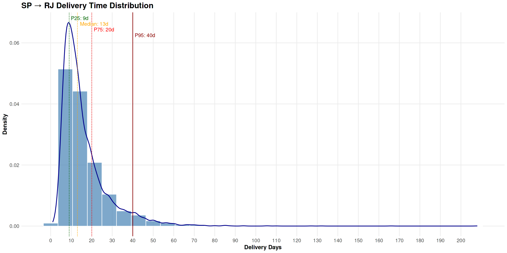
    


**Key insights:**

**RJ customer city performance**

The RJ state 15.5% late rate hides a massive city-level variation:

🔹 **Worst RJ cities** (disaster zones):
- Cabo Frio: 30.4% late (2x route average!) - 69 orders
- São Gonçalo: 29.8% late + 20.1 days average (slowest major RJ city) - 258 orders
- Volta Redonda: 25.2% late + 18.6 days - 139 orders
- São João de Meriti: 24.4% late + 20 days - 82 orders
- Macaé: 23.8% late + 18.8 days - 151 orders  

🔹 **Best RJ cities** (working fine):
- Mage: 4.1% late + 14.9 days - 74 orders (3.7x better than route average!)
- Araruama: 9.1% late + 17.1 days - 55 orders
- Belford Roxo: 9.3% late + 15.4 days - 75 orders
- Duque de Caxias: 11.8% late + 14.9 days - 169 orders  

🔹 RJ city-level variation is MASSIVE! (e.g. 7.4x difference between the best (Mage) and the worst (Cabo Frio))  

🔹 **Rio de Janeiro city** (53% of route volume): 4364 orders (biggest destination by far), 15.6 days average, 13.5% late rate ➜ actually better than route average (15.5% late). So ➜ Rio is NOT the problem!  

➡️ Metropolitan Rio area performs OK (Rio city, Duque de Caxias, Belford Roxo, Mage = 9-13% late)    
➡️ Interior/coastal RJ cities are disasters (São Gonçalo, Cabo Frio, Volta Redonda, Macaé = 24-30% late)    
➡️ SP → RJ's 15.5% late rate is driven by interior/coastal RJ cities with 24-30% late rates, while Rio city itself performs close to route average  


**SP seller city performance**

➡️ SP origin location does NOT matter:

🔹 SP capital vs. interior comparison:
> SP capital (São Paulo city): 15.1% late, 2627 orders  
> SP interior: 15.9% late, 4212 orders  

A difference of 0.8 percentage points is statistically negligible at this scale  

🔹 Worst SP seller cities:
> Franca: 25.5% late (55 orders)  
> Limeira: 25% late (80 orders)  
> São José do Rio Preto: 22.4% late (317 orders)  
> Ribeirão Preto: 20.6% late (286 orders)  
> Ibitinga: 19.8% late (967 orders - 2nd highest volume!)    

! Some interior cities look worse, but volumes are much smaller. So no single SP seller city explains the route-level failure

🔹 Best SP seller cities:  
> Campinas: 5.8% late (139 orders)  
> Salto: 6.9% late (131 orders)  
> Praia Grande: 7.1% late (126 orders)  
> São Bernardo do Campo: 7.5% late (93 orders)    

➡️ SP capital and interior show similar late rates (15.1% vs. 15.9%), suggesting SP origin location has minimal impact on SP ➡︎ RJ performance


**Delivery performance tier distribution** 

🔹 Most orders (50.6%) fall into tier 2 (typical)  
🔹 SP → RJ has 2.3x more "very slow" orders than expected (11.5% vs. 5% expected, by definition of >P95) ➡︎ route underperforms the Brazil-wide P95 benchmark for each category. This could mean:    
> 1. The route makes all categories slower (systemic route problem) or  
> 2. SP ➡︎ RJ ships more of the naturally-slow categories (product mix problem)  

➡️ This pattern matches operational breakdowns, not seller delay or category constraints  


**Delivery time distribution**

🔹 Standard deviation is high (long right tail)
🔹 High variance explains everything:

🔹 Observations:
- 63% of orders deliver in ≤15 days (SUM of "Fast" + "Typical")
- 5.1% take >25 days
- Average delivery: 16.2 days (from route overview)

🔹 From histogram:  
- Peak concentration around 9-13 days
- Right-skewed distribution with long tail
- Visible mass extending beyond 25 days

➡️ The SP ➡︎ RJ's 15.5% late rate appears to be driven by a long tail of extreme delays (15.1% taking >25 days) rather than uniform slowness across all orders. Majority of orders (63%) deliver within 15 days, but the extreme tail significantly impacts overall performance (suggestion: fix the tail ➜ fix the route) 


**Product categories performance**  

Category variation exists!

🔹 Worst categories:

> Musical instruments: 26.8% late (41 orders)  
> Electronics: 21.9% late (288 orders) ➡︎ meaningful volume!  
> Audio: 21.4% late (56 orders)    

🔹 Best categories:

> Drinks: 2% late (49 orders)  
> Small appliances: 5.7% late (53 orders)  
> Home appliances: 6.6% late (76 orders)  
> Air conditioning: 8.1% late (37 orders)  
> Housewares: 9.2% late (557 orders) ➡︎ high volume and low late rate!)  

🔹 High-volume categories all cluster tightly:

> Bed/bath/table: 17.3% late (1392 orders - 17% of route!)  
> Furniture/decor: 14.3% late (781 orders)  
> Watches/gifts: 16.1% late (678 orders)  
> Sports/leisure: 16.9% late (575 orders)  
> Health/beauty: 13.2% late (553 orders)  

🔹 High-volume categories cluster between 13-17% late rates, suggesting the route's overall 15.5% late rate is reasonably representative of major product flows  
🔹 Gap analysis: **worst vs. best** (musical instruments 26.8% vs. drinks 2%) ➜ 24.8 percentage points gap shows, that **category DOES matter**. Some categories struggle more than others on this route. Product category explains SOME variation within the SP ➡︎ RJ route      

🔸 In order to determine if the route degrades all categories equally, I would have to compare SP ➡︎ RJ category performance to the same categories on other routes  
⚠️ Limitation: city-level findings represent orders ≥50 per city (23 of 92 RJ municipalities)

Overall: 

➡️ When comparing SP ➡︎ RJ items to Brazil-wide performance for their categories, SP ➡︎ RJ is 2.3x worse at creating 'very slow' deliveries.  
➡️ On the SP ➡︎ RJ route, some categories perform much worse than others. Musical instruments and electronics have 10x higher late rates than drinks.   


**Business question 17 ("Which Brazilian states and cities experience the worst delivery performance?") sum-up:**

1. Geographic stratification: Delivery times vary 3.4x across Brazil (North: 26-29 days vs. Southeast: 9-15 days), driven by customer location infrastructure (16 of 27 states), not seller inefficiency

2. Single-hub dependency: São Paulo handles 70% of orders but creates bottlenecks on long-distance routes; 5 of 6 P1 Critical routes originate from SP with 15-19% late rates

3. Route concentration: 14 routes (11% of total) represent 28% of platform orders, with P1 (critical) routes averaging 14.4% late rates - high-volume corridors drive overall performance

**Worst-performing states (by customer destination):**

- North: RR (29.3 days), AP (27.2 days), AM (26.4 days) - geographic isolation
- Northeast: AL (24.5 days, 23.8% late - worst in Brazil), MA (21.4 days), CE (21.1 days)
- Exception: RJ (15.2 days, 13.3% late despite Southeast location) - last-mile breakdown

**(by seller origin):**

- AM (Amazonas): 48 days average, 66.7% late (1 seller, 3 orders) - outbound infrastructure failure
- MA (Maranhão): 23.1% late rate (worst seller state with volume)

**SP ➡︎ RJ (Worst P1 Route):**

- Extreme tail: 15.1% take >25 days (1238 orders) while 63% deliver in ≤15 days - right-skewed distribution
- Problem: RJ interior cities (São Gonçalo 29.8% late, Cabo Frio 30.4% late), NOT Rio city (13.5% late)
- SP origin doesn't matter: capital 15.1% vs. interior 15.9% late (0.8 pp difference)
- Category varies: Musical instruments 26.8% late vs. drinks 2% late (24.8 pp gap)

**Bottom line:**   
Poor delivery is geography-driven (distance + infrastructure), not seller-driven    
Fix 14 critical routes  to improve 1/3 of platform performance  
If P1 + P2 routes fixed (14 routes, through regional fulfillment, better carriers, and accurate ETAs): 28% of orders impacted (27420 orders across 14 routes)     
Northeast needs regional hub 
Calibrate ETAs  

### **Question 18: "How do product dimensions and weight impact delivery performance and freight costs across Brazilian regions?"** 

In this section, I am going to investigate, whether larger and heavier products systematically experience worse delivery performance and higher freight costs across Brazil, and if these effects are concentrated in specific routes or regions. To answer this, I will leverage previously engineered **size_flag** and existing delivery metrics such as **order_to_delivery_days**, **delivery_performance**, and late-delivery indicators that were already created in earlier steps, allowing a direct link between product dimension profiles and the operational patterns uncovered in previous questions


```R
# First let me check order-items weight distribution

product_delivery <- delivered_orders %>%
  filter(timeline_is_valid == TRUE) %>%
  inner_join(products, by = "product_id") %>%
  left_join(customers %>% select(customer_id, customer_state), by = "customer_id") %>%
  left_join(sellers %>% select(seller_id, seller_state), by = "seller_id") %>%
  mutate(
    estimated_delivery_days = as.numeric(difftime(as.Date(order_estimated_delivery_date), as.Date(order_purchase_timestamp), units = "days")),
    is_late = ifelse(order_delivered_customer_date > order_estimated_delivery_date, 1, 0),
    delay_days = order_to_delivery_days - estimated_delivery_days)

weight_summary <- product_delivery %>%
  summarise(
    min_weight = min(product_weight_g, na.rm = TRUE),
    q25 = quantile(product_weight_g, 0.25, na.rm = TRUE),
    median = median(product_weight_g, na.rm = TRUE),
    q75 = quantile(product_weight_g, 0.75, na.rm = TRUE),
    q95 = quantile(product_weight_g, 0.95, na.rm = TRUE),
    max_weight = max(product_weight_g, na.rm = TRUE),
    mean_weight = mean(product_weight_g, na.rm = TRUE))

print(weight_summary)


# Also I am going to check for negative or NULL weights:

weight_issues <- product_delivery %>%
  summarise(
    n_total = n(),
    n_zero = sum(product_weight_g == 0, na.rm = TRUE),
    n_negative = sum(product_weight_g < 0, na.rm = TRUE),
    n_missing = sum(is.na(product_weight_g))  )

print(weight_issues)
```

    # A tibble: 1 × 7
      min_weight   q25 median   q75   q95 max_weight mean_weight
           <int> <dbl>  <int> <dbl> <dbl>      <int>       <dbl>
    1          0   300    700  1800  9750      40425       2096.
    # A tibble: 1 × 4
      n_total n_zero n_negative n_missing
        <int>  <int>      <int>     <int>
    1  108581      8          0        18
    


```R
# Filtering out zero weights:

product_delivery_clean <- product_delivery %>%
  filter(!is.na(product_weight_g), product_weight_g > 0)

# Weight summary with clean data:

weight_summary <- product_delivery_clean %>%
  summarise(
    min_weight = min(product_weight_g),
    q25 = quantile(product_weight_g, 0.25),
    median = median(product_weight_g),
    q75 = quantile(product_weight_g, 0.75),
    q95 = quantile(product_weight_g, 0.95),
    max_weight = max(product_weight_g),
    mean_weight = mean(product_weight_g))

print(weight_summary)
```

    # A tibble: 1 × 7
      min_weight   q25 median   q75   q95 max_weight mean_weight
           <int> <dbl>  <int> <dbl> <dbl>      <int>       <dbl>
    1          2   300    700  1800  9750      40425       2096.
    


```R
# Histogram of weight distribution:

options(repr.plot.width = 16, repr.plot.height = 8)

ggplot(product_delivery_clean, aes(x = product_weight_g)) +
  geom_histogram(bins = 50, fill = "#4682B4", color = "white") +
  scale_x_continuous(labels = scales::comma) +
  labs(
    title = "Product Weight Distribution (All Orders)", x = "Weight (g)", y = "Number of Orders") +
  theme_minimal() +
  theme(
    plot.background = element_rect(fill = "white", color = NA),
    panel.background = element_rect(fill = "white", color = NA),
    axis.text.y = element_text(size = 14),
    axis.text.x = element_text(size = 14),
    plot.title = element_text(size = 22, face = "bold"),
    plot.subtitle = element_text(size = 14),
    axis.title.x = element_text(size = 16, face = "bold"),
    axis.title.y = element_text(size = 16, face = "bold"))
```


    
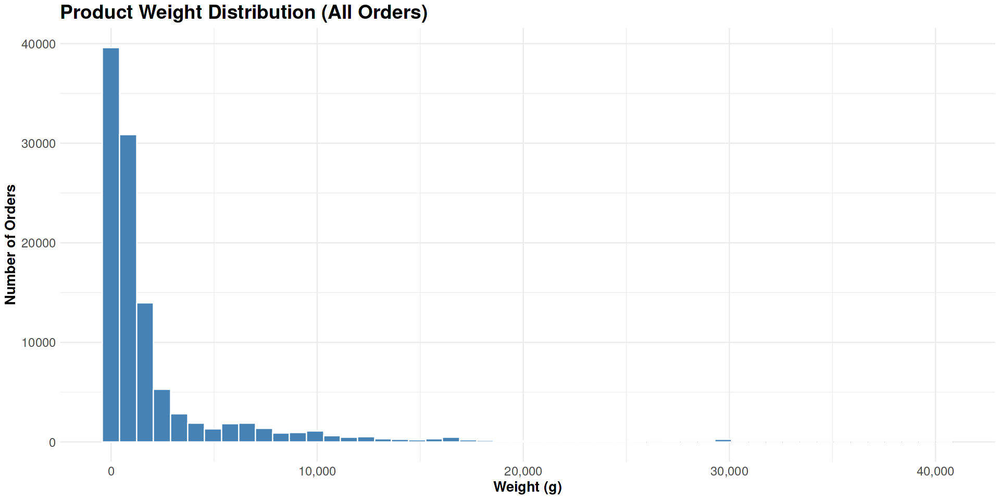
    


The weight histogram shows that most items are quite light, while a much smaller group is much heavier, so the distribution has a long tail to the right. On a normal x-axis, those few very heavy products stretch the scale, and almost all bars get "squeezed" into the left side, where it is hard to see differences between common weights. A log scale could help by giving more balanced space to each "weight range", so that light, medium and heavy products are all visible instead of everything looking like one big spike near zero


```R
# Same histogram, but with log scale to see the full distribution:

ggplot(product_delivery_clean, aes(x = product_weight_g)) +
  geom_histogram(bins = 50, fill = "#4682B4", color = "white") +
  scale_x_log10(labels = scales::comma) +
  labs(
    title = "Product Weight Distribution (Log Scale)", x = "Weight (g, log scale)", y = "Number of Orders") +
  theme_minimal() +
  theme(
    plot.background = element_rect(fill = "white", color = NA),
    panel.background = element_rect(fill = "white", color = NA),
    axis.text.y = element_text(size = 14),
    axis.text.x = element_text(size = 14),
    plot.title = element_text(size = 22, face = "bold"),
    plot.subtitle = element_text(size = 14),
    axis.title.x = element_text(size = 16, face = "bold"),
    axis.title.y = element_text(size = 16, face = "bold"))
```


    
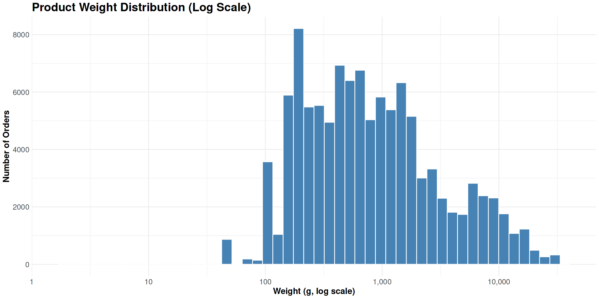
    


Now I can see the actual distribution:

🔹 Peak around 200-500g ➜ most orders contain lightweight items ("typical" product weight range, where the highest order volume sits (6-8K orders per bin))    
🔹 Nearly normal distribution: histogram looks roughly bell-shaped, most items are small/light, but there's a balanced spread across weight categories  
🔹 Long tail extends beyond 10 kg: there is a meaningful volume all the way to 10kg and beyond (this was invisible on linear scale histogram), but like this I can see they represent a substantial,  not negligible number of orders per bin  


```R
# How does size_flag relate to delivery metrics?

size_flag_performance <- product_delivery_clean %>%
  group_by(size_flag) %>%
  summarise(
    n_orders = n(),
    avg_weight_g = round(mean(product_weight_g, na.rm = TRUE), 2),
    avg_volume_cm3 = round(mean(volume_cm3, na.rm = TRUE), 2),
    avg_delivery_days = round(mean(order_to_delivery_days, na.rm = TRUE), 2),
    avg_freight_value = round(mean(freight_value, na.rm = TRUE), 2),
    late_rate_pct = round(mean(is_late, na.rm = TRUE) * 100, 2),
    stddev_delivery_days = round(sd(order_to_delivery_days, na.rm = TRUE), 2)) %>%
  arrange(size_flag)

print(size_flag_performance)

# Plot: Size flag impact on delivery metrics (y-axis: days (for delivery time), percentage (for late rate), R$ (for freight cost))

size_flag_plot_data <- size_flag_performance %>%
  select(size_flag, avg_delivery_days, late_rate_pct, avg_freight_value) %>%
  pivot_longer(cols = -size_flag, names_to = "metric", values_to = "value") %>%
  mutate(
    metric_label = case_when(
      metric == "avg_delivery_days" ~ "Avg Delivery Days",
      metric == "late_rate_pct" ~ "Late Rate (%)",
      metric == "avg_freight_value" ~ "Average Freight (R$)"))

options(repr.plot.width = 10, repr.plot.height = 12)

ggplot(size_flag_plot_data, aes(x = factor(size_flag), y = value, fill = factor(size_flag))) +
  geom_col() +
  geom_text(aes(label = round(value, 1)), vjust = 1.5, color = "black", size = 5) +
  facet_wrap(~metric_label, scales = "free_y", ncol = 1) +
  scale_fill_brewer(palette = "Spectral") +
  labs(
    title = "Product Size Impact on Delivery Performance",
    x = "Size Flag (0 = small → 6 = truly large)",
    y = NULL) +
  theme_minimal() +
  theme(
    plot.background = element_rect(fill = "white", color = NA),
    panel.background = element_rect(fill = "white", color = NA),
    axis.text.y = element_text(size = 14),
    axis.text.x = element_text(size = 14, angle = 45, hjust = 1),
    plot.title = element_text(size = 22, face = "bold"),
    plot.subtitle = element_text(size = 14),
    axis.title.x = element_text(size = 16, face = "bold"),
    axis.title.y = element_text(size = 16, face = "bold"),
    strip.text = element_text(size = 16, face = "bold"),
    legend.position = "none")
```

    # A tibble: 7 × 8
      size_flag n_orders avg_weight_g avg_volume_cm3 avg_delivery_days avg_freight_value late_rate_pct stddev_delivery_days
          <int>    <int>        <dbl>          <dbl>             <dbl>             <dbl>         <dbl>                <dbl>
    1         0    58962         662.          3817.              12.0              16.5          7.85                 9.19
    2         1    17912        1628.         12408.              12.2              18.7          7.45                 9.21
    3         2    16421        2629.         22414.              13.1              20.3          8.34                 9.48
    4         3     2661        6860.         52184.              12.8              29.6          8.31                 8.79
    5         4    10002        6860.         47772.              14.2              31.5          8.66                11   
    6         5     2536       10901.         80494.              14.2              48.8         10.2                 10.9 
    7         6       61       26580.        246569.              15.4             136.           4.92                14.2 
    


    
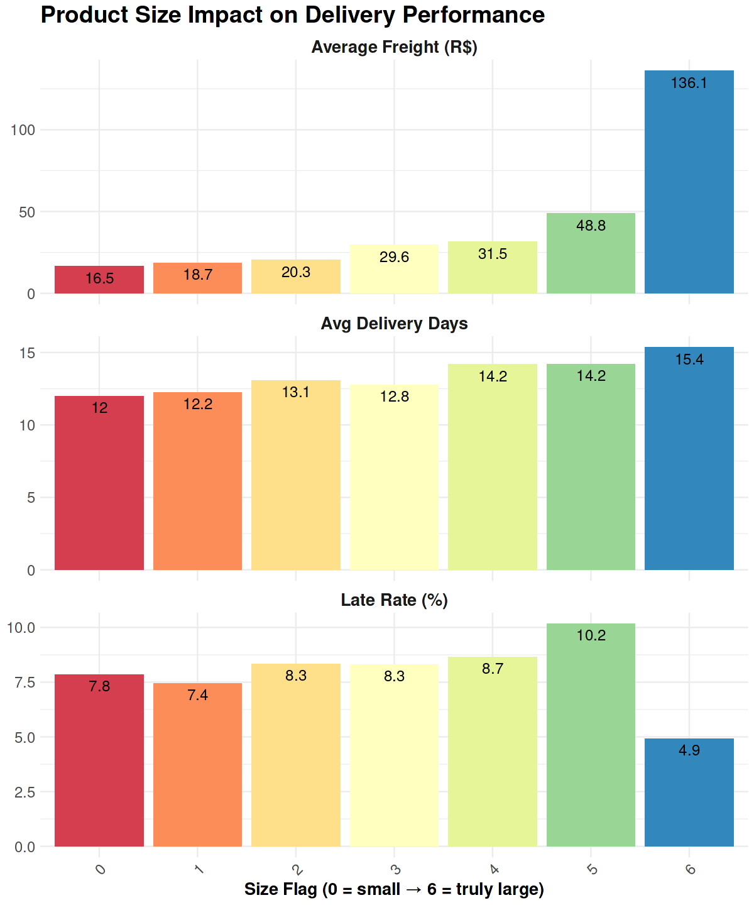
    


**Key insights / size flag performance:**

🔹 Size flag distribution is heavily skewed:   
> * Small products (flag 0) dominates with 58962 orders (54% of total), while truly large products (flag 6) are rare with only 61 orders (0.06%)
> * Delivery time increases moderately with size: Small products average 12 days, while truly large products take 15.4 days - a 28% increase. However, the jump isn't linear - flags 0-3 cluster around 12-13 days, then flags 4-6 jump to 14-15 days
> * Late rates actually show an unexpected pattern: late rates are fairly stable (7.4-10.2%) across most flags, with a surprising dip at flag 6 (4.92%). However, flag 6 has only 61 orders, so this could be statistical noise rather than a real pattern. The most reliable insight is that flags 0-5 all hover around 8-10% late rate  
> * Freight cost scales dramatically: This is the clearest relationship - freight jumps from 16.5 BRL (flag 0) to 136.1 BRL (flag 6), an 8x increase. Even moderate increases in size flag drive major freight costs (flag 4 = 31.5 BRL, flag 5 = 48.8 BRL)
> * Weight vs volume relationship: e.g.: flags 3 and 4 have identical average weight (~7kg), but flag 3 is slightly more voluminous (52k vs 48k cm3), yet flag 4 costs  31.5 BRL vs flag 3's 29.6 BRL - a small freight difference despite the dimensional difference.  

➡️ both - weight and dimensions seem to affect freight pricing    
➡️ Product dimensions impact freight cost far more than delivery performance. Large products aren't significantly later, but they cost dramatically more to ship  
 
Next I will try to clarify, whether carriers use volumetric pricing (volume × some rate) or a combination of weight and dimensions


```R
# Is freight driven by weight or dimensions (or both)?

weight_freight <- product_delivery_clean %>%
  mutate(
    weight_bucket = case_when(
      product_weight_g < 500 ~ "0-500g",
      product_weight_g < 1000 ~ "500-1kg",
      product_weight_g < 2000 ~ "1-2kg",
      product_weight_g < 5000 ~ "2-5kg",
      TRUE ~ "5kg+"),
    weight_bucket = factor(weight_bucket, levels = c("0-500g", "500-1kg", "1-2kg", "2-5kg", "5kg+"))) %>%
  group_by(size_flag, weight_bucket) %>%
  summarise(
    n_orders = n(),
    avg_freight_value = round(mean(freight_value, na.rm = TRUE), 2),
    avg_delivery_days = round(mean(order_to_delivery_days, na.rm = TRUE), 2),
    late_rate_pct = round(mean(is_late, na.rm = TRUE) * 100, 2), .groups = 'drop') %>%
  filter(n_orders >= 10)

# Plot 2: Freight cost by weight and size

options(repr.plot.width = 16, repr.plot.height = 10)

ggplot(weight_freight, aes(x = weight_bucket, y = avg_freight_value, color = factor(size_flag), group = size_flag)) +
  geom_line(linewidth = 1) + geom_point(size = 2.5) + scale_color_brewer(palette = "Set3") +
  labs(
    title = "Freight Cost: Weight vs Dimensional Size",
    x = "Weight Bucket", y = "Average Freight Value (R$)", color = "Size Flag") +
  theme_minimal() +
  theme(
    plot.background = element_rect(fill = "white", color = NA),
    panel.background = element_rect(fill = "white", color = NA),
    axis.text.y = element_text(size = 14),
    axis.text.x = element_text(size = 14, angle = 45, hjust = 1),
    plot.title = element_text(size = 22, face = "bold"),
    plot.subtitle = element_text(size = 14),
    axis.title.x = element_text(size = 16, face = "bold"),
    axis.title.y = element_text(size = 16, face = "bold"),
    legend.title = element_text(size = 16, face = "bold"),
    legend.text = element_text(size = 14))
```


    
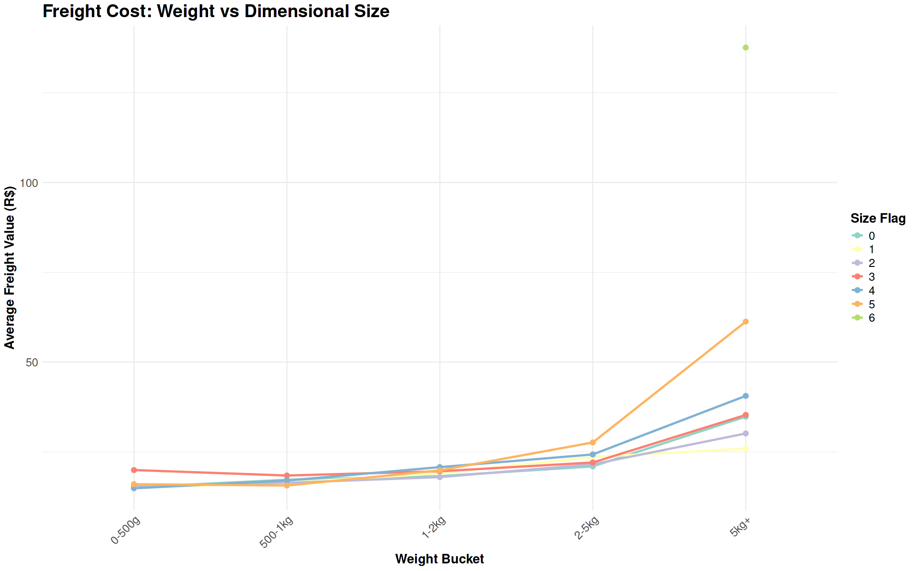
    


**Key insights / weight × size interaction:**

🔹 Lines are mostly parallel in the 0-2kg range: For lightweight products (0-500g to 1-2kg), all size flags charge roughly 15-25 BRL in freight, with minimal separation between flags. This means weight dominates for light items - dimensions don't add much cost.  
🔹 Lines diverge dramatically at 2-5 kg and 5 kg+ ➜ once a package hits heavier weight, the size flags separate significantly. This confirms **dimensional pricing kicks in for heavy items** - carriers charge more for bulky packages once weight passes ~2kg.  
🔹 Flag 6 is the extreme outlier: a single green point shows truly large products cost 130 R$ in freight at 5kg+ - more than double flag 5 and nearly 4x the cost of smaller flags at the same weight. These 61 products with 246k cm3 average volume face massive volumetric pricing penalties  

Conclusion: The steepest freight increase is flag 5 ➡︎ 6 in the heavy range. Dimensions become the dominant cost driver for oversized items, not just weight.  

In the next section, I will try to discover, whether certain routes struggle more with large products. I will look at:  
1. In-state ➡︎ this is a baseline: shortest distance, local carriers, fastest deliveries. If large products struggle even on in-state routes, it's a pure handling/size issue, not distance.    
2. SP-Southeast/South (SP ➡︎ RJ, MG, PR, SC, RS): this was a focus of business question 17: São Paulo to nearby states shipping. I found, that SP ➡︎ RJ route had specific last-mile problems. What I am testing now is: do those problems get worse, when shipping large/bulky products on the same routes?  
3. SP-Other (SP → everywhere else): earlier I found out, that SP's "long" routes (North, Northeast) had the worst performance - 15-19% late rates on P1 Critical routes (worst individual SP routes from business question 17). These are the longest distances with poorest infrastructure. Large products on these routes could be the "worst-case scenario".  
4. Other routes: non-SP origin ones, basically everything else. This will show whether SP's hub dominance is somehow masking problems from other seller locations.  


```R
# Route type sensitivity to size:

route_size_analysis <- product_delivery_clean %>%
  mutate(
    route_type = case_when(
      seller_state == customer_state ~ "In-State",
      seller_state == "SP" & customer_state %in% c("RJ", "MG", "PR", "SC", "RS") ~ "SP-Southeast/South",
      seller_state == "SP" ~ "SP-Other",
      TRUE ~ "Other Routes")) %>%
  group_by(route_type, size_flag) %>%
  summarise(
    n_orders = n(),
    avg_delivery_days = round(mean(order_to_delivery_days, na.rm = TRUE), 2),
    avg_freight_value = round(mean(freight_value, na.rm = TRUE), 2),
    late_rate_pct = round(mean(is_late, na.rm = TRUE) * 100, 2), .groups = 'drop') %>%
  filter(n_orders >= 20)

print(route_size_analysis, n = Inf)

# Plot/heatmap: Late rates by route and size

options(repr.plot.width = 14, repr.plot.height = 8)

ggplot(route_size_analysis, aes(x = factor(size_flag), y = route_type, fill = late_rate_pct)) +
  geom_tile(color = "white", linewidth = 1) +
  geom_text(aes(label = paste0(round(late_rate_pct, 1), "%")), color = "black", size = 5) +
  scale_fill_gradient(low = "#edf8fb", high = "#006d2c", name = "Late Rate (%)", limits = c(4, 14)) +
  labs(
    title = "Late Delivery Rates: Route Type × Product Size", x = "Size Flag", y = "Route Type") +
  theme_minimal() +
  theme(
    plot.background = element_rect(fill = "white", color = NA),
    panel.background = element_rect(fill = "white", color = NA),
    axis.text.y = element_text(size = 14),
    axis.text.x = element_text(size = 14),
    plot.title = element_text(size = 22, face = "bold"),
    plot.subtitle = element_text(size = 14),
    axis.title.x = element_text(size = 16, face = "bold"),
    axis.title.y = element_text(size = 16, face = "bold"),
    legend.title = element_text(size = 14, face = "bold"),
    legend.text = element_text(size = 12))
```

    # A tibble: 26 × 6
       route_type         size_flag n_orders avg_delivery_days avg_freight_value late_rate_pct
       <chr>                  <int>    <int>             <dbl>             <dbl>         <dbl>
     1 In-State                   0    21355              7.3               10.7          5.94
     2 In-State                   1     6248              7.71              12.6          5.92
     3 In-State                   2     6063              8.79              14.2          5.57
     4 In-State                   3      933              8.45              20.6          8.04
     5 In-State                   4     3492              9.41              22.2          6.5 
     6 In-State                   5     1015             10.0               32.2          8.77
     7 In-State                   6       22             14.4               88.4          4.55
     8 Other Routes               0    15494             13.6               21.2          6.6 
     9 Other Routes               1     4940             13.4               23.1          5.63
    10 Other Routes               2     2898             13.8               28.4          7.04
    11 Other Routes               3      602             14.3               34.4          6.98
    12 Other Routes               4     2726             14.5               34.9          7.48
    13 Other Routes               5      594             16.0               63.3          9.09
    14 Other Routes               6       24             16.2              149.           4.17
    15 SP-Other                   0     7997             18.1               22.1         13.0 
    16 SP-Other                   1     2183             18.2               25.4         12.0 
    17 SP-Other                   2     2310             18.5               26.8         12.1 
    18 SP-Other                   3      386             18.0               40.9          9.84
    19 SP-Other                   4     1239             20.7               45.6         13.5 
    20 SP-Other                   5      316             20.6               71.6         13.0 
    21 SP-Southeast/South         0    14116             13.9               16.7          9.18
    22 SP-Southeast/South         1     4541             14.3               19.1          9.36
    23 SP-Southeast/South         2     5150             15.3               20.1         10.6 
    24 SP-Southeast/South         3      740             14.3               31.0          8.92
    25 SP-Southeast/South         4     2545             17.1               33.6         10.5 
    26 SP-Southeast/South         5      611             16.0               50.3         12.1 
    


    
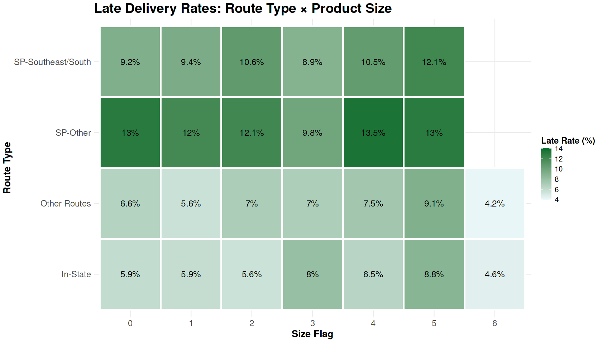
    


**Key insights / Route × Size interaction:**

🔹 **SP-Other** is consistently bad: show 12-13.5% late rates across all size flags - roughly 2x worse than In-State (6%) and worse than SP-Southeast/South (9-12%). This confirms: SP's long-haul routes struggle regardless of product size  
🔹 Surprisingly, SP-Other's late rate for flag 0 (13%) is about the same as flags 4-5 (13-13.5%) ➡︎ large products DON'T make SP-Other worse, the route itself is the problem, not the interaction with size. Even small products fail on these routes  
🔹 **In-State** handles all sizes well: maintains 5.6-8.8% late rates across flags 0-5 (the most consistent performance). Local logistics can handle large products just fine. The outlier is flag 6 (4.6%), but that's only 22 orders  
🔹 **SP-Southeast/South** shows size sensitivity: this is the only route type where late rates clearly increase with size - from 9.2% (flag 0) to 12.1% (flag 5). This suggests medium-distance routes to wealthy states struggle specifically with large products, unlike the in-state or long-haul extremes   

➡️ Distance matters more than size for delivery performance

In the next section, I am going to look at geographical aspect of large products delivery


```R
# Which states can't handle large deliveries?

large_product_regions <- product_delivery_clean %>%
  filter(size_flag >= 4) %>%
  group_by(customer_state) %>%
  summarise(
    n_orders = n(),
    avg_delivery_days = round(mean(order_to_delivery_days, na.rm = TRUE), 2),
    late_rate_pct = round(mean(is_late, na.rm = TRUE) * 100, 2), .groups = 'drop') %>%
  filter(n_orders >= 20) %>%
  arrange(desc(late_rate_pct))

print(large_product_regions, n = Inf)

# Plot: Top 10 worst states for large product delivery

top_problem_states <- large_product_regions %>%
  top_n(10, late_rate_pct)

options(repr.plot.width = 14, repr.plot.height = 6)

ggplot(top_problem_states, aes(x = reorder(customer_state, late_rate_pct), y = late_rate_pct)) +
  geom_col(fill = "#4682B4") +
  geom_text(aes(label = paste0(late_rate_pct, "%")), hjust = 1.2, color = "white", size = 5) +
  coord_flip() +
  labs(title = "Worst States for Large Product Delivery (Flags 4-6)",
    x = NULL, y = "Late Rate (%)") +
  theme_minimal() +
  theme(
    plot.background = element_rect(fill = "white", color = NA),
    panel.background = element_rect(fill = "white", color = NA),
    axis.text.y = element_text(size = 14),
    axis.text.x = element_text(size = 14),
    plot.title = element_text(size = 22, face = "bold"),
    plot.subtitle = element_text(size = 14),
    axis.title.x = element_text(size = 16, face = "bold"),
    axis.title.y = element_text(size = 16, face = "bold"))
```

    # A tibble: 23 × 4
       customer_state n_orders avg_delivery_days late_rate_pct
       <chr>             <int>             <dbl>         <dbl>
     1 MA                   82              25.2         28.0 
     2 TO                   39              19.7         20.5 
     3 AL                   50              23.3         20   
     4 SE                   48              26.1         18.8 
     5 CE                  149              22.8         15.4 
     6 RJ                 1668              18.1         14.7 
     7 PB                   76              24.3         14.5 
     8 PI                   57              22.4         14.0 
     9 RN                   45              21.8         13.3 
    10 BA                  439              22.2         13.0 
    11 PA                  118              25.1         11.9 
    12 MS                  111              16.4         11.7 
    13 GO                  226              16.7         11.5 
    14 PE                  159              20.4         10.7 
    15 ES                  228              16.8         10.5 
    16 DF                  204              14.6         10.3 
    17 MT                  122              20.6          9.02
    18 SC                  476              15.9          8.82
    19 RS                  756              15.9          7.14
    20 SP                 5367              10.3          6.95
    21 PR                  631              12.9          6.34
    22 MG                 1478              13.6          6.09
    23 RO                   30              23.3          3.33
    


    
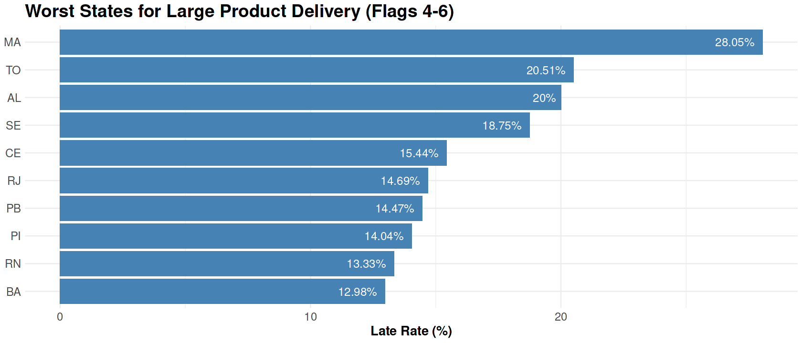
    


**Key insights / Geographic failures for large products:**

🔹 Top 5 worst states are all from North/Northeast regions, though the sample size is quite small, and, therefore, percentages are less reliable ➡︎ confirmation of the business question 17 findings   
🔹 Large products delivered to North/Northeast destination states have high late rates, but this could be due to:  
> Last-mile infrastructure in those states (poor local logistics regardless of origin)  
> Long-haul from SP (if most sellers are in SP, which in busienss question 17 showed is 70% of orders)
> Local handling capacity (small states can't process bulky items well)

🔹 Rio de Janeiro state appears in the top 10 (ranking 6th), despite being a Southeast state  

⚠️ To properly test "distance x size" interaction, I'd need to look at the route categories from Section 3, which did control for origin-destination pairs. But this section is purely about destination state challenges  


```R
# Where do late deliveries concentrate in weight-volume space? (I will use 10% sample)

sample_for_viz <- product_delivery_clean %>%
  filter(!is.na(volume_cm3), product_weight_g > 0) %>%
  sample_frac(0.1)  

# Plot: Volume vs weight scatter

options(repr.plot.width = 14, repr.plot.height = 12)

ggplot(sample_for_viz, aes(x = product_weight_g, y = volume_cm3, color = factor(is_late))) +
  geom_point(alpha = 0.5, size = 2) +
  scale_x_log10(labels = scales::comma) +
  scale_y_log10(labels = scales::comma) +
  scale_color_manual(values = c("0" = "#2F90DB", "1" = "#F85946"), labels = c("On Time", "Late")) +
  labs(
    title = "Product Weight vs Volume: Late Delivery Distribution",
    x = "Weight (g, log scale)", y = "Volume (cm3, log scale)", color = "Delivery") +
  theme_minimal() +
  theme(
    plot.background = element_rect(fill = "white", color = NA),
    panel.background = element_rect(fill = "white", color = NA),
    axis.text.y = element_text(size = 14),
    axis.text.x = element_text(size = 14),
    plot.title = element_text(size = 22, face = "bold"),
    plot.subtitle = element_text(size = 14),
    axis.title.x = element_text(size = 16, face = "bold"),
    axis.title.y = element_text(size = 16, face = "bold"),
    legend.title = element_text(size = 14, face = "bold"),
    legend.text = element_text(size = 12))


# Correlation:

correlation_data <- product_delivery_clean %>%
  filter(!is.na(volume_cm3), product_weight_g > 0) %>%
  select(product_weight_g, volume_cm3, is_late, order_to_delivery_days)

cor_matrix <- cor(correlation_data, use = "complete.obs")
print(round(cor_matrix, 3))

weight_late_test <- cor.test(correlation_data$product_weight_g, correlation_data$is_late)
volume_late_test <- cor.test(correlation_data$volume_cm3, correlation_data$is_late)

weight_late_test
volume_late_test

cat("\n\n")
cat("KEY CORRELATIONS")
cat("\n\n")
cat("Weight vs Is Late:", round(cor(correlation_data$product_weight_g, correlation_data$is_late), 3), "\n")
cat("Volume vs Is Late:", round(cor(correlation_data$volume_cm3, correlation_data$is_late), 3), "\n")
cat("Weight vs Delivery Days:", round(cor(correlation_data$product_weight_g, correlation_data$order_to_delivery_days), 3), "\n")
cat("Volume vs Delivery Days:", round(cor(correlation_data$volume_cm3, correlation_data$order_to_delivery_days), 3), "\n")
cat("Weight vs Volume:", round(cor(correlation_data$product_weight_g, correlation_data$volume_cm3), 3), "\n")
cat("\n\n")
```

                           product_weight_g volume_cm3 is_late order_to_delivery_days
    product_weight_g                  1.000      0.805   0.022                  0.086
    volume_cm3                        0.805      1.000   0.018                  0.079
    is_late                           0.022      0.018   1.000                  0.586
    order_to_delivery_days            0.086      0.079   0.586                  1.000
    


    
    	Pearson's product-moment correlation
    
    data:  correlation_data$product_weight_g and correlation_data$is_late
    t = 7.3906, df = 108553, p-value = 1.472e-13
    alternative hypothesis: true correlation is not equal to 0
    95 percent confidence interval:
     0.01647932 0.02837079
    sample estimates:
           cor 
    0.02242584 
    


    
    	Pearson's product-moment correlation
    
    data:  correlation_data$volume_cm3 and correlation_data$is_late
    t = 5.8226, df = 108553, p-value = 5.811e-09
    alternative hypothesis: true correlation is not equal to 0
    95 percent confidence interval:
     0.01172213 0.02361587
    sample estimates:
           cor 
    0.01766962 
    


    
    
    KEY CORRELATIONS
    
    Weight vs Is Late: 0.022 
    Volume vs Is Late: 0.018 
    Weight vs Delivery Days: 0.086 
    Volume vs Delivery Days: 0.079 
    Weight vs Volume: 0.805 
    
    
    


    
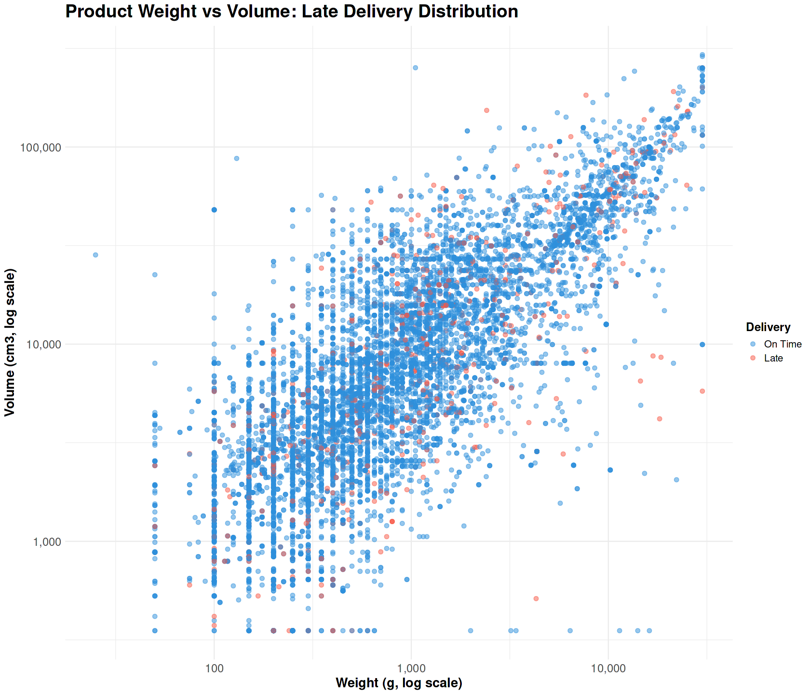
    


**Key insights / Weight × Volume × Late Delivery**

🔹 Late deliveries (salmon color) are scattered quite evenly across all regions: there's no concentrated cluster of salmon points in the upper-right (heavy + bulky). Instead, late deliveries appear proportionally distributed throughout the weight-volume space    
🔹The bottom-left region (low-weight, low-volume) is mostly blue:  (<500g, <5000 cm³) has relatively fewer salmon points, suggesting small products have slightly better on-time performance, but the effect is modest  
🔹 In the highest density zone both blue (on-time) and salmon (late) points overlap heavily, suggesting size alone doesn't predict lateness  
🔹 Some outliers exist: There are a few salmon points in extreme regions (very heavy >10kg or very bulky >100k cm3), but they're not disproportionately late - blue points exist there too  

➡️ The scatter plot of weight vs. volume shows that late orders (salmon points) are evenly distributed across the entire size spectrum, with no visible clustering in the heavy or bulky upper-right quadrant. While very small products (low weight + low volume) appear slightly more likely to arrive on time, the effect is modest and not decisive. In the highest-density regions (where most orders fall) late and on-time deliveries overlap heavily, which indicates, that product size alone does not predict delivery performance. This visual evidence is reinforced statistically.  

**Statistical interpretation:**

🔹 Across more than 100K orders, product weight and volume are strongly correlated with each other (r = 0.81), which is expected, confirming that heavier products are generally bulkier. However, neither dimension meaningfully explains late deliveries  
🔹 Weight → Late Delivery: r = 0.022 (very weak positive), P-value = 1.47e-13 (highly significant due to large sample)  
🔹 Volume → Late Delivery: r = 0.018 (very weak positive), P-value = 5.81e-09 (highly significant)  


➡️ Statistically significant, but practically irrelevant (statistical significance iscan be explained by large sample size (>100K orders).  However, r values explain only a tiniest percentage of variance in late deliveries. The confidence intervals confirm the true correlation is essentially zero from a practical standpoint.

Combined with above sections' findings, this confirms: WHERE you ship matters far more, than WHAT you ship. The route (distance, infrastructure) drives lateness, not product dimensions alone. This is actually good news for Olist - large products aren't inherently problematic; they just need better route planning.


```R
# category breakdown:

dim_by_cat <- products %>%
  group_by(product_category_eng) %>%
  summarise(n_products = n(),
    avg_weight_g = mean(product_weight_g, na.rm = TRUE),
    avg_volume_cm3 = mean(volume_cm3, na.rm = TRUE), .groups = 'drop') %>%
  filter(!is.na(avg_weight_g), !is.na(avg_volume_cm3))

# Plot: Categories by weight

options(repr.plot.width = 14, repr.plot.height = 20)

dim_by_cat %>%
  ggplot(aes(x = reorder(product_category_eng, avg_weight_g), avg_weight_g, fill = avg_weight_g)) +
  geom_col() +
  geom_text(aes(label = round(avg_weight_g, 0)), hjust = 1.05, color = "white", size = 4.5) +
  coord_flip() +
  scale_y_continuous(expand = c(0, 0)) + scale_fill_gradient(low = "#c6dbef", high = "#08306b") +
  labs(x = "Product category", y = "Average weight (g)", fill = "Avg weight",
    title = "Product Categories by Average Weight (heaviest)") +
  theme_minimal() +
  theme(
    plot.title = element_text(size = 22, face = "bold"),
    axis.title.x = element_text(size = 14, face = "bold"),
    axis.title.y = element_text(size = 14, face = "bold"),
    axis.text.y = element_text(size = 12),
    legend.title = element_text(size = 16, face = "bold"),
    legend.text = element_text(size = 12))

# Plot: Categories by volume

options(repr.plot.width = 14, repr.plot.height = 20)

dim_by_cat %>%
  ggplot(aes(x = reorder(product_category_eng, avg_volume_cm3), y = avg_volume_cm3, fill = avg_volume_cm3)) +
  geom_col() +
  geom_text(aes(label = round(avg_volume_cm3, 0)), hjust = 1.05, color = "white", size = 4.5) +
  coord_flip() +
  scale_y_continuous(expand = c(0, 0)) + scale_fill_gradient(low = "#f4a6b8", high = "#7b0022") +
  labs(x = "Product category", y = "Average volume (cm³)", fill = "Avg volume",
    title = "Product Categories by Average Volume ('bulkiest')") +
  theme_minimal() +
  theme(
    plot.title = element_text(size = 22, face = "bold"),
    axis.title.x = element_text(size = 14, face = "bold"),
    axis.title.y = element_text(size = 14, face = "bold"),
    axis.text.y = element_text(size = 12),
    legend.title = element_text(size = 16, face = "bold"),
    legend.text = element_text(size = 12))

# Plot: Top 10 vs Bottom 10 comparison 

top10 <- dim_by_cat %>% slice_max(avg_volume_cm3, n = 10)
bottom10 <- dim_by_cat %>% slice_min(avg_volume_cm3, n = 10)

top_bottom <- bind_rows(
  top10 %>% mutate(group = "Top 10 by volume"),
  bottom10 %>% mutate(group = "Bottom 10 by volume")) %>%
  pivot_longer(
    cols = c(avg_weight_g, avg_volume_cm3), names_to = "metric", values_to = "value")

options(repr.plot.width = 22, repr.plot.height = 10)
ggplot(top_bottom, aes(x = reorder(product_category_eng, value), y = value / 1000, fill = metric)) +
  geom_col(position = position_dodge(width = 0.6), width = 0.5) +
  geom_text(aes(label = paste0(round(value / 1000, 1), "K"), group = metric), position = position_dodge(width = 0.6), hjust = -0.1, size = 5.5) +
  coord_flip() +
  facet_wrap(~ group, scales = "free_y") +
  scale_fill_manual(values = c(avg_weight_g = "#5a739c", avg_volume_cm3 = "#c78490"), labels = c("Average weight (g)", "Average volume (cm³)")) +
  labs(x = "Product category", y = "Value (K g|cm³)", fill = "",
    title = "Top 10 vs Bottom 10 Product Categories by Average Volume/Weight") +
  theme_minimal() +
  theme(
    plot.title = element_text(size = 22, face = "bold"),
    axis.title.x = element_text(size = 16, face = "bold"),
    axis.title.y = element_text(size = 16, face = "bold"),
    axis.text.x = element_text(size = 16),
    axis.text.y = element_text(size = 16),
    strip.text = element_text(size = 16, face = "bold"),
    legend.title = element_text(size = 16, face = "bold"),
    legend.text = element_text(size = 16))
```


    
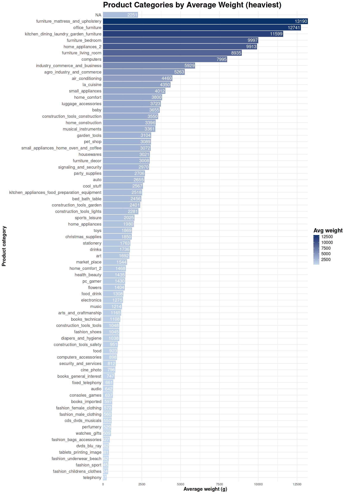
    


    
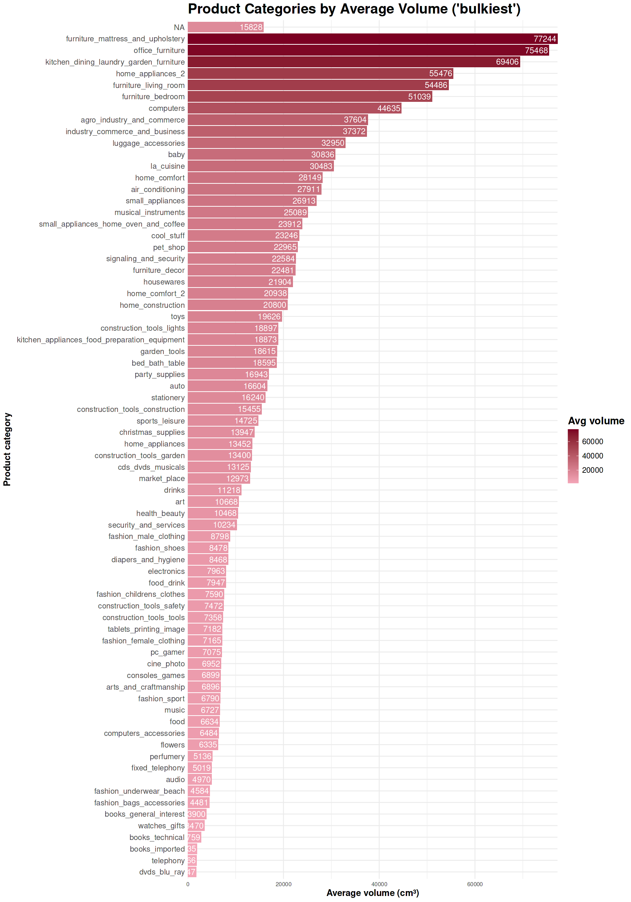
    


    
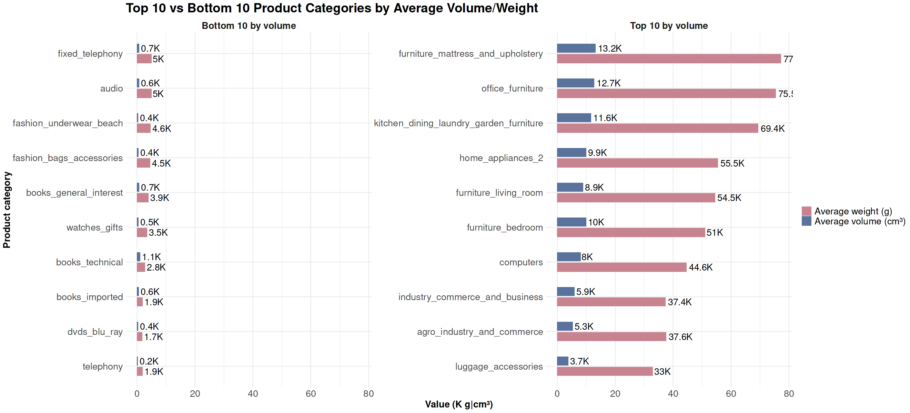
    


```R
# Assessing lateness by product category size (Top 10 vs Bottom 10)

category_delivery <- product_delivery_clean %>%
  inner_join(dim_by_cat %>% select(product_category_eng, avg_weight_g, avg_volume_cm3), by = "product_category_eng") %>%
  group_by(product_category_eng) %>%
  summarise(
    n_orders = n(),
    late_rate_pct = mean(is_late, na.rm = TRUE) * 100,
    avg_weight_g = first(avg_weight_g),
    avg_volume_cm3 = first(avg_volume_cm3), .groups = 'drop') %>%
  filter(n_orders >= 50)  

top10_delivery <- top10 %>%
  inner_join(category_delivery %>% select(product_category_eng, late_rate_pct, n_orders), by = "product_category_eng") %>%
  mutate(group = "Top 10 (bulkiest)")

bottom10_delivery <- bottom10 %>%
  inner_join(category_delivery %>% select(product_category_eng, late_rate_pct, n_orders), by = "product_category_eng") %>%
  mutate(group = "Bottom 10 (smallest)")

top_bottom_delivery <- bind_rows(top10_delivery, bottom10_delivery)

# Plot: Late rates by category size group

options(repr.plot.width = 16, repr.plot.height = 10)

ggplot(top_bottom_delivery, aes(x = reorder(product_category_eng, late_rate_pct), y = late_rate_pct, fill = group)) +
  geom_col() +
  geom_text(aes(label = paste0(round(late_rate_pct, 1), "%")), hjust = -0.1, size = 4.5) +
  coord_flip() +
  scale_fill_manual(values = c("Top 10 (bulkiest)" = "#5a739c", "Bottom 10 (smallest)" = "#c78490")) +
  labs(x = "Product Category", y = "Late Delivery Rate (%)", fill = "Category Group",
    title = "Late Delivery Rates: Bulkiest vs Smallest Product Categories") +
  theme_minimal() +
  theme(
    plot.background = element_rect(fill = "white", color = NA),
    panel.background = element_rect(fill = "white", color = NA),
    plot.title = element_text(size = 22, face = "bold"),
    plot.subtitle = element_text(size = 14),
    axis.title.x = element_text(size = 14, face = "bold"),
    axis.title.y = element_text(size = 14, face = "bold"),
    axis.text.x = element_text(size = 13),
    axis.text.y = element_text(size = 13),
    legend.title = element_text(size = 16, face = "bold"),
    legend.text = element_text(size = 14))
```

**Key insights / product category analysis:**

🔹 Top 10 heaviest/bulkiest categories (right panel):  
> * Furniture dominates: mattresses/upholstery (80K cm3, 75 kg), office furniture (around 70K cm3), kitchen/dining/garden furniture (around 70K cm3) are the clear outliers
> * Home appliances: Home_appliances_2 category also ranks high (ca. 55K cm3, around 50K g)
> * Living/bedroom furniture: Mid-range but still substantial (approx. 45-50K cm3)
> * Electronics/computers: Moderate bulk (around 30-40K cm3) but lower weight relative to volume  

🔹 Bottom 10 lightest/smallest categories (left panel):  
> * Fixed telephony, Audio, Fashion items: all under 5000 cm3 and under 1kg  
> * Books, Watches/gifts: extremely compact and light    
➜ These categories are essentially negligible for freight concerns

🔹 Based on "Late Delivery Rates: Bulkiest vs Smallest Product Categories" plot, there's no clear relationship between product size and late deliveries (the bulkiest categories (blue bars) and smallest categories (pink bars) are completely intermixed across the late delivery spectrum) - this confirms correlation analysis showing r=0.02 between weight/volume and lateness. 
🔹 Interesting pattern: **smallest product categories have the highest late rates**: audio (12.8%), fashion_underwear_beach (12.6%), and books_technical (11.4%) are all in the bottom 10 by volume, yet they lead in late deliveries; **bulkiest categories perform reasonably well**: office_furniture (9%), furniture_bedroom (7.8%), and home_appliances_2 (7.1%) are all below 10% late rate despite being heavy/bulky. The outlier: books_imported (3.6%) has the lowest late rate and is a small category - possibly because imported books have different shipping workflows or more conservative delivery estimates


So, summing up business question 18 ("How do product dimensions and weight impact delivery performance and freight costs across Brazilian regions?") ➜ **Product dimensions and weight have minimal impact on delivery performance, but they have a strong impact on freight cost**

In this question I tested whether heavier and bulkier products lead to worse delivery performance and higher freight costs across routes and regions. The analysis combined delivered order items with product dimensions, route types, and customer states, then summarized metrics and ran a correlation check between size and lateness.

**Key findings:**
1. Freight cost scales sharply with size: Average freight rises from about 16 BRL for small items (flag 0) to over 130 BRL for truly large products (flag 6, is driven by specific, identifiable product lines - **furniture and large appliances**), section 2 showed, that at the same weight bucket (5kg+), higher size flags still pay more (flag 5 = ~60 BRL vs flags 0-2 = ~30 BRL), confirming dimensional pricing     
2. Delivery time increases only modestly with size: average delivery time grows from roughly 12 days (flag 0) to 15–16 days (flag 6), a small effect compared with geographic differences; delivery time variability increases moderately (SD: 9 days for flag 0 vs 14 days for flag 6)    
3. Logistics drivers aren't about product dimensions, size barely predicts lateness: correlations between weight/volume and the late flag are extremely weak (r ≈ 0.02), meaning product dimensions explain essentially none of the variance in whether an order is late  
4. **Route and geography effects**: for large items (flags 4-6), the worst destination states are mainly in North/Northeast, while Southeast states perform best. However, this reflects destination infrastructure, not necessarily route distance, since origin states were not controlled. Origin state analysis would be needed to isolate true route effects from destination infrastructure    
5. **Implications for Olist**: cost, not reliability, is the main "size problem" (freight 8x increase vs. only 3-day delivery increase and weak correlation (r=0.02))
6. Olist should prioritize improving carrier partnerships and route optimization in North/Northeast regions rather than developing size-specific logistics solutions, since geography drives lateness (route type SP-Other 12-13% vs In-State 6-9%) while size does not (r=0.02).

# 5. OLIST E-COMMERCE OPERATIONS ANALYSIS: Executive Summary

**Business Context:**  
This analysis examines 96470 delivered orders across Brazil (October 2016 – August 2018), evaluating marketplace health, customer behavior, operational performance, and logistics infrastructure to identify high-impact opportunities for revenue growth and customer satisfaction improvement.

---

## Key Findings

### 1. **Marketplace health & growth trajectory**
**Strong foundation with retention opportunity**

- Platform generated ~15M BRL GMV with ~97% delivery success rate, demonstrating operational maturity  
- Monthly GMV grew from near-zero (late 2016) to ~ 900K–1.1M BRL (2018), indicating successful market penetration  
- Marketplace diversification protects against risk: top 10 sellers = ~ 14% GMV (Gini 0.787; HHI 0.0039 confirms a healthy long-tail structure)

**Critical weakness: customer retention**

- ~94% of GMV comes from one-time buyers; repeat customers are ~3% of the base but generate ~92% more revenue per customer (≈146 BRL vs ≈273 BRL LTV)  
- Converting one-time to repeat buyers is the highest-leverage growth opportunity

**Strategic customer segments identified**

- Heavy-repeat customers (3+ orders) generate ~ 600 BRL average revenue despite representing <1% of the base  
- Credit card users dominate repeat behavior (vs. boleto), concentrated in SP, RJ, MG, PR  
- Category affinity drives retention: bed_bath_table (~15% GMV), sports_leisure (~10%), watches_gifts (~10%)

---

### 2. **Operational performance: Delivery delay is everything**

**Delivery delay is the dominant dissatisfaction driver**

- Orders >3 days late: ~1.9 avg review + ~ 73% negative reviews  
- On-time orders: ~ 4.3 avg review + ~7–8% negative reviews  
- Each additional day of delay reduces review score by ~0.036 points (p < 0.001)

**Freight cost and payment flexibility are irrelevant to satisfaction**

- Within the >3-day late bucket: ~73–74% negative reviews regardless of freight cost  
- Payment methods show minimal variation compared to delivery performance  
- Customers are **not more tolerant of delays** when shipping is cheaper

**Seller risk is concentrated**

- The majority of sellers are operationally sound  
- A small group of high-risk sellers disproportionately contributes to delays, poor reviews, and revenue at risk  
- Delay risk is structurally concentrated, making seller-level intervention highly scalable

---

### 3. **Geographic infrastructure drives performance, not seller behavior**
**Delivery times vary ~3.4x across Brazil by destination**

- North: ~ 26–29 days  
- Northeast: ~ 19–21 days  
- Southeast: ~ 9–15 days  
- Worst-performing state: AL (~ 24.5 days, ~ 23.8% late rate)

**São Paulo is an overloaded single-point-of-failure**

- SP handles ~ 70% of orders  
- 5 of 6 P1 Critical routes originate from SP  
- SP performs well intra-region, confirming infrastructure bottleneck rather than seller inefficiency

**Route concentration defines operational priorities**

- 14 routes (~11%) = ~ 28% of platform orders  
- SP → RJ is the largest failure point (~ 8K orders, ~ 15.5% late rate), driven by interior RJ cities

**Inter-region shipping is the bottleneck**

- Intra-state: 5–10 days, <10% late  
- Cross-region: 19–29 days, 13–24% late  
- Seller location has minimal impact compared to route distance

---

### 4. **Product dimensions: cost impact, not performance impact**

**Freight cost scales ~8x with product size**

- Small: ~ 16.5 BRL  
- Large: ~ 136 BRL  

**Delivery performance barely affected by size**

- Small: ~ 12 days  
- Large: ~ 15.4 days (~ 28% increase)  
- Correlation between size and lateness is negligible (r ~ 0.02)

**Geography matters far more than product characteristics**

---

### 5. **Seasonal & holiday effects**

**Delays are consistently harmful, with slight amplification during peak periods**

- Carnival: ~ 2.05 review point drop when late  
- Dia do Consumidor: ~ 1.98 drop with highest revenue-at-risk share (~68%)  
- Christmas: ~ 1.93 drop (high expectations + operational strain)  
- Black November: ~ 1.90 drop (volume-driven stress)  
- Regular periods: ~ 1.84 drop (baseline effect remains strong)

**Lower-impact periods are driven by milder delays**

- Mother’s Day: ~ 1.24 drop  
- Father’s Day: ~ 0.94 drop  

These periods show shorter delays (~ 4–6 days vs ~ 10–11 days), indicating that **delay severity—not customer sentiment—drives satisfaction outcomes**

**Holiday expectations are slightly higher**

- Holiday orders start ~ 0.036 review points lower even when on-time  
- Delays are slightly more damaging during holidays (~ −0.003 additional penalty per day), but the effect is small

**Conclusion on seasonality**

- Customers are not meaningfully more forgiving or less forgiving during holidays  
- Delays are damaging in all periods  
- Operational factors (delay severity, volume pressure, logistics disruption) dominate

---

## Strategic Recommendations

### Immediate Priorities

1. **Fix SP ➡︎ RJ route**
- Highest-volume corridor and largest failure point  
- Target RJ interior logistics performance  
- Separate metro vs non-metro fulfillment strategies  

2. **Intervene on high-risk sellers**
- Immediate audit and performance enforcement  
- Expand to broader high-risk seller cohort with structured improvement plans  

3. **Retention campaign for one-time buyers**
- Focus on credit card users in SP/RJ/MG/PR  
- Push second purchase conversion (highest LTV unlock)  

---

### Short-term initiatives

4. **Open Bahia (BA) fulfillment center**
- Reduce Northeast delivery times by ~40–50%  

5. **Recalibrate ETAs**
- Align delivery promises with actual route performance  
- Reduce expectation gaps  

6. **Train medium-risk sellers**
- Improve logistics practices  
- Reduce delay-driven dissatisfaction  

---

### Medium-term strategy

7. **Diversify fulfillment beyond São Paulo**
- Reduce dependence on a single logistics hub  

8. **Optimize freight pricing**
- Increase margins on reliable routes  
- Subsidize weak infrastructure regions  

9. **Category-driven retention strategy**
- Promote high-repeat categories  
- Increase customer lifetime value  

---

## Financial Impact Summary

| Initiative                     | Orders Impacted | Expected Impact                          |
|------------------------------|----------------|------------------------------------------|
| Fix P1 + P2 routes           | ~ 28% volume    | Reduce late rates to <10%                |
| Seller intervention          | High-risk set  | Reduce disproportionate delay impact     |
| BA fulfillment center        | ~ 4K orders     | 40–50% delivery time reduction           |
| Retention campaign           | ~ 93K customers | Significant GMV uplift via repeat growth |

---

## Conclusion

Olist operates a healthy, diversified marketplace with strong delivery fundamentals, but faces three core challenges:

1. Geographic infrastructure gaps  
2. Single-hub dependency (São Paulo)  
3. Low customer retention  

The primary driver of customer dissatisfaction is delivery delay severity. Seasonal peaks expose operational weaknesses but do not fundamentally change customer behavior.

The highest-impact opportunities lie in improving delivery reliability, reducing severe delays, and increasing repeat customer conversion.

# 6. REFLECTIONS & METHODOLOGY

This analysis took longer than I initially anticipated, but I am extremely proud of the outcome and the rigor I maintained throughout the process. What began as exploratory data analysis evolved into 18 interconnected business questions that systematically examined multiple dimensions of Olist's operations - from marketplace health and customer lifetime value to route-level logistics performance and seller risk stratification.

Throughout this project, I prioritized asking relevant business questions that decision-makers actually need answered, rather than pursuing technically impressive but operationally meaningless analyses. Each question was designed to either quantify a business problem, test a hypothesis, or identify actionable opportunities. For example, when examining delivery delays, I did not stop at confirming that delays hurt satisfaction - I quantified the effect size, tested potential moderating factors such as freight cost and seasonality, and developed a seller risk framework to identify which sellers disproportionately contribute to operational risk.

A key part of the methodology was maintaining strict analytical rigor around data modeling choices. For customer satisfaction analyses, I treated the order review as the customer voice and aligned the analysis grain accordingly, so each reviewed order represented one customer experience. This was especially important when analyzing delivery delays, seller behavior, holiday effects, and revenue at risk, where mixing item-level and order-level logic could distort the conclusions.

I remained committed to unbiased, data-driven conclusions, even when they contradicted my initial hypotheses. My assumption that customers would tolerate delays more when freight costs were low was clearly rejected by the data, and I reported this transparently. Similarly, when seller risk patterns were affected by low-volume sellers, I applied appropriate constraints and validated the results more carefully rather than accepting misleading rankings at face value.

This project demonstrates not only technical proficiency in R, SQL, and statistical modeling, but also the ability to apply critical thinking to real-world data problems. Asking the right questions, challenging assumptions, validating results across multiple approaches, and prioritizing recommendations based on business impact were the core principles guiding this work.
